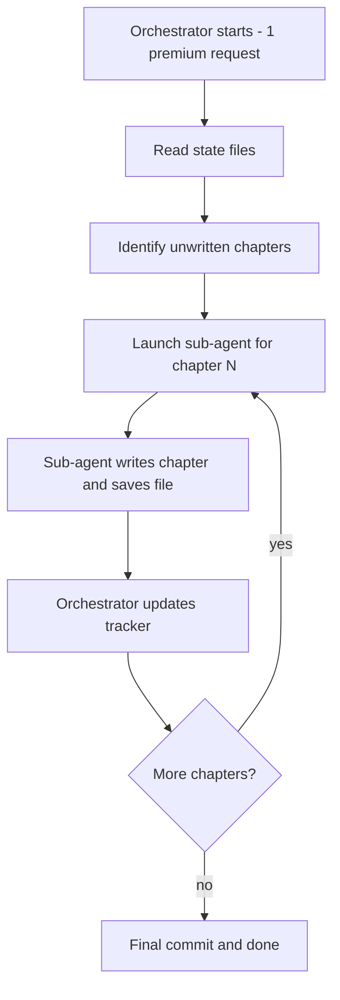

# Acceleralpho: Evolution of Coding Agents and Agentic Harnesses

Acceleralpho: Evolution of Coding Agents and Agentic Harnesses¶
A Strossian future history of the Boris era

About this book¶
Sometime around late 2024 and into 2025, the most capable software-writing systems in the world stopped living inside graphical IDEs and moved back to the terminal. This was not retro-chic nostalgia. It was physics. Coding agents operate at machine speed; IDEs were built for human eyes. The terminal — text in, text out, a numeric exit code — turned out to be the perfect substrate for both.

Acceleralpho traces that migration from "AI as a chat box" to "AI as a systems inhabitant." It covers the tools, the architectures, the companies, and the ideas that define the Boris era of software development: the period when autonomous agents became first-class participants in the production of code.

The title nods to Charles Stross's Accelerando — a future history told in relentless forward motion. The subtitle delivers on that promise: this is the definitive guide to coding agents and the agentic harnesses that make them safe, fast, and commercially useful.

A book about the rapid evolution of AI coding agents—from autocomplete to autonomous systems—written entirely by AI agents using a single-request orchestration loop.


## What is this?

This repository contains the manuscript and tooling for **"Acceleralpho"**, a book that traces the movement from "AI as a chatbox" to "AI as a systems inhabitant." The book covers coding agents like Claude Code, agentic harnesses, the Ralph Wiggum feedback loop, context engines, and the trajectory toward autonomous software development.

## How it works: Single-Request Sub-Agent Orchestration

This repo is designed so that the **entire book can be written within a single GitHub Copilot coding agent session** (1 premium request). Here is the key idea:

1. A **single orchestrator agent** starts and reads the project state files.
2. The orchestrator **delegates chapter writing to sub-agents** via the Task tool.
3. Each sub-agent runs in a separate context window but within the **same session** — no additional premium requests are consumed.
4. The orchestrator loops: delegate → collect → update tracker → commit → delegate more.
5. The result is a complete book manuscript produced by one premium request.



### Cost

| Model | Points | Result |
| --- | --- | --- |
| Sonnet | 1 point | Entire book via sub-agents |
| Opus | 3 points | Entire book via sub-agents |

## Repository structure

```
├── README.md                          # This file
├── RESEARCH_LOOP_PROMPT.md            # Main orchestrator prompt and rules
├── agents.md                          # Sub-agent roles and working agreement
├── scratchpad.md                      # Working state for the current iteration
├── mkdocs.yml                         # MkDocs config — builds the browseable book site
├── requirements-book.txt              # Python deps for building the book
├── build_book.sh                      # Build script: HTML site and/or PDF
└── docs/
    ├── index.md                       # Book landing page (home of the MkDocs site)
    ├── book-outline.md                # High-level book outline
    ├── book_style.md                  # Chapter style guide
    ├── chapter_tracker.md             # Per-section status tracker
    ├── references.md                  # Sources used
    ├── table-of-contents.md           # Full table of contents
    ├── part1/                         # Part I chapter files
    ├── part2/                         # Part II chapter files
    ├── part3/                         # Part III chapter files
    ├── part4/                         # Part IV chapter files
    └── part5/                         # Part V chapter files
```

## Getting started

To run the book-writing loop:

1. Open this repository on GitHub.
2. Tag `@copilot` on an issue or PR with: *"Read RESEARCH_LOOP_PROMPT.md and execute the orchestration loop. Write all unwritten chapters by delegating each to a sub-agent."*
3. The agent reads state, delegates chapters to sub-agents, and writes the book — all in one session.

For the full guide — including how to adapt this repo as a template for **your own book** — see **[RUNNING.md](RUNNING.md)**.

## Reading and publishing the book

Once chapters are drafted you can build a browseable HTML site and a downloadable PDF.

### Install dependencies (once)

```bash
pip install -r requirements-book.txt
```

### Build the HTML site

```bash
./build_book.sh          # outputs to book/
```

Open `book/index.html` in any browser, or serve it locally:

```bash
mkdocs serve             # live-reload preview at http://127.0.0.1:8000
```

### Build the HTML site + PDF in one step

```bash
./build_book.sh --pdf    # outputs book/  AND  book.pdf
```

### Build a PDF only (faster, via pandoc)

```bash
./build_book.sh --pdf-only   # outputs book.pdf only
```

> The generated `book/` directory and `book.pdf` are excluded from version control via `.gitignore`. Commit the source markdown; build the output locally or in CI.

## Note
- Copilot web agent times out after an hour

# Book
[pdf](book.pdf)

- or see book folder for html download

[notebook lm audio podcast](Why_AI_coding_agents_abandoned_the_IDE.m4a)

# Accelerando
- https://www.antipope.org/charlie/blog-static/fiction/accelerando/accelerando-intro.html
    - Lobsters - https://www.antipope.org/charlie/blog-static/fiction/accelerando/accelerando.html#Lobsters
- https://en.wikipedia.org/wiki/Accelerando
- Interview with Charles Stross - https://web.archive.org/web/20031203121129/http://www.scifi.com/sfw/issue343/interview.html
