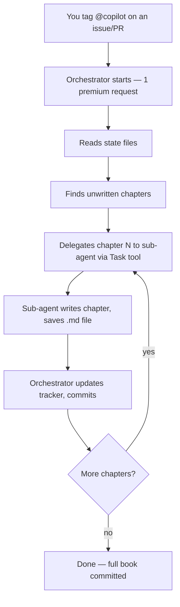

# Running This Repository: A Pattern for Writing Books with AI Agents

This document explains how to use this repository as a **reusable template** for writing any book using GitHub Copilot's coding agent with single-request sub-agent orchestration. It covers both "how to adapt this for your own book" and "how to execute it to produce the Acceleralpho book."

---

## Quick Start (Run This Book)

If you just want to produce the Acceleralpho book described in this repo:

1. Open this repository on GitHub.
2. Go to the **Issues** tab (or open a Pull Request).
3. Tag `@copilot` with a message like:

   ```
   @copilot Read RESEARCH_LOOP_PROMPT.md and execute the orchestration loop.
   Write all unwritten chapters by delegating each to a sub-agent.
   Update the chapter tracker and scratchpad after each batch.
   ```

4. Copilot will start a single coding agent session, read the state files, and begin delegating chapter writing to sub-agents — all within **one premium request**.

That's it. The agent reads the outline, identifies unfinished chapters from `docs/chapter_tracker.md`, and delegates each one to a sub-agent that writes the full chapter content.

---

## How It Works Under the Hood

### The Single-Request Trick

GitHub Copilot coding agents can spawn **sub-agents** via the Task tool. Each sub-agent runs in its own context window but within the **same billing session**. This means:

- The orchestrator (main agent) uses 1 premium request
- Each sub-agent call (chapter writer, researcher, verifier) costs **0 additional requests**
- The entire book can be produced in a single session



### File Roles

| File | Role |
| --- | --- |
| `RESEARCH_LOOP_PROMPT.md` | **The brain.** The orchestrator reads this first. Contains all rules, the sub-agent prompt template, and pedagogical guidelines. |
| `agents.md` | Describes the four agent roles (orchestrator, chapter writer, researcher, verifier) and the working agreement. |
| `docs/book-outline.md` | High-level book structure — parts, chapters, bullet-point topics. |
| `docs/table-of-contents.md` | Section-level TOC with exact numbering (1.1, 1.2, etc.). |
| `docs/book_style.md` | Style guide every chapter must follow (concept loops, callouts, verification checklists). |
| `docs/chapter_tracker.md` | Status table — which chapters are Planned, Drafted, or Verified. The orchestrator reads this to decide what to write next. |
| `scratchpad.md` | Working memory — action items, per-chapter notes, next steps. Updated after each batch. |
| `docs/references.md` | Accumulates sources used across all chapters. |
| `docs/partN/*.md` | The actual chapter files, organized by part number. |

### The Orchestration Loop

The orchestrator follows this cycle:

```
1. READ    — scratchpad.md, chapter_tracker.md, book-outline.md, book_style.md
2. SELECT  — pick unwritten chapters from the tracker
3. DELEGATE — for each chapter, launch a sub-agent with:
             • section number and title
             • the style guide (pasted in full)
             • relevant outline context
             • instructions to write + save the file
4. COLLECT — sub-agent returns, file is saved
5. UPDATE  — mark chapter as Drafted in tracker, update scratchpad
6. COMMIT  — push changes via report_progress
7. REPEAT  — go to step 2 if chapters remain
```

---

## Using This as a Template for Your Own Book

### Step 1: Fork or copy this repository

Create a new repo with the same structure. The key files you need:

```
├── RESEARCH_LOOP_PROMPT.md    ← customize for your book
├── agents.md                  ← usually unchanged
├── scratchpad.md              ← start empty or with initial notes
├── .gitignore                 ← keep src/ excluded
└── docs/
    ├── book-outline.md        ← YOUR book's outline
    ├── book_style.md          ← YOUR style preferences
    ├── chapter_tracker.md     ← seed with all planned sections
    ├── table-of-contents.md   ← YOUR full TOC
    ├── references.md          ← start empty
    └── part1/                 ← create partN/ dirs as needed
```

### Step 2: Write your book outline

Edit `docs/book-outline.md` with your book's structure. Example:

```markdown
## Part I: Foundations
### Chapter 1: What Is Machine Learning?
* 1.1 The Prediction Problem
* 1.2 Supervised vs. Unsupervised Learning
* 1.3 Your First Model in Python
```

### Step 3: Create the table of contents

Expand the outline into `docs/table-of-contents.md` with exact section numbers.

### Step 4: Seed the chapter tracker

Create `docs/chapter_tracker.md` with every section set to "Planned":

```markdown
| Section | Status | File | Notes |
| --- | --- | --- | --- |
| 1.1 The Prediction Problem | Planned | — | Start here. |
| 1.2 Supervised vs. Unsupervised | Planned | — | Needs diagrams. |
```

### Step 5: Customize the style guide

Edit `docs/book_style.md` to match your preferences:
- Change the concept-loop count (3–6 is the default)
- Adjust callout styles
- Set your language preferences (Python, Rust, etc.)
- Define your verification standard

### Step 6: Customize the orchestrator prompt

Edit `RESEARCH_LOOP_PROMPT.md`:
- Change the book title and description
- Update the sub-agent prompt template with your book's name
- Adjust any topic-specific rules

### Step 7: Initialize the scratchpad

Write initial notes in `scratchpad.md`:

```markdown
# Scratchpad
## Next orchestrator actions
1. Write chapter 1.1 first as the bootstrap chapter.
2. Use 1.1 as the template for all future chapters.
```

### Step 8: Run it

Tag `@copilot` on an issue or PR:

```
@copilot Read RESEARCH_LOOP_PROMPT.md and execute the orchestration loop.
Write all unwritten chapters by delegating each to a sub-agent.
```

### Step 9: Iterate

After the first run, some chapters may need refinement. You can:
- Edit `scratchpad.md` with specific improvement notes
- Change a chapter's status back to "Planned" in the tracker
- Run the loop again — it will only write chapters marked as "Planned"

---

## Advanced Patterns

### Writing a single chapter

If you only want one chapter written:

```
@copilot Read RESEARCH_LOOP_PROMPT.md. Write only chapter 3.1 by delegating
it to a sub-agent. Update the tracker when done.
```

### Research before writing

For chapters that need current information:

```
@copilot Before writing chapter 7.1, use a research sub-agent to gather
the latest information about DeepSeek V3 and Qwen models. Then delegate
the chapter writing to a chapter-writer sub-agent with those findings.
```

### Verification pass

After all chapters are drafted:

```
@copilot Read all chapter files under docs/. For each code example,
delegate a verification sub-agent to run it and confirm the output matches
what's documented. Report any mismatches.
```

### Partial runs and resumption

The loop is **resumable by design**. If a session times out:
- The tracker shows which chapters were completed
- The scratchpad has notes on what was in progress
- A new session picks up exactly where the last one left off

---

## Cost Summary

| Action | Premium requests consumed |
| --- | --- |
| Start orchestrator | 1 (Sonnet = 1 point, Opus = 3 points) |
| Each sub-agent call | 0 (runs within same session) |
| Full 30-chapter book | 1 total |
| Resumption after timeout | 1 more (new session) |

---

## Troubleshooting

### The agent writes chapters directly instead of delegating

Make sure `RESEARCH_LOOP_PROMPT.md` clearly states: "Delegate chapter writing to sub-agents — do NOT write chapters directly." The orchestrator's `custom_instruction` in `.github/copilot-instructions.md` (if present) should reinforce this.

### A sub-agent produces incomplete output

The sub-agent has a separate context window. If a chapter is too large, it may be truncated. Solutions:
- Break large chapters into smaller sections
- Use the `task` agent type for simpler chapters and `general-purpose` for complex ones

### The session times out before all chapters are written

This is expected for very large books. The loop is resumable:
1. Check `docs/chapter_tracker.md` to see what's done
2. Run the loop again — it skips completed chapters

### Code examples fail verification

The verifier sub-agent runs examples in `./src`. If an example fails:
- Check that all dependencies are available in the agent's environment
- Simplify the example to use only standard library features
- Update the "Observed output" in the chapter to match actual behavior
