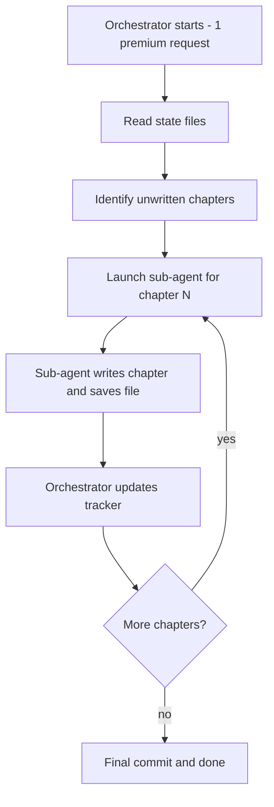

# Available Agents

This repository is designed to write the entire book in a **single GitHub Copilot coding agent session** by using sub-agent delegation. The orchestrator agent consumes one premium request; all chapter-writing work is delegated to sub-agents that run within the same session.

## Architecture: Single-Request Orchestration

All sub-agent calls happen inside the same session. **No additional premium requests are consumed.**

## Recommended roles

### Orchestrator (main agent)
- Reads all state files (`scratchpad.md`, `docs/chapter_tracker.md`, `docs/book-outline.md`, `docs/book_style.md`)
- Decides which chapters to write next
- Delegates each chapter to a sub-agent via the Task tool
- Updates tracking files after each batch
- Commits results with `report_progress`

### Chapter Writer (sub-agent via Task tool)
- **Agent type:** `general-purpose` (for full reasoning capability) or `task` (for lighter work)
- Receives the chapter topic, style guide, and outline context
- Writes a complete chapter section following `docs/book_style.md`
- Saves the chapter file to the correct `docs/partN/` path
- Verifies any code examples by running them

### Research Agent (sub-agent via Task tool)
- **Agent type:** `explore` for codebase questions, `general-purpose` for web research
- Gathers information needed for a chapter before writing begins
- Returns findings to the orchestrator for inclusion in chapter-writer prompts

### Verification Agent (sub-agent via Task tool)
- **Agent type:** `task`
- Runs code examples from chapters in `./src`
- Confirms output matches what the chapter documents
- Reports pass/fail back to the orchestrator

## Working agreement

1. The orchestrator reads `RESEARCH_LOOP_PROMPT.md`, `docs/chapter_tracker.md`, and `scratchpad.md` at the start.
2. All chapter writing is delegated to sub-agents — the orchestrator does NOT write chapters directly.
3. Each sub-agent writes one chapter section at a time.
4. After each batch, the orchestrator updates `scratchpad.md`, `docs/chapter_tracker.md`, and `docs/references.md`.
5. The orchestrator uses `report_progress` to commit after each batch.
6. The loop continues until all planned chapters are drafted.

## Cost model

| Model | Points per request | Chapters per request |
| --- | --- | --- |
| Sonnet | 1 point | All (via sub-agents) |
| Opus | 3 points | All (via sub-agents) |

The key insight: sub-agent calls via the Task tool do **not** consume additional premium requests. The entire book-writing process — research, drafting, verification, and tracking — runs within a single orchestrator session.
