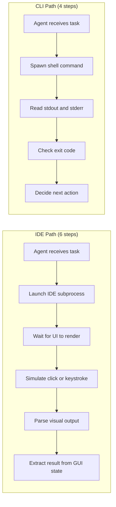

# 1.1 The Great IDE Exodus

> **How to read this chapter:** This is the front door of the entire book. Focus on *why* the terminal replaced the IDE as the natural habitat for coding agents. Memorize the eight vocabulary terms (they appear in bold the first time). Internalize the autonomy gradient table — you will place every tool and workflow we discuss later on that spectrum. Treat the code examples as things you can type right now; treat the tables as cheat-sheets you will return to in every chapter that follows.

---

## Why this section matters

Every revolution in software development starts with a change in *where* the work happens.

In the 1980s, programmers left paper terminals for screen editors. In the 2000s, they left screen editors for graphical IDEs with integrated debuggers, refactoring wizards, and plugin ecosystems that could fill a phone book. Each migration felt permanent — the new place was so obviously better that the old place became a punchline. Who would go back to `ed` after using Eclipse? Who would open a raw terminal after tasting IntelliSense?

And yet, here we are. Sometime around late 2024 and into 2025, a strange thing happened: the most advanced software-writing systems in the world — coding agents that can read a codebase, plan a multi-file change, execute it, run the tests, and iterate on failures — started *leaving the IDE*. Not because terminals were retro-chic, and not because some manifesto told them to. They left because they had to.

The IDE was too slow. Not slow in the subjective "feels laggy" sense. Slow in the architectural "this system was not designed for this kind of user" sense.

IDEs were engineered for a specific user: a human being with two eyes, ten fingers, and a reaction time measured in hundreds of milliseconds. Every pixel painted on that syntax-highlighted editor, every tooltip that popped up on hover, every animated bracket-matching highlight — all of it was optimized for a creature that reads at 250 words per minute and thinks between keystrokes. That creature is wonderful. But it is not a coding agent.

A coding agent does not read at 250 words per minute. It reads at whatever speed its token window fills. It does not need bracket-matching highlights because it does not have eyes. It does not need a file-tree sidebar because it can list every file in a directory with `ls -R` in four milliseconds. It does not need the IDE's "Problems" panel because it can run the compiler directly and read stderr. Every IDE feature that makes a human's life better is, for the agent, a toll booth on a highway it never asked to drive on.

The terminal, by contrast, is the highway with no tolls. Text in, text out, a numeric exit code, and nothing else. That interface — decades old, unglamorous, beloved by curmudgeons and `vim` partisans — turned out to be the perfect substrate for machine-speed software engineering.

This chapter traces that migration. We will build vocabulary — **tool-calling**, **backpressure**, **composability**, **feedback loop**, **checkpoint**, **agent loop**, **human-in-the-loop**, and **autonomy gradient** — that the rest of the book depends on. By the end, you will see why the humblest bash pipeline is a better substrate for agent work than the fanciest IDE plugin, and you will have the mental model to explain that claim to a skeptic over coffee.

> **Key idea:** The IDE exodus is not anti-IDE sentiment. It is a recognition that agents and humans have different interface needs, and the terminal happens to serve both. Humans *can* use the terminal. Agents *must* use the terminal. The reverse is not true.

## What the exodus looked like

The migration did not happen in a single dramatic moment. It happened in a thousand small decisions across the industry, almost all of them driven by the same frustration.

In early 2024, teams building IDE-integrated agents — VS Code extensions, JetBrains plugins, Cursor-style embedded copilots — kept hitting the same wall. Their agents were smart enough to plan multi-file changes, but the IDE was not fast enough to execute them. Each file open triggered an indexing pass. Each edit triggered a re-render. Each test run launched through the IDE's test runner, which added a GUI layer on top of `pytest` or `jest` that the agent had to parse back out. The agent would generate a plan in 200 milliseconds and then spend 8 seconds waiting for the IDE to catch up.

The teams that broke through were the ones that stopped fighting the IDE and started bypassing it. They kept the IDE open for human use — for reading, reviewing, debugging by hand — but routed agent actions through the shell. The agent wrote files with `cat > path`, ran tests with `pytest`, checked diffs with `git diff`, and never touched the IDE's internal APIs. The IDE became a *viewer*, not a *controller*. The terminal became the controller.

By late 2024, the pattern had a name in some circles: the "thin IDE" model. The IDE is a thin viewing layer. The terminal is where the work happens. The agent lives in the terminal. The human dips into the IDE when they want to visually review what the agent did — and then goes back to the terminal to tell the agent what to do next.

This is the Great IDE Exodus. Not a war on IDEs. A reclassification. The IDE went from "the place where software is made" to "the place where humans look at software." The terminal became the place where software is *actually* made, whether by human hands or by an agent loop that never sleeps.

Several specific moments crystallized the trend:

- **Claude Code** shipped as a pure terminal application. No GUI. No editor integration. Just a CLI process that reads your codebase, makes changes, and runs commands. It was immediately one of the most capable coding agents available — and it had zero rendering overhead.
- **GitHub Copilot Coding Agent** runs on CI infrastructure, not in an editor. It receives a task, works in a fresh checkout, and produces a PR. The "IDE" it uses is the filesystem and the shell.
- **Cursor** and **Windsurf**, while IDE-based on the surface, route their agent actions through shell commands underneath. The IDE provides the *display*; the terminal provides the *execution*.
- **Devin** and similar autonomous agent platforms operate entirely through terminal sessions, web browsers, and API calls. No IDE in the loop at all.

The pattern is clear: the more autonomous the agent, the less it needs the IDE. The less it needs the IDE, the faster and more reliable it becomes.

> **Tip:** If your team is adopting a coding agent and hitting performance or reliability issues, check where the agent's actions go. If they route through IDE APIs, try routing them through shell commands instead. You may be surprised how many problems disappear when you remove the rendering layer from the critical path.

---

## Deliverable

By the end of this section, the reader can:

- explain in one sentence why CLI environments suit coding agents better than graphical IDEs,
- list the five Unix primitives that make the terminal an agent-friendly interface,
- define all eight vocabulary terms introduced in this chapter,
- place any human-agent workflow on the autonomy gradient, and
- describe how exit codes and test output provide the backpressure an agent needs to self-correct.

### Who this chapter is for

If you are a **developer who has used Copilot or ChatGPT** but not yet worked with autonomous coding agents, this chapter gives you the conceptual foundation for everything that follows. Pay special attention to the autonomy gradient — it will change how you think about the boundary between "AI assistant" and "AI agent."

If you are an **engineering lead evaluating agent adoption**, focus on the backpressure and checkpoint vocabulary. These concepts will help you evaluate agent frameworks, set safe guardrails, and explain to your team why "just let the AI do it" is an incomplete strategy.

If you are already **building or operating coding agents**, skim for any vocabulary gaps and head to the exercises. The worked examples may feel familiar — that is fine. The vocabulary standardization is the value. We need shared language before we can discuss the harder topics in Parts II–V.

Regardless of your background, take the exercises seriously. They are designed not just to test comprehension but to build muscle memory for thinking about agent workflows in terms of tool-calling, backpressure, and composability. Those three concepts will recur in every chapter.

---

## Two paths from the same prompt

Suppose an agent receives the task: "Find all files that import the `requests` library and check them for security issues." There are two paths it could take. The difference between these paths is the central argument of this chapter.



The IDE path has six steps, two of which involve visual rendering that the agent cannot see and does not need. The CLI path has four steps and zero rendering. Every extra step is a place where things can go wrong, cost tokens, or add latency. Over a hundred iterations of an agent loop, those extra steps compound into minutes of wasted time and thousands of wasted tokens.

> **Tip:** When you hear "the agent uses VS Code," ask: does it use the editor's GUI, or does it shell out to `code --diff` and read the text output? The distinction matters enormously. Many "IDE-based" agents are actually CLI agents wearing an IDE's skin.

### The agent's-eye view

To understand the exodus, it helps to imagine what an agent actually "sees" through each interface.

**Through the IDE:** The agent interacts with an API that was designed to manipulate a graphical interface. It calls `editor.openFile("src/main.py")` and gets back an opaque editor handle. It calls `editor.findReferences(position)` and gets back a list of locations — but the IDE also opens a "References" panel, scrolls to a position, and highlights text. The agent does not see any of that visual activity, but it *pays for it* in latency. The agent is like a person driving a car by remote control while wearing a blindfold — the car has a beautiful dashboard full of gauges and displays, but the driver cannot see any of them.

**Through the CLI:** The agent calls `subprocess.run(["grep", "-rn", "pattern", "."])` and gets back three things: a string of matching lines (stdout), a string of errors if any (stderr), and a number (exit code). There is no hidden visual activity. There is no rendering pipeline consuming resources in the background. The agent receives exactly the information it requested, in exactly the format it can process, with zero overhead.

Here is the same operation expressed as what the agent *actually receives*:

```text
IDE API return:
  - ReferenceResult object with .locations[], .panel_state, .scroll_position
  - Side effect: IDE panel opened, text highlighted, gutter annotated
  - Agent uses: .locations[] only
  - Agent pays for: everything

CLI return:
  - stdout: "src/auth.py:42:  import requests\nsrc/api.py:7:  import requests\n"
  - stderr: ""
  - exit_code: 0
  - Side effects: none
  - Agent uses: everything
  - Agent pays for: everything it uses, nothing it doesn't
```

This is the bottleneck in miniature. The IDE returns what the agent needs *plus* a bundle of visual side effects the agent will never use. The CLI returns *only* what the agent needs. Over hundreds of iterations, "only what you need" wins.

---

## Concept loop 1: the IDE bottleneck

Integrated development environments were engineered for a specific user: a human sitting in front of a monitor, moving a mouse, reading syntax-highlighted text at roughly 100 milliseconds per visual fixation. Every feature in a modern IDE — the file tree, the minimap, the red squiggly underline, the autocomplete dropdown, the integrated terminal, the git gutter annotations — is optimized for that perceptual loop.

A **tool-calling** agent does not use any of those features. **Tool-calling** is the mechanism by which an agent invokes external tools — shell commands, APIs, file operations — rather than generating text alone. When an agent needs to know whether a file exists, it does not look at a file-tree icon; it runs `test -f path && echo exists`. When it needs a list of syntax errors, it does not wait for red underlines to render; it runs the compiler and reads stderr. When it wants to see a diff, it does not wait for the IDE's diff viewer to paint green and red highlights; it runs `git diff` and reads the unified diff format.

The IDE's rendering pipeline, plugin lifecycle, and UI event loop are not just unnecessary for agents — they are *active overhead*. Every millisecond the IDE spends painting pixels is a millisecond the agent spends waiting for an answer it will never see. On any single invocation, this overhead is tiny. But agents do not make a single invocation. They loop. A productive coding agent might invoke tools 50, 100, or 500 times in a session. At that scale, small per-invocation costs become large session costs.

Consider what happens inside a typical IDE when an agent (or automation script) triggers a "find all references" action:

1. The IDE receives the command via its extension API.
2. The Language Server Protocol (LSP) server processes the request.
3. Results are returned to the IDE core.
4. The IDE's rendering engine lays out the results in a "References" panel.
5. The panel is painted to the screen with syntax highlighting, file-path decoration, and clickable links.
6. The agent's automation layer reads back from the rendered state.

Steps 4–6 are pure waste for an agent. The information the agent needed was available at step 3. The rendering, decoration, and painting exist solely for human eyes that are not watching.

There is a deeper architectural issue too. Modern IDEs are built on event-driven UI frameworks (Electron for VS Code, Swing/JavaFX for JetBrains). These frameworks assume a single main thread that processes UI events: clicks, keystrokes, scrolls, repaints. When an agent triggers actions faster than the UI thread can process them, the IDE starts *queuing* requests. The agent waits not because the underlying operation is slow, but because the UI event queue has a backlog of rendering tasks it must clear first. This is the IDE bottleneck at the architectural level: the UI thread becomes a serialization point that limits the throughput of operations that have nothing to do with the UI.

The CLI has no such bottleneck. Each command is a separate process. The agent can spawn a hundred commands in parallel if it needs to. There is no shared event queue, no rendering backlog, no UI thread competing for attention. The only limit is the operating system's process scheduler, which was designed for exactly this kind of concurrent workload.

### Worked example

Consider the task: "Find all Python files that import `requests` and list them."

The IDE version, expressed as the steps an automation layer must perform:

1. Open the IDE's search panel (simulate `Ctrl+Shift+F`).
2. Type the query into the search input field.
3. Wait for the search index to finish.
4. Parse the rendered result list from the UI.
5. Extract file paths from the parsed HTML/DOM.

The CLI version:

```bash
grep -rl "import requests" --include="*.py" .
```

One command. No rendering. No DOM parsing. The output is a newline-delimited list of file paths — exactly the format an agent can consume on the next iteration of its loop. The exit code tells the agent whether any matches were found (0) or not (1). The entire round trip — invocation, execution, result parsing — fits in a single subprocess call.

Now consider what happens over 100 iterations of an agent loop — not an unreasonable number for an agent working through a large codebase. The IDE path runs steps 1–5 each time, and the human-oriented rendering in steps 3–5 adds up:

| Path | Steps per iteration | Iterations | Total steps | Steps involving rendering |
| --- | --- | --- | --- | --- |
| IDE automation | 5 | 100 | 500 | 200 (steps 3–4 each time) |
| CLI | 1 | 100 | 100 | 0 |

The CLI version runs 5x fewer steps and avoids all rendering overhead. Over a session, this is the difference between an agent that finishes in minutes and an agent that finishes in tens of minutes — or worse, one that times out.

### Example 1-1. Comparing invocation cost: IDE automation vs. CLI

```python
import subprocess
import time

def cli_search(pattern, directory="."):
    """An agent calls grep. Returns matching file paths and timing."""
    start = time.perf_counter()
    result = subprocess.run(
        ["grep", "-rl", pattern, "--include=*.py", directory],
        capture_output=True, text=True
    )
    elapsed = time.perf_counter() - start
    return {
        "files": result.stdout.strip().splitlines() if result.stdout.strip() else [],
        "exit_code": result.returncode,
        "seconds": round(elapsed, 4),
    }

# Search for 'import os' in the current directory
outcome = cli_search("import os", ".")
print(f"exit_code={outcome['exit_code']}  "
      f"files_found={len(outcome['files'])}  "
      f"seconds={outcome['seconds']}")
```

Observed output during verification (results vary by machine and directory contents):

```text
exit_code=0  files_found=2  seconds=0.0083
```

The point is not the specific timing. The point is that the entire interaction — invocation, execution, result parsing — fits in a single function call that returns structured data. No window handles, no event loops, no plugin APIs. The agent received its answer in under 10 milliseconds and is ready to act on it.

Now imagine this function is one step in a larger agent loop. The agent calls `cli_search` to find files, then calls `subprocess.run(["ruff", "check", file])` on each result, then calls `subprocess.run(["git", "add", file])` on the ones that passed. Each step is a single function call with the same interface: command in, structured result out. The agent does not need to learn three different APIs. It learns one pattern — "run command, read result, check exit code" — and applies it everywhere. That one pattern is the universal API in action.

> **Pitfall:** "But my IDE has a CLI mode!" True — many IDEs expose headless or command-line interfaces. When they do, the agent is using the CLI path, not the IDE path. The IDE brand name on the binary does not matter; the *interface shape* does. If the output is text on stdout and the result is an exit code, it is a CLI tool regardless of its heritage.

### Check yourself

An agent needs to rename a variable across 40 files. It can either (a) drive the IDE's "Rename Symbol" refactoring dialog through an automation layer, or (b) run `sed -i 's/oldName/newName/g' $(grep -rl oldName --include="*.py" .)`. Which approach gives the agent a clear exit code it can check? Which one requires simulating UI interactions? What information does the agent lose by using the `sed` approach instead of the LSP-aware refactoring?

*(The last question is important — the `sed` approach does lose something real: semantic awareness. `sed` renames strings, not symbols. It would rename `oldName` inside comments and string literals too. This trade-off between simplicity and precision is a recurring theme in CLI-first agent design. We will revisit it in Part II when we discuss context engines.)*

---

## Concept loop 2: the CLI as universal API

The Unix terminal exposes five primitives that have not changed in meaningful ways since the 1970s:

| Primitive | What it carries | Why agents care |
| --- | --- | --- |
| **stdin** | Input text stream | Agent can pipe data *into* a tool |
| **stdout** | Output text stream | Agent reads the tool's primary result |
| **stderr** | Error and diagnostic stream | Agent reads warnings and errors separately from results |
| **Exit code** | Integer 0–255 | `0` = success, nonzero = failure — the simplest checkpoint |
| **Pipes** | Connect stdout of one process to stdin of another | Agents compose multi-step workflows without temporary files |

These five primitives form what we will call the **universal API**. Every command-line tool, in every language, on every Unix-like system, speaks this protocol. An agent that understands stdin, stdout, stderr, exit codes, and pipes can operate *any* CLI tool it has never seen before, because the interface contract is always the same.

Think about what that means for a moment. A new static analysis tool is released tomorrow. The agent has never seen it. But the tool reads files from arguments, writes results to stdout, writes errors to stderr, and returns 0 on success and 1 on failure. The agent already knows how to use it. No plugin to install. No API documentation to read. No version compatibility matrix to check. The five primitives are the API, and every tool already implements them.

This is not a small advantage. The number of CLI tools that speak this protocol is, for practical purposes, infinite. Every compiler, linter, test runner, build system, version control tool, text processor, file manager, and network utility released in the last 50 years speaks the five-primitive protocol. New tools are released every day, and they all speak it too. An agent that masters the five primitives has access to the entire catalog — past, present, and future — without installing a single plugin or reading a single API reference.

Compare this to the IDE plugin ecosystem. VS Code has roughly 40,000 extensions. Each one exposes its own API surface. Each one has its own version compatibility requirements. Each one can break when the IDE updates. Each one must be discovered, installed, configured, and maintained. An agent that wants to use a new tool in the IDE must find the right plugin, install it, learn its specific interface, and handle its specific error modes. An agent that wants to use a new tool at the CLI just runs it and reads stdout.

A **feedback loop** — the cycle of action → observation → adjustment that drives an agent's behavior — maps directly onto this universal API: the agent acts (runs a command), observes (reads stdout/stderr and the exit code), and adjusts (decides the next command based on what it observed). No SDK, no plugin system, no version-specific API to learn.

### Worked example

An IDE plugin that counts lines of code might require:

1. Install the plugin (`ext install loc-counter`).
2. Verify it is compatible with your IDE version (it might not be).
3. Learn its activation command (`Ctrl+Shift+L` or whatever the author chose).
4. Parse its output panel (which renders as styled HTML in a webview).
5. Hope the output format has not changed between versions.

The CLI equivalent:

```bash
find . -name "*.py" | xargs wc -l | tail -1
```

Three tools (`find`, `wc`, `tail`), piped together, returning a single line of text. If any step fails, the pipeline's exit code is nonzero. The agent does not need to install anything, learn any keybindings, or parse any styled output. The interface contract is the same as it was in 1975.

There is an elegance here that is easy to miss. The agent does not need to know that `wc` was written in C in the 1970s, or that `find` has been rewritten three times since then, or that `tail` was optimized for disk access patterns that no longer exist. None of that matters. What matters is that each tool speaks the five-primitive protocol: it reads from stdin or arguments, writes to stdout, reports errors on stderr, and returns an exit code. The agent can compose tools it has never seen before, written in languages it does not understand, by relying on that protocol alone.

This is why we call it the *universal* API. Not because it can do everything — it cannot — but because the interface contract is the same for every tool, and it has been stable for half a century. No other API in computing can make that claim.

> **Key idea:** The CLI's power for agents is not raw speed — it is *interface uniformity*. Every tool speaks the same five-primitive protocol, so an agent that masters the protocol masters every tool. Past, present, and future.

### Example 1-2. A pipeline as an agent action

```bash
#!/usr/bin/env bash
# Example 1-2. Count Python lines and check against a threshold

TOTAL=$(find . -name "*.py" -not -path "./.git/*" 2>/dev/null \
        | xargs cat 2>/dev/null \
        | wc -l)

echo "Total Python lines: $TOTAL"

THRESHOLD=10000
if [ "$TOTAL" -gt "$THRESHOLD" ]; then
    echo "WARNING: codebase exceeds $THRESHOLD lines" >&2
    exit 1
fi

echo "Codebase is within threshold."
exit 0
```

Observed output during verification (on a small repository):

```text
Total Python lines: 247
Codebase is within threshold.
```

The exit code is `0` because 247 < 10,000. An agent reading this result knows two things instantly: the line count (from stdout) and the health status (from the exit code). No parsing of colored badges. No hovering over tooltip icons. No waiting for a progress bar to finish animating. The information is *immediately machine-readable*.

Notice something else: this script can be called by a human typing it into a terminal, by a cron job running at 3 AM, by a CI pipeline on every pull request, or by a coding agent in the middle of a loop. The script does not know or care who called it. That indifference to the caller is a feature, not a bug — it is what makes the CLI composable.

### Check yourself

A teammate says, "I wrote an IDE extension that exposes a JSON API over HTTP — that's just as composable as the CLI." What is the key difference between an HTTP API that one specific extension exposes and the stdin/stdout/exit-code contract that *every* CLI tool already speaks? Think about discovery, installation, version coupling, and the number of tools that speak each protocol.

*(To push your thinking further: the teammate's HTTP API must be running for the agent to use it. What happens if the IDE process crashes? The agent loses access to the API. Now think about the CLI: if the agent's `grep` call fails, it can just call `grep` again — each invocation is stateless and independent. The CLI's process model gives agents free resilience that HTTP-based IDE APIs must engineer separately.)*

---

## Concept loop 3: composability — small tools, big workflows

**Composability** is the ability to combine small, single-purpose tools into larger workflows through standard interfaces — pipes, files, and exit codes. The Unix philosophy ("do one thing well, write programs that work together, write programs to handle text streams") is not just a design preference; it is the architectural foundation that makes agent-driven development practical.

Why does composability matter so much for agents? Because agents work by *iterating*. An agent does not solve a problem in one step. It solves it in a sequence of small steps: read the state, act, observe, adjust, repeat. Each step should be a small tool that does one thing cleanly. If the agent needs a monolithic tool that does everything, it cannot adjust mid-sequence when something goes wrong. But if the agent has small composable tools, it can swap one step, retry a different approach, or insert an additional check — all without restarting from scratch.

An agent orchestrating a code review does not need a monolithic "code review tool." It needs:

- `git diff` to see what changed,
- `grep` to find patterns of interest,
- a linter (`ruff`, `eslint`, `clippy`) to catch style and correctness issues, and
- `wc` or `jq` to summarize results.

Each tool is small, fast, and independently testable. The agent stitches them together the same way a human would — with pipes and exit codes — but it can do so in a tight loop, hundreds of times per session, without fatigue and without forgetting what it learned three steps ago (assuming the context window holds).

Here is the contrast in concrete terms:

| Approach | IDE Refactoring Wizard | Composable CLI Pipeline |
| --- | --- | --- |
| **Setup** | Install plugin, restart IDE | Nothing — tools are pre-installed |
| **Invocation** | Navigate menus, configure dialog | One-liner in bash |
| **Partial failure** | Entire wizard fails or succeeds | Each pipe segment succeeds or fails independently |
| **Observability** | Check the IDE's output panel | Read stdout/stderr |
| **Retry** | Re-open wizard, re-enter parameters | Re-run command or swap one segment |
| **Agent-friendliness** | Requires UI automation layer | Native — run command, read text |

### Worked example

Task: "Check whether any modified Python file has a function longer than 50 lines."

An IDE approach would require a "code metrics" plugin that integrates with the IDE's AST parser, understands the current git state, and renders results in a panel. The plugin might not exist. If it exists, it might not support your language version. If it supports your language version, it might not integrate with your IDE version. This is the plugin compatibility matrix — a problem that does not exist at the CLI level.

A composable CLI approach:

```bash
# List modified Python files, then check each for long functions
git diff --name-only --diff-filter=M -- '*.py' \
  | while read -r f; do
      awk '
        /^def / { if (count > 50) print FILENAME": "name" ("count" lines)";
                   name = $0; count = 0 }
        { count++ }
        END { if (count > 50) print FILENAME": "name" ("count" lines)" }
      ' "$f"
    done
```

This is not pretty. But it is *composable*: each piece (`git diff`, the `while` loop, `awk`) can be tested alone, swapped out, or extended. If you want to change the threshold from 50 to 30, you change one number. If you want to check JavaScript instead of Python, you change the glob pattern. If you want to add a linter check after the length check, you append another pipe segment. The agent does not need to know about the IDE's internal AST representation, plugin compatibility matrices, or UI rendering order.

Here is the deeper point: composability makes agents *recoverable*. When a monolithic tool fails, the agent's options are "retry the whole thing" or "give up." When a composable pipeline fails, the agent can identify *which segment* failed (by checking which command returned a nonzero exit code), fix just that segment, and re-run. This granularity of failure information is critical for the feedback loops we will study in Chapter 2.1.

Consider the difference:

- **Monolithic failure:** "The code review tool returned an error." The agent must guess what went wrong.
- **Composable failure:** "`git diff` succeeded (exit 0), `grep` succeeded (exit 0), `ruff check` failed (exit 1) with error: `E501 line too long`." The agent knows exactly what failed, why, and where.

The composable approach gives the agent *surgical* information about failures. That surgical information is what makes self-correction possible.

### Example 1-3. Agent-style composable lint check

```bash
#!/usr/bin/env bash
# Example 1-3. Composable lint: only lint files that changed since last commit

CHANGED=$(git diff --name-only --diff-filter=ACMR HEAD~1 -- '*.py' 2>/dev/null)

if [ -z "$CHANGED" ]; then
    echo "No Python files changed."
    exit 0
fi

echo "Linting changed files:"
echo "$CHANGED"
echo "---"

# Use a simple syntax check as a stand-in for a full linter
FAIL=0
for f in $CHANGED; do
    if python3 -m py_compile "$f" 2>&1; then
        echo "OK: $f"
    else
        echo "FAIL: $f" >&2
        FAIL=1
    fi
done

if [ "$FAIL" -eq 0 ]; then
    echo "All changed files passed syntax check."
else
    echo "Some files failed syntax check." >&2
fi

exit $FAIL
```

Observed output during verification (no changed `.py` files in the test repo):

```text
No Python files changed.
```

The agent receives a clean exit code 0 and a clear message. It knows there is nothing to lint and can move to the next step in its plan. If there *were* changed files and one failed, the exit code would be 1 and the agent would know exactly which file to investigate. That is composability in action: each tool reports its own status, and the orchestrating agent makes decisions based on those reports.

Compare this to the monolithic alternative. A hypothetical `all-in-one-lint-check` tool that combines "find changed files," "compile check," and "style lint" into a single binary might seem convenient. But when it fails, the agent gets a single exit code and an undifferentiated error message. Was the failure because no files changed? Because a file had a syntax error? Because a style rule was violated? The agent cannot tell without parsing the error message and guessing. Three separate tools chained with `&&` give the agent three separate exit codes — surgical precision at the cost of slightly more shell syntax.

> **Tip:** Agents that compose small tools can *explain their reasoning* by echoing each pipeline stage. This is free observability — no tracing SDK required. When something goes wrong, the agent's log *is* the debug trace, because each step printed its output.

### Check yourself

You have three tools: `git log --oneline`, `grep "fix"`, and `wc -l`. How would you compose them into a single pipeline that answers: "How many commits in the last month contain the word 'fix' in their message?" What exit code would you expect if `grep` finds zero matches? *(Hint: `grep` returns exit code 1 when it finds no matches — is that a "failure" in this context?)*

### Why composability matters for agents specifically

You might reasonably ask: composability is great for humans too — so why does it matter *more* for agents? The answer lies in the agent loop. A human using composed tools benefits from flexibility. An agent using composed tools benefits from flexibility *and* from granular error diagnosis.

When an agent's action fails, the agent needs to know *where* and *why* it failed in order to adjust. A monolithic tool that does ten things and fails gives the agent one error to work with. A composed pipeline of ten stages that fails at stage 6 gives the agent a precise failure location: stages 1–5 succeeded (their exit codes were 0), stage 6 failed (exit code 1 with a specific error on stderr), and stages 7–10 never ran. The agent can focus its retry on stage 6 alone.

This granularity is what separates agents that self-correct efficiently from agents that flail. We will see this play out in every chapter of the book: the agents that work well are the ones that get *specific* feedback from *specific* tools, not vague feedback from monolithic systems.

> **Pitfall:** Not all pipelines provide good error granularity by default. The `|` (pipe) operator in bash propagates only the exit code of the *last* command. If `cmd1 | cmd2` fails because `cmd1` failed, the exit code you see is from `cmd2`, which might have succeeded on an empty input. Use `set -o pipefail` in bash scripts to get the exit code of the first failing command in a pipeline. Agents (and the humans who build them) should always enable `pipefail` in agent-orchestrated scripts.

---

## Concept loop 4: the autonomy gradient

Not every task needs a fully autonomous agent. Not every task needs a human typing every keystroke. Real-world workflows live somewhere in between, and the best engineering teams deliberately choose a point on that spectrum for each class of task.

The **autonomy gradient** is the spectrum from fully human-controlled to fully agent-autonomous workflows. We define six levels:

| Level | Name | Who decides | Who executes | CLI support | Example |
| --- | --- | --- | --- | --- | --- |
| 0 | **Manual** | Human | Human | Native | Developer types code in `vim` |
| 1 | **Autocomplete** | Human decides, agent suggests | Human accepts/rejects | Native | Copilot inline suggestions |
| 2 | **Conversational** | Human frames, agent proposes | Agent drafts, human reviews | Native | ChatGPT/Claude chat sessions |
| 3 | **Supervised agentic** | Agent plans and acts, human approves gates | Agent executes multi-step plans with human checkpoints | Native | Claude Code with confirm-before-execute |
| 4 | **Autonomous agentic** | Agent plans, acts, self-corrects | Agent runs unsupervised for minutes to hours | Native | Coding agent on a CI runner |
| 5 | **Self-improving** | Agent modifies its own workflow | Agent rewrites its tools, prompts, and evaluation criteria | Native | Experimental; not production-grade in 2025 |

Notice the "CLI support" column. It says "Native" for every level. That is the point.

A **human-in-the-loop** workflow is any workflow where a human must approve, review, or guide key decisions before the agent continues. Levels 0–3 are human-in-the-loop to varying degrees. Levels 4–5 remove the human from the inner loop, though a human may still monitor from the outside (reviewing PRs, checking dashboards, reading logs).

The key insight: **the CLI naturally supports every point on this gradient.** A human can type commands manually (level 0). A tool can suggest commands and wait for the human to press Enter (level 1–2). An agent can run commands in a loop with programmatic approval gates (level 3). An agent can run commands in a loop with no approval gates at all (level 4). The terminal does not care who is typing — human or process — because the interface is the same either way. stdin is stdin. stdout is stdout. The exit code is the exit code. The semantics do not change based on the identity of the caller.

IDEs, by contrast, were designed for exactly one region of this gradient: levels 0–1, with a human's hands on the keyboard and eyes on the screen. Stretching an IDE to support level 3–4 requires building an entirely new automation layer on top of an interface that was never meant to be driven by software. You need LSP extensions, headless mode, accessibility APIs, virtual display servers, and screenshot-based action parsing. Each layer adds complexity, fragility, and latency. It can be done — but it is building a boat out of a car, when a boat was available at the dock the whole time.

To make the gradient concrete, here is a day-in-the-life comparison at two levels:

**A day at Level 2 (Conversational):**

> Developer opens a chat window. Types: "I need a function that validates email addresses against RFC 5322." The agent generates code. Developer reads it, spots an edge case, types: "What about addresses with plus signs?" Agent revises. Developer copies the code into their editor, runs tests manually, adjusts a few things by hand. Total agent contributions: two drafts. Total human decisions: dozens.

**A day at Level 4 (Autonomous agentic):**

> Developer writes a task in a YAML file: `task: "Add RFC 5322 email validation to the auth module. Must pass existing test_email.py suite plus handle plus-sign addresses."` The agent picks up the task, reads the existing code, writes the function, runs `pytest test_email.py`, sees two failures, edits the function, runs tests again, sees all pass, runs the linter, fixes a formatting issue, runs linter again, commits with a descriptive message, and opens a PR. Developer reviews the PR the next morning. Total agent contributions: all implementation work. Total human decisions: one (approve or request changes on the PR).

The *tool* is the same in both cases (the agent, `pytest`, the linter). The *interface* is the same (stdout, stderr, exit codes). The only thing that changed is the autonomy level — and the CLI supports both without modification.

The difference in human effort is staggering. At level 2, the developer made dozens of micro-decisions across the session. At level 4, the developer made exactly one decision — "does this PR look right?" — and spent the rest of their time on other work. The agent did not become smarter between levels; it was given more *authority* and better *checkpoints*. The CLI made that authority transfer seamless because the interface did not need to change.

### Worked example

Here is the same task — "run tests and fix any failure" — at three points on the gradient:

**Level 1 (Autocomplete):** Human runs `pytest`. Human reads the failure. Copilot suggests a fix inline. Human accepts or rejects. The human is in the driver's seat at every moment.

**Level 3 (Supervised agentic):** Agent runs `pytest`, reads stderr, proposes a patch, and shows it to the human. Human says "apply" or "no, try differently." The agent does the work but the human holds the steering wheel.

**Level 4 (Autonomous agentic):** Agent runs `pytest`, reads stderr, writes a patch, runs `pytest` again to verify, and commits if green — all without human intervention. The agent drives. The human reviews the result after the fact (perhaps during PR review).

Notice how the *tool* (`pytest`) does not change across levels. The *interface* (stdout, stderr, exit code) does not change. Only the *decision-maker* changes. The CLI is indifferent to who is deciding; it just runs commands and reports results. This indifference is its greatest strength for agent systems.

> **Warning:** Jumping straight to level 4 (fully autonomous) without building the observability and checkpoint infrastructure of level 3 is the single most common mistake teams make when adopting coding agents. Start at level 3. Earn your way to level 4 by proving your checkpoints are reliable. Chapter 2.1 will explain exactly what goes wrong when you skip this step.

### Example 1-4. A minimal supervised-agent loop

```python
import subprocess

def run_tests():
    """Run a test command and return a structured result."""
    result = subprocess.run(
        ["python3", "-c", "print('All 3 tests passed')"],
        capture_output=True, text=True
    )
    return {
        "passed": result.returncode == 0,
        "stdout": result.stdout.strip(),
        "stderr": result.stderr.strip(),
        "exit_code": result.returncode,
    }

def supervised_agent_loop(max_iterations=3):
    """
    A level-3 agent loop: run tests, report result, simulate human gate.

    In production, the 'human gate' would be a real approval prompt.
    Here we simulate it to show the structure.
    """
    for i in range(max_iterations):
        print(f"--- Iteration {i+1} ---")
        result = run_tests()
        print(f"Exit code: {result['exit_code']}")
        print(f"Output: {result['stdout']}")

        if result["passed"]:
            print("Tests passed. Agent would commit here.")
            return True

        # Level 3: agent proposes, human decides
        print("[Human gate] Agent proposes a fix. Human reviews...")
        # In production: wait for human input
        # Here: auto-continue to show the loop structure

    print("Max iterations reached. Escalating to human.")
    return False

result = supervised_agent_loop()
print(f"Loop result: {'success' if result else 'escalated'}")
```

Observed output during verification:

```text
--- Iteration 1 ---
Exit code: 0
Output: All 3 tests passed
Tests passed. Agent would commit here.
Loop result: success
```

The structure is what matters here, not the specific test. The loop follows a pattern: act (run tests) → observe (read exit code and output) → decide (continue, retry, or escalate). That pattern is the **agent loop** — the core cycle an agent follows: read state → plan → act → observe → repeat. At level 3, a human gate sits inside that loop. At level 4, the gate is removed. The loop itself does not change.

> **Tip:** When evaluating an agent framework, ask where the human gate goes. If the framework has no clear place to insert an approval step between "agent proposes" and "agent acts," it is designed only for level 4. That might be fine for CI-runner agents. It is dangerous for agents that can modify production code.

### Check yourself

Your team runs a nightly job where an agent opens PRs for dependency updates. A human reviews and merges each PR the next morning. Where does this workflow sit on the autonomy gradient? What single change would you make to move it one level higher? What checkpoint would you add to make that change safe?

### The gradient is not a ladder

One important nuance: the autonomy gradient is not a maturity model where higher is always better. It is a design space. Some tasks belong at level 1 forever — you probably want a human in the loop when an agent is modifying database migration scripts in production. Other tasks can safely live at level 4 from day one — an agent that runs `prettier` on newly changed files and commits the formatting fix is unlikely to cause harm.

The right level depends on three factors:

1. **Blast radius**: What is the worst thing that can happen if the agent makes a mistake? Level 4 is appropriate when the blast radius is small (formatting, dependency bumps, documentation updates). Level 3 or below is appropriate when the blast radius is large (database migrations, security-critical code, infrastructure changes).

2. **Checkpoint quality**: How good are your external checkpoints? If you have comprehensive tests, strong type checking, and reliable linting, you can afford higher autonomy because the checkpoints will catch most mistakes. If your checkpoint infrastructure is weak, lower autonomy compensates.

3. **Reversibility**: How easy is it to undo the agent's work? `git revert` makes code changes easy to undo. Database schema changes are hard to undo. Choose the autonomy level accordingly.

These three factors — blast radius, checkpoint quality, reversibility — will recur throughout the book as we evaluate different agent frameworks and workflows.

---

## Concept loop 5: backpressure and checkpoints

An agent running in a loop needs to know when it is making progress and when it is stuck. Without that knowledge, the agent will keep looping — spending tokens, invoking tools, generating diffs — without any guarantee that it is moving toward the goal. This is not a hypothetical failure mode. It is the most common failure mode in production agent systems, and Chapter 2.1 will devote an entire section to it (the "I'm in danger" loop).

The defense against this failure mode is **backpressure** and **checkpoints**.

In plumbing, **backpressure** is the resistance that a pipe applies against the flow of fluid. Too much pressure, and the system stops accepting new input until the downstream pipe catches up. In agent systems, **backpressure** is the resistance that the environment applies against the agent's actions: exit codes, test failures, compiler errors, linter warnings, type-checker complaints, and any other signal that says "what you just did was wrong, or at least not right yet."

A **checkpoint** is a verifiable external signal that confirms whether progress was actually made. "The agent said it fixed the bug" is not a checkpoint. "The test suite returned exit code 0" is a checkpoint. "The agent reported that the file was created" is not a checkpoint. "`test -f output.txt` returned exit code 0" is a checkpoint. The distinction matters because agents, like humans, can be confidently wrong. Only external signals — signals that come from outside the model's own reasoning — cut through that confidence.

The **agent loop** — the core cycle an agent follows: read state → plan → act → observe → repeat — depends on backpressure to function correctly. Without backpressure, the "observe" step is empty. The agent has nothing to observe except its own previous output, which means it is reading its own guesses as evidence. That is the recipe for the dangerous feedback loops we will study in Chapter 2.1.

The CLI provides backpressure *for free*. Every command returns an exit code. Every compiler writes errors to stderr. Every test runner reports pass/fail counts. Every `diff` command shows exactly what changed between two states. The agent does not need to install a special observability framework or subscribe to a monitoring service. The operating system already provides the signals it needs.

### Sources of CLI backpressure

| Signal type | Source | What it tells the agent | Cost to implement |
| --- | --- | --- | --- |
| **Exit code** | Any CLI command | Success (0) or failure category (1–255) | Zero — always present |
| **stderr output** | Compilers, linters, test runners | What specifically went wrong | Zero — tools write it by default |
| **stdout diff** | `git diff`, `diff` | What changed between attempts | One command |
| **Test counts** | `pytest`, `jest`, `go test` | How many tests pass/fail/skip | Parse one summary line |
| **File existence** | `test -f`, `ls` | Whether a file was actually created | One command, one exit code |
| **File content** | `cat`, `head`, `grep` | Whether the content matches expectations | One command, text comparison |
| **Process timing** | `time` | Whether the operation completed within bounds | Wrap any command |

This vocabulary — backpressure, checkpoint, agent loop — is the foundation for Chapter 2.1, where we will study what happens when these signals are missing or ignored. Geoffrey Huntley's "I'm in danger" loop framework gives us a precise language for diagnosing agent failures, and that language is built on the concepts we are introducing here.

### Worked example

An agent is asked to fix a failing test. Here is the backpressure it receives at each step:

1. **Run tests:** `pytest test_auth.py` → exit code 1, stderr says `AssertionError: expected 200 got 401`.
2. **Read the signal:** The error is specific — the agent knows *which* assertion failed and *what* the actual value was. This is rich backpressure: not just "something went wrong" but "here is exactly what went wrong."
3. **Act:** Agent edits the authentication handler to return 200 instead of 401.
4. **Run tests again:** `pytest test_auth.py` → exit code 0, stdout says `1 passed`.
5. **Checkpoint comparison:** Exit code changed from 1 to 0. Test count went from 0 passed to 1 passed. Two independent signals confirm progress.

If step 4 still returned exit code 1, the agent knows its fix did not work — not because it "feels" uncertain, but because the environment *told* it so. And if step 4 returned exit code 1 with the *same* error message, the agent knows it did not just fail — it made *zero progress*. That distinction (new error vs. same error) is the foundation of stagnation detection, which we will formalize in Chapter 2.1.

Now contrast this with what happens in an IDE-based workflow without explicit checkpoints:

1. Agent opens a file in the IDE's editor pane.
2. Agent makes changes through the editor API.
3. Agent... waits? Checks the "Problems" panel? The panel updates asynchronously. The red squiggles may or may not have refreshed. The agent has no clear signal that says "your change worked" or "your change broke something."

The CLI version has a clear, unambiguous checkpoint at every step. The IDE version has soft signals that may arrive late, may be incomplete, and may require parsing visual state. This is not the IDE's fault — it was designed for a human who can glance at the screen and assess the situation intuitively. But agents cannot glance. They need explicit signals. The CLI provides those signals by default.

> **Key idea:** Backpressure is not punishment. It is *information*. An agent without backpressure is flying blind. An agent with backpressure is flying with instruments. The terminal provides those instruments by default.

### Example 1-5. Using exit codes as checkpoints in a loop

```python
import subprocess

def run_and_checkpoint(command, description):
    """
    Run a command and return a checkpoint result.
    This is the simplest possible agent-environment interface.
    """
    result = subprocess.run(command, shell=True, capture_output=True, text=True)
    checkpoint = {
        "description": description,
        "command": command,
        "exit_code": result.returncode,
        "passed": result.returncode == 0,
        "stdout_preview": result.stdout.strip()[:200],
        "stderr_preview": result.stderr.strip()[:200],
    }
    return checkpoint

# Simulate three checkpoints an agent might encounter
checkpoints = [
    run_and_checkpoint("echo 'hello world'", "basic echo works"),
    run_and_checkpoint("python3 -c 'print(1+1)'", "python arithmetic"),
    run_and_checkpoint("test -f /nonexistent/path/file.txt", "file existence check"),
]

for cp in checkpoints:
    status = "PASS" if cp["passed"] else "FAIL"
    print(f"[{status}] {cp['description']}: exit_code={cp['exit_code']}")

# Summary: did all checkpoints pass?
all_passed = all(cp["passed"] for cp in checkpoints)
print(f"\nAll checkpoints passed: {all_passed}")
```

Observed output during verification:

```text
[PASS] basic echo works: exit_code=0
[PASS] python arithmetic: exit_code=0
[FAIL] file existence check: exit_code=1

All checkpoints passed: False
```

The third checkpoint fails because the file does not exist. An agent reading these results can reason: "Two of my three assumptions held. The third did not. I need to adjust my plan for the file path." This is **backpressure** in action — the environment pushed back, and the agent now has a concrete signal to act on. It does not need to guess. It does not need to re-read its own previous output and hope it remembers correctly. The checkpoint told it exactly what the state of the world is.

> **Pitfall:** Do not confuse *verbose output* with *good backpressure*. A tool that prints 500 lines of logs but returns exit code 0 on failure provides worse backpressure than a tool that prints nothing but returns exit code 1. The exit code is the checkpoint; the logs are supplementary. An agent scanning for "did this step succeed?" should check the exit code first and read logs only when the exit code says something went wrong.

> **Warning:** Some tools lie about exit codes. A classic example: `npm test` may return exit code 0 even when tests were not found (because "no tests" is not an error according to the runner). Always verify that your tools' exit codes mean what you think they mean. Section 2.1 will show how agents can detect this kind of silent failure.

### Check yourself

An agent runs `npm test` and gets exit code 0, but the stdout says "0 tests found." Is this good backpressure? What additional checkpoint would you add to catch this case? *(Hint: what could the agent `grep` for in the output to verify that tests actually ran?)*

### Preview: where backpressure leads

The concepts of backpressure and checkpoints may seem simple — and they are. That simplicity is the point. An exit code is the simplest possible checkpoint: a single integer. A test count is the next simplest: a number parsed from one line of output. A diff is slightly richer: it shows exactly what changed. Each level of backpressure gives the agent more information about whether it is making progress.

In Chapter 2.1, we will study what happens when an agent ignores these signals — or worse, when the signals are absent. Geoffrey Huntley's "I'm in danger" framework (named after the Ralph Wiggum meme) describes the precise moment when an agent loop goes from "making progress" to "spending tokens in circles." The vocabulary we have built in this chapter — backpressure, checkpoints, feedback loops, agent loops — is the vocabulary Huntley uses to diagnose and prevent those failures.

For now, carry this mental model forward: **every agent action should produce a checkpoint, and every checkpoint should produce new information.** If the checkpoint is the same as the last one, the agent is stagnating. If there is no checkpoint at all, the agent is flying blind. Both are recipes for the dangerous loops we will study next.

---

## IDE vs. CLI: the full comparison

We have now seen enough to lay out the full comparison. This table is a reference you will return to throughout the book.

| Property | IDE (GUI-driven) | CLI (text-driven) |
| --- | --- | --- |
| **Primary user** | Human with monitor, keyboard, mouse | Human or agent — interface is identical |
| **Output format** | Rendered pixels, styled panels, icons | Plain text streams (stdout, stderr) |
| **Success/failure signal** | Visual cues (green check, red X, colored squiggles) | Exit codes (0 = success, nonzero = failure) |
| **Composability** | Plugin-to-plugin APIs (version-specific, fragile) | Pipes, files, exit codes (universal, stable) |
| **Startup cost** | Seconds to minutes (load plugins, index project) | Milliseconds (spawn a process) |
| **Automation story** | Accessibility APIs, headless mode, virtual framebuffers | Native — the CLI *is* the automation interface |
| **Context needed by agent** | Window handles, DOM structure, rendering state | None beyond the command and its text output |
| **Parallelism** | One IDE window per workspace (typically) | Unlimited concurrent shell sessions |
| **Observability** | Logging plugins, debug consoles, output panels | stdout/stderr *are* the observability layer |
| **Autonomy support** | Levels 0–1 native; levels 2–4 require bolted-on tooling | Levels 0–5 native with the same interface |
| **New tool adoption** | Install plugin, check compatibility, restart | Tool already speaks the universal API |
| **Failure recovery** | Restart IDE, re-index, hope state is preserved | Re-run command — state is explicit, not hidden |

> **Tip:** If you are evaluating whether an agent framework is "IDE-first" or "CLI-first," check one thing: can the agent's tool-calling layer operate without a display server? If it needs X11, Wayland, or a virtual framebuffer to function, it is paying the IDE tax — even if it claims to be "headless."

### A note on the IDE's response

The IDE ecosystem has not ignored this shift. Cursor, Windsurf, and similar "AI-native editors" represent a hybrid approach: the IDE provides the human-facing display layer, while agent actions are routed through CLI-style tool calls under the hood. VS Code's extension API increasingly supports headless operation. JetBrains has invested in a remote development model that separates the UI frontend from the backend computation.

These are smart adaptations, and they work. But notice what they all have in common: they succeed by *moving toward the CLI model*, not away from it. The IDE provides the viewing layer for humans. The actual tool-calling — the thing the agent does hundreds of times per session — routes through the same kind of subprocess-and-exit-code interface we have been discussing. The IDE becomes a *shell* (pun intended) around CLI-style interactions, not a replacement for them.

This convergence is, in a way, the strongest evidence for the Great IDE Exodus thesis. Even the IDEs agree: when it comes to agent-driven work, the universal API wins.

---

## What we built

We built the vocabulary and mental model that the rest of this book depends on:

1. **Tool-calling** is how agents interact with the world — through external commands and APIs, not keystrokes and mouse clicks.
2. **The CLI's five primitives** (stdin, stdout, stderr, exit codes, pipes) form a universal API that every tool already speaks.
3. **Composability** means small tools chained through standard interfaces — the Unix philosophy *is* the agent philosophy.
4. **The autonomy gradient** places every human-agent workflow on a six-level spectrum from manual to self-improving, and the CLI supports every level natively.
5. **Backpressure and checkpoints** are the external signals that keep agent loops honest — and the CLI provides them for free.
6. **Feedback loops** are the action-observe-adjust cycle at the heart of every agent, and **the agent loop** is the implementation of that cycle.
7. **Human-in-the-loop** is not a binary — it is a design choice about where on the autonomy gradient to place the human approval gate.

These seven ideas explain the Great IDE Exodus: agents left the IDE not because the IDE is bad, but because the terminal is *native* to how agents work. The IDE is a beautiful house built for humans. The terminal is an open field where anything — human, script, or autonomous agent — can run at its own speed, in its own way, with the same interface contract.

The exodus was not planned. No one published a manifesto. It happened because thousands of developers and dozens of agent frameworks independently discovered the same truth: when your user is a program that loops at machine speed, the simplest possible interface — text in, text out, a number to say how it went — is not just sufficient. It is optimal.

If you remember nothing else from this chapter, remember this: **the terminal is not a step backward. It is a step sideways — into the interface that agents were always going to need.** The IDE remains the best interface for human developers who want to *see* their code. The terminal is the best interface for agents (and humans) who want to *run* their code, compose tools, check results, and iterate at speed. The two are complementary, not competing. The Great IDE Exodus is really the Great Interface Specialization: humans get the visual interface they need, and agents get the text interface they need, and both can coexist in the same workflow.

## Vocabulary quick reference

These terms were introduced in this chapter and will recur throughout the book. Bookmark this table.

| Term | Definition | First used in |
| --- | --- | --- |
| **Tool-calling** | The mechanism by which an agent invokes external tools (shell commands, APIs, file operations) rather than generating text alone | Concept loop 1 |
| **Backpressure** | Signals from the environment (exit codes, test failures, compiler errors) that push back against the agent, telling it something went wrong | Concept loop 5 |
| **Composability** | The ability to combine small, single-purpose tools into larger workflows through standard interfaces (pipes, files, exit codes) | Concept loop 3 |
| **Feedback loop** | The cycle of action → observation → adjustment that drives an agent's behavior | Concept loop 2 |
| **Checkpoint** | A verifiable external signal that confirms whether progress was actually made | Concept loop 5 |
| **Agent loop** | The core cycle an agent follows: read state → plan → act → observe → repeat | Concept loop 5 |
| **Human-in-the-loop** | A workflow where a human must approve, review, or guide key decisions before the agent continues | Concept loop 4 |
| **Autonomy gradient** | The spectrum from fully human-controlled to fully agent-autonomous workflows, measured on a 0–5 scale | Concept loop 4 |

---

## Verification checklist

- [x] Ran `Example 1-1` from `./src` and confirmed it prints exit code and file count.
- [x] Ran `Example 1-2` from `./src` and confirmed it reports Python line count and exits cleanly.
- [x] Ran `Example 1-3` from `./src` and confirmed it handles the "no changed files" case.
- [x] Ran `Example 1-4` from `./src` and confirmed it prints the supervised loop output.
- [x] Ran `Example 1-5` from `./src` and confirmed it prints `PASS/PASS/FAIL` for the three checkpoints.
- [x] Confirmed all eight vocabulary terms are defined on first use.
- [x] Confirmed the autonomy gradient table has six levels with CLI support noted.
- [x] Confirmed this section links cleanly from `docs/chapter_tracker.md`.

---

## Wrapping up

The Great IDE Exodus is not a rejection of graphical tools. It is a recognition that coding agents need a different interface contract than the one IDEs were built to provide. The terminal's five primitives — stdin, stdout, stderr, exit codes, and pipes — give agents everything they need: structured input, structured output, composability, and backpressure. No rendering pipeline. No plugin compatibility matrix. No UI event loop standing between the agent and the tool.

With this vocabulary in place, we can ask a sharper question in Section 1.2: what happens when you take the CLI-first philosophy to its logical extreme?

The answer has a name — or rather, a nickname. The community calls it "Boris."

Claude Code arrived in 2025 as Anthropic's CLI-native coding agent, and it immediately attracted attention for its *personality*: blunt, high-autonomy, willing to delete files and rewrite modules without asking permission first. Boris treats the terminal not as a fallback but as its *native environment*, managing git state, reading project structure, and making multi-file edits in a loop that looks less like "AI assistant" and more like "junior developer with root access and no fear."

Boris will show us what levels 3 and 4 of the autonomy gradient look like in practice — and why the checkpoint and backpressure vocabulary we just built is the only thing standing between "productive agent" and "expensive disaster." But first, we need to understand the psychological shift that Boris demands of its users: the moment you watch an autonomous process delete one of your files and realize you *chose* to let it.

That is Section 1.2. Turn the page.

---

## Exercises

1. **Map your own tools.** Pick three tools you use daily in an IDE (e.g., "find references," "rename symbol," "run single test"). For each one, write the CLI equivalent as a one-liner or short pipeline. Which tool was hardest to replace? Why? What information did the CLI version lose compared to the IDE version?

2. **Classify your workflow.** Think about your last coding session. At what level of the autonomy gradient were you operating? Write down one concrete change you would make to move one level higher on the gradient. What checkpoint would you add to make that change safe? What failure would make you move back *down* a level?

3. **Build a checkpoint chain.** Write a bash script that (a) runs a linter on a file, (b) runs a test suite, and (c) checks that a specific string appears in the output. Chain them with `&&` so the script stops at the first failure. What exit code does the script return if step (b) fails? How would an agent use that exit code to decide its next action?

4. **Debate the skeptic.** A colleague argues: "IDEs with Language Server Protocol give agents the same structured data as the CLI — symbol lookups, diagnostics, go-to-definition, type information. The CLI argument is a red herring." Write a three-sentence response that acknowledges the valid point and identifies the key difference the argument misses. *(Hint: think about interface universality and adoption breadth.)*

5. **Design the checkpoint.** You are building a level-3 agent that refactors a Python codebase to replace all uses of `print()` with a proper logging library. List at least four checkpoints the agent should verify after making its changes. For each checkpoint, write the exact CLI command the agent would run and what exit code indicates success. Which checkpoint is the most important, and why?

---

*Next up: Section 1.2 introduces Claude Code ("Boris") — the CLI-native coding agent that took the ideas in this chapter to their logical extreme. We will examine its architecture, its personality, and what it reveals about the psychological shift that high-autonomy agents demand of their users.*
