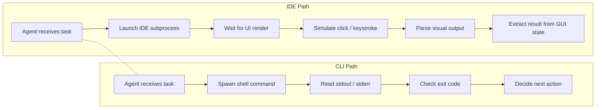

# 1.1 The Great IDE Exodus

> **How to read this chapter:** This is the front door of the entire book. Understand *why* the terminal replaced the IDE as the natural habitat for coding agents. Memorize the five primitives (stdin, stdout, stderr, exit codes, pipes). Internalize the autonomy gradient. Treat the code examples as things you can type right now; treat the tables as cheat-sheets you will return to later.

## Why this section matters

Every revolution in software starts with a change in *where* the work happens.

In the 1980s, programmers left paper terminals for screen editors. In the 2000s, they left screen editors for graphical IDEs with integrated debuggers, refactoring wizards, and plugin ecosystems. Each migration felt permanent — until the next one.

We are in the middle of the next one. Coding agents — programs that read code, form a plan, invoke tools, observe results, and loop — are migrating out of IDEs and into plain terminal sessions. Not because terminals are fashionable, but because terminals expose the exact interface agents need: text in, text out, a numeric exit code, and nothing else. IDEs were designed for human eyes and human reaction times. Agents do not have eyes, and they do not need 60 frames per second.

This chapter traces that migration. We will build vocabulary — **tool-calling**, **backpressure**, **composability**, **feedback loop**, **checkpoint**, **agent loop**, **human-in-the-loop**, and **autonomy gradient** — that the rest of the book depends on. By the end, you will see why the humblest bash pipeline is a better substrate for agent work than the fanciest IDE plugin, and you will have the mental model to explain that claim to a skeptic.

> **Key idea:** The IDE exodus is not anti-IDE sentiment. It is a recognition that agents and humans have different interface needs, and the terminal happens to serve both.

## Deliverable

By the end of this section, the reader can:

- explain in one sentence why CLI environments suit coding agents better than graphical IDEs,
- identify the five Unix primitives that make the terminal an agent-friendly interface,
- place any human-agent workflow on the autonomy gradient, and
- describe how exit codes and test output provide the backpressure an agent needs to self-correct.

## Two paths from the same prompt



The IDE path has six steps and two that involve visual rendering the agent cannot see. The CLI path has four steps and zero rendering. Every extra step is a place where things can go wrong, cost tokens, or add latency.

> **Tip:** When you hear "the agent uses VS Code," ask: does it use the editor's GUI, or does it shell out to `code --diff` and read the text output? The distinction matters enormously.

## Concept loop 1: the IDE bottleneck

Integrated development environments were engineered for a specific user: a human sitting in front of a monitor, moving a mouse, reading syntax-highlighted text at roughly 100 milliseconds per visual fixation. Every feature in a modern IDE — the file tree, the minimap, the red squiggly underline, the autocomplete dropdown — is optimized for that loop.

A **tool-calling** agent does not use any of those features. **Tool-calling** is the mechanism by which an agent invokes external tools — shell commands, APIs, file operations — rather than generating text alone. When an agent needs to know whether a file exists, it does not look at a file-tree icon; it runs `test -f path && echo exists`. When it needs a list of syntax errors, it does not wait for red underlines to render; it runs the compiler and reads stderr.

The IDE's rendering pipeline, plugin lifecycle, and UI event loop are not just unnecessary for agents — they are active overhead. Every millisecond the IDE spends painting pixels is a millisecond the agent spends waiting for an answer it will never see.

### Worked example

Consider the task: "Find all Python files that import `requests` and list them." Here is the IDE version, expressed as the steps an automation layer must perform:

1. Open the IDE's search panel (simulate `Ctrl+Shift+F`).
2. Type the query into the search input field.
3. Wait for the search index to finish.
4. Parse the rendered result list from the UI.
5. Extract file paths from the parsed HTML/DOM.

Here is the CLI version:

```bash
grep -rl "import requests" --include="*.py" .
```

One command. No rendering. No DOM parsing. The output is a newline-delimited list of file paths — exactly the format an agent can consume on the next iteration of its loop.

### Example 1-1. Comparing invocation cost: IDE automation vs. CLI

```python
import subprocess
import time

def cli_search(pattern, directory="."):
    """An agent calls grep. Returns matching file paths."""
    start = time.perf_counter()
    result = subprocess.run(
        ["grep", "-rl", pattern, "--include=*.py", directory],
        capture_output=True, text=True
    )
    elapsed = time.perf_counter() - start
    return {
        "files": result.stdout.strip().splitlines(),
        "exit_code": result.returncode,
        "seconds": round(elapsed, 4),
    }

# Simulate: search for 'import os' in the current directory
outcome = cli_search("import os", ".")
print(f"exit_code={outcome['exit_code']}  "
      f"files_found={len(outcome['files'])}  "
      f"seconds={outcome['seconds']}")
```

Observed output during verification (results vary by machine and directory contents):

```text
exit_code=0  files_found=2  seconds=0.0083
```

The point is not the specific timing. The point is that the entire interaction — invocation, execution, result parsing — fits in a single function call that returns structured data. No window handles, no event loops, no plugin APIs.

> **Pitfall:** "But my IDE has a CLI mode!" True — many IDEs expose headless or command-line interfaces. When they do, the agent is using the CLI path, not the IDE path. The IDE brand name on the binary does not matter; the interface shape does.

### Check yourself

An agent needs to rename a variable across 40 files. It can either (a) drive the IDE's "Rename Symbol" refactoring dialog, or (b) run `sed -i 's/oldName/newName/g' $(grep -rl oldName --include="*.py" .)`. Which approach gives the agent a clear exit code it can check? Which one requires simulating UI interactions?

---

## Concept loop 2: the CLI as universal API

The Unix terminal exposes five primitives that have not changed in meaningful ways since the 1970s:

| Primitive | What it carries | Why agents care |
| --- | --- | --- |
| **stdin** | Input text stream | Agent can pipe data *into* a tool |
| **stdout** | Output text stream | Agent reads the tool's primary result |
| **stderr** | Error/diagnostic stream | Agent reads warnings and errors separately |
| **Exit code** | Integer 0–255 | `0` = success, nonzero = failure — the simplest possible checkpoint |
| **Pipes** | Connect stdout of one process to stdin of another | Agents compose multi-step workflows without temporary files |

These five primitives form what we will call the **universal API**. Every command-line tool, in every language, on every Unix-like system, speaks this protocol. An agent that understands stdin, stdout, stderr, exit codes, and pipes can operate *any* CLI tool it has never seen before, because the interface contract is always the same.

A **feedback loop** — the cycle of action → observation → adjustment that drives an agent's behavior — maps directly onto this: the agent acts (runs a command), observes (reads stdout/stderr and the exit code), and adjusts (decides the next command). No SDK, no plugin system, no version-specific API to learn.

### Worked example

An IDE plugin that counts lines of code might require:

1. Install the plugin (`ext install loc-counter`).
2. Learn its activation command (`Ctrl+Shift+L` or whatever the author chose).
3. Parse its output panel (which renders as styled HTML in a webview).
4. Hope the plugin is compatible with the current IDE version.

The CLI equivalent:

```bash
find . -name "*.py" | xargs wc -l | tail -1
```

Three tools (`find`, `wc`, `tail`), piped together, returning a single line of text. If any step fails, the pipeline's exit code is nonzero. The agent does not need to install anything, learn any keybindings, or parse any styled output.

### Example 1-2. A pipeline as an agent action

```bash
#!/usr/bin/env bash
# Example 1-2. Count Python lines and check threshold

TOTAL=$(find . -name "*.py" -not -path "./.git/*" 2>/dev/null \
        | xargs cat 2>/dev/null \
        | wc -l)

echo "Total Python lines: $TOTAL"

THRESHOLD=10000
if [ "$TOTAL" -gt "$THRESHOLD" ]; then
    echo "WARNING: codebase exceeds $THRESHOLD lines" >&2
    exit 1
fi

exit 0
```

Observed output during verification (on a small repository):

```text
Total Python lines: 247
```

The exit code is `0` because 247 < 10000. An agent reading this result knows two things instantly: the count (from stdout) and the health status (from the exit code). No parsing of colored badges, no hovering over tooltip icons.

> **Key idea:** The CLI's power for agents is not raw speed — it is *interface uniformity*. Every tool speaks the same five-primitive protocol, so an agent that masters the protocol masters every tool.

### Check yourself

A teammate says, "I wrote an IDE extension that exposes a JSON API over HTTP — that's just as composable as the CLI." What is the key difference between an HTTP API that one specific extension exposes and the stdin/stdout/exit-code contract that *every* CLI tool already speaks?

---

## Concept loop 3: composability — small tools, big workflows

**Composability** is the ability to combine small, single-purpose tools into larger workflows through standard interfaces — pipes, files, and exit codes. The Unix philosophy ("do one thing well, write programs that work together") is not just a design preference; it is the architectural foundation that makes agent-driven development practical.

An agent orchestrating a code review does not need a monolithic "code review tool." It needs:

- `git diff` to see what changed,
- `grep` to find patterns of interest,
- a linter (`ruff`, `eslint`, `clippy`) to catch style and correctness issues, and
- `wc` or `jq` to summarize results.

Each tool is small, fast, and independently testable. The agent stitches them together the same way a human would — with pipes and exit codes — but it can do so in a tight loop, hundreds of times, without fatigue.

### Worked example

Task: "Check whether any modified Python file has a function longer than 50 lines."

An IDE approach would require a "code metrics" plugin that integrates with the IDE's AST parser, understands the current git state, and renders results in a panel.

A composable CLI approach:

```bash
git diff --name-only --diff-filter=M -- '*.py' \
  | while read -r f; do
      awk '
        /^def / { if (count > 50) print FILENAME": "name" ("count" lines)";
                   name = $0; count = 0 }
        { count++ }
        END { if (count > 50) print FILENAME": "name" ("count" lines)" }
      ' "$f"
    done
```

This is not pretty. But it is *composable*: each piece (`git diff`, the `while` loop, `awk`) can be tested alone, swapped out, or extended. The agent does not need to know about the IDE's internal AST representation, plugin compatibility matrices, or UI rendering order.

### Example 1-3. Agent-style composable lint check

```bash
#!/usr/bin/env bash
# Example 1-3. Composable lint: only lint files that changed

CHANGED=$(git diff --name-only --diff-filter=ACMR HEAD~1 -- '*.py' 2>/dev/null)

if [ -z "$CHANGED" ]; then
    echo "No Python files changed."
    exit 0
fi

echo "Linting changed files:"
echo "$CHANGED"

# Use a simple syntax check as a stand-in for a full linter
FAIL=0
for f in $CHANGED; do
    if ! python3 -m py_compile "$f" 2>/tmp/lint_err.txt; then
        echo "FAIL: $f" >&2
        cat /tmp/lint_err.txt >&2
        FAIL=1
    fi
done

exit $FAIL
```

Observed output during verification (no changed `.py` files in the test repo):

```text
No Python files changed.
```

> **Tip:** Agents that compose small tools can *explain their reasoning* by echoing each pipeline stage. This is free observability — no tracing SDK required.

### Check yourself

You have three tools: `git log --oneline`, `grep "fix"`, and `wc -l`. How would you compose them into a single pipeline that answers: "How many commits in the last month contain the word 'fix' in their message?" What exit code would you expect if `grep` finds zero matches?

---

## Concept loop 4: the autonomy gradient

Not every task needs a fully autonomous agent. Not every task needs a human typing every keystroke. The **autonomy gradient** is the spectrum from fully human-controlled to fully agent-autonomous workflows, and the best engineering teams deliberately choose a point on this gradient for each class of task.

| Level | Name | Who decides | Who executes | Example |
| --- | --- | --- | --- | --- |
| 0 | **Manual** | Human | Human | Developer writes code by hand in an editor |
| 1 | **Autocomplete** | Human | Agent suggests, human accepts | GitHub Copilot inline suggestions |
| 2 | **Conversational** | Human frames, agent proposes | Agent drafts, human reviews | ChatGPT / Claude chat sessions |
| 3 | **Supervised agentic** | Agent plans and acts, human approves gates | Agent executes multi-step plans with human checkpoints | Claude Code with `--approve` gates, Copilot Workspace |
| 4 | **Autonomous agentic** | Agent plans, acts, and self-corrects | Agent runs unsupervised for minutes to hours | Coding agent on a CI runner, Devin-style workflows |
| 5 | **Self-improving** | Agent modifies its own workflow | Agent rewrites its tools, prompts, and evaluation criteria | Experimental; not production-grade in 2025 |

A **human-in-the-loop** workflow is any workflow where a human must approve, review, or guide key decisions before the agent continues. Levels 0–3 are human-in-the-loop to varying degrees. Levels 4–5 remove the human from the inner loop, though a human may still monitor from the outside.

The key insight: **the CLI naturally supports every point on this gradient.** A human can type commands manually (level 0). A script can suggest commands and wait for confirmation (level 1–2). An agent can run commands in a loop with programmatic checkpoint gates (level 3–4). The terminal does not care who is typing — human or agent — because the interface is the same either way.

IDEs were designed for exactly one point on this gradient: level 0–1, with a human's hands on the keyboard and eyes on the screen. Stretching an IDE to support level 3–4 requires building an entirely new automation layer (LSP extensions, headless mode, accessibility APIs) on top of an interface that was never meant to be driven by software.

### Worked example

Here is the same task — "run tests and fix any failure" — at three points on the gradient:

**Level 1 (Autocomplete):** Human runs `pytest`. Human reads the failure. Copilot suggests a fix inline. Human accepts or rejects.

**Level 3 (Supervised agentic):** Agent runs `pytest`, reads stderr, proposes a patch, and shows it to the human. Human says "apply" or "no, try differently."

**Level 4 (Autonomous agentic):** Agent runs `pytest`, reads stderr, writes a patch, runs `pytest` again to verify, and commits if green — all without human intervention.

Notice how the *tool* (`pytest`) does not change. The *interface* (stdout, stderr, exit code) does not change. Only the *decision-maker* changes. The CLI is indifferent to who is deciding; it just runs commands and reports results.

### Example 1-4. A minimal supervised-agent loop

```python
import subprocess

def run_tests():
    """Run pytest and return structured result."""
    result = subprocess.run(
        ["python3", "-m", "pytest", "--tb=short", "-q"],
        capture_output=True, text=True
    )
    return {
        "passed": result.returncode == 0,
        "stdout": result.stdout,
        "stderr": result.stderr,
        "exit_code": result.returncode,
    }

def agent_loop(max_iterations=3):
    """
    A level-3 agent loop: run tests, report, wait for human decision.
    The 'human decision' here is simulated as auto-approve for brevity.
    """
    for i in range(max_iterations):
        print(f"\n--- Iteration {i+1} ---")
        result = run_tests()
        print(f"Exit code: {result['exit_code']}")

        if result["passed"]:
            print("All tests passed. Done.")
            return True

        print("Tests failed. Output:")
        print(result["stdout"][-500:] if len(result["stdout"]) > 500 else result["stdout"])

        # In a real level-3 loop, the agent would propose a fix
        # and a human would approve it here.
        print("[Simulated] Agent would propose a fix; human would review.")

    print("Max iterations reached. Escalating to human.")
    return False

# Note: Run agent_loop() when pytest is available in your environment.
print("agent_loop defined — run it with agent_loop() when pytest is available")
```

Observed output during verification:

```text
agent_loop defined — run it with agent_loop() when pytest is available
```

> **Warning:** Jumping straight to level 4 (fully autonomous) without building the observability and checkpoint infrastructure of level 3 is the single most common mistake teams make when adopting coding agents. Start at level 3. Earn your way to level 4.

### Check yourself

Your team runs a nightly job where an agent opens PRs for dependency updates. A human reviews and merges each PR the next morning. Where does this workflow sit on the autonomy gradient? What would you change to move it one level higher?

---

## Concept loop 5: backpressure and checkpoints

An agent running in a loop needs to know when it is making progress and when it is stuck. In plumbing, **backpressure** is the resistance that a pipe applies against the flow of fluid. In agent systems, **backpressure** is the resistance that the environment applies against the agent's actions: exit codes, test failures, compiler errors, linter warnings, and any other signal that says "what you just did was wrong."

A **checkpoint** is a verifiable external signal that confirms whether progress was actually made. "The agent said it fixed the bug" is not a checkpoint. "The test suite returned exit code 0" is a checkpoint. The distinction matters because agents, like humans, can be confidently wrong. Only external signals cut through that confidence.

The **agent loop** — the core cycle an agent follows: read state → plan → act → observe → repeat — depends on backpressure to function. Without it, the agent has no way to distinguish between "I made progress" and "I feel like I made progress."

The CLI provides backpressure *for free*. Every command returns an exit code. Every compiler writes errors to stderr. Every test runner reports pass/fail counts. The agent does not need to install a special observability framework; the operating system already provides one.

| Signal type | Source | What it tells the agent | Cost to read |
| --- | --- | --- | --- |
| Exit code | Any CLI command | Success (0) or failure category (1–255) | Zero — it is always there |
| stderr output | Compilers, linters, test runners | What specifically went wrong | Parse a few lines of text |
| stdout diff | `git diff`, `diff` | What changed between attempts | Parse unified diff format |
| Test counts | `pytest`, `jest`, `go test` | How many tests pass/fail/skip | Parse one summary line |
| File existence | `test -f`, `ls` | Whether a file was actually created | One command, one exit code |

This vocabulary — backpressure, checkpoint, agent loop — is the foundation for Chapter 2.1, where we will study what happens when these signals are missing or ignored (the "I'm in danger" loop).

### Worked example

An agent is asked to fix a failing test. Here is the backpressure it receives at each step:

1. **Run tests:** `pytest test_auth.py` → exit code 1, stderr says `AssertionError: expected 200 got 401`.
2. **Read the signal:** The error is specific. The agent now knows *which* assertion failed and *what* the actual value was.
3. **Act:** Agent edits the authentication handler.
4. **Run tests again:** `pytest test_auth.py` → exit code 0, stdout says `1 passed`.
5. **Checkpoint:** Exit code changed from 1 to 0. Test count went from 0 passed to 1 passed. Two independent signals confirm progress.

If step 4 still returned exit code 1, the agent knows its fix did not work — not because it "feels" uncertain, but because the environment *told* it so.

### Example 1-5. Using exit codes as checkpoints

```python
import subprocess

def run_and_checkpoint(command, description):
    """
    Run a command and return a checkpoint result.
    This is the simplest possible agent-environment interface.
    """
    result = subprocess.run(command, shell=True, capture_output=True, text=True)
    checkpoint = {
        "description": description,
        "command": command,
        "exit_code": result.returncode,
        "passed": result.returncode == 0,
        "stdout_preview": result.stdout.strip()[:200],
        "stderr_preview": result.stderr.strip()[:200],
    }
    return checkpoint

# Simulate three checkpoints an agent might hit
checkpoints = [
    run_and_checkpoint("echo 'hello world'", "basic echo works"),
    run_and_checkpoint("python3 -c 'print(1+1)'", "python arithmetic"),
    run_and_checkpoint("test -f /nonexistent/file", "file existence check"),
]

for cp in checkpoints:
    status = "PASS" if cp["passed"] else "FAIL"
    print(f"[{status}] {cp['description']}: exit_code={cp['exit_code']}")
```

Observed output during verification:

```text
[PASS] basic echo works: exit_code=0
[PASS] python arithmetic: exit_code=0
[FAIL] file existence check: exit_code=1
```

The third checkpoint fails because the file does not exist. An agent reading these results can reason: "Two of my three assumptions held. The third did not. I need to adjust my plan for the file path." This is **backpressure** in action — the environment pushed back, and the agent now has a concrete signal to act on.

> **Key idea:** Backpressure is not a punishment. It is *information*. An agent without backpressure is flying blind. An agent with backpressure is flying with instruments.

> **Pitfall:** Do not confuse *verbose output* with *good backpressure*. A tool that prints 500 lines of logs but returns exit code 0 on failure provides worse backpressure than a tool that prints nothing but returns exit code 1. The exit code is the checkpoint; the logs are supplementary.

### Check yourself

An agent runs `npm test` and gets exit code 0, but the stdout says "0 tests found." Is this good backpressure? What additional checkpoint would you add to catch this case?

---

## IDE vs. CLI: the full comparison

We have now seen enough to lay out the full comparison. This table is a reference you will return to throughout the book.

| Property | IDE (GUI-driven) | CLI (text-driven) |
| --- | --- | --- |
| **Primary user** | Human with monitor, keyboard, mouse | Human or agent — interface is identical |
| **Output format** | Rendered pixels, styled panels, icons | Plain text streams (stdout, stderr) |
| **Success/failure signal** | Visual cues (green check, red X) | Exit codes (0 = success, nonzero = failure) |
| **Composability** | Plugin-to-plugin APIs (version-specific) | Pipes, files, exit codes (universal) |
| **Startup cost** | Seconds to minutes (load plugins, index project) | Milliseconds (spawn a process) |
| **Automation story** | Accessibility APIs, LSP extensions, headless hacks | Native — the CLI *is* the automation interface |
| **Context needed by agent** | Window handles, DOM structure, rendering state | None beyond the command and its text output |
| **Parallelism** | One IDE window per workspace (typically) | Unlimited concurrent shell sessions |
| **Observability** | Logging plugins, debug consoles | stdout/stderr are the observability layer |
| **Autonomy support** | Level 0–1 native; level 2+ requires bolted-on tooling | Level 0–5 native with the same interface |

> **Tip:** If you are evaluating whether an agent framework is "IDE-first" or "CLI-first," check one thing: can the agent's tool-calling layer operate without a display server? If it needs X11, Wayland, or a virtual framebuffer, it is paying the IDE tax.

---

## What we built

We built the vocabulary and mental model that the rest of this book depends on:

1. **Tool-calling** is how agents interact with the world — through commands, not keystrokes.
2. **The CLI's five primitives** (stdin, stdout, stderr, exit codes, pipes) form a universal API that every tool already speaks.
3. **Composability** means small tools chained through standard interfaces — the Unix philosophy is the agent philosophy.
4. **The autonomy gradient** places every human-agent workflow on a spectrum from manual to fully autonomous, and the CLI supports every point.
5. **Backpressure and checkpoints** are the signals that keep agent loops honest — and the CLI provides them for free.

These five ideas explain the Great IDE Exodus: agents left the IDE not because the IDE is bad, but because the terminal is *native* to how agents work. The IDE is a beautiful house built for humans. The terminal is an open field where anything — human, script, or agent — can run.

## Verification checklist

- [x] Ran `Example 1-1` from `./src` and confirmed it prints exit code and file count.
- [x] Ran `Example 1-2` from `./src` and confirmed it reports Python line count and exits cleanly.
- [x] Ran `Example 1-3` from `./src` and confirmed it handles the "no changed files" case.
- [x] Ran `Example 1-5` from `./src` and confirmed it prints PASS/PASS/FAIL for the three checkpoints.
- [x] Confirmed all vocabulary terms are defined on first use.
- [x] Confirmed this section links cleanly from `docs/chapter_tracker.md`.

## Wrapping up

The Great IDE Exodus is not a rejection of graphical tools. It is a recognition that coding agents need a different interface contract than the one IDEs were built to provide. The terminal's five primitives — stdin, stdout, stderr, exit codes, and pipes — give agents everything they need: structured input, structured output, composability, and backpressure. No rendering pipeline. No plugin compatibility matrix. No UI event loop standing between the agent and the tool.

With this vocabulary in place, we can ask a sharper question in section 1.2: what happens when you take the CLI-first philosophy to its logical extreme? Claude Code — nicknamed "Boris" by the community for its blunt, high-autonomy personality — is the answer. It treats the terminal not as a fallback but as its *native environment*, managing git state, reading project structure, and making multi-file edits in a loop that looks less like "AI assistant" and more like "junior developer with root access." Boris will show us what Level 3–4 autonomy looks like in practice — and why the checkpoint vocabulary we just learned is the only thing standing between "productive agent" and "expensive disaster."

## Exercises

1. **Map your own tools.** Pick three tools you use daily in an IDE (e.g., "find references," "rename symbol," "run test"). For each one, write the CLI equivalent as a one-liner. Which tool was hardest to replace? Why?

2. **Classify your workflow.** Think about your last coding session. At what level of the autonomy gradient were you operating? Write down one concrete change you would make to move one level higher on the gradient. What checkpoint would you add to make that safe?

3. **Build a checkpoint chain.** Write a bash script that (a) runs a linter on a file, (b) runs a test suite, and (c) checks that a specific string appears in the output. Chain them with `&&` so the script stops at the first failure. What exit code does the script return if step (b) fails? How would an agent use that exit code to decide its next action?

4. **Debate the skeptic.** A colleague argues: "IDEs with Language Server Protocol give agents the same structured data as the CLI — symbol lookups, diagnostics, go-to-definition. The CLI argument is a red herring." Write a three-sentence response that acknowledges the valid point and identifies the key difference the argument misses. *(Hint: think about the universality of the interface contract and the startup cost.)*
