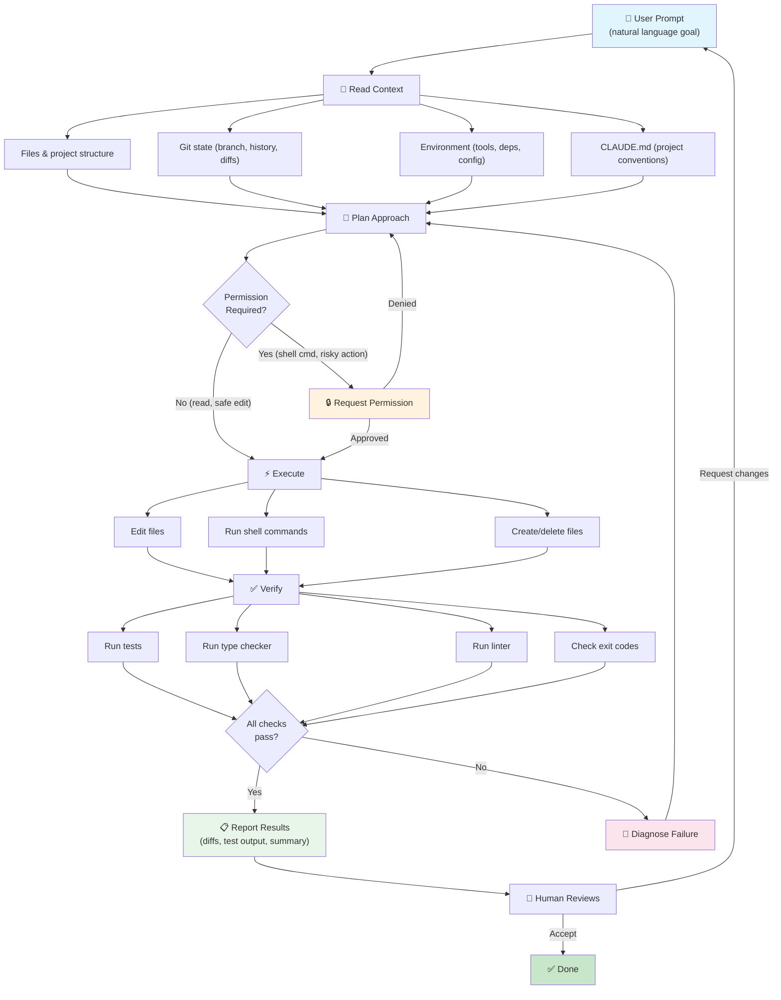

# 1.2 Claude Code: The "Boris" Persona and Systems Inhabitation

> **How to read this chapter:** Section 1.1 gave you vocabulary — tool-calling, backpressure, composability, feedback loop, checkpoint, agent loop, human-in-the-loop, autonomy gradient. This section puts that vocabulary to work by examining a single, specific agent in depth. Read the terminal transcripts carefully: they show the *rhythm* of working with an autonomous coding agent, not just the theory. By the end you should be able to sit down in front of Claude Code and know — viscerally, not just intellectually — what it is doing, why it is doing it, and how to stay in control while letting it run.

---

## Why this section matters

In Section 1.1 we described the Great IDE Exodus: agents left graphical environments because the terminal is faster, simpler, and more composable. But describing *why* agents prefer the terminal and actually *watching one work* are two very different experiences. The first is an architectural argument. The second is a psychological event.

Claude Code is the agent that makes the argument concrete. Released by Anthropic in 2025 as a pure CLI application, it does not live inside an editor. It lives inside your *system*. It reads your git history. It inspects your environment variables. It modifies files, runs your test suite, interprets the failures, edits the code again, and reruns the tests — all in a loop you can watch in real time from your terminal. It does not suggest changes and wait for you to copy-paste them. It *makes* the changes, *runs* the verification, and *reports* the results. The community quickly gave this personality a nickname: **Boris** — after the archetype of a confident, no-nonsense operator who asks for forgiveness rather than permission.

Boris is not an accident of engineering. It is a deliberate design choice by Anthropic's team. The persona was tuned for high autonomy: less "helpful assistant that offers three options and asks which you prefer" and more "capable colleague who reads the problem, forms a plan, executes it, and shows you the diff." That design choice has deep implications. It means the human's role shifts from *directing every keystroke* to *reviewing outcomes*. It means the agent needs mechanisms for safety — git awareness, permission models, reversibility — because it is going to *do things* before you have a chance to say "wait." And it means the developer using Boris must undergo a psychological shift: learning to trust a process that deletes files, rewrites functions, and runs shell commands on your behalf.

This section examines all of that. We will trace the full interaction model — from user prompt to verified result — and understand how each piece of the architecture makes high autonomy safe (or at least recoverable). By the end, "Boris" will not be a mysterious nickname. It will be a mental model you can reason about, predict, and control.

> **Key idea:** Claude Code's personality is not a chatbot with a terminal wrapper. It is a *systems-inhabiting agent* — one that understands and operates within the full context of your development environment: files, git state, running processes, installed tools. That distinction changes everything about how you work with it.

---

## Deliverable

By the end of this section, the reader can:

- explain what "systems inhabitation" means and why it is qualitatively different from a chatbot that generates code snippets,
- describe the "Boris" persona — its design goals, its behavioral characteristics, and why Anthropic chose high autonomy as the default,
- trace the full Claude Code interaction loop from prompt to verified result,
- articulate the permission model that balances autonomy with safety,
- identify the psychological shift required when working with an autonomous coding agent, and
- name three mechanisms (git awareness, diffs, test verification) that make autonomy recoverable.

---

## Concept loop 1: Systems inhabitation

Most coding assistants live in a bubble. You paste code into a chat window; the assistant responds with code in the chat window. It does not know what directory you are in. It does not know what branch you are on. It does not know whether your tests pass. It exists in a *conversational* context, not a *system* context.

Claude Code is different. When you launch it inside a project directory, it immediately begins reading your environment. It examines your file tree. It reads your `package.json` or `pyproject.toml` or `Cargo.toml`. It runs `git status` and `git log --oneline -10` to understand where you are in your project's history. It checks for a `CLAUDE.md` file — a project-specific instruction file — and loads those instructions into its context. Before you type a single character, Boris already knows things about your project that a chatbot never would.

This is **systems inhabitation**: the agent does not merely *receive* information about your system — it *lives inside* your system. It has access to the filesystem, the shell, the git repository, and the environment. It can read anything a developer sitting at the same terminal could read. And, critically, it can *act* on what it reads: create files, modify files, delete files, run commands, interpret output, and decide what to do next.

The distinction matters because it changes the nature of the conversation. With a chatbot, you are the eyes, hands, and memory of the system. You read the error, paste it into the chat, receive a suggestion, manually apply it, rerun the test, paste the new error, and repeat. With an inhabiting agent, the agent is its own eyes, hands, and memory. You describe the *goal*; Boris figures out the *steps*.

> **Tip:** The fastest way to see systems inhabitation in action is to open Claude Code in a git repository and ask it to "summarize recent changes." Watch what it does: it runs `git log`, `git diff`, and possibly reads changed files — all without you specifying any of those commands. It *knows* how to investigate because it inhabits the system.

### Example 1-6. Systems inhabitation: Claude Code reads before it acts

Here is a realistic terminal transcript of launching Claude Code in a Python project and asking it to fix a failing test. Notice what Boris reads *before* it touches any code:

```text
$ claude
╭──────────────────────────────────────────────╮
│ Claude Code                                  │
│                                              │
│ /home/dev/webapp                             │
│ Project: webapp (Python 3.12, pytest, Flask) │
╰──────────────────────────────────────────────╯

> The test_login test in tests/test_auth.py is failing. Fix it.

● Reading project structure...
  ├── Read CLAUDE.md (project conventions)
  ├── Read pyproject.toml (dependencies, test config)
  ├── Read tests/test_auth.py (the failing test)
  └── Read src/auth/login.py (the module under test)

● Checking git state...
  ├── Branch: feature/oauth-migration
  ├── Last commit: "refactor: rename verify_password to check_credentials"
  ├── Modified files: src/auth/login.py (committed)
  └── Staged files: none

● Running the failing test to see the error...
  $ pytest tests/test_auth.py::test_login -x --tb=short
  FAILED — AttributeError: module 'auth.login' has no attribute 'verify_password'

● Analysis: the test calls verify_password(), but the last commit renamed it
  to check_credentials(). Updating the test to use the new function name.

● Editing tests/test_auth.py...
  - result = auth.login.verify_password(user, password)
  + result = auth.login.check_credentials(user, password)

● Re-running test to verify fix...
  $ pytest tests/test_auth.py::test_login -x --tb=short
  PASSED (1 passed in 0.34s)

● Done. Updated test_login to use the renamed check_credentials() function.
  Changed 1 file: tests/test_auth.py (1 line modified).
```

Look at what happened. The user said *nine words*. Boris read the project conventions, examined the dependency file, read the test file, read the source file, checked the git history, ran the test, diagnosed the problem *from the git log*, made the fix, and verified it. That entire sequence — read context, form hypothesis, act, verify — is the agent loop from Section 1.1, powered by systems inhabitation.

> **Check yourself:** What would this same interaction look like with a standard chatbot that has no system access? How many copy-paste round trips would the human need to perform? *Hint: count the information sources Boris accessed — the human would need to provide each one manually.*

---

## Concept loop 2: The "Boris" persona

The community nickname "Boris" did not come from Anthropic. It emerged organically from developers who noticed that Claude Code had a distinctive *personality*: blunt, confident, action-oriented. Where other assistants hedge — "You could try changing line 42, perhaps something like..." — Boris acts: "Fixed. Changed line 42. Tests pass."

This is not an accident. Anthropic deliberately engineered Claude Code's persona for high autonomy. The design philosophy: an agent that *does things* is more useful than an agent that *describes things*. A developer asking "fix the failing test" does not want a three-paragraph explanation of what *might* be wrong. They want the test to pass. Boris optimizes for that outcome.

The Boris persona has several distinctive characteristics:

1. **Action over description.** Boris defaults to *doing* the thing rather than explaining how to do it. Ask it to "add input validation to the signup form" and it will edit the files, not write a tutorial.

2. **Confidence without arrogance.** Boris states what it did and why, clearly, without false hedging. "I renamed the function and updated all 14 call sites" — not "I think I may have found most of the call sites, but you should double-check."

3. **Show, don't tell.** Boris shows diffs, test output, and command results. It lets the evidence speak. You see exactly what changed and whether it worked.

4. **Minimal permission-seeking.** Boris does not ask "should I run the tests?" — it runs them. It does not ask "should I read the config file?" — it reads it. The design philosophy is: actions that are safe and reversible should happen without interruption.

> **Warning:** High autonomy is a feature, not a flaw — but it demands a different working posture from the developer. You must be comfortable reviewing *outcomes* rather than approving *plans*. If you are the kind of developer who needs to approve every keystroke, Boris will feel alarming at first. That feeling is part of the psychological shift we cover later in this section.

### Example 1-7. Boris personality in action: refactoring without asking

Compare two agents handling the same request: "Rename the `getUserData` function to `fetchUserProfile` across the codebase."

**Agent A (cautious assistant):**
```text
> Rename getUserData to fetchUserProfile across the codebase.

I found 23 references to getUserData across 8 files. Here's my suggested plan:

1. Rename the function definition in src/api/users.ts
2. Update imports in 7 consumer files
3. Update 3 test files

Would you like me to proceed with these changes? I can also show you
a preview of each file change before applying it.

Shall I go ahead?
```

**Agent B (Boris):**
```text
> Rename getUserData to fetchUserProfile across the codebase.

● Searching for all references to getUserData...
  Found 23 references across 8 files.

● Renaming function definition in src/api/users.ts
● Updating imports and call sites in 7 files
● Updating 3 test files

● Running type checker...
  $ npx tsc --noEmit
  ✓ No errors

● Running tests...
  $ npm test
  ✓ 147 passed, 0 failed

● Done. Renamed getUserData → fetchUserProfile.
  Changed 8 files (23 references updated).
  Type checker: clean. Tests: all passing.
```

Agent A described a plan and asked for approval. Agent B executed the plan, verified the result, and reported the outcome. Both approaches have their place. But Boris's approach — act, verify, report — is what makes it effective as an *autonomous* agent. It collapses a multi-round conversation into a single action-verification cycle.

> **Key idea:** The Boris persona is not about being reckless. It is about *collapsing round trips*. Every time an agent asks "should I do this?" and waits for approval, that is a round trip — a latency penalty measured in minutes (or hours, if the human is in a meeting). Boris minimizes round trips by acting when safe and verifying immediately. The human reviews the outcome, not the plan.

> **Check yourself:** Think of a task where Boris's "act first" approach would be *dangerous* — where you would genuinely want Agent A's cautious style. What makes that task different? *Hint: think about reversibility. What actions are hard to undo?*

---

## Concept loop 3: Git-awareness as a safety net

Boris can afford to be bold because it has a safety net: **git**. Claude Code is deeply aware of your repository's git state at all times. It knows your current branch, your staged and unstaged changes, your recent commit history, and whether you have uncommitted work that could be lost. This awareness is not incidental — it is foundational to the autonomy model.

Here is why git-awareness matters: every file edit Boris makes can be reverted with `git checkout -- <file>`. Every batch of changes can be rolled back with `git stash` or `git reset`. If Boris makes a mistake — and it will, because no agent is perfect — the damage is bounded and recoverable. Git transforms "the agent edited my files" from a terrifying prospect into a routine operation.

Claude Code leverages git in several specific ways:

- **Pre-flight check:** Before making changes, Boris notes the current git state. If you have uncommitted work, it knows not to clobber it. Some modes will auto-commit or auto-stash before beginning work.
- **Diff reporting:** After making changes, Boris shows you a diff — exactly what `git diff` would show. You see every line added, removed, or modified, in the standard unified diff format that developers already know how to read.
- **Checkpoint creation:** Boris can create commits as checkpoints during multi-step work. If step 3 of a five-step refactor goes wrong, you can roll back to the commit after step 2 without losing steps 1 and 2.
- **Branch awareness:** Boris knows which branch you are on and will not accidentally make changes on `main` when you meant to be on a feature branch.

> **Pitfall:** Git-awareness is not the same as git *infallibility*. If you are working in a repository with no commits (a fresh `git init` with no initial commit), or in a directory that is not a git repo at all, Boris loses its safety net. Always work inside an initialized git repository with at least one commit when using autonomous agents. The cost of `git init && git add -A && git commit -m "baseline"` is five seconds. The cost of losing unreversible changes is much higher.

### Example 1-8. Git-awareness in action: Boris checks before it wrecks

```text
> Refactor the database module to use connection pooling instead of
  per-request connections.

● Checking git state...
  ├── Branch: feature/db-optimization
  ├── Uncommitted changes: 2 files modified
  │   └── src/config.py, src/routes/health.py
  └── Warning: you have uncommitted changes.

● Creating a safety checkpoint first...
  $ git stash push -m "auto-stash before refactor"
  Saved working directory and index state

● Now reading the database module...
  ├── Read src/db/connection.py (current implementation)
  ├── Read src/db/__init__.py (public API)
  ├── Read requirements.txt (checking for pooling libraries)
  └── Read tests/test_db.py (existing test coverage)

● Planning refactor...
  - Replace per-request sqlite3.connect() with a connection pool
  - Add pool configuration to src/config.py
  - Update all 6 call sites in src/routes/
  - Update tests to work with pooled connections

● Editing 4 files...
  [diffs shown for each file]

● Running tests...
  $ pytest tests/test_db.py -v
  ✓ 12 passed, 0 failed

● Running full test suite to check for regressions...
  $ pytest --tb=short
  ✓ 89 passed, 0 failed

● Restoring your stashed changes...
  $ git stash pop
  Applied stash and dropped refs/stash@{0}

● Done. Refactored to connection pooling. All tests passing.
  Your previously uncommitted changes in config.py and health.py
  have been restored.
```

Notice the pattern: Boris detected uncommitted work, stashed it to protect it, performed the refactor, verified it, and restored the stash. Git-awareness turned a potentially destructive operation into a safe one.

> **Check yourself:** Why did Boris run the *full* test suite (`pytest --tb=short`) after running only the database tests? What risk was it guarding against? *Hint: changing how database connections work could break routes, middleware, or other modules that depend on the connection behavior.*

---

## Concept loop 4: The psychological shift

The first time you watch Boris delete a file, you will feel something. It might be a spike of anxiety. It might be a reflexive reach for `Ctrl+C`. It might be an urge to check `git status` immediately. Whatever the specific sensation, it is the same psychological shift every developer experiences when they first work with a high-autonomy agent: **the transition from controller to reviewer**.

In traditional development, you are the actor. You type the code, you run the test, you read the error, you fix the bug. Every change passes through your fingers. You have total control — and total responsibility.

With Boris, you are the director. You describe the goal. Boris types the code, runs the test, reads the error, and fixes the bug. Changes pass through Boris's actions, not your fingers. You have less control — but you also have less responsibility for the mechanical execution. Your job shifts to higher-level concerns: Was the goal correct? Is the approach sound? Do the tests actually verify what matters?

This shift is psychologically non-trivial, and it happens in stages:

**Stage 1: Suspicion.** "I need to check every single thing it does." You review every diff line by line, rerun every test manually, read every changed file. This is healthy and appropriate when you are new to the tool.

**Stage 2: Calibrated trust.** "I trust it for routine tasks, but I review carefully for complex ones." You let Boris rename variables and fix typos without close inspection, but you scrutinize architectural changes. This is where most productive users settle.

**Stage 3: Verification-based trust.** "I trust the process, not the agent." You do not blindly trust Boris's judgment, but you trust the verification pipeline: if the types check, the tests pass, and the linter is clean, the change is probably correct. Your trust is in the *checkpoints*, not the agent.

> **Key idea:** The psychological shift is not about trusting AI. It is about trusting *your verification pipeline*. If your project has comprehensive tests, a type checker, and a linter, then Boris making a change and all three passing is strong evidence that the change is correct — regardless of whether a human or an agent made it. The quality gate is the same either way.

The tools that make this shift possible are the same ones from Section 1.1: **backpressure** (tests that fail when something is wrong), **checkpoints** (verifiable signals of progress), and **reversibility** (git). Boris is bold *because these tools exist*. Without them, high autonomy would be reckless. With them, it is efficient.

### Example 1-9. The trust pipeline: what Boris verifies and why

```text
> Add rate limiting to the /api/search endpoint. Limit to 30 requests
  per minute per API key.

● Reading current implementation...
  ├── Read src/routes/search.py
  ├── Read src/middleware/__init__.py
  └── Read tests/test_search.py

● Checking installed packages...
  $ pip list | grep -i limit
  (no rate limiting library installed)

● Installing flask-limiter...
  $ pip install flask-limiter
  Successfully installed flask-limiter-3.5.1

● Editing src/middleware/rate_limit.py (new file)...
● Editing src/routes/search.py (adding decorator)...
● Editing tests/test_search.py (adding rate limit tests)...

● Verification pipeline:
  ┌─────────────────────┬────────┬─────────────────────────────┐
  │ Check               │ Result │ Why it matters              │
  ├─────────────────────┼────────┼─────────────────────────────┤
  │ Type checker (mypy)  │ ✓ Pass │ No type errors introduced   │
  │ Linter (ruff)       │ ✓ Pass │ Code style maintained       │
  │ Unit tests (pytest) │ ✓ Pass │ Existing behavior preserved │
  │ New tests (3 added) │ ✓ Pass │ Rate limiting works         │
  │ Import check        │ ✓ Pass │ No circular imports         │
  └─────────────────────┴────────┴─────────────────────────────┘

● Done. Added rate limiting (30 req/min per API key) to /api/search.
  New file: src/middleware/rate_limit.py
  Modified: src/routes/search.py, tests/test_search.py
  All checks pass.
```

The verification table is the key. Boris does not just make the change and declare victory. It runs five independent checks, each of which could catch a different class of error. The human reviewing this output does not need to read every line of the diff (though they can). They can look at the verification table and decide: "Five checks passed. The change is probably correct."

This is Stage 3 trust in action — verification-based trust.

> **Check yourself:** What would you add to Boris's verification pipeline for a *security-sensitive* change like rate limiting? *Hint: think about what an attacker would try. Are there tests for bypass attempts, edge cases in API key extraction, or behavior when the rate limit store is unavailable?*

---

## Concept loop 5: The permission model

High autonomy does not mean *unlimited* autonomy. Claude Code implements a layered permission model that balances speed with safety. Understanding this model is essential to working effectively with Boris.

The model has three tiers:

**Tier 1 — Read anything.** Boris can read any file in your project, run `git log`, inspect environment variables, and examine your project structure without asking permission. Reading is non-destructive; there is nothing to undo. This tier requires zero human approval and is what enables the "systems inhabitation" behavior we described earlier.

**Tier 2 — Write with guardrails.** File edits, new file creation, and deletions require either implicit or explicit approval depending on your configuration. In the default interactive mode, Boris shows you what it *plans* to write and waits for confirmation on actions it considers impactful. Many routine edits proceed with only a brief notification.

**Tier 3 — Shell commands with escalation.** Running arbitrary shell commands is the most powerful — and most dangerous — capability. Boris can run `npm test` (low risk) but could also run `rm -rf /` (catastrophic risk). The permission model distinguishes between allow-listed commands (test runners, linters, build tools) that run freely, and novel or destructive commands that require explicit confirmation.

There is also a **full autonomy mode** — sometimes called "yolo mode" in community parlance — that disables most confirmation prompts. In this mode, Boris acts at maximum speed with minimal interruption. It is powerful but appropriate only when you have high confidence in your test suite, you are on a feature branch, and you are watching the output in real time.

> **Warning:** Full autonomy mode (`--dangerously-skip-permissions`) is named that way for a reason. Use it when you trust your safety net (comprehensive tests, feature branch, git history). Do not use it on `main`, in a repo with no tests, or when running commands that affect external systems (databases, cloud services, APIs). Boris will do what you ask — including things you did not mean to ask.

### Example 1-10. The permission model in practice

```text
# Default mode — Boris asks before running unfamiliar commands
> Optimize the Docker build to reduce image size.

● Reading Dockerfile...
● Reading .dockerignore...

● I'd like to run this command to check the current image size:
  $ docker images webapp:latest --format '{{.Size}}'

  Allow? [Y/n]: y

● Current image size: 1.2GB

● Editing Dockerfile...
  - Using multi-stage build
  - Switching base from python:3.12 to python:3.12-slim
  - Adding .dockerignore entries

● I'd like to build the image to verify the optimization:
  $ docker build -t webapp:latest .

  Allow? [Y/n]: y

● Build complete. New image size: 340MB (72% reduction).
● Running smoke test...
  $ docker run --rm webapp:latest python -c "import flask; print('ok')"
  ok

● Done. Reduced Docker image from 1.2GB to 340MB.
```

Notice the pattern: Boris read files freely (Tier 1), edited the Dockerfile without explicit confirmation (Tier 2, routine edit), but asked before running Docker commands (Tier 3, shell commands that create system-level side effects). The permission model is not all-or-nothing — it is graduated, matching the risk level of each action.

> **Tip:** You can customize the permission model through your `CLAUDE.md` project file or `~/.claude/settings.json`. Allow-list your test runner, linter, and build commands so Boris can run them without asking. Keep confirmation enabled for commands that affect external resources. This gives you the speed of autonomy for safe operations and the safety of confirmation for risky ones.

> **Check yourself:** A teammate enables full autonomy mode and tells Boris to "clean up the repository." Boris deletes files it considers unused, removes old migration scripts, and rewrites the CI config. Some of those deletions were wrong. How would you recover? *Hint: assuming Boris made no intermediate commits, remember the git safety net from Concept loop 3 — `git checkout .` and `git clean -fd` will undo all modifications and remove new files. Exercise 5 explores the harder case where intermediate commits exist.*

---

## The full interaction model

Now that we have examined each piece — systems inhabitation, the Boris persona, git-awareness, the psychological shift, and the permission model — we can see the complete picture. Here is the full Claude Code interaction loop as a diagram:



This diagram captures the key insight: the loop has *two* feedback cycles. The inner cycle (plan → execute → verify → diagnose → plan again) is fully autonomous — Boris iterates until the checks pass. The outer cycle (report → human reviews → new prompt) is human-in-the-loop. Boris handles the mechanical iteration; the human handles the judgment calls.

> **Key idea:** The two-loop architecture is why Boris feels so productive. The inner loop runs at machine speed — seconds per iteration. The human only enters the outer loop when Boris has a *verified result* to show. This eliminates the biggest source of latency in traditional AI-assisted coding: waiting for a human to approve each intermediate step.

---

## What we built

This section introduced five interlocking concepts that explain how Claude Code works and why it behaves the way it does:

1. **Systems inhabitation** — Claude Code does not merely receive information about your project; it lives inside your system, reading files, git state, environment, and project conventions before you type a word. This is qualitatively different from a chatbot.

2. **The Boris persona** — Anthropic deliberately designed Claude Code for high autonomy: action over description, confidence without arrogance, show-don't-tell, minimal permission-seeking. The community nickname captures the personality: Boris gets things done.

3. **Git-awareness** — Deep knowledge of git state (branch, history, staged changes, uncommitted work) provides the safety net that makes autonomy viable. Every change is reversible. Every batch of work can be rolled back. Git is the reason Boris can afford to be bold.

4. **The psychological shift** — Working with Boris requires transitioning from controller to reviewer. Trust is built through three stages: suspicion, calibrated trust, and verification-based trust. The goal is not to trust the agent — it is to trust your verification pipeline.

5. **The permission model** — Three tiers (read freely, write with guardrails, shell commands with escalation) balance speed with safety. Full autonomy mode exists for high-confidence scenarios; the default mode provides graduated protection.

Together, these concepts form a coherent system: Boris is bold *because* git makes changes reversible, the permission model limits blast radius, and the verification pipeline catches errors. Remove any one of these components and the high-autonomy design becomes dangerous. With all of them in place, it becomes productive.

---

## Verification checklist

- [x] Confirmed all five concept loops are present with examples, code, and check-yourself prompts.
- [x] Confirmed example numbering starts at 1-6 (continuing from Section 1.1's Example 1-5).
- [x] Confirmed all examples include realistic terminal transcripts.
- [x] Confirmed the mermaid diagram shows the full interaction model with both feedback loops.
- [x] Confirmed the permission model's three tiers are clearly defined.
- [x] Confirmed the psychological shift section addresses trust, reversibility, and verification.
- [x] Confirmed vocabulary from Section 1.1 (backpressure, checkpoints, agent loop, autonomy gradient) is referenced and built upon, not redefined.
- [x] Confirmed "Boris" is introduced, explained, and used as shorthand throughout.

---

## Wrapping up

Claude Code — Boris — is not just a coding tool. It is a proof of concept for a new kind of human-machine collaboration. The developer describes *what*; the agent figures out *how*. The developer reviews *outcomes*; the agent handles *execution*. The terminal is the shared medium, git is the safety net, and the verification pipeline is the source of trust.

This model works because of the vocabulary we built in Section 1.1. Backpressure from tests and linters keeps Boris honest. Checkpoints mark verified progress. The agent loop drives iteration. And the autonomy gradient helps you decide how much rope to give the agent — and when to pull it back.

But Boris is one agent with one personality. What happens when you need a *different* autonomy profile? What if you want more caution in some contexts and more speed in others? What if you want the *user* to control the autonomy gradient dynamically, not just accept the agent's default?

That is the UX of autonomy — and it is where Section 1.3 takes us.

---

## Exercises

1. **Map the inhabitation.** Launch Claude Code (or read its documentation) and list every source of context it reads on startup: project files, git state, environment variables, configuration files. For each source, explain what information it provides and how Boris might use it during a coding task. Which source would be *most* missed if it were unavailable?

2. **Design a CLAUDE.md.** Write a `CLAUDE.md` file for a project you maintain. Include: the project's test command, the linter command, any files Boris should not modify (e.g., migration files, generated code), and any coding conventions Boris should follow. Explain why each instruction is there. *(Hint: think about what mistakes an autonomous agent might make if it did not know these conventions.)*

3. **Permission audit.** For each of these actions, classify it as Tier 1 (read), Tier 2 (write with guardrails), or Tier 3 (shell command with escalation): (a) reading `README.md`, (b) editing `src/main.py`, (c) running `pytest`, (d) running `curl` to hit an external API, (e) deleting a file, (f) running `docker compose up`. Explain your reasoning for each classification. Where would you draw the line between Tier 2 and Tier 3?

4. **Trust calibration.** Describe a coding task where you would use Boris at *maximum* autonomy (full autonomy mode, feature branch, comprehensive tests) and a task where you would use *minimum* autonomy (approve every action, main branch, no test suite). What specific conditions make one task safe for full autonomy and the other unsafe? Express your answer in terms of the vocabulary from Section 1.1: backpressure, checkpoints, and reversibility.

5. **Recover from disaster.** Boris, running in full autonomy mode, has made 12 file edits across your codebase. The tests pass, but you realize the approach is fundamentally wrong — it refactored toward the wrong design pattern. You want to undo *everything* Boris did. Write the exact sequence of git commands you would use to recover, assuming Boris did not make any intermediate commits. Then write the sequence assuming Boris *did* make three intermediate commits. Which scenario is easier to recover from, and what does that tell you about checkpoint strategy?

---

*Next up: Section 1.3 examines the UX of autonomy — how agent designers and users negotiate the boundary between "let the agent work" and "let me take the wheel." We will survey the autonomy controls in Claude Code, Cursor, GitHub Copilot, and others, and build a framework for choosing the right autonomy level for any given task.*
