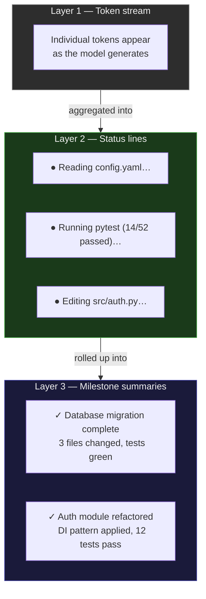

# 1.3 The UX of Autonomy: Streaming, State, and CLI Sovereignty

> **How to read this chapter:** Sections 1.1 and 1.2 established *why* agents moved to the terminal and *how* Claude Code behaves once it is there. This section zooms into the **user-experience layer** — the part you actually see and feel. Read the terminal transcripts closely: they illustrate streaming, progress indicators, and state management as they happen in real tools. By the end you should be able to explain *why* a flickering stream of tokens feels more trustworthy than a spinner, how agents maintain conversational state across turns, and why power users chose the CLI over graphical alternatives.

---

## Why this section matters

An autonomous agent can be brilliant under the hood and still feel terrible to use. If the user cannot tell whether the agent is thinking, stuck, or hallucinating, trust collapses in seconds. The UX of autonomy is the thin membrane between "I'll let it run" and "Ctrl-C, I'll do it myself."

Three forces converge in that membrane:

1. **Streaming** — showing partial results token-by-token so the user can read the agent's reasoning *as it forms*, not after it finishes.
2. **State** — preserving context, tool results, and conversation history across turns so the agent does not "forget" what it already did.
3. **CLI sovereignty** — the principle that the terminal is the *primary* interface for autonomous agents, not a fallback from a web UI.

None of these are cosmetic. Streaming changes *when* a human intervenes. State management changes *whether* the agent can self-correct. CLI sovereignty changes *who* the tool is designed for. Together they define the experiential difference between a chatbot and an agent.

> **Key idea:** Trust in an autonomous agent is built one visible token at a time. If you hide the reasoning, you hide the opportunity for the human to course-correct before the agent goes too far.

---

## Deliverable

By the end of this section, the reader can:

- explain why streaming output builds more trust than batch responses,
- describe the three layers of progress indication (token stream, status lines, and milestone summaries),
- trace how an agent manages state between turns using conversation history and tool-result injection,
- articulate "CLI sovereignty" and name three properties the terminal provides that GUIs struggle to match,
- implement a minimal streaming harness in Python that demonstrates token-by-token output, and
- identify the UX anti-patterns that cause users to abort agent runs prematurely.

---

## Concept loop 1: Streaming builds trust

When you ask a traditional chatbot a hard question, you see a spinner. Five seconds pass. Ten. Twenty. You begin to wonder: is it thinking, or is it stuck? The spinner conveys *activity* but not *progress*. You have no way to distinguish "deep reasoning" from "infinite loop."

Streaming changes this fundamentally. Instead of waiting for the entire response, the terminal displays each token as it is generated. You watch the agent's reasoning emerge in real time — first the plan, then the analysis, then the code. If the reasoning veers off course at token 50, you can interrupt at token 51 instead of waiting for token 500.

This is not a minor UX enhancement. It is a **trust mechanism**. Streaming transforms the human from a passive consumer of finished results into an active monitor of an ongoing process. Psychologically, the experience shifts from "I submitted a job and I'm waiting" to "I'm watching a colleague work and I can tap their shoulder."

> **Tip:** In Claude Code, pressing `Escape` during streaming interrupts the current generation and lets you refine the prompt. This low-cost interrupt is only possible *because* output is streamed — you can see the moment reasoning diverges and act immediately.

### Example 1-11. Batch vs. streaming: the trust gap

Compare two experiences of the same agent answering "refactor this module to use dependency injection":

```text
── Batch mode (typical web chatbot) ────────────────────────
User: Refactor auth.py to use dependency injection.
[Thinking... ████████████████ 47s]
Assistant: Here is the refactored module:
  (400 lines of code appear all at once)
```

```text
── Streaming mode (CLI agent) ──────────────────────────────
User: Refactor auth.py to use dependency injection.

● Planning…
  I'll start by identifying the hard-coded dependencies in auth.py.
  There are three: the database connection, the password hasher,
  and the session store.

● Reading auth.py…
  Found 3 direct imports that should become constructor parameters:
  - db = PostgresConnection()       → line 12
  - hasher = BcryptHasher()         → line 15
  - sessions = RedisSessionStore()  → line 18

● Refactoring…
  Creating AuthService class with __init__(self, db, hasher, sessions)…
  ▎ class AuthService:
  ▎     def __init__(self, db, hasher, sessions):
  ▎         self.db = db
  ▎         self.hasher = hasher
  …
```

In streaming mode, the human reads the plan before the code arrives. If the agent misidentifies a dependency ("wait, we also use a rate-limiter"), the user can interrupt immediately. In batch mode, the user discovers the mistake only after reading 400 lines.

> **Key idea:** Streaming is not about speed — it is about **observability**. A slower stream that shows reasoning is more trustworthy than a fast batch that hides it.

### Check yourself

- Why does a spinner convey less information than a token stream, even if both last 30 seconds?
- At what point during the streaming output in Example 1-11 could a human first intervene?

---

## Concept loop 2: The three layers of progress indication

Streaming raw tokens is necessary but not sufficient. Long-running agent tasks — "migrate the database schema," "add tests for all untested modules" — can produce thousands of tokens across dozens of tool calls. A flat stream of text becomes its own kind of noise. Agents solve this with **layered progress indication**: three tiers of feedback at different granularities.



**Layer 1 — Token stream:** The raw model output. Useful for understanding reasoning but too granular for tracking a multi-step task.

**Layer 2 — Status lines:** Structured indicators that the agent inserts between tool calls. These tell you *what the agent is doing now* without requiring you to parse the raw stream. In Claude Code, these appear as lines prefixed with `●` or `├──`.

**Layer 3 — Milestone summaries:** After completing a logical unit of work (one file refactored, one test suite passing), the agent emits a compact summary with a checkmark. These are the lines you scan when you glance back at a terminal that has been running for five minutes.

> **Warning:** Agents that provide only Layer 1 (raw tokens) force the user to do the aggregation mentally. This leads to "scroll fatigue" — the user gives up reading and either trusts blindly or aborts. Always push for at least Layer 2 status lines in any agent harness you build.

### Example 1-12. Layered progress in a real agent session

```text
$ claude "Add input validation to all API endpoints"

● Scanning project for API endpoints…                    ← Layer 2
  Found 8 endpoints in src/api/routes.py

● Analyzing endpoint: POST /users                        ← Layer 2
  Missing validation for: email format, password length
  Adding Pydantic model UserCreateRequest…
  ▎ class UserCreateRequest(BaseModel):                  ← Layer 1
  ▎     email: EmailStr
  ▎     password: str = Field(min_length=8, max_length=128)

● Editing src/api/routes.py…                             ← Layer 2
  ├── Updated post_user() signature
  └── Added try/except for ValidationError

✓ POST /users — validation added, test passes            ← Layer 3

● Analyzing endpoint: GET /users/{id}                    ← Layer 2
  Path parameter already validated by FastAPI.
  No changes needed.

✓ GET /users/{id} — already validated                    ← Layer 3

● Analyzing endpoint: PUT /users/{id}…                   ← Layer 2
  …
```

Each layer serves a different reading speed. A developer actively watching reads Layer 1. A developer checking in after a coffee break scans for Layer 3 checkmarks. A developer debugging a failure searches Layer 2 for the step where things went wrong.

### Check yourself

- Name the three layers of progress indication and give one example of each.
- Which layer would you scan first if you returned to your terminal after 10 minutes away?

---

## Concept loop 3: State management between turns

A single prompt-response exchange is easy. The hard UX problem is what happens across *multiple turns*. The user asks the agent to refactor a module. The agent does it. The user then says "now add tests for what you just changed." If the agent has forgotten what it changed, the experience falls apart.

State management in CLI agents works through three mechanisms:

1. **Conversation history** — the full sequence of user messages and agent responses is kept in memory (or on disk) and fed back into the model's context window on every turn. The agent literally *re-reads* the entire conversation each time.

2. **Tool-result injection** — when the agent runs a command (e.g., `git diff`), the output is inserted into the conversation as a "tool result" message. On the next turn, the model sees both the command it ran and its output. This is how the agent "remembers" what files it changed.

3. **Checkpoint files** — some agents persist state to disk between sessions. Claude Code uses `CLAUDE.md` for project-level memory and its internal session file for conversation history. This means you can close your terminal, reopen it, and resume roughly where you left off.

### Example 1-13. State across turns: the agent remembers

```text
── Turn 1 ──────────────────────────────────────────────
User: Rename the User model's "name" field to "display_name"
      across the entire codebase.

Agent: ● Searching for references to User.name…
       Found 14 references in 7 files.
       ● Renaming in models/user.py…
       ● Renaming in api/serializers.py…
       ● Renaming in tests/test_user.py…
       (… 4 more files …)
       ✓ Renamed 14 references. All tests pass.

── Turn 2 (30 seconds later) ───────────────────────────
User: You missed the database migration. Generate one.

Agent: ● Checking what I changed in turn 1…
         (reads conversation history — sees the rename from
          "name" to "display_name" in models/user.py)
       ● Generating Alembic migration…
       ▎ op.alter_column('users', 'name',
       ▎     new_column_name='display_name')
       ✓ Migration generated. Run `alembic upgrade head` to apply.
```

Notice that the user did not re-explain the rename in Turn 2. The agent recovered the details from its own conversation history. This is seamless in the terminal because the entire conversation scrolls above — both the user and the agent can "look up" to see what happened.

> **Pitfall:** Context windows have finite size. In extremely long sessions (50+ turns), early conversation history may be truncated or summarized. If you notice an agent "forgetting" things it did 20 turns ago, this is likely context-window eviction, not a bug. The workaround is to start a fresh session and let the agent re-read the project state from disk (git log, file contents) rather than relying on conversational memory.

### Example 1-14. A minimal state-preserving agent loop in Python

This code demonstrates the core mechanic: each turn appends to a growing message list, and the full list is sent on every API call.

```python
# Example 1-14. Minimal stateful agent loop
# File: src/stateful_agent.py

import os

# Using a mock to illustrate the pattern — replace with a real API client
def call_model(messages: list[dict]) -> str:
    """Send the full conversation history; get the next response."""
    # In production: openai.chat.completions.create(messages=messages)
    # Here we simulate a response for illustration.
    last_user_msg = messages[-1]["content"]
    if "rename" in last_user_msg.lower():
        return "I'll rename the field across 7 files."
    return f"Acknowledged. I can see {len(messages)} messages in our history."

def agent_loop():
    messages: list[dict] = []
    print("Stateful agent (type 'quit' to exit)")
    print("-" * 40)

    while True:
        user_input = input("\nYou: ")
        if user_input.strip().lower() == "quit":
            break

        # Append user message to history
        messages.append({"role": "user", "content": user_input})

        # Send FULL history to the model
        response = call_model(messages)

        # Append assistant response to history
        messages.append({"role": "assistant", "content": response})

        print(f"Agent: {response}")
        print(f"  [context: {len(messages)} messages in history]")

if __name__ == "__main__":
    agent_loop()
```

The key line is `call_model(messages)` — the *entire* list is sent every time. This is the simplest possible implementation of conversational state. Production agents add tool results, system prompts, and summarization, but the core pattern is identical: **append, send everything, append again**.

> **Tip:** If you want to inspect what an agent "remembers," ask it directly: "What files have you changed so far in this session?" A well-implemented agent will reconstruct the answer from its conversation history and tool results. If it cannot, its state management is broken.

### Check yourself

- What are the three mechanisms CLI agents use to maintain state between turns?
- Why does context-window eviction cause agents to "forget" early turns, and what is the workaround?

---

## Concept loop 4: CLI sovereignty

Why did power users choose the terminal over graphical agent interfaces? The answer is not nostalgia. It is a set of concrete properties that the CLI provides and that GUIs struggle to replicate. We call this **CLI sovereignty**: the terminal is not a compromise — it is the *optimal* interface for autonomous agents.

Three properties drive this:

**1. Composability.** The terminal lets you chain agents with other tools. You can pipe an agent's output through `jq`, redirect it to a file, or wrap it in a shell script. A web UI is a walled garden; a CLI is a LEGO brick.

**2. Scriptability.** CLI agents can be invoked non-interactively in CI/CD pipelines, cron jobs, and automation scripts. A GUI requires a human to click buttons; a CLI requires only a command string. This is why Claude Code can run as `claude --print "fix the failing test"` inside a GitHub Action.

**3. Transparency.** Everything that happens in a terminal is text. Text can be searched, copied, diffused into other contexts, piped to `tee` for logging, or simply scrolled back. A GUI mediates access through widgets and may hide the raw model output behind a "pretty" presentation.

> **Key idea:** CLI sovereignty means the terminal is not a developer-facing console for a tool whose "real" interface is elsewhere. The terminal *is* the interface. The agent is designed CLI-first, and any GUI that exists is a wrapper around the CLI, not the other way around.

### Example 1-15. CLI composability: chaining an agent with Unix tools

```bash
# Example 1-15. Using CLI agents in Unix pipelines

# Ask the agent a question and capture only the code blocks
claude --print "Write a Python function to parse ISO 8601 dates" \
  | sed -n '/^```python$/,/^```$/p' \
  | sed '1d;$d' \
  > src/parse_dates.py

# Run the agent in CI to auto-fix lint errors
claude --print "Fix all flake8 errors in src/" \
  && flake8 src/ --exit-zero \
  && git diff --stat

# Use the agent as a commit-message generator
git diff --staged | claude --print "Write a commit message for this diff"
```

None of these workflows are possible with a web UI. Each one relies on the agent being a standard Unix citizen: it reads from stdin, writes to stdout, and returns an exit code. This is CLI sovereignty in practice — the agent is a *tool*, not an *application*.

### Example 1-16. Non-interactive agent invocation in CI

```yaml
# Example 1-16. GitHub Actions workflow using a CLI agent
# File: .github/workflows/agent-fix.yml

name: Auto-fix failing tests
on:
  push:
    branches: [main]

jobs:
  agent-fix:
    runs-on: ubuntu-latest
    steps:
      - uses: actions/checkout@v4

      - name: Run tests and capture failures
        id: test
        run: pytest --tb=short 2>&1 | tee test-output.txt
        continue-on-error: true

      - name: Ask agent to fix failures
        if: steps.test.outcome == 'failure'
        run: |
          cat test-output.txt \
            | claude --print "Fix these test failures. Only edit test files." \
            > /dev/null

      - name: Verify fix
        if: steps.test.outcome == 'failure'
        run: pytest --tb=short

      - name: Commit fix
        if: steps.test.outcome == 'failure'
        run: |
          git add -A
          git commit -m "fix: auto-repair failing tests (agent)"
          git push
```

This workflow is impossible with a GUI-based agent. It requires non-interactive invocation, stdin piping, and exit-code handling — all properties that emerge naturally from CLI-first design.

> **Warning:** CLI sovereignty does not mean "GUIs are bad." It means the CLI is the *primitive* and the GUI is the *derived* interface. If your agent only works through a GUI, you have locked out automation, CI/CD integration, and power-user workflows. Build CLI-first; add a GUI later if needed.

### Check yourself

- Name three properties the CLI provides that GUIs struggle to match.
- Why is non-interactive invocation critical for CI/CD integration?
- Could Example 1-16 work with a GUI-only agent? Why or why not?

---

## Concept loop 5: UX anti-patterns that kill trust

Not every agent gets the UX right. Here are the four most common anti-patterns that cause users to abort agent runs — even when the agent is doing the correct thing underneath.

| Anti-pattern | What the user sees | Why trust collapses |
|---|---|---|
| **Silent thinking** | No output for 20+ seconds | User assumes the agent is stuck |
| **Wall of text** | 500 lines of raw output with no structure | User cannot find the relevant information |
| **Amnesia** | Agent asks for information it was given 2 turns ago | User concludes the agent is unreliable |
| **Phantom progress** | Spinner or percentage that does not correspond to real work | User feels deceived when the "90% done" task takes another 5 minutes |

Each anti-pattern maps to a failure in one of the three systems we have discussed:

- **Silent thinking** → missing streaming (Concept loop 1)
- **Wall of text** → missing layered progress (Concept loop 2)
- **Amnesia** → broken state management (Concept loop 3)
- **Phantom progress** → dishonest progress indication (Concept loop 2)

> **Pitfall:** The most dangerous anti-pattern is **phantom progress** — a progress bar that increments on a timer rather than on actual task completion. Users learn to distrust the indicator and, by extension, the entire agent. If you cannot measure real progress, show a pulsing indicator (which honestly says "I'm working but I don't know how long") rather than a fake percentage.

### Example 1-17. Honest vs. dishonest progress

```text
── Dishonest progress ──────────────────────────────────
● Refactoring module… [██████████████████░░] 90%
  (status has shown 90% for the last 3 minutes)

── Honest progress ─────────────────────────────────────
● Refactoring module…
  ├── ✓ Identified 6 functions to change
  ├── ✓ Updated parse_input()
  ├── ✓ Updated validate_schema()
  ├── ● Updating transform_data()…  (3 of 6)
  └── ○ Remaining: enrich_output, write_result, cleanup
```

The honest version does not promise a completion percentage. Instead, it shows *what has been done* and *what remains*. The user can estimate progress themselves from the ratio of checkmarks to remaining items.

### Check yourself

- Which anti-pattern does a "wall of text" represent, and which system failure causes it?
- Why is a pulsing indicator more honest than a fake percentage bar?

---

## What we built

This section covered the UX layer that makes terminal-based autonomous agents usable and trustworthy:

1. **Streaming** transforms the user from a passive consumer into an active monitor, enabling early intervention when reasoning diverges.
2. **Layered progress** (token stream → status lines → milestone summaries) serves different reading speeds and prevents scroll fatigue.
3. **State management** (conversation history, tool-result injection, checkpoint files) lets agents maintain continuity across turns and sessions.
4. **CLI sovereignty** (composability, scriptability, transparency) makes the terminal the optimal interface for autonomous agents, enabling automation and power-user workflows.
5. **UX anti-patterns** (silent thinking, wall of text, amnesia, phantom progress) identify the failure modes that destroy trust.

Together, these five concepts explain why the best coding agents in 2025 are not web apps with chat bubbles — they are terminal programs that stream, remember, and compose.

---

## Verification checklist

Before moving to the next section, confirm you can:

- [ ] Explain why streaming output builds more trust than batch responses, in one sentence.
- [ ] Draw or describe the three-layer progress model from memory.
- [ ] Name the three state-management mechanisms (conversation history, tool-result injection, checkpoint files) and explain when each is used.
- [ ] Define "CLI sovereignty" and list its three properties without looking.
- [ ] Identify which anti-pattern is at work when an agent shows no output for 30 seconds.
- [ ] Explain why a fake progress bar is worse than no progress bar at all.

---

## Wrapping up

The terminal is not just where agents run — it is where trust is built or broken. Every token streamed is a chance for the human to verify reasoning. Every status line is a signal that the agent is still on track. Every preserved turn of conversation history is a promise that the agent will not forget what it already did.

The UX of autonomy is the bridge between "this tool is powerful" and "I actually use this tool." In the next chapter, we leave the comfortable world of well-behaved agents and enter the danger zone: Geoffrey Huntley's feedback loops, where agents enter recursive failure and the UX signals we discussed here become critical survival instruments.

### Exercises

1. **Streaming audit.** Pick any AI coding tool you currently use. Time how long it takes before you see the first token of output. Compare this with a tool that uses streaming. Write down the difference in your subjective trust level.

2. **Layer identification.** Open a terminal session with Claude Code (or watch a recorded demo). Classify every line of output into Layer 1 (token stream), Layer 2 (status line), or Layer 3 (milestone summary). How many of each layer did you find in a 5-minute session?

3. **State stress test.** In a multi-turn agent session, ask the agent to make a change, then five turns later ask "what did you change in the first turn?" Note whether it answers correctly. If it fails, estimate how many turns of history it retained.

4. **Pipeline challenge.** Write a shell one-liner that uses a CLI agent to generate a function, pipes the output to extract only the code, saves it to a file, and runs it. This exercises CLI sovereignty directly.

5. **Anti-pattern field guide.** Over the next week, note every time you feel the urge to abort an AI tool mid-run. Classify the cause using the four anti-patterns from this section. Which anti-pattern do you encounter most often?
