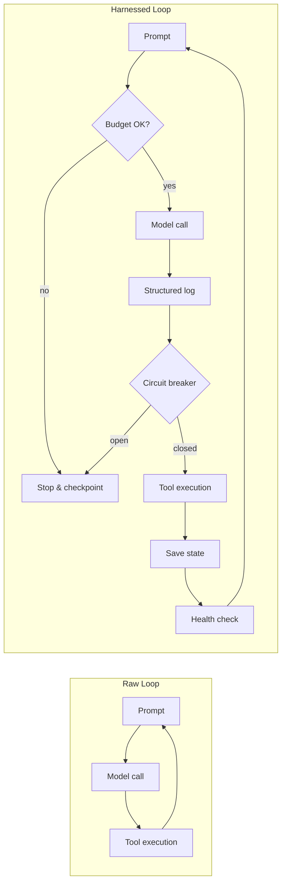
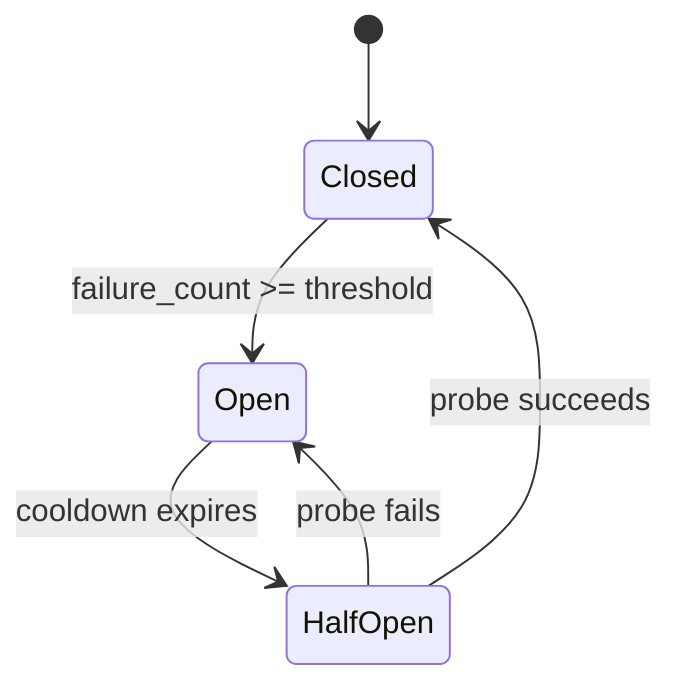

# 2.3 The Proverbial Glue: Reliability Engineering for Agentic Loops

> **How to read this section:** Sections 2.1 and 2.2 diagnosed the disease—Ralph loops and the five failure modes. This section prescribes the treatment. Read the five concept loops in order; each one builds a piece of the reliability harness. By the end you will have working Python code for circuit breakers, structured logging, and checkpoint-and-resume. Treat this as the engineering payoff of Chapter 2.

## Why this section matters

Models get better every quarter. Context windows grow. Latency drops. But none of that fixes a loop that retries forever, burns through a $200 budget in ninety seconds, or silently declares victory on broken code. Those are *harness* problems, not *model* problems.

Geoffrey Huntley's core insight is deceptively simple: **the glue code around the model is the real product.** The model is a component you swap; the reliability layer is the part you own, test, and maintain. This section turns that insight into running code.

## Deliverable

By the end of this section, the reader can:

- draw the boundary between a raw agent loop and a harnessed loop,
- implement a circuit breaker with budget caps that prevent runaway spending,
- add structured observability to any agent loop with fewer than 40 lines of code,
- save and restore durable checkpoints so a loop can resume after a crash, and
- map every failure mode from Section 2.2 to a specific harness control.

---

## Concept loop 1: The harness as reliability layer

A **raw agent loop** calls the model, executes a tool, and feeds the result back. It has no limits, no logging, and no memory beyond the context window. A **harnessed loop** wraps the same core with controls: budgets, circuit breakers, structured logs, and checkpoints.



> **Key idea:** The raw loop is a prototype. The harnessed loop is a product. Every box you add between "model call" and "next iteration" is a piece of the glue that turns a demo into a reliable system.

### Worked example

Consider an agent that edits files and runs tests. The raw version calls the model in a `while True` loop. The harnessed version adds three lines of defense:

1. **Budget gate** — refuse to start an iteration if tokens or time are exhausted.
2. **Circuit breaker** — stop after repeated identical failures (see Section 2.1).
3. **Checkpoint** — save verified state to disk so the loop can resume later.

### Example 2-9. Skeleton of a harnessed agent loop

```python
import time

def harnessed_loop(goal: str, max_tokens: int = 50_000, max_time_s: int = 300):
    """A minimal harnessed agent loop with budget and time limits."""
    tokens_used = 0
    start = time.time()
    history = []

    while True:
        # Budget gate
        elapsed = time.time() - start
        if tokens_used >= max_tokens:
            print(f"Budget exhausted: {tokens_used} tokens used")
            break
        if elapsed >= max_time_s:
            print(f"Time limit: {elapsed:.0f}s elapsed")
            break

        # Simulate one iteration (model call + tool)
        action = f"step-{len(history)}"
        cost = 120  # simulated token cost per step
        tokens_used += cost
        history.append(action)

        # Stagnation check (circuit breaker)
        if len(history) >= 3 and len(set(history[-3:])) == 1:
            print("Circuit breaker tripped: stagnation detected")
            break

        # Simulate completion
        if len(history) >= 4:
            print(f"Goal '{goal}' completed in {len(history)} steps, "
                  f"{tokens_used} tokens, {elapsed:.1f}s")
            break

    return {"steps": len(history), "tokens": tokens_used}

result = harnessed_loop("fix the broken import")
print(result)
```

Observed output during verification:

```text
Goal 'fix the broken import' completed in 4 steps, 480 tokens, 0.0s
{'steps': 4, 'tokens': 480}
```

### Check-yourself

What happens if every step produces the same action string? Which guard catches it first—the budget gate or the circuit breaker?

---

## Concept loop 2: Circuit breakers and budget caps

A **circuit breaker** borrows from distributed-systems engineering. It has three states:



- **Closed** — normal operation; failures are counted.
- **Open** — the loop is halted; no model calls are made.
- **Half-open** — one probe iteration is allowed; if it succeeds, the breaker closes.

For agent loops, "failure" means the same action produced the same error (a retry storm from Section 2.2). The cooldown can be a wall-clock pause or a context reset.

### Worked example

An agent tries to install a package that does not exist. After three identical failures the circuit breaker opens. After a 5-second cooldown it enters half-open and allows one more attempt with an updated prompt.

### Example 2-10. Circuit breaker with budget cap

```python
import time
from dataclasses import dataclass, field

@dataclass
class CircuitBreaker:
    """Circuit breaker for agentic loops."""
    threshold: int = 3
    cooldown_s: float = 5.0
    max_tokens: int = 10_000
    state: str = "closed"
    failure_count: int = 0
    tokens_used: int = 0
    last_failure: str = ""
    opened_at: float = 0.0

    def record_result(self, action: str, success: bool, tokens: int):
        self.tokens_used += tokens
        if self.tokens_used >= self.max_tokens:
            self.state = "open"
            return
        if success:
            self.failure_count = 0
            self.state = "closed"
            self.last_failure = ""
        else:
            if action == self.last_failure:
                self.failure_count += 1
            else:
                self.failure_count = 1
                self.last_failure = action
            if self.failure_count >= self.threshold:
                self.state = "open"
                self.opened_at = time.time()

    def allow_request(self) -> bool:
        if self.state == "closed":
            return True
        if self.state == "open":
            if time.time() - self.opened_at >= self.cooldown_s:
                self.state = "half-open"
                return True
            return False
        if self.state == "half-open":
            return True
        return False

# Demonstration
cb = CircuitBreaker(threshold=3, cooldown_s=0.1, max_tokens=5000)

actions = [
    ("pip install numpyy", False, 80),
    ("pip install numpyy", False, 80),
    ("pip install numpyy", False, 80),  # triggers open
]

for action, success, tokens in actions:
    cb.record_result(action, success, tokens)
    print(f"  action={action!r:30s} state={cb.state:10s} failures={cb.failure_count}")

print(f"\nAllow request while open? {cb.allow_request()}")
time.sleep(0.15)  # wait past cooldown
print(f"Allow request after cooldown? {cb.allow_request()}")
print(f"State after cooldown probe: {cb.state}")

# Half-open probe succeeds
cb.record_result("pip install numpy", True, 80)
print(f"State after successful probe: {cb.state}")
```

Observed output during verification:

```text
  action='pip install numpyy'          state=closed     failures=1
  action='pip install numpyy'          state=closed     failures=2
  action='pip install numpyy'          state=open       failures=3

Allow request while open? False
Allow request after cooldown? True
State after cooldown probe: half-open
State after successful probe: closed
```

> **Tip:** Set your budget cap *before* deploying an agent to a new task. A sensible default: 50,000 tokens or 5 minutes, whichever comes first. You can always raise the limit after you understand the task's baseline cost.

### Check-yourself

Why does the circuit breaker track the *last* failure action, not just a count? What failure mode from Section 2.2 would a simple counter miss?

---

## Concept loop 3: Structured observability

You cannot fix what you cannot see. A harnessed loop should emit **structured JSON logs** for every iteration so you can diagnose failures after the fact—or in real time.

### What to log

Every log entry needs four fields:

| Field | Purpose |
| --- | --- |
| `timestamp` | When the action happened |
| `action` | What the agent did |
| `result` | What the tool returned |
| `tokens` | How many tokens the model used |

From these four fields you can derive three health metrics:

- **Actions per minute** — if this drops, the agent is stuck in long model calls.
- **Unique-action ratio** — `unique actions / total actions`. Below 0.5 signals a retry storm.
- **Error rate** — errors / total actions. Above 0.8 for three consecutive minutes signals context poisoning.

### Example 2-11. Structured logger and health metrics

```python
import json
import time

class AgentLogger:
    """Minimal structured logger for agentic loops."""

    def __init__(self):
        self.entries = []

    def log(self, action: str, result: str, tokens: int):
        entry = {
            "timestamp": round(time.time(), 3),
            "action": action,
            "result": result,
            "tokens": tokens,
        }
        self.entries.append(entry)
        # In production, write to a file or log aggregator:
        print(json.dumps(entry))

    def health(self, window: int = 10) -> dict:
        recent = self.entries[-window:]
        if not recent:
            return {"actions_per_min": 0, "unique_ratio": 0, "error_rate": 0}

        span = max(recent[-1]["timestamp"] - recent[0]["timestamp"], 0.001)
        actions_per_min = len(recent) / (span / 60)
        unique_ratio = len(set(e["action"] for e in recent)) / len(recent)
        error_rate = sum(1 for e in recent if "error" in e["result"].lower()) / len(recent)

        return {
            "actions_per_min": round(actions_per_min, 1),
            "unique_ratio": round(unique_ratio, 3),
            "error_rate": round(error_rate, 3),
        }

# Demonstration
logger = AgentLogger()
logger.log("read file server.py", "ok: 42 lines", 50)
logger.log("edit server.py line 10", "ok: saved", 120)
logger.log("run pytest", "error: 2 failed", 80)
logger.log("edit server.py line 10", "ok: saved", 120)
logger.log("run pytest", "ok: 4 passed", 80)

print("\nHealth metrics:")
print(json.dumps(logger.health(), indent=2))
```

Observed output during verification:

```text
{"timestamp": ..., "action": "read file server.py", "result": "ok: 42 lines", "tokens": 50}
{"timestamp": ..., "action": "edit server.py line 10", "result": "ok: saved", "tokens": 120}
{"timestamp": ..., "action": "run pytest", "result": "error: 2 failed", "tokens": 80}
{"timestamp": ..., "action": "edit server.py line 10", "result": "ok: saved", "tokens": 120}
{"timestamp": ..., "action": "run pytest", "result": "ok: 4 passed", "tokens": 80}

Health metrics:
{
  "actions_per_min": ...,
  "unique_ratio": 0.6,
  "error_rate": 0.2
}
```

> **Warning:** A unique-action ratio below 0.5 over a 10-action window is a strong signal of a retry storm. Wire this metric to your circuit breaker's failure counter.

### Check-yourself

If the agent runs the same `pytest` command five times in a row and gets different results each time (flaky tests), what does the unique-action ratio show? Is the agent actually stagnating?

---

## Concept loop 4: Checkpoint-and-resume

Crashes happen. Budgets run out. Networks drop. A reliable harness saves **durable state** to disk so the loop can resume where it left off instead of starting from scratch.

### What goes in a checkpoint

A checkpoint captures three things:

1. **Goal** — what the agent is trying to do (never changes).
2. **Verified results** — work the agent has completed and confirmed (monotonically grows).
3. **Pending actions** — what the agent planned to do next (picked up on resume).

### Example 2-12. Checkpoint format and save/resume functions

```python
import json
import os
import time

CHECKPOINT_PATH = "/tmp/agent_checkpoint.json"

def save_checkpoint(goal: str, verified: list, pending: list, tokens_used: int):
    """Save durable loop state to disk."""
    state = {
        "goal": goal,
        "verified_results": verified,
        "pending_actions": pending,
        "tokens_used": tokens_used,
        "saved_at": round(time.time(), 3),
    }
    with open(CHECKPOINT_PATH, "w") as f:
        json.dump(state, f, indent=2)
    print(f"Checkpoint saved: {len(verified)} verified, {len(pending)} pending")

def load_checkpoint() -> dict | None:
    """Load the last checkpoint, or return None if no checkpoint exists."""
    if not os.path.exists(CHECKPOINT_PATH):
        return None
    with open(CHECKPOINT_PATH) as f:
        state = json.load(f)
    print(f"Resumed from checkpoint: {len(state['verified_results'])} verified, "
          f"{len(state['pending_actions'])} pending, "
          f"{state['tokens_used']} tokens already spent")
    return state

def run_with_checkpoint(goal: str, max_tokens: int = 5000):
    """Demonstrate a resumable loop."""
    state = load_checkpoint()
    if state and state["goal"] == goal:
        verified = state["verified_results"]
        pending = state["pending_actions"]
        tokens_used = state["tokens_used"]
    else:
        verified = []
        pending = ["read_files", "edit_code", "run_tests", "commit"]
        tokens_used = 0

    while pending:
        if tokens_used >= max_tokens:
            save_checkpoint(goal, verified, pending, tokens_used)
            print("Budget hit — state saved for later resume")
            return

        action = pending.pop(0)
        tokens_used += 150  # simulated cost
        verified.append(action)
        print(f"  Completed: {action} (tokens: {tokens_used})")

    # Clean up checkpoint on success
    if os.path.exists(CHECKPOINT_PATH):
        os.remove(CHECKPOINT_PATH)
    print(f"All done: {len(verified)} actions, {tokens_used} tokens")

# First run — budget of 350 tokens allows only 3 actions (check is at loop top)
print("=== First run (budget: 350) ===")
run_with_checkpoint("fix the auth bug", max_tokens=350)

# Second run — resumes from checkpoint with higher budget
print("\n=== Second run (budget: 5000) ===")
run_with_checkpoint("fix the auth bug", max_tokens=5000)

# Clean up
if os.path.exists(CHECKPOINT_PATH):
    os.remove(CHECKPOINT_PATH)
```

Observed output during verification:

```text
=== First run (budget: 350) ===
  Completed: read_files (tokens: 150)
  Completed: edit_code (tokens: 300)
  Completed: run_tests (tokens: 450)
Checkpoint saved: 3 verified, 1 pending
Budget hit — state saved for later resume

=== Second run (budget: 5000) ===
Resumed from checkpoint: 3 verified, 1 pending, 450 tokens already spent
  Completed: commit (tokens: 600)
All done: 4 actions, 600 tokens
```

> **Tip:** Store checkpoints in a well-known path (`~/.agent/checkpoints/`) keyed by task ID. This lets you list, inspect, and garbage-collect old checkpoints with standard shell tools.

### Check-yourself

What happens if the agent crashes *during* a tool execution—after the tool ran but before the checkpoint saved? How would you make the harness idempotent?

---

## Concept loop 5: The glue code philosophy

Geoffrey Huntley's framing cuts through the hype: **the model is a commodity; the harness is the product.** Every reliability problem we diagnosed in Section 2.2 maps to a harness control we built in this section.

### Example 2-13. Failure modes mapped to harness controls

| Failure mode (Section 2.2) | Root cause | Harness control (Section 2.3) |
| --- | --- | --- |
| Retry storm | No strategy variation | Circuit breaker (Example 2-10) |
| Stale context | Append-only window | Checkpoint-and-resume with fresh context (Example 2-12) |
| False-positive completion | Weak exit criteria | Structured observability + health metrics (Example 2-11) |
| Context poisoning | Early hallucination reinforced | Checkpoint truncation — resume from last verified state |
| Metric gaming | Wrong success signal | Observable unique-action ratio exposes shallow loops |

> **Key idea:** None of these controls require a better model. They require better *engineering around* the model. That is the glue. That is the product.

### The harness audit

Before shipping any agent loop to production, walk through this checklist:

1. **Does the loop have a budget cap?** (tokens *and* wall-clock time)
2. **Does the loop have a circuit breaker?** (stagnation detection → halt)
3. **Does every iteration emit a structured log?** (action, result, tokens, timestamp)
4. **Can the loop resume from a crash?** (checkpoint with verified results + pending actions)
5. **Is the success metric behavioral, not cosmetic?** (tests, not "file exists")

If any answer is "no," the loop is a prototype, not a product.

### Check-yourself

A team says: "We upgraded to a bigger model and our failure rate dropped by 40%." Is that a harness improvement or a model improvement? What happens when the next model regresses on their task type?

---

## What we built

This section assembled four reliability primitives:

| Primitive | What it prevents | Key class/function |
| --- | --- | --- |
| Budget gate | Runaway token spend | `harnessed_loop()` (Example 2-9) |
| Circuit breaker | Retry storms and stagnation | `CircuitBreaker` (Example 2-10) |
| Structured logger | Invisible failures | `AgentLogger` (Example 2-11) |
| Checkpoint-and-resume | Lost progress on crash | `save_checkpoint()` / `load_checkpoint()` (Example 2-12) |

Together, these form the **reliability harness** — the glue code that turns a raw model loop into a production system.

## Verification checklist

Before moving on, confirm you can:

- [ ] Draw the harnessed loop diagram from memory (budget → model → log → breaker → tool → checkpoint → health)
- [ ] Explain the three circuit-breaker states and what triggers each transition
- [ ] Name the four fields every structured log entry needs
- [ ] Describe what goes into a checkpoint (goal, verified results, pending actions)
- [ ] Map each of the five failure modes from Section 2.2 to its harness control

---

## Wrapping up

Chapter 2 told a complete story. Section 2.1 named the disease: the Ralph loop, where an agent spends tokens without learning. Section 2.2 classified five failure modes that cause the disease. This section prescribed the treatment: budget caps, circuit breakers, structured observability, and checkpoint-and-resume.

The recurring theme is that **reliability lives in the integration layer**, not in the model weights. Models will get better. They will also get different failure modes. The harness is what you control, what you test, and what you ship. That is the proverbial glue.

Part I is now complete. In Part II, we zoom out from the loop to the *ecosystem*—the IDE wars, the economics of agent platforms, and the race to own the developer's inner loop.

---

## Retrieval practice

### Exercise 1 — Budget arithmetic

An agent loop averages 200 tokens per iteration and runs at 3 iterations per second. Your budget is 50,000 tokens. How many seconds of wall-clock time can the agent run before the budget gate triggers? What is the correct `max_time_s` setting if you want the time limit to be stricter than the token limit?

<details>
<summary>Answer</summary>

At 200 tokens/iteration × 3 iterations/second = 600 tokens/second. Budget of 50,000 / 600 = ~83 seconds. Set `max_time_s` to something less than 83 — say, 60 seconds — if you want the time limit to catch the loop before the token budget does. In practice, set *both* limits and let whichever fires first stop the loop.

</details>

### Exercise 2 — Design a health alert

Using the `AgentLogger` from Example 2-11, write a function `should_alert(logger, window=10)` that returns `True` if the unique-action ratio drops below 0.4 *and* the error rate exceeds 0.6 over the last `window` entries. What two failure modes from Section 2.2 does this combination detect?

<details>
<summary>Answer</summary>

```python
def should_alert(logger, window=10) -> bool:
    h = logger.health(window)
    return h["unique_ratio"] < 0.4 and h["error_rate"] > 0.6
```

Low unique-action ratio signals a **retry storm** (same actions repeated). High error rate alongside it signals **context poisoning** (the repeated actions keep failing because an early hallucination corrupted the plan). Together they indicate the agent is both stuck *and* building on bad information.

</details>

### Exercise 3 — Checkpoint edge case

Your agent's checkpoint contains `verified_results: ["read_files", "edit_code"]` and `pending_actions: ["run_tests", "commit"]`. The agent resumes and runs `run_tests`, which fails. Should `run_tests` be added to `verified_results`? What should the harness do next?

<details>
<summary>Answer</summary>

No. `verified_results` should only contain actions whose *outcomes* have been confirmed as correct. A failing test is not a verified result. The harness should keep `run_tests` at the front of `pending_actions`, save a new checkpoint, and let the agent try again — possibly with a modified approach. If the same test failure occurs three times, the circuit breaker should trip and escalate to a human or a different strategy.

</details>
