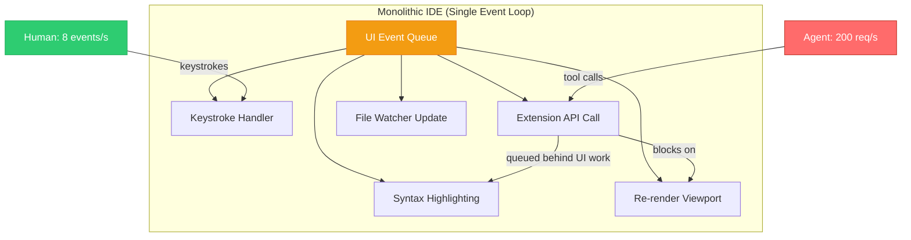
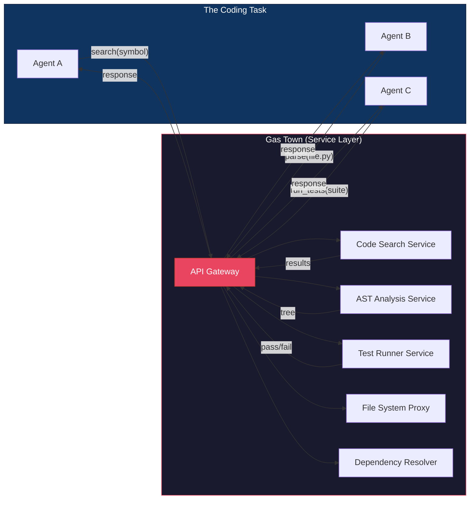
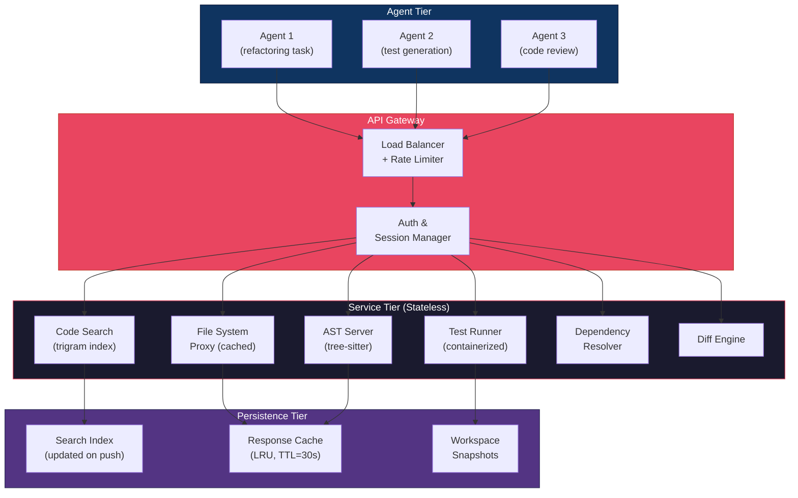

# 3.1 Steve Yegge's Vision: High-Throughput Agentic Environments

> **How to read this section:** Part I diagnosed the symptoms — agents fleeing IDEs for the CLI, recursive failure loops, and the glue code that holds everything together. Part II asks the harder question: *what should we build instead?* This section is your entry point. Read the five concept loops in order; each one builds a layer of the architectural argument. By the end you will understand why monolithic IDEs structurally fail agents, what "Gas Town" means as an infrastructure pattern, and how to measure whether your own environment is agent-ready. Treat Concept Loops 1–3 as ideas to internalize. Treat Loops 4–5 as blueprints you can act on today.

## Why this section matters

In Section 1.1 we watched agents leave the IDE. We measured the bottleneck. We named it *backpressure* and showed that the terminal provides it for free. In Section 2.3 we built the harness — circuit breakers, checkpoints, structured logs — that keeps the agent loop from eating itself alive.

But we never answered the obvious follow-up: **if the IDE is wrong for agents, what is right?**

Steve Yegge answered that question. Yegge — twenty years at Amazon and Google, author of the legendary "Stevey's Blog Rants," the engineer whose leaked internal memo on service-oriented architecture accidentally became Google's most famous platform manifesto — spent his career watching developer tools fail to scale. When he joined Sourcegraph, he articulated a vision so clean it deserves its own chapter: **developer tools must become infrastructure, not features.** Code intelligence is not a syntax-highlighting plugin. It is a service. Search is not a dialog box. It is an API. And the entire constellation of services that an agent needs — code search, AST analysis, test execution, dependency resolution — should be organized the way a Mad Max settlement organizes around fuel production.

Welcome to **Gas Town**.

> **Key idea:** The IDE was built for a human staring at a screen. An agent does not stare. It *queries*. The architectural difference between "staring" and "querying" is the entire subject of this section.

## Deliverable

By the end of this section, the reader can:

- explain why monolithic IDE architectures create throughput bottlenecks for agents,
- describe the Gas Town metaphor and map it to a service-oriented developer-tool architecture,
- distinguish between "human-speed" (Mode A) and "machine-speed" (Mode B) request patterns,
- sketch the architecture of a high-throughput agentic environment from memory, and
- run a benchmarking script that measures whether a given tool stack is agent-ready.

---

## Concept loop 1: The IDE bottleneck

Section 1.1 introduced the IDE bottleneck in terms of *what the agent experiences*: slow responses, rendering overhead, a UI event loop that serializes tool calls. Now we need to understand the bottleneck in terms of *architecture* — what is structurally wrong, and why no amount of plugin optimization can fix it.

A modern IDE like VS Code is an Electron application. At its core is a **single-threaded JavaScript event loop** that processes UI events: keystrokes, mouse clicks, scrollbar movements, syntax highlighting repaints. Extensions — including any agent integration — communicate with this event loop through an extension API that is fundamentally synchronous from the UI thread's perspective. The extension can do asynchronous work internally, but every result must be marshalled back through the UI thread for display.

This works fine for a human. A fast typist produces maybe 100 words per minute — roughly 8 keystrokes per second. The event loop has plenty of capacity to handle 8 events per second plus the occasional "go to definition" or "run test" command.

An agent is not a fast typist. An agent making tool calls operates at **50–200 requests per second** during active coding. Each request — "search for this symbol," "read this file," "run this test," "apply this diff" — is a discrete operation that the IDE must process, update its internal state for, and potentially re-render. The event loop that was comfortably handling 8 keystrokes per second is suddenly buried under 200 operations per second, most of which generate zero visual output the agent will never look at.



The diagram tells the story. The agent's tool calls enter the same queue as keystroke handling and viewport rendering. They are processed in order. The agent waits not because the underlying operation (reading a file, searching for a symbol) is slow, but because the queue ahead of it is full of UI work.

> **Pitfall:** "But VS Code has a separate extension host process!" True — VS Code runs extensions in a Node.js child process to avoid blocking the UI. But the extension host is *still single-threaded*. If your agent extension makes 200 calls per second, those calls are serialized in the extension host's event loop. The separation buys you UI responsiveness, not agent throughput.

### Worked example

Let us quantify the bottleneck. Suppose an IDE extension API can process **40 requests per second** (a generous estimate accounting for serialization, IPC overhead, and state management). An agent that needs to make 5 tool calls per iteration and runs 10 iterations to complete a task needs:

```
5 calls/iteration × 10 iterations = 50 tool calls
50 calls ÷ 40 calls/second = 1.25 seconds
```

That seems acceptable. But now consider a more realistic agent working on a multi-file refactoring:

```
15 calls/iteration × 30 iterations = 450 tool calls
450 calls ÷ 40 calls/second = 11.25 seconds
```

And a complex task with code search, test execution, and dependency analysis:

```
25 calls/iteration × 80 iterations = 2,000 tool calls
2,000 calls ÷ 40 calls/second = 50 seconds
```

Now move the same workload to a headless environment that can sustain **500 requests per second** (no UI overhead, no rendering, no file-watcher churn):

```
2,000 calls ÷ 500 calls/second = 4 seconds
```

Same task. Same agent logic. **12.5× faster** — because the environment stopped doing work the agent never asked for.

### Example 3-1. Simulating the IDE bottleneck

```python
"""Example 3-1. IDE bottleneck simulation — synchronous queue processing."""
import time
import statistics
from collections import deque


def simulate_ide_processing(
    agent_requests: int,
    ui_events_per_sec: int = 30,
    extension_capacity: int = 40,
    ui_overhead_ms: float = 3.0,
):
    """Simulate an IDE extension host processing agent requests
    while competing with UI events on a single-threaded event loop."""
    queue: deque[dict] = deque()
    results = []

    # Interleave agent requests with UI events
    for i in range(agent_requests):
        queue.append({"type": "agent", "id": i, "queued_at": time.perf_counter()})
        # UI events arrive at ~30/s; for every agent request, ~0.75 UI events
        if i % 4 != 0:
            queue.append({"type": "ui", "id": i, "queued_at": time.perf_counter()})

    processed = 0
    effective_rate = extension_capacity  # requests/sec the host can handle
    interval = 1.0 / effective_rate

    while queue:
        event = queue.popleft()
        # Simulate processing time
        if event["type"] == "ui":
            time.sleep(ui_overhead_ms / 1000)  # UI events cost render time
        else:
            time.sleep(interval)
            wait_time = time.perf_counter() - event["queued_at"]
            results.append(wait_time * 1000)  # convert to ms
            processed += 1

    return {
        "total_agent_requests": processed,
        "mean_latency_ms": round(statistics.mean(results), 1),
        "p50_latency_ms": round(statistics.median(results), 1),
        "p99_latency_ms": round(
            sorted(results)[int(len(results) * 0.99)] if results else 0, 1
        ),
        "total_time_s": round(sum(results) / 1000, 2),
    }


# Simulate 200 agent requests through an IDE extension host
result = simulate_ide_processing(agent_requests=200)
print("IDE bottleneck simulation (200 agent requests):")
for key, val in result.items():
    print(f"  {key}: {val}")
```

> **Tip:** Run this example yourself and compare the p99 latency to the mean. The tail latency grows because later requests sit behind an increasingly deep queue of UI events. This is the *structural* problem — not a bug you can fix with a faster machine, but an architectural constraint of sharing an event loop with a UI.

### ✅ Check yourself

If the IDE extension host processes 40 requests per second and an agent submits 200 requests, how many of those requests experience queueing delay behind UI events? What happens to tail latency as the queue depth grows?

---

## Concept loop 2: The Gas Town metaphor

Steve Yegge did not just identify the problem. He proposed a mental model for the solution — and he borrowed it from a post-apocalyptic film.

In *Mad Max: Fury Road*, **Gas Town** is a settlement built around a single purpose: producing fuel. Vehicles roar in from the wasteland, refuel, and roar back out. Nobody *lives* in the refinery. The refinery exists to serve traffic — fast in, fast out, maximum throughput.

Yegge's insight: **developer tools should work like Gas Town.** An agent is a vehicle. It roars in from the wasteland of a coding task, needs fuel — context about the codebase, compute for running tests, search results for finding symbols — and needs to get back on the road immediately. The monolithic IDE is like *forcing the driver to live in the gas station*. It provides fuel, sure, but also a bed, a kitchen, a living room with syntax-highlighted curtains. The driver does not need curtains. The driver needs 50 gallons of context and a clear road.

> **Key idea:** Gas Town is a *service architecture* for developer tools. Agents pull up, request what they need through an API, get a response, and leave. They do not boot a GUI. They do not subscribe to file-watcher events. They do not wait for a viewport to repaint. They call an endpoint and move on.

This is not a new idea in distributed systems. It is literally the service-oriented architecture (SOA) that Yegge famously argued for in his 2011 Google Platforms Rant — the leaked internal memo where he argued that every team at Amazon was required to expose their functionality through service interfaces, and that Google needed to do the same. The rant was about platform thinking: *do not build monoliths; build services that other services can consume.*

Gas Town applies the same principle to the developer-tool stack. Code search is a service. AST analysis is a service. Test execution is a service. Dependency resolution is a service. The agent does not need a monolith that bundles all of these behind a UI. The agent needs an API gateway that routes requests to the right service and returns results at machine speed.



Notice what is absent from the diagram: there is no UI. No viewport. No syntax highlighting. No file tree panel. Those features belong in Mode A (the human-speed IDE, which we will discuss in Concept Loop 3). Gas Town is **Mode B** — pure machine-speed infrastructure.

### Worked example

Let us trace a single agent request through both architectures.

**IDE path (monolithic):**
1. Agent extension calls `vscode.workspace.findFiles('**/*.py')` — enters extension host event loop.
2. Extension host forwards to VS Code's file-system provider — passes through IPC boundary.
3. File-system provider scans the workspace — triggers file-watcher updates.
4. Results marshal back through IPC — extension host receives them.
5. Extension host returns results to agent — but first the UI thread must process pending repaint events.
6. **Total hops: 5. Serialization points: 3. UI-thread contention: yes.**

**Gas Town path (service-oriented):**
1. Agent sends HTTP request: `POST /search/files {"pattern": "**/*.py"}`.
2. Code Search Service runs the query against a pre-built index.
3. Service returns JSON response.
4. **Total hops: 3. Serialization points: 0. UI-thread contention: none.**

The Gas Town path is not just faster — it is *architecturally incapable* of the bottleneck that plagues the IDE path. There is no shared event loop to contend with, no UI thread to yield to, no IPC boundary to cross.

### Example 3-2. The Gas Town service model

```python
"""Example 3-2. Gas Town service model — async service calls with no UI overhead."""
import asyncio
import time
import statistics


class GasTownGateway:
    """A minimal API gateway that routes agent requests to backend services."""

    def __init__(self):
        self.services = {
            "code_search": self._code_search,
            "ast_parse": self._ast_parse,
            "test_run": self._test_run,
            "file_read": self._file_read,
        }
        self.request_log: list[dict] = []

    async def handle(self, service: str, payload: dict) -> dict:
        start = time.perf_counter()
        handler = self.services.get(service)
        if not handler:
            return {"error": f"Unknown service: {service}"}
        result = await handler(payload)
        elapsed_ms = (time.perf_counter() - start) * 1000
        self.request_log.append(
            {"service": service, "latency_ms": elapsed_ms}
        )
        return result

    async def _code_search(self, payload: dict) -> dict:
        await asyncio.sleep(0.002)  # 2ms — pre-built index lookup
        return {"matches": [f"src/{payload.get('query', 'unknown')}.py"]}

    async def _ast_parse(self, payload: dict) -> dict:
        await asyncio.sleep(0.005)  # 5ms — parse a single file
        return {"tree": {"type": "Module", "body_count": 42}}

    async def _test_run(self, payload: dict) -> dict:
        await asyncio.sleep(0.050)  # 50ms — run a focused test suite
        return {"passed": 14, "failed": 0, "duration_ms": 48}

    async def _file_read(self, payload: dict) -> dict:
        await asyncio.sleep(0.001)  # 1ms — read from cache
        return {"content": f"# contents of {payload.get('path', '?')}"}


async def agent_session(gateway: GasTownGateway, num_iterations: int = 30):
    """Simulate an agent making parallel service calls per iteration."""
    for i in range(num_iterations):
        # Each iteration: search + parse + read in parallel, then test
        await asyncio.gather(
            gateway.handle("code_search", {"query": f"module_{i}"}),
            gateway.handle("ast_parse", {"file": f"module_{i}.py"}),
            gateway.handle("file_read", {"path": f"src/module_{i}.py"}),
        )
        # Sequential: run tests after gathering context
        await gateway.handle("test_run", {"suite": f"test_module_{i}"})


async def main():
    gw = GasTownGateway()
    start = time.perf_counter()
    await agent_session(gw, num_iterations=30)
    total = time.perf_counter() - start

    latencies = [r["latency_ms"] for r in gw.request_log]
    print("Gas Town simulation (30 iterations, 4 calls/iter):")
    print(f"  Total requests:  {len(gw.request_log)}")
    print(f"  Total time:      {total*1000:.0f} ms")
    print(f"  Mean latency:    {statistics.mean(latencies):.2f} ms")
    print(f"  p99 latency:     {sorted(latencies)[int(len(latencies)*0.99)]:.2f} ms")
    print(f"  Throughput:      {len(gw.request_log)/total:.0f} req/s")


asyncio.run(main())
```

> **Warning:** The simulated latencies in Example 3-2 (2ms for search, 50ms for test runs) are *optimistic* for real-world deployments but *realistic* for pre-indexed local services like Sourcegraph's code intelligence or a local LSP server. If your code search takes 500ms, you do not have Gas Town — you have a gas station with one pump and a queue around the block.

### ✅ Check yourself

In Example 3-2, three service calls (search, parse, read) run in parallel via `asyncio.gather`, but the test run is sequential. Why? What would happen if you moved the test run into the `gather` call?

---

## Concept loop 3: The bimodal split

The future is not "IDE *or* agent." It is both — but they need fundamentally different architectures running in parallel. Yegge calls this the **bimodal future**:

- **Mode A — Human speed:** Rich UI, syntax highlighting, click-driven navigation, real-time error squiggles, visual diffing. Optimized for a human reading and understanding code at 200 lines per minute.
- **Mode B — Machine speed:** Headless, API-driven, batch-oriented. Optimized for an agent executing 200 *operations* per minute (or per second). No rendering, no viewport, no mouse events.

The critical insight is that **trying to serve both modes from one architecture creates the bottleneck.** Mode A needs a UI event loop, a renderer, file watchers, and a visual state model. Mode B needs none of that — and every cycle spent on rendering is a cycle stolen from the agent.

> **Key idea:** Mode A and Mode B are not "lite vs. pro." They are architecturally distinct systems that happen to operate on the same codebase. Think of them as two *clients* of the same backend services — one client has a screen, the other has an API contract.

Consider how a single "find references" request flows through each mode:

| Step | Mode A (Human) | Mode B (Agent) |
|------|----------------|----------------|
| 1. Request | Click "Find All References" in UI | `POST /references {"symbol": "foo"}` |
| 2. Processing | Language server computes references | Same language server, same computation |
| 3. Response | IDE opens a "References" panel, highlights lines, scrolls viewport | JSON array of `{file, line, column}` tuples |
| 4. Overhead | ~120ms (rendering, panel layout, scroll animation) | ~0ms (no rendering) |
| 5. Next action | Human reads the panel, clicks one reference | Agent immediately issues next request |

Steps 1 and 2 are identical. The divergence is in steps 3–5. Mode A spends 120ms on visual presentation that Mode B never uses. Over 500 requests, that is **60 seconds** of pure waste.

> **Tip:** If you are building an agent integration today, the single highest-impact optimization is to bypass the IDE's UI layer entirely. Talk to the language server directly. Talk to the file system directly. Do not route through the IDE's extension API unless you specifically need the UI to update for a human watching.

### Worked example

Let us model how a bimodal router would split traffic. Suppose your development environment receives a mixed stream of requests — some from a human developer using the IDE, some from an agent running in the background.

### Example 3-3. Bimodal request router

```python
"""Example 3-3. Bimodal request router — split human and agent traffic."""
import asyncio
import time
from dataclasses import dataclass, field
from enum import Enum


class Mode(Enum):
    HUMAN = "A"   # human-speed, needs UI rendering
    AGENT = "B"   # machine-speed, headless


@dataclass
class Request:
    id: int
    mode: Mode
    service: str
    payload: dict = field(default_factory=dict)


@dataclass
class RouteMetrics:
    mode_a_count: int = 0
    mode_b_count: int = 0
    mode_a_total_ms: float = 0.0
    mode_b_total_ms: float = 0.0


async def mode_a_handler(req: Request) -> dict:
    """Human-speed path: includes UI rendering overhead."""
    await asyncio.sleep(0.005)    # 5ms — service call
    await asyncio.sleep(0.012)    # 12ms — UI rendering (panel, highlights, scroll)
    return {"result": f"rendered-{req.id}", "mode": "A"}


async def mode_b_handler(req: Request) -> dict:
    """Machine-speed path: headless, API-only."""
    await asyncio.sleep(0.005)    # 5ms — same service call, same backend
    # No rendering overhead
    return {"result": f"raw-{req.id}", "mode": "B"}


async def bimodal_router(requests: list[Request]) -> RouteMetrics:
    """Route each request to the appropriate handler based on its mode."""
    metrics = RouteMetrics()

    async def process(req: Request):
        start = time.perf_counter()
        if req.mode == Mode.HUMAN:
            await mode_a_handler(req)
            elapsed = (time.perf_counter() - start) * 1000
            metrics.mode_a_count += 1
            metrics.mode_a_total_ms += elapsed
        else:
            await mode_b_handler(req)
            elapsed = (time.perf_counter() - start) * 1000
            metrics.mode_b_count += 1
            metrics.mode_b_total_ms += elapsed

    await asyncio.gather(*(process(r) for r in requests))
    return metrics


async def main():
    # Mixed workload: 20 human requests + 200 agent requests
    requests = []
    for i in range(20):
        requests.append(Request(id=i, mode=Mode.HUMAN, service="find_refs"))
    for i in range(200):
        requests.append(Request(id=1000 + i, mode=Mode.AGENT, service="find_refs"))

    metrics = await bimodal_router(requests)

    print("Bimodal router results:")
    print(f"  Mode A (human): {metrics.mode_a_count} requests, "
          f"avg {metrics.mode_a_total_ms/max(metrics.mode_a_count,1):.1f} ms")
    print(f"  Mode B (agent): {metrics.mode_b_count} requests, "
          f"avg {metrics.mode_b_total_ms/max(metrics.mode_b_count,1):.1f} ms")
    print(f"  Rendering overhead saved: "
          f"{metrics.mode_b_count * 12:.0f} ms "
          f"({metrics.mode_b_count * 12 / 1000:.1f}s)")


asyncio.run(main())
```

The output makes the architectural argument in hard numbers: 200 agent requests × 12ms of rendering overhead = 2.4 seconds saved. On a real workload of 2,000 requests, that is 24 seconds — nearly half a minute of pure waste eliminated by routing agent traffic around the UI layer.

> **Pitfall:** Some teams try to "optimize" Mode A to also serve Mode B — making the IDE extension faster, adding caching, disabling unnecessary renders. This helps, but it is fighting the architecture. The event loop is still shared. The IPC boundary still exists. The extension host is still single-threaded. Bimodal routing is not an optimization; it is a *separation of concerns* at the infrastructure level.

### ✅ Check yourself

A team has 3 human developers and 2 agents sharing one development environment. The humans generate ~50 requests per minute; the agents generate ~3,000 requests per minute. What percentage of total traffic is Mode B? If you only optimize Mode A, what fraction of your traffic benefits?

---

## Concept loop 4: Anatomy of a high-throughput agent environment

We have established the *why*. Now let us build the *what*. A high-throughput agent environment — a proper Gas Town — is not a single application. It is a constellation of stateless microservices behind a unified API gateway. The agent talks to the gateway. The gateway routes to services. The services do one thing well and respond fast.

Here is the full architectural picture:



Each layer has a specific role:

**Agent Tier.** Multiple agents run concurrently. They do not share state with each other. Each agent has a task, a context window, and a harness (from Section 2.3). They issue API calls to the gateway and receive JSON responses.

**API Gateway.** A thin routing layer that provides authentication, rate limiting, and request multiplexing. It is the *only* entry point to the service tier. This is the front door of Gas Town — agents pull up here, state their request, and get routed to the right pump.

**Service Tier.** Stateless microservices, each responsible for one capability. Stateless means you can scale horizontally: if code search is the bottleneck, run three instances behind the load balancer. If test execution is slow, spin up more containers. Each service has a simple contract: receive a request, do work, return a result.

**Persistence Tier.** Shared storage that services read from: the search index, a response cache, and workspace snapshots for the test runner. The key design principle is that the index is **pre-built** — updated on every git push, not on every agent request. This is what makes code search fast: the work of indexing happened before the agent arrived.

> **Key idea:** The defining characteristic of Gas Town is *pre-computation*. The search index is pre-built. The AST cache is pre-warmed. The dependency graph is pre-resolved. When the agent asks a question, the answer is already waiting. This is the difference between a gas station that refines crude oil on demand and one that has full tanks ready to pump.

### Worked example

Let us trace a realistic multi-step agent operation through this architecture. An agent is tasked with renaming a function across a codebase:

1. **Agent → Gateway:** `POST /search/references {"symbol": "old_name", "scope": "workspace"}`
2. **Gateway → Code Search:** Routes to pre-built trigram index. Returns 47 references in 3ms.
3. **Agent → Gateway:** `POST /ast/parse {"files": ["src/core.py", "src/utils.py", ...]}` (batch request)
4. **Gateway → AST Server:** Parses 12 files using tree-sitter. Returns ASTs in 8ms.
5. **Agent → Gateway:** `POST /diff/apply {"changes": [...]}` (the computed rename)
6. **Gateway → Diff Engine:** Applies 47 edits. Returns patched files in 2ms.
7. **Agent → Gateway:** `POST /test/run {"suite": "affected", "files": [...]}` (verify the rename)
8. **Gateway → Test Runner:** Spins up a container, runs 34 tests. Returns results in 1.2s.

**Total time: ~1.25 seconds.** The bottleneck is the test runner (real computation), not the infrastructure. Every other operation completed in single-digit milliseconds because the indices were pre-built and the services were stateless.

In a monolithic IDE, the same operation would require: opening each file in the editor, running "Rename Symbol" through the language server (which processes files sequentially), waiting for the UI to update after each rename, and then running tests through the IDE's test integration (which often re-indexes before running). Estimated time: **8–15 seconds** — dominated by overhead, not computation.

> **Tip:** When designing your own agent environment, start with the test runner. It is always the slowest service (real computation, not just lookup), and it benefits the most from containerization and parallelism. A test runner that can spin up 10 containers in parallel turns a 60-second test suite into a 6-second one.

### Example 3-4. Agent environment health checker

```python
"""Example 3-4. Agent environment benchmarker / health checker."""
import asyncio
import time
import statistics


async def benchmark_service(
    name: str,
    call_fn,
    num_requests: int = 100,
    concurrency: int = 10,
) -> dict:
    """Benchmark a service endpoint by sending concurrent requests."""
    latencies: list[float] = []
    semaphore = asyncio.Semaphore(concurrency)

    async def single_call(i: int):
        async with semaphore:
            start = time.perf_counter()
            await call_fn(i)
            elapsed_ms = (time.perf_counter() - start) * 1000
            latencies.append(elapsed_ms)

    wall_start = time.perf_counter()
    await asyncio.gather(*(single_call(i) for i in range(num_requests)))
    wall_elapsed = time.perf_counter() - wall_start

    sorted_lat = sorted(latencies)
    return {
        "service": name,
        "requests": num_requests,
        "concurrency": concurrency,
        "throughput_rps": round(num_requests / wall_elapsed, 1),
        "mean_ms": round(statistics.mean(sorted_lat), 2),
        "p50_ms": round(sorted_lat[len(sorted_lat) // 2], 2),
        "p99_ms": round(sorted_lat[int(len(sorted_lat) * 0.99)], 2),
        "wall_time_s": round(wall_elapsed, 3),
    }


# --- Simulated service endpoints (replace with real HTTP calls) ---

async def sim_code_search(i: int):
    """Simulated code search: pre-built index, ~2-4ms."""
    await asyncio.sleep(0.002 + (i % 5) * 0.0004)

async def sim_ast_parse(i: int):
    """Simulated AST parse: tree-sitter, ~3-8ms."""
    await asyncio.sleep(0.003 + (i % 10) * 0.0005)

async def sim_file_read(i: int):
    """Simulated file read: cached FS proxy, ~1-2ms."""
    await asyncio.sleep(0.001 + (i % 3) * 0.0003)

async def sim_test_run(i: int):
    """Simulated test execution: containerized, ~40-80ms."""
    await asyncio.sleep(0.040 + (i % 8) * 0.005)


# --- Agent-readiness thresholds ---

THRESHOLDS = {
    "code_search":  {"p99_max_ms": 10,  "min_rps": 200},
    "ast_parse":    {"p99_max_ms": 20,  "min_rps": 100},
    "file_read":    {"p99_max_ms": 5,   "min_rps": 500},
    "test_run":     {"p99_max_ms": 200, "min_rps": 20},
}


def evaluate_readiness(result: dict) -> str:
    """Check if a service meets agent-readiness thresholds."""
    name = result["service"]
    thresh = THRESHOLDS.get(name, {})
    issues = []

    max_p99 = thresh.get("p99_max_ms")
    if max_p99 and result["p99_ms"] > max_p99:
        issues.append(f"p99 {result['p99_ms']}ms > {max_p99}ms target")

    min_rps = thresh.get("min_rps")
    if min_rps and result["throughput_rps"] < min_rps:
        issues.append(f"throughput {result['throughput_rps']} < {min_rps} rps target")

    if issues:
        return f"⚠️  NEEDS WORK: {'; '.join(issues)}"
    return "✅ AGENT-READY"


async def main():
    services = [
        ("code_search", sim_code_search),
        ("ast_parse",   sim_ast_parse),
        ("file_read",   sim_file_read),
        ("test_run",    sim_test_run),
    ]

    print("=" * 65)
    print("  AGENT ENVIRONMENT HEALTH CHECK")
    print("=" * 65)

    all_ready = True
    for name, fn in services:
        result = await benchmark_service(name, fn, num_requests=100, concurrency=10)
        status = evaluate_readiness(result)
        if "NEEDS WORK" in status:
            all_ready = False
        print(f"\n  [{name}]")
        print(f"    Throughput: {result['throughput_rps']} req/s")
        print(f"    Latency:   p50={result['p50_ms']}ms  p99={result['p99_ms']}ms")
        print(f"    Status:    {status}")

    print("\n" + "=" * 65)
    if all_ready:
        print("  🏁 VERDICT: Environment is agent-ready.")
    else:
        print("  🔧 VERDICT: Some services need optimization.")
    print("=" * 65)


asyncio.run(main())
```

> **Warning:** The thresholds in Example 3-4 are guidelines, not gospel. A code search service that returns in 15ms instead of 10ms is not broken — but if your test runner takes 2 seconds per invocation, your agent will spend more time waiting for tests than thinking. Optimize the slowest service first. The benchmarker shows you *where* to look.

### ✅ Check yourself

Looking at the `THRESHOLDS` dictionary in Example 3-4, the test runner has a much higher p99 target (200ms) than code search (10ms). Why is this acceptable? What would happen to agent throughput if the test runner's p99 climbed to 2,000ms?

---

## Concept loop 5: Measuring "agent-readiness"

You cannot improve what you do not measure. Yegge's Gas Town vision gives us the architecture. Now we need the metrics to evaluate whether a specific environment *actually meets* the architectural promises. Here are the four metrics that define agent-readiness:

### Metric 1: Requests per second (RPS)

How many tool-call requests can the environment sustain before latency degrades? This is the headline number. A monolithic IDE extension host typically tops out at **30–50 RPS** before queueing delay dominates. A properly architected service tier should sustain **200–1,000+ RPS** per service, depending on the operation.

### Metric 2: p99 latency for context retrieval

The mean is a liar. An agent making 500 requests cares about the *worst* one, because a single slow response can stall an entire iteration. Target p99 latencies:

| Service | Target p99 | Why |
|---------|-----------|-----|
| Code search | < 10ms | Pre-built trigram index; anything slower means the index is stale or missing |
| AST parse | < 20ms | Tree-sitter on a single file; batch parsing should scale linearly |
| File read | < 5ms | Should be cached in memory; disk I/O means your cache is cold |
| Test execution | < 200ms | Real computation; optimize with containerization and parallelism |

### Metric 3: Concurrent session support

Gas Town does not serve one car at a time. How many agents can operate simultaneously without performance degradation? This tests whether services are truly stateless and horizontally scalable. A good target: **10 concurrent agents** with less than 20% latency increase over a single agent.

### Metric 4: Context freshness

How stale is the search index? If an agent creates a new file and immediately searches for it, how long before the search service sees it? This is the **indexing lag** — the time between a git push (or file save) and the index update. Targets:

- **< 5 seconds** for local development (file-watcher triggered).
- **< 30 seconds** for CI/CD environments (webhook triggered).
- **> 60 seconds** is unacceptable — the agent is making decisions based on stale data, which is a recipe for the "stale context" failure mode from Section 2.2.

> **Key idea:** Agent-readiness is not a binary. It is a spectrum measured by four numbers: RPS, p99 latency, concurrent session capacity, and context freshness. Any environment can plot itself on these four axes and see where it falls short.

### Worked example

Let us score three environments against these metrics:

| Metric | VS Code + Extensions | Sourcegraph + CLI | Custom Gas Town |
|--------|---------------------|-------------------|-----------------|
| RPS | ~40 | ~300 | ~800 |
| p99 search | ~250ms | ~8ms | ~4ms |
| p99 test | ~3,000ms | ~500ms (remote) | ~150ms (containerized) |
| Concurrent agents | 1 (UI contention) | 5–10 | 20+ |
| Index freshness | Real-time (file watcher) | ~10s (webhook) | ~3s (event stream) |
| **Verdict** | ⚠️ Human-only | ✅ Agent-capable | ✅ Agent-optimized |

Notice the trade-off: VS Code has the best *context freshness* (the file watcher updates instantly) but the worst everything else. This is the monolith trap — it is optimized for one use case (a single human) at the expense of the use case that generates 100× more traffic (agents).

> **Tip:** You do not need to build a custom Gas Town from scratch to be agent-ready. Sourcegraph, Language Server Protocol servers, and containerized test runners already exist as off-the-shelf components. The architectural insight is how you *compose* them — behind an API gateway, with pre-built indices, serving headless clients.

> **Pitfall:** Do not confuse "fast for humans" with "fast for agents." A UI that feels snappy at 200ms response time is agonizingly slow for an agent making 200 requests per second. Human-perceptible latency and agent-tolerable latency differ by two orders of magnitude.

### ✅ Check yourself

Your team runs an agent that averages 150 tool calls per task. Your code search service has a p99 of 50ms. How much total time does the agent spend *just on search latency* in the worst case? What would the time drop to if you hit the 10ms target?

---

## What we built

This section started with a question — *if the IDE is wrong for agents, what is right?* — and answered it with five layers of argument:

1. **The IDE bottleneck is structural.** It is not a bug in VS Code or a slow extension. It is the consequence of sharing a single-threaded event loop between a UI that renders pixels and an agent that issues API calls. No amount of optimization inside the monolith fixes the architecture.

2. **Gas Town is the alternative.** Steve Yegge's metaphor maps developer tools to a service-oriented architecture. Agents pull up, refuel (get context + compute), and leave. The infrastructure exists to serve traffic, not to house residents.

3. **The bimodal split is inevitable.** Human-speed (Mode A) and machine-speed (Mode B) are architecturally distinct. The future has both, running in parallel, sharing backend services but diverging at the presentation layer.

4. **The anatomy is concrete.** A high-throughput agent environment has four layers: agents, an API gateway, stateless services, and a persistence tier with pre-built indices. Each layer is independently scalable.

5. **Agent-readiness is measurable.** Four metrics — RPS, p99 latency, concurrent sessions, and context freshness — give you a scorecard for any environment. If you can measure it, you can improve it.

This is the infrastructure that sits *beneath* the harness from Section 2.3. The harness is the reliability layer that prevents Ralph loops and runaway budgets. Gas Town is the *performance* layer that gives the harness something fast to call. Together they form the bottom two layers of the agentic stack:

```
┌─────────────────────────────┐
│   Agent Logic (LLM + task)  │  ← the model and its prompt
├─────────────────────────────┤
│   Harness (Section 2.3)     │  ← circuit breakers, budgets, logs
├─────────────────────────────┤
│   Gas Town (this section)   │  ← fast services, pre-built indices
├─────────────────────────────┤
│   Infrastructure (compute)  │  ← containers, GPUs, storage
└─────────────────────────────┘
```

> **Key idea:** The harness keeps the agent *safe*. Gas Town keeps the agent *fast*. You need both.

---

## Verification checklist

Before moving to Section 3.2, confirm you can:

- [ ] Explain in one sentence why a monolithic IDE bottlenecks agents (hint: shared event loop, UI overhead).
- [ ] Draw the Gas Town architecture from memory: agents → gateway → stateless services → persistence.
- [ ] Distinguish Mode A (human-speed) from Mode B (machine-speed) and name two architectural differences.
- [ ] List the four agent-readiness metrics and state a target value for each.
- [ ] Run Example 3-4 and interpret the output: which services pass and which need work?
- [ ] Explain what "pre-computation" means in the Gas Town model and why it matters for search latency.
- [ ] Connect this section to Section 1.1 (the IDE exodus was *because* of the bottleneck described here) and Section 2.3 (the harness *depends on* Gas Town's fast services).

---

## Wrapping up

Steve Yegge spent two decades watching developer tools evolve — from Emacs to Eclipse to VS Code — and recognized a pattern: **every generation of tooling is built for the dominant consumer of its era.** The IDE was built for a human with a keyboard. Gas Town is built for an agent with an API contract. The architectural difference is not cosmetic. It is the difference between a tool that works and a tool that scales.

The next section (3.2) moves beyond Yegge's structural critique to the *content* problem: even if you have a fast environment, the agent needs the right context in its window. We will explore infinite-context strategies, hyper-context retrieval, and why RAG alone is not enough.

### Retrieval practice

Work through these exercises without looking back at the chapter. They are designed to test whether the concepts have moved from short-term reading memory into durable understanding.

**Exercise 3-1.** A VS Code extension host processes 40 requests per second. An agent submits 600 requests for a complex refactoring. How long does the agent wait? Now assume a Gas Town service tier at 500 RPS. How long? What is the speedup factor?

**Exercise 3-2.** Draw the Gas Town architecture diagram from memory. Include all four tiers (agents, gateway, services, persistence). For each service in the service tier, write one sentence about its latency target and why.

**Exercise 3-3.** Your company has a Sourcegraph instance with 8ms p99 code search and a Jenkins CI server with 45-second p99 test execution. Using the agent-readiness scorecard, which service is the bottleneck? Propose two concrete optimizations for the bottleneck service.

**Exercise 3-4.** Modify Example 3-3 (the bimodal router) to add a third mode — **Mode C: batch agent** — that sends requests in groups of 50 instead of one at a time. What changes in the router? How does batch processing affect throughput vs. latency?

**Exercise 3-5.** A colleague argues: "We don't need Gas Town — we can just make our IDE extension faster." Write a three-sentence rebuttal using concepts from this section. Reference the single-threaded event loop, the bimodal split, and pre-computation.

**Exercise 3-6.** Extend Example 3-4 (the health checker) to add a fifth metric: **context freshness**. Simulate an indexing lag by adding a delay between "file creation" and "file appears in search results." What threshold would you set for agent-readiness, and why?
