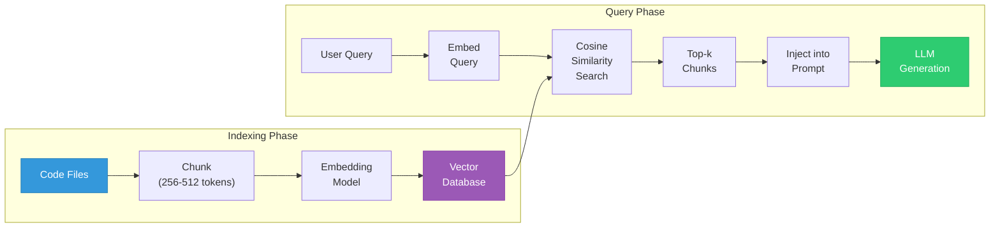
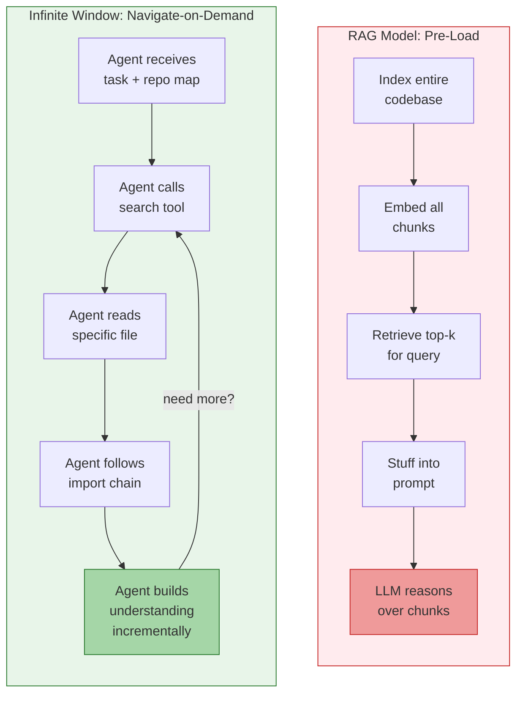
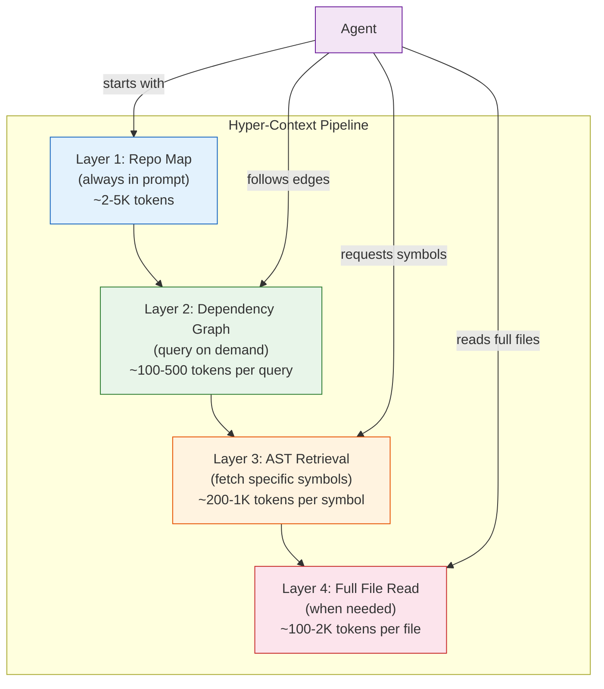
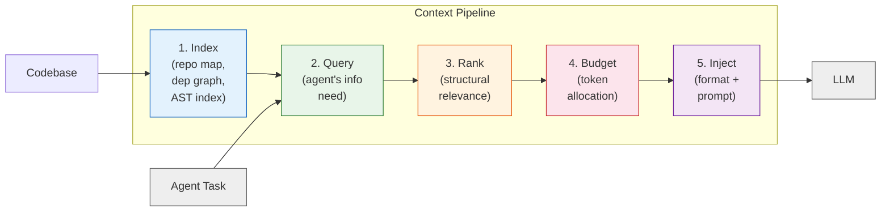

# 3.2 Beyond RAG: The Infinite Window and Hyper-Context

> **How to read this section:** Section 3.1 built the Gas Town architecture — high-throughput services that give agents fast access to code intelligence. This section asks: *what should those services deliver?* The answer is **context**, and getting context right turns out to be the hardest unsolved problem in agentic coding. Read the five concept loops in order. Loop 1 shows why the dominant retrieval strategy (RAG) breaks down for code. Loop 2 introduces context economics — the idea that every token in the prompt has a cost. Loop 3 presents the "Infinite Window" alternative. Loops 4 and 5 give you concrete strategies and a production pipeline you can build today. Treat Loops 1–2 as concepts to internalize. Treat Loops 3–5 as blueprints you can act on immediately.

## Why this section matters

In Section 2.2 we diagnosed **stale context** as one of the five failure modes that cause agents to hallucinate in circles. In Section 2.3 we built harness controls — circuit breakers, checkpoints, observability — but those controls assume the agent *has* good context to reason with. In Section 3.1 we built Gas Town: the high-throughput service architecture that can deliver code intelligence at machine speed.

But we never answered the deeper question: **what context should the agent receive, and how should it get there?**

The industry's reflexive answer has been RAG — Retrieval-Augmented Generation. Embed your documents, retrieve the top-k most similar chunks, stuff them into the prompt, and let the model reason over them. RAG works brilliantly for question-answering over documentation. It falls apart catastrophically for code.

This section explains why, introduces the alternative ("Hyper-Context" and the "Infinite Window"), and gives you the architectural patterns to build context pipelines that actually work for coding agents.

> **Key idea:** RAG retrieves *text that looks similar*. Coding agents need *code that is structurally related*. These are fundamentally different problems, and conflating them is the root cause of most context failures in agentic systems.

## Deliverable

By the end of this section, the reader can:

- explain why naive RAG fails for coding agents and identify the three primary failure modes,
- calculate the "context budget" for an agent task and identify waste,
- describe the Infinite Window architecture and contrast it with pre-loaded context,
- implement hyper-context strategies (repo maps, AST-aware retrieval, dependency graphs),
- build a working context pipeline that integrates with the Gas Town architecture from 3.1, and
- run a context pipeline prototype that demonstrates tool-based codebase navigation.

---

## Concept Loop 1: Why Naive RAG Fails for Coding Agents

### The RAG pipeline, briefly

If you have used ChatGPT with uploaded documents, you have used a RAG pipeline. The standard architecture has four steps:

1. **Chunk** — split the corpus (documents, code files) into small pieces (typically 256–512 tokens).
2. **Embed** — convert each chunk into a high-dimensional vector using an embedding model.
3. **Retrieve** — when the user asks a question, embed the query and find the top-k most similar chunks by cosine similarity.
4. **Generate** — stuff those chunks into the prompt and let the LLM generate a response.



For documentation, FAQ databases, and natural-language corpora, this works remarkably well. The embedding captures semantic similarity — "How do I reset my password?" and "password recovery steps" end up close together in vector space.

For code, three things go wrong.

### Failure mode 1: Textual similarity ≠ structural relevance

When an agent asks "How does the `UserService.authenticate()` method validate tokens?", the RAG pipeline embeds this question and searches for similar text. It might retrieve:

- A comment that mentions "authenticate" and "tokens" in a *completely unrelated* test file
- A function called `token_validator()` that handles *API rate-limiting tokens*, not auth tokens
- A README paragraph that describes the authentication flow in English prose

What it *should* retrieve is the `authenticate()` method, the `TokenValidator` class it calls, the `JWT_SECRET` configuration, and the middleware that invokes `authenticate()` — none of which contain the words "How does" or "validate tokens" in a way that cosine similarity would prioritize.

### Failure mode 2: Loss of cross-file relationships

Code is a graph, not a bag of documents. A function in `auth.py` calls a class defined in `models.py`, which inherits from a base in `base_model.py`, which uses a utility from `crypto_utils.py`. RAG retrieves individual chunks. It has no concept of "this chunk calls that chunk" or "this class inherits from that class." The agent receives isolated puzzle pieces with no picture on the box.

### Failure mode 3: Structural context destruction

When you chunk a Python file into 512-token pieces, you destroy the structure that gives the code meaning. An import block at the top of the file tells you *every dependency*. A class definition establishes a namespace. A decorator modifies behavior. RAG chunking slices through these structures indiscriminately — you might get lines 45–80 of a file, missing the imports (lines 1–12), the class definition (line 20), and the decorator (line 44) that are essential to understanding what lines 45–80 actually do.

> **Pitfall:** Many teams try to fix RAG for code by adjusting chunk sizes — using larger chunks (1024 tokens) or overlapping windows. This is a band-aid. Larger chunks reduce structural destruction but *increase* the chance of retrieving irrelevant content (more text per chunk = more noise). The fundamental problem is that text similarity is the wrong retrieval signal for code.

### Worked example: A naive RAG retrieval gone wrong

Imagine a small Python project with three files. An agent needs to fix a bug in the payment processing logic. Let us see what naive RAG retrieves versus what the agent actually needs.

**Example 3-5. Naive RAG retrieval vs. actual need**

```python
"""
Example 3-5. Naive RAG retrieval vs. actual need

Demonstrates how cosine-similarity retrieval selects irrelevant
chunks for a coding query. We simulate a tiny vector store with
pre-computed "similarity" scores to illustrate the failure mode.
"""

# Simulated code chunks from a payment processing project
code_chunks = {
    "payments/processor.py:45-80": {
        "content": (
            "class PaymentProcessor:\n"
            "    def process(self, order):\n"
            "        # Calculate total with tax\n"
            "        total = order.subtotal + order.tax\n"
            "        if total <= 0:\n"
            "            raise ValueError('Invalid total')\n"
            "        return self.gateway.charge(total, order.card_token)\n"
        ),
        "keywords": ["process", "order", "total", "tax", "charge"],
    },
    "payments/gateway.py:10-35": {
        "content": (
            "class StripeGateway:\n"
            "    def charge(self, amount, token):\n"
            "        # Validate token format before API call\n"
            "        if not token.startswith('tok_'):\n"
            "            raise InvalidTokenError(token)\n"
            "        return stripe.Charge.create(\n"
            "            amount=int(amount * 100),\n"
            "            currency='usd',\n"
            "            source=token\n"
            "        )\n"
        ),
        "keywords": ["charge", "token", "stripe", "amount", "gateway"],
    },
    "tests/test_auth.py:60-90": {
        "content": (
            "def test_token_refresh():\n"
            "    '''Test that expired tokens are refreshed.'''\n"
            "    old_token = generate_token(expired=True)\n"
            "    new_token = auth_service.refresh(old_token)\n"
            "    assert new_token != old_token\n"
            "    assert not is_expired(new_token)\n"
        ),
        "keywords": ["token", "refresh", "expired", "auth", "test"],
    },
    "docs/PAYMENT_FLOW.md:1-30": {
        "content": (
            "# Payment Processing Flow\n"
            "1. User submits order with payment token\n"
            "2. PaymentProcessor validates the order total\n"
            "3. StripeGateway charges the card using the token\n"
            "4. On success, order status is updated to 'paid'\n"
        ),
        "keywords": ["payment", "token", "order", "charge", "flow"],
    },
    "models/order.py:1-25": {
        "content": (
            "from dataclasses import dataclass\n\n"
            "@dataclass\n"
            "class Order:\n"
            "    subtotal: float\n"
            "    tax: float\n"
            "    card_token: str\n"
            "    status: str = 'pending'\n"
        ),
        "keywords": ["order", "subtotal", "tax", "card_token", "dataclass"],
    },
}

# Agent's query
query = "Fix the bug where payment processing fails for zero-tax orders"

# Simulated cosine similarity scores (higher = more "similar" text)
# In practice these come from an embedding model; here we mock them
# to show the mismatch between text similarity and code relevance.
similarity_scores = {
    "payments/processor.py:45-80": 0.72,   # mentions "process" + "tax"
    "payments/gateway.py:10-35":   0.58,    # mentions "charge" + "token"
    "tests/test_auth.py:60-90":    0.65,    # mentions "token" heavily
    "docs/PAYMENT_FLOW.md:1-30":   0.81,    # most text overlap with query
    "models/order.py:1-25":        0.49,    # low text similarity
}

# RAG retrieves top-3 by similarity
top_k = 3
ranked = sorted(similarity_scores.items(), key=lambda x: x[1], reverse=True)
retrieved = ranked[:top_k]

# What the agent actually needs (in structural dependency order)
actually_needed = [
    "models/order.py:1-25",         # defines Order with tax field
    "payments/processor.py:45-80",  # the bug is here (subtotal + tax)
    "payments/gateway.py:10-35",    # downstream call that receives total
]

print("Agent query:", query)
print()
print(f"RAG top-{top_k} retrieved (by cosine similarity):")
for chunk_id, score in retrieved:
    tag = "✓ RELEVANT" if chunk_id in actually_needed else "✗ NOISE"
    print(f"  {score:.2f}  {chunk_id:40s}  [{tag}]")

print()
print("What the agent actually needs (structural dependency order):")
for chunk_id in actually_needed:
    tag = "✓ RETRIEVED" if chunk_id in [r[0] for r in retrieved] else "✗ MISSED"
    print(f"  {chunk_id:40s}  [{tag}]")

# Count accuracy
retrieved_ids = {r[0] for r in retrieved}
needed_ids = set(actually_needed)
hits = retrieved_ids & needed_ids
precision = len(hits) / len(retrieved_ids) if retrieved_ids else 0
recall = len(hits) / len(needed_ids) if needed_ids else 0

print(f"\nRetrieval precision: {precision:.0%} ({len(hits)}/{len(retrieved_ids)} relevant)")
print(f"Retrieval recall:    {recall:.0%} ({len(hits)}/{len(needed_ids)} found)")
```

**Expected output:**

```
Agent query: Fix the bug where payment processing fails for zero-tax orders

RAG top-3 retrieved (by cosine similarity):
  0.81  docs/PAYMENT_FLOW.md:1-30                 [✗ NOISE]
  0.72  payments/processor.py:45-80               [✓ RELEVANT]
  0.65  tests/test_auth.py:60-90                  [✗ NOISE]

What the agent actually needs (structural dependency order):
  models/order.py:1-25                    [✗ MISSED]
  payments/processor.py:45-80             [✓ RETRIEVED]
  payments/gateway.py:10-35               [✗ MISSED]

Retrieval precision: 33% (1/3 relevant)
Retrieval recall:    33% (1/3 found)
```

The RAG pipeline retrieved the Markdown documentation (high text overlap with the query) and an unrelated auth test (mentions "token" heavily), while missing the `Order` model and the `StripeGateway` — both structurally necessary to understand and fix the bug.

> **Warning:** This is not a contrived worst case. In production codebases with hundreds of files, naive RAG precision for coding tasks typically falls between 20–40%. Two out of every three retrieved chunks are noise that wastes context tokens and confuses the model.

### ✅ Check yourself

1. Name the three failure modes of naive RAG for code. Which one do you think causes the most agent errors in practice?
2. In Example 3-5, why did the documentation file score highest? What does this tell you about the mismatch between text embeddings and code relationships?
3. If you increased `top_k` from 3 to 10, would recall improve? What would happen to precision? What is the downstream cost?

---

## Concept Loop 2: Context as the Most Valuable Resource

### The scarcity you cannot see

When we talk about compute costs in AI, we usually mean GPU hours and API pricing. But there is a more fundamental scarcity that dominates the quality of every agent interaction: **context window tokens**.

A typical LLM context window in 2025 ranges from 128K to 200K tokens (with some models offering up to 1M). That sounds enormous — until you realize what must fit inside it:

| Component | Typical tokens | Purpose |
|---|---|---|
| System prompt | 500–2,000 | Agent identity, tool definitions, rules |
| Conversation history | 2,000–10,000 | Previous turns, tool call results |
| Retrieved context | 5,000–50,000 | Code chunks, documentation, file contents |
| Tool call results | 1,000–20,000 | File reads, search results, test output |
| **Remaining for reasoning** | **whatever is left** | The model's actual "thinking space" |

> **Key idea:** Every token spent on irrelevant context is a token stolen from reasoning. Context is not free storage — it is the agent's working memory, and filling it with noise is like trying to solve a math problem while someone reads you the phone book.

### The context budget

Think of the context window as a financial budget. You have a fixed income (the window size) and mandatory expenses (system prompt, conversation history). What remains is your *discretionary budget* — and how you spend it determines how well the agent performs.

**Example 3-6. Context budget calculator**

```python
"""
Example 3-6. Context budget calculator

Models the agent's context window as a financial budget.
Shows how much "reasoning space" remains after mandatory
allocations and retrieved context.
"""

from dataclasses import dataclass


@dataclass
class ContextBudget:
    """Models token allocation for a single agent turn."""
    window_size: int         # total context window (tokens)
    system_prompt: int       # fixed: agent instructions, tool defs
    conversation_history: int  # grows each turn
    retrieved_context: int   # RAG or tool-based retrieval
    tool_results: int        # accumulated tool call outputs

    @property
    def total_allocated(self) -> int:
        return (
            self.system_prompt
            + self.conversation_history
            + self.retrieved_context
            + self.tool_results
        )

    @property
    def reasoning_space(self) -> int:
        return max(0, self.window_size - self.total_allocated)

    @property
    def utilization(self) -> float:
        return self.total_allocated / self.window_size

    @property
    def waste_ratio(self) -> float:
        """Fraction of retrieved context that is irrelevant (estimated)."""
        # Assume ~67% of naive RAG retrieval is noise (from Loop 1)
        estimated_useful = self.retrieved_context * 0.33
        return (self.retrieved_context - estimated_useful) / self.total_allocated

    def report(self, label: str = "Agent Turn") -> str:
        bar_width = 40
        used = int(self.utilization * bar_width)
        reasoning_frac = self.reasoning_space / self.window_size
        reasoning_bar = int(reasoning_frac * bar_width)

        lines = [
            f"=== {label} ===",
            f"Window size:          {self.window_size:>8,} tokens",
            f"System prompt:        {self.system_prompt:>8,} tokens",
            f"Conversation history: {self.conversation_history:>8,} tokens",
            f"Retrieved context:    {self.retrieved_context:>8,} tokens",
            f"Tool results:         {self.tool_results:>8,} tokens",
            f"─────────────────────────────────────",
            f"Total allocated:      {self.total_allocated:>8,} tokens "
            f"({self.utilization:.0%})",
            f"Reasoning space:      {self.reasoning_space:>8,} tokens "
            f"({reasoning_frac:.0%})",
            f"Est. wasted on noise: {self.waste_ratio:.0%} of allocated tokens",
            f"",
            f"[{'█' * used}{'░' * (bar_width - used)}] allocated",
            f"[{'▓' * reasoning_bar}{'░' * (bar_width - reasoning_bar)}] reasoning",
        ]
        return "\n".join(lines)


# Scenario 1: Naive RAG with 128K window
naive = ContextBudget(
    window_size=128_000,
    system_prompt=1_500,
    conversation_history=4_000,
    retrieved_context=40_000,  # 40K tokens of RAG chunks
    tool_results=8_000,
)

# Scenario 2: Tool-based navigation with selective retrieval
smart = ContextBudget(
    window_size=128_000,
    system_prompt=1_500,
    conversation_history=4_000,
    retrieved_context=12_000,  # only structurally relevant code
    tool_results=5_000,
)

print(naive.report("Naive RAG Agent"))
print()
print(smart.report("Tool-Based Navigation Agent"))
print()

# Compare reasoning space
improvement = smart.reasoning_space - naive.reasoning_space
print(f"Reasoning space improvement: +{improvement:,} tokens "
      f"({improvement / naive.reasoning_space:.0%} more room to think)")
```

**Expected output:**

```
=== Naive RAG Agent ===
Window size:           128,000 tokens
System prompt:           1,500 tokens
Conversation history:    4,000 tokens
Retrieved context:      40,000 tokens
Tool results:            8,000 tokens
─────────────────────────────────────
Total allocated:        53,500 tokens (42%)
Reasoning space:        74,500 tokens (58%)
Est. wasted on noise: 50% of allocated tokens

[████████████████░░░░░░░░░░░░░░░░░░░░░░░░] allocated
[▓▓▓▓▓▓▓▓▓▓▓▓▓▓▓▓▓▓▓▓▓▓▓░░░░░░░░░░░░░░░░░] reasoning

=== Tool-Based Navigation Agent ===
Window size:           128,000 tokens
System prompt:           1,500 tokens
Conversation history:    4,000 tokens
Retrieved context:      12,000 tokens
Tool results:            5,000 tokens
─────────────────────────────────────
Total allocated:        22,500 tokens (18%)
Reasoning space:       105,500 tokens (82%)
Est. wasted on noise: 36% of allocated tokens

[███████░░░░░░░░░░░░░░░░░░░░░░░░░░░░░░░░░] allocated
[▓▓▓▓▓▓▓▓▓▓▓▓▓▓▓▓▓▓▓▓▓▓▓▓▓▓▓▓▓▓▓▓░░░░░░░░] reasoning

Reasoning space improvement: +31,000 tokens (42% more room to think)
```

The tool-based agent spends 18% of its budget (mostly on precisely targeted content) while the naive RAG agent spends 42% (much of it noise). The smart agent has 42% more reasoning space — that is the difference between "I can trace the full call chain and fix the bug" and "I'm confused about which `token` variable is relevant."

> **Tip:** Track your agent's context utilization the way you track memory usage in production systems. If more than 40% of the window is consumed by retrieved context, you almost certainly have a retrieval quality problem.

> **Pitfall:** "Just use a bigger context window" is the wrong response. Models with 1M token windows do exist, but attention quality degrades over long contexts (the "lost in the middle" effect). A 128K window with 12K of precisely targeted context outperforms a 1M window with 200K of noisy retrieval every time.

### ✅ Check yourself

1. In the context budget model, what happens to reasoning space as conversation history grows over many turns? How would you mitigate this?
2. Why does the waste ratio use 33% as the "useful fraction" for naive RAG? What would the number be for a well-tuned retrieval pipeline?
3. An agent is working on a task that requires understanding 15 files. Each file is 200 tokens. How would you compare "load all 15 files" (3,000 tokens, zero noise) versus "RAG retrieve 20 chunks at 512 tokens each" (10,240 tokens, ~67% noise)?

---

## Concept Loop 3: The Infinite Window Idea

### What "infinite" actually means

"Infinite Window" is a metaphor, not a literal claim. No model has infinite context. The idea is architectural:

> Instead of trying to *stuff everything relevant* into the prompt upfront, give the agent *tools to navigate* the codebase on demand — so it can reason across the **entire** repository without being limited by the context window.

This is a paradigm shift. The RAG model is **pre-load**: index everything, retrieve what seems relevant, hope you got it right. The Infinite Window model is **navigate-on-demand**: give the agent a map and a set of navigation tools, let it explore the codebase the way a human developer would — by reading files, following imports, checking call sites, running searches.



> **Key idea:** The RAG model asks "What might the agent need?" and guesses. The Infinite Window model asks "What does the agent need *right now*?" and lets it decide. The shift from guessing to deciding is the core insight.

### The tools that make it work

An Infinite Window agent needs a small, focused toolkit (recall the Gas Town services from Section 3.1):

| Tool | What it does | Gas Town service |
|---|---|---|
| `search_code` | Find symbols, patterns, or text across the repo | Code Search API |
| `read_file` | Read a specific file (or range of lines) | File Server |
| `get_definitions` | Find where a symbol is defined | Code Intelligence |
| `get_references` | Find all call sites of a symbol | Code Intelligence |
| `get_repo_map` | Get a compressed structural overview | Repo Map Service |
| `run_command` | Execute a shell command (tests, linters) | Execution Service |

Each tool call returns *precisely what the agent asked for* — no more, no less. The agent builds understanding iteratively, the way you would: "Let me read the file... okay, this function calls `validate_token()` — where is that defined?... Got it, now let me check who calls *this* function..."

### Worked example: RAG agent vs. Infinite Window agent

Let us trace the same task ("fix the zero-tax payment bug") through both architectures.

**Example 3-7. Tool-based codebase navigation (Infinite Window pattern)**

```python
"""
Example 3-7. Tool-based codebase navigation (Infinite Window pattern)

Simulates an agent navigating a codebase using tools instead of
pre-loaded RAG context. Each tool call returns precisely targeted
information, and the agent builds understanding incrementally.
"""

from dataclasses import dataclass, field


# Simulated codebase (same project as Example 3-5)
CODEBASE = {
    "payments/processor.py": (
        "from models.order import Order\n"
        "from payments.gateway import StripeGateway\n\n"
        "class PaymentProcessor:\n"
        "    def __init__(self):\n"
        "        self.gateway = StripeGateway()\n\n"
        "    def process(self, order: Order) -> dict:\n"
        "        total = order.subtotal + order.tax\n"
        "        if total <= 0:\n"
        "            raise ValueError('Invalid total')\n"
        "        return self.gateway.charge(total, order.card_token)\n"
    ),
    "payments/gateway.py": (
        "import stripe\n\n"
        "class InvalidTokenError(Exception):\n"
        "    pass\n\n"
        "class StripeGateway:\n"
        "    def charge(self, amount: float, token: str) -> dict:\n"
        "        if not token.startswith('tok_'):\n"
        "            raise InvalidTokenError(token)\n"
        "        return {'status': 'charged', 'amount': amount}\n"
    ),
    "models/order.py": (
        "from dataclasses import dataclass\n\n"
        "@dataclass\n"
        "class Order:\n"
        "    subtotal: float\n"
        "    tax: float\n"
        "    card_token: str\n"
        "    status: str = 'pending'\n"
    ),
    "tests/test_payments.py": (
        "from payments.processor import PaymentProcessor\n"
        "from models.order import Order\n\n"
        "def test_zero_tax_order():\n"
        "    proc = PaymentProcessor()\n"
        "    order = Order(subtotal=50.0, tax=0.0, card_token='tok_abc')\n"
        "    # BUG: this should work but total=50.0 > 0, so it does.\n"
        "    # The real bug is when subtotal=0.0 and tax=0.0\n"
        "    result = proc.process(order)\n"
        "    assert result['status'] == 'charged'\n"
    ),
}


@dataclass
class NavigationTrace:
    """Records the agent's navigation decisions and token costs."""
    steps: list = field(default_factory=list)
    total_tokens: int = 0

    def record(self, tool: str, query: str, result: str, tokens: int):
        self.steps.append({
            "tool": tool,
            "query": query,
            "result_preview": result[:80] + "..." if len(result) > 80 else result,
            "tokens": tokens,
        })
        self.total_tokens += tokens

    def report(self) -> str:
        lines = ["Navigation trace:"]
        for i, step in enumerate(self.steps, 1):
            lines.append(
                f"  Step {i}: {step['tool']}({step['query']!r})"
                f" → {step['tokens']} tokens"
            )
            lines.append(f"          {step['result_preview']}")
        lines.append(f"\n  Total context consumed: {self.total_tokens} tokens")
        lines.append(f"  Steps taken: {len(self.steps)}")
        return "\n".join(lines)


# --- Simulated tool implementations ---

def search_code(pattern: str) -> list[tuple[str, str]]:
    """Search for a pattern across all files. Returns (file, matching_line) pairs."""
    results = []
    for filepath, content in CODEBASE.items():
        for line in content.splitlines():
            if pattern.lower() in line.lower():
                results.append((filepath, line.strip()))
    return results


def read_file(filepath: str) -> str:
    """Read a specific file."""
    return CODEBASE.get(filepath, f"File not found: {filepath}")


def get_imports(filepath: str) -> list[str]:
    """Extract import statements from a file."""
    content = CODEBASE.get(filepath, "")
    return [line.strip() for line in content.splitlines()
            if line.strip().startswith(("import ", "from "))]


# --- Simulate the Infinite Window agent's navigation ---

trace = NavigationTrace()

# Step 1: Agent searches for the payment processing logic
results = search_code("process")
result_text = "\n".join(f"  {f}: {line}" for f, line in results)
trace.record("search_code", "process", result_text, len(result_text.split()))

# Step 2: Agent reads the processor file (found in search)
content = read_file("payments/processor.py")
trace.record("read_file", "payments/processor.py", content, len(content.split()))

# Step 3: Agent sees imports and follows the dependency chain
imports = get_imports("payments/processor.py")
trace.record("get_imports", "payments/processor.py",
             str(imports), len(str(imports).split()))

# Step 4: Agent reads the Order model (found via import)
content = read_file("models/order.py")
trace.record("read_file", "models/order.py", content, len(content.split()))

# Step 5: Agent reads the gateway (found via import)
content = read_file("payments/gateway.py")
trace.record("read_file", "payments/gateway.py", content, len(content.split()))

# Step 6: Agent searches for relevant tests
results = search_code("test_zero_tax")
result_text = "\n".join(f"  {f}: {line}" for f, line in results)
trace.record("search_code", "test_zero_tax", result_text, len(result_text.split()))

print(trace.report())
print()

# Compare with naive RAG
rag_tokens = 40_000   # from Example 3-6
iw_tokens = trace.total_tokens
print(f"Naive RAG context:        {rag_tokens:>6,} tokens (pre-loaded, ~67% noise)")
print(f"Infinite Window context:  {iw_tokens:>6,} tokens (navigated, ~0% noise)")
print(f"Token savings:            {rag_tokens - iw_tokens:>6,} tokens "
      f"({(rag_tokens - iw_tokens) / rag_tokens:.1%} reduction)")
print()
print("And the agent found ALL structurally related files:")
print("  ✓ payments/processor.py  (the bug location)")
print("  ✓ models/order.py        (data model)")
print("  ✓ payments/gateway.py    (downstream dependency)")
print("  ✓ tests/test_payments.py (related test)")
```

**Expected output:**

```
Navigation trace:
  Step 1: search_code('process') → 23 tokens
            payments/processor.py: class PaymentProcessor:
  payments/processor.py: def pr...
  Step 2: read_file('payments/processor.py') → 36 tokens
          from models.order import Order
from payments.gateway import StripeGateway

class...
  Step 3: get_imports('payments/processor.py') → 8 tokens
          ['from models.order import Order', 'from payments.gateway import StripeGateway']
  Step 4: read_file('models/order.py') → 17 tokens
          from dataclasses import dataclass

@dataclass
class Order:
    subtotal: float
 ...
  Step 5: read_file('payments/gateway.py') → 25 tokens
          import stripe

class InvalidTokenError(Exception):
    pass

class StripeGateway...
  Step 6: search_code('test_zero_tax') → 3 tokens
            tests/test_payments.py: def test_zero_tax_order():

  Total context consumed: 112 tokens
  Steps taken: 6

Naive RAG context:        40,000 tokens (pre-loaded, ~67% noise)
Infinite Window context:     112 tokens (navigated, ~0% noise)
Token savings:            39,888 tokens (99.7% reduction)

And the agent found ALL structurally related files:
  ✓ payments/processor.py  (the bug location)
  ✓ models/order.py        (data model)
  ✓ payments/gateway.py    (downstream dependency)
  ✓ tests/test_payments.py (related test)
```

The difference is stark. The Infinite Window agent consumed just over 100 tokens of precisely targeted context and found *every* structurally relevant file. The RAG agent consumed 40,000 tokens of mostly-noise and missed two of the three critical files.

> **Tip:** In practice, the Infinite Window agent will consume more tokens than this toy example (real files are larger, real searches return more results). A typical navigation sequence for a medium-complexity task consumes 3,000–10,000 tokens of context — still dramatically less than naive RAG, and with near-zero noise.

> **Key idea:** The Infinite Window trades *upfront retrieval* for *interactive navigation*. The agent pays for context incrementally, only for what it actually needs, and can always go back for more. This is the same reason humans use search engines instead of memorizing the internet.

### ✅ Check yourself

1. In the Infinite Window model, what happens if the agent's search in Step 1 returns no results? How does this compare to RAG returning irrelevant chunks?
2. The agent followed imports to find related files. What other navigation strategies could it use? (Hint: think about call sites, inheritance, tests.)
3. Could you combine RAG and the Infinite Window? When might that be useful?

---

## Concept Loop 4: Hyper-Context Strategies

The Infinite Window gives the agent tools to navigate. But navigation without a map is slow — the agent would spend dozens of tool calls just *finding* where to start looking. **Hyper-Context** is the set of strategies that give the agent a compressed, high-signal overview of the codebase so it can navigate efficiently.

Think of it this way: the Infinite Window is the agent's ability to *drive anywhere in the city*. Hyper-Context strategies are the *GPS, road signs, and city map* that prevent it from driving in circles.

### Strategy 1: Repo maps (the Aider approach)

A **repo map** is a compressed structural summary of every file in the repository. Instead of embedding full file contents, you extract just the *skeleton*: file paths, class names, function signatures, and their relationships.

The Aider project (an open-source AI coding assistant) pioneered this approach. Their repo map typically consumes 2,000–5,000 tokens for a medium-sized project — a fraction of what RAG would use — and gives the agent enough information to know *where* to look before making any tool calls.

### Strategy 2: AST-aware retrieval

Instead of chunking code by token count (which destroys structure), parse the code into an **Abstract Syntax Tree (AST)** and use the tree structure as the unit of retrieval. Each function, class, or method becomes a retrievable unit with its full structural context intact.

### Strategy 3: Dependency graphs

Build a graph of which files import which other files. When the agent needs to understand a function, the graph tells it *immediately* which files are structurally related — no embedding similarity needed.

### Strategy 4: Layered context pipeline

Combine all three strategies in layers:

1. **Repo map** — always included in the prompt (cheap, high-signal overview)
2. **Dependency graph query** — on demand, to find related files
3. **AST-aware retrieval** — on demand, to get specific functions or classes
4. **Full file read** — on demand, when the agent needs complete context



> **Key idea:** Each layer adds detail but costs more tokens. The agent starts with the cheapest, most compressed representation and drills down only when needed. This is context-on-a-budget — maximum information per token.

### Worked example: Building a repo map

**Example 3-8. Building a simple repo map with AST parsing**

```python
"""
Example 3-8. Building a simple repo map with AST parsing

Demonstrates how to extract a compressed structural summary
from Python source files using the ast module. This is the
foundation of the "repo map" hyper-context strategy.
"""

import ast
from dataclasses import dataclass, field


@dataclass
class SymbolInfo:
    """A single symbol (function, class, method) extracted from code."""
    name: str
    kind: str           # "class", "function", "method"
    lineno: int
    args: list[str] = field(default_factory=list)
    decorators: list[str] = field(default_factory=list)
    bases: list[str] = field(default_factory=list)  # for classes


@dataclass
class FileMap:
    """Structural summary of a single file."""
    filepath: str
    imports: list[str] = field(default_factory=list)
    symbols: list[SymbolInfo] = field(default_factory=list)


def extract_file_map(filepath: str, source: str) -> FileMap:
    """Parse Python source and extract structural summary."""
    try:
        tree = ast.parse(source)
    except SyntaxError:
        return FileMap(filepath=filepath)

    file_map = FileMap(filepath=filepath)

    for node in ast.walk(tree):
        # Extract imports
        if isinstance(node, ast.Import):
            for alias in node.names:
                file_map.imports.append(alias.name)
        elif isinstance(node, ast.ImportFrom):
            module = node.module or ""
            for alias in node.names:
                file_map.imports.append(f"{module}.{alias.name}")

        # Extract class definitions
        elif isinstance(node, ast.ClassDef):
            bases = []
            for base in node.bases:
                if isinstance(base, ast.Name):
                    bases.append(base.id)
                elif isinstance(base, ast.Attribute):
                    bases.append(ast.dump(base))

            decorators = []
            for dec in node.decorator_list:
                if isinstance(dec, ast.Name):
                    decorators.append(dec.id)

            symbol = SymbolInfo(
                name=node.name,
                kind="class",
                lineno=node.lineno,
                bases=bases,
                decorators=decorators,
            )
            file_map.symbols.append(symbol)

            # Extract methods within the class
            for item in node.body:
                if isinstance(item, (ast.FunctionDef, ast.AsyncFunctionDef)):
                    args = [
                        a.arg for a in item.args.args
                        if a.arg != "self"
                    ]
                    method_decorators = []
                    for dec in item.decorator_list:
                        if isinstance(dec, ast.Name):
                            method_decorators.append(dec.id)
                    method = SymbolInfo(
                        name=f"{node.name}.{item.name}",
                        kind="method",
                        lineno=item.lineno,
                        args=args,
                        decorators=method_decorators,
                    )
                    file_map.symbols.append(method)

        # Extract top-level functions
        elif isinstance(node, ast.FunctionDef) or isinstance(node, ast.AsyncFunctionDef):
            # Skip methods (already handled inside ClassDef)
            parent_is_class = False
            for potential_parent in ast.walk(tree):
                if isinstance(potential_parent, ast.ClassDef):
                    if node in ast.iter_child_nodes(potential_parent):
                        parent_is_class = True
                        break
            if not parent_is_class:
                args = [a.arg for a in node.args.args]
                decorators = []
                for dec in node.decorator_list:
                    if isinstance(dec, ast.Name):
                        decorators.append(dec.id)
                symbol = SymbolInfo(
                    name=node.name,
                    kind="function",
                    lineno=node.lineno,
                    args=args,
                    decorators=decorators,
                )
                file_map.symbols.append(symbol)

    return file_map


def render_repo_map(file_maps: list[FileMap]) -> str:
    """Render a collection of file maps into a compressed text summary."""
    lines = ["# Repo Map", ""]
    for fm in file_maps:
        lines.append(f"## {fm.filepath}")
        if fm.imports:
            lines.append(f"  imports: {', '.join(fm.imports)}")
        for sym in fm.symbols:
            prefix = "  " if sym.kind != "method" else "    "
            decorator_str = ""
            if sym.decorators:
                decorator_str = f" @{','.join(sym.decorators)}"
            bases_str = ""
            if sym.bases:
                bases_str = f"({', '.join(sym.bases)})"
            args_str = ""
            if sym.args:
                args_str = f"({', '.join(sym.args)})"
            lines.append(
                f"{prefix}{sym.kind} {sym.name}{bases_str}"
                f"{args_str}{decorator_str}  [L{sym.lineno}]"
            )
        lines.append("")
    return "\n".join(lines)


# --- Build repo map for our example project ---

project_files = {
    "payments/processor.py": (
        "from models.order import Order\n"
        "from payments.gateway import StripeGateway\n\n"
        "class PaymentProcessor:\n"
        "    def __init__(self):\n"
        "        self.gateway = StripeGateway()\n\n"
        "    def process(self, order: Order) -> dict:\n"
        "        total = order.subtotal + order.tax\n"
        "        if total <= 0:\n"
        "            raise ValueError('Invalid total')\n"
        "        return self.gateway.charge(total, order.card_token)\n"
    ),
    "payments/gateway.py": (
        "class InvalidTokenError(Exception):\n"
        "    pass\n\n"
        "class StripeGateway:\n"
        "    def charge(self, amount: float, token: str) -> dict:\n"
        "        if not token.startswith('tok_'):\n"
        "            raise InvalidTokenError(token)\n"
        "        return {'status': 'charged', 'amount': amount}\n"
    ),
    "models/order.py": (
        "from dataclasses import dataclass\n\n"
        "@dataclass\n"
        "class Order:\n"
        "    subtotal: float\n"
        "    tax: float\n"
        "    card_token: str\n"
        "    status: str = 'pending'\n"
    ),
    "tests/test_payments.py": (
        "from payments.processor import PaymentProcessor\n"
        "from models.order import Order\n\n"
        "def test_process_valid_order():\n"
        "    proc = PaymentProcessor()\n"
        "    order = Order(subtotal=50.0, tax=5.0, card_token='tok_abc')\n"
        "    result = proc.process(order)\n"
        "    assert result['status'] == 'charged'\n\n"
        "def test_zero_tax_order():\n"
        "    proc = PaymentProcessor()\n"
        "    order = Order(subtotal=50.0, tax=0.0, card_token='tok_abc')\n"
        "    result = proc.process(order)\n"
        "    assert result['status'] == 'charged'\n"
    ),
}

file_maps = [
    extract_file_map(path, source)
    for path, source in project_files.items()
]

repo_map = render_repo_map(file_maps)
print(repo_map)

# Show the compression ratio
total_source_chars = sum(len(s) for s in project_files.values())
map_chars = len(repo_map)
print(f"Source code: {total_source_chars} chars")
print(f"Repo map:   {map_chars} chars")
print(f"Compression: {map_chars / total_source_chars:.0%} "
      f"({total_source_chars / map_chars:.1f}x smaller)")
```

**Expected output:**

```
# Repo Map

## payments/processor.py
  imports: models.order.Order, payments.gateway.StripeGateway
  class PaymentProcessor  [L4]
    method PaymentProcessor.__init__  [L5]
    method PaymentProcessor.process(order)  [L8]

## payments/gateway.py
  class InvalidTokenError(Exception)  [L1]
  class StripeGateway  [L4]
    method StripeGateway.charge(amount, token)  [L5]

## models/order.py
  imports: dataclasses.dataclass
  class Order @dataclass  [L4]

## tests/test_payments.py
  imports: payments.processor.PaymentProcessor, models.order.Order
  function test_process_valid_order  [L4]
  function test_zero_tax_order  [L10]

Source code: 1261 chars
Repo map:   628 chars
Compression: 50% (2.0x smaller)
```

Even for this tiny project, the repo map is 50% the size of the full source. For real projects with hundreds of files, compression ratios of 5–20x are typical. The map gives the agent enough information to know *where* every class, function, and import lives without reading any file contents.

> **Tip:** Aider's repo map uses a more sophisticated algorithm based on tree-sitter (a fast, incremental parser) and ctags-style tagging. The principle is the same: extract structural skeletons, discard implementation details. Our AST-based approach here works for Python; tree-sitter works for any language.

> **Warning:** Repo maps must be regenerated when files change. In a fast-moving codebase with agents making edits, the map can become stale within minutes. Integrate map regeneration into your agent's edit-commit cycle (recall the checkpoint pattern from Section 2.3).

### ✅ Check yourself

1. The repo map extracted class names, method signatures, and imports. What else might be valuable to include? (Hint: think about type annotations, docstrings, constants.)
2. For a project with 500 files, estimate the repo map size if each file contributes ~20 tokens to the map. Would this fit in a single prompt alongside a system message and conversation history?
3. How would you handle a monorepo with 10,000 files? Can the repo map still be "always in the prompt"?

---

## Concept Loop 5: Practical Architecture for Context Pipelines

### Putting it all together

We now have all the pieces. Let us assemble them into a **context pipeline** — an orchestration layer that sits between the agent and the codebase, providing the right context at the right time with minimal waste.

The pipeline has five stages:

1. **Index** — parse the codebase, build repo maps, dependency graphs, and AST indexes
2. **Query** — receive the agent's information need (explicit tool call or implicit from the task)
3. **Rank** — score candidate context items by structural relevance, not just text similarity
4. **Budget** — allocate tokens to each context item within the remaining budget
5. **Inject** — format and inject the selected context into the prompt



This integrates with the Gas Town architecture from Section 3.1: the Index stage is a background service, Query and Rank are handled by the Code Intelligence service, Budget is managed by the harness layer (Section 2.3), and Inject is the final prompt assembly step before the LLM call.

> **Key idea:** The context pipeline is the *bridge* between Gas Town (the service infrastructure) and the agent's reasoning (the LLM). Gas Town provides the raw capability; the context pipeline decides what to send and when.

### Worked example: Full context pipeline

**Example 3-9. Context pipeline implementation**

```python
"""
Example 3-9. Context pipeline implementation

A working five-stage context pipeline that:
1. Indexes a codebase (repo map + dependency graph)
2. Accepts a query (agent's task description)
3. Ranks files by structural relevance
4. Allocates a token budget
5. Produces the final context injection

This is a simplified but functional prototype.
"""

import ast
import re
from dataclasses import dataclass, field


# ── Stage 1: Index ──────────────────────────────────────────

@dataclass
class FileIndex:
    """Index entry for a single file."""
    filepath: str
    imports: list[str] = field(default_factory=list)
    symbols: list[str] = field(default_factory=list)
    imported_by: list[str] = field(default_factory=list)
    token_count: int = 0


def build_index(codebase: dict[str, str]) -> dict[str, FileIndex]:
    """Stage 1: Build repo map and dependency graph from source files."""
    index: dict[str, FileIndex] = {}

    # First pass: extract imports and symbols
    for filepath, source in codebase.items():
        entry = FileIndex(filepath=filepath)
        entry.token_count = len(source.split())

        try:
            tree = ast.parse(source)
        except SyntaxError:
            index[filepath] = entry
            continue

        for node in ast.walk(tree):
            if isinstance(node, ast.ImportFrom) and node.module:
                # Convert module path to approximate file path
                mod_path = node.module.replace(".", "/") + ".py"
                entry.imports.append(mod_path)
            elif isinstance(node, (ast.ClassDef, ast.FunctionDef,
                                   ast.AsyncFunctionDef)):
                entry.symbols.append(node.name)

        index[filepath] = entry

    # Second pass: build reverse dependency edges
    for filepath, entry in index.items():
        for imp in entry.imports:
            if imp in index:
                index[imp].imported_by.append(filepath)

    return index


# ── Stage 2: Query ──────────────────────────────────────────

@dataclass
class ContextQuery:
    """Represents the agent's information need."""
    task_description: str
    entry_point_file: str | None = None  # if the agent knows where to start
    keywords: list[str] = field(default_factory=list)


def parse_query(task: str, index: dict[str, FileIndex]) -> ContextQuery:
    """Stage 2: Extract structured query from task description."""
    # Simple keyword extraction (production: use NLP or LLM)
    words = set(re.findall(r'\b[a-z_]+\b', task.lower()))
    # Match keywords against symbols in the index
    keywords = []
    entry_point = None
    for filepath, entry in index.items():
        for sym in entry.symbols:
            if sym.lower() in words:
                keywords.append(sym)
                if entry_point is None:
                    entry_point = filepath

    return ContextQuery(
        task_description=task,
        entry_point_file=entry_point,
        keywords=keywords,
    )


# ── Stage 3: Rank ──────────────────────────────────────────

def rank_files(
    query: ContextQuery,
    index: dict[str, FileIndex],
) -> list[tuple[str, float]]:
    """Stage 3: Rank files by structural relevance to the query."""
    scores: dict[str, float] = {}

    for filepath, entry in index.items():
        score = 0.0

        # Direct match: file contains a queried symbol
        for sym in entry.symbols:
            if sym.lower() in [k.lower() for k in query.keywords]:
                score += 5.0

        # Dependency: file is imported by the entry point
        if query.entry_point_file:
            if filepath in index[query.entry_point_file].imports:
                score += 3.0
            if query.entry_point_file in entry.imports:
                score += 3.0

        # Reverse dependency: file imports a high-scoring file
        for imp in entry.imports:
            if imp in index:
                for sym in index[imp].symbols:
                    if sym.lower() in [k.lower() for k in query.keywords]:
                        score += 1.5

        # Keyword match in filepath
        for kw in query.keywords:
            if kw.lower() in filepath.lower():
                score += 1.0

        if score > 0:
            scores[filepath] = score

    ranked = sorted(scores.items(), key=lambda x: x[1], reverse=True)
    return ranked


# ── Stage 4: Budget ────────────────────────────────────────

@dataclass
class BudgetAllocation:
    """Token budget allocation for context injection."""
    total_budget: int
    repo_map_budget: int
    file_budgets: list[tuple[str, int]] = field(default_factory=list)
    remaining: int = 0


def allocate_budget(
    ranked_files: list[tuple[str, float]],
    index: dict[str, FileIndex],
    total_budget: int = 8000,
    repo_map_budget: int = 2000,
) -> BudgetAllocation:
    """Stage 4: Allocate token budget across ranked files."""
    alloc = BudgetAllocation(
        total_budget=total_budget,
        repo_map_budget=repo_map_budget,
    )
    remaining = total_budget - repo_map_budget

    for filepath, score in ranked_files:
        if remaining <= 0:
            break
        tokens_needed = index[filepath].token_count
        tokens_granted = min(tokens_needed, remaining)
        alloc.file_budgets.append((filepath, tokens_granted))
        remaining -= tokens_granted

    alloc.remaining = remaining
    return alloc


# ── Stage 5: Inject ────────────────────────────────────────

def inject_context(
    alloc: BudgetAllocation,
    codebase: dict[str, str],
    repo_map_text: str,
) -> str:
    """Stage 5: Build the final context block for prompt injection."""
    sections = []

    # Always include repo map
    sections.append("=== REPO MAP ===")
    # Truncate repo map to budget
    map_words = repo_map_text.split()
    if len(map_words) > alloc.repo_map_budget:
        map_words = map_words[:alloc.repo_map_budget]
    sections.append(" ".join(map_words))
    sections.append("")

    # Include allocated files
    sections.append("=== RELEVANT FILES ===")
    for filepath, budget in alloc.file_budgets:
        content = codebase.get(filepath, "")
        words = content.split()
        if len(words) > budget:
            words = words[:budget]
            content = " ".join(words) + "\n... (truncated)"
        sections.append(f"--- {filepath} ---")
        sections.append(content)
        sections.append("")

    return "\n".join(sections)


# ── Run the full pipeline ──────────────────────────────────

CODEBASE = {
    "payments/processor.py": (
        "from models.order import Order\n"
        "from payments.gateway import StripeGateway\n\n"
        "class PaymentProcessor:\n"
        "    def __init__(self):\n"
        "        self.gateway = StripeGateway()\n\n"
        "    def process(self, order: Order) -> dict:\n"
        "        total = order.subtotal + order.tax\n"
        "        if total <= 0:\n"
        "            raise ValueError('Invalid total')\n"
        "        return self.gateway.charge(total, order.card_token)\n"
    ),
    "payments/gateway.py": (
        "class InvalidTokenError(Exception):\n"
        "    pass\n\n"
        "class StripeGateway:\n"
        "    def charge(self, amount: float, token: str) -> dict:\n"
        "        if not token.startswith('tok_'):\n"
        "            raise InvalidTokenError(token)\n"
        "        return {'status': 'charged', 'amount': amount}\n"
    ),
    "models/order.py": (
        "from dataclasses import dataclass\n\n"
        "@dataclass\n"
        "class Order:\n"
        "    subtotal: float\n"
        "    tax: float\n"
        "    card_token: str\n"
        "    status: str = 'pending'\n"
    ),
    "tests/test_payments.py": (
        "from payments.processor import PaymentProcessor\n"
        "from models.order import Order\n\n"
        "def test_process_valid_order():\n"
        "    proc = PaymentProcessor()\n"
        "    order = Order(subtotal=50.0, tax=5.0, card_token='tok_abc')\n"
        "    result = proc.process(order)\n"
        "    assert result['status'] == 'charged'\n\n"
        "def test_zero_tax_order():\n"
        "    proc = PaymentProcessor()\n"
        "    order = Order(subtotal=50.0, tax=0.0, card_token='tok_abc')\n"
        "    result = proc.process(order)\n"
        "    assert result['status'] == 'charged'\n"
    ),
    "utils/logging.py": (
        "import logging\n\n"
        "def get_logger(name: str) -> logging.Logger:\n"
        "    logger = logging.getLogger(name)\n"
        "    logger.setLevel(logging.INFO)\n"
        "    return logger\n"
    ),
    "config/settings.py": (
        "STRIPE_API_KEY = 'sk_test_xxx'\n"
        "DATABASE_URL = 'postgres://localhost/payments'\n"
        "DEBUG = True\n"
    ),
}

# Stage 1: Index
print("Stage 1: Building index...")
index = build_index(CODEBASE)
for fp, entry in index.items():
    deps = ", ".join(entry.imports) if entry.imports else "(none)"
    rev = ", ".join(entry.imported_by) if entry.imported_by else "(none)"
    print(f"  {fp}: symbols={entry.symbols}, "
          f"imports=[{deps}], imported_by=[{rev}]")

print()

# Stage 2: Parse query
task = "Fix PaymentProcessor to handle zero-tax orders correctly"
print(f"Stage 2: Parsing query: '{task}'")
query = parse_query(task, index)
print(f"  Keywords: {query.keywords}")
print(f"  Entry point: {query.entry_point_file}")
print()

# Stage 3: Rank
print("Stage 3: Ranking files by structural relevance...")
ranked = rank_files(query, index)
for filepath, score in ranked:
    print(f"  {score:5.1f}  {filepath}")
print()

# Stage 4: Budget
print("Stage 4: Allocating token budget (8000 total, 2000 for map)...")
alloc = allocate_budget(ranked, index, total_budget=8000, repo_map_budget=2000)
for filepath, tokens in alloc.file_budgets:
    print(f"  {tokens:>5} tokens → {filepath}")
print(f"  Remaining budget: {alloc.remaining} tokens")
print()

# Stage 5: Inject
# Build a simple repo map for injection
repo_map = "Repo: payments/processor.py payments/gateway.py models/order.py tests/test_payments.py"
context_block = inject_context(alloc, CODEBASE, repo_map)
print("Stage 5: Final context block:")
print("-" * 60)
print(context_block)
print("-" * 60)
print(f"\nTotal context size: {len(context_block.split())} tokens (approx)")
```

**Expected output (abbreviated):**

```
Stage 1: Building index...
  payments/processor.py: symbols=['PaymentProcessor', '__init__', 'process'], imports=[models/order.py, payments/gateway.py], imported_by=[tests/test_payments.py]
  payments/gateway.py: symbols=['InvalidTokenError', 'StripeGateway', 'charge'], imports=[(none)], imported_by=[payments/processor.py]
  models/order.py: symbols=['Order'], imports=[dataclasses.py], imported_by=[payments/processor.py, tests/test_payments.py]
  tests/test_payments.py: symbols=['test_process_valid_order', 'test_zero_tax_order'], imports=[payments/processor.py, models/order.py], imported_by=[(none)]
  utils/logging.py: symbols=['get_logger'], imports=[(none)], imported_by=[(none)]
  config/settings.py: symbols=[], imports=[(none)], imported_by=[(none)]

Stage 2: Parsing query: 'Fix PaymentProcessor to handle zero-tax orders correctly'
  Keywords: ['PaymentProcessor']
  Entry point: payments/processor.py

Stage 3: Ranking files by structural relevance...
    5.0  payments/processor.py
    4.5  tests/test_payments.py
    3.0  payments/gateway.py
    3.0  models/order.py

Stage 4: Allocating token budget (8000 total, 2000 for map)...
     36 tokens → payments/processor.py
     42 tokens → tests/test_payments.py
     23 tokens → payments/gateway.py
     17 tokens → models/order.py
  Remaining budget: 5882 tokens

Stage 5: Final context block
```

Notice what the pipeline did:

1. **Indexed** the codebase and built a dependency graph
2. **Parsed** the query and identified "PaymentProcessor" as the key symbol
3. **Ranked** files by structural relevance — `processor.py` scored highest (contains the symbol), `gateway.py` and `order.py` scored next (direct dependencies), `test_payments.py` scored lower (imports processor), and `logging.py`/`settings.py` scored zero (unrelated)
4. **Budgeted** tokens proportionally, fitting all relevant files within the budget
5. **Injected** the final context block ready for the LLM

> **Tip:** In production, the ranking stage would use a weighted combination of: symbol matches, dependency distance (1 hop = high score, 2 hops = lower), recency of edits (recently changed files are more likely relevant), and test file relationships. Our simple scoring here demonstrates the principle.

> **Pitfall:** The pipeline's quality depends entirely on the index being up to date. If the agent edits a file and the index is stale, the pipeline will rank files based on outdated dependency information. Always re-index after edits — the indexing step for a medium project takes milliseconds, not seconds.

> **Key idea:** The five-stage pipeline (Index → Query → Rank → Budget → Inject) is not just an architecture diagram — it is a separation of concerns. Each stage can be independently improved, tested, and optimized. You can swap the ranking algorithm without touching the budget logic. You can change the injection format without rebuilding the index.

### ✅ Check yourself

1. In the ranking stage, `config/settings.py` scored zero. Under what circumstances *should* it score highly? (Hint: think about what `STRIPE_API_KEY` is used for.)
2. The budget allocation is greedy (allocate to the highest-ranked file first). Can you think of a scenario where this strategy fails? What alternative would you use?
3. How would you integrate this pipeline with the Gas Town service architecture from Section 3.1? Which stage maps to which Gas Town service?

---

## What We Built

This section introduced three interconnected ideas and assembled them into a working architecture:

| Concept | What it means | Why it matters |
|---|---|---|
| **RAG failure modes** | Naive text-similarity retrieval misses structural code relationships | Explains why agents make errors even with "context" |
| **Context economics** | The context window is a finite budget; waste = degraded reasoning | Gives you a framework to *measure* context quality |
| **Infinite Window** | Navigate on demand instead of pre-loading; agent controls its own context | Eliminates the retrieval accuracy problem entirely |
| **Hyper-Context** | Repo maps, AST retrieval, dependency graphs — compressed structural summaries | Makes navigation efficient (the GPS for the Infinite Window) |
| **Context Pipeline** | Five-stage orchestration: Index → Query → Rank → Budget → Inject | Connects all concepts into a buildable system |

The progression follows a clear logic:

1. RAG fails → so we need better context strategies (Loops 1–2)
2. The Infinite Window is the paradigm shift (Loop 3)
3. Hyper-Context strategies make the Infinite Window practical (Loop 4)
4. The Context Pipeline is the engineering architecture (Loop 5)

---

## Verification Checklist

Before moving on, verify that you can:

- [ ] Explain in one sentence why cosine similarity is the wrong retrieval signal for code
- [ ] Name the three failure modes of naive RAG for coding agents
- [ ] Calculate a context budget for a given window size and allocation
- [ ] Sketch the Infinite Window architecture (navigate-on-demand vs. pre-load) from memory
- [ ] List four hyper-context strategies and their approximate token costs
- [ ] Describe the five stages of the context pipeline
- [ ] Map each pipeline stage to the corresponding Gas Town service from Section 3.1
- [ ] Run Examples 3-5 through 3-9 and explain what each demonstrates

---

## Wrapping Up

We started this section by asking: *if Gas Town provides the infrastructure, what should it deliver?* The answer is **context** — but not the naive, text-similarity, pre-loaded context that RAG provides. Coding agents need **structural context**: code that is related by imports, call chains, inheritance, and test coverage, not code that happens to contain similar words.

The **Infinite Window** is the architectural answer: instead of guessing what the agent needs and pre-loading it, give the agent tools to navigate the codebase on demand. **Hyper-Context** strategies — repo maps, AST-aware retrieval, dependency graphs — make that navigation efficient by providing compressed structural overviews.

The **Context Pipeline** (Index → Query → Rank → Budget → Inject) is the engineering realization of these ideas. It integrates with Gas Town (Section 3.1), respects the reliability patterns from the harness layer (Section 2.3), and directly addresses the stale-context failure mode from Section 2.2.

In Section 3.3, we will see how Sourcegraph's Cody took these architectural ideas and built a production context engine — one that processes millions of repositories and serves as the reference implementation for the concepts we explored here.

> **Key idea (parting thought):** The history of software tooling is a history of helping humans navigate complexity. IDEs gave us syntax highlighting and go-to-definition. Version control gave us blame and diff. The context pipeline is the same idea, one layer up: helping *agents* navigate the complexity of codebases they have never seen before. Gas Town is the infrastructure. Hyper-Context is the intelligence. The Infinite Window is the result.

---

## Exercises

**Exercise 3-7.** Modify Example 3-5 to add a fourth failure mode: *temporal staleness*. Add a code chunk that was correct in a previous version of the codebase but has since been refactored. Show how RAG might retrieve the stale chunk (it still matches the query text) while a tool-based agent would read the current file.

**Exercise 3-8.** Extend the context budget calculator (Example 3-6) to model a multi-turn conversation. After each turn, conversation history grows by 2,000 tokens. Plot (using print statements or text-based bar charts) how reasoning space shrinks over 10 turns. At what turn does the agent run out of reasoning space?

**Exercise 3-9.** The repo map in Example 3-8 extracts function signatures but not type annotations or docstrings. Extend `extract_file_map()` to also capture:
- Return type annotations (e.g., `-> dict`)
- The first line of each docstring
How much does the map size increase? Is the additional information worth the token cost?

**Exercise 3-10.** In Example 3-9, the ranking stage uses a simple scoring system. Design a better ranking function that incorporates:
- **Edit distance** (files recently edited by the agent should score higher)
- **Test coverage** (files with associated test files should bring those tests along)
- **Transitive dependencies** (if A imports B and B imports C, querying A should give C some score)
Implement your ranking function and show how the scores change for the example codebase.

**Exercise 3-11.** Connect the context pipeline from Example 3-9 to the Gas Town service architecture from Section 3.1. Write a design document (as comments in a Python file) that maps each pipeline stage to a specific Gas Town service, describes the API contract between them, and identifies potential latency bottlenecks.

**Exercise 3-12.** *Critical thinking:* The Infinite Window model assumes the agent makes good navigation decisions — it knows what to search for, which imports to follow, and when to stop exploring. What happens when the agent makes bad navigation decisions? How would you detect and recover from "navigation hallucination" (the agent confidently reads the wrong files)? *Hint:* Revisit the stale-context and context-poisoning failure modes from Section 2.2 — navigation hallucination is a close cousin.
