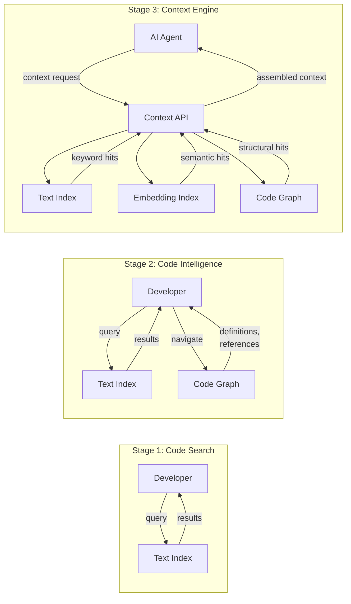
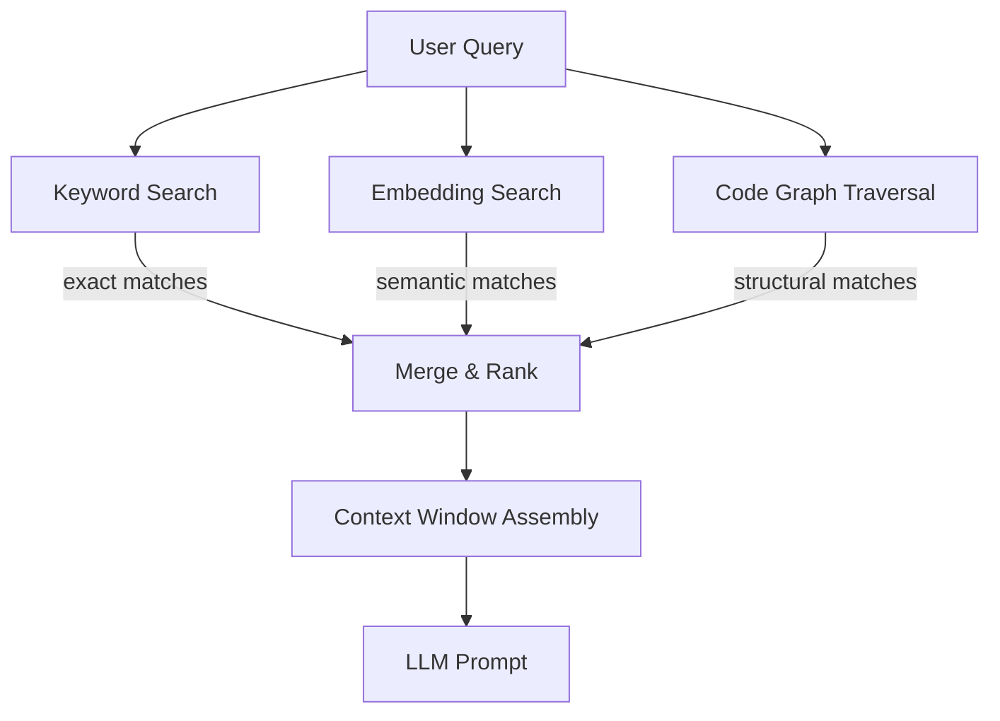
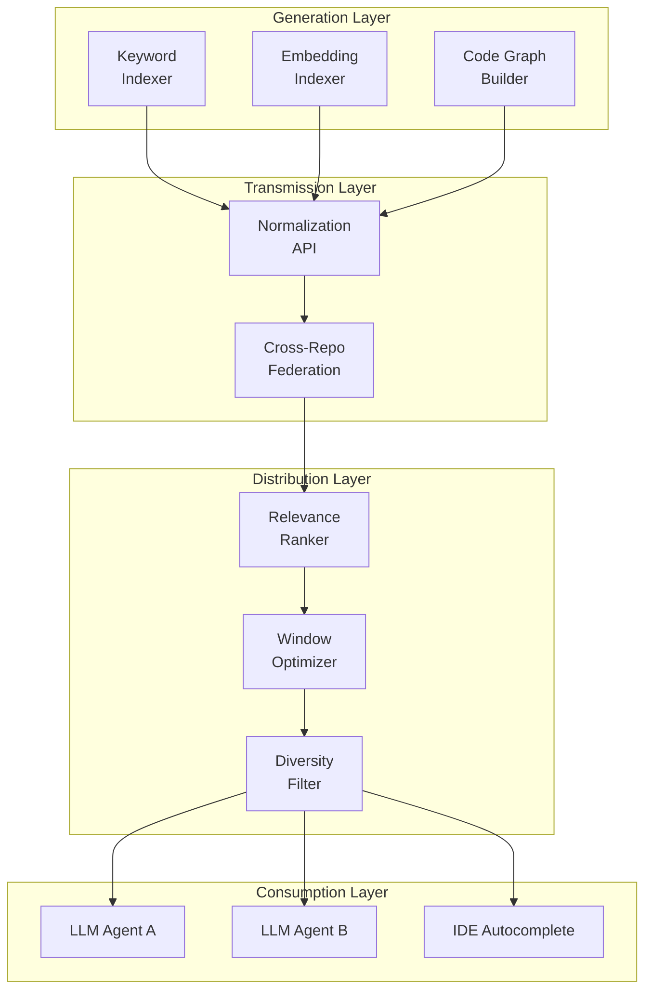
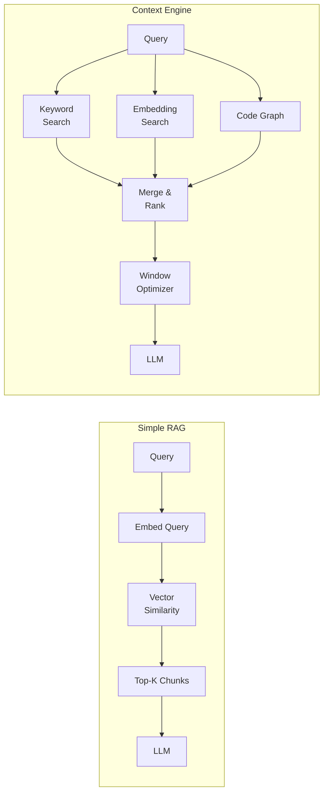
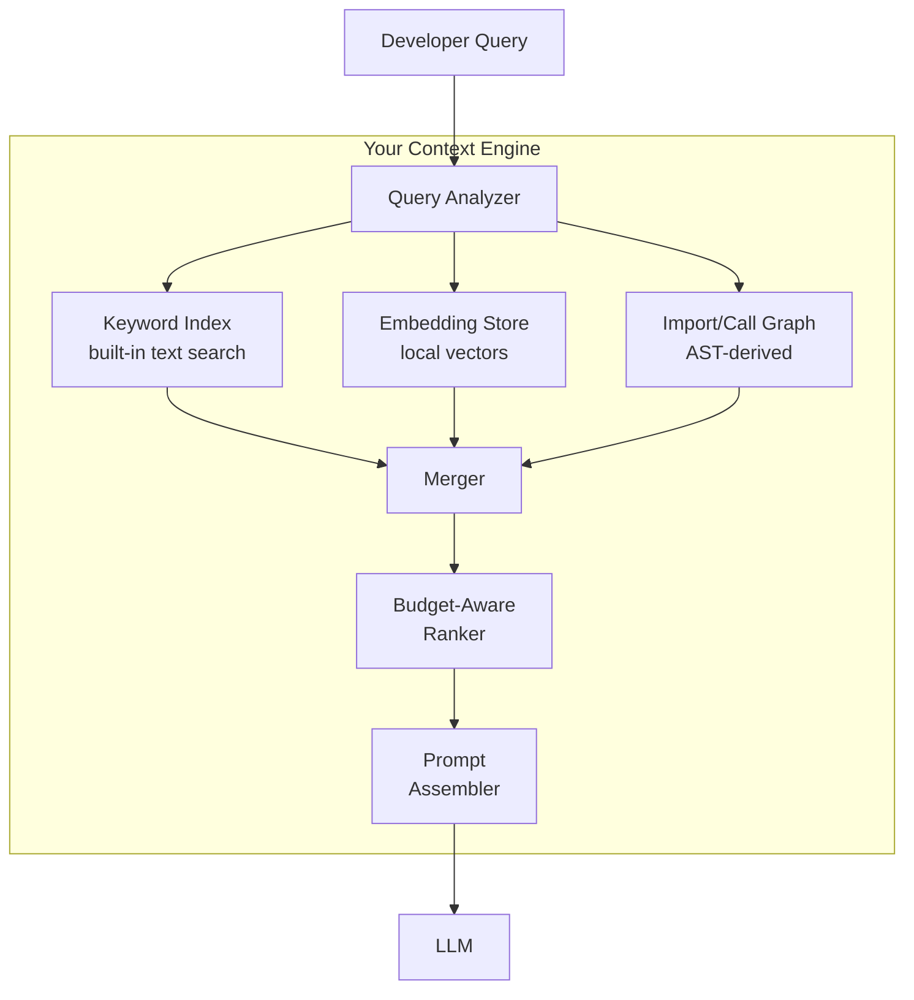

# 3.3 Cody and the Evolution of the Context Power Plant

> **How to read this section:**
> This section closes Chapter 3 by connecting the "Gas Town" infrastructure mindset (Section 3.1) with the retrieval engineering you learned in Section 3.2. We trace Sourcegraph's evolution from code search to Cody's AI-powered context engine—the "power plant" that generates, transmits, and distributes context to coding agents. Work through the five concept loops in order; each builds on the previous. Budget 45–60 minutes; spend an extra 20 if you want to complete the exercises.

---

## Why this section matters

In Section 3.1 we argued that developer tools must become **infrastructure**—services that agents consume at machine speed, not features humans click through at UI speed. In Section 3.2 we diagnosed exactly *why* naive RAG fails for code: textual similarity is not structural relevance, cross-file relationships get shredded, and fixed-size chunks destroy the very structures a coding agent needs to reason about.

Those two ideas converge here. Sourcegraph's Cody is the clearest real-world case study of a tool that made the Gas Town transition: it started as a human-speed code-search product and evolved into a machine-speed **context power plant** that fuels AI coding agents. Understanding *how* it did that—and what architectural decisions made it possible—gives you a blueprint for building (or evaluating) context infrastructure for your own agentic systems.

> **Key idea:** A context engine is not a better search bar. It is a power grid—generating, normalizing, and delivering context to any consumer at any speed.

---

## Deliverable

By the end of this section you will be able to:

1. Explain how Sourcegraph evolved from code search to a context engine.
2. Describe Cody's triple-retrieval strategy (keyword + embeddings + code graph) and why each leg matters.
3. Apply the "context power plant" metaphor to evaluate any context pipeline's generation, transmission, and distribution layers.
4. Articulate the concrete differences between a context engine and simple RAG.
5. Build a minimal context engine that combines all three retrieval strategies.

---

## Loop 1 — From Search to Context Engine

### Concept

Sourcegraph was founded around 2013 by Quinn Slack and Beyang Liu with a clear mission: **universal code search**. If you could search all of your organization's code—every repo, every branch, every language—developers would move faster. That product was successful, but it was firmly a *human-speed* tool: a developer types a query, reads ten results, and clicks into one.

The shift happened in three stages:

| Stage | Era | Product | Speed |
|-------|-----|---------|-------|
| 1. Code Search | 2013–2018 | Sourcegraph Search | Human-speed (Mode A) |
| 2. Code Intelligence | 2018–2022 | Code graph, cross-repo navigation | Human-speed + API |
| 3. Context Engine | 2022–present | Cody (AI assistant) | Machine-speed (Mode B) |

Stage 2 is the pivot that made Stage 3 possible. By building a **code graph**—an index of every definition, reference, symbol hierarchy, and dependency across all repositories—Sourcegraph accumulated the structural data that naive RAG (Section 3.2) cannot reconstruct from flat text chunks.

> **Key idea:** The leap from "search product" to "context engine" was not an AI story—it was a *data infrastructure* story. The code graph existed before any LLM integration. The AI layer simply became the highest-value consumer of that graph.

When Steve Yegge joined Sourcegraph as Head of Engineering, he brought two decades of platform thinking from Amazon and Google—and a conviction (explored in Section 3.1) that tools must expose **services, not UIs**. This philosophy drove the architecture co-developed by Yegge and co-founder Beyang Liu, internally called "Normsky": a system that deeply indexes, normalizes, and pre-processes massive codebases so that any AI agent can request context as a service.



### Worked example

Imagine a company with 500 repositories and 80 million lines of code. A developer searching for "authentication middleware" in Stage 1 gets a list of files containing those words. In Stage 2, she can also jump to the *definition* of `AuthMiddleware` and see every caller across all 500 repos. In Stage 3, an AI agent asks the Context API for "everything relevant to adding OAuth2 support to the auth middleware," and the engine returns keyword matches, semantically similar code (even if it uses different names), *and* the full call chain of the existing auth stack—assembled and ranked for an LLM prompt.

**Example 3-10. Simulating Three Stages of Context Evolution**

```python
"""Simulate the three stages of Sourcegraph's evolution from
code search to context engine."""

from dataclasses import dataclass


@dataclass
class CodeSnippet:
    repo: str
    file: str
    symbol: str
    content: str
    kind: str  # "definition" | "reference" | "doc"


# Simulated codebase
CODEBASE = [
    CodeSnippet("auth-service", "middleware.py", "AuthMiddleware",
                "class AuthMiddleware:\n    def verify(self, token): ...",
                "definition"),
    CodeSnippet("auth-service", "oauth.py", "OAuthProvider",
                "class OAuthProvider:\n    def get_token(self): ...",
                "definition"),
    CodeSnippet("api-gateway", "routes.py", "apply_auth",
                "from auth_service import AuthMiddleware\nmw = AuthMiddleware()",
                "reference"),
    CodeSnippet("user-service", "login.py", "login_handler",
                "# Authenticates user via OAuth flow\ndef login_handler(): ...",
                "reference"),
    CodeSnippet("docs-repo", "auth.md", "auth_docs",
                "## Authentication\nWe use token-based auth with middleware.",
                "doc"),
]


def stage1_text_search(query: str) -> list[CodeSnippet]:
    """Stage 1: plain keyword search."""
    q = query.lower()
    return [s for s in CODEBASE if q in s.content.lower() or q in s.symbol.lower()]


def stage2_code_intel(query: str) -> dict[str, list[CodeSnippet]]:
    """Stage 2: keyword search + code graph (definitions & references)."""
    keyword_hits = stage1_text_search(query)
    # Simulate graph: find all references to any symbol we matched
    matched_symbols = {s.symbol for s in keyword_hits}
    graph_hits = [s for s in CODEBASE
                  if any(sym.lower() in s.content.lower() for sym in matched_symbols)
                  and s not in keyword_hits]
    return {"keyword": keyword_hits, "graph": graph_hits}


def stage3_context_engine(query: str) -> dict[str, list[CodeSnippet]]:
    """Stage 3: keyword + semantic + code graph."""
    keyword_hits = stage1_text_search(query)
    # Simulate semantic: find snippets whose *meaning* overlaps
    semantic_keywords = {"oauth", "token", "authenticat"}
    semantic_hits = [s for s in CODEBASE
                     if any(k in s.content.lower() for k in semantic_keywords)
                     and s not in keyword_hits]
    # Simulate graph expansion
    all_symbols = {s.symbol for s in keyword_hits + semantic_hits}
    graph_hits = [s for s in CODEBASE
                  if any(sym.lower() in s.content.lower() for sym in all_symbols)
                  and s not in keyword_hits and s not in semantic_hits]
    return {"keyword": keyword_hits, "semantic": semantic_hits, "graph": graph_hits}


# --- Run all three stages ---
query = "AuthMiddleware"
print("=== Stage 1: Text Search ===")
for s in stage1_text_search(query):
    print(f"  [{s.repo}] {s.file} — {s.symbol}")

print("\n=== Stage 2: Code Intelligence ===")
s2 = stage2_code_intel(query)
for kind, hits in s2.items():
    for s in hits:
        print(f"  [{kind}] {s.repo}/{s.file} — {s.symbol}")

print("\n=== Stage 3: Context Engine ===")
s3 = stage3_context_engine(query)
for kind, hits in s3.items():
    for s in hits:
        print(f"  [{kind}] {s.repo}/{s.file} — {s.symbol}")

total = sum(len(v) for v in s3.values())
print(f"\nTotal context snippets delivered: {total}")
```

> **Tip:** Notice that each stage is a strict superset of the previous one. Stage 3 finds the OAuth provider and the login handler—code that Stage 1 would never return for the query "AuthMiddleware" because neither file contains that string.

### Check yourself

- Can you name the three stages of Sourcegraph's evolution?
- Why was the code graph (Stage 2) a prerequisite for the context engine (Stage 3)?
- What kinds of relevant code does Stage 1 miss that Stage 3 captures?

---

## Loop 2 — Triple Retrieval: How Cody Finds Code

### Concept

Cody's context engine uses **three retrieval strategies** in parallel, then merges and ranks their results. Each strategy has different strengths:

| Strategy | Finds | Misses | Speed |
|----------|-------|--------|-------|
| **Keyword search** | Exact names, identifiers, error messages | Renamed or aliased concepts | Fast |
| **Embedding search** | Semantically similar code, even with different names | Structural relationships (who calls whom) | Medium |
| **Code graph traversal** | Callers, callees, inheritance chains, imports | Concepts with no direct structural link | Medium |

No single strategy is sufficient. Keyword search is precise but brittle—rename a function and it breaks. Embeddings capture meaning but are blind to structure. The code graph captures structure but only follows edges that exist in the index.

> **Key idea:** Triple retrieval works because the three strategies have *complementary blind spots*. What one misses, another catches.



### Worked example

Suppose a developer asks Cody: *"How does payment processing handle retries?"*

- **Keyword search** finds files containing "payment" and "retry."
- **Embedding search** finds a `BackoffStrategy` class that never mentions "payment" or "retry" but implements exponential backoff—semantically related.
- **Code graph** follows the call chain from `PaymentProcessor.charge()` → `RetryExecutor.run()` → `BackoffStrategy.wait()`, surfacing the exact execution path.

Together, the three legs give the LLM a complete picture: the entry point, the retry mechanism, and the backoff strategy.

**Example 3-11. Simulating Triple Retrieval for a Payment Query**

```python
"""Simulate Cody's triple-retrieval strategy: keyword, embedding,
and code graph working together on a payment-retry query."""

from dataclasses import dataclass, field


@dataclass
class CodeChunk:
    file: str
    symbol: str
    content: str
    tags: list[str] = field(default_factory=list)     # semantic tags
    calls: list[str] = field(default_factory=list)     # outgoing call edges


# Simulated codebase fragments
CHUNKS = [
    CodeChunk("payments.py", "PaymentProcessor.charge",
              "def charge(self, amount):\n    return RetryExecutor(self._do_charge).run(amount)",
              tags=["payment", "charge", "transaction"],
              calls=["RetryExecutor.run"]),
    CodeChunk("retry.py", "RetryExecutor.run",
              "def run(self, *args):\n    for attempt in range(self.max_retries):\n"
              "        try: return self.fn(*args)\n"
              "        except: self.backoff.wait(attempt)",
              tags=["retry", "resilience", "execution"],
              calls=["BackoffStrategy.wait"]),
    CodeChunk("backoff.py", "BackoffStrategy.wait",
              "def wait(self, attempt):\n    delay = min(2 ** attempt, self.max_delay)\n"
              "    time.sleep(delay)",
              tags=["backoff", "exponential", "delay", "resilience"],
              calls=[]),
    CodeChunk("logging.py", "AuditLogger.log_payment",
              "def log_payment(self, tx):\n    # Records payment for audit trail",
              tags=["payment", "audit", "logging"],
              calls=[]),
    CodeChunk("notifications.py", "send_receipt",
              "def send_receipt(email, amount):\n    # Emails payment confirmation",
              tags=["email", "notification", "payment"],
              calls=[]),
]

# Build a call-graph index
CALL_GRAPH: dict[str, list[str]] = {}
for c in CHUNKS:
    CALL_GRAPH[c.symbol] = c.calls


def keyword_search(query_terms: list[str]) -> list[CodeChunk]:
    """Leg 1: literal keyword matching."""
    results = []
    for chunk in CHUNKS:
        text = (chunk.content + " " + chunk.symbol).lower()
        if any(term in text for term in query_terms):
            results.append(chunk)
    return results


def embedding_search(query_tags: list[str], already_found: set[str]) -> list[CodeChunk]:
    """Leg 2: simulated semantic search via tag overlap."""
    scored: list[tuple[int, CodeChunk]] = []
    for chunk in CHUNKS:
        if chunk.symbol in already_found:
            continue
        overlap = len(set(chunk.tags) & set(query_tags))
        if overlap > 0:
            scored.append((overlap, chunk))
    scored.sort(key=lambda x: x[0], reverse=True)
    return [chunk for _, chunk in scored]


def graph_traversal(seed_symbols: list[str], already_found: set[str]) -> list[CodeChunk]:
    """Leg 3: follow call-graph edges from seed symbols."""
    visited: set[str] = set()
    queue = list(seed_symbols)
    results: list[CodeChunk] = []
    while queue:
        sym = queue.pop(0)
        if sym in visited:
            continue
        visited.add(sym)
        for callee in CALL_GRAPH.get(sym, []):
            queue.append(callee)
            if callee not in already_found:
                for chunk in CHUNKS:
                    if chunk.symbol == callee and chunk.symbol not in already_found:
                        results.append(chunk)
                        already_found.add(chunk.symbol)
    return results


# --- Execute triple retrieval ---
print("Query: 'How does payment processing handle retries?'\n")

# Leg 1: Keyword
kw_results = keyword_search(["payment", "retry"])
kw_symbols = {c.symbol for c in kw_results}
print("── Leg 1: Keyword Search ──")
for c in kw_results:
    print(f"  ✓ {c.symbol}  ({c.file})")

# Leg 2: Embedding
found_so_far = set(kw_symbols)
emb_results = embedding_search(["payment", "retry", "resilience", "backoff"], found_so_far)
for c in emb_results:
    found_so_far.add(c.symbol)
print("\n── Leg 2: Embedding Search ──")
for c in emb_results:
    print(f"  ✓ {c.symbol}  ({c.file})")

# Leg 3: Graph
graph_results = graph_traversal([c.symbol for c in kw_results], set(found_so_far))
print("\n── Leg 3: Code Graph Traversal ──")
for c in graph_results:
    print(f"  ✓ {c.symbol}  ({c.file})")

# Merged context
all_results = kw_results + emb_results + graph_results
print(f"\n── Merged Context Window: {len(all_results)} chunks ──")
for i, c in enumerate(all_results, 1):
    print(f"  {i}. {c.symbol}")
```

> **Pitfall:** A system that relies on *only* embedding search would find `BackoffStrategy` and `AuditLogger` (both semantically related to payments/resilience) but would miss the *execution path* from `charge()` through `RetryExecutor` to `BackoffStrategy`. Without the code graph leg, the LLM has puzzle pieces but no picture of how they connect.

### Check yourself

- Why can't keyword search alone find `BackoffStrategy` when the query is about payment retries?
- What does graph traversal add that embedding search cannot provide?
- In what scenario would embedding search be the *only* leg that finds a relevant result?

---

## Loop 3 — The Context Power Plant Metaphor

### Concept

Steve Yegge and Beyang Liu described Cody's architecture as a "power plant"—and the metaphor is precise. A power grid has four layers:

1. **Generation** — raw energy is produced (coal, solar, nuclear).
2. **Transmission** — high-voltage lines carry power over long distances.
3. **Distribution** — substations step down voltage for neighborhoods.
4. **Consumption** — appliances draw exactly the power they need.

A context power plant mirrors this:

1. **Generation** — raw context is produced by indexing code (keyword index, embedding index, code graph).
2. **Transmission** — context flows through APIs, normalized and pre-processed (the "Normsky" architecture).
3. **Distribution** — a context assembler selects, ranks, and fits snippets into the LLM's context window.
4. **Consumption** — the LLM (or agent) consumes the assembled context to generate a response.

> **Key idea:** The power plant metaphor forces you to think about context as *infrastructure with layers*, not a single retrieval call. Each layer can be scaled, monitored, and optimized independently.



This is the Gas Town principle from Section 3.1 made concrete. The context engine is not a feature inside Cody—it is a *service* that any consumer (chat agent, autocomplete, code review bot) can draw from. Just as a power grid serves homes, factories, and hospitals from the same generation infrastructure, a context power plant serves multiple AI consumers from the same indexes.

> **Tip:** When evaluating a context system, ask: "Can I swap the consumer without rebuilding the pipeline?" If yes, you have a power plant. If no, you have a monolith.

### Worked example

Consider an enterprise with three AI-powered features: (1) a chat assistant, (2) inline autocomplete, and (3) an automated code reviewer. Without a power plant architecture, each feature builds its own retrieval pipeline—tripling the indexing cost and creating inconsistent context. With a power plant, all three share the generation and transmission layers; only the distribution layer varies (the chat assistant needs broad context, autocomplete needs narrow/local context, the reviewer needs diff-focused context).

**Example 3-12. Modeling the Context Power Plant Pipeline**

```python
"""Model the four layers of a context power plant:
generation → transmission → distribution → consumption."""

from dataclasses import dataclass


# --- Generation Layer ---
@dataclass
class RawSnippet:
    source: str       # "keyword" | "embedding" | "graph"
    file: str
    content: str
    relevance: float   # 0.0–1.0

def generate_context(query: str) -> list[RawSnippet]:
    """Simulate the generation layer producing raw snippets."""
    return [
        RawSnippet("keyword",   "auth/login.py",
                   "def login(user, password): ...", 0.9),
        RawSnippet("keyword",   "auth/logout.py",
                   "def logout(session): ...", 0.3),
        RawSnippet("embedding", "auth/oauth.py",
                   "class OAuthFlow:\n    def authorize(self): ...", 0.75),
        RawSnippet("embedding", "utils/crypto.py",
                   "def hash_password(pw): ...", 0.6),
        RawSnippet("graph",     "auth/middleware.py",
                   "class AuthMiddleware:\n    calls login(), checks session", 0.85),
        RawSnippet("graph",     "auth/session.py",
                   "class SessionStore:\n    def get(self, sid): ...", 0.7),
    ]


# --- Transmission Layer ---
@dataclass
class NormalizedSnippet:
    file: str
    content: str
    relevance: float
    source: str
    token_estimate: int

def transmit(raw: list[RawSnippet]) -> list[NormalizedSnippet]:
    """Normalize and enrich snippets (the 'Normsky' step)."""
    normalized = []
    for r in raw:
        tokens = len(r.content.split()) * 2  # rough token estimate
        normalized.append(NormalizedSnippet(
            file=r.file,
            content=r.content,
            relevance=r.relevance,
            source=r.source,
            token_estimate=tokens,
        ))
    return normalized


# --- Distribution Layer ---
def distribute(snippets: list[NormalizedSnippet],
               budget: int, min_sources: int = 2) -> list[NormalizedSnippet]:
    """Select snippets that fit the token budget while maintaining
    source diversity (at least `min_sources` retrieval strategies)."""
    # Sort by relevance
    ranked = sorted(snippets, key=lambda s: s.relevance, reverse=True)
    selected: list[NormalizedSnippet] = []
    sources_used: set[str] = set()
    tokens_used = 0

    for s in ranked:
        if tokens_used + s.token_estimate > budget:
            continue
        selected.append(s)
        sources_used.add(s.source)
        tokens_used += s.token_estimate

    # Diversity check
    if len(sources_used) < min_sources:
        # Force-include top snippet from missing sources
        for s in ranked:
            if s.source not in sources_used and s not in selected:
                if tokens_used + s.token_estimate <= budget:
                    selected.append(s)
                    sources_used.add(s.source)
                    tokens_used += s.token_estimate
    return selected


# --- Consumption Layer ---
def consume(context: list[NormalizedSnippet], consumer: str) -> str:
    """Assemble final prompt context for a given consumer."""
    header = f"[{consumer}] Context ({len(context)} snippets, " \
             f"{sum(s.token_estimate for s in context)} est. tokens):\n"
    body = "\n".join(f"  • {s.file} [{s.source}] (rel={s.relevance:.2f}): "
                     f"{s.content[:60]}..."
                     for s in context)
    return header + body


# --- Run the pipeline ---
print("╔══ CONTEXT POWER PLANT ══╗\n")

raw = generate_context("login authentication flow")
print(f"Generation:   {len(raw)} raw snippets produced")

normalized = transmit(raw)
print(f"Transmission: {len(normalized)} snippets normalized")

# Two different consumers with different budgets
for consumer, budget in [("Chat Agent", 80), ("Autocomplete", 30)]:
    selected = distribute(normalized, budget=budget)
    prompt_ctx = consume(selected, consumer)
    print(f"\nDistribution → {consumer} (budget={budget} tokens):")
    print(prompt_ctx)

print("\n╚══ PIPELINE COMPLETE ══╝")
```

> **Warning:** Without a diversity filter in the distribution layer, high-relevance keyword hits can crowd out graph and embedding results. The consumer ends up with five lexically similar files and no structural context—exactly the failure mode we diagnosed in Section 3.2.

### Check yourself

- Name the four layers of the context power plant and their real-world power-grid analogues.
- Why does the distribution layer need a *diversity* constraint, not just a relevance sort?
- How does the power plant model support the Gas Town principle of "services, not features"?

---

## Loop 4 — Context Engine vs. Simple RAG

### Concept

Section 3.2 laid out five ways naive RAG fails for code. Now we can see exactly how a context engine addresses each failure:

| RAG Failure (from 3.2) | Context Engine Solution |
|------------------------|------------------------|
| Textual similarity ≠ structural relevance | Code graph traversal follows *structural* edges |
| Cross-file relationships lost | Multi-repo graph indexes relationships across repo boundaries |
| Fixed-size chunks destroy AST structure | Graph-aware chunking respects symbol boundaries |
| No recency signal | Continuous re-indexing updates indexes as code changes |
| Single retrieval strategy | Triple retrieval (keyword + embedding + graph) |

The core difference is this: RAG treats code as *text that happens to be in files*. A context engine treats code as a *graph of interconnected symbols that happens to be expressed as text*.

> **Key idea:** RAG retrieves *documents*. A context engine retrieves *understanding*.



> **Tip:** When you hear "we use RAG for our codebase," ask two questions: (1) Does it follow structural edges? (2) Does it use more than one retrieval strategy? If the answer to both is no, it's vanilla RAG—and Section 3.2 explains why that falls short.

### Worked example

Let's make this concrete. Consider the query: *"What validates user input before it reaches the database?"* In a codebase where the validation logic is in `validators.py`, the route handler is in `api/routes.py`, and the ORM model is in `models/user.py`:

- **RAG** embeds the query, finds `validators.py` (high textual similarity), and maybe `api/routes.py` (mentions "user input"). It misses the ORM model entirely—there's no textual overlap.
- **Context Engine** finds `validators.py` (keyword), `api/routes.py` (embedding—similar intent), *and* traces the call chain `routes.handle_create_user()` → `validators.validate()` → `User.save()` to surface `models/user.py` (graph traversal).

**Example 3-13. Context Engine vs. RAG — Side-by-Side Comparison**

```python
"""Compare what a simple RAG pipeline retrieves versus what a
context engine retrieves for the same query."""

from dataclasses import dataclass, field

@dataclass
class CodeFile:
    path: str
    content: str
    symbols: list[str] = field(default_factory=list)
    calls: list[str] = field(default_factory=list)  # outgoing calls


FILES = [
    CodeFile("validators.py",
             "def validate_user(data):\n    if not data.get('email'): raise ValueError\n"
             "    if len(data['name']) > 100: raise ValueError",
             symbols=["validate_user"],
             calls=[]),
    CodeFile("api/routes.py",
             "def handle_create_user(request):\n    data = request.json\n"
             "    validate_user(data)\n    user = User(**data)\n    user.save()",
             symbols=["handle_create_user"],
             calls=["validate_user", "User.save"]),
    CodeFile("models/user.py",
             "class User(Model):\n    name = CharField(max_length=100)\n"
             "    email = EmailField(unique=True)\n"
             "    def save(self): db.session.add(self); db.session.commit()",
             symbols=["User", "User.save"],
             calls=[]),
    CodeFile("tests/test_validation.py",
             "def test_missing_email():\n    with pytest.raises(ValueError):\n"
             "        validate_user({'name': 'Alice'})",
             symbols=["test_missing_email"],
             calls=["validate_user"]),
    CodeFile("config/database.py",
             "DATABASE_URL = 'postgresql://localhost/app'\n"
             "MAX_CONNECTIONS = 20",
             symbols=["DATABASE_URL", "MAX_CONNECTIONS"],
             calls=[]),
]

CALL_GRAPH: dict[str, list[str]] = {}
for f in FILES:
    for sym in f.symbols:
        CALL_GRAPH[sym] = f.calls


def simple_rag(query: str, top_k: int = 2) -> list[CodeFile]:
    """Simulate RAG: score by keyword overlap, return top-K."""
    query_words = set(query.lower().split())
    scored = []
    for f in FILES:
        text_words = set(f.content.lower().split())
        overlap = len(query_words & text_words)
        scored.append((overlap, f))
    scored.sort(key=lambda x: x[0], reverse=True)
    return [f for _, f in scored[:top_k]]


def context_engine(query: str, top_k: int = 4) -> dict[str, list[CodeFile]]:
    """Simulate context engine: keyword + embedding + graph."""
    query_words = set(query.lower().split())

    # Keyword leg
    keyword_hits = []
    for f in FILES:
        text_words = set((f.content + " ".join(f.symbols)).lower().split())
        if query_words & text_words:
            keyword_hits.append(f)

    # Embedding leg (simulated via semantic tag matching)
    semantic_terms = {"validate", "input", "user", "check", "data"}
    found_paths = {f.path for f in keyword_hits}
    embedding_hits = []
    for f in FILES:
        if f.path in found_paths:
            continue
        if any(t in f.content.lower() for t in semantic_terms):
            embedding_hits.append(f)
            found_paths.add(f.path)

    # Graph leg: follow calls from keyword + embedding seeds
    seed_symbols = []
    for f in (keyword_hits + embedding_hits):
        seed_symbols.extend(f.symbols)

    graph_hits = []
    visited: set[str] = set()
    queue = list(seed_symbols)
    while queue:
        sym = queue.pop(0)
        if sym in visited:
            continue
        visited.add(sym)
        for callee in CALL_GRAPH.get(sym, []):
            queue.append(callee)
            for f in FILES:
                if callee in f.symbols and f.path not in found_paths:
                    graph_hits.append(f)
                    found_paths.add(f.path)

    return {"keyword": keyword_hits, "embedding": embedding_hits, "graph": graph_hits}


# --- Compare ---
query = "What validates user input before it reaches the database"
print("Query:", query)

print("\n━━━ Simple RAG (top-2) ━━━")
rag_results = simple_rag(query)
for f in rag_results:
    print(f"  📄 {f.path}")
print(f"  Files retrieved: {len(rag_results)}")
has_model = any("models/" in f.path for f in rag_results)
print(f"  Includes ORM model? {'✓' if has_model else '✗ — missed!'}")

print("\n━━━ Context Engine ━━━")
ce_results = context_engine(query)
all_ce = []
for strategy, hits in ce_results.items():
    for f in hits:
        print(f"  📄 {f.path}  ← [{strategy}]")
        all_ce.append(f)
print(f"  Files retrieved: {len(all_ce)}")
has_model_ce = any("models/" in f.path for f in all_ce)
print(f"  Includes ORM model? {'✓' if has_model_ce else '✗'}")
print(f"  Includes test file? {'✓' if any('test' in f.path for f in all_ce) else '✗'}")
```

> **Pitfall:** In real systems the gap is even wider. RAG's top-K cutoff means it might return the database config file (high word overlap with "database") instead of the ORM model (low word overlap but structurally critical). Context budgets amplify retrieval quality differences.

### Check yourself

- For the query "What validates user input before it reaches the database?", which file does RAG miss and why?
- How does the code graph leg discover `models/user.py` even though the query has no textual overlap with it?
- Can you identify a query where simple RAG would perform *as well as* a context engine? (Hint: think about purely lexical lookups.)

---

## Loop 5 — Building Your Own Context Pipeline

### Concept

You don't need Sourcegraph to build a context engine. The principles transfer to any codebase. Here are the practical lessons:

1. **Start with the graph.** Even a simple `imports → definitions → references` graph beats flat-text retrieval. You can build one with AST parsing (as we explored in Section 3.2's hyper-context strategies).

2. **Layer your retrieval.** Add strategies incrementally: keyword first (cheap), then embeddings (medium cost), then graph traversal (highest value). Each layer improves recall with diminishing effort.

3. **Normalize everything.** Strip comments? Keep them? The answer depends on your consumer. The transmission layer should offer *both* and let the distribution layer decide.

4. **Respect the budget.** Every token sent to the LLM costs money and attention. Use the context-budget math from Section 3.2 (Equation 3-1) to stay within limits.

5. **Measure retrieval quality.** Track what fraction of the context the LLM actually *uses* in its response. If you send 50 snippets and the model cites 3, your distribution layer is too generous.

> **Warning:** Building a context engine is iterative. Ship keyword search first, measure, then add embeddings, measure, then add graph traversal. Each step should show measurable improvement in agent output quality.

Here is a reference architecture for a minimal context engine:



### Worked example

Let's build a mini context engine that combines all three retrieval strategies in roughly 80 lines. It processes a simulated Python codebase with an import graph, keyword index, and tag-based embedding simulation.

**Example 3-14. Mini Context Engine with Triple Retrieval**

```python
"""A minimal context engine combining keyword search, simulated
embedding search, and import-graph traversal."""

from collections import defaultdict
from dataclasses import dataclass, field


@dataclass
class Module:
    name: str
    content: str
    tags: list[str] = field(default_factory=list)
    imports: list[str] = field(default_factory=list)


# --- Simulated codebase ---
MODULES = [
    Module("app.main", "from app.auth import login_user\n"
           "from app.db import get_connection\n"
           "def start_app():\n    conn = get_connection()\n    login_user(conn)",
           tags=["entry", "startup", "application"],
           imports=["app.auth", "app.db"]),
    Module("app.auth", "from app.crypto import hash_token\n"
           "def login_user(conn):\n    token = generate_token()\n"
           "    hashed = hash_token(token)\n    conn.store(hashed)",
           tags=["authentication", "login", "security"],
           imports=["app.crypto"]),
    Module("app.crypto", "import hashlib\n"
           "def hash_token(token):\n    return hashlib.sha256(token.encode()).hexdigest()\n"
           "def verify_signature(sig, data): ...",
           tags=["cryptography", "hashing", "security"],
           imports=[]),
    Module("app.db", "def get_connection():\n    return DatabasePool.acquire()\n"
           "class DatabasePool:\n    @staticmethod\n    def acquire(): ...",
           tags=["database", "connection", "pool"],
           imports=[]),
    Module("app.middleware", "from app.auth import login_user\n"
           "def auth_middleware(request):\n    if not request.token:\n"
           "        raise Unauthorized",
           tags=["middleware", "authentication", "request"],
           imports=["app.auth"]),
    Module("app.config", "SECRET_KEY = 'dev-only'\nDEBUG = True\nDB_URL = 'sqlite:///app.db'",
           tags=["configuration", "settings"],
           imports=[]),
]

# --- Build indexes ---
# 1. Keyword index (inverted index on words)
keyword_index: dict[str, set[str]] = defaultdict(set)
for mod in MODULES:
    for word in (mod.content + " " + mod.name).lower().split():
        clean = word.strip("(),.:'\"\n")
        if clean:
            keyword_index[clean].add(mod.name)

# 2. Import graph (adjacency list)
import_graph: dict[str, list[str]] = {}
reverse_graph: dict[str, list[str]] = defaultdict(list)
for mod in MODULES:
    import_graph[mod.name] = mod.imports
    for imp in mod.imports:
        reverse_graph[imp].append(mod.name)

# 3. Tag index (simulates embeddings)
tag_index: dict[str, set[str]] = defaultdict(set)
for mod in MODULES:
    for tag in mod.tags:
        tag_index[tag].add(mod.name)

MODULE_MAP = {m.name: m for m in MODULES}


def keyword_search(query: str) -> set[str]:
    words = query.lower().split()
    hits: set[str] = set()
    for w in words:
        hits |= keyword_index.get(w.strip("?"), set())
    return hits


def embedding_search(query: str) -> list[tuple[str, int]]:
    semantic_map = {
        "authentication": ["authentication", "login", "security", "middleware"],
        "login": ["authentication", "login", "security"],
        "token": ["cryptography", "hashing", "security", "authentication"],
        "database": ["database", "connection", "pool"],
        "how": [], "does": [], "work": [], "the": [], "flow": [],
    }
    expanded_tags: list[str] = []
    for word in query.lower().split():
        expanded_tags.extend(semantic_map.get(word.strip("?"), []))

    scores: dict[str, int] = defaultdict(int)
    for tag in expanded_tags:
        for mod_name in tag_index.get(tag, set()):
            scores[mod_name] += 1

    ranked = sorted(scores.items(), key=lambda x: x[1], reverse=True)
    return ranked


def graph_search(seed_modules: set[str]) -> set[str]:
    discovered: set[str] = set()
    queue = list(seed_modules)
    visited: set[str] = set()
    while queue:
        mod = queue.pop(0)
        if mod in visited:
            continue
        visited.add(mod)
        # Follow imports (downstream)
        for imp in import_graph.get(mod, []):
            if imp not in seed_modules:
                discovered.add(imp)
            queue.append(imp)
        # Follow reverse imports (upstream — who uses this?)
        for parent in reverse_graph.get(mod, []):
            if parent not in seed_modules:
                discovered.add(parent)
    return discovered


def assemble_context(modules: list[str], budget: int) -> list[str]:
    selected: list[str] = []
    tokens = 0
    for name in modules:
        mod = MODULE_MAP.get(name)
        if not mod:
            continue
        est = len(mod.content.split()) * 2
        if tokens + est > budget:
            continue
        selected.append(name)
        tokens += est
    return selected


# --- Run the engine ---
query = "How does the authentication login flow work?"
print(f"Query: '{query}'\n")

# Step 1: Keyword
kw = keyword_search(query)
print(f"1. Keyword search → {sorted(kw)}")

# Step 2: Embedding
emb = embedding_search(query)
print(f"2. Embedding search → {[(n, s) for n, s in emb[:4]]}")
emb_names = {n for n, _ in emb[:3]}

# Step 3: Graph (seed from keyword + embedding)
seeds = kw | emb_names
graph = graph_search(seeds)
print(f"3. Graph traversal (from {sorted(seeds)}) → {sorted(graph)}")

# Step 4: Merge and deduplicate
all_modules = list(dict.fromkeys(
    sorted(kw) + [n for n, _ in emb[:3]] + sorted(graph)
))
print(f"\n4. Merged (deduplicated): {all_modules}")

# Step 5: Budget-aware assembly
TOKEN_BUDGET = 150
final = assemble_context(all_modules, budget=TOKEN_BUDGET)
print(f"5. After budget filter ({TOKEN_BUDGET} tokens): {final}")

# Show final context
print(f"\n{'='*50}")
print(f"FINAL CONTEXT ({len(final)} modules):")
print(f"{'='*50}")
for name in final:
    mod = MODULE_MAP[name]
    print(f"\n--- {name} ---")
    print(mod.content[:120])
```

> **Tip:** This mini engine is about 80 lines of logic. A production system would replace the tag-based embedding simulation with actual vector embeddings and the import graph with a full code-graph index—but the *architecture* is identical. Start here, then swap in real components.

> **Key idea:** The value of a context engine grows super-linearly with codebase size. For a 10-file project, RAG and a context engine produce similar results. For a 10,000-file monorepo, the context engine finds connections that RAG structurally cannot.

### Check yourself

- In the mini engine, what role does the reverse import graph play?
- Why does the engine apply a budget filter *after* merging all three result sets?
- If you could add only one improvement to this engine, what would give the highest quality boost? (Hint: revisit Section 3.2's AST-aware chunking.)

---

## What we built

This section traced Sourcegraph's evolution from code search to Cody's context power plant. Here is what you now have:

| Concept | Where it lives |
|---------|---------------|
| Three-stage evolution (search → intelligence → engine) | Loop 1 |
| Triple retrieval (keyword + embedding + graph) | Loop 2 |
| Four-layer power plant (generation → transmission → distribution → consumption) | Loop 3 |
| Context engine vs. RAG comparison | Loop 4 |
| Mini context engine implementation | Loop 5 |

Together with Section 3.1 (Gas Town infrastructure) and Section 3.2 (RAG failures and hyper-context), you now have a complete mental model for how modern coding agents get their context—and why the quality of that context is the single largest determinant of agent effectiveness.

> **Key idea:** CHOP — Chat-Oriented Programming. Steve Yegge's term for the shift from writing every line of code to *conversing* with agents that have deep context. CHOP only works when the context engine is powerful enough to make the agent's responses trustworthy. Everything in this chapter—Gas Town infrastructure, infinite-window retrieval, the context power plant—exists to make CHOP reliable at enterprise scale.

---

## Verification checklist

Before moving on, confirm you can:

- [ ] Sketch the three stages of Sourcegraph's evolution and name the key data asset at each stage
- [ ] Explain why triple retrieval's three legs have complementary blind spots
- [ ] Draw the four-layer power plant diagram from memory and label each layer
- [ ] Given a query and a codebase, predict which files RAG would miss that a context engine would find
- [ ] Modify the mini context engine (Example 3-14) to add a new retrieval strategy or codebase module
- [ ] Define CHOP and explain what infrastructure it requires

---

## Wrapping up

Chapter 3 is now complete. We started with Steve Yegge's Gas Town vision for high-throughput agentic environments (Section 3.1), diagnosed why naive retrieval fails for code and built hyper-context strategies to fix it (Section 3.2), and traced how Sourcegraph's Cody turned those ideas into a production context power plant (this section).

The key thread across all three sections: **context is infrastructure**. It must be generated, transmitted, distributed, and consumed as a service—not bolted on as an afterthought. The quality of an agent's context determines the ceiling of its intelligence.

In Chapter 4, we will explore the next architectural sovereign—the execution harness that turns an agent's *plan* into running code.

**Exercise 3-13.** *Layer identification.*
Take any AI coding tool you use (GitHub Copilot, Cursor, Cody, etc.) and identify which of the four power-plant layers it exposes. Which layers are hidden from the user? Write a one-paragraph analysis.

**Exercise 3-14.** *Blind-spot analysis.*
Create a five-file Python project where keyword search returns zero relevant results for a specific query, but embedding search finds two files and graph traversal finds one. Document the query and explain why each strategy succeeds or fails.

**Exercise 3-15.** *Budget sensitivity.*
Modify Example 3-12 to test three different token budgets (50, 100, 200). For each budget, count how many retrieval strategies are represented in the final context. At what budget does the diversity filter stop being needed?

**Exercise 3-16.** *Graph depth experiment.*
Extend Example 3-14's `graph_search` to accept a `max_depth` parameter that limits how many edges it follows. Run the engine with depths 1, 2, and 3. How does result quality change? Is deeper always better?

**Exercise 3-17.** *RAG vs. engine benchmark.*
Create a 20-module simulated codebase with realistic cross-file dependencies. Run both `simple_rag` (Example 3-13) and `context_engine` against five different queries. Score each result set on precision (fraction of results that are relevant) and recall (fraction of relevant modules retrieved). Present your results in a table.

**Exercise 3-18.** *CHOP readiness assessment.*
Steve Yegge argues that Chat-Oriented Programming requires a context engine powerful enough to make agent responses trustworthy. Define three measurable criteria for "CHOP readiness" (e.g., "the agent's suggested code compiles on first try > 80% of the time"). For each criterion, explain which power-plant layer most directly affects it.
