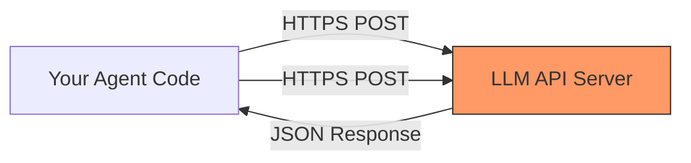
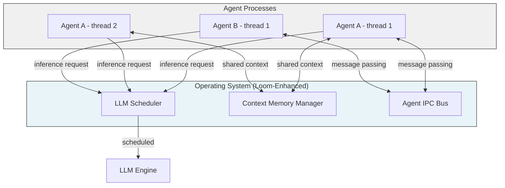
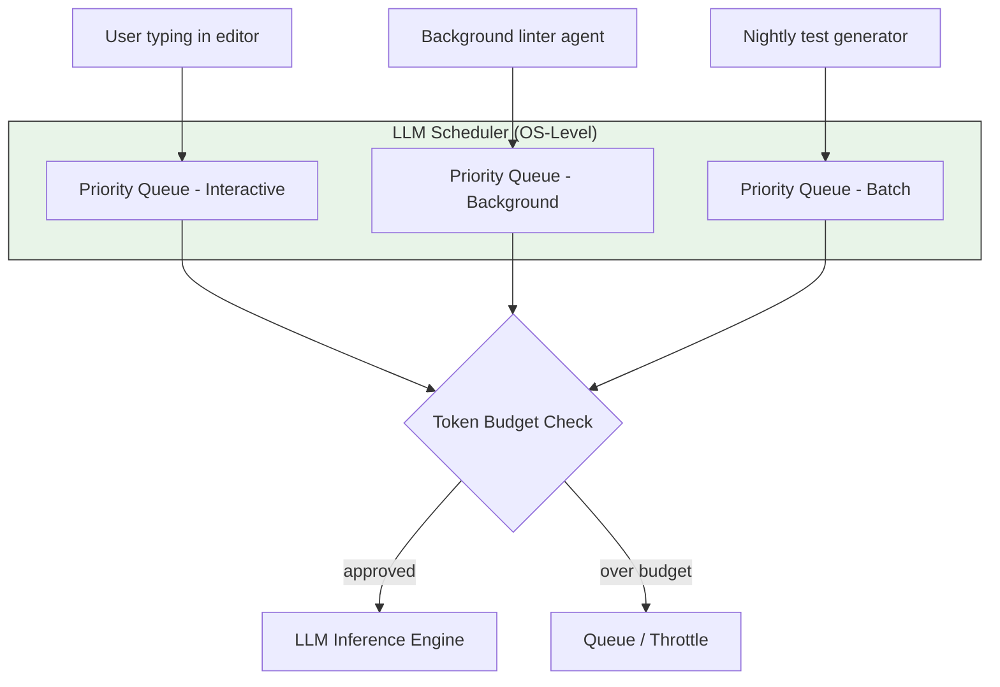
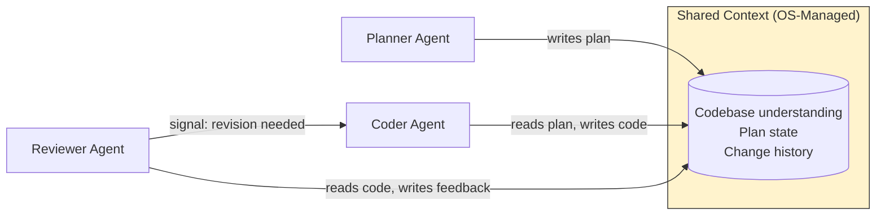
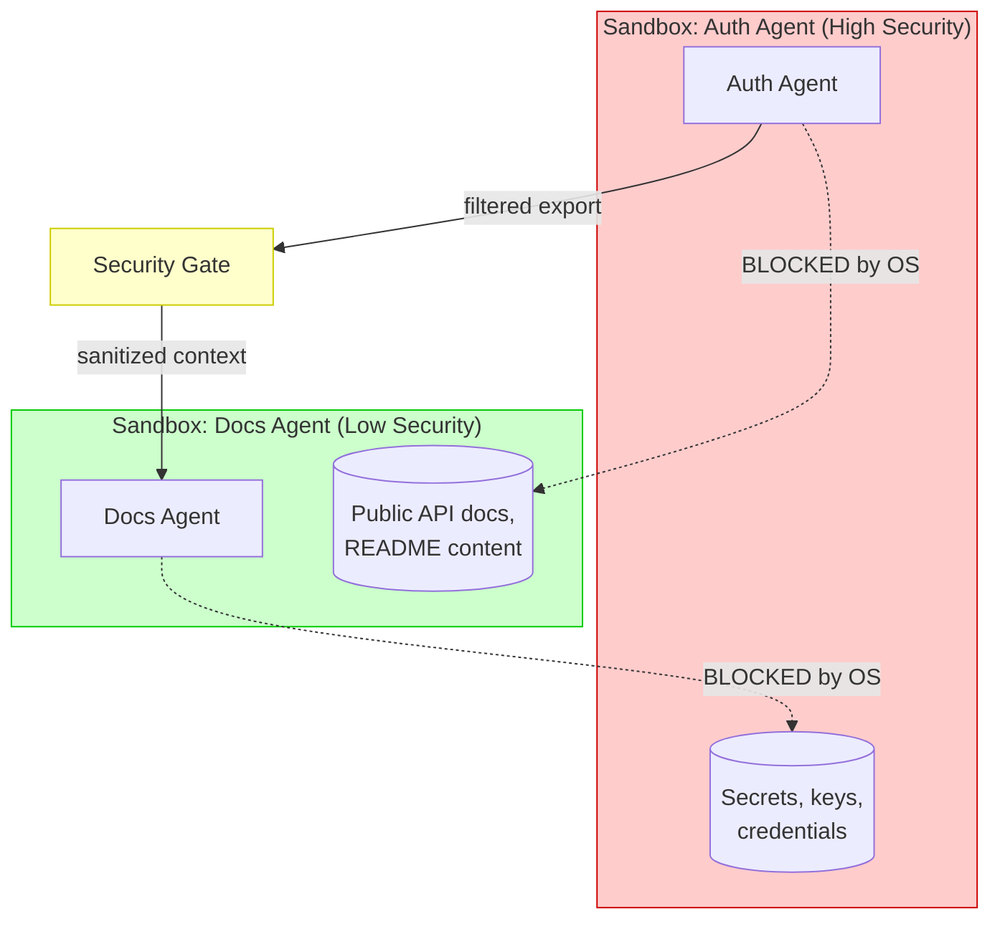
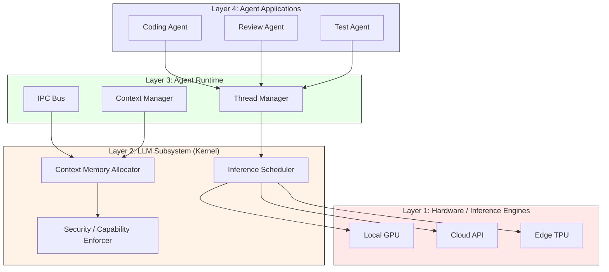

# 4.1 Jordan Hubbard's Threading: LLMs as First-Class OS Citizens

> **Key idea:** What if LLMs weren't external APIs you call over HTTP, but native resources managed by your operating system — scheduled, isolated, and composed just like processes and threads?

## Orientation

Every modern operating system manages three core abstractions: **processes**, **threads**, and **filesystems**. When you launch a program, the OS allocates memory, schedules CPU time, and handles inter-process communication. You never think about the plumbing — it just works.

Now consider how we use LLMs today. An agent framework spins up, opens an HTTPS connection to a remote API, marshals JSON back and forth, and bolts on its own retry logic, rate limiting, and state management. The LLM lives *outside* the system. It's a guest, not a citizen.

**Jordan Hubbard** — co-founder of the FreeBSD project and former director of engineering at Apple — looked at this gap and asked a deceptively simple question: *What if the operating system treated LLMs the way it treats threads?*

His answer is **Loom**: a conceptual framework (and emerging implementation) that promotes LLMs from external services to **first-class OS primitives**. This chapter section explores what that means, why it matters, and what changes when intelligence lives inside the kernel.

---

> ### How to Read This Section
>
> We move through six concept loops:
> 1. **The Status Quo** — how agent frameworks treat LLMs today
> 2. **The Threading Metaphor** — agents as threads in shared memory
> 3. **Scheduling and Resource Management** — what the OS gains
> 4. **Inter-Agent Communication** — from HTTP to IPC
> 5. **Security and Isolation** — sandboxing intelligence
> 6. **Loom in Practice** — a worked architecture walkthrough
>
> Each loop follows the pattern: *concept → worked example → code sketch → check-yourself question*. You don't need OS internals experience, but familiarity with processes and threads (even conceptual) will help.

---

## Loop 1: The Status Quo — LLMs as External Services

### Concept

Today's dominant pattern looks like this:



*Figure 4-1: The current agent-LLM relationship. The LLM is an external service reached over the network.*

Your agent framework handles:
- **Connection management** — retries, timeouts, backoff
- **State serialization** — converting conversation history to JSON
- **Rate limiting** — tracking tokens per minute
- **Scheduling** — deciding which agent gets to call the API next
- **Error recovery** — handling 429s, 500s, and network failures

Every framework reinvents this wheel. Claude Code has its own retry logic. Cursor has its own. Windsurf has its own. They all solve the same problem differently because the operating system offers them *no help*.

> **Pitfall:** When every framework builds its own LLM management layer, bugs multiply. A retry storm in one agent can starve others of API quota — and the OS has no visibility into why.

### Worked Example

Consider running three coding agents simultaneously on your laptop:

| Agent | Task | Token Usage |
|-------|------|-------------|
| Agent A | Refactoring auth module | 50k tokens/min |
| Agent B | Writing tests | 30k tokens/min |
| Agent C | Reviewing PR | 20k tokens/min |

With the current model, each agent independently hammers the same API endpoint. If you hit a rate limit, *all three* fail — but none of them knows about the others. There's no shared scheduler, no priority system, no resource accounting.

### Code Sketch

Here's a simplified view of what every agent framework does today:

> **Example 4-1: Typical Agent-to-LLM Call Pattern (Python pseudocode)**

```python
import httpx
import time

class LLMClient:
    """Every agent framework builds something like this."""

    def __init__(self, api_key: str, base_url: str):
        self.client = httpx.Client(base_url=base_url)
        self.api_key = api_key
        self.retry_count = 3
        self.backoff_base = 2.0

    def complete(self, messages: list[dict], model: str) -> str:
        for attempt in range(self.retry_count):
            try:
                response = self.client.post(
                    "/v1/chat/completions",
                    json={"model": model, "messages": messages},
                    headers={"Authorization": f"Bearer {self.api_key}"},
                    timeout=60.0,
                )
                response.raise_for_status()
                return response.json()["choices"][0]["message"]["content"]
            except httpx.HTTPStatusError as e:
                if e.response.status_code == 429:
                    wait = self.backoff_base ** attempt
                    time.sleep(wait)  # Blind retry — no OS coordination
                else:
                    raise
        raise RuntimeError("LLM call failed after retries")
```

Notice what's missing: there's no coordination with other processes, no system-level resource tracking, and no way for the OS to help.

### ✅ Check Yourself

> **Q:** Name two resources that the OS manages for regular processes but *not* for LLM calls in the current model.
>
> **A:** CPU time scheduling and memory allocation. The OS has no concept of "token budget" or "inference priority" for LLM workloads — each agent manages these independently.

---

## Loop 2: The Threading Metaphor — Agents as Threads

### Concept

Hubbard's central insight draws from his decades of OS work: **the relationship between an agent and an LLM should mirror the relationship between a thread and the CPU.**

| OS Concept | Traditional | Loom Equivalent |
|------------|-------------|-----------------|
| Process | Running program | Agent session |
| Thread | Unit of execution | Single LLM interaction chain |
| CPU | Compute resource | LLM inference engine |
| Scheduler | Allocates CPU time | Allocates inference slots |
| Shared memory | Inter-thread data | Shared context window |
| Mutex | Prevents data races | Prevents context corruption |



*Figure 4-2: The Loom model. The OS manages LLM access the way it manages CPU access — through scheduling, memory management, and IPC.*

When you write a multi-threaded program today, you don't manually negotiate CPU time between threads. The OS scheduler handles it. Hubbard argues the same should be true for LLM inference: agents shouldn't negotiate API access — the OS should schedule it.

> **Key idea:** In Loom's model, "calling an LLM" becomes as natural as "spawning a thread." The OS handles scheduling, resource limits, and inter-agent coordination.

### Worked Example

Imagine you're running a complex coding task that spawns three agent threads:

1. **Planner thread** — reads the codebase, creates a plan
2. **Coder thread** — implements changes based on the plan
3. **Reviewer thread** — checks each change for correctness

In today's model, each thread independently calls the API, potentially duplicating context and competing for rate limits. In Loom's model:

- The **OS scheduler** ensures the planner runs first (it has a dependency edge)
- The **shared context** lets the coder read the planner's output without re-sending it to the LLM
- The **IPC bus** lets the reviewer send feedback directly to the coder thread

### Code Sketch

> **Example 4-2: Loom-Style Agent Threading (Conceptual Python)**

```python
# Conceptual API — what Loom-style OS integration could look like

import loom  # Hypothetical OS-level LLM interface

def coding_task(repo_path: str):
    # Create an agent process with shared context
    with loom.AgentProcess(name="refactor-auth") as proc:

        # Spawn threads — OS schedules LLM access
        planner = proc.spawn_thread(
            role="planner",
            priority=loom.HIGH,       # OS respects priority
            context_share="read",     # Can read shared memory
        )

        coder = proc.spawn_thread(
            role="coder",
            priority=loom.NORMAL,
            context_share="read_write",
            depends_on=[planner],     # OS enforces ordering
        )

        reviewer = proc.spawn_thread(
            role="reviewer",
            priority=loom.NORMAL,
            context_share="read",
            depends_on=[coder],
        )

        # The OS handles:
        # - Scheduling inference calls across threads
        # - Sharing context without re-serializing
        # - Enforcing dependency ordering
        # - Resource accounting (tokens used per thread)

        results = proc.join_all()
        return results
```

The key shift: the programmer declares *intent* (priorities, dependencies, sharing modes) and the OS handles *execution*. This is exactly how thread programming works — and exactly how LLM interaction doesn't work today.

### ✅ Check Yourself

> **Q:** In the threading metaphor, what OS concept corresponds to a shared context window between agents?
>
> **A:** Shared memory. Just as threads in the same process can access shared memory regions, Loom agents can access a shared context space managed by the OS.

---

## Loop 3: Scheduling and Resource Management

### Concept

Operating systems solve a hard problem: many programs want the CPU, but there's only so much compute available. The scheduler decides who runs, for how long, and in what order. It balances fairness, priority, and deadlines.

LLM inference has the exact same problem:
- Multiple agents want inference time
- Token budgets are finite
- Some requests are urgent (interactive coding) while others can wait (background analysis)
- Without coordination, agents starve each other

Hubbard argues that **LLM scheduling belongs in the OS**, not in each agent framework.



*Figure 4-3: OS-level LLM scheduling with priority queues and token budgets.*

### Worked Example

Consider an OS-level resource table for LLM inference:

> **Example 4-3: LLM Resource Table (analogous to /proc on Linux)**

```
$ loom-top

PID   AGENT NAME         PRIORITY  TOKENS/MIN  CTX SIZE  STATE
1201  cursor-autocomplete HIGH      12,400      32k       RUNNING
1202  test-writer         NORMAL     3,200      64k       WAITING
1203  pr-reviewer         LOW        1,800     128k       QUEUED
1204  doc-generator       BATCH        400      16k       SLEEPING

TOTAL TOKEN USAGE: 17,800 / 60,000 tokens/min (29.7%)
CONTEXT MEMORY:    240k / 1,024k allocated (23.4%)
```

This is `top` for LLMs. The OS knows exactly which agent is consuming what, can enforce limits, and can preempt low-priority agents when a high-priority request arrives — just like CPU scheduling.

### Code Sketch

> **Example 4-4: Resource Limits via OS-Level Configuration**

```python
# /etc/loom/agents.conf — OS-level agent resource configuration

agent_limits = {
    "interactive": {
        "max_tokens_per_minute": 30_000,
        "max_context_size": "128k",
        "priority": "realtime",
        "preemptible": False,
    },
    "background": {
        "max_tokens_per_minute": 10_000,
        "max_context_size": "64k",
        "priority": "normal",
        "preemptible": True,
    },
    "batch": {
        "max_tokens_per_minute": 5_000,
        "max_context_size": "32k",
        "priority": "idle",
        "preemptible": True,
        "schedule": "off-peak",  # Run when interactive load is low
    },
}
```

> **Tip:** This mirrors how Linux uses `cgroups` to limit CPU and memory per process group. Loom applies the same principle to token budgets and context windows.

### ✅ Check Yourself

> **Q:** Why is preemption important for LLM scheduling? Give a concrete scenario.
>
> **A:** If you're typing in your editor and need instant autocomplete, the OS should be able to pause a background test-generation agent's inference request to serve the interactive one first — just like how the OS preempts a background compile to keep your UI responsive.

---

## Loop 4: Inter-Agent Communication — From HTTP to IPC

### Concept

Today, if two agents need to share information, they typically:
1. Write to a file and have the other agent read it
2. Pass messages through an external service (Redis, a queue, etc.)
3. Include the other agent's output in their own API call (duplicating tokens)

None of these are efficient. The OS already solves this problem for regular processes through **Inter-Process Communication (IPC)**: pipes, shared memory, message queues, and signals.

Loom extends IPC to agents:

| Traditional IPC | Loom Agent IPC |
|----------------|----------------|
| `pipe()` | Context stream between agents |
| `mmap()` shared memory | Shared context window |
| `signal()` | Agent interrupts (e.g., "stop, plan changed") |
| `msgget()` message queue | Structured message passing between agents |



*Figure 4-4: OS-managed shared context replaces redundant API calls. Agents read and write to a shared space instead of re-sending everything.*

### Worked Example

Without Loom, a three-agent pipeline wastes tokens:

| Step | Agent | Tokens Sent | Tokens Received | Duplication |
|------|-------|------------|-----------------|-------------|
| 1 | Planner | 10k (codebase) | 2k (plan) | — |
| 2 | Coder | 10k (codebase) + 2k (plan) | 5k (code) | 10k duplicated |
| 3 | Reviewer | 10k (codebase) + 2k (plan) + 5k (code) | 1k (review) | 17k duplicated |
| **Total** | | **44k sent** | **8k received** | **27k wasted** |

With Loom's shared context:

| Step | Agent | New Tokens Sent | Shared Context Read | Duplication |
|------|-------|----------------|-------------------|-------------|
| 1 | Planner | 10k (codebase) | — | — |
| 2 | Coder | 0 (reads shared) | 12k | 0 |
| 3 | Reviewer | 0 (reads shared) | 17k | 0 |
| **Total** | | **10k sent** | **29k read (free)** | **0 wasted** |

> **Key idea:** When context is OS-managed shared memory, agents don't re-send information — they read it in place. This can reduce token usage by 60% or more in multi-agent pipelines.

### Code Sketch

> **Example 4-5: Agent IPC via Shared Context**

```python
import loom

# Planner writes to shared context
with loom.AgentProcess(name="planner") as planner:
    ctx = planner.shared_context("refactor-project")

    # Analyze codebase — result stored in shared context
    ctx.write("codebase_analysis", planner.analyze(repo_path="/src"))
    ctx.write("plan", planner.generate_plan())

    # Signal coder that plan is ready
    loom.signal("coder", loom.PLAN_READY)


# Coder reads from shared context — no re-serialization
with loom.AgentProcess(name="coder") as coder:
    ctx = coder.shared_context("refactor-project")

    analysis = ctx.read("codebase_analysis")  # Zero-copy read
    plan = ctx.read("plan")                    # Already in memory

    for step in plan.steps:
        code = coder.implement(step, context=analysis)
        ctx.write(f"code/{step.name}", code)

    loom.signal("reviewer", loom.CODE_READY)
```

### ✅ Check Yourself

> **Q:** What is the primary efficiency gain of OS-managed shared context over the current approach?
>
> **A:** Elimination of redundant token transmission. Instead of each agent re-sending the full conversation history via HTTP, agents read from a shared memory space — the context is written once and read many times.

---

## Loop 5: Security and Isolation — Sandboxing Intelligence

### Concept

Operating systems don't just schedule and share — they **isolate**. Process A can't read process B's memory unless explicitly allowed. Users can't access each other's files without permissions. This isolation is fundamental to security.

When LLMs become OS citizens, isolation becomes critical:

- **Agent A** (working on auth code) shouldn't leak secrets to **Agent B** (generating docs)
- A compromised agent shouldn't be able to hijack another agent's context
- Token budgets should be enforced — one runaway agent shouldn't drain the whole system



*Figure 4-5: OS-level sandboxing prevents context leakage between agents with different security levels.*

> **Warning:** Without OS-level isolation, a prompt injection in one agent could propagate to every agent sharing the same context. Loom's sandboxing model treats this as a first-class security concern.

### Worked Example

Consider a **capability-based security model** for agents:

> **Example 4-6: Agent Capability Manifest**

```yaml
# /etc/loom/agents/auth-refactor.capabilities
agent: auth-refactor
security_level: high

allowed_context:
  - src/auth/**
  - src/middleware/auth.py
  - tests/test_auth.py

denied_context:
  - .env
  - secrets/**
  - src/billing/**

allowed_tools:
  - file_read
  - file_write
  - run_tests

denied_tools:
  - network_access
  - shell_exec
  - package_install

export_policy:
  - filter: strip_secrets
  - filter: redact_credentials
  - destination: [docs-agent, review-agent]
```

This is directly analogous to how mobile operating systems use capability manifests for apps (Android permissions, iOS entitlements). The OS enforces what each agent can see, do, and share.

### ✅ Check Yourself

> **Q:** Why is capability-based security especially important when LLMs are OS primitives, compared to when they're external services?
>
> **A:** When LLMs are external services, the blast radius of a compromise is limited to one API call. When they're OS primitives with access to shared context, a compromised agent could read other agents' memory, access filesystem resources, or escalate privileges — just like a compromised process in a traditional OS.

---

## Loop 6: Loom in Practice — Architecture Walkthrough

### Concept

Let's bring all the pieces together. Loom's architecture has four layers:



*Figure 4-6: Loom's four-layer architecture. Intelligence is managed at every level, from hardware to application.*

**Layer 1 — Hardware**: Local GPUs, cloud APIs, and edge devices. The OS abstracts these the way it abstracts disk drives — the agent doesn't need to know *where* inference happens.

**Layer 2 — LLM Subsystem (Kernel)**: The scheduler, memory allocator, and security enforcer. This is the core of Loom — the "kernel module" that treats LLMs as managed resources.

**Layer 3 — Agent Runtime**: Thread management, IPC, and context management. This is like the C runtime or Python interpreter — it provides the programming model agents use.

**Layer 4 — Agent Applications**: The agents themselves. They use the runtime's API and the OS handles everything below.

### Worked Example: End-to-End Flow

Let's trace a real interaction through the stack:

1. **You type** `refactor the auth module` in your editor
2. **Layer 4**: The coding agent receives the request and spawns three threads (planner, coder, reviewer)
3. **Layer 3**: The thread manager registers them with the OS, sets up shared context, configures IPC channels
4. **Layer 2**: The scheduler queues the planner thread at HIGH priority (it's interactive). It checks the capability manifest — the auth agent can access `src/auth/**` but not `secrets/**`
5. **Layer 1**: The scheduler routes the inference request to the local GPU (low latency for interactive work). If the GPU is busy, it falls back to the cloud API
6. **The planner thread** produces a plan, writes it to shared context
7. **Layer 2**: The scheduler wakes the coder thread (its dependency is satisfied)
8. **The coder thread** reads the plan from shared context (zero-copy), generates code changes
9. **The reviewer thread** reads both plan and code, produces feedback
10. **Layer 3**: IPC delivers the reviewer's feedback to the coder. If revisions are needed, the cycle repeats
11. **Layer 4**: The final code changes are presented to you in the editor

> **Tip:** Notice that the programmer (or the agent application) never thinks about scheduling, token budgets, context sharing, or security. The OS handles it all — just like you don't think about virtual memory when writing a `for` loop.

### Code Sketch

> **Example 4-7: Full Loom Pipeline (Conceptual)**

```python
import loom

def refactor_module(module_path: str, instruction: str):
    """
    A complete agent workflow using Loom OS primitives.
    The programmer declares WHAT to do; the OS decides HOW.
    """
    # Create process with security policy
    proc = loom.create_process(
        name="refactor",
        capabilities="auth-refactor.capabilities",
        inference_target=loom.PREFER_LOCAL,  # Hint to scheduler
    )

    # Shared context — OS allocates and manages memory
    ctx = proc.create_shared_context(max_size="256k")
    ctx.load_codebase(module_path)  # OS indexes for efficient retrieval

    # Spawn agent threads with dependency graph
    plan_thread = proc.spawn(
        "planner",
        prompt=f"Analyze and plan: {instruction}",
        output_to=ctx,
        priority=loom.INTERACTIVE,
    )

    code_thread = proc.spawn(
        "coder",
        prompt="Implement the plan step by step.",
        input_from=ctx,
        output_to=ctx,
        depends_on=[plan_thread],
        priority=loom.NORMAL,
    )

    review_thread = proc.spawn(
        "reviewer",
        prompt="Review changes for correctness and style.",
        input_from=ctx,
        output_to=ctx,
        depends_on=[code_thread],
        priority=loom.NORMAL,
    )

    # OS handles scheduling, context sharing, and IPC
    result = proc.join_all(timeout=300)

    # Resource accounting — OS tracked everything
    print(f"Total tokens used: {proc.token_usage}")
    print(f"Peak context size: {proc.peak_context_size}")
    print(f"Inference time: {proc.wall_time}s")

    return result.final_output
```

### ✅ Check Yourself

> **Q:** In Loom's architecture, what layer is responsible for deciding whether inference runs on a local GPU or a cloud API?
>
> **A:** Layer 2 — the LLM Subsystem (Kernel). Specifically, the inference scheduler makes this decision based on latency requirements, load, and the agent's hints (like `PREFER_LOCAL`).

---

## Why This Matters: The Hubbard Thesis

Jordan Hubbard's core argument can be summarized in three claims:

1. **LLMs are compute primitives, not services.** Just as we stopped treating "networking" as an external add-on and brought TCP/IP into the kernel, we should bring LLM inference into the OS.

2. **Agent frameworks are reinventing the OS — badly.** Every framework builds its own scheduler, its own state manager, its own IPC, and its own security model. This is the equivalent of every application writing its own filesystem driver in the 1970s.

3. **The OS is the right abstraction layer.** Operating systems have 50+ years of solutions for scheduling, isolation, resource management, and communication. We should apply these proven patterns to LLMs rather than reinventing them.

> **Key idea:** Hubbard isn't proposing that we rewrite Linux. He's proposing that the *mental model* for agent development should shift from "calling an API" to "spawning a thread." Whether the implementation lives in a kernel module, a hypervisor, or a runtime library is an engineering detail. The paradigm shift is what matters.

---

## Deliverable and Verification Checklist

After studying this section, you should be able to:

- [ ] **Explain** why treating LLMs as external services creates redundancy and inefficiency
- [ ] **Describe** the threading metaphor: agents as threads, LLMs as CPUs, context as shared memory
- [ ] **Identify** the four layers of Loom's architecture (hardware, kernel, runtime, application)
- [ ] **Compare** OS scheduling of CPU time to OS scheduling of LLM inference
- [ ] **Articulate** why inter-agent IPC is more efficient than serializing context over HTTP
- [ ] **Explain** why security isolation becomes more critical when LLMs are OS primitives
- [ ] **Draw** a Mermaid diagram showing the Loom scheduling flow for a multi-agent task

---

## Retrieval Practice

### Exercise 4.1.1: Concept Mapping
Map each traditional OS concept to its Loom equivalent. Fill in the blanks:

| OS Concept | Loom Equivalent |
|------------|-----------------|
| `fork()` | ________ |
| `pthread_create()` | ________ |
| Virtual memory | ________ |
| `cgroups` | ________ |
| `chmod` / capabilities | ________ |

<details>
<summary>Answer</summary>

| OS Concept | Loom Equivalent |
|------------|-----------------|
| `fork()` | Spawning a new agent process |
| `pthread_create()` | Spawning an agent thread (e.g., planner, coder) |
| Virtual memory | Context window management / context memory allocation |
| `cgroups` | Token budget limits per agent group |
| `chmod` / capabilities | Agent capability manifests (what context/tools an agent can access) |

</details>

### Exercise 4.1.2: Design Challenge
You're building a system with five agents:
- **Triage agent**: reads incoming issues, classifies priority (HIGH)
- **Planner agent**: creates implementation plans (NORMAL)
- **Coder agent**: writes code (NORMAL)
- **Test agent**: writes and runs tests (LOW)
- **Docs agent**: updates documentation (BATCH)

Draw a dependency graph and assign scheduling priorities. Which agents should share context? Which should be isolated? Write a Loom-style pseudocode pipeline.

<details>
<summary>Hint</summary>

Think about the data flow: Triage → Planner → Coder → (Test, Docs in parallel). The Coder and Test agents should share context (they need to see the same code), but the Docs agent should have read-only access to a sanitized export.

</details>

### Exercise 4.1.3: Critical Thinking
Hubbard argues LLMs should be OS primitives. What are two **counterarguments** to this position? Consider:
- The pace of LLM API changes vs. OS kernel stability requirements
- The current split between local and cloud inference
- The diversity of LLM providers and interfaces

<details>
<summary>Sample counterarguments</summary>

1. **API instability**: OS kernel interfaces must remain stable for decades (POSIX). LLM APIs change monthly — new models, new parameters, new capabilities. Baking LLM interfaces into the kernel risks premature ossification of a rapidly evolving technology.

2. **Cloud dependency**: Most LLM inference still happens in the cloud. OS primitives traditionally manage local resources. Adding a kernel-level abstraction over a remote HTTP service inverts the usual hardware → kernel → userspace stack. A runtime library (Layer 3) might be more appropriate than a kernel module (Layer 2) until local inference matures.

</details>

### Exercise 4.1.4: Hands-On Calculation
An agent pipeline has three stages. Without shared context, each stage re-sends all previous context:
- Stage 1 sends 20k tokens, receives 5k
- Stage 2 sends 25k tokens (20k + 5k), receives 8k
- Stage 3 sends 33k tokens (20k + 5k + 8k), receives 3k

Calculate: (a) Total tokens sent without shared context. (b) Total tokens sent with Loom-style shared context (only new data sent). (c) The percentage reduction.

<details>
<summary>Answer</summary>

(a) Without shared context: 20k + 25k + 33k = **78k tokens sent**

(b) With shared context: 20k + 0k + 0k = **20k tokens sent** (stages 2 and 3 read from shared memory)

(c) Reduction: (78k - 20k) / 78k = **74.4% reduction**

</details>

---

> **Key idea (chapter summary):** Jordan Hubbard's Loom vision reframes the entire agent-LLM relationship. Instead of treating LLMs as external services accessed over HTTP, Loom treats them as OS-managed resources — scheduled, isolated, and composed using the same primitives that have powered operating systems for fifty years. The implications ripple through scheduling (priority-based inference allocation), communication (IPC replaces redundant API calls), security (capability-based sandboxing), and efficiency (shared context eliminates token waste). Whether Loom's specific implementation prevails is less important than the paradigm shift it represents: **intelligence as infrastructure, not as a service.**
