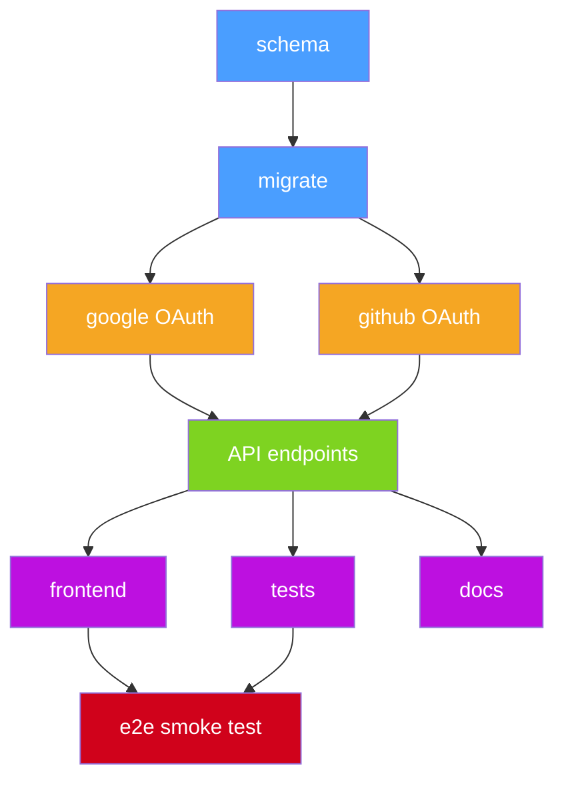
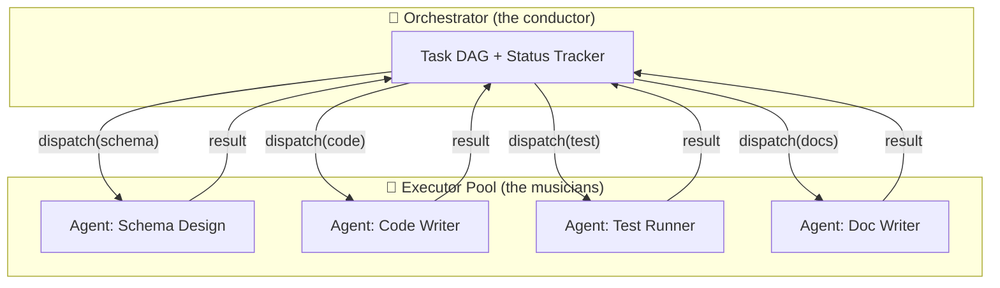
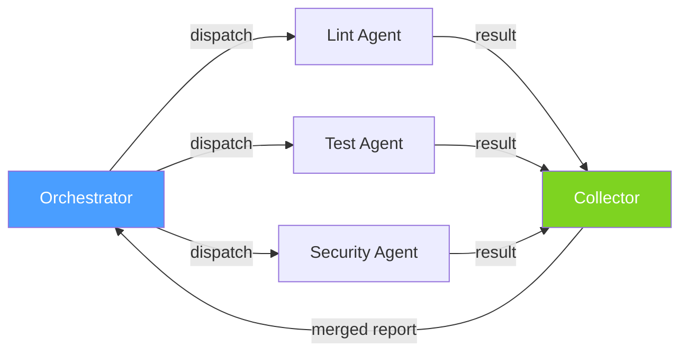
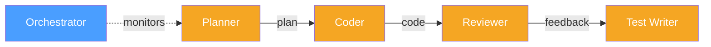
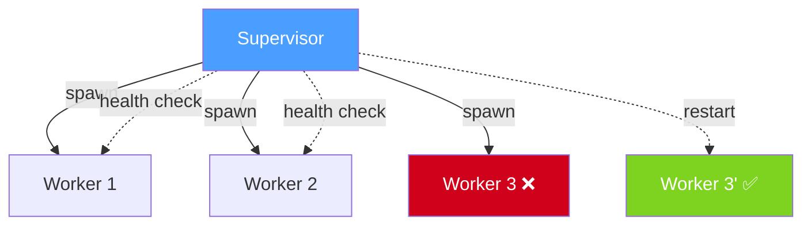
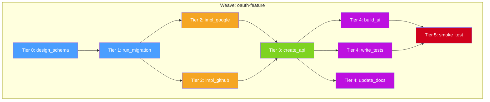
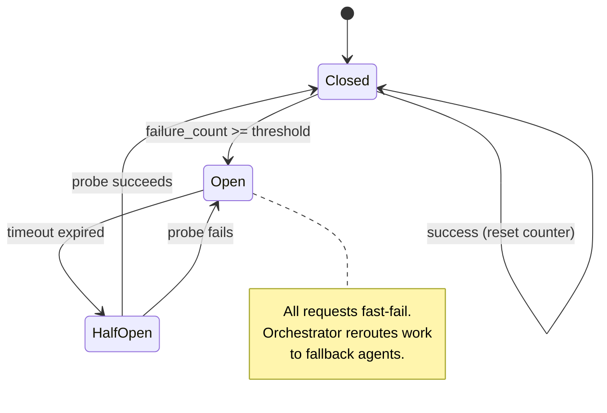

# 4.2 Orchestration vs. Execution: The Loom Framework

> **Key idea:** The hardest problem in multi-agent systems isn't making agents smarter — it's making them *work together*. Orchestration (deciding what to do) and execution (doing the work) must be separated, or the whole system collapses under its own coordination weight.

## Orientation

In Section 4.1, we established Jordan Hubbard's radical premise: LLMs should be OS-managed resources — scheduled, isolated, and composed like threads and processes. We built the four-layer Loom stack and showed how IPC, token budgets, and capability-based security bring the discipline of operating systems to the chaos of agent pipelines.

But we left a critical question unanswered: **who decides what each agent does, and when?**

A single agent can plan, code, test, and deploy a small feature. But hand it a complex task — "refactor the authentication module, update the API docs, add migration scripts, and ensure backward compatibility" — and it drowns. Not because it lacks capability, but because it lacks *coordination*. It tries to hold the entire plan in its context window while simultaneously executing each step, and the result is the recursive failure modes we cataloged in Section 2.2: stale context, hallucinated completion, retry storms.

The solution is the same one that every orchestra, every military operation, and every distributed system has discovered independently: **separate the conductor from the musicians**. One entity decides *what* to play; others *play it*. This section builds that separation into Loom's threading model.

> ### How to Read This Section
>
> This section introduces five concepts in order:
>
> 1. **The Orchestration Problem** — why single agents fail at scale (skim if you already know why)
> 2. **Orchestration vs. Execution** — the core separation principle (read carefully — this is the key insight)
> 3. **Multi-Agent Patterns** — three reusable coordination patterns (study the one closest to your use case, reference the others)
> 4. **The Loom Weave Model** — Loom's native DAG-based execution model (read carefully — this ties the patterns together)
> 5. **Failure Handling** — partial failures, compensation, circuit breakers (read this last, but don't skip it — this is where production systems live or die)
>
> If you're building multi-agent systems today, loops 3 and 5 are the most immediately practical. If you're designing frameworks, loop 4 is where the architecture lives.

---

## Loop 1: The Orchestration Problem

### Concept: Why Single Agents Break Down

Consider a solo developer working on a feature. They can hold the requirements, the code structure, the test plan, and the deployment steps in their head — up to a point. Give them a feature that touches three microservices, requires database migrations, needs coordinated API changes, and must preserve backward compatibility, and they start dropping balls. Not because they're incompetent, but because the *coordination overhead* grows faster than the *work* itself.

Agents face the same scaling wall. A single agent given a complex task must:

1. **Decompose** the task into subtasks
2. **Sequence** those subtasks (respecting dependencies)
3. **Execute** each subtask (generating code, running tests, etc.)
4. **Track** intermediate results across subtasks
5. **Recover** when any subtask fails

Steps 1–2 are *planning*. Steps 3–5 are *execution*. When a single agent does both, it must continuously switch between strategic thinking ("what's next?") and tactical work ("write this function"). Each context switch risks losing the plan. Worse, as the task grows, the plan itself consumes an increasing fraction of the context window, leaving less room for the actual work.

> **Pitfall:** The "smart enough" fallacy. Teams often assume that a more capable model will solve coordination problems. It won't. A 200k-token context window doesn't eliminate coordination overhead — it just moves the cliff further out. The failure mode is the same; it just arrives later and is harder to debug.

The key metric is **coordination cost ratio**: the fraction of total tokens spent on planning, tracking, and recovering versus actually producing output.

| Task Complexity | Subtasks | Coordination Cost (Single Agent) | Useful Output Ratio |
|-----------------|----------|----------------------------------|---------------------|
| Simple          | 1–2      | ~10%                             | ~90%                |
| Moderate        | 3–5      | ~35%                             | ~65%                |
| Complex         | 6–10     | ~60%                             | ~40%                |
| Enterprise      | 10+      | ~80%+                            | ~20% or less        |

*Table 4-1: As task complexity grows, a single agent spends more tokens coordinating than producing.*

> **Key idea:** Coordination cost grows super-linearly with task count. At roughly 6 subtasks, a single agent spends more effort managing itself than doing useful work.

### Worked Example

> **Example 4-8: Task Decomposition That Overwhelms a Single Agent (Python pseudocode)**

```python
# A product manager requests: "Add OAuth2 login with Google and GitHub providers,
# including database migrations, API endpoints, frontend components, tests, and docs."

task = {
    "description": "Add OAuth2 multi-provider login",
    "subtasks": [
        {"id": "schema",   "work": "Design DB schema for OAuth tokens",    "deps": []},
        {"id": "migrate",  "work": "Write and run Alembic migration",      "deps": ["schema"]},
        {"id": "google",   "work": "Implement Google OAuth flow",          "deps": ["migrate"]},
        {"id": "github",   "work": "Implement GitHub OAuth flow",          "deps": ["migrate"]},
        {"id": "api",      "work": "Create /auth/callback endpoints",      "deps": ["google", "github"]},
        {"id": "frontend", "work": "Build login UI with provider buttons", "deps": ["api"]},
        {"id": "tests",    "work": "Write integration tests for both flows","deps": ["api"]},
        {"id": "docs",     "work": "Update API documentation",            "deps": ["api"]},
        {"id": "e2e",      "work": "Run end-to-end smoke test",           "deps": ["frontend", "tests"]},
    ],
}

# A single agent must hold ALL of this in context while executing each step.
# By the time it reaches "e2e", the schema decisions from step 1 may have
# scrolled out of the context window — or worse, been subtly altered by
# hallucinated "improvements" during the intermediate steps.
```

This task has 9 subtasks with a dependency DAG that's 5 levels deep. A single agent attempting this will spend most of its tokens re-reading earlier outputs, tracking which steps completed, and rebuilding context that it already generated but can no longer see.



*Figure 4-7: The OAuth feature decomposes into a DAG with parallelizable branches. A single agent must serialize everything; an orchestrator can parallelize the orange and purple tiers.*

### ✅ Check Yourself

> **Q:** Why does doubling the context window *not* solve the single-agent coordination problem?
>
> **A:** Because coordination cost grows super-linearly, not linearly. A 2× larger context window handles maybe 1.5× more subtasks before hitting the same wall. The fundamental issue is that the agent must continuously re-read and re-process earlier state, and each re-read competes with the space needed for actual work. The solution isn't a bigger window — it's delegation.

---

## Loop 2: Orchestration vs. Execution

### Concept: The Conductor and the Musicians

An orchestra doesn't work by having the conductor also play the violin, the oboe, and the timpani. The conductor holds the score — the *plan* — and communicates timing, dynamics, and transitions to the musicians. The musicians hold their individual parts and focus entirely on execution. Neither role is "smarter" than the other; they're *specialized*.

In Loom's model, this maps directly onto two distinct agent roles:

| Role | Responsibility | Context Contains | Does NOT Do |
|------|---------------|------------------|-------------|
| **Orchestrator** | Decompose task, assign work, track progress, handle failures | The plan, dependency graph, status of each subtask | Write code, run tests, generate content |
| **Executor** | Perform a single well-defined subtask | The specific subtask description + relevant context | Decide what to do next, track other agents' progress |

> **Key idea:** An orchestrator that also executes work is like a conductor who puts down the baton to play the cello solo — the rest of the orchestra loses coordination. Keep the roles separate.

The separation provides three critical benefits:

1. **Smaller context per agent.** The orchestrator only tracks status, not implementation details. Each executor only sees its own task. No agent is overwhelmed.

2. **Independent failure domains.** If the "write tests" executor fails, the orchestrator can retry it or assign a different executor without disturbing the "write code" executor's work.

3. **Parallelism.** The orchestrator can dispatch independent subtasks simultaneously — something impossible when a single agent serializes everything.

> **Tip:** The orchestrator should be the *simplest* agent in the system. Its job is routing, not reasoning. If your orchestrator needs a 100k-token context to function, you haven't decomposed the problem enough.

### Worked Example

> **Example 4-9: A Pure Orchestrator — Decides but Never Executes (Python pseudocode)**

```python
class Orchestrator:
    """
    The orchestrator holds the dependency DAG and dispatches work.
    It never touches the actual task content — only metadata.
    """

    def __init__(self, weave_dag):
        self.dag = weave_dag            # dependency graph
        self.status = {}                 # task_id -> "pending" | "running" | "done" | "failed"
        self.results = {}               # task_id -> output from executor

    def get_ready_tasks(self):
        """Return tasks whose dependencies are all 'done'."""
        ready = []
        for task_id, deps in self.dag.items():
            if self.status.get(task_id) == "pending":
                if all(self.status.get(d) == "done" for d in deps):
                    ready.append(task_id)
        return ready

    def dispatch(self, task_id, executor_pool):
        """Hand a task to an executor. The orchestrator doesn't know HOW it's done."""
        executor = executor_pool.get_available()
        self.status[task_id] = "running"
        # Send only the task description and relevant prior outputs
        context = {dep: self.results[dep] for dep in self.dag[task_id]}
        executor.run_async(task_id, context, callback=self.on_complete)

    def on_complete(self, task_id, result, success):
        if success:
            self.status[task_id] = "done"
            self.results[task_id] = result
        else:
            self.status[task_id] = "failed"
            self.handle_failure(task_id)

        # Check if new tasks are now ready
        for next_task in self.get_ready_tasks():
            self.dispatch(next_task, self.executor_pool)

    def handle_failure(self, task_id):
        """Retry, skip, or escalate — but never try to do the work ourselves."""
        retries = self.retry_count.get(task_id, 0)
        if retries < self.max_retries:
            self.retry_count[task_id] = retries + 1
            self.status[task_id] = "pending"  # will be re-dispatched
        else:
            self.escalate_to_human(task_id)
```

Notice what the orchestrator *doesn't* contain: no code generation logic, no test execution, no file manipulation. It is a pure state machine that walks a dependency graph.



*Figure 4-8: The orchestrator dispatches tasks and collects results. It never performs the work itself. This mirrors the conductor/musician separation in an orchestra.*

> **Warning:** Beware the "orchestrator creep" anti-pattern, where the orchestrator gradually accumulates execution logic ("just this one small task…"). Once an orchestrator starts doing work, it loses its coordination clarity. If you find your orchestrator's prompt growing past 2,000 tokens, audit it for execution logic that should be delegated.

### ✅ Check Yourself

> **Q:** An orchestrator agent receives the result from a "write code" executor and notices a bug. Should the orchestrator fix the bug itself?
>
> **A:** No. The orchestrator should dispatch the bug fix to an executor — either re-dispatching to the original code-writing agent with updated context, or sending it to a dedicated "bug fix" executor. The moment the orchestrator tries to fix code, it takes on execution responsibility and loses its ability to coordinate the other agents. Keep the roles clean.

---

## Loop 3: Multi-Agent Patterns

### Concept: Three Core Coordination Patterns

Just as distributed systems have well-known patterns (pub/sub, request/reply, event sourcing), multi-agent orchestration has three core patterns that cover the vast majority of real-world coordination needs. Each pattern trades off differently between latency, fault tolerance, and complexity.

| Pattern | Shape | Best For | Latency | Fault Isolation |
|---------|-------|----------|---------|-----------------|
| **Fan-out / Fan-in** | One → many → one | Independent parallel tasks | Low (parallel) | High |
| **Pipeline** | One → one → one → … | Sequential transformations | High (serial) | Low |
| **Supervisor-Worker** | One ↔ many (monitored) | Long-running, failure-prone tasks | Variable | Very high |

Let's examine each.

### Pattern 1: Fan-Out / Fan-In

The orchestrator dispatches N independent tasks in parallel and waits for all results before proceeding. This is the multi-agent equivalent of `Promise.all()` or Go's `sync.WaitGroup`.

**Use when:** Subtasks are independent and their combined results feed a single downstream step. Examples: running lint, tests, and security scans simultaneously; translating a document into multiple languages; generating code for multiple independent modules.



*Figure 4-9: Fan-out / fan-in. The orchestrator dispatches three independent tasks in parallel and a collector merges the results. Total latency equals the slowest agent, not the sum.*

> **Tip:** Fan-out is the most common pattern in practice. If you can decompose a task into independent pieces, prefer fan-out over pipeline — you get parallelism for free.

### Pattern 2: Pipeline

Each agent's output feeds the next agent's input, like an assembly line. The orchestrator manages the handoffs.

**Use when:** Each step transforms or enriches the previous step's output. Examples: plan → code → review → test; parse → analyze → summarize → format.



*Figure 4-10: Pipeline pattern. Each agent transforms the output of the previous one. The orchestrator monitors the pipeline but doesn't participate in the data flow.*

> **Pitfall:** Pipelines amplify errors. A mistake in stage 1 propagates through every subsequent stage. Always include validation between stages — either in the orchestrator or as lightweight "gate" agents.

### Pattern 3: Supervisor-Worker

A supervisor agent spawns workers, monitors their health, and can restart or reassign tasks when workers fail. This is the Erlang/OTP "let it crash" philosophy applied to agents.

**Use when:** Tasks are long-running, failure-prone, or require adaptive behavior. Examples: processing a large batch of files (some may be malformed); running multiple exploratory coding approaches and selecting the best.



*Figure 4-11: Supervisor-worker pattern. The supervisor detects Worker 3's failure and spawns a replacement. The other workers are unaffected.*

### Worked Examples

> **Example 4-10: Fan-Out / Fan-In for a Code Quality Pipeline (Python pseudocode)**

```python
import asyncio

async def fan_out_fan_in(orchestrator, code_snapshot):
    """
    Dispatch three independent quality checks in parallel.
    Merge results and decide: pass or fail.
    """
    tasks = {
        "lint":     orchestrator.dispatch("lint_agent",     {"code": code_snapshot}),
        "test":     orchestrator.dispatch("test_agent",     {"code": code_snapshot}),
        "security": orchestrator.dispatch("security_agent", {"code": code_snapshot}),
    }

    # Wait for all three — total time = max(lint, test, security), not sum
    results = {}
    for name, future in tasks.items():
        results[name] = await future

    # Merge: all must pass
    all_passed = all(r["passed"] for r in results.values())
    report = {
        "passed": all_passed,
        "details": results,
        "wall_time": max(r["elapsed"] for r in results.values()),
    }

    if all_passed:
        orchestrator.dispatch("deploy_agent", {"code": code_snapshot, "report": report})
    else:
        orchestrator.dispatch("fix_agent", {"failures": report["details"]})

    return report

# If each check takes ~30 seconds sequentially, fan-out completes in ~30s total.
# Sequential pipeline: ~90 seconds. That's a 3x speedup from a simple pattern change.
```

> **Example 4-11: Supervisor-Worker with Restart Logic (Python pseudocode)**

```python
class Supervisor:
    """
    Monitors workers and restarts them on failure.
    Inspired by Erlang/OTP's supervision trees.
    """

    def __init__(self, max_restarts=3, restart_window_sec=60):
        self.workers = {}
        self.restart_counts = {}
        self.max_restarts = max_restarts
        self.restart_window = restart_window_sec

    async def spawn_worker(self, task_id, task_config):
        worker = AgentWorker(task_id, task_config)
        self.workers[task_id] = worker
        self.restart_counts[task_id] = []
        worker.on_failure = lambda: self._handle_worker_failure(task_id)
        await worker.start()

    async def _handle_worker_failure(self, task_id):
        now = time.time()
        # Track restart timestamps within the window
        self.restart_counts[task_id] = [
            t for t in self.restart_counts[task_id]
            if now - t < self.restart_window
        ]

        if len(self.restart_counts[task_id]) >= self.max_restarts:
            # Too many restarts — escalate, don't loop
            await self.escalate(task_id, reason="exceeded restart budget")
            return

        self.restart_counts[task_id].append(now)
        old_worker = self.workers[task_id]

        # Spawn fresh worker with the same task but clean context
        new_worker = AgentWorker(task_id, old_worker.config)
        new_worker.on_failure = lambda: self._handle_worker_failure(task_id)
        self.workers[task_id] = new_worker
        await new_worker.start()

    async def escalate(self, task_id, reason):
        """When restarts are exhausted, alert a human or a higher-level supervisor."""
        await notify_human(f"Task {task_id} failed permanently: {reason}")
```

> **Key idea:** The three patterns — fan-out/fan-in, pipeline, and supervisor-worker — are composable. Real systems combine them: a supervisor manages a pipeline, where one stage fans out. Know the primitives, and you can build any topology.

### ✅ Check Yourself

> **Q:** You need to process 100 code files. Each file needs linting and testing (independent of each other), but deploying requires all files to pass. Which pattern(s) do you combine?
>
> **A:** Fan-out each file's lint+test pair in parallel (fan-out/fan-in at the file level). Within each file, lint and test are also independent, so that's another level of fan-out. Wrap the whole thing in a supervisor to handle individual file failures without aborting the batch. It's fan-out/fan-in nested inside a supervisor-worker pattern.

---

## Loop 4: The Loom Weave Model

### Concept: Weaves as First-Class DAGs

In Section 4.1, we established that Loom treats agents as threads managed by the OS. But threads alone aren't enough — you also need a way to describe *how they relate to each other*. In traditional systems programming, you'd use mutexes, condition variables, and barriers. Loom introduces a higher-level abstraction: the **weave**.

A weave is a directed acyclic graph (DAG) where:
- **Nodes** are agent tasks (units of work)
- **Edges** are data dependencies (output of one task feeds into another)
- The **Loom runtime** walks the DAG, scheduling tasks as their dependencies complete

Think of a weave as a build system's dependency graph — like Make or Bazel — but for agent tasks instead of compilation units. Just as `make` knows to compile `utils.o` before linking `app`, the Loom runtime knows to run the "design schema" agent before the "write migration" agent.

> **Tip:** If you've used Apache Airflow, Prefect, or Temporal, you already understand the core concept. Loom's weaves are DAGs with the same semantics — but the "workers" are LLM agents instead of Python functions or microservices.

Weaves are **first-class objects** in Loom. They can be:
- **Defined** declaratively (as data, not code)
- **Inspected** at runtime (which tasks are pending, running, done?)
- **Composed** (a weave can contain sub-weaves)
- **Serialized** (checkpoint a weave's state and resume later — the checkpoint pattern from Section 2.3)
- **Versioned** (track how a weave evolves over multiple runs)

### Worked Example

> **Example 4-12: Defining and Running a Weave (Python pseudocode)**

```python
from loom import Weave, Task, DependsOn

# Define a weave declaratively — the DAG is data, not control flow
feature_weave = Weave("oauth-feature", description="Add OAuth2 multi-provider login")

# Define tasks with their dependencies
schema    = Task("design_schema",   agent="architect",  prompt="Design OAuth token schema")
migrate   = Task("run_migration",   agent="db_admin",   prompt="Generate Alembic migration",
                  depends_on=[schema])
google    = Task("impl_google",     agent="backend",    prompt="Implement Google OAuth flow",
                  depends_on=[migrate])
github    = Task("impl_github",     agent="backend",    prompt="Implement GitHub OAuth flow",
                  depends_on=[migrate])
api       = Task("create_api",      agent="backend",    prompt="Create /auth/callback endpoints",
                  depends_on=[google, github])
frontend  = Task("build_ui",        agent="frontend",   prompt="Build login UI components",
                  depends_on=[api])
tests     = Task("write_tests",     agent="qa",         prompt="Write integration tests",
                  depends_on=[api])
docs      = Task("update_docs",     agent="tech_writer", prompt="Update API documentation",
                  depends_on=[api])
e2e       = Task("smoke_test",      agent="qa",         prompt="Run end-to-end verification",
                  depends_on=[frontend, tests])

# Add all tasks to the weave
feature_weave.add_tasks([schema, migrate, google, github, api, frontend, tests, docs, e2e])

# The Loom runtime walks the DAG automatically
async def run():
    runtime = LoomRuntime(executor_pool=agent_pool, max_parallel=4)
    result = await runtime.execute(feature_weave)

    # The runtime figured out the optimal schedule:
    # Tier 0: schema (1 agent)
    # Tier 1: migrate (1 agent)
    # Tier 2: google, github (2 agents in parallel)
    # Tier 3: api (1 agent, waits for both Tier 2)
    # Tier 4: frontend, tests, docs (3 agents in parallel)
    # Tier 5: e2e (1 agent, waits for frontend + tests)

    print(f"Weave completed: {result.status}")
    print(f"Wall time: {result.wall_time}s (vs {result.serial_time}s serial)")
    # Example output: Wall time: 180s (vs 540s serial) — 3x speedup from parallelism
```

The critical insight: the developer defines *what depends on what*, and the Loom runtime figures out *when to schedule each task*. This is the same inversion of control that made Kubernetes powerful — you declare the desired state, and the system figures out how to get there.



*Figure 4-12: The Loom runtime's view of the oauth-feature weave. Color bands represent scheduling tiers — all tasks within a tier run in parallel. The runtime automatically identifies the critical path (T0→T1→T2→T3→T4a→T5) and parallelizes everything else.*

> **Warning:** A weave must be a DAG — no cycles allowed. If task A depends on task B and task B depends on task A, the runtime will detect the cycle and reject the weave at definition time. If you genuinely need circular feedback (e.g., code → review → revise → re-review), model it as a *loop in the orchestrator* that dispatches successive weaves, not as a cycle within a single weave.

### ✅ Check Yourself

> **Q:** In the oauth-feature weave, the `update_docs` task has no downstream dependents — nothing depends on it. The `smoke_test` depends on `frontend` and `tests` but not `docs`. What happens if `update_docs` fails? Should the weave still succeed?
>
> **A:** It depends on the weave's failure policy. With a "critical path only" policy, the weave succeeds as long as the path to `smoke_test` completes — `update_docs` is on a side branch. With a "all tasks must succeed" policy, the weave fails. Loom lets you annotate tasks as `required` or `best_effort`, giving the orchestrator flexibility. In practice, docs are often `best_effort` while tests are `required`.

---

## Loop 5: Failure Handling

### Concept: The Hard Problem

Everything we've built so far assumes the happy path: agents complete their tasks, dependencies resolve, the weave executes to completion. But production systems live in the unhappy path. Agent 3 of 5 hallucinates garbage. The LLM provider returns a rate-limit error. A code-writing agent produces syntactically valid but semantically wrong output that passes the test agent's checks.

This is the distributed systems failure problem, applied to agents. And the solutions — battle-tested over decades of building reliable distributed systems — transfer directly.

> **Key idea:** Multi-agent failure handling isn't a new problem. It's the distributed systems reliability problem wearing a different hat. Sagas, circuit breakers, and compensation patterns all apply — with one twist: agent failures are often *semantic*, not just operational.

There are three categories of multi-agent failure:

| Failure Type | Example | Detection Difficulty | Recovery Strategy |
|-------------|---------|---------------------|-------------------|
| **Operational** | LLM timeout, rate limit, OOM | Easy (error codes) | Retry with backoff |
| **Semantic** | Agent produces wrong code that compiles | Hard (requires validation) | Re-dispatch with better context |
| **Cascade** | Failed agent poisons downstream agents | Very hard (delayed symptoms) | Compensation / rollback |

> **Pitfall:** Most teams only handle operational failures (retries). Semantic failures — where the agent *succeeds* but produces wrong output — are far more dangerous because they propagate silently through the pipeline. Always include validation gates between agents.

### The Saga Pattern for Agents

The saga pattern, borrowed from distributed databases, handles the cascade case. Instead of a single atomic transaction across all agents, each agent executes a *compensatable action*: if a later step fails, earlier steps can be undone.

For agents, "undo" means: revert the file changes, roll back the migration, delete the generated test. Each executor publishes both a `do` action and a `compensate` action. If the weave fails partway through, the orchestrator runs compensations in reverse order.

### Worked Examples

> **Example 4-13: Saga Pattern for a Multi-Agent Deployment (Python pseudocode)**

```python
class SagaOrchestrator:
    """
    Each task has a forward action and a compensation action.
    On failure, compensations run in reverse order.
    """

    def __init__(self):
        self.completed_steps = []  # stack of (task_id, compensate_fn)

    async def execute_saga(self, steps):
        """
        steps: list of {"task_id", "execute_fn", "compensate_fn"}
        """
        for step in steps:
            try:
                result = await step["execute_fn"]()
                self.completed_steps.append((step["task_id"], step["compensate_fn"]))
            except AgentFailure as e:
                print(f"Step '{step['task_id']}' failed: {e}")
                await self.compensate()
                return {"status": "rolled_back", "failed_at": step["task_id"]}

        return {"status": "completed"}

    async def compensate(self):
        """Undo completed steps in reverse order."""
        while self.completed_steps:
            task_id, compensate_fn = self.completed_steps.pop()
            try:
                await compensate_fn()
                print(f"  ✓ Compensated '{task_id}'")
            except Exception as e:
                # Compensation failure is a critical alert — log and continue
                print(f"  ✗ Compensation failed for '{task_id}': {e}")

# Usage: deploy a feature with rollback capability
saga = SagaOrchestrator()
result = await saga.execute_saga([
    {
        "task_id": "create_branch",
        "execute_fn":    lambda: git_agent.create_branch("feature/oauth"),
        "compensate_fn": lambda: git_agent.delete_branch("feature/oauth"),
    },
    {
        "task_id": "write_migration",
        "execute_fn":    lambda: db_agent.generate_migration("add_oauth_tables"),
        "compensate_fn": lambda: db_agent.revert_migration("add_oauth_tables"),
    },
    {
        "task_id": "deploy_staging",
        "execute_fn":    lambda: deploy_agent.deploy("staging"),
        "compensate_fn": lambda: deploy_agent.rollback("staging"),
    },
    {
        "task_id": "run_smoke_tests",
        "execute_fn":    lambda: test_agent.run_smoke("staging"),
        "compensate_fn": lambda: noop(),  # tests don't need compensation
    },
])
# If smoke tests fail, the saga rolls back: undeploy staging → revert migration → delete branch
```

### The Circuit Breaker Pattern

When an agent or LLM provider is consistently failing, retrying every request wastes tokens and time. A circuit breaker tracks failure rates and "opens" (stops sending requests) when failures exceed a threshold, giving the system time to recover.

> **Example 4-14: Circuit Breaker for Flaky Agent Calls (Python pseudocode)**

```python
import time

class CircuitBreaker:
    """
    Three states:
    - CLOSED: requests flow normally, failures are counted
    - OPEN: requests are immediately rejected (fast-fail)
    - HALF_OPEN: one probe request is allowed to test recovery
    """
    CLOSED = "closed"
    OPEN = "open"
    HALF_OPEN = "half_open"

    def __init__(self, failure_threshold=5, reset_timeout_sec=30):
        self.state = self.CLOSED
        self.failure_count = 0
        self.failure_threshold = failure_threshold
        self.reset_timeout = reset_timeout_sec
        self.last_failure_time = 0

    async def call(self, agent_fn, *args):
        if self.state == self.OPEN:
            if time.time() - self.last_failure_time > self.reset_timeout:
                self.state = self.HALF_OPEN
            else:
                raise CircuitOpenError("Agent circuit is open — fast-failing")

        try:
            result = await agent_fn(*args)
            # Success: reset counter, close circuit
            self.failure_count = 0
            self.state = self.CLOSED
            return result
        except AgentFailure:
            self.failure_count += 1
            self.last_failure_time = time.time()
            if self.failure_count >= self.failure_threshold:
                self.state = self.OPEN
            raise

# Usage in an orchestrator
code_agent_breaker = CircuitBreaker(failure_threshold=3, reset_timeout_sec=60)

async def dispatch_with_protection(task):
    try:
        return await code_agent_breaker.call(code_agent.execute, task)
    except CircuitOpenError:
        # Route to fallback: different model, different agent, or queue for later
        return await fallback_agent.execute(task)
```

The circuit breaker integrates with the orchestrator's failure handling: when a circuit opens, the orchestrator can reroute work to a different agent, use a different LLM backend, or pause that branch of the weave until the circuit resets.



*Figure 4-13: Circuit breaker state machine for agent calls. The OPEN state prevents wasting tokens on a consistently failing agent. HALF_OPEN allows a single probe to test recovery.*

> **Tip:** Combine the saga pattern with circuit breakers. When a circuit opens mid-saga, the orchestrator triggers compensation for completed steps rather than waiting indefinitely for an agent that may never recover. This gives you both fast failure detection and clean rollback.

### ✅ Check Yourself

> **Q:** A five-step saga completes steps 1–3, then step 4 fails. During compensation, the rollback for step 2 also fails. What should the system do?
>
> **A:** Log the compensation failure as a critical alert, continue compensating step 1 (don't stop the rollback chain), and surface the inconsistency to a human operator. This is the "double fault" scenario — the system is now in a partially rolled-back state that requires manual intervention. The key principle: *never silently swallow a compensation failure*. A failed compensation is more dangerous than the original failure because the system is now in an inconsistent state.

---

## What We Built

This section took the OS-level primitives from Section 4.1 and built a complete coordination model on top of them. Here's how the pieces connect:

| Section 4.1 Concept | Section 4.2 Extension |
|---------------------|----------------------|
| Agents as threads   | Threads need a scheduler → the **orchestrator** |
| IPC (inter-process communication) | IPC channels carry task results between **executors** |
| Token budget scheduling | The Loom runtime schedules tasks based on **DAG dependencies** |
| Capability-based security | Each executor receives only the **context it needs** for its specific task |
| Shared context memory | Weave results are stored in shared memory, avoiding **redundant re-sends** |

The five concepts form a progression:

1. **The Orchestration Problem** showed that single-agent coordination cost grows super-linearly — you *must* delegate.
2. **Orchestration vs. Execution** gave you the core principle: separate the conductor from the musicians.
3. **Multi-Agent Patterns** gave you three reusable building blocks: fan-out/fan-in, pipeline, and supervisor-worker.
4. **The Loom Weave Model** showed how to define and execute agent DAGs declaratively, letting the runtime handle scheduling.
5. **Failure Handling** showed that the real complexity lives in partial failures, and that distributed systems patterns (sagas, circuit breakers) transfer directly to agents.

> **Key idea:** Orchestration is the discipline of deciding *what to do* and *in what order*, without doing the work yourself. The Loom framework makes this discipline structural: weaves define the plan, executors do the work, and failure handling ensures the system degrades gracefully instead of catastrophically.

## Deliverable and Verification Checklist

By the end of this section, you should be able to:

- [ ] Explain why single-agent systems break down beyond ~6 subtasks
- [ ] Describe the orchestrator/executor separation and articulate why the orchestrator must not execute
- [ ] Diagram each of the three multi-agent patterns (fan-out/fan-in, pipeline, supervisor-worker) and identify when to use each
- [ ] Define a Loom weave as a DAG and trace how the runtime schedules tasks tier by tier
- [ ] Implement the saga pattern for multi-agent rollback
- [ ] Implement a circuit breaker that protects against consistently failing agents
- [ ] Combine patterns: nest fan-out inside a supervisor, chain pipelines into weaves

---

## Retrieval Practice

### Exercise 4.2.1: Pattern Matching

For each scenario below, identify the most appropriate multi-agent pattern (fan-out/fan-in, pipeline, or supervisor-worker) and explain your reasoning.

**Scenario A:** You need to translate a technical document into French, German, Japanese, and Mandarin simultaneously.

**Scenario B:** A user's PR needs to be planned, coded, reviewed, and tested — each step depends on the previous one.

**Scenario C:** You're processing 500 legacy files to modernize their API usage. Some files have edge cases that cause agents to crash.

**Scenario D:** You want to generate three different implementation approaches for a feature and pick the best one.

<details>
<summary>Answers</summary>

**A: Fan-out / fan-in.** The four translations are independent — no translation depends on another. Dispatch all four in parallel and collect results. Wall time ≈ slowest language, not 4× a single translation.

**B: Pipeline.** Each step is a sequential transformation of the previous output. Plan → code → review → test. The orchestrator manages handoffs between stages. Consider adding validation gates between stages to catch errors early.

**C: Supervisor-worker.** Processing 500 files is a batch job where individual files may fail. A supervisor can restart failed workers, skip permanently broken files, and track progress. Wrap the individual file processing in a circuit breaker to avoid wasting tokens on files that consistently crash the agent.

**D: Fan-out / fan-in (with a twist).** Fan out to three "implementation" agents in parallel. The "fan-in" step isn't just merging — it's a *selection* agent that evaluates the three approaches and picks the best. This is sometimes called "fan-out / select" or "best-of-N" sampling.

</details>

### Exercise 4.2.2: Design a Weave DAG

You're building an agent pipeline to onboard a new engineer. The tasks are:

1. Create their GitHub account (no dependencies)
2. Set up their development environment (depends on #1)
3. Clone the team's repositories (depends on #2)
4. Run the build to verify their setup (depends on #3)
5. Create their Slack account (no dependencies)
6. Add them to team channels (depends on #5)
7. Send a welcome message linking their GitHub and Slack (depends on #1, #5)
8. Assign their first ticket (depends on #4, #6, #7)

Draw the DAG (on paper or describe it). Identify: (a) which tasks can run in parallel, (b) the critical path, and (c) which tasks are candidates for `best_effort` vs. `required`.

<details>
<summary>Hint and Answer</summary>

**DAG structure:**
- Tier 0: #1 (GitHub) and #5 (Slack) — parallel, no dependencies
- Tier 1: #2 (dev env, depends on #1), #6 (channels, depends on #5), #7 (welcome msg, depends on #1 + #5)
- Tier 2: #3 (clone repos, depends on #2)
- Tier 3: #4 (build, depends on #3)
- Tier 4: #8 (assign ticket, depends on #4 + #6 + #7)

**Critical path:** #1 → #2 → #3 → #4 → #8 (longest chain)

**Best-effort candidates:** #7 (welcome message) — it's nice to have but doesn't block the engineer's ability to work. Everything on the critical path should be `required`.

**Parallelism:** The GitHub branch (#1→#2→#3→#4) and Slack branch (#5→#6) run in parallel. Task #7 merges both branches. Maximum parallelism is 2 agents at Tier 0 and 3 agents at Tier 1.

</details>

### Exercise 4.2.3: Failure Mode Analysis

Consider a five-agent pipeline: **Planner → Coder → Reviewer → Tester → Deployer**. For each failure scenario below, describe: (a) the immediate impact, (b) whether the saga pattern helps, and (c) what additional safeguards you'd add.

1. The **Coder** agent produces code that compiles but has a logic bug.
2. The **Reviewer** agent approves code that should have been rejected (false negative).
3. The **Deployer** agent successfully deploys, then the production health check fails 5 minutes later.

<details>
<summary>Analysis</summary>

**Scenario 1 — Coder logic bug:**
(a) The Reviewer might catch it, or it might propagate to Tester. If tests are comprehensive, the Tester catches it. If not, it reaches Deployer.
(b) The saga pattern helps only if the failure is detected. Once the Tester fails, the saga rolls back: un-deploy (noop — not deployed yet), un-test (noop), un-review (noop), un-code (revert the file changes).
(c) Add a *validation gate* between Coder and Reviewer — a lightweight static analysis agent that catches common logic bugs before the full review. This is cheaper than re-running the entire pipeline.

**Scenario 2 — Reviewer false negative:**
(a) Bad code reaches the Tester. If tests are weak, it reaches Deployer and production.
(b) The saga helps at the Tester stage, but the real damage is the *wasted work* — all downstream agents operated on bad input.
(c) Add redundant review: dispatch to two independent reviewers and require both to approve (fan-out/fan-in within the pipeline). This is the "two-person integrity" principle from security.

**Scenario 3 — Delayed production failure:**
(a) The saga's compensation window may have closed — file changes are merged, migrations are applied, users are hitting the new code.
(b) The saga pattern helps only if you kept the compensation actions available. The deploy compensation (rollback) is still viable. Migration rollback depends on whether a reverse migration was prepared.
(c) Add a *post-deploy monitoring* step to the weave — a long-running agent that watches health metrics for N minutes after deploy. If health degrades, it triggers compensation automatically. This extends the saga's scope beyond the initial execution.

</details>

### Exercise 4.2.4: Parallelism Speedup Calculation

A weave has the following tasks and durations:

| Task | Duration | Dependencies |
|------|----------|-------------|
| A    | 10s      | none        |
| B    | 15s      | none        |
| C    | 20s      | A           |
| D    | 10s      | A           |
| E    | 5s       | B, C        |
| F    | 10s      | D, E        |

Calculate:
1. **Serial time** (all tasks run one after another)
2. **Parallel time** with unlimited agents (only constrained by dependencies)
3. **Speedup factor** (serial / parallel)
4. **Critical path** (the sequence that determines the parallel time)

<details>
<summary>Answer</summary>

**1. Serial time:** 10 + 15 + 20 + 10 + 5 + 10 = **70 seconds**

**2. Parallel time (dependency-constrained):**
- Tier 0 (t=0): A (10s) and B (15s) start in parallel
- A finishes at t=10: C (20s) and D (10s) start
- B finishes at t=15: B is done, but E needs both B and C
- C finishes at t=30: E (5s) starts (B was done at t=15, C at t=30 — wait for the later one)
- D finishes at t=20: D is done, but F needs both D and E
- E finishes at t=35: F (10s) starts
- F finishes at t=45

**Parallel time = 45 seconds**

**3. Speedup: 70 / 45 = 1.56×**

**4. Critical path:** A → C → E → F (10 + 20 + 5 + 10 = 45s). This is the longest path through the DAG and determines the minimum possible wall time regardless of how many agents are available.

Note: The speedup is modest (1.56×) because the critical path dominates. Adding more agents won't help — the bottleneck is the sequential dependency chain A→C→E→F. To improve, you'd need to find ways to *shorten tasks on the critical path* or *restructure dependencies* to break the chain.

</details>

---

> **Key idea (section summary):** Single agents buckle under coordination weight. The Loom framework addresses this by separating orchestration (the conductor's score) from execution (the musicians' performance), expressing coordination as declarative weaves (DAGs), and applying battle-tested distributed systems patterns — fan-out/fan-in, pipelines, supervisor-workers, sagas, and circuit breakers — to the new domain of multi-agent AI. The result is a system where *intelligence scales horizontally*: add more agents, define the weave, and let the runtime handle the rest.
