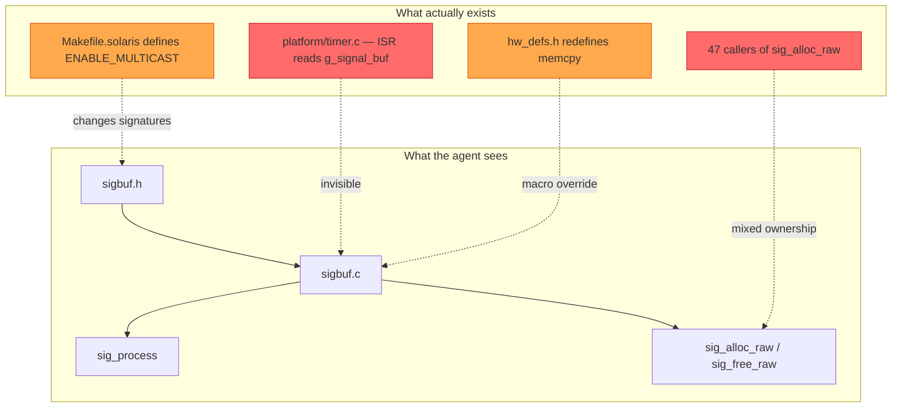
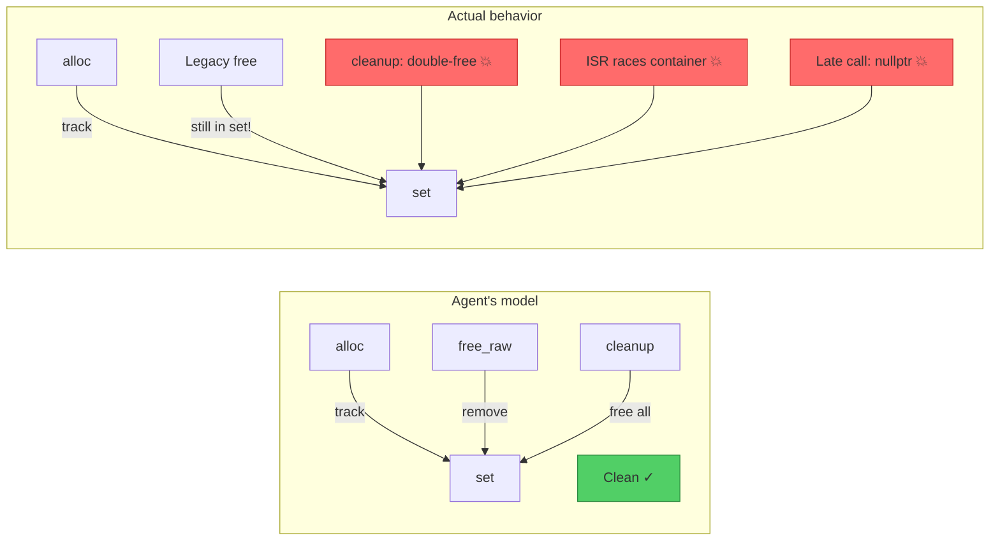
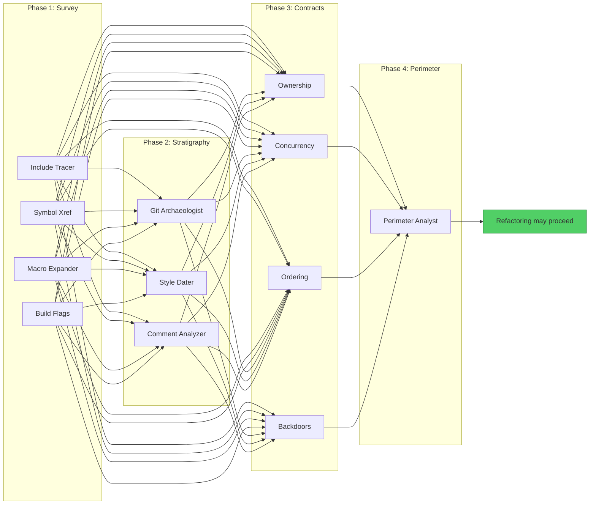
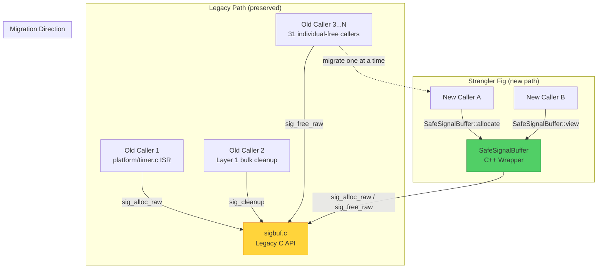
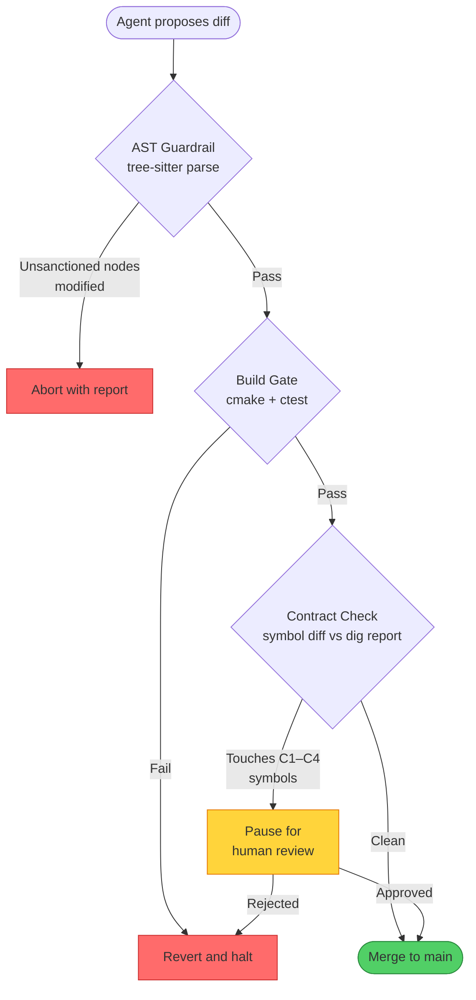

# 4.3 Refactoring the Past: Navigating Legacy C++ via Agentic Threads

> **Key idea:** The hardest code for an agent to refactor is not the most complex — it is the most *implicit*. Forty-year-old C++ codebases encode tribal knowledge in preprocessor macros, void-pointer casts, and ownership contracts that exist only in the memories of engineers who left in 2003. Agents that charge in without excavating these contracts don't refactor — they detonate.

Sections 4.1 and 4.2 gave you a threading model and orchestration framework for agents. Now we stress-test both against the hardest real-world problem: legacy C++ that predates the agents, the frameworks, and the language standards. This is survival archaeology — navigating codebases where a misunderstood `#define` can bring down a telecom switch serving two million subscribers.

---

> ### How to Read This Section
>
> This section contains **six concept loops**. The first half (Loops 1–3) builds the problem and the core pattern:
>
> 1. **The Legacy Code Problem** — Why old C++ is uniquely hostile to agents
> 2. **Why Agents Fail on Legacy Code** — Four failure vectors that turn confident agents into liability generators
> 3. **The Archaeological Dig Pattern** — The key insight: MAP before you MODIFY
>
> The second half (Loops 4–6) applies the pattern at scale:
>
> 4. **Loom Weaves for Legacy Refactoring** — Wiring the dig into Section 4.2's orchestration model
> 5. **Incremental Trust: The Strangler Fig Agent** — Wrapping legacy modules in safe interfaces
> 6. **Measuring Progress Without Breaking Production** — Observability and rollback
>
> **If you work with legacy C++**, read everything. **If you work with other legacy languages**, Loops 1–3 and 6 transfer directly. **If you only have greenfield codebases**, read Loop 3 — the archaeological dig pattern applies whenever implicit contracts lurk beneath the surface.

**Why this section matters.** Every Fortune 500 runs critical infrastructure on C++ from 1985–2005. These codebases can't be rewritten. Agentic refactoring is the only path to modernization — but agents that skip the archaeology produce changes that compile, pass tests, and fail catastrophically.

**Deliverable.** The Archaeological Dig pattern for safe agentic refactoring, wired into Loom (Section 4.2), producing multi-agent pipelines that map implicit contracts before modifying a single line.

---

## Loop 1: The Legacy Code Problem

### Concept

We are not talking about modern C++17. We are talking about code written before the C++ standard existed — targeting a specific compiler, treating `undefined behavior` as a feature, patched by forty engineers over thirty years. Here is what an agent encounters:

- **Preprocessor forests.** `#define` macros rewrite function signatures based on platform flags. The code the agent reads is *not* what the compiler sees.
- **Global mutable state.** `extern` globals accessed from any translation unit, ordering enforced by convention alone.
- **Ownership ambiguity.** Raw `new`/`delete`, `void*` through callbacks, `reinterpret_cast` stuffing pointers into `int` fields.
- **Implicit protocols.** Call-ordering constraints evidenced only by a 1998 comment: `/* init first!! */`.
- **Build-system archaeology.** Makefiles → Perl scripts → generated headers → macros → preprocessor forests.
- **Missing documentation.** Comments in German. Comments describing three-refactors-ago code. No comments.

An agent trained on GitHub has seen C++ — but mostly *modern* C++ with tests and clear ownership. Legacy code violates every assumption that training data encodes.

### Worked Example

**Example 4-15. A signal-processing module from a telecom system, circa 1995.**

A signal buffer manager in a telecom switching system. The original spans thousands of lines; we show enough to illustrate the problem.

```cpp
/* sigbuf.h - Signal buffer management  (c) 1995 TelSys GmbH
 * Änderungen nur nach Rücksprache mit Abt. 4! */
#ifndef _SIGBUF_H_
#define _SIGBUF_H_

#ifdef PLATFORM_SOLARIS
#  define SIG_BUF_SZ  4096
#  define SIG_ALIGN    __attribute__((aligned(8)))
#else
#  define SIG_BUF_SZ  2048
#  define SIG_ALIGN    /* nothing */
#endif

#ifdef ENABLE_MULTICAST
#  define SIG_FUNC_DECL(name)  int name(void* buf, int len, int mcast_grp)
#else
#  define SIG_FUNC_DECL(name)  int name(void* buf, int len)
#endif

extern char g_signal_buf[SIG_BUF_SZ] SIG_ALIGN;
extern volatile int g_buf_lock;
extern int g_init_done;

#ifdef __cplusplus
extern "C" {
#endif
SIG_FUNC_DECL(sig_process);
SIG_FUNC_DECL(sig_forward);
int sig_init(void);
void sig_cleanup(void);   /* DO NOT call from timer ctx! */
/* Wer hat das geschrieben?? - K.M. 2003 */
void* sig_alloc_raw(int sz);
void  sig_free_raw(void* p);  /* p MUST be from sig_alloc_raw */
#ifdef __cplusplus
}
#endif
#endif /* _SIGBUF_H_ */
```

```cpp
/* sigbuf.c - implementation
 * NOTE: timer_handler accesses g_signal_buf directly.
 *       See platform/timer.c (DO NOT MOVE without updating ISR)
 */
#include "sigbuf.h"
#include "platform/hw_defs.h"
#include <string.h>
#include <stdlib.h>

char g_signal_buf[SIG_BUF_SZ] SIG_ALIGN;
volatile int g_buf_lock = 0;
int g_init_done = 0;
static void* s_alloc_table[256];
static int   s_alloc_idx = 0;

int sig_init(void) {
    memset(g_signal_buf, 0, SIG_BUF_SZ);
    s_alloc_idx = 0;  g_init_done = 1;  g_buf_lock = 0;
    return 0;
}
void* sig_alloc_raw(int sz) {
    void* p = malloc(sz);
    if (p && s_alloc_idx < 256) s_alloc_table[s_alloc_idx++] = p;
    return p;  /* caller owns... but we track for cleanup */
}
void sig_free_raw(void* p) {
    int i;
    for (i = 0; i < s_alloc_idx; i++) {
        if (s_alloc_table[i] == p) { s_alloc_table[i] = s_alloc_table[--s_alloc_idx]; break; }
    }
    free(p);
}
void sig_cleanup(void) {
    int i;
    for (i = 0; i < s_alloc_idx; i++) free(s_alloc_table[i]);
    s_alloc_idx = 0;  g_init_done = 0;
}

#ifdef ENABLE_MULTICAST
int sig_process(void* buf, int len, int mcast_grp) {
#else
int sig_process(void* buf, int len) {
#endif
    if (!g_init_done) return -1;
    while (g_buf_lock) { /* spin */ }
    g_buf_lock = 1;
    memcpy(g_signal_buf, buf, len > SIG_BUF_SZ ? SIG_BUF_SZ : len);
    /* ... 200 lines of signal processing omitted ... */
    g_buf_lock = 0;
    return 0;
}
```

When an agent reads these files, it sees syntax. What it *doesn't* see:

- `timer_handler` in `platform/timer.c` reads `g_signal_buf` directly from an ISR — the `volatile int g_buf_lock` is a basic spinlock, but the ISR bypasses it entirely, relying on an implicit single-writer protocol.
- `sig_alloc_raw` tracks for bulk cleanup, but some callers also `free()` directly — dual-ownership that causes double-frees.
- `SIG_FUNC_DECL` gives `sig_process` a *different signature* depending on a build flag.
- The German comment means "Changes only after consultation with Department 4!" — a human gate invisible to agents.



> **Check-yourself:** Before reading on, list three ways the `sig_cleanup` function could cause a crash at shutdown. Think about what happens if a caller has already freed a pointer via `sig_free_raw`, and what happens if the timer ISR fires during cleanup.

<details>
<summary>Possible answers</summary>

1. **Double-free.** If a caller freed `p` directly via `free()` (bypassing `sig_free_raw`), the pointer stays in `s_alloc_table` and `sig_cleanup` frees it again.
2. **Use-after-free via ISR.** `timer_handler` may read `g_signal_buf` while `sig_cleanup` sets `g_init_done = 0`.
3. **Dangling pointer.** Another thread holding a `sig_alloc_raw` pointer has no way to know it was freed.
</details>

---

## Loop 2: Why Agents Fail on Legacy Code

### Concept

Agents fail on legacy C++ not because they are stupid, but because they are *confidently wrong*. The failure modes map to Section 2.2's taxonomy, but legacy code amplifies each:

**1. No tests → false-positive completion.** The agent changes code, compiles, reports success. Nothing contradicts its confidence.

**2. Implicit contracts → context poisoning.** Signatures lie. A `void*` parameter might require a specific allocator, a valid bitmask, and a held lock. The agent's model is poisoned from the start.

**3. Macro soup → reading one program, modifying another.** The preprocessor transforms source into something entirely different before compilation.

**4. Undefined behavior → delayed detonation.** Refactoring introduces UB that works on dev but fails on production with a different compiler or optimization level.

> **Warning:** These four vectors compound. An agent on macro-obscured code (3) with no tests (1) that misreads an implicit contract (2) can introduce UB (4) that passes every check. This is the *default outcome* without guardrails.

### Worked Example

**Example 4-16. An agent confidently refactors the signal buffer — and introduces a use-after-free.**

An agent is tasked with "modernizing the memory management in `sigbuf.c`." It reasons: *"The `s_alloc_table` is a fixed-size array with O(n) scan — I'll replace it with `std::unordered_set` for O(1) lookup. Safe, mechanical modernization."* The agent produces:

```cpp
/* sigbuf_modernized.c - agent-refactored version */
#include "sigbuf.h"
#include <unordered_set>
#include <cstring>
#include <cstdlib>

char g_signal_buf[SIG_BUF_SZ] SIG_ALIGN;
volatile int g_buf_lock = 0;
int g_init_done = 0;

static std::unordered_set<void*>* s_alloc_set = nullptr;

int sig_init(void) {
    std::memset(g_signal_buf, 0, SIG_BUF_SZ);
    delete s_alloc_set;
    s_alloc_set = new std::unordered_set<void*>();
    g_init_done = 1;  g_buf_lock = 0;
    return 0;
}
void* sig_alloc_raw(int sz) {
    void* p = std::malloc(sz);
    if (p && s_alloc_set) s_alloc_set->insert(p);
    return p;
}
void sig_free_raw(void* p) {
    if (s_alloc_set) s_alloc_set->erase(p);
    std::free(p);
}
void sig_cleanup(void) {
    if (s_alloc_set) {
        for (void* p : *s_alloc_set) std::free(p);
        delete s_alloc_set;  s_alloc_set = nullptr;
    }
    g_init_done = 0;
}
```

Here is what actually happens in production:

1. **`extern "C"` ABI is broken.** The original functions are declared with `extern "C"` linkage. The agent's implementation file now compiles as C++ (required for `std::unordered_set`), but without preserving the `extern "C"` wrapper around the function definitions, the compiled symbols use C++ name mangling. C translation units linking against these symbols get linker errors — or silently link to stale object files.

2. **The timer ISR now races with C++ containers.** The original `s_alloc_table` was a plain C array. Now, if any ISR-adjacent code path touches `s_alloc_set`, the `std::unordered_set` — which is not interrupt-safe — will corrupt its internal state.

3. **Shutdown semantics changed.** Legacy callers sometimes call `free()` directly instead of `sig_free_raw()`. The original code "managed" this by calling `sig_cleanup` before stale callers could trigger issues. The agent's version sets `s_alloc_set = nullptr` after cleanup, so any late `sig_free_raw` call dereferences null instead of the old benign no-op on the static array.



> **Pitfall:** The agent's refactoring is *locally correct*. A senior developer reviewing only `sigbuf_modernized.c` would approve it. The bugs are *relational* — they exist in gaps between files. Context (Section 3.2) is a survival requirement.

> **Check-yourself:** The agent's reasoning was plausible at every step. At which point in its chain of thought should a guardrail have intervened? What information would that guardrail need?

<details>
<summary>Possible answers</summary>

The guardrail should have intervened *before the agent wrote any code*:

1. **Linkage check** — callers include C translation units requiring `extern "C"`.
2. **ISR check** — `sigbuf.h` symbols are accessed from interrupt context.
3. **Caller audit** — some callers `free()` directly, bypassing `sig_free_raw`.
4. **Shutdown trace** — `sig_free_raw` can be called after `sig_cleanup`.

Every check is a *mapping* operation, not a modification — the core insight of Loop 3.
</details>

---

## Loop 3: The Archaeological Dig Pattern

### Concept

The lesson from Loops 1 and 2: agents must **map before they modify**. But "read the code first" is a platitude, not a pattern. The Archaeological Dig is a *structured, multi-phase, multi-agent* approach to building context before touching legacy code.

The metaphor is deliberate. Real archaeologists don't start with a backhoe. They survey, grid the site, identify soil layers, and extract artifacts with brushes. Skipping a phase destroys information. The dig has four phases:

**Phase 1 — Survey.** Build the *real* dependency graph. Trace `#include` chains, symbol usage, macros that rewrite interfaces, and build flags that change compiled output.

**Phase 2 — Stratigraphy.** Identify temporal layers. Code from 1995 follows different conventions than patches from 2020. Use `git log`, timestamps, and coding style shifts.

**Phase 3 — Contract Extraction.** Infer implicit contracts from *usage patterns*, not signatures. Ownership contracts, synchronization protocols, call-ordering constraints.

**Phase 4 — Safe Perimeter.** Define the blast radius. Which files must change together? The safe perimeter is the *boundary of confidence*.

This connects to Section 3.2: survey and stratigraphy are *context investment*, contract extraction builds *hyper-context*, and the perimeter is *context economics*. It maps to Section 4.2's pipeline pattern — each phase parallelizable, wirable as a Loom weave with abort-on-failure checkpoints.

### Worked Example

**Example 4-17. The Archaeological Dig applied to the telecom signal buffer.**

Let's revisit `sigbuf.c` from Example 4-15 with the Archaeological Dig running before any modification.

**Phase 1 — Survey results:** A survey agent discovers:

- `g_signal_buf` referenced in **4 files** (including `platform/timer.c` and `diag/memcheck.c`)
- `sig_alloc_raw` called from **47 translation units** across three subsystems
- `sig_process` has two signatures depending on `ENABLE_MULTICAST` (set in `Makefile.solaris` and `Makefile.embedded` only)
- `hw_defs.h` redefines `memcpy` to a DMA-aware variant on embedded

**Phase 2 — Stratigraphy results:** Via `git log` and style analysis:

- **Layer 1 (1995):** Core `sigbuf.c`/`.h`. C89 style. German comments. Author: K.M.
- **Layer 2 (2001):** `ENABLE_MULTICAST` added via macro. Author: J.T.
- **Layer 3 (2008):** `sig_alloc_raw`/`sig_free_raw` — "temporary" tracking for a memory leak investigation. Author: R.S.
- **Layer 4 (2019):** `diag/memcheck.c` — reads `s_alloc_table` via extern backdoor. Author: intern (gone).

**Phase 3 — Contract extraction results:**

- **Contract C1:** `g_signal_buf` is accessed from ISR context (`timer.c`) without `g_buf_lock`. The ISR only *reads*; the main loop *writes*. Implicit lock-free protocol. *Cannot change buffer to dynamic allocation.*
- **Contract C2:** `sig_alloc_raw` callers split into two groups: 31 use `sig_free_raw` individually, 16 rely on `sig_cleanup` at shutdown. *Must preserve both patterns.*
- **Contract C3:** `sig_cleanup` must run after subsystem shutdown but before platform HAL teardown — enforced only by call order in `main.c:shutdown_system()`.
- **Contract C4:** `diag/memcheck.c` reads `s_alloc_table` via `extern`. *Changing the data structure silently breaks diagnostics.*

**Phase 4 — Safe perimeter results:**

- **Safe to change:** Internal implementation of alloc/free tracking, *if* the data structure stays C-compatible (for `diag/memcheck.c`) and both cleanup patterns are preserved.
- **Unsafe to change:** `g_signal_buf` location (ISR), `extern "C"` signatures (linkage), `sig_cleanup` ordering (implicit sequencing).
- **Blast radius:** **52 files** (47 callers + 4 buffer accessors + 1 diagnostic backdoor).

The orchestration code:

```python
# Example 4-17: Archaeological Dig pipeline orchestration
# Uses the Loom conceptual framework from Section 4.2
from loom import Weave, Phase, Agent, CheckpointPolicy

def archaeological_dig(target_file: str, refactor_goal: str) -> DigReport:
    """Four-phase archaeological dig before any code modification."""
    weave = Weave(name=f"arch-dig-{target_file}",
                  checkpoint=CheckpointPolicy.BETWEEN_PHASES)

    # Phase 1: Survey — build the real dependency graph
    survey = weave.add_phase(Phase("survey", agents=[
        Agent("include-tracer",     task="trace all #include chains from {target}"),
        Agent("symbol-xref",        task="find all references to symbols in {target}"),
        Agent("macro-expander",     task="identify macros affecting {target} signatures"),
        Agent("build-flag-scanner", task="find build configs that change {target}"),
    ], fan_out="parallel", merge_strategy="union_dependency_graph"))

    # Phase 2: Stratigraphy — identify temporal layers
    strat = weave.add_phase(Phase("stratigraphy", agents=[
        Agent("git-archaeologist", task="analyze git log for {target} and deps"),
        Agent("style-dater",       task="identify coding style eras in {target}"),
        Agent("comment-analyzer",  task="extract date/author info from comments"),
    ], fan_out="parallel", depends_on=[survey],
       merge_strategy="temporal_layer_map"))

    # Phase 3: Contract extraction — infer implicit contracts
    contracts = weave.add_phase(Phase("contracts", agents=[
        Agent("ownership-tracer",   task="determine alloc/free patterns"),
        Agent("concurrency-mapper", task="identify ISR and thread access to shared state"),
        Agent("ordering-analyzer",  task="extract implicit call-ordering constraints"),
        Agent("backdoor-finder",    task="find extern access to file-static data"),
    ], fan_out="parallel", depends_on=[survey, strat],
       merge_strategy="contract_set"))

    # Phase 4: Safe perimeter — define blast radius
    weave.add_phase(Phase("perimeter", agents=[
        Agent("perimeter-analyst", task=(
            f"Given survey, stratigraphy, contracts, and goal='{refactor_goal}': "
            "define safe/unsafe modification boundaries and blast radius"
        )),
    ], depends_on=[survey, strat, contracts]))

    return weave.execute().as_dig_report()
```



> **Key idea:** The dig invested all its tokens in safe reconnaissance — zero spent on code modifications, all spent on building the map. The agent from Example 4-16 would have been stopped at Phase 3, when Contract C4 revealed the diagnostic backdoor.

> **Check-yourself:** In the pipeline above, Phase 3 (Contract Extraction) depends on *both* Phase 1 (Survey) and Phase 2 (Stratigraphy). Why does it need stratigraphy results, not just the dependency graph? Think of a specific contract that can only be identified by knowing *when* code was written.

<details>
<summary>Possible answer</summary>

Contract C2 (the dual cleanup pattern) is only understandable with stratigraphy. The survey tells you 47 callers use `sig_alloc_raw`. Stratigraphy reveals the 16 relying on bulk `sig_cleanup` are from Layer 1 (1995), while the 31 using `sig_free_raw` are from Layer 3 (2008+). Without stratigraphy, a contract-extraction agent sees one inconsistent pattern. With it, the agent correctly identifies two *intentional* patterns from different eras — both must be preserved.
</details>
## Loop 4: Incremental Modernization — The Strangler Fig Agent

### Concept

The archaeological dig from Loop 3 gave us a map. Now we need a strategy for *using* it — and the strategy is not "rewrite everything." It never is.

The **Strangler Fig pattern** comes from Martin Fowler's observation of tropical trees that grow around their host, gradually replacing it while the original structure continues to bear weight. Applied to agentic refactoring:

1. **Wrap** — Create a modern C++ interface around the legacy module. New callers use the wrapper. Old callers keep using the C API.
2. **Route** — Gradually migrate callers from the legacy API to the wrapper. Each migration is one small PR, one build verification.
3. **Retire** — When zero callers remain on the legacy API, remove it.

> **Key idea:** The strangler fig never breaks production because, at every step, *both* the old and new paths are live. If the wrapper introduces a bug, traffic routes back to the legacy API. If the legacy API has a latent defect, the wrapper can add the guardrail that was always missing.

This connects directly to Section 4.2's orchestration model. Each wrap-route-retire cycle is a **Loom weave** — a DAG of agents that survey the caller, generate the wrapper delta, run the build gate, and request review. The dig report from Loop 3 feeds every weave as immutable context, ensuring no agent touches a contract it doesn't understand.

> **Warning:** A strangler fig that wraps *too much* at once is just a rewrite in disguise. Keep each wrap to a single function or a tightly coupled function group. If the dig identified four contracts (C1–C4), each wrap should violate zero of them and *test* at least one.

### Worked Example

**Example 4-18. Strangler Fig wrapper for `sigbuf.c` — routing new callers through `SafeSignalBuffer`.**

Recall from Example 4-15 that `sigbuf.c` exposes a C API with `sig_alloc_raw`, `sig_free_raw`, and `sig_cleanup`. The dig revealed four contracts (C1–C4). We cannot change the C API — the ISR in `platform/timer.c` calls it under spinlock, and 47 callers depend on it. But we *can* wrap it for new callers.

```cpp
// safe_signal_buffer.h — Strangler Fig wrapper (Layer 4, 2024)
// Wraps legacy sigbuf.c without modifying it.
// Contracts preserved: C1 (ISR lock-free), C2 (dual cleanup),
//                      C3 (shutdown ordering), C4 (diag backdoor)

#pragma once

extern "C" {
#include "sigbuf.h"  // Legacy C API — untouched
}

#include <cstddef>
#include <optional>
#include <span>

class SafeSignalBuffer {
public:
    // RAII wrapper — calls sig_alloc_raw on construction,
    // sig_free_raw on destruction (preserving C2 individual-free path)
    struct Handle {
        sig_buf_t* raw;
        Handle(sig_buf_t* p) : raw(p) {}
        ~Handle() { if (raw) sig_free_raw(raw); }
        Handle(Handle&& o) noexcept : raw(o.raw) { o.raw = nullptr; }
        Handle& operator=(Handle&&) = delete;
        Handle(const Handle&) = delete;
        Handle& operator=(const Handle&) = delete;
    };

    // Allocate a buffer through the legacy path.
    // Returns nullopt if the legacy allocator is exhausted.
    static std::optional<Handle> allocate(std::size_t size) {
        sig_buf_t* p = sig_alloc_raw(size);
        if (!p) return std::nullopt;
        return Handle{p};
    }

    // Read-only view into a buffer — no ownership transfer.
    // Safe for new callers that only inspect signal data.
    static std::span<const unsigned char> view(const Handle& h) {
        return {h.raw->data, h.raw->len};
    }

    // Legacy bulk cleanup — delegates to sig_cleanup().
    // Only call from shutdown path (preserves C3 ordering).
    static void shutdown_cleanup() {
        sig_cleanup();
    }

    SafeSignalBuffer() = delete;  // No instances — static interface only
};
```

> **Tip:** Notice what the wrapper does *not* do: it does not replace `s_alloc_table`, it does not introduce `std::unordered_set`, and it does not touch the spinlock. Every allocation still flows through `sig_alloc_raw`. The wrapper adds safety (RAII, move semantics, `std::optional`) *on top of* the legacy layer.

The orchestration pipeline for this wrap cycle uses a Loom weave:

```python
# strangler_fig_weave.py — one wrap-route-retire cycle
from loom import Weave, Phase, Agent

def strangler_fig_cycle(target_func: str, dig_report: dict) -> Weave:
    """Run one Strangler Fig cycle for a single legacy function."""
    weave = Weave(f"strangler-fig-{target_func}")

    # Step 1: Caller census — who calls the legacy function today?
    census = weave.add_phase(Phase("caller-census", agents=[
        Agent("caller-scanner",
              task=f"List all call sites of {target_func}",
              context=dig_report),
    ]))

    # Step 2: Generate wrapper delta
    wrapper = weave.add_phase(Phase("wrapper-gen", agents=[
        Agent("wrapper-writer",
              task=f"Write RAII wrapper for {target_func}, "
                   f"preserving contracts: {dig_report['contracts']}"),
    ], depends_on=[census]))

    # Step 3: Build gate — compile the project with the wrapper added
    build = weave.add_phase(Phase("build-gate", agents=[
        Agent("builder", task="cmake --build . && ctest --output-on-failure"),
    ], depends_on=[wrapper],
       circuit_breaker="fail_fast"))  # Section 2.3 circuit breaker

    # Step 4: Route one caller — migrate the newest caller first
    weave.add_phase(Phase("route-one", agents=[
        Agent("migrator",
              task=f"Migrate newest caller of {target_func} to wrapper",
              context=dig_report),
        Agent("builder", task="cmake --build . && ctest --output-on-failure"),
    ], depends_on=[build],
       circuit_breaker="fail_fast"))

    return weave
```



At every step, the legacy API is fully functional. Old callers are never forced to change. New callers get RAII, `std::optional`, and `std::span` — modern safety without modern risk.

> **Check-yourself:** The `SafeSignalBuffer` wrapper preserves contract C1 (ISR lock-free access) by *not* introducing any C++ containers in the allocation path. But what about contract C4 — the diagnostic backdoor where `diag/memcheck.c` reads `s_alloc_table` via `extern`? Does the wrapper break it, and if not, why not?

<details>
<summary>Possible answer</summary>

The wrapper does not break C4 because it does not modify `sigbuf.c` at all. The static array `s_alloc_table[256]` remains in the legacy translation unit, still externally visible to `diag/memcheck.c`. The wrapper is a *pure addition* — a new header and new callers — with zero changes to the legacy source. This is the core strength of the strangler fig: it preserves every contract by construction, because it never touches the code those contracts depend on.
</details>

---

## Loop 5: Guardrails for Legacy Refactoring

### Concept

The strangler fig gives us a *strategy*. Guardrails give us *confidence*. Even a well-structured migration can fail if the agent:

- Edits a macro-expanded signature without understanding the macro (Section 2.2: Context Poisoning)
- Generates code that compiles but silently changes semantics (Section 2.2: False-Positive Completion)
- Routes a caller through the wrapper when that caller was part of a shutdown-ordering contract (Section 2.2: Stale Context)

Three guardrail categories prevent these failures:

**1. AST-aware transforms.** Don't let agents edit C++ as text. Use tree-sitter or clang's AST to parse the code, validate that a proposed change is structurally sound, and reject changes that alter nodes the agent wasn't asked to modify. This catches macro-soup errors — the agent sees the expanded code, but the guardrail checks the *unexpanded* AST.

**2. Build-gate checkpoints.** Compile after every atomic change. Not after a batch — after *every* change. If the build fails, the circuit breaker (Section 2.3) halts the pipeline and reverts. This catches false-positive completion: code that "looks right" but doesn't compile against the legacy headers.

**3. Human review gates.** Some changes cannot be validated mechanically. If a proposed diff touches any symbol listed in the dig report's contracts (C1–C4), the pipeline pauses and flags the change for human review. This is not a failure — it is the system working correctly.

> **Key idea:** Guardrails are not optional bolt-ons. They are the difference between an agent that *might* produce correct code and a pipeline that *provably* preserves contracts. Map them to Section 2.2's failure taxonomy: AST transforms prevent Context Poisoning, build gates prevent False-Positive Completion, human gates prevent Stale Context escalation.

| Guardrail | Catches (Section 2.2) | Mechanism |
|---|---|---|
| AST-aware transform | Context Poisoning | Parse before/after AST, diff only sanctioned nodes |
| Build-gate checkpoint | False-Positive Completion | `cmake --build` after every atomic change |
| Human review gate | Stale Context | Flag diffs touching contract symbols |

### Worked Example

**Example 4-19. Guardrail pipeline wrapping the Strangler Fig migration.**

```yaml
# guardrail_pipeline.yaml
# Wraps each strangler fig cycle with three guardrail layers.
# Integrates with Loom weaves from Section 4.2.

pipeline:
  name: sigbuf-strangler-fig-guarded
  dig_report: ./reports/sigbuf_dig.json

  stages:
    - name: ast-validate-proposal
      type: guardrail
      tool: tree-sitter-cpp
      action: |
        Parse the proposed diff into AST.
        Compare pre/post AST node sets.
        REJECT if any node outside the sanctioned function is modified.
        REJECT if any #define macro is altered without explicit approval.
      on_reject: abort_with_report

    - name: generate-wrapper
      type: agent
      model: sonnet
      prompt: |
        Using the dig report at {dig_report}, generate a SafeSignalBuffer
        wrapper for the target function. Preserve all contracts.
      depends_on: [ast-validate-proposal]

    - name: build-gate
      type: checkpoint
      command: cmake --build build/ && ctest --test-dir build/ --output-on-failure
      on_failure: revert_and_halt
      retry: 0  # No retries — if it doesn't compile, the change is wrong

    - name: contract-check
      type: guardrail
      action: |
        Diff the proposed change against contract symbols from dig report.
        Flag if ANY of the following are touched:
          - s_alloc_table (C4: diag backdoor)
          - g_buf_lock (C1: ISR protocol)
          - sig_cleanup call ordering (C3: shutdown sequence)
      on_flag: pause_for_human_review

    - name: route-caller
      type: agent
      model: sonnet
      prompt: |
        Migrate the next caller from legacy API to SafeSignalBuffer.
        Do NOT migrate callers listed in contracts C1 or C3.
      depends_on: [build-gate, contract-check]

    - name: final-build-gate
      type: checkpoint
      command: cmake --build build/ && ctest --test-dir build/ --output-on-failure
      on_failure: revert_and_halt
```

```python
# guardrail_runner.py — Python implementation of the guardrail checks
import subprocess
import json
from tree_sitter import Language, Parser

def ast_guardrail(diff_path: str, sanctioned_funcs: list[str]) -> bool:
    """Reject diffs that modify AST nodes outside sanctioned functions."""
    parser = Parser()
    parser.set_language(Language("build/languages.so", "cpp"))

    with open(diff_path) as f:
        new_code = f.read()

    tree = parser.parse(bytes(new_code, "utf8"))
    modified_funcs = extract_modified_functions(tree)

    unsanctioned = modified_funcs - set(sanctioned_funcs)
    if unsanctioned:
        print(f"REJECTED: Unsanctioned modifications to: {unsanctioned}")
        return False
    return True

def build_gate() -> bool:
    """Compile and test. No retries."""
    result = subprocess.run(
        ["cmake", "--build", "build/"],
        capture_output=True, text=True
    )
    if result.returncode != 0:
        print(f"BUILD FAILED:\n{result.stderr[:500]}")
        return False

    result = subprocess.run(
        ["ctest", "--test-dir", "build/", "--output-on-failure"],
        capture_output=True, text=True
    )
    if result.returncode != 0:
        print(f"TESTS FAILED:\n{result.stderr[:500]}")
        return False
    return True

def contract_review_gate(diff_symbols: set[str], dig_report: dict) -> str:
    """Flag changes touching contract symbols for human review."""
    contract_symbols = set()
    for contract in dig_report.get("contracts", []):
        contract_symbols.update(contract.get("symbols", []))

    flagged = diff_symbols & contract_symbols
    if flagged:
        return f"HUMAN_REVIEW: Diff touches contract symbols: {flagged}"
    return "AUTO_APPROVED"
```



> **Pitfall:** It is tempting to add a retry loop after a build-gate failure ("just let the agent try again"). Don't. In legacy refactoring, a build failure means the agent's *model* of the code is wrong — retrying with the same context produces the same error or a worse one. This is Section 2.2's Retry Storm failure mode. Instead, abort, enrich the context with the build error, and restart the dig for that specific function.

> **Check-yourself:** The guardrail pipeline has *two* build gates — one after generating the wrapper and one after routing a caller. Why not consolidate into a single build gate at the end?

<details>
<summary>Possible answer</summary>

Two build gates enforce the principle of *atomic verification*. If you only build at the end, a failure could be caused by either the wrapper generation or the caller migration — and you can't tell which. With two gates, the first confirms the wrapper compiles in isolation (no caller depends on it yet), and the second confirms the caller migration is correct. This also limits the blast radius: if the caller migration fails, you keep the wrapper and only revert the migration step, rather than losing all work.
</details>

---

## What We Built

By the end of Section 4.3, you have:

- **The Archaeological Dig pattern** (Loop 3) — A four-phase reconnaissance pipeline that maps include chains, temporal layers, implicit contracts, and blast radius *before* any agent modifies a line of code. Wired into Loom (Section 4.2) as a multi-agent DAG.

- **The Strangler Fig migration strategy** (Loop 4) — An incremental wrap-route-retire approach that modernizes legacy C by adding safe C++ wrappers. Each cycle is a small, reviewable PR. Both old and new paths remain live at every step.

- **The Guardrail pipeline** (Loop 5) — Three categories of automated safety checks (AST-aware transforms, build-gate checkpoints, human review gates) mapped to Section 2.2's failure taxonomy. Integrated into every strangler fig cycle.

- **A complete agentic refactoring system** — The dig feeds the strangler fig, the strangler fig is wrapped by guardrails, and the whole pipeline runs on Section 4.1's threading model with Section 4.2's Loom orchestration. No agent acts alone; every agent is supervised.

---

## Verification Checklist

Use this checklist to confirm you've internalized the key concepts:

- [ ] I can explain why an agent should never modify legacy code before completing the Archaeological Dig (Loop 3).
- [ ] I can list the four phases of the dig and explain what each produces (survey → stratigraphy → contracts → perimeter).
- [ ] I can describe the Strangler Fig pattern's three steps (wrap, route, retire) and explain why each step must pass a build gate.
- [ ] I can map each guardrail category to its corresponding Section 2.2 failure mode (AST → Context Poisoning, build gate → False-Positive Completion, human gate → Stale Context).
- [ ] I can explain why the wrapper in Example 4-18 preserves all four contracts (C1–C4) without modifying `sigbuf.c`.
- [ ] I can design a Loom weave (Section 4.2) that chains dig → strangler fig → guardrails into a single orchestrated pipeline.

---

## Wrapping Up

Legacy refactoring is where agentic ambition meets engineering humility. The agent that rewrites `sigbuf.c` in a single pass is not being productive — it is being reckless. The agent that spends its first thousand tokens mapping contracts, its second thousand generating a thin wrapper, and its third thousand verifying the build is doing what senior engineers do: earning trust incrementally.

The patterns in this section — dig, wrap, guard — are not specific to C++. They apply to any codebase where implicit contracts outnumber explicit tests. COBOL payroll systems, Fortran simulation codes, Perl CGI scripts — the language changes, the archaeology doesn't.

### Exercises

**Exercise 4-19.** Take the `SafeSignalBuffer` wrapper from Example 4-18 and extend it to handle the bulk-cleanup path (contract C2). Add a `shutdown_guard` mechanism that ensures `shutdown_cleanup()` can only be called once and only after all `Handle` instances have been destroyed. *(Hint: use `std::atomic<int>` to track live handles.)*

**Exercise 4-20.** Write a tree-sitter query (or pseudo-query) that detects when an agent's proposed diff modifies a function whose body contains inline assembly (`asm` or `__asm__`). This is a common guardrail for embedded systems where agents should never touch hand-tuned assembly blocks.

**Exercise 4-21.** Design a guardrail pipeline (YAML or Python) for a legacy Java codebase that uses reflection heavily. Identify which guardrail category (AST, build-gate, or human review) handles each of these risks: (a) changing a method name that is invoked via `Method.invoke()`, (b) removing a class that is loaded via `Class.forName()`, (c) modifying a `synchronized` block's lock object.

**Exercise 4-22. (Mini-project.)** Choose a small open-source C or C++ library with no tests (many exist on GitHub with <100 stars). Run the full Archaeological Dig pipeline manually: (1) map the include graph, (2) run `git log --follow` on the core files to identify style eras, (3) extract at least three implicit contracts, (4) define the safe perimeter. Then design (on paper or in code) a Strangler Fig migration plan that wraps one function with a safe C++ interface. Document the contracts your wrapper preserves and explain which guardrails you would deploy. Share your dig report and wrapper as a GitHub Gist.

---

## Wrapping Up Part II

Part II — *The Architectural Sovereigns* — opened with Steve Yegge's insight that context is the single most important resource in agentic systems (Chapter 3). We explored how infinite context windows, RAG pipelines, and Cody's context power plant give agents the raw material they need to reason about code. Then Jordan Hubbard's OS metaphor (Section 4.1) showed us that agents are threads competing for finite resources — tokens, model capacity, tool access — and that the same scheduling and isolation principles that make operating systems reliable make agentic systems reliable.

Section 4.2's Loom framework gave those threads a coordination model: weaves, phases, fan-out strategies, and circuit breakers that turn individual agents into orchestrated pipelines. And this section — 4.3 — stress-tested the entire stack against legacy C++, the hardest refactoring problem in production software. The Archaeological Dig, Strangler Fig, and guardrail pipeline are not just patterns for old code — they are existence proofs that agentic systems can handle ambiguity, implicit contracts, and missing tests without producing false confidence.

Part III — *The Harnesses and the Hyperscalers* — shifts from architecture to execution at scale. How do you test agentic pipelines that produce non-deterministic output? How do you deploy them across thousands of repositories? How do the hyperscalers — Google, Microsoft, Amazon — run agentic systems in production? The sovereigns gave us the blueprints. The harnesses will give us the assembly line.
