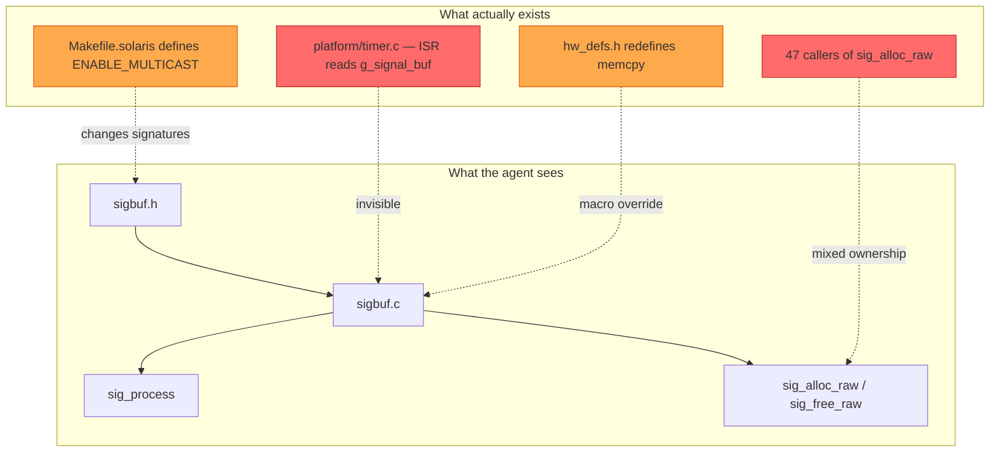
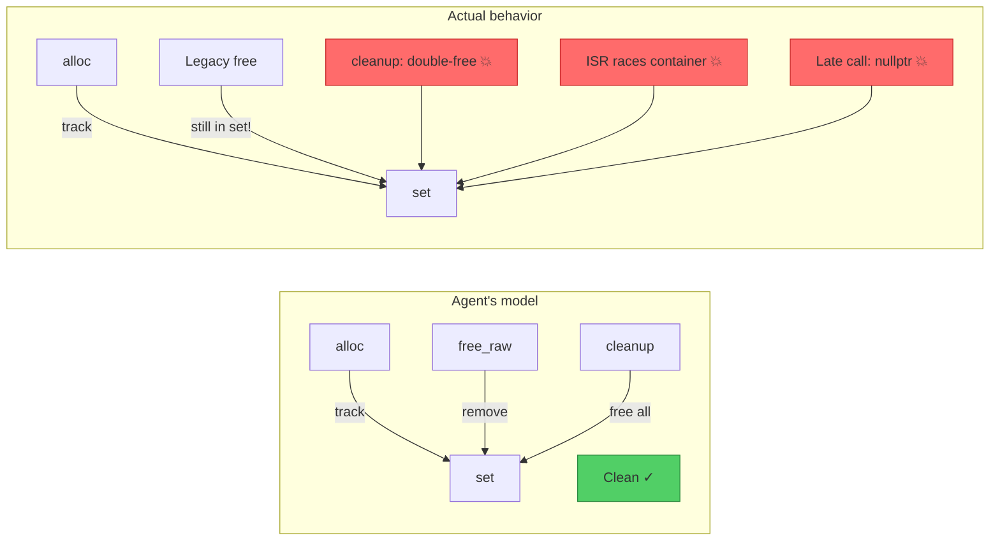
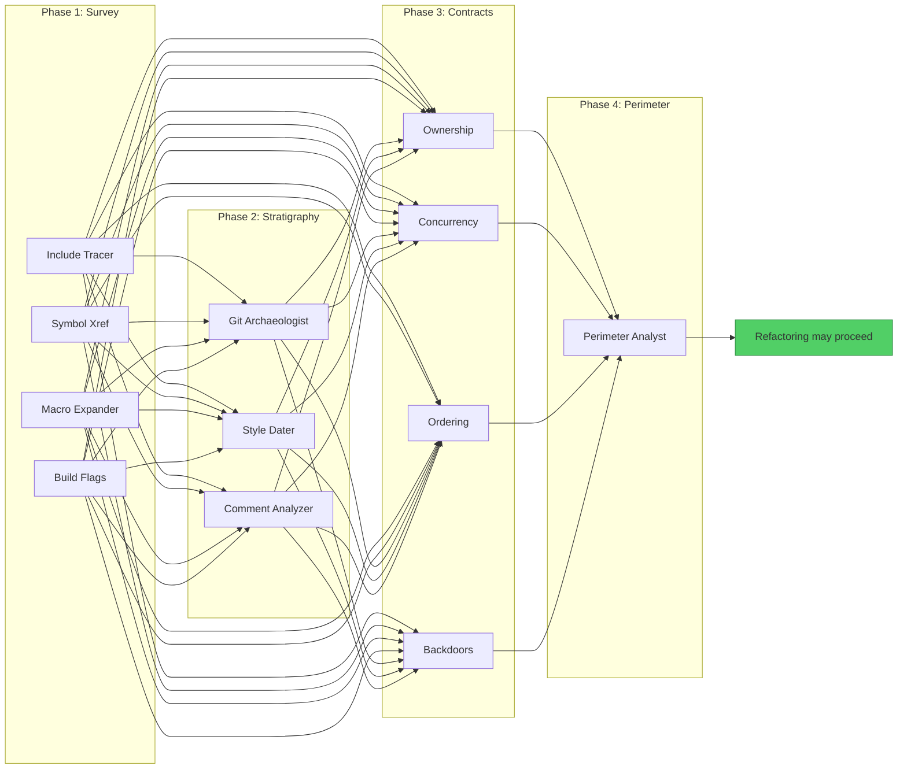

# 4.3 Refactoring the Past: Navigating Legacy C++ via Agentic Threads

> **Key idea:** The hardest code for an agent to refactor is not the most complex — it is the most *implicit*. Forty-year-old C++ codebases encode tribal knowledge in preprocessor macros, void-pointer casts, and ownership contracts that exist only in the memories of engineers who left in 2003. Agents that charge in without excavating these contracts don't refactor — they detonate.

Sections 4.1 and 4.2 gave you a threading model and orchestration framework for agents. Now we stress-test both against the hardest real-world problem: legacy C++ that predates the agents, the frameworks, and the language standards. This is survival archaeology — navigating codebases where a misunderstood `#define` can bring down a telecom switch serving two million subscribers.

---

> ### How to Read This Section
>
> This section contains **six concept loops**. The first half (Loops 1–3) builds the problem and the core pattern:
>
> 1. **The Legacy Code Problem** — Why old C++ is uniquely hostile to agents
> 2. **Why Agents Fail on Legacy Code** — Four failure vectors that turn confident agents into liability generators
> 3. **The Archaeological Dig Pattern** — The key insight: MAP before you MODIFY
>
> The second half (Loops 4–6) applies the pattern at scale:
>
> 4. **Loom Weaves for Legacy Refactoring** — Wiring the dig into Section 4.2's orchestration model
> 5. **Incremental Trust: The Strangler Fig Agent** — Wrapping legacy modules in safe interfaces
> 6. **Measuring Progress Without Breaking Production** — Observability and rollback
>
> **If you work with legacy C++**, read everything. **If you work with other legacy languages**, Loops 1–3 and 6 transfer directly. **If you only have greenfield codebases**, read Loop 3 — the archaeological dig pattern applies whenever implicit contracts lurk beneath the surface.

**Why this section matters.** Every Fortune 500 runs critical infrastructure on C++ from 1985–2005. These codebases can't be rewritten. Agentic refactoring is the only path to modernization — but agents that skip the archaeology produce changes that compile, pass tests, and fail catastrophically.

**Deliverable.** The Archaeological Dig pattern for safe agentic refactoring, wired into Loom (Section 4.2), producing multi-agent pipelines that map implicit contracts before modifying a single line.

---

## Loop 1: The Legacy Code Problem

### Concept

We are not talking about modern C++17. We are talking about code written before the C++ standard existed — targeting a specific compiler, treating `undefined behavior` as a feature, patched by forty engineers over thirty years. Here is what an agent encounters:

- **Preprocessor forests.** `#define` macros rewrite function signatures based on platform flags. The code the agent reads is *not* what the compiler sees.
- **Global mutable state.** `extern` globals accessed from any translation unit, ordering enforced by convention alone.
- **Ownership ambiguity.** Raw `new`/`delete`, `void*` through callbacks, `reinterpret_cast` stuffing pointers into `int` fields.
- **Implicit protocols.** Call-ordering constraints evidenced only by a 1998 comment: `/* init first!! */`.
- **Build-system archaeology.** Makefiles → Perl scripts → generated headers → macros → preprocessor forests.
- **Missing documentation.** Comments in German. Comments describing three-refactors-ago code. No comments.

An agent trained on GitHub has seen C++ — but mostly *modern* C++ with tests and clear ownership. Legacy code violates every assumption that training data encodes.

### Worked Example

**Example 4-15. A signal-processing module from a telecom system, circa 1995.**

A signal buffer manager in a telecom switching system. The original spans thousands of lines; we show enough to illustrate the problem.

```cpp
/* sigbuf.h - Signal buffer management  (c) 1995 TelSys GmbH
 * Änderungen nur nach Rücksprache mit Abt. 4! */
#ifndef _SIGBUF_H_
#define _SIGBUF_H_

#ifdef PLATFORM_SOLARIS
#  define SIG_BUF_SZ  4096
#  define SIG_ALIGN    __attribute__((aligned(8)))
#else
#  define SIG_BUF_SZ  2048
#  define SIG_ALIGN    /* nothing */
#endif

#ifdef ENABLE_MULTICAST
#  define SIG_FUNC_DECL(name)  int name(void* buf, int len, int mcast_grp)
#else
#  define SIG_FUNC_DECL(name)  int name(void* buf, int len)
#endif

extern char g_signal_buf[SIG_BUF_SZ] SIG_ALIGN;
extern volatile int g_buf_lock;
extern int g_init_done;

#ifdef __cplusplus
extern "C" {
#endif
SIG_FUNC_DECL(sig_process);
SIG_FUNC_DECL(sig_forward);
int sig_init(void);
void sig_cleanup(void);   /* DO NOT call from timer ctx! */
/* Wer hat das geschrieben?? - K.M. 2003 */
void* sig_alloc_raw(int sz);
void  sig_free_raw(void* p);  /* p MUST be from sig_alloc_raw */
#ifdef __cplusplus
}
#endif
#endif /* _SIGBUF_H_ */
```

```cpp
/* sigbuf.c - implementation
 * NOTE: timer_handler accesses g_signal_buf directly.
 *       See platform/timer.c (DO NOT MOVE without updating ISR)
 */
#include "sigbuf.h"
#include "platform/hw_defs.h"
#include <string.h>
#include <stdlib.h>

char g_signal_buf[SIG_BUF_SZ] SIG_ALIGN;
volatile int g_buf_lock = 0;
int g_init_done = 0;
static void* s_alloc_table[256];
static int   s_alloc_idx = 0;

int sig_init(void) {
    memset(g_signal_buf, 0, SIG_BUF_SZ);
    s_alloc_idx = 0;  g_init_done = 1;  g_buf_lock = 0;
    return 0;
}
void* sig_alloc_raw(int sz) {
    void* p = malloc(sz);
    if (p && s_alloc_idx < 256) s_alloc_table[s_alloc_idx++] = p;
    return p;  /* caller owns... but we track for cleanup */
}
void sig_free_raw(void* p) {
    int i;
    for (i = 0; i < s_alloc_idx; i++) {
        if (s_alloc_table[i] == p) { s_alloc_table[i] = s_alloc_table[--s_alloc_idx]; break; }
    }
    free(p);
}
void sig_cleanup(void) {
    int i;
    for (i = 0; i < s_alloc_idx; i++) free(s_alloc_table[i]);
    s_alloc_idx = 0;  g_init_done = 0;
}

#ifdef ENABLE_MULTICAST
int sig_process(void* buf, int len, int mcast_grp) {
#else
int sig_process(void* buf, int len) {
#endif
    if (!g_init_done) return -1;
    while (g_buf_lock) { /* spin */ }
    g_buf_lock = 1;
    memcpy(g_signal_buf, buf, len > SIG_BUF_SZ ? SIG_BUF_SZ : len);
    /* ... 200 lines of signal processing omitted ... */
    g_buf_lock = 0;
    return 0;
}
```

When an agent reads these files, it sees syntax. What it *doesn't* see:

- `timer_handler` in `platform/timer.c` reads `g_signal_buf` directly from an ISR — the `volatile int g_buf_lock` is a basic spinlock, but the ISR bypasses it entirely, relying on an implicit single-writer protocol.
- `sig_alloc_raw` tracks for bulk cleanup, but some callers also `free()` directly — dual-ownership that causes double-frees.
- `SIG_FUNC_DECL` gives `sig_process` a *different signature* depending on a build flag.
- The German comment means "Changes only after consultation with Department 4!" — a human gate invisible to agents.



> **Check-yourself:** Before reading on, list three ways the `sig_cleanup` function could cause a crash at shutdown. Think about what happens if a caller has already freed a pointer via `sig_free_raw`, and what happens if the timer ISR fires during cleanup.

<details>
<summary>Possible answers</summary>

1. **Double-free.** If a caller freed `p` directly via `free()` (bypassing `sig_free_raw`), the pointer stays in `s_alloc_table` and `sig_cleanup` frees it again.
2. **Use-after-free via ISR.** `timer_handler` may read `g_signal_buf` while `sig_cleanup` sets `g_init_done = 0`.
3. **Dangling pointer.** Another thread holding a `sig_alloc_raw` pointer has no way to know it was freed.
</details>

---

## Loop 2: Why Agents Fail on Legacy Code

### Concept

Agents fail on legacy C++ not because they are stupid, but because they are *confidently wrong*. The failure modes map to Section 2.2's taxonomy, but legacy code amplifies each:

**1. No tests → false-positive completion.** The agent changes code, compiles, reports success. Nothing contradicts its confidence.

**2. Implicit contracts → context poisoning.** Signatures lie. A `void*` parameter might require a specific allocator, a valid bitmask, and a held lock. The agent's model is poisoned from the start.

**3. Macro soup → reading one program, modifying another.** The preprocessor transforms source into something entirely different before compilation.

**4. Undefined behavior → delayed detonation.** Refactoring introduces UB that works on dev but fails on production with a different compiler or optimization level.

> **Warning:** These four vectors compound. An agent on macro-obscured code (3) with no tests (1) that misreads an implicit contract (2) can introduce UB (4) that passes every check. This is the *default outcome* without guardrails.

### Worked Example

**Example 4-16. An agent confidently refactors the signal buffer — and introduces a use-after-free.**

An agent is tasked with "modernizing the memory management in `sigbuf.c`." It reasons: *"The `s_alloc_table` is a fixed-size array with O(n) scan — I'll replace it with `std::unordered_set` for O(1) lookup. Safe, mechanical modernization."* The agent produces:

```cpp
/* sigbuf_modernized.c - agent-refactored version */
#include "sigbuf.h"
#include <unordered_set>
#include <cstring>
#include <cstdlib>

char g_signal_buf[SIG_BUF_SZ] SIG_ALIGN;
volatile int g_buf_lock = 0;
int g_init_done = 0;

static std::unordered_set<void*>* s_alloc_set = nullptr;

int sig_init(void) {
    std::memset(g_signal_buf, 0, SIG_BUF_SZ);
    delete s_alloc_set;
    s_alloc_set = new std::unordered_set<void*>();
    g_init_done = 1;  g_buf_lock = 0;
    return 0;
}
void* sig_alloc_raw(int sz) {
    void* p = std::malloc(sz);
    if (p && s_alloc_set) s_alloc_set->insert(p);
    return p;
}
void sig_free_raw(void* p) {
    if (s_alloc_set) s_alloc_set->erase(p);
    std::free(p);
}
void sig_cleanup(void) {
    if (s_alloc_set) {
        for (void* p : *s_alloc_set) std::free(p);
        delete s_alloc_set;  s_alloc_set = nullptr;
    }
    g_init_done = 0;
}
```

Here is what actually happens in production:

1. **`extern "C"` ABI is broken.** The original functions are declared with `extern "C"` linkage. The agent's implementation file now compiles as C++ (required for `std::unordered_set`), but without preserving the `extern "C"` wrapper around the function definitions, the compiled symbols use C++ name mangling. C translation units linking against these symbols get linker errors — or silently link to stale object files.

2. **The timer ISR now races with C++ containers.** The original `s_alloc_table` was a plain C array. Now, if any ISR-adjacent code path touches `s_alloc_set`, the `std::unordered_set` — which is not interrupt-safe — will corrupt its internal state.

3. **Shutdown semantics changed.** Legacy callers sometimes call `free()` directly instead of `sig_free_raw()`. The original code "managed" this by calling `sig_cleanup` before stale callers could trigger issues. The agent's version sets `s_alloc_set = nullptr` after cleanup, so any late `sig_free_raw` call dereferences null instead of the old benign no-op on the static array.



> **Pitfall:** The agent's refactoring is *locally correct*. A senior developer reviewing only `sigbuf_modernized.c` would approve it. The bugs are *relational* — they exist in gaps between files. Context (Section 3.2) is a survival requirement.

> **Check-yourself:** The agent's reasoning was plausible at every step. At which point in its chain of thought should a guardrail have intervened? What information would that guardrail need?

<details>
<summary>Possible answers</summary>

The guardrail should have intervened *before the agent wrote any code*:

1. **Linkage check** — callers include C translation units requiring `extern "C"`.
2. **ISR check** — `sigbuf.h` symbols are accessed from interrupt context.
3. **Caller audit** — some callers `free()` directly, bypassing `sig_free_raw`.
4. **Shutdown trace** — `sig_free_raw` can be called after `sig_cleanup`.

Every check is a *mapping* operation, not a modification — the core insight of Loop 3.
</details>

---

## Loop 3: The Archaeological Dig Pattern

### Concept

The lesson from Loops 1 and 2: agents must **map before they modify**. But "read the code first" is a platitude, not a pattern. The Archaeological Dig is a *structured, multi-phase, multi-agent* approach to building context before touching legacy code.

The metaphor is deliberate. Real archaeologists don't start with a backhoe. They survey, grid the site, identify soil layers, and extract artifacts with brushes. Skipping a phase destroys information. The dig has four phases:

**Phase 1 — Survey.** Build the *real* dependency graph. Trace `#include` chains, symbol usage, macros that rewrite interfaces, and build flags that change compiled output.

**Phase 2 — Stratigraphy.** Identify temporal layers. Code from 1995 follows different conventions than patches from 2020. Use `git log`, timestamps, and coding style shifts.

**Phase 3 — Contract Extraction.** Infer implicit contracts from *usage patterns*, not signatures. Ownership contracts, synchronization protocols, call-ordering constraints.

**Phase 4 — Safe Perimeter.** Define the blast radius. Which files must change together? The safe perimeter is the *boundary of confidence*.

This connects to Section 3.2: survey and stratigraphy are *context investment*, contract extraction builds *hyper-context*, and the perimeter is *context economics*. It maps to Section 4.2's pipeline pattern — each phase parallelizable, wirable as a Loom weave with abort-on-failure checkpoints.

### Worked Example

**Example 4-17. The Archaeological Dig applied to the telecom signal buffer.**

Let's revisit `sigbuf.c` from Example 4-15 with the Archaeological Dig running before any modification.

**Phase 1 — Survey results:** A survey agent discovers:

- `g_signal_buf` referenced in **4 files** (including `platform/timer.c` and `diag/memcheck.c`)
- `sig_alloc_raw` called from **47 translation units** across three subsystems
- `sig_process` has two signatures depending on `ENABLE_MULTICAST` (set in `Makefile.solaris` and `Makefile.embedded` only)
- `hw_defs.h` redefines `memcpy` to a DMA-aware variant on embedded

**Phase 2 — Stratigraphy results:** Via `git log` and style analysis:

- **Layer 1 (1995):** Core `sigbuf.c`/`.h`. C89 style. German comments. Author: K.M.
- **Layer 2 (2001):** `ENABLE_MULTICAST` added via macro. Author: J.T.
- **Layer 3 (2008):** `sig_alloc_raw`/`sig_free_raw` — "temporary" tracking for a memory leak investigation. Author: R.S.
- **Layer 4 (2019):** `diag/memcheck.c` — reads `s_alloc_table` via extern backdoor. Author: intern (gone).

**Phase 3 — Contract extraction results:**

- **Contract C1:** `g_signal_buf` is accessed from ISR context (`timer.c`) without `g_buf_lock`. The ISR only *reads*; the main loop *writes*. Implicit lock-free protocol. *Cannot change buffer to dynamic allocation.*
- **Contract C2:** `sig_alloc_raw` callers split into two groups: 31 use `sig_free_raw` individually, 16 rely on `sig_cleanup` at shutdown. *Must preserve both patterns.*
- **Contract C3:** `sig_cleanup` must run after subsystem shutdown but before platform HAL teardown — enforced only by call order in `main.c:shutdown_system()`.
- **Contract C4:** `diag/memcheck.c` reads `s_alloc_table` via `extern`. *Changing the data structure silently breaks diagnostics.*

**Phase 4 — Safe perimeter results:**

- **Safe to change:** Internal implementation of alloc/free tracking, *if* the data structure stays C-compatible (for `diag/memcheck.c`) and both cleanup patterns are preserved.
- **Unsafe to change:** `g_signal_buf` location (ISR), `extern "C"` signatures (linkage), `sig_cleanup` ordering (implicit sequencing).
- **Blast radius:** **52 files** (47 callers + 4 buffer accessors + 1 diagnostic backdoor).

The orchestration code:

```python
# Example 4-17: Archaeological Dig pipeline orchestration
# Uses the Loom conceptual framework from Section 4.2
from loom import Weave, Phase, Agent, CheckpointPolicy

def archaeological_dig(target_file: str, refactor_goal: str) -> DigReport:
    """Four-phase archaeological dig before any code modification."""
    weave = Weave(name=f"arch-dig-{target_file}",
                  checkpoint=CheckpointPolicy.BETWEEN_PHASES)

    # Phase 1: Survey — build the real dependency graph
    survey = weave.add_phase(Phase("survey", agents=[
        Agent("include-tracer",     task="trace all #include chains from {target}"),
        Agent("symbol-xref",        task="find all references to symbols in {target}"),
        Agent("macro-expander",     task="identify macros affecting {target} signatures"),
        Agent("build-flag-scanner", task="find build configs that change {target}"),
    ], fan_out="parallel", merge_strategy="union_dependency_graph"))

    # Phase 2: Stratigraphy — identify temporal layers
    strat = weave.add_phase(Phase("stratigraphy", agents=[
        Agent("git-archaeologist", task="analyze git log for {target} and deps"),
        Agent("style-dater",       task="identify coding style eras in {target}"),
        Agent("comment-analyzer",  task="extract date/author info from comments"),
    ], fan_out="parallel", depends_on=[survey],
       merge_strategy="temporal_layer_map"))

    # Phase 3: Contract extraction — infer implicit contracts
    contracts = weave.add_phase(Phase("contracts", agents=[
        Agent("ownership-tracer",   task="determine alloc/free patterns"),
        Agent("concurrency-mapper", task="identify ISR and thread access to shared state"),
        Agent("ordering-analyzer",  task="extract implicit call-ordering constraints"),
        Agent("backdoor-finder",    task="find extern access to file-static data"),
    ], fan_out="parallel", depends_on=[survey, strat],
       merge_strategy="contract_set"))

    # Phase 4: Safe perimeter — define blast radius
    weave.add_phase(Phase("perimeter", agents=[
        Agent("perimeter-analyst", task=(
            f"Given survey, stratigraphy, contracts, and goal='{refactor_goal}': "
            "define safe/unsafe modification boundaries and blast radius"
        )),
    ], depends_on=[survey, strat, contracts]))

    return weave.execute().as_dig_report()
```



> **Key idea:** The dig invested all its tokens in safe reconnaissance — zero spent on code modifications, all spent on building the map. The agent from Example 4-16 would have been stopped at Phase 3, when Contract C4 revealed the diagnostic backdoor.

> **Check-yourself:** In the pipeline above, Phase 3 (Contract Extraction) depends on *both* Phase 1 (Survey) and Phase 2 (Stratigraphy). Why does it need stratigraphy results, not just the dependency graph? Think of a specific contract that can only be identified by knowing *when* code was written.

<details>
<summary>Possible answer</summary>

Contract C2 (the dual cleanup pattern) is only understandable with stratigraphy. The survey tells you 47 callers use `sig_alloc_raw`. Stratigraphy reveals the 16 relying on bulk `sig_cleanup` are from Layer 1 (1995), while the 31 using `sig_free_raw` are from Layer 3 (2008+). Without stratigraphy, a contract-extraction agent sees one inconsistent pattern. With it, the agent correctly identifies two *intentional* patterns from different eras — both must be preserved.
</details>
