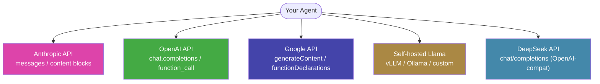
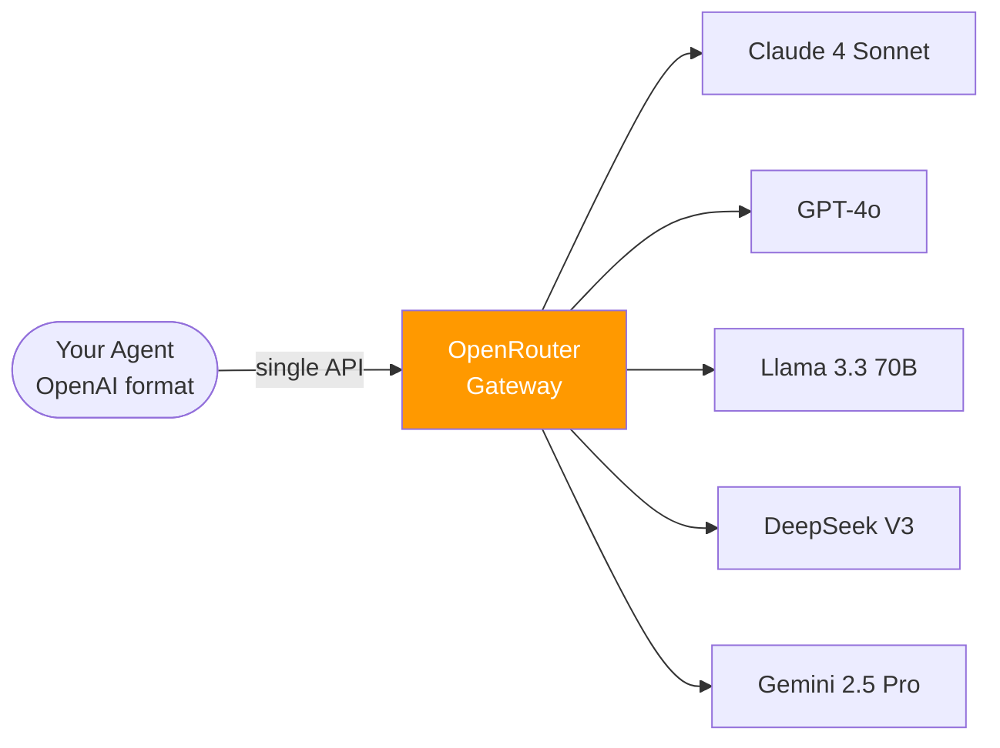
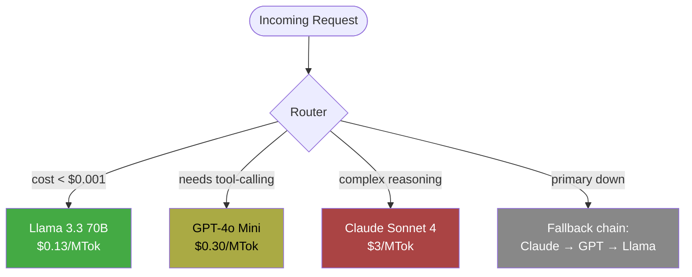

# 5.2 OpenRouter: The Switzerland of the Model Wars

> **How to read this section:** Section 5.1 gave your agent hands — tool-calling and sandboxed execution. This section gives it *options*. The model behind the agent is no longer a fixed dependency; it becomes a swappable parameter. Read the five concept loops in order. By loop 2 you will have a working universal gateway. By loop 4 you will be routing requests across models mid-task. If you already use OpenRouter in production, skim loops 1–2 and start at loop 3 (routing strategies).

## Why this section matters

Every major model provider ships a different API shape. Anthropic uses `messages` with `role: "assistant"` content blocks. OpenAI uses `chat.completions` with `function_call`. Google uses `generateContent` with `functionDeclarations`. Meta's Llama has no hosted API at all — you either self-host or go through a third party.

This fragmentation creates three problems:

1. **Vendor lock-in.** You hard-code one provider's SDK and your agent cannot try a model that launched last Tuesday.
2. **No fallback.** When Claude is rate-limited at 3 AM, your CI agent dies instead of switching to GPT-4o.
3. **No cost optimization.** You use a $15/MTok model for tasks a $0.15/MTok model handles identically.

OpenRouter solves all three by providing a single OpenAI-compatible API that fans out to 200+ models. One API key, one request format, any model. This is the "Switzerland" — neutral ground in the model wars, where your agent picks the best tool for each sub-task without political allegiance.

> **Key idea:** Decoupling the agent from a specific model provider is the same architectural move as decoupling a web app from a specific database. The abstraction layer (OpenRouter) lets you swap implementations without rewriting the consumer.

## Deliverable

By the end of this section, the reader can:

- explain why model API fragmentation creates lock-in, fragility, and cost waste,
- send requests through OpenRouter to any supported model using a single interface,
- implement three routing strategies: cost-based, capability-based, and fallback chains,
- build an agent that switches models mid-task based on sub-task requirements, and
- calculate when cheap models suffice versus when frontier models pay for themselves.

---

## Concept loop 1: The model fragmentation problem

### Concept

The provider landscape in 2024–2025 looks like this:



Each arrow is a different SDK, auth scheme, request shape, and error format. Supporting *N* providers means maintaining *N* integration paths. Worse, tool-calling schemas differ: Anthropic uses `tool_use` content blocks, OpenAI uses `tool_calls` on the message, and Google nests them inside `functionCall` parts.

### Worked example

Here is the same "read a file" tool call expressed for two providers. Notice every field name changes:

### Example 5-6. The same tool call, two providers

```python
# Anthropic format
anthropic_request = {
    "model": "claude-sonnet-4-20250514",
    "max_tokens": 1024,
    "tools": [{
        "name": "file_read",
        "description": "Read a file from disk",
        "input_schema": {
            "type": "object",
            "properties": {"path": {"type": "string"}},
            "required": ["path"],
        },
    }],
    "messages": [{"role": "user", "content": "Read config.yaml"}],
}

# OpenAI format
openai_request = {
    "model": "gpt-4o",
    "max_tokens": 1024,
    "tools": [{
        "type": "function",
        "function": {
            "name": "file_read",
            "description": "Read a file from disk",
            "parameters": {
                "type": "object",
                "properties": {"path": {"type": "string"}},
                "required": ["path"],
            },
        },
    }],
    "messages": [{"role": "user", "content": "Read config.yaml"}],
}

# Print the structural differences
print("Anthropic tool key: 'input_schema'")
print("OpenAI tool key:    'parameters' (nested under 'function')")
print("Anthropic wraps tool at top level; OpenAI wraps in 'type'+'function'")
```

> **Pitfall:** The differences look cosmetic until you add streaming, tool results, multi-turn conversations, and error handling. Then each provider becomes a 500-line adapter. Multiply by five providers and you have 2,500 lines of glue code that breaks every time a provider ships a breaking change.

**Check yourself:** Can you name three structural differences between the Anthropic and OpenAI tool-calling formats?

---

## Concept loop 2: OpenRouter as universal gateway

### Concept

OpenRouter accepts the OpenAI chat-completions format and translates it to whatever the target model requires. Your agent speaks one dialect; OpenRouter handles the rest.



The key properties:

| Property | What it means |
|----------|---------------|
| **One API format** | Always OpenAI-compatible `chat.completions` |
| **One API key** | Single credential, all models |
| **Hot-swap** | Change `model` string, nothing else |
| **Fallback** | Specify ordered model list; auto-retry on failure |
| **Cost transparency** | Response headers include per-request cost |

### Worked example

Switching from Claude to GPT-4o is a one-line change:

### Example 5-7. Hot-swapping models via OpenRouter

```python
import os
import json
from urllib.request import Request, urlopen
from urllib.error import HTTPError

OPENROUTER_API_KEY = os.environ.get("OPENROUTER_API_KEY", "sk-demo-key")
OPENROUTER_URL = "https://openrouter.ai/api/v1/chat/completions"

def query_model(prompt: str, model: str) -> dict:
    """Send a prompt to any model through OpenRouter."""
    payload = {
        "model": model,
        "max_tokens": 256,
        "messages": [{"role": "user", "content": prompt}],
    }
    headers = {
        "Authorization": f"Bearer {OPENROUTER_API_KEY}",
        "Content-Type": "application/json",
        "HTTP-Referer": "https://acceleralpho.dev",
    }
    req = Request(OPENROUTER_URL, data=json.dumps(payload).encode(),
                  headers=headers, method="POST")
    try:
        with urlopen(req, timeout=30) as resp:
            return json.loads(resp.read())
    except HTTPError as e:
        return {"error": e.code, "body": e.read().decode()}

# Hot-swap: change ONE string
# result_claude  = query_model("Explain monads in 2 sentences", "anthropic/claude-sonnet-4-20250514")
# result_gpt     = query_model("Explain monads in 2 sentences", "openai/gpt-4o")
# result_llama   = query_model("Explain monads in 2 sentences", "meta-llama/llama-3.3-70b-instruct")

# Demo without live API:
print("query_model() accepts any OpenRouter model string.")
print("Switching models requires changing only the 'model' parameter.")
print("No SDK changes. No auth changes. No format changes.")
```

> **Tip:** OpenRouter returns cost metadata in the response under `usage`. Use this to build real-time cost dashboards — essential for the budget gates from Section 2.3.

**Check yourself:** What changes in your code when you switch from Claude to Llama via OpenRouter? (Answer: only the `model` string.)

---

## Concept loop 3: Model routing strategies

### Concept

Having access to every model is useless without a strategy for *choosing*. Three routing patterns cover most production needs:



| Strategy | Route by | Example |
|----------|----------|---------|
| **Cost-based** | Token price | Use Llama for summarization, Sonnet for code generation |
| **Capability-based** | Task type | Use models with strong tool-calling for harness loops |
| **Latency-based** | Response time | Use fastest model for interactive sessions |
| **Fallback chain** | Availability | Try primary → secondary → tertiary on failure |

### Example 5-8. A model router with fallback

```python
import time
from dataclasses import dataclass


@dataclass
class ModelTier:
    name: str             # OpenRouter model ID
    cost_per_mtok: float  # input cost in USD per million tokens
    supports_tools: bool
    max_context: int      # tokens


# Ordered by preference within each tier
MODELS = {
    "frontier": ModelTier("anthropic/claude-sonnet-4-20250514", 3.0, True, 200_000),
    "mid":      ModelTier("openai/gpt-4o-mini", 0.15, True, 128_000),
    "cheap":    ModelTier("meta-llama/llama-3.3-70b-instruct", 0.13, False, 131_072),
}

FALLBACK_ORDER = ["frontier", "mid", "cheap"]


def classify_task(task: str, needs_tools: bool, max_budget_usd: float) -> str:
    """Pick a model tier based on task requirements."""
    estimated_tokens = len(task.split()) * 1.5  # rough token estimate
    estimated_cost = (estimated_tokens / 1_000_000) * MODELS["frontier"].cost_per_mtok

    if needs_tools:
        # Must use a tool-capable model
        if estimated_cost < max_budget_usd * 0.1:
            return "frontier"
        return "mid"

    if estimated_cost > max_budget_usd * 0.5:
        return "cheap"  # save budget for important calls
    return "mid"


def route_with_fallback(task: str, needs_tools: bool, budget: float) -> str:
    """Select model with fallback chain."""
    primary = classify_task(task, needs_tools, budget)
    idx = FALLBACK_ORDER.index(primary)
    chain = FALLBACK_ORDER[idx:]  # primary + everything after

    for tier_name in chain:
        tier = MODELS[tier_name]
        if needs_tools and not tier.supports_tools:
            continue
        # In production: attempt API call, fall through on error
        return tier.name
    return MODELS["mid"].name  # ultimate fallback


# Demo
tasks = [
    ("Summarize this log file", False, 0.01),
    ("Refactor this function and run tests", True, 0.50),
    ("Fix a one-line typo", True, 0.05),
]

for desc, tools, budget in tasks:
    model = route_with_fallback(desc, tools, budget)
    print(f"Task: {desc:45s} → Model: {model}")
```

> **Warning:** Fallback chains mask failures. If your primary model is down, the fallback may produce lower-quality output silently. Always log which model actually served each request — connect this to the circuit breakers from Section 2.3.

**Check yourself:** Why should a fallback chain skip models that lack tool-calling when the task requires it?

---

## Concept loop 4: Building a model-switching agent

### Concept

A production agent does not use one model per session — it uses *different models for different sub-tasks* within a single task. Code generation gets a frontier model. File summarization gets a cheap model. Test result analysis gets a mid-tier model. This is the "model-per-step" pattern.

### Example 5-9. An agent that switches models mid-task

```python
from dataclasses import dataclass, field
from typing import Optional


@dataclass
class AgentStep:
    description: str
    model_tier: str       # "frontier", "mid", or "cheap"
    needs_tools: bool
    prompt: str
    result: Optional[str] = None


@dataclass
class ModelSwitchingAgent:
    """Agent that routes each step to the optimal model."""
    budget_usd: float
    spent_usd: float = 0.0
    steps: list = field(default_factory=list)

    # Cost per 1K tokens (simplified)
    COST_TABLE = {
        "frontier": 0.003,
        "mid":      0.00015,
        "cheap":    0.00013,
    }

    def plan(self, task: str) -> list[AgentStep]:
        """Decompose task into steps with model assignments."""
        # In production, an LLM generates this plan
        return [
            AgentStep("Read and summarize codebase", "cheap", False,
                      f"Summarize: {task}"),
            AgentStep("Generate implementation", "frontier", True,
                      f"Implement: {task}"),
            AgentStep("Run tests and analyze failures", "mid", True,
                      f"Analyze test output for: {task}"),
            AgentStep("Write commit message", "cheap", False,
                      f"Write commit msg for: {task}"),
        ]

    def execute(self, task: str) -> list[AgentStep]:
        """Execute all steps, tracking cost."""
        steps = self.plan(task)
        for step in steps:
            # Simulate token usage and cost
            est_tokens = len(step.prompt.split()) * 2
            cost = (est_tokens / 1000) * self.COST_TABLE[step.model_tier]

            if self.spent_usd + cost > self.budget_usd:
                step.result = "SKIPPED: budget exceeded"
                continue

            self.spent_usd += cost
            step.result = f"OK (model={step.model_tier}, cost=${cost:.6f})"
            self.steps.append(step)
        return steps


# Demo
agent = ModelSwitchingAgent(budget_usd=0.10)
results = agent.execute("Add pagination to the /users endpoint")

print(f"{'Step':<35} {'Tier':<10} {'Result'}")
print("-" * 75)
for s in results:
    print(f"{s.description:<35} {s.model_tier:<10} {s.result}")
print(f"\nTotal spent: ${agent.spent_usd:.6f} of ${agent.budget_usd} budget")
```

> **Key idea:** The cheapest correct model is the best model. A $0.13/MTok model that writes a commit message identically to a $15/MTok model saves you 99% on that step. Multiply by thousands of agent runs per day and model routing becomes a cost-of-goods optimization.

**Check yourself:** In the agent above, which step is the most expensive? Why does it get the frontier model?

---

## Concept loop 5: The economics of model diversity

### Concept

Model routing is ultimately an economic decision. The question is never "which model is best?" but "which model is best *for this sub-task at this price*?"

### Example 5-10. Cost comparison calculator

```python
from dataclasses import dataclass


@dataclass
class ModelPrice:
    name: str
    input_per_mtok: float   # USD per million input tokens
    output_per_mtok: float  # USD per million output tokens


MODELS = [
    ModelPrice("Claude Sonnet 4",       3.00,  15.00),
    ModelPrice("GPT-4o",                2.50,  10.00),
    ModelPrice("GPT-4o Mini",           0.15,   0.60),
    ModelPrice("Llama 3.3 70B",         0.13,   0.13),
    ModelPrice("DeepSeek V3",           0.27,   1.10),
    ModelPrice("Gemini 2.5 Flash",      0.15,   0.60),
]


def daily_cost(model: ModelPrice, calls_per_day: int,
               avg_input_tokens: int, avg_output_tokens: int) -> float:
    """Calculate daily cost for a workload."""
    input_cost = (avg_input_tokens * calls_per_day / 1_000_000) * model.input_per_mtok
    output_cost = (avg_output_tokens * calls_per_day / 1_000_000) * model.output_per_mtok
    return input_cost + output_cost


# Scenario: CI agent making 500 calls/day, 2K input + 500 output per call
CALLS = 500
INPUT_TOK = 2000
OUTPUT_TOK = 500

print(f"Daily cost for {CALLS} calls/day ({INPUT_TOK} in + {OUTPUT_TOK} out tokens each):\n")
print(f"{'Model':<22} {'Daily':>8} {'Monthly':>10} {'Yearly':>12}")
print("-" * 55)

for m in MODELS:
    d = daily_cost(m, CALLS, INPUT_TOK, OUTPUT_TOK)
    print(f"{m.name:<22} ${d:>7.2f} ${d * 30:>9.2f} ${d * 365:>11.2f}")

# When to use frontier
print("\n--- Decision framework ---")
print("Use CHEAP  models for: summarization, commit messages, log parsing")
print("Use MID    models for: test analysis, code review, documentation")
print("Use FRONTIER models for: complex refactoring, architecture, multi-file edits")
```

> **Tip:** Run this calculator with your actual workload numbers before picking a default model. Many teams discover that 70% of their agent calls could run on a model that costs 20× less.

> **Pitfall:** Don't optimize purely on cost. A cheap model that fails 30% of the time and triggers retries can cost *more* than a frontier model that succeeds on the first attempt. Track success rate per model per task type.

**Check yourself:** If a frontier model costs 20× more but has a 95% first-attempt success rate versus 60% for a cheap model, at what retry count does the cheap model become more expensive?

---

## What we built

| Component | Loop | Purpose |
|-----------|------|---------|
| Provider format comparison | Loop 1 | Understand why fragmentation creates lock-in |
| OpenRouter gateway client | Loop 2 | Single API for all models |
| Model router with fallback | Loop 3 | Cost/capability/latency-based routing |
| Model-switching agent | Loop 4 | Different models for different sub-tasks |
| Cost comparison calculator | Loop 5 | Economic decision framework |

## Verification checklist

- [ ] I can explain why each provider's tool-calling format differs and why this creates maintenance burden
- [ ] I can send a request to any model through a single OpenRouter-compatible interface
- [ ] I can implement cost-based, capability-based, and fallback routing strategies
- [ ] I can build an agent that uses different models for different steps of a task
- [ ] I can calculate daily/monthly cost for a workload across multiple models
- [ ] I can explain when cheap models suffice versus when frontier models are worth the premium
- [ ] I can connect model routing to the circuit breakers and budget gates from Section 2.3

---

## Wrapping up

Section 5.1 gave the agent hands — tool-calling and sandboxed execution. This section gave it a marketplace. By routing through a universal gateway like OpenRouter, your agent is no longer married to a single model provider. It can pick the cheapest model for boilerplate, the smartest model for architecture, and fall back gracefully when any provider goes down.

The three routing strategies — cost-based, capability-based, and fallback chains — connect directly to the budget gates and circuit breakers from Section 2.3. A budget gate that tracks spend per model tier prevents runaway costs. A circuit breaker that triggers on consecutive failures from one provider automatically activates the fallback chain. The harness from Section 5.1 dispatches tools; the router from this section dispatches *the model itself*.

Next, Chapter 6 examines how hyperscalers — AWS Bedrock, Azure AI Foundry, GCP Vertex — package this routing-plus-harness pattern as managed services, shifting the build-vs-buy decision for enterprise teams.

## Retrieval practice

### Exercise 1 — Format translation

Write the JSON body for a tool-calling request to OpenRouter that uses `meta-llama/llama-3.3-70b-instruct` and defines a `shell_exec` tool with a `command` string parameter. What format do you use? Why?

<details><summary>Answer</summary>

You use the OpenAI format because OpenRouter is OpenAI-compatible:

```json
{
  "model": "meta-llama/llama-3.3-70b-instruct",
  "messages": [{"role": "user", "content": "Run the test suite"}],
  "tools": [{
    "type": "function",
    "function": {
      "name": "shell_exec",
      "description": "Execute a shell command",
      "parameters": {
        "type": "object",
        "properties": {"command": {"type": "string"}},
        "required": ["command"]
      }
    }
  }]
}
```

The key insight: you always use OpenAI format regardless of the target model. OpenRouter translates.

</details>

### Exercise 2 — Fallback chain design

Design a fallback chain for a CI agent that must support tool-calling. The chain should have three tiers. What happens if all three are down?

<details><summary>Answer</summary>

Chain: `anthropic/claude-sonnet-4-20250514` → `openai/gpt-4o-mini` → `google/gemini-2.5-flash`. All three support tool-calling. If all three are down, the agent should: (1) log the failure, (2) trigger the circuit breaker from Section 2.3, (3) return a structured error to the caller rather than silently failing, and (4) alert on-call via the monitoring system. Never silently degrade — make failure visible.

</details>

### Exercise 3 — Cost optimization

Your agent runs 1,000 calls/day. 700 are summarization tasks (no tools needed), 200 are code review (tools needed), and 100 are complex refactors (tools + frontier reasoning). Design a routing table and calculate daily cost using the prices from Example 5-10.

<details><summary>Answer</summary>

| Task type | Count | Model | Input $/MTok | Output $/MTok |
|-----------|-------|-------|-------------|--------------|
| Summarization | 700 | Llama 3.3 70B | 0.13 | 0.13 |
| Code review | 200 | GPT-4o Mini | 0.15 | 0.60 |
| Refactoring | 100 | Claude Sonnet 4 | 3.00 | 15.00 |

Assuming 2K input + 500 output tokens per call:

- Summarization: 700 × (2000 × 0.13 + 500 × 0.13) / 1M = $0.0228/day
- Code review: 200 × (2000 × 0.15 + 500 × 0.60) / 1M = $0.0120/day
- Refactoring: 100 × (2000 × 3.00 + 500 × 15.00) / 1M = $1.35/day

**Total: ~$1.38/day**. Using Claude Sonnet 4 for everything would cost: 1000 × (2000 × 3.00 + 500 × 15.00) / 1M = **$13.50/day**. Routing saves ~90%.

</details>

### Exercise 4 — Success-rate breakeven

A frontier model costs $3/MTok and succeeds 95% of the time. A cheap model costs $0.15/MTok and succeeds 65% of the time. Each failure triggers a full retry. At what success rate does the cheap model break even with the frontier model on total cost?

<details><summary>Answer</summary>

Frontier expected cost per successful call: $3.00 / 0.95 = $3.16/MTok effective. Cheap model with retries: each attempt costs $0.15. Expected attempts to succeed = 1/p where p is success rate. Breakeven: $0.15/p = $3.16, so p = 0.15/3.16 = **4.7%**. Even at a 5% success rate, the cheap model is cheaper per success. However, this ignores latency (retries take time) and context window waste (failed attempts consume tokens on retry). In practice, if the cheap model's success rate drops below ~50%, the retry latency makes it impractical for interactive use cases even though it is still cheaper.

</details>
