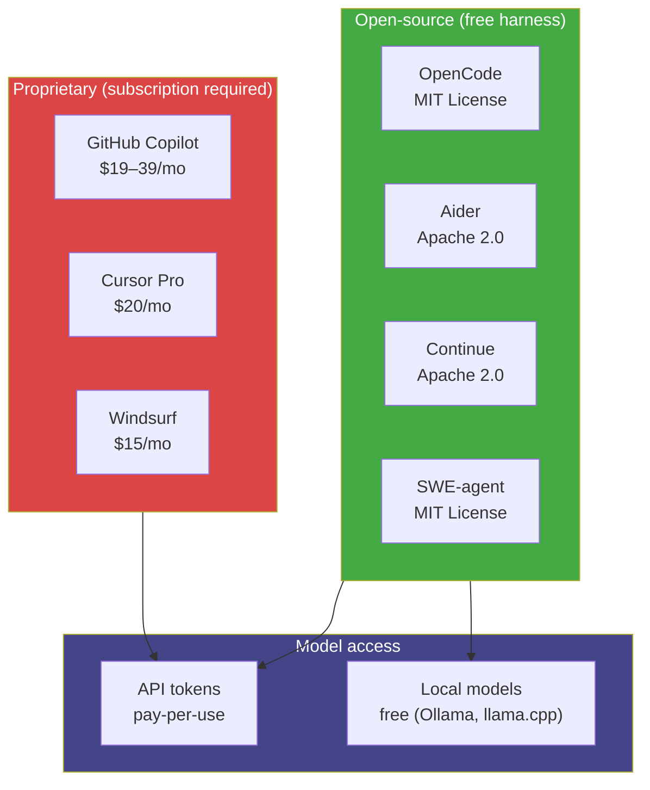
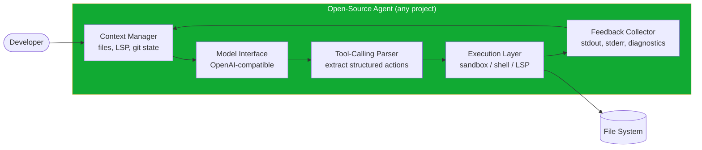
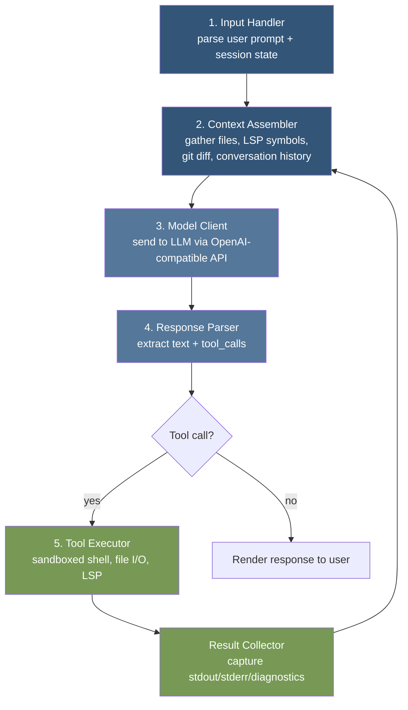
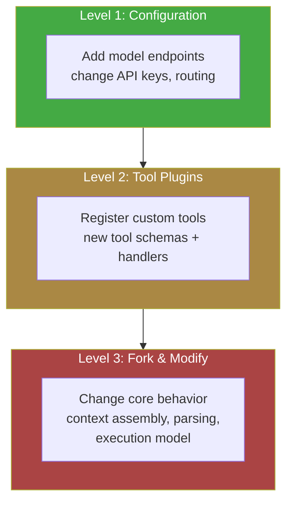
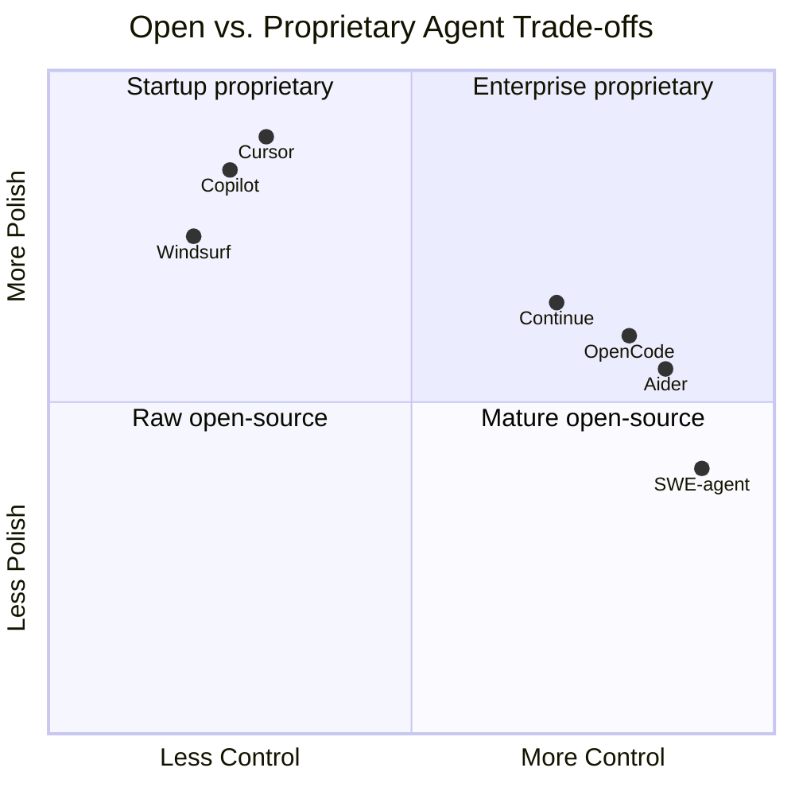
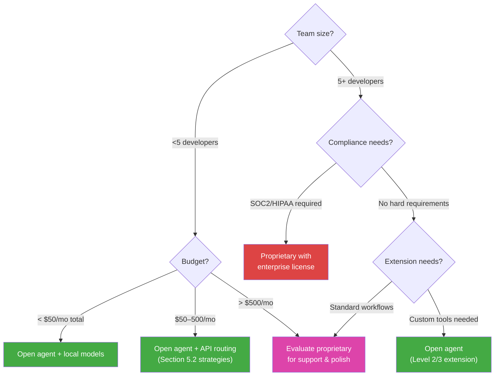
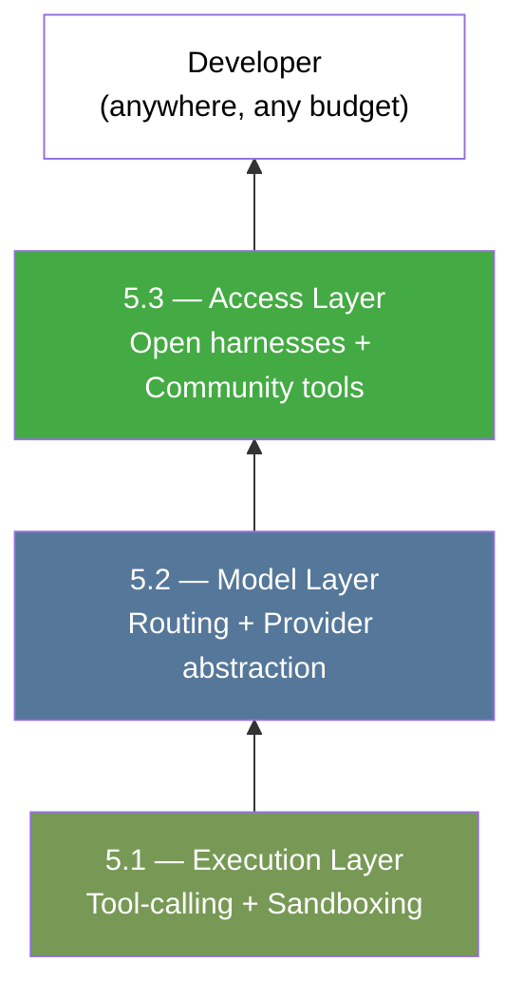

# 5.3 OpenCode and the Democratization of Agentic Access

> **How to read this section:** Section 5.1 gave your agent hands (tool-calling and sandboxing). Section 5.2 gave it options (model routing through OpenRouter). This section asks a harder question: *who gets to use any of this?* Read the five concept loops in order. By loop 2 you will understand how open-source agents replicate proprietary architectures. By loop 4 you will have extended an open agent with a custom tool. If you already contribute to open-source agent projects, skim loops 1–2 and start at loop 3 (architecture deep-dive).

## Why this section matters

Copilot costs $19/month. Cursor Pro costs $20/month. Windsurf runs $15/month. For a professional developer in San Francisco, these are rounding errors. For a student in Lagos, a freelancer in Dhaka, or a hobbyist in rural Brazil, they represent real barriers.

The access gap is not hypothetical. GitHub's own data shows that the majority of new developer accounts created since 2022 originate outside North America and Western Europe. These are the developers most likely to benefit from agentic tools — and the least likely to afford them.

Open-source coding agents change the equation. Projects like **OpenCode**, **Aider**, **Continue**, and **SWE-agent** provide the same agentic loop — model decides, harness executes, feedback flows back — without a subscription wall. The model itself may still cost tokens via API, but the *harness* is free. And with local models via Ollama or llama.cpp, even the token cost drops to electricity.

This matters architecturally, not just ethically. When the harness is open, developers can inspect it, extend it, fork it, and fix it. The community becomes the engineering team. The tool evolves at the speed of pull requests, not product roadmaps.

> **Key idea:** Democratization in agentic coding is not charity — it is an architectural decision. Open harnesses create faster feedback loops, more diverse tool ecosystems, and broader stress-testing than any single company can achieve internally.

## Deliverable

By the end of this section, the reader can:

- identify the economic and geographic barriers that proprietary agents create,
- explain the architecture of open-source coding agents and how they mirror proprietary ones,
- trace the tool-calling → context → execution pipeline in an open agent like OpenCode,
- extend an open agent with a custom tool or plugin, and
- evaluate the trade-offs between open and proprietary agents for a given team context.

---

## Concept loop 1: The access gap

### Concept

The agentic coding landscape in 2025 has a clear economic topology:



The proprietary column bundles the harness and model access into one subscription. The open column unbundles them: the harness is free; the model is your choice. This unbundling is the architectural foundation of democratization.

Three barriers lock developers out of proprietary agents:

1. **Monthly cost.** $20/month is $240/year — more than a month's salary for junior developers in many countries.
2. **Payment infrastructure.** Many regions lack easy access to international credit cards required by US SaaS platforms.
3. **Employer dependency.** Enterprise licenses flow through companies. Independent developers, students, and open-source contributors are on their own.

> **Pitfall:** "Free tier" offerings (Copilot Free, Cursor's limited plan) mitigate but do not solve the gap. Rate limits on free tiers are typically 10–50× lower than paid tiers, making sustained agentic workflows — the multi-turn loops from Section 2.1 — impractical.

### Worked example

Consider the cost of a single agentic debugging session:

### Example 5-11. Cost comparison: proprietary vs. open agent for a 30-turn debug session

```python
# Proprietary agent cost (Copilot/Cursor)
proprietary = {
    "subscription": 19.00,        # USD/month (GitHub Copilot Individual)
    "included_completions": 2000,  # approximate monthly premium requests
    "overage_per_request": 0.00,   # included in subscription
    "sessions_per_month": 40,      # typical active developer
    "cost_per_session": 19.00 / 40  # ~$0.475
}

# Open agent + API cost (OpenCode + Claude via OpenRouter)
open_agent = {
    "harness_cost": 0.00,          # MIT licensed
    "turns": 30,
    "avg_input_tokens": 4000,
    "avg_output_tokens": 800,
    "model": "claude-sonnet-4-20250514",
    "input_price_per_mtok": 3.00,  # USD via OpenRouter
    "output_price_per_mtok": 15.00,
}

api_cost = (
    open_agent["turns"] * open_agent["avg_input_tokens"] / 1_000_000
    * open_agent["input_price_per_mtok"]
    + open_agent["turns"] * open_agent["avg_output_tokens"] / 1_000_000
    * open_agent["output_price_per_mtok"]
)

print(f"Proprietary per session: ${proprietary['cost_per_session']:.3f}")
print(f"Open agent API cost:     ${api_cost:.3f}")
print(f"Ratio:                   {proprietary['cost_per_session'] / api_cost:.1f}x")

# Open agent + local model (Ollama + Qwen2.5-Coder-32B)
local = {
    "harness_cost": 0.00,
    "model_cost": 0.00,   # running locally
    "electricity": 0.02,  # rough estimate per session on consumer GPU
}

print(f"Open agent + local:      ${local['electricity']:.3f}")
```

```
Proprietary per session: $0.475
Open agent API cost:     $0.720
Ratio:                   0.7x
Open agent + local:      $0.020
```

The numbers reveal a nuance: open agent + frontier API can actually cost *more* per session than a subscription, because subscriptions amortize across many sessions. But open agent + local model drops cost by an order of magnitude. The sweet spot depends on volume and model needs.

> **Tip:** Section 5.2's routing strategies apply here. Use a local model for boilerplate tasks (file scaffolding, test generation) and route only complex reasoning to a paid API. The open harness makes this routing trivial — you control the model parameter per request.

### ✅ Check yourself

Can you name the three barriers that lock developers out of proprietary agents? Which barrier does an open-source harness *not* solve?

---

## Concept loop 2: The open-source agent landscape

### Concept

Open-source coding agents are not one project — they are an ecosystem. Each occupies a different niche:

| Project | License | Interface | Key strength | Primary model support |
|---------|---------|-----------|-------------|----------------------|
| **OpenCode** | MIT | Terminal (TUI) | Full agentic loop with LSP integration | Any OpenAI-compatible API |
| **Aider** | Apache 2.0 | Terminal | Git-aware editing, diff-based output | Claude, GPT, local via LiteLLM |
| **Continue** | Apache 2.0 | VS Code/JetBrains extension | IDE-integrated, autocomplete + chat | Any provider via config |
| **SWE-agent** | MIT | CLI/automated | Benchmark-driven, autonomous issue-solving | Claude, GPT |
| **bolt.diy** | MIT | Web UI | Browser-based full-stack agent | Multiple via WebContainer |

What unites them is the architecture from Section 5.1: a **tool-calling loop** wrapped in a **context manager** running inside an **execution sandbox**.



The difference between projects is *which* tools they expose, *how* they manage context windows, and *what* UI they wrap around the loop. The core architecture is convergent — because the constraints (finite context, unreliable generation, need for grounding) force the same solutions.

### Worked example

### Example 5-12. OpenCode session — from prompt to tool execution

```bash
# Install OpenCode (Go binary — single file, no runtime dependencies)
go install github.com/opencode-ai/opencode@latest

# Start a session in your project directory
cd ~/my-project
opencode

# Inside the TUI, the agent loop works like this:
# 1. You type: "Add input validation to the createUser handler"
# 2. OpenCode reads relevant files (tool: file_read)
# 3. OpenCode reads LSP diagnostics (tool: lsp_diagnostics)
# 4. Model generates a plan + tool calls
# 5. OpenCode applies edits (tool: file_write)
# 6. OpenCode runs tests (tool: bash)
# 7. Model reads test output, iterates if needed
```

This is the same loop Copilot runs internally (Section 1.1). The difference: you can read every line of code that implements it. When the tool-calling parser mishandles a response, you file a PR — not a support ticket.

> **Key idea:** Convergent architecture means switching between open agents is low-cost. If you understand the tool-calling loop from Section 5.1, you understand every open agent — they differ in UI and polish, not in fundamental design.

### ✅ Check yourself

Name three open-source coding agents and identify one architectural component they all share. Why does this convergence happen?

---

## Concept loop 3: Inside the open agent — architecture deep-dive

### Concept

Let us trace a single request through an open agent to see how tool-calling, context, and execution compose. We will use OpenCode as the reference implementation, but the pattern applies broadly.

An open agent has five subsystems:



Each subsystem maps to a concern from earlier chapters:

| Subsystem | Sections cross-referenced |
|-----------|--------------------------|
| Context Assembler | 5.1 (tool schemas), 4.1 (context engines) |
| Model Client | 5.2 (OpenRouter, model routing) |
| Response Parser | 5.1 (tool-calling protocols) |
| Tool Executor | 5.1 (sandboxing, E2B/Piston) |
| Result Collector | 2.1 (feedback loops), 2.3 (reliability harness) |

### Worked example

### Example 5-13. Context assembly in an open agent — pseudocode

```python
class ContextAssembler:
    """Gathers relevant context within token budget."""

    def __init__(self, max_tokens: int = 120_000):
        self.max_tokens = max_tokens
        self.token_count = 0

    def assemble(self, user_prompt: str, session) -> list[dict]:
        messages = []

        # 1. System prompt — defines agent personality and tool schemas
        system = self._build_system_prompt(session.tools)
        messages.append({"role": "system", "content": system})

        # 2. Conversation history — sliding window to fit budget
        history = session.history[-20:]  # last 20 turns max
        for turn in history:
            if self._fits(turn):
                messages.append(turn)

        # 3. Active file contents — files the user is working on
        for path in session.active_files:
            content = self._read_file(path)
            if self._fits(content):
                messages.append({
                    "role": "user",
                    "content": f"[File: {path}]\n```\n{content}\n```"
                })

        # 4. LSP diagnostics — errors and warnings in the workspace
        diagnostics = session.lsp.get_diagnostics()
        if diagnostics and self._fits(diagnostics):
            messages.append({
                "role": "user",
                "content": f"[Diagnostics]\n{diagnostics}"
            })

        # 5. User prompt — always included last
        messages.append({"role": "user", "content": user_prompt})

        return messages

    def _fits(self, content) -> bool:
        tokens = estimate_tokens(content)
        if self.token_count + tokens > self.max_tokens:
            return False
        self.token_count += tokens
        return True

    def _build_system_prompt(self, tools: list) -> str:
        schemas = [tool.to_json_schema() for tool in tools]
        return f"You are a coding agent. Available tools:\n{schemas}"

    def _read_file(self, path: str) -> str:
        with open(path) as f:
            return f.read()
```

The key insight: context assembly is where open agents *must* make trade-offs. A 120k token window sounds generous until you load a monorepo with 500 files. The assembler's priority order — system prompt → history → active files → diagnostics → user prompt — determines what the model sees and therefore what it can do.

> **Warning:** Context assembly bugs are the #1 source of "the agent seems stupid" complaints. If the assembler drops the file the user is asking about, the model hallucinates a response. Open agents let you *see* and *fix* this priority logic. Proprietary agents hide it behind an API.

### ✅ Check yourself

Trace the five subsystems in order. Which subsystem maps to the reliability harness from Section 2.3? What happens if the Context Assembler exceeds its token budget?

---

## Concept loop 4: Community-driven extension — the plugin model

### Concept

The most powerful consequence of open harnesses is extensibility. When the tool-calling loop is open-source, adding a new tool is a pull request — not a feature request to a product team.

Open agents support extension at three levels:



**Level 1** requires no code — just configuration files or environment variables. Swap the model, change the API key, adjust temperature.

**Level 2** is the sweet spot. Most open agents define a tool interface: a JSON schema (what the model sees) and a handler function (what the harness executes). Adding a tool means implementing this interface.

**Level 3** is forking. When the core loop does not support your use case — say you need a custom context assembly strategy for a massive monorepo — you fork the project, modify the internals, and maintain your own variant.

### Worked example

### Example 5-14. Adding a custom tool to an open agent

```python
"""
Custom tool: database_query
Lets the agent run read-only SQL queries against a development database.
"""

from dataclasses import dataclass
import sqlite3

@dataclass
class ToolSchema:
    """Standard tool interface for open agents."""
    name: str
    description: str
    parameters: dict

    def to_json_schema(self) -> dict:
        return {
            "name": self.name,
            "description": self.description,
            "input_schema": self.parameters,
        }

# 1. Define the schema — this is what the model sees
db_query_schema = ToolSchema(
    name="database_query",
    description="Run a read-only SQL query against the development database. "
                "Only SELECT statements are allowed.",
    parameters={
        "type": "object",
        "properties": {
            "query": {
                "type": "string",
                "description": "SQL SELECT query to execute",
            }
        },
        "required": ["query"],
    },
)

# 2. Define the handler — this is what the harness executes
def handle_database_query(query: str, db_path: str = "dev.db") -> str:
    """Execute a read-only query with safety checks."""
    # Safety: reject non-SELECT statements
    normalized = query.strip().upper()
    if not normalized.startswith("SELECT"):
        return "Error: Only SELECT queries are allowed."

    # Safety: reject dangerous patterns
    dangerous = ["DROP", "DELETE", "INSERT", "UPDATE", "ALTER", "CREATE"]
    for keyword in dangerous:
        if keyword in normalized:
            return f"Error: '{keyword}' statements are not allowed."

    try:
        conn = sqlite3.connect(db_path, timeout=5)
        conn.execute("PRAGMA query_only = ON")
        cursor = conn.execute(query)
        columns = [desc[0] for desc in cursor.description] if cursor.description else []
        rows = cursor.fetchmany(50)  # limit results
        conn.close()

        if not rows:
            return "Query returned no results."

        header = " | ".join(columns)
        lines = [header, "-" * len(header)]
        for row in rows:
            lines.append(" | ".join(str(v) for v in row))
        return "\n".join(lines)

    except sqlite3.Error as e:
        return f"SQL Error: {e}"

# 3. Register with the agent's tool registry
def register_tools(registry):
    """Called by the agent during initialization."""
    registry.add(
        schema=db_query_schema,
        handler=handle_database_query,
    )
```

This pattern — schema + handler + registration — is the common extension point across open agents. The specifics of `registry.add()` vary by project, but the shape is universal: tell the model what the tool does (schema), then tell the harness how to do it (handler).

> **Tip:** The safety checks in `handle_database_query` follow the sandboxing principles from Section 5.1. Every custom tool should validate inputs, enforce least-privilege, and limit output size. The open harness does not enforce this for you — you own the security boundary.

### Community extension in practice

The fork-and-modify culture around open agents produces rapid innovation:

| Extension | Source | What it adds |
|-----------|--------|-------------|
| Aider's `/architect` mode | Community PR | Two-model workflow: one plans, one codes |
| Continue's `@codebase` context | Core team + community | Full-repo semantic search in context |
| SWE-agent's custom shells | Research team | Purpose-built command interfaces for agents |
| OpenCode's LSP integration | Core contributors | Language-server-aware context gathering |

Each of these would be a multi-quarter roadmap item at a proprietary vendor. In the open ecosystem, they emerged from individual developers scratching their own itches.

> **Key idea:** The plugin model turns every user into a potential contributor. The tool-calling interface (Section 5.1) becomes the API contract between the community and the harness. This is why open agents evolve faster at the edges — the edge *is* the community.

### ✅ Check yourself

Describe the three levels of agent extension. At which level would you add support for a new version control system? At which level would you change how the agent prioritizes files in its context window?

---

## Concept loop 5: Trade-offs — open vs. proprietary

### Concept

Open-source agents are not universally better. They involve real trade-offs that every team must evaluate:



The five trade-off axes:

### Example 5-15. Trade-off matrix — open vs. proprietary agents

| Dimension | Proprietary | Open-source |
|-----------|-------------|-------------|
| **Cost** | Fixed subscription, predictable | Free harness + variable API/compute |
| **Polish** | Professional UX, onboarding, docs | Rougher edges, steeper learning curve |
| **Support** | Paid support, SLA | Community forums, GitHub issues |
| **Extensibility** | Limited to vendor's plugin API | Full source access, fork at will |
| **Privacy** | Code sent to vendor's infrastructure | You control the data path entirely |
| **Update cadence** | Quarterly releases, staged rollout | Continuous, sometimes breaking |
| **Model choice** | Vendor-selected models | Any model, any provider, local or remote |
| **Compliance** | Vendor handles certifications | You own the compliance burden |

### Worked example — decision framework

The right choice depends on context. Here is a decision tree:



> **Warning:** "Open-source is free" is misleading. The harness is free; the total cost of ownership includes: model API spend, GPU hardware for local models, developer time configuring and maintaining the setup, and the opportunity cost of rougher UX. For a 50-person team with deadlines, paying $1,000/month for Copilot Business may be cheaper than a week of engineering time setting up an open stack.

Three scenarios where open wins decisively:

1. **Privacy-sensitive codebases.** Government, defense, healthcare — where code cannot leave the network. Open agent + local model = air-gapped agentic coding.
2. **Unusual tech stacks.** If your primary language is Elixir, Haskell, or COBOL, proprietary agents optimize for JavaScript and Python. Open agents let you build custom context providers for your ecosystem.
3. **Education and research.** Students learning *how agents work* need to read the source. Researchers benchmarking agent behavior need to control every variable. Open is the only option.

And three scenarios where proprietary wins:

1. **Enterprise compliance.** SOC 2 Type II, HIPAA BAAs, FedRAMP — proprietary vendors invest millions in certifications that no open-source project maintains.
2. **Zero-configuration onboarding.** A new hire opens Cursor and is productive in minutes. An open agent requires installing runtimes, configuring API keys, and debugging shell integration.
3. **Integrated ecosystem.** Copilot's advantage is not just the model — it is the integration with GitHub Issues, PRs, Actions, and Codespaces. This vertical integration is hard to replicate with open tools.

> **Key idea:** The democratization of agentic access is not a binary choice between open and proprietary. It is a spectrum. The critical shift is that the open option *exists* and is *viable* — which keeps proprietary vendors honest on pricing and pushes the entire ecosystem forward.

### ✅ Check yourself

Your team is five developers building a fintech application with SOC 2 requirements, but you also need a custom tool that queries your proprietary risk engine. Which approach — open, proprietary, or hybrid — would you recommend? Why?

---

## The bigger picture

The arc of Part III follows a clear trajectory:

- **Section 5.1** established the execution substrate — tool-calling and sandboxing.
- **Section 5.2** established model choice — routing requests across providers.
- **Section 5.3** established *access* — ensuring these capabilities are available beyond enterprise budgets.

Together, they form the complete harness stack:



Section 6.1 moves up the stack to the hyperscaler layer — AWS Bedrock, Azure AI Foundry, and the enterprise infrastructure that wraps these harnesses in governance, compliance, and scale. The tension between open and proprietary does not resolve; it simply moves to a higher abstraction level.

> The IDE exodus of Section 1.1 was driven by developers seeking *better* tools. The democratization of Section 5.3 is driven by developers seeking *any* tool at all. Both forces reshape the same landscape — one from the top, one from the bottom. The agents that survive will be the ones built for both.

---

## Retrieval practice

### Exercise 1: Cost modeling

Build a spreadsheet or Python script that compares the monthly cost of three setups for your current project:
1. GitHub Copilot Individual ($19/mo)
2. Open agent + Claude Sonnet via OpenRouter (estimate your typical token usage)
3. Open agent + local model via Ollama (estimate electricity cost from GPU wattage × hours)

Which setup is cheapest at 10 sessions/month? At 100 sessions/month? Where do the crossover points fall?

### Exercise 2: Tool extension

Using the pattern from Example 5-14, write a custom tool for an open agent that:
- Reads the last 5 entries from a project's `CHANGELOG.md`
- Returns them formatted for the model to reference when writing commit messages

Define the JSON schema, implement the handler, and write two test cases.

### Exercise 3: Architecture trace

Pick any open-source coding agent (OpenCode, Aider, Continue, or SWE-agent). Clone the repository and trace a single user prompt through the five subsystems from Concept Loop 3. Document:
- Where does context assembly happen? (file and function)
- Where does the model client send the request? (file and function)
- Where are tool calls parsed from the response? (file and function)
- Where are tools executed? (file and function)

### Exercise 4: Trade-off evaluation

Your team is evaluating agent tooling. Write a one-page decision document using the trade-off matrix from Example 5-15. Score each dimension 1–5 for your specific context and recommend an approach. Include at least one scenario where you would switch from your recommendation to the alternative.
