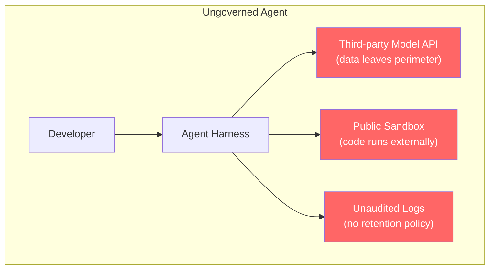
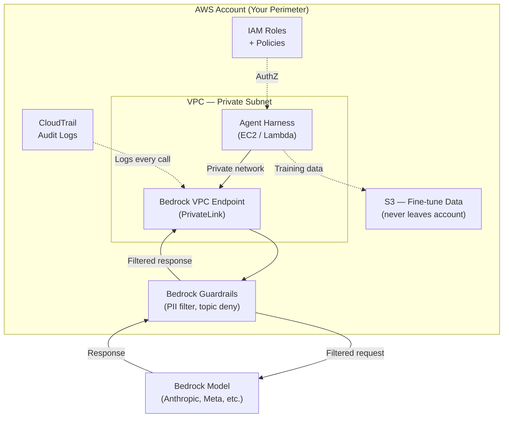
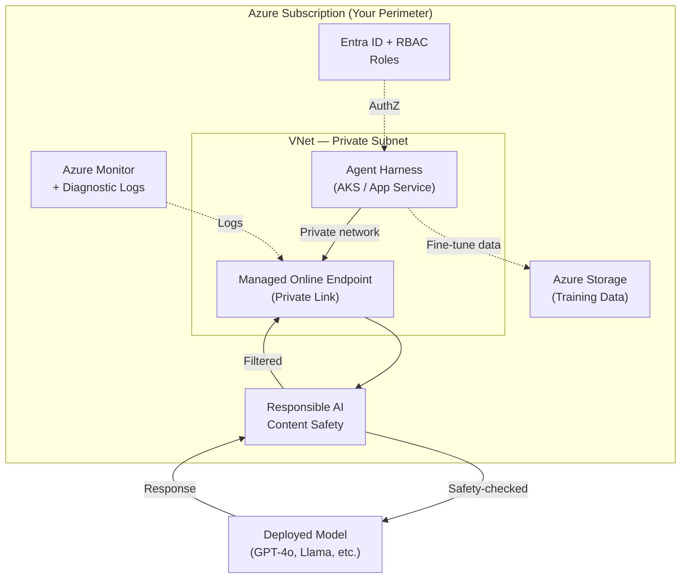
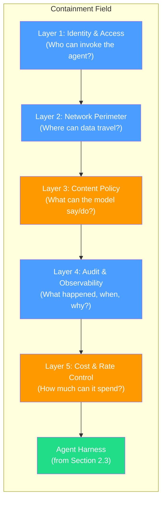
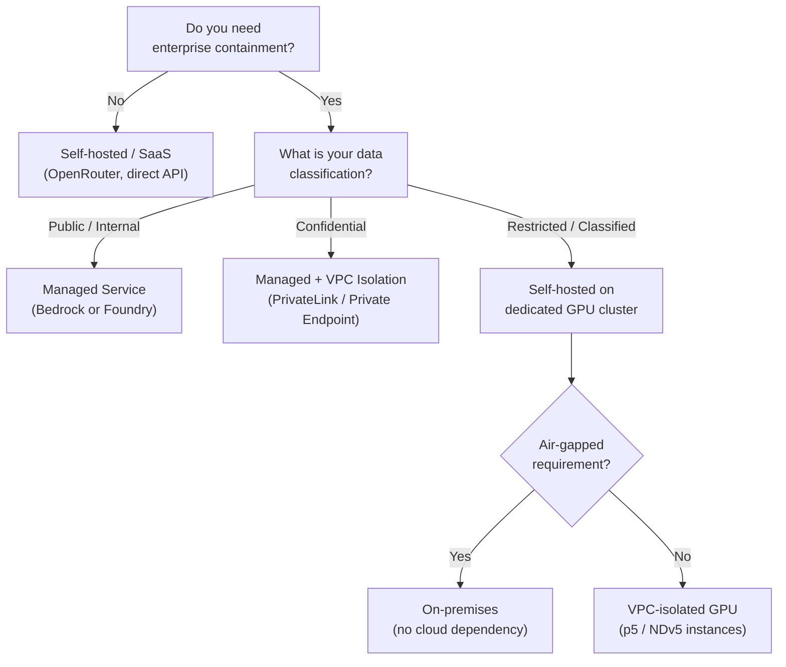
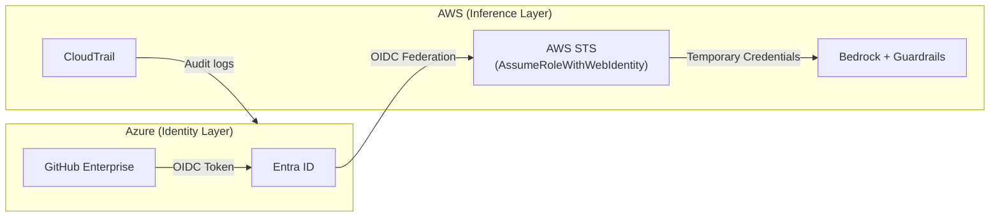

# 6.1 AWS Bedrock and Azure AI Foundry: The Enterprise Response

> **How to read this section:** This section opens Chapter 6 — the hyperscaler counter-move. Parts I and II taught you how agents think and fail. Chapter 5 showed how open tools (E2B, OpenRouter, OpenCode) let anyone build agentic systems. This section flips the lens: what happens when a Fortune 500 company wants to deploy those same agents *inside* a regulated environment? Read the five concept loops in order. By loop 2 you will understand the AWS Bedrock containment model; by loop 3 you will know Azure AI Foundry's equivalent; by loop 5 you will have a decision framework for choosing between managed and self-hosted. If you already operate in a single cloud, skim the other provider's loop and focus on the containment-field pattern in loop 4.

## Why this section matters

Coding agents in the wild are powerful but feral. They call arbitrary APIs, stream data to third-party model providers, and execute code on infrastructure you do not control. For a startup, that is acceptable risk. For a bank, a hospital, or a defence contractor, it is a career-ending audit finding.

Section 2.3 built the reliability harness — budget gates, circuit breakers, checkpoints. Section 5.1 added sandboxed execution. Section 5.2 introduced model routing via OpenRouter. All three assumed you *own* the infrastructure or trust the intermediary. Enterprise teams cannot make that assumption. They need **containment**: the guarantee that models, data, and agent actions never leave a controlled perimeter.

AWS Bedrock and Azure AI Foundry are the two largest attempts to provide that containment as a managed service. This section dissects both, extracts the shared "containment field" pattern, and gives you a decision framework for choosing the right deployment model.

## Deliverable

By the end of this section, the reader can:

- articulate why unmanaged agents violate common enterprise governance requirements,
- configure AWS Bedrock for model access with VPC isolation and guardrails,
- configure Azure AI Foundry for model deployment with responsible-AI tooling,
- apply the containment-field pattern to wrap any agent in compliance, audit, and access-control layers, and
- use a decision framework to choose between managed, self-hosted, and hybrid deployment models.

---

## Concept loop 1: The enterprise containment problem

### Concept

Every enterprise that adopts coding agents faces the same tension: **agents need freedom to be useful, but freedom is what compliance forbids.**

Consider what a coding agent does in a single iteration of the harness loop from Section 2.3:

1. Reads source files (potentially containing proprietary algorithms or PII).
2. Sends that context to a language model (where does inference happen?).
3. Receives generated code (who can see the output?).
4. Executes that code in a sandbox (what network access does it have?).
5. Logs the interaction (where do logs go? who can subpoena them?).

Each step is a compliance surface. Multiply by hundreds of developers running agents daily, and you have a governance nightmare.



Three categories of risk emerge:

| Risk category | What goes wrong | Regulatory examples |
|---|---|---|
| **Data exfiltration** | Proprietary code or PII sent to external model providers | GDPR Art. 44, ITAR, HIPAA |
| **Unaudited execution** | Agent actions cannot be traced back to a human decision | SOX Section 404, SOC 2 CC6.1 |
| **Shadow AI** | Developers use unapproved tools without security review | NIST CSF, ISO 27001 A.8 |

> **Key idea:** The enterprise containment problem is not "should we use agents?" — that ship has sailed. It is "how do we get the productivity gains without the audit findings?" AWS and Azure answered with managed containment.

### Worked example

A healthcare company wants developers to use a coding agent for refactoring a patient-records service. The code contains PHI (Protected Health Information). Under HIPAA:

- PHI cannot be sent to a model endpoint outside the company's BAA (Business Associate Agreement).
- All access to PHI must be logged with the identity of the accessor.
- Generated code that touches PHI must go through the existing change-control process.

Using a raw OpenRouter setup from Section 5.2 would route PHI through a third-party gateway — a HIPAA violation. The enterprise needs a containment field.

### Example 6-1. Governance risk scoring for agent deployments

```python
from dataclasses import dataclass
from enum import Enum

class RiskLevel(Enum):
    LOW = "low"
    MEDIUM = "medium"
    HIGH = "high"
    CRITICAL = "critical"

@dataclass
class AgentDeploymentRisk:
    data_classification: str      # "public", "internal", "confidential", "restricted"
    model_hosting: str            # "saas", "managed_cloud", "self_hosted"
    execution_environment: str    # "local", "cloud_sandbox", "vpc_isolated"
    audit_logging: bool
    identity_integration: bool

    def score(self) -> RiskLevel:
        """Score the risk of an agent deployment configuration."""
        risk_points = 0

        # Data classification drives base risk
        data_scores = {"public": 0, "internal": 1, "confidential": 3, "restricted": 5}
        risk_points += data_scores.get(self.data_classification, 5)

        # Model hosting: SaaS is highest risk for data leakage
        hosting_scores = {"self_hosted": 0, "managed_cloud": 1, "saas": 3}
        risk_points += hosting_scores.get(self.model_hosting, 3)

        # Execution isolation
        exec_scores = {"vpc_isolated": 0, "cloud_sandbox": 1, "local": 2}
        risk_points += exec_scores.get(self.execution_environment, 2)

        if not self.audit_logging:
            risk_points += 2
        if not self.identity_integration:
            risk_points += 2

        if risk_points <= 2:
            return RiskLevel.LOW
        elif risk_points <= 5:
            return RiskLevel.MEDIUM
        elif risk_points <= 8:
            return RiskLevel.HIGH
        return RiskLevel.CRITICAL

# A well-configured enterprise deployment
enterprise = AgentDeploymentRisk(
    data_classification="confidential",
    model_hosting="managed_cloud",
    execution_environment="vpc_isolated",
    audit_logging=True,
    identity_integration=True,
)
print(f"Enterprise risk: {enterprise.score().value}")  # medium

# A developer using a SaaS agent with no controls
shadow_ai = AgentDeploymentRisk(
    data_classification="confidential",
    model_hosting="saas",
    execution_environment="local",
    audit_logging=False,
    identity_integration=False,
)
print(f"Shadow AI risk: {shadow_ai.score().value}")  # critical
```

> **Check yourself:** Before reading on, list three things that change between the "enterprise" and "shadow_ai" configurations. Which single change would reduce the shadow deployment's risk the most?

---

## Concept loop 2: AWS Bedrock — managed model access behind the perimeter

### Concept

AWS Bedrock is Amazon's answer to the containment problem. The core proposition: **access foundation models through the same VPC, IAM, and CloudTrail infrastructure you already use for everything else.**

Four pillars make Bedrock an enterprise containment layer:

1. **Managed model access.** Bedrock hosts models from Anthropic, Meta, Mistral, Cohere, and Amazon inside AWS's infrastructure. Your prompts never leave the AWS network boundary.
2. **Guardrails.** Configurable content filters, denied-topic policies, PII redaction, and grounding checks that sit between your application and the model.
3. **VPC isolation.** Bedrock endpoints can be placed inside your VPC via PrivateLink — no internet traversal.
4. **Fine-tuning without data export.** Custom model training happens on your data, in your account, with the result stored in your S3 bucket.



The key insight: **Bedrock is not a new system — it is a facade that maps foundation-model access onto existing AWS governance primitives.** If your security team already understands IAM policies, VPC security groups, and CloudTrail, they can govern Bedrock without learning new concepts.

### Example 6-2. Bedrock agent invocation with guardrails

```python
import boto3
import json

bedrock_runtime = boto3.client(
    "bedrock-runtime",
    region_name="us-east-1",
    # When using VPC endpoint, the SDK routes through PrivateLink automatically
)

def invoke_with_guardrails(
    prompt: str,
    model_id: str = "anthropic.claude-sonnet-4-20250514",
    guardrail_id: str = "gr-enterprise-coding",
    guardrail_version: str = "1",
) -> dict:
    """Invoke a Bedrock model with enterprise guardrails applied."""
    response = bedrock_runtime.invoke_model(
        modelId=model_id,
        guardrailIdentifier=guardrail_id,
        guardrailVersion=guardrail_version,
        contentType="application/json",
        accept="application/json",
        body=json.dumps({
            "anthropic_version": "bedrock-2023-05-31",
            "max_tokens": 4096,
            "messages": [{"role": "user", "content": prompt}],
        }),
    )

    result = json.loads(response["body"].read())

    # Check if guardrails intervened
    stop_reason = result.get("stop_reason", "")
    if stop_reason == "guardrail_intervened":
        return {
            "blocked": True,
            "reason": "Guardrail policy triggered",
            "trace": result.get("amazon-bedrock-guardrailAction", {}),
        }

    return {
        "blocked": False,
        "content": result["content"][0]["text"],
    }

# Normal coding request — passes guardrails
result = invoke_with_guardrails("Refactor this function to use async/await.")
print(result["content"][:100] if not result["blocked"] else result["reason"])

# Request involving denied topic — blocked by guardrails
result = invoke_with_guardrails("Generate code to scrape competitor pricing data.")
print("Blocked" if result["blocked"] else result["content"][:100])
```

> **Tip:** Bedrock Guardrails operate at the API layer, not the model layer. The model never sees blocked content. This means guardrails work identically regardless of which foundation model you select — a major advantage when your model-routing strategy (Section 5.2) switches between providers.

### IAM policy for least-privilege agent access

```json
{
  "Version": "2012-10-17",
  "Statement": [
    {
      "Sid": "AllowSpecificModels",
      "Effect": "Allow",
      "Action": "bedrock:InvokeModel",
      "Resource": [
        "arn:aws:bedrock:us-east-1::foundation-model/anthropic.claude-sonnet-4-20250514",
        "arn:aws:bedrock:us-east-1::foundation-model/anthropic.claude-haiku-1"
      ]
    },
    {
      "Sid": "RequireGuardrail",
      "Effect": "Deny",
      "Action": "bedrock:InvokeModel",
      "Condition": {
        "StringNotEquals": {
          "bedrock:GuardrailIdentifier": "gr-enterprise-coding"
        }
      },
      "Resource": "*"
    }
  ]
}
```

> **Check yourself:** The IAM policy above denies any invocation that does not include the guardrail. Why is a *deny* statement stronger than simply omitting the Allow? What happens if another policy grants `bedrock:InvokeModel` with `Resource: *`?

---

## Concept loop 3: Azure AI Foundry — the model catalog and responsible AI tooling

### Concept

Azure AI Foundry (formerly Azure AI Studio) takes a different approach. Where Bedrock focuses on *wrapping existing AWS primitives*, Foundry provides a **purpose-built platform** for model evaluation, deployment, and monitoring with responsible AI baked in.

Four pillars define Foundry's enterprise story:

1. **Model catalog.** A curated marketplace of 1,700+ models (OpenAI, Meta, Mistral, Hugging Face, Microsoft) deployable to managed endpoints or serverless APIs.
2. **Responsible AI dashboard.** Built-in fairness, interpretability, error analysis, and content-safety evaluation — not a separate product, but integrated into the deployment pipeline.
3. **Managed compute with network isolation.** Models deploy to managed online endpoints inside your VNet with private endpoints and NSGs (Network Security Groups).
4. **Prompt flow.** A visual orchestration layer for building agent pipelines with built-in tracing and evaluation.



### Example 6-3. Azure AI Foundry deployment with content safety

```python
from azure.identity import DefaultAzureCredential
from azure.ai.inference import ChatCompletionsClient
from azure.ai.inference.models import SystemMessage, UserMessage

credential = DefaultAzureCredential()

client = ChatCompletionsClient(
    endpoint="https://my-project.services.ai.azure.com/models",
    credential=credential,
    # Private endpoint routes through VNet automatically
)

def invoke_with_safety(
    prompt: str,
    model: str = "gpt-4o",
) -> dict:
    """Invoke an Azure-hosted model with content safety applied."""
    response = client.complete(
        model=model,
        messages=[
            SystemMessage(content=(
                "You are a coding assistant. Follow enterprise coding standards. "
                "Do not generate code that accesses external networks."
            )),
            UserMessage(content=prompt),
        ],
        max_tokens=4096,
        # Content safety filters are configured at the endpoint level
    )

    choice = response.choices[0]

    # Check for content filter results
    filter_results = getattr(choice, "content_filter_results", None)
    if filter_results and any(
        getattr(filter_results, cat, None)
        and getattr(filter_results, cat).filtered
        for cat in ["hate", "self_harm", "sexual", "violence"]
    ):
        return {"blocked": True, "reason": "Content safety filter triggered"}

    return {"blocked": False, "content": choice.message.content}

result = invoke_with_safety("Add error handling to this database query function.")
print(result["content"][:100] if not result["blocked"] else result["reason"])
```

### Side-by-side comparison

| Dimension | AWS Bedrock | Azure AI Foundry |
|---|---|---|
| **Model access** | API-based, no deployment needed | Deploy to managed endpoint or use serverless |
| **Identity** | IAM roles + policies | Entra ID + Azure RBAC |
| **Network isolation** | VPC + PrivateLink | VNet + Private Endpoints |
| **Content safety** | Bedrock Guardrails (configurable) | Azure AI Content Safety (integrated) |
| **Audit** | CloudTrail + CloudWatch | Azure Monitor + Diagnostic Logs |
| **Fine-tuning** | In-account, S3-based | In-subscription, Storage-based |
| **Orchestration** | Bedrock Agents (built-in) | Prompt Flow / Semantic Kernel |
| **Model breadth** | ~30 models | 1,700+ catalog models |

> **Key idea:** Bedrock and Foundry solve the same problem — enterprise containment — through their respective cloud's native primitives. The choice is rarely about capability; it is about which cloud your organization already governs.

> **Check yourself:** Your team uses Azure for infrastructure but wants to use Anthropic Claude, which is available on both Bedrock and Foundry. What factors beyond model availability should drive the platform choice?

---

## Concept loop 4: The containment-field pattern

### Concept

Strip away the vendor-specific details and a shared architecture emerges. We call it the **containment field** — a set of concentric layers that wrap an agent in enterprise governance without modifying the agent's core logic.



Each layer maps to both AWS and Azure primitives:

| Layer | Purpose | AWS Primitive | Azure Primitive |
|---|---|---|---|
| Identity & access | AuthN/AuthZ | IAM roles + STS | Entra ID + RBAC |
| Network perimeter | Data boundary | VPC + PrivateLink | VNet + Private Endpoints |
| Content policy | Safety guardrails | Bedrock Guardrails | AI Content Safety |
| Audit & observability | Compliance trail | CloudTrail + CloudWatch | Monitor + Diagnostic Logs |
| Cost & rate control | Budget enforcement | AWS Budgets + throttling | Azure Cost Mgmt + quotas |

> **Pitfall:** Many teams implement layers 1–2 (identity and network) and skip layers 3–5. This creates a false sense of security. An agent inside your VPC with no content policy can still generate harmful code, run up a $50K bill, or produce unauditable outputs. All five layers are required.

### Example 6-4. Containment-field wrapper (cloud-agnostic)

```python
from dataclasses import dataclass, field
from typing import Callable, Optional
import time
import logging

logger = logging.getLogger("containment_field")

@dataclass
class ContainmentPolicy:
    """Enterprise containment policy — wraps any agent harness."""
    allowed_user_roles: set = field(default_factory=lambda: {"developer", "ci-bot"})
    max_cost_per_invocation_usd: float = 1.00
    max_requests_per_minute: int = 30
    denied_topics: list = field(default_factory=lambda: [
        "competitor intelligence", "personal data export",
    ])
    require_audit_log: bool = True
    network_boundary: str = "vpc_only"  # "vpc_only", "private_endpoint", "public"

@dataclass
class InvocationContext:
    user_id: str
    user_role: str
    source_ip: str
    request_id: str
    timestamp: float = field(default_factory=time.time)

class ContainmentField:
    """Wraps an agent harness with enterprise governance layers."""

    def __init__(self, policy: ContainmentPolicy, agent_fn: Callable):
        self.policy = policy
        self.agent_fn = agent_fn
        self._request_timestamps: list = []

    def invoke(self, prompt: str, context: InvocationContext) -> dict:
        # Layer 1: Identity & access
        if context.user_role not in self.policy.allowed_user_roles:
            return self._deny("ACCESS_DENIED", f"Role '{context.user_role}' not permitted")

        # Layer 2: Network perimeter (simplified check)
        if self.policy.network_boundary == "vpc_only":
            if not context.source_ip.startswith("10."):
                return self._deny("NETWORK_DENIED", "Request must originate from VPC")

        # Layer 3: Content policy
        prompt_lower = prompt.lower()
        for topic in self.policy.denied_topics:
            if topic in prompt_lower:
                return self._deny("TOPIC_DENIED", f"Denied topic: {topic}")

        # Layer 5: Rate control
        now = time.time()
        self._request_timestamps = [
            t for t in self._request_timestamps if now - t < 60
        ]
        if len(self._request_timestamps) >= self.policy.max_requests_per_minute:
            return self._deny("RATE_LIMITED", "Request rate exceeded")
        self._request_timestamps.append(now)

        # Execute the agent
        result = self.agent_fn(prompt)

        # Layer 4: Audit
        if self.policy.require_audit_log:
            logger.info(
                "agent_invocation",
                extra={
                    "request_id": context.request_id,
                    "user_id": context.user_id,
                    "role": context.user_role,
                    "prompt_length": len(prompt),
                    "result_length": len(str(result)),
                    "timestamp": context.timestamp,
                },
            )

        return {"status": "OK", "result": result}

    def _deny(self, code: str, reason: str) -> dict:
        logger.warning(f"Containment denied: {code} — {reason}")
        return {"status": "DENIED", "code": code, "reason": reason}
```

> **Key idea:** The containment field is *orthogonal* to the agent. You can wrap the same harness from Section 2.3 in a Bedrock containment field, an Azure containment field, or a self-hosted containment field. The agent's logic does not change — only the governance layers around it.

> **Check yourself:** The code above checks the network boundary using a simple IP prefix. In a real deployment, what would replace this check? (Hint: think about how VPC endpoints and Private Link actually enforce network boundaries.)

---

## Concept loop 5: When to use managed vs. self-hosted — a decision framework

### Concept

Not every team needs Bedrock or Foundry. Some are better served by self-hosting models on their own GPU clusters. The decision depends on five factors:



### Example 6-5. Decision-framework evaluator

```python
from dataclasses import dataclass
from enum import Enum

class DeploymentModel(Enum):
    SAAS = "saas_direct"
    MANAGED_CLOUD = "managed_cloud"
    MANAGED_VPC = "managed_cloud_vpc_isolated"
    SELF_HOSTED_CLOUD = "self_hosted_cloud_gpu"
    ON_PREMISES = "on_premises"

@dataclass
class EnterpriseRequirements:
    data_classification: str        # "public", "internal", "confidential", "restricted"
    regulatory_frameworks: list     # ["hipaa", "sox", "gdpr", "itar", ...]
    existing_cloud: str             # "aws", "azure", "gcp", "multi", "none"
    gpu_budget_monthly_usd: float   # budget for self-hosted GPUs
    team_ml_ops_maturity: str       # "none", "basic", "intermediate", "advanced"
    air_gap_required: bool

def recommend_deployment(reqs: EnterpriseRequirements) -> dict:
    """Recommend a deployment model based on enterprise requirements."""

    # Air-gapped environments have no choice
    if reqs.air_gap_required:
        return {
            "model": DeploymentModel.ON_PREMISES,
            "reason": "Air-gap requirement eliminates all cloud options",
            "trade_off": "Limited model selection; must run open-weight models only",
        }

    # Restricted data on cloud needs dedicated GPU isolation
    if reqs.data_classification == "restricted":
        if reqs.team_ml_ops_maturity in ("intermediate", "advanced"):
            return {
                "model": DeploymentModel.SELF_HOSTED_CLOUD,
                "reason": "Restricted data needs dedicated compute; team can manage it",
                "trade_off": "High ops burden; $10K-50K+/month GPU cost",
            }
        return {
            "model": DeploymentModel.ON_PREMISES,
            "reason": "Restricted data + low MLOps maturity = on-prem safer",
            "trade_off": "Slow iteration; hardware procurement delays",
        }

    # Confidential data → managed with VPC isolation
    if reqs.data_classification == "confidential":
        provider = {
            "aws": "Bedrock + PrivateLink",
            "azure": "AI Foundry + Private Endpoint",
        }.get(reqs.existing_cloud, "Either — choose based on existing cloud")
        return {
            "model": DeploymentModel.MANAGED_VPC,
            "reason": f"Confidential data contained via {provider}",
            "trade_off": "Higher latency from VPC routing; limited model customization",
        }

    # Internal data → managed service is sufficient
    if reqs.data_classification in ("internal", "public"):
        if reqs.existing_cloud in ("aws", "azure"):
            return {
                "model": DeploymentModel.MANAGED_CLOUD,
                "reason": "Low-risk data + existing cloud = managed service",
                "trade_off": "Vendor lock-in for model access layer",
            }
        return {
            "model": DeploymentModel.SAAS,
            "reason": "Low-risk data, no cloud preference — SaaS is simplest",
            "trade_off": "Least control; dependency on third-party uptime",
        }

    # Fallback
    return {
        "model": DeploymentModel.MANAGED_VPC,
        "reason": "When in doubt, managed + VPC isolation is the safe default",
        "trade_off": "Moderate cost and complexity",
    }

# Scenario: Healthcare company on AWS with confidential patient data
healthcare = EnterpriseRequirements(
    data_classification="confidential",
    regulatory_frameworks=["hipaa", "sox"],
    existing_cloud="aws",
    gpu_budget_monthly_usd=5000,
    team_ml_ops_maturity="basic",
    air_gap_required=False,
)
rec = recommend_deployment(healthcare)
print(f"Recommendation: {rec['model'].value}")
print(f"Reason: {rec['reason']}")
print(f"Trade-off: {rec['trade_off']}")
# Output:
# Recommendation: managed_cloud_vpc_isolated
# Reason: Confidential data contained via Bedrock + PrivateLink
# Trade-off: Higher latency from VPC routing; limited model customization
```

> **Warning:** "Self-hosted" does not mean "more secure" by default. A self-hosted GPU cluster with misconfigured network policies is *less* secure than a properly configured Bedrock deployment. The containment field pattern (loop 4) applies regardless of hosting model — only the primitives change.

> **Check yourself:** A defense contractor needs to run agents on ITAR-controlled source code. Their team has advanced MLOps skills and a $40K/month GPU budget. Which deployment model should they choose, and why can't they use Bedrock or Foundry?

---

## What we built

This section constructed the **enterprise containment field** — the pattern that turns wild agents into governable corporate assets:

1. **The problem:** Unmanaged agents violate enterprise governance by exfiltrating data, running unaudited code, and evading security review.
2. **AWS Bedrock:** Maps foundation-model access onto IAM, VPC, and CloudTrail — the same governance primitives enterprises already know.
3. **Azure AI Foundry:** Provides a purpose-built platform with a model catalog, responsible AI tooling, and VNet isolation.
4. **The containment-field pattern:** Five concentric layers (identity, network, content, audit, cost) that wrap any agent harness in compliance — cloud-agnostic and composable.
5. **The decision framework:** A structured way to choose between SaaS, managed cloud, self-hosted, and on-premises based on data classification, regulatory requirements, and team maturity.

The containment field does not make agents less powerful. It makes them *governable*. In Section 6.2, we will see how GitHub Copilot Workspace applies a similar pattern to turn the pull-request workflow itself into an agentic process — with Microsoft's enterprise governance built in.

---

## Verification checklist

Before moving on, confirm you can:

- [ ] Explain why sending proprietary code to a third-party model API violates common regulatory frameworks
- [ ] Describe how AWS Bedrock uses VPC endpoints and IAM to contain model access
- [ ] Describe how Azure AI Foundry uses VNet isolation and RBAC for the same purpose
- [ ] List all five layers of the containment-field pattern and name the AWS/Azure primitive for each
- [ ] Use the decision framework to recommend a deployment model given a set of enterprise requirements
- [ ] Articulate when self-hosted is *more* risky than a managed service

---

## Exercises

### Exercise 1 — Map the containment field to your organization

Your company uses Azure and handles GDPR-regulated customer data. Map each of the five containment-field layers to the specific Azure service or feature you would use. Include the IAM role names and network configuration.

<details><summary>Answer</summary>

| Layer | Azure Primitive | Configuration |
|---|---|---|
| Identity & access | Entra ID + Azure RBAC | Custom role: `AI Developer` with `Microsoft.MachineLearningServices/endpoints/invoke` permission |
| Network perimeter | VNet + Private Endpoint | Managed online endpoint with `public_network_access: disabled` |
| Content policy | Azure AI Content Safety | Severity threshold: medium for all categories; custom blocklist for GDPR terms |
| Audit | Azure Monitor + Diagnostic Settings | Log Analytics workspace with 90-day retention; alert on >100 requests/hour |
| Cost control | Azure Cost Management | Budget alert at $500/day; managed endpoint auto-scale max of 4 instances |

GDPR-specific additions: Data residency constraint (deploy to `westeurope`), data processing agreement with Microsoft for AI services, right-to-erasure process for any fine-tuning data.

</details>

### Exercise 2 — Guardrail bypass analysis

A developer discovers that Bedrock Guardrails block their legitimate refactoring prompt because it contains a variable named `competitor_price`. The guardrail's denied-topic list includes "competitor intelligence." How should the team fix this without disabling the guardrail?

<details><summary>Answer</summary>

Three approaches, in order of preference:

1. **Refine the denied-topic definition.** Change the guardrail from keyword matching ("competitor") to semantic matching that evaluates intent. Bedrock supports contextual grounding checks that distinguish between a variable name and an actual competitive intelligence request.
2. **Add an allow-list for code contexts.** Create a pre-processor that detects when the prompt contains code blocks and applies a more permissive topic policy for content inside code fences.
3. **Use guardrail versioning.** Create a `v2` guardrail with refined rules and A/B test it against `v1` using a percentage-based rollout. This avoids a flag-day change.

Never disable the guardrail entirely — that removes Layer 3 of the containment field for all users.

</details>

### Exercise 3 — Cost modeling

Your team of 50 developers will each make ~20 agent invocations per day using Claude Sonnet on Bedrock. Each invocation averages 3K input tokens and 1K output tokens. Calculate: (a) the daily cost, (b) the monthly cost, and (c) the cost cap you would set per developer per day with a 2× safety margin.

<details><summary>Answer</summary>

Using Bedrock's Claude Sonnet pricing (approximate, verify current rates):
- Input: $0.003 per 1K tokens → 3K tokens = $0.009
- Output: $0.015 per 1K tokens → 1K tokens = $0.015
- Per invocation: $0.024

(a) Daily: 50 developers × 20 invocations × $0.024 = **$24.00/day**
(b) Monthly (22 working days): $24.00 × 22 = **$528.00/month**
(c) Per-developer daily cap: (20 × $0.024) × 2 = **$0.96 ≈ $1.00/developer/day**

At $528/month, this is cheaper than a single SaaS coding-agent seat for the team. The 2× margin accounts for retries and complex tasks that need more iterations.

</details>

### Exercise 4 — Design a multi-cloud containment field

Your organization uses AWS for backend services and Azure for developer tools (GitHub Enterprise, Azure DevOps). Design a containment field that uses Bedrock for model inference but Azure Entra ID for identity. Draw the architecture and identify the cross-cloud trust boundary.

<details><summary>Answer</summary>



The cross-cloud trust boundary is the OIDC federation between Entra ID and AWS STS. AWS trusts Entra as an identity provider via `AssumeRoleWithWebIdentity`. Key risks: (1) token replay if OIDC audience is misconfigured, (2) audit log correlation requires a unified SIEM that ingests both CloudTrail and Azure Monitor, (3) network path between Azure and AWS must use private connectivity (AWS–Azure ExpressRoute or VPN peering).

</details>
