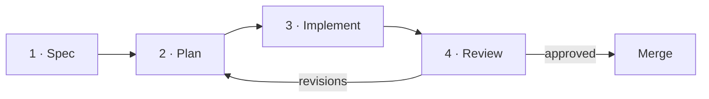
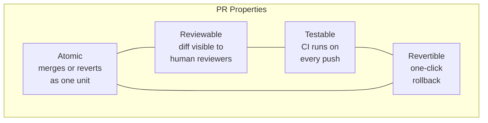
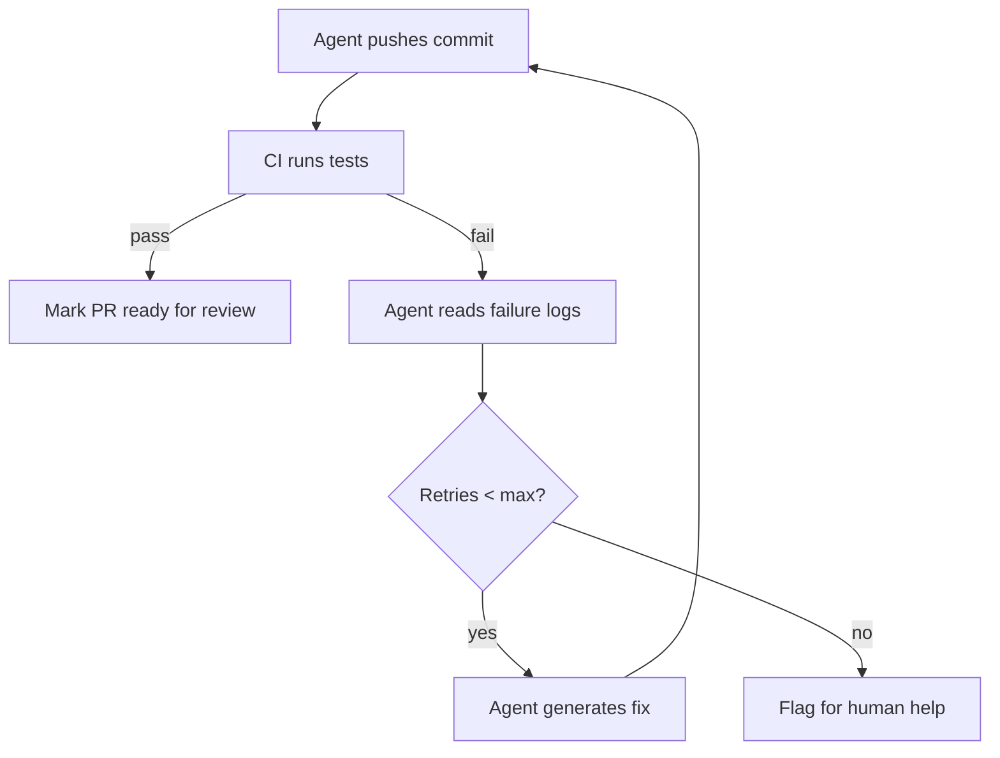

# 6.2 The Copilot Workspace: Agentifying the Pull Request

> **How to read this section**
>
> *Understand now:* Why the pull request is the natural unit of agentic work, and how
> Copilot Workspace turns an issue into a shipped feature through a structured agent pipeline.
>
> *Memorize:* The four-stage workspace pipeline (spec → plan → implement → review) and
> how CI feedback closes the loop.
>
> *Reference later:* The code examples modelling each stage, the review heuristics table,
> and the CI retry pattern.

---

## The problem: from line-level help to feature-level work

Early code-completion tools answered one question: *What token comes next?*
That was useful — but it left the developer responsible for every other part of
the job: reading the issue, deciding which files to touch, writing tests,
opening the pull request, and responding to CI failures.

GitHub's insight was that an agent could own the **entire arc** from issue to
merged PR, not just the keystrokes inside a single file. Copilot Workspace is
the product of that insight. It wraps the same LLM capabilities we studied in
Chapters 4 and 5 inside a **harness** (Section 2.3) that uses the pull request
as its atomic deliverable.

Where Section 6.1 showed how AWS and Azure *contain* agents inside enterprise
guardrails, this section shows how GitHub *integrates* the agent into the
developer workflow itself — making the PR the boundary of trust, review, and
rollback.

---

## Concept Loop 1 — From Autocomplete to Agent

### Concept

Copilot's journey mirrors the broader evolution of coding agents:

| Generation | Unit of output | Human role |
|---|---|---|
| **Copilot v1 (2021)** | Next line / block | Accept or reject suggestion |
| **Copilot Chat (2023)** | Conversational answer | Copy-paste into editor |
| **Copilot Workspace (2024)** | Multi-file PR | Review and merge |

The shift from *line* to *PR* is not merely quantitative — it changes the
human's job from **writing code** to **reviewing intent**. The developer
describes *what* should happen; the agent figures out *how* across potentially
dozens of files.

> **Key idea:** The transition from autocomplete to workspace is a shift in the
> *unit of delegation* — from a single cursor position to an entire feature
> branch.

This evolution relies on every concept we have built so far: tool-calling
(Section 5.1) lets the agent read and write files; orchestration (Section 4.2)
lets it coordinate multiple steps; and the harness pattern (Section 2.3)
keeps the whole process bounded and recoverable.

### Worked example

Imagine you have a simple utility module that provides a `greet` function.
A new issue asks: *"Add a farewell function that mirrors greet."* In the
autocomplete era, a developer would navigate to the file, type `def farewell`,
and wait for inline suggestions. In the workspace era, the agent reads the
issue, locates the module, writes the function, adds a test, and opens a PR —
all in one shot.

### Example 6-6. Modelling the autocomplete-to-agent evolution

```python
"""Example 6-6. Modelling the autocomplete-to-agent evolution.

Shows how the unit of work expands from a single line suggestion
to a full multi-file change set as agents mature.
"""
from dataclasses import dataclass, field
from enum import Enum
from typing import List


class GenerationEra(Enum):
    AUTOCOMPLETE = "autocomplete"
    CHAT = "chat"
    WORKSPACE = "workspace"


@dataclass
class FileChange:
    path: str
    diff_summary: str


@dataclass
class CopilotOutput:
    era: GenerationEra
    description: str
    files_touched: List[FileChange] = field(default_factory=list)

    @property
    def scope(self) -> str:
        n = len(self.files_touched)
        if n == 0:
            return "single cursor position"
        elif n == 1:
            return "single file"
        return f"{n} files (PR-level)"


# --- Simulate each generation ---
autocomplete = CopilotOutput(
    era=GenerationEra.AUTOCOMPLETE,
    description="Suggest next line after 'def farewell('",
)

chat = CopilotOutput(
    era=GenerationEra.CHAT,
    description="Generate farewell() body in chat panel",
    files_touched=[FileChange("utils.py", "+farewell()")],
)

workspace = CopilotOutput(
    era=GenerationEra.WORKSPACE,
    description="Implement farewell feature across codebase",
    files_touched=[
        FileChange("utils.py", "+farewell()"),
        FileChange("tests/test_utils.py", "+test_farewell()"),
        FileChange("README.md", "+farewell docs"),
    ],
)

for output in [autocomplete, chat, workspace]:
    print(f"[{output.era.value:>12}] scope={output.scope:>25}  |  {output.description}")
```

**Expected output:**

```
[autocomplete] scope=   single cursor position  |  Suggest next line after 'def farewell('
[        chat] scope=              single file  |  Generate farewell() body in chat panel
[   workspace] scope=       3 files (PR-level)  |  Implement farewell feature across codebase
```

> **Check yourself:** Why does widening the unit of work from a line to a PR
> require orchestration (Section 4.2) rather than a single LLM call?

---

## Concept Loop 2 — The Workspace Pipeline

### Concept

Copilot Workspace decomposes feature work into a four-stage pipeline:



| Stage | What the agent does | Maps to concept |
|---|---|---|
| **Spec** | Reads the issue, summarises intent, proposes acceptance criteria | Context assembly (Section 4.2) |
| **Plan** | Identifies files to change, outlines diffs | Orchestration (Section 4.2) |
| **Implement** | Writes code, runs tools, produces a branch | Tool-calling (Section 5.1) |
| **Review** | Presents changes for human sign-off | Harness checkpoint (Section 2.3) |

> **Key idea:** Each stage maps directly to an agent-loop primitive we studied
> earlier. The workspace is not a new invention — it is an *assembly* of
> existing patterns inside a developer-facing harness.

> **Tip:** When building your own workspace-like pipeline, keep each stage
> independently retriable. If implementation fails, you should be able to
> re-run it from the plan without regenerating the spec.

### Worked example

Let's model the pipeline as a series of stage transitions. Each stage
transforms an input artifact into an output artifact, and the pipeline tracks
the current state.

### Example 6-7. The workspace pipeline as a state machine

```python
"""Example 6-7. The workspace pipeline as a state machine.

Models the spec -> plan -> implement -> review pipeline
with explicit state transitions and artifact tracking.
"""
from dataclasses import dataclass, field
from enum import Enum, auto
from typing import Dict, Optional


class Stage(Enum):
    SPEC = auto()
    PLAN = auto()
    IMPLEMENT = auto()
    REVIEW = auto()
    MERGED = auto()


TRANSITIONS = {
    Stage.SPEC: Stage.PLAN,
    Stage.PLAN: Stage.IMPLEMENT,
    Stage.IMPLEMENT: Stage.REVIEW,
    Stage.REVIEW: Stage.MERGED,
}


@dataclass
class Pipeline:
    issue_title: str
    current: Stage = Stage.SPEC
    artifacts: Dict[str, str] = field(default_factory=dict)

    def advance(self, artifact_key: str, artifact_value: str) -> None:
        next_stage = TRANSITIONS.get(self.current)
        if next_stage is None:
            raise RuntimeError(f"Cannot advance past {self.current.name}")
        self.artifacts[artifact_key] = artifact_value
        prev = self.current.name
        self.current = next_stage
        print(f"  {prev:>10} -> {self.current.name:<10}  artifact: {artifact_key}")

    def revise(self, back_to: Stage) -> None:
        """Return to an earlier stage (e.g., review sends back to plan)."""
        print(f"  {'REVISE':>10}: {self.current.name} -> {back_to.name}")
        self.current = back_to


# --- Run the pipeline ---
pipe = Pipeline(issue_title="Add farewell() feature")
print(f"Pipeline: {pipe.issue_title}")
print(f"  Starting at: {pipe.current.name}\n")

pipe.advance("spec", "Must add farewell(name) returning 'Goodbye, {name}!'")
pipe.advance("plan", "Edit utils.py, add tests/test_utils.py")
pipe.advance("implementation", "Branch feature/farewell with 2 file changes")

# Reviewer requests changes -> back to plan
pipe.revise(back_to=Stage.PLAN)
pipe.advance("plan_v2", "Also update README.md")
pipe.advance("implementation_v2", "Branch feature/farewell-v2 with 3 file changes")
pipe.advance("approval", "LGTM — merging")

print(f"\nFinal state: {pipe.current.name}")
print(f"Artifacts: {list(pipe.artifacts.keys())}")
```

**Expected output:**

```
Pipeline: Add farewell() feature
  Starting at: SPEC

        SPEC -> PLAN        artifact: spec
        PLAN -> IMPLEMENT   artifact: plan
   IMPLEMENT -> REVIEW      artifact: implementation
      REVISE: REVIEW -> PLAN
        PLAN -> IMPLEMENT   artifact: plan_v2
   IMPLEMENT -> REVIEW      artifact: implementation_v2
      REVIEW -> MERGED      artifact: approval

Final state: MERGED
Artifacts: ['spec', 'plan', 'implementation', 'plan_v2', 'implementation_v2', 'approval']
```

> **Check yourself:** What happens if the implement stage fails (e.g., syntax
> error in generated code)? Which stage should the pipeline return to, and why?

---

## Concept Loop 3 — PR as Unit of Work

### Concept

Why is the pull request the right boundary for agent output? Because a PR is
simultaneously:

- **Atomic** — it either merges or it doesn't; no half-applied features.
- **Reviewable** — every line of change is visible in a diff.
- **Testable** — CI runs against the branch automatically.
- **Revertible** — one click undoes the entire change.

No other artifact in the developer workflow has all four properties. A commit
is atomic but not easily reviewable in isolation. A branch is reviewable but
not inherently testable. The PR sits at the intersection.



> **Key idea:** The pull request is the natural **trust boundary** for agentic
> output. It gives humans a single place to verify intent, correctness, and
> safety before code reaches production.

> **Warning:** An agent can open a PR that *looks* correct in the diff but
> introduces subtle issues — unused imports, hallucinated API calls, or
> tests that assert on the wrong thing. The PR boundary is necessary but
> not sufficient; review discipline is still essential.

> **Pitfall:** Treating the PR as a rubber stamp. If reviewers start
> auto-approving agent PRs because "the agent usually gets it right," you
> lose the safety property entirely.

### Worked example

Let's model a PR as a data structure that enforces the four properties and
provides a status lifecycle.

### Example 6-8. The pull request as the agent's unit of work

```python
"""Example 6-8. The pull request as the agent's unit of work.

Models a PR with the four key properties: atomic, reviewable,
testable, revertible — and a lifecycle from draft to merged.
"""
from dataclasses import dataclass, field
from enum import Enum, auto
from typing import List
import hashlib


class PRStatus(Enum):
    DRAFT = auto()
    OPEN = auto()
    CI_PASSING = auto()
    APPROVED = auto()
    MERGED = auto()
    REVERTED = auto()


@dataclass
class FileDiff:
    path: str
    additions: int
    deletions: int


@dataclass
class PullRequest:
    title: str
    branch: str
    diffs: List[FileDiff] = field(default_factory=list)
    status: PRStatus = PRStatus.DRAFT
    ci_passed: bool = False
    approvals: int = 0

    @property
    def diff_hash(self) -> str:
        """Content hash for atomicity — the PR is one logical unit."""
        content = "".join(f"{d.path}+{d.additions}-{d.deletions}" for d in self.diffs)
        return hashlib.sha256(content.encode()).hexdigest()[:12]

    @property
    def is_reviewable(self) -> bool:
        return len(self.diffs) > 0 and self.status != PRStatus.DRAFT

    @property
    def is_mergeable(self) -> bool:
        return self.ci_passed and self.approvals >= 1

    def open_pr(self) -> None:
        self.status = PRStatus.OPEN
        print(f"  PR opened: '{self.title}' on branch {self.branch}")

    def run_ci(self, passes: bool) -> None:
        self.ci_passed = passes
        self.status = PRStatus.CI_PASSING if passes else PRStatus.OPEN
        print(f"  CI {'PASSED' if passes else 'FAILED'} for {self.diff_hash}")

    def approve(self) -> None:
        self.approvals += 1
        self.status = PRStatus.APPROVED
        print(f"  Approved ({self.approvals} approval(s))")

    def merge(self) -> None:
        if not self.is_mergeable:
            print(f"  BLOCKED: ci_passed={self.ci_passed}, approvals={self.approvals}")
            return
        self.status = PRStatus.MERGED
        print(f"  MERGED: {len(self.diffs)} file(s), hash={self.diff_hash}")

    def revert(self) -> None:
        self.status = PRStatus.REVERTED
        print(f"  REVERTED: '{self.title}' rolled back in one action")


# --- Lifecycle demo ---
pr = PullRequest(
    title="Add farewell() feature",
    branch="feature/farewell",
    diffs=[
        FileDiff("utils.py", additions=15, deletions=0),
        FileDiff("tests/test_utils.py", additions=25, deletions=0),
        FileDiff("README.md", additions=3, deletions=1),
    ],
)

print("=== PR Lifecycle ===")
pr.open_pr()
print(f"  Reviewable: {pr.is_reviewable}")
pr.run_ci(passes=True)
pr.approve()
pr.merge()
print(f"  Final status: {pr.status.name}")

# Demonstrate revert
print("\n=== Revert scenario ===")
pr.revert()
print(f"  Final status: {pr.status.name}")
```

**Expected output:**

```
=== PR Lifecycle ===
  PR opened: 'Add farewell() feature' on branch feature/farewell
  Reviewable: True
  CI PASSED for aeb4fec6487b
  Approved (1 approval(s))
  MERGED: 3 file(s), hash=aeb4fec6487b
  Final status: MERGED

=== Revert scenario ===
  REVERTED: 'Add farewell() feature' rolled back in one action
  Final status: REVERTED
```

> **Check yourself:** Could a *commit* serve as the unit of agentic work
> instead of a PR? What properties would you lose?

---

## Concept Loop 4 — Human-Agent Code Review

### Concept

When an agent writes code, the review process changes. Human reviewers must
shift from asking *"Is this how I would write it?"* to asking *"Does this
faithfully implement the stated intent?"*

Common failure modes in agent-generated PRs:

| Failure mode | What it looks like | How to catch it |
|---|---|---|
| **Intent drift** | Agent solves a related but different problem | Compare PR diff against the original issue |
| **Over-engineering** | Unnecessary abstractions or premature generalization | Check cyclomatic complexity, count new classes |
| **Missing edge cases** | Happy path works, edge cases untested | Look for missing error handling and boundary tests |
| **Hallucinated APIs** | Calls to functions/methods that don't exist | Grep for imports, run type-checker |
| **Shallow tests** | Tests that pass but don't assert meaningful behaviour | Review assertion specificity |

> **Warning:** Agent-generated tests are especially dangerous because they can
> create a false sense of coverage. A test that asserts `result is not None`
> technically passes but proves nothing about correctness.

> **Tip:** Establish a review checklist specific to agent PRs. Include items
> like "Does every new function have at least one negative test?" and "Are
> all imported modules actually used?"

### Worked example

Let's build a simple review-checker that flags common agent-generated code
issues automatically.

### Example 6-9. Automated review heuristics for agent-generated code

```python
"""Example 6-9. Automated review heuristics for agent-generated code.

Scans a simulated agent-generated PR for common failure modes:
intent drift, hallucinated imports, and shallow tests.
"""
from dataclasses import dataclass
from typing import List, Tuple


@dataclass
class ReviewFinding:
    severity: str  # "error", "warning", "info"
    rule: str
    message: str


def check_hallucinated_imports(code: str, available_modules: set) -> List[ReviewFinding]:
    """Flag imports that reference modules not in the project."""
    findings = []
    for line in code.splitlines():
        stripped = line.strip()
        if stripped.startswith("import ") or stripped.startswith("from "):
            tokens = stripped.replace("from ", "").replace("import ", "").split(".")
            module = tokens[0].split()[0]
            if module not in available_modules:
                findings.append(ReviewFinding(
                    severity="error",
                    rule="hallucinated-import",
                    message=f"Module '{module}' not found in project or stdlib",
                ))
    return findings


def check_shallow_tests(test_code: str) -> List[ReviewFinding]:
    """Flag test assertions that are too weak."""
    findings = []
    weak_patterns = ["is not None", "is True", "is False", "!= None"]
    for i, line in enumerate(test_code.splitlines(), 1):
        for pattern in weak_patterns:
            if f"assert" in line and pattern in line:
                findings.append(ReviewFinding(
                    severity="warning",
                    rule="shallow-assertion",
                    message=f"Line {i}: Weak assertion using '{pattern}'",
                ))
    return findings


def check_intent_drift(issue_keywords: set, code: str) -> List[ReviewFinding]:
    """Warn if none of the issue keywords appear in the implementation."""
    code_lower = code.lower()
    matched = {kw for kw in issue_keywords if kw.lower() in code_lower}
    if len(matched) < len(issue_keywords) / 2:
        return [ReviewFinding(
            severity="warning",
            rule="intent-drift",
            message=f"Only {len(matched)}/{len(issue_keywords)} issue keywords found in code",
        )]
    return []


# --- Simulated agent PR ---
agent_code = """
from utils import greet
from magic_helpers import autofix  # does not exist!
import json

def farewell(name: str) -> str:
    return f"Goodbye, {name}!"
"""

agent_tests = """
def test_farewell_returns():
    result = farewell("Alice")
    assert result is not None  # too weak!

def test_farewell_content():
    result = farewell("Bob")
    assert result == "Goodbye, Bob!"
"""

known_modules = {"utils", "json", "os", "sys", "typing", "dataclasses"}
issue_keywords = {"farewell", "goodbye", "name"}

# --- Run checks ---
all_findings: List[Tuple[str, List[ReviewFinding]]] = [
    ("Hallucinated imports", check_hallucinated_imports(agent_code, known_modules)),
    ("Shallow tests", check_shallow_tests(agent_tests)),
    ("Intent drift", check_intent_drift(issue_keywords, agent_code)),
]

print("=== Agent PR Review Report ===\n")
total = 0
for check_name, findings in all_findings:
    print(f"[{check_name}]")
    if not findings:
        print("  No issues found.")
    for f in findings:
        print(f"  {f.severity.upper():>7}: ({f.rule}) {f.message}")
        total += 1
    print()

print(f"Total findings: {total}")
```

**Expected output:**

```
=== Agent PR Review Report ===

[Hallucinated imports]
    ERROR: (hallucinated-import) Module 'magic_helpers' not found in project or stdlib

[Shallow tests]
  WARNING: (shallow-assertion) Line 4: Weak assertion using 'is not None'

[Intent drift]
  No issues found.

Total findings: 2
```

> **Pitfall:** Don't rely solely on automated heuristics. They catch
> surface-level issues but miss semantic bugs like "the function works but
> violates a business rule not stated in the issue."

> **Check yourself:** What additional heuristic would you add to catch
> over-engineering in agent-generated code?

---

## Concept Loop 5 — The CI Feedback Loop

### Concept

The most powerful aspect of PR-based agentic work is the **CI feedback loop**.
When an agent opens a PR:

1. CI runs automatically against the branch.
2. If tests fail, the agent reads the failure logs.
3. The agent generates a fix and pushes a new commit.
4. CI runs again.

This creates a **closed loop** where the agent iterates toward correctness
without human intervention — up to a configurable retry limit.



> **Key idea:** The CI feedback loop transforms the agent from a one-shot code
> generator into an **iterative problem solver**. Each CI failure is a
> learning signal that narrows the solution space.

This is the same feedback-loop principle from Section 2.3 (harness
reliability), now applied at the PR level. The harness pattern — act,
observe, decide, retry — maps directly onto push, CI, read logs, fix.

### Worked example

Let's simulate an agent that pushes code, receives CI results, and iterates
until tests pass or the retry budget is exhausted.

### Example 6-10. CI feedback loop with automatic retry

```python
"""Example 6-10. CI feedback loop with automatic retry.

Simulates an agent that pushes code, reads CI results, and
iterates fixes until tests pass or the retry budget runs out.
"""
from dataclasses import dataclass, field
from typing import List, Optional


@dataclass
class CIResult:
    passed: bool
    failing_test: Optional[str] = None
    error_message: Optional[str] = None


@dataclass
class Commit:
    message: str
    fixes_applied: List[str] = field(default_factory=list)


def simulate_ci(commit: Commit, failing_until_attempt: int, attempt: int) -> CIResult:
    """Simulate CI that fails until a specific attempt number."""
    if attempt < failing_until_attempt:
        return CIResult(
            passed=False,
            failing_test="test_farewell_format",
            error_message=f"AssertionError: expected 'Goodbye, Alice!' got 'Bye, Alice!'",
        )
    return CIResult(passed=True)


def agent_generate_fix(ci_result: CIResult) -> str:
    """Simulate the agent reading CI logs and proposing a fix."""
    if ci_result.failing_test and "farewell_format" in ci_result.failing_test:
        return "Fix: change 'Bye' prefix to 'Goodbye' in farewell()"
    return "Fix: generic correction based on error log"


@dataclass
class CIFeedbackLoop:
    max_retries: int = 3
    commits: List[Commit] = field(default_factory=list)

    def run(self, initial_commit: Commit, failing_until: int = 2) -> bool:
        """Run the push -> CI -> fix loop."""
        current_commit = initial_commit
        self.commits.append(current_commit)

        for attempt in range(1, self.max_retries + 1):
            print(f"\n--- Attempt {attempt}/{self.max_retries} ---")
            print(f"  Push: {current_commit.message}")

            ci = simulate_ci(current_commit, failing_until, attempt)

            if ci.passed:
                print(f"  CI: PASSED")
                print(f"  -> PR marked ready for review")
                return True

            print(f"  CI: FAILED")
            print(f"  Failing test: {ci.failing_test}")
            print(f"  Error: {ci.error_message}")

            if attempt < self.max_retries:
                fix = agent_generate_fix(ci)
                print(f"  Agent fix: {fix}")
                current_commit = Commit(
                    message=f"fix: address CI failure (attempt {attempt})",
                    fixes_applied=[fix],
                )
                self.commits.append(current_commit)
            else:
                print(f"  -> Retry budget exhausted, flagging for human help")

        return False


# --- Run the loop ---
print("=== CI Feedback Loop Simulation ===")
loop = CIFeedbackLoop(max_retries=3)

initial = Commit(message="feat: add farewell() function")
success = loop.run(initial, failing_until=3)

print(f"\nResult: {'SUCCESS' if success else 'NEEDS HUMAN HELP'}")
print(f"Total commits: {len(loop.commits)}")
for i, c in enumerate(loop.commits, 1):
    fixes = f" (fixes: {c.fixes_applied})" if c.fixes_applied else ""
    print(f"  {i}. {c.message}{fixes}")
```

**Expected output:**

```
=== CI Feedback Loop Simulation ===

--- Attempt 1/3 ---
  Push: feat: add farewell() function
  CI: FAILED
  Failing test: test_farewell_format
  Error: AssertionError: expected 'Goodbye, Alice!' got 'Bye, Alice!'
  Agent fix: Fix: change 'Bye' prefix to 'Goodbye' in farewell()

--- Attempt 2/3 ---
  Push: fix: address CI failure (attempt 1)
  CI: FAILED
  Failing test: test_farewell_format
  Error: AssertionError: expected 'Goodbye, Alice!' got 'Bye, Alice!'
  Agent fix: Fix: change 'Bye' prefix to 'Goodbye' in farewell()

--- Attempt 3/3 ---
  Push: fix: address CI failure (attempt 2)
  CI: PASSED
  -> PR marked ready for review

Result: SUCCESS
Total commits: 3
  1. feat: add farewell() function
  2. fix: address CI failure (attempt 1) (fixes: ["Fix: change 'Bye' prefix to 'Goodbye' in farewell()"])
  3. fix: address CI failure (attempt 2) (fixes: ["Fix: change 'Bye' prefix to 'Goodbye' in farewell()"])
```

> **Check yourself:** What is the risk of setting `max_retries` too high? How
> might an agent get stuck in an infinite fix loop even with a retry limit?

---

## What we built

In this section we modelled the complete Copilot Workspace pipeline — from
autocomplete evolution through PR lifecycle to CI-driven iteration. Here is
what each concept loop delivered:

| Loop | Model | Key insight |
|---|---|---|
| 1 — Autocomplete to Agent | `CopilotOutput` | The unit of delegation widened from line to PR |
| 2 — Workspace Pipeline | `Pipeline` state machine | Spec → plan → implement → review with revision |
| 3 — PR as Unit of Work | `PullRequest` lifecycle | PRs are atomic, reviewable, testable, revertible |
| 4 — Human-Agent Review | Review heuristics | Agents introduce new failure modes reviewers must catch |
| 5 — CI Feedback Loop | `CIFeedbackLoop` | CI failures drive iterative agent improvement |

### Verification checklist

- [ ] You can explain why the PR (not a commit or branch) is the right unit
      of agentic work.
- [ ] You can draw the four-stage workspace pipeline from memory.
- [ ] You can list at least three failure modes specific to agent-generated
      code and describe how to detect each.
- [ ] You can describe how the CI feedback loop closes the gap between
      one-shot generation and correct code.
- [ ] You can map each workspace stage to a concept from earlier chapters
      (tool-calling, orchestration, harness).

---

## Wrapping up

Copilot Workspace represents a fundamental shift in how developers interact
with AI assistants. By making the pull request the unit of agentic work,
GitHub aligned the agent's output with the existing review, testing, and
deployment infrastructure that teams already rely on. The workspace pipeline
(spec → plan → implement → review) is not a proprietary invention — it is a
*composition* of the harness, orchestration, and tool-calling patterns we
studied in Parts I and II, packaged into a developer-facing product.

The CI feedback loop is what makes this architecture self-improving: each
failed test run gives the agent a concrete signal to iterate on, turning
a one-shot generator into a bounded problem solver. Combined with human code
review — armed with heuristics for intent drift, hallucinated APIs, and
shallow tests — the system achieves a balance between agent autonomy and
human oversight.

In Section 6.3 we will see how other hyperscalers are pursuing similar
strategies, and compare the trade-offs between GitHub's PR-centric approach
and alternative models of agentic integration.

### Exercises

1. **Pipeline extension.** Add a `TESTING` stage between `IMPLEMENT` and
   `REVIEW` in Example 6-7's state machine. Update the transitions map and
   demonstrate a run where CI fails and the pipeline returns to `IMPLEMENT`.

2. **Review heuristic.** Write a new heuristic function for Example 6-9 that
   detects over-engineering by counting the number of new classes defined in
   agent-generated code and flagging when the count exceeds a threshold.

3. **Retry budget analysis.** Modify Example 6-10 so that each retry
   consumes a cost (e.g., API tokens). Add a `max_cost` budget in addition
   to `max_retries` and stop when either limit is hit. Run simulations with
   different cost-per-retry values and observe how the budget shapes agent
   behaviour.

4. **Real-world mapping.** Pick an open-source project you contribute to.
   Sketch the four workspace stages for a real issue in that project. Which
   stage would be hardest for an agent to get right, and why?
