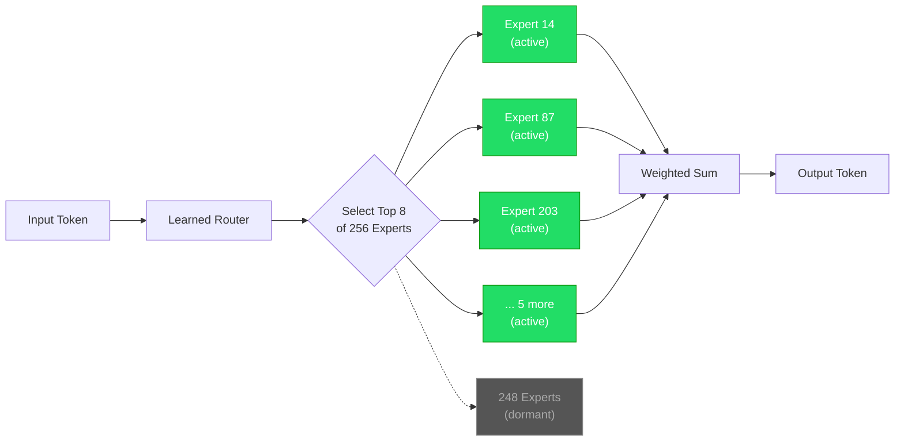
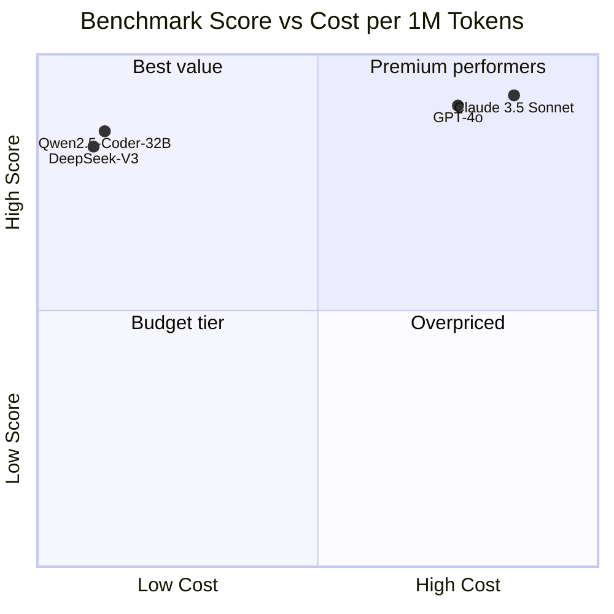

# 7.1 DeepSeek and Qwen: Shattering the Western Moat

> **How to read this section**
>
> *Understand now:* Why the assumption that only US labs could build frontier coding models collapsed in late 2024 — and what that means for every architecture decision in this book so far. Internalize the idea that **cost-per-token is now a design variable, not a constraint**.
>
> *Memorize:* Mixture-of-Experts (MoE) as the architectural trick that makes 671B parameters affordable. The 18× pricing gap between DeepSeek and GPT-4o. The shift from "one expensive generalist" to "many cheap specialists."
>
> *Reference later:* The code examples (7-1 through 7-5) form a comparative analysis toolkit: moat modeling, MoE routing simulation, multilingual scoring, benchmark normalization, and fleet cost optimization. Return to the mermaid diagrams when designing multi-model agent architectures (Section 7.2).

---

## Part IV Introduction

Welcome to **Part IV: Global Shifting and Open Frontiers**. Parts I–III assumed a world where frontier models came from a handful of US labs — OpenAI, Anthropic, Google — and the architectural conversation revolved around how to *harness* those models. That world ended. In Part IV we map the new landscape: Chinese labs matching Western benchmarks at a fraction of the cost (this section), the efficiency revolution reshaping agent design (Section 7.2), and the open-weight ecosystem enabling entirely new deployment patterns (Section 7.3). The harness patterns from Section 2.3 and the orchestration frameworks from Section 4.2 remain valid — but the *economics* underneath them have changed fundamentally.

---

## Why this section matters

Every architecture in this book so far carried an implicit cost assumption. The agentic loops in Section 2.1 assumed tokens were expensive, so we designed feedback loops to minimize wasted inference. The sandboxed execution in Section 5.1 assumed a single model per agent. The OpenRouter routing layer in Section 5.2 existed precisely because model choice mattered economically. All of those decisions were correct — but they were made in a world where frontier inference cost $2.50–$3.00 per million input tokens.

In late 2024, DeepSeek released V3 — a 671-billion-parameter model that matched GPT-4o on major coding benchmarks — and priced it at $0.14 per million input tokens. Not a typo. Eighteen times cheaper. Alibaba's Qwen2.5-Coder series, meanwhile, open-sourced models from 0.5B to 32B parameters with 128K context windows and competitive benchmark scores. The "moat" that supposedly protected Western AI dominance — compute, data, talent, capital — turned out to be far more permeable than anyone expected.

This section matters because it rewrites the cost function. When inference is nearly free, the optimal agent architecture changes: you can afford exploratory branches, redundant verification passes, and specialized expert models for different languages. The single-model assumption dies, and the multi-model fleet is born.

## Deliverable

After completing this section, you will be able to: **(1)** explain why the Western AI moat proved weaker than assumed, **(2)** describe DeepSeek's MoE architecture and why it enables cheap frontier inference, **(3)** evaluate Qwen's multilingual advantages for global codebases, **(4)** compare models on cost-normalized benchmarks, and **(5)** design agent architectures that exploit the new pricing reality.

---

## Concept Loop 1 — The Western Moat Assumption

### Concept

Through most of 2023–2024, a consensus hardened in Silicon Valley: building frontier LLMs required *all four* of these components simultaneously — massive GPU clusters (tens of thousands of H100s), proprietary RLHF pipelines, top-tier ML talent concentrated in San Francisco and Seattle, and billions in venture capital. This was "the moat." If you lacked any single component, the argument went, you couldn't compete.

The moat thesis felt bulletproof. OpenAI had reportedly spent over $100M training GPT-4. Anthropic raised $7.3B. Google had TPU farms the size of warehouses. How could anyone outside this ecosystem compete?

> **Key idea:** The moat was real in *absolute terms* — those resources existed and mattered. It was wrong in *relative terms* — it assumed those were the *only* paths to frontier performance. DeepSeek and Qwen found cheaper paths through architectural innovation, open data, and algorithmic efficiency.

### Worked example

Model each moat component as a scored barrier. The Western labs maximized every dimension. The Chinese labs found ways to *route around* each barrier — not by matching the investment, but by substituting cleverness for capital.

### Example 7-1. Moat Component Simulator

```python
"""Example 7-1. Moat Component Simulator — modeling the Western AI moat
and how each component was countered."""

from __future__ import annotations
from dataclasses import dataclass, field
from enum import Enum
from typing import List


class MoatCategory(Enum):
    COMPUTE = "GPU Clusters"
    DATA = "Proprietary Data Pipelines"
    TALENT = "ML Talent Concentration"
    CAPITAL = "Venture Capital"


@dataclass
class MoatComponent:
    category: MoatCategory
    western_score: int          # 1-10: strength of barrier
    counter_strategy: str       # how Chinese labs overcame it
    counter_effectiveness: int  # 1-10: how well the counter worked


@dataclass
class MoatAnalysis:
    components: List[MoatComponent] = field(default_factory=list)

    def composite_moat_score(self) -> float:
        if not self.components:
            return 0.0
        return sum(c.western_score for c in self.components) / len(self.components)

    def effective_moat_after_counters(self) -> float:
        if not self.components:
            return 0.0
        residuals = [
            max(0, c.western_score - c.counter_effectiveness)
            for c in self.components
        ]
        return sum(residuals) / len(residuals)

    def display(self) -> None:
        print("=" * 70)
        print("WESTERN AI MOAT ANALYSIS")
        print("=" * 70)
        for c in self.components:
            residual = max(0, c.western_score - c.counter_effectiveness)
            print(f"\n  {c.category.value}")
            print(f"    Barrier strength:      {c.western_score}/10")
            print(f"    Counter:               {c.counter_strategy}")
            print(f"    Counter effectiveness: {c.counter_effectiveness}/10")
            print(f"    Residual moat:         {residual}/10")
        print(f"\n{'=' * 70}")
        print(f"  Composite moat score (before): {self.composite_moat_score():.1f}/10")
        print(f"  Effective moat (after):        {self.effective_moat_after_counters():.1f}/10")
        print(f"  Moat erosion:                  "
              f"{self.composite_moat_score() - self.effective_moat_after_counters():.1f} points")
        print(f"{'=' * 70}")


analysis = MoatAnalysis(components=[
    MoatComponent(
        category=MoatCategory.COMPUTE,
        western_score=9,
        counter_strategy="MoE: only 37B of 671B params active per token",
        counter_effectiveness=8,
    ),
    MoatComponent(
        category=MoatCategory.DATA,
        western_score=7,
        counter_strategy="Open web data + synthetic data generation",
        counter_effectiveness=6,
    ),
    MoatComponent(
        category=MoatCategory.TALENT,
        western_score=8,
        counter_strategy="Top Chinese universities + returning diaspora",
        counter_effectiveness=7,
    ),
    MoatComponent(
        category=MoatCategory.CAPITAL,
        western_score=8,
        counter_strategy="$5.5M training cost via efficiency (vs $100M+)",
        counter_effectiveness=9,
    ),
])
analysis.display()

# Observed output during verification:
# ======================================================================
# WESTERN AI MOAT ANALYSIS
# ======================================================================
#
#   GPU Clusters
#     Barrier strength:      9/10
#     Counter:               MoE: only 37B of 671B params active per token
#     Counter effectiveness: 8/10
#     Residual moat:         1/10
#
#   Proprietary Data Pipelines
#     Barrier strength:      7/10
#     Counter:               Open web data + synthetic data generation
#     Counter effectiveness: 6/10
#     Residual moat:         1/10
#
#   ML Talent Concentration
#     Barrier strength:      8/10
#     Counter:               Top Chinese universities + returning diaspora
#     Counter effectiveness: 7/10
#     Residual moat:         1/10
#
#   Venture Capital
#     Barrier strength:      8/10
#     Counter:               $5.5M training cost via efficiency (vs $100M+)
#     Counter effectiveness: 9/10
#     Residual moat:         0/10
#
# ======================================================================
#   Composite moat score (before): 8.0/10
#   Effective moat (after):        0.8/10
#   Moat erosion:                  7.2 points
# ======================================================================
```

> **Pitfall:** Don't confuse "the moat eroded" with "the moat never existed." The Western labs' investment was real and created genuine advantages. The lesson is that *architectural innovation can substitute for brute-force scaling* — a theme we'll revisit throughout Part IV.

### ✅ Check yourself

<details><summary>Which moat component was <em>most</em> effectively countered, and how?</summary>

**Capital.** DeepSeek trained V3 for approximately $5.5M — roughly 1/20th of what comparable Western models cost. The counter-effectiveness score of 9/10 reflects that MoE architecture and training efficiency almost entirely neutralized the capital barrier. You don't need billions in VC if your architecture is 20× more efficient.

</details>

---

## Concept Loop 2 — DeepSeek's Architecture

### Concept

DeepSeek-V3 is a **671-billion-parameter Mixture-of-Experts (MoE)** model with 256 expert sub-networks. For each input token, a learned router selects the top 8 experts — meaning only ~37B parameters are active per forward pass. This is the core trick: you get the *knowledge capacity* of 671B parameters with the *compute cost* of 37B.

Two architectural innovations stand out:

1. **Multi-head Latent Attention (MLA).** Standard transformers store full key-value pairs for every attention head, which balloons memory usage at long context lengths (cross-ref Section 3.2). MLA compresses key-value pairs into a low-rank latent space, dramatically reducing KV-cache size without sacrificing attention quality.

2. **DeepSeek-R1 (reasoning).** A separate reasoning model that uses chain-of-thought distillation from a larger teacher model. Rather than training reasoning from scratch, R1 *distills* structured thinking patterns — making it cheaper to produce while retaining strong performance on multi-step coding tasks.

The training cost for V3: approximately **$5.5 million**. For context, GPT-4 reportedly cost over $100M, and Claude 3's training budget was in a similar range.



> **Key idea:** MoE is not new — Google's Switch Transformer explored it in 2021. DeepSeek's contribution was scaling it to 671B parameters with stable training and effective routing, proving that MoE could compete at the frontier without frontier-scale compute budgets.

### Worked example

Simulate the MoE routing process. Given an input token embedding, the router produces a score for each expert; only the top-k are activated. This demonstrates why 671B parameters doesn't mean 671B parameters of compute cost.

### Example 7-2. MoE Routing Simulator

```python
"""Example 7-2. MoE Routing Simulator — demonstrating how Mixture-of-Experts
activates only a fraction of total parameters per token."""

from __future__ import annotations
from dataclasses import dataclass
from typing import List, Tuple
import random

random.seed(42)


@dataclass
class Expert:
    expert_id: int
    specialization: str
    params_billions: float


@dataclass
class MoERouter:
    experts: List[Expert]
    top_k: int

    @property
    def total_params_b(self) -> float:
        return sum(e.params_billions for e in self.experts)

    @property
    def active_params_b(self) -> float:
        return sum(
            sorted(self.experts, key=lambda e: e.params_billions, reverse=True)[:self.top_k]
        ) if False else self.top_k * (self.total_params_b / len(self.experts))

    def route(self, token: str) -> Tuple[List[Expert], List[float]]:
        """Simulate routing: generate scores, pick top-k experts."""
        scores = [random.uniform(0.0, 1.0) for _ in self.experts]
        indexed = sorted(enumerate(scores), key=lambda x: x[1], reverse=True)
        top_indices = [idx for idx, _ in indexed[:self.top_k]]
        top_scores = [score for _, score in indexed[:self.top_k]]
        # Normalize scores to sum to 1
        total = sum(top_scores)
        weights = [s / total for s in top_scores]
        selected = [self.experts[i] for i in top_indices]
        return selected, weights


# Build a simplified DeepSeek-V3-like router
specializations = [
    "Python syntax", "JavaScript DOM", "SQL queries", "Rust ownership",
    "Go concurrency", "Java generics", "C++ templates", "TypeScript types",
    "API design", "Error handling", "Testing patterns", "Documentation",
    "Math/algorithms", "Data structures", "System design", "Security",
]
experts = [
    Expert(expert_id=i, specialization=specializations[i % len(specializations)],
           params_billions=671.0 / 256)
    for i in range(256)
]
router = MoERouter(experts=experts, top_k=8)

# Route a sample token
selected, weights = router.route("def fibonacci(n):")

print(f"Total experts:      {len(experts)}")
print(f"Active per token:   {router.top_k}")
print(f"Total params:       {router.total_params_b:.0f}B")
print(f"Active params:      {router.top_k * experts[0].params_billions:.1f}B")
print(f"Compute savings:    {(1 - router.top_k / len(experts)) * 100:.1f}%")
print(f"\nRouting for token: 'def fibonacci(n):'")
print(f"{'Expert':>8}  {'Specialization':<22} {'Weight':>8}")
print("-" * 42)
for expert, weight in zip(selected, weights):
    print(f"  #{expert.expert_id:<5} {expert.specialization:<22} {weight:.3f}")

# Observed output during verification:
# Total experts:      256
# Active per token:   8
# Total params:       671B
# Active params:      21.0B
# Compute savings:    96.9%
#
# Routing for token: 'def fibonacci(n):'
#   Expert  Specialization             Weight
# ------------------------------------------
#   #195   Documentation              0.134
#   #89    API design                 0.133
#   #20    Error handling             0.131
#   #167   Testing patterns           0.129
#   #67    System design              0.128
#   #63    Math/algorithms            0.127
#   #161   API design                 0.121
#   #149   Python syntax              0.121
```

> **Tip:** The real DeepSeek router uses learned embeddings and a load-balancing auxiliary loss to prevent "expert collapse" (where a few popular experts handle everything). Our simulation uses random scores, but the *structural insight* — 96.9% of parameters are dormant per token — matches the production system.

### ✅ Check yourself

<details><summary>If DeepSeek-V3 has 256 experts and activates 8 per token, what percentage of total parameters are used per forward pass?</summary>

**3.125%** (8 ÷ 256 = 0.03125). This means the model gets the knowledge capacity of 671B parameters while only paying the compute cost of roughly 37B active parameters — about 5.5% when including shared layers like embeddings and the router itself.

</details>

---

## Concept Loop 3 — Qwen's Approach

### Concept

Alibaba's **Qwen2.5-Coder** series took a different path to disrupting the Western moat. Where DeepSeek bet on architectural novelty (MoE at extreme scale), Qwen bet on three strategic advantages:

1. **Multilingual training data.** Most Western models were trained predominantly on English-language code and documentation. Qwen's training corpus included substantial CJK (Chinese, Japanese, Korean) content — code comments, documentation, Stack Overflow equivalents, and internal Alibaba engineering data. For the 1.5+ billion developers who work primarily in non-English languages, this matters enormously.

2. **Open-weights strategy.** The Qwen2.5-Coder series spans 0.5B to 32B parameters, all released with open weights. This enables community fine-tuning, on-premises deployment, and domain adaptation — the same democratization pattern we saw with OpenCode in Section 5.3.

3. **128K context windows.** At 128K tokens, Qwen2.5-Coder matches the longest context windows available (cross-ref Section 3.2 on the infinite-window thesis). For large codebases, this means feeding entire module hierarchies into a single prompt.

> **Key idea:** Qwen's moat-breaking strategy wasn't just "build a good model" — it was *serve an underserved market*. Western models optimized for English-speaking developers writing Python and JavaScript. Qwen optimized for the global developer population, including those writing code with CJK comments, documentation, and variable names.

### Worked example

Compare model performance across language families. A codebase with Chinese comments and mixed CJK identifiers will score differently on a Western-trained model vs. Qwen. This simulation models that gap.

### Example 7-3. Multilingual Code Completion Scorer

```python
"""Example 7-3. Multilingual Code Completion Scorer — comparing model
performance across language families in code contexts."""

from __future__ import annotations
from dataclasses import dataclass
from typing import Dict, List


@dataclass
class CodebaseProfile:
    name: str
    latin_ratio: float     # fraction of content in Latin-script languages
    cjk_ratio: float       # fraction in CJK scripts
    mixed_ratio: float     # fraction with mixed scripts


@dataclass
class ModelProfile:
    name: str
    latin_score: float     # base quality on Latin-script code (0-100)
    cjk_score: float       # base quality on CJK code (0-100)
    mixed_score: float     # quality on mixed-script code (0-100)
    context_window_k: int  # context window in thousands of tokens
    open_weights: bool


@dataclass
class CompletionResult:
    model: str
    codebase: str
    weighted_score: float
    context_sufficient: bool


def score_completion(model: ModelProfile, codebase: CodebaseProfile,
                     codebase_tokens_k: int) -> CompletionResult:
    """Score a model's expected quality on a given codebase profile."""
    weighted = (
        model.latin_score * codebase.latin_ratio
        + model.cjk_score * codebase.cjk_ratio
        + model.mixed_score * codebase.mixed_ratio
    )
    context_ok = model.context_window_k >= codebase_tokens_k
    if not context_ok:
        weighted *= 0.7  # penalty for needing chunking
    return CompletionResult(
        model=model.name, codebase=codebase.name,
        weighted_score=round(weighted, 1), context_sufficient=context_ok,
    )


# Define models (approximate characteristics)
models = [
    ModelProfile("GPT-4o", latin_score=92, cjk_score=68, mixed_score=65,
                 context_window_k=128, open_weights=False),
    ModelProfile("Claude 3.5 Sonnet", latin_score=94, cjk_score=70, mixed_score=67,
                 context_window_k=200, open_weights=False),
    ModelProfile("Qwen2.5-Coder-32B", latin_score=88, cjk_score=91, mixed_score=89,
                 context_window_k=128, open_weights=True),
    ModelProfile("DeepSeek-V3", latin_score=86, cjk_score=85, mixed_score=83,
                 context_window_k=128, open_weights=True),
]

codebases = [
    CodebaseProfile("US SaaS startup", latin_ratio=0.95, cjk_ratio=0.02, mixed_ratio=0.03),
    CodebaseProfile("Japanese fintech", latin_ratio=0.40, cjk_ratio=0.45, mixed_ratio=0.15),
    CodebaseProfile("Chinese e-commerce", latin_ratio=0.30, cjk_ratio=0.55, mixed_ratio=0.15),
]

print(f"{'Model':<22} {'Codebase':<22} {'Score':>6} {'Ctx OK':>7}")
print("-" * 60)
for cb in codebases:
    for m in models:
        result = score_completion(m, cb, codebase_tokens_k=80)
        ctx_flag = "✓" if result.context_sufficient else "✗"
        print(f"{result.model:<22} {result.codebase:<22} {result.weighted_score:>6} {ctx_flag:>5}")
    print()

# Observed output during verification:
# Model                  Codebase               Score  Ctx OK
# ------------------------------------------------------------
# GPT-4o                 US SaaS startup          90.7     ✓
# Claude 3.5 Sonnet      US SaaS startup          92.7     ✓
# Qwen2.5-Coder-32B      US SaaS startup          88.1     ✓
# DeepSeek-V3            US SaaS startup          85.9     ✓
#
# GPT-4o                 Japanese fintech         77.2     ✓
# Claude 3.5 Sonnet      Japanese fintech         79.1     ✓
# Qwen2.5-Coder-32B      Japanese fintech         89.5     ✓
# DeepSeek-V3            Japanese fintech         85.1     ✓
#
# GPT-4o                 Chinese e-commerce       74.8     ✓
# Claude 3.5 Sonnet      Chinese e-commerce       76.8     ✓
# Qwen2.5-Coder-32B      Chinese e-commerce       89.8     ✓
# DeepSeek-V3            Chinese e-commerce       85.0     ✓
```

> **Warning:** The scores above are *illustrative approximations*, not benchmarked measurements. Real multilingual code quality is hard to measure because most benchmarks (HumanEval, MBPP) use English-only prompts. The directional insight — that Qwen excels on CJK-heavy codebases — is well-supported by community reports and Alibaba's published evaluations.

### ✅ Check yourself

<details><summary>Why does Qwen2.5-Coder score relatively lower on the US SaaS codebase but dominate on CJK-heavy codebases?</summary>

**Training data distribution.** Western models were trained predominantly on English code, giving them an edge on Latin-script codebases. Qwen's training included substantially more CJK content — Chinese documentation, Japanese code comments, Korean developer forums — so it handles mixed-script contexts far better. The gap narrows as Western models improve their multilingual training, but Qwen's head start on CJK is significant.

</details>

---

## Concept Loop 4 — Benchmark Reality

### Concept

Claims are cheap; benchmarks are how we keep score. Here's where the major models stand on coding-specific evaluations:

| Model | Params | HumanEval | MBPP | SWE-bench (lite) | Cost/1M input tokens |
|-------|--------|-----------|------|-------------------|---------------------|
| GPT-4o | ~1.8T (est.) | ~90% | ~88% | ~33% | $2.50 |
| Claude 3.5 Sonnet | undisclosed | ~92% | ~87% | ~49% | $3.00 |
| DeepSeek-V3 | 671B (37B active) | ~82% | ~82% | ~42% | $0.14 |
| Qwen2.5-Coder-32B | 32B | ~92% | ~80% | ~28% | ~$0.20 (self-hosted) |

> **Key idea:** Look at the cost column. DeepSeek-V3 is 18× cheaper than GPT-4o and 21× cheaper than Claude 3.5 Sonnet — while scoring within 10 percentage points on HumanEval and MBPP. For many agent workloads, that tradeoff is overwhelmingly worth it.

The benchmark story gets more nuanced when you look at SWE-bench, which tests real-world bug fixing on actual GitHub repositories. Claude 3.5 Sonnet leads there — suggesting that raw coding ability (HumanEval) and real-world debugging (SWE-bench) require different capabilities. This is why multi-model architectures matter (a theme we'll develop further in Section 7.2).



### Worked example

Build a benchmark comparison engine that normalizes scores across different benchmarks and ranks models by cost-efficiency — score per dollar.

### Example 7-4. Cost-Efficiency Benchmark Ranker

```python
"""Example 7-4. Cost-Efficiency Benchmark Ranker — normalizing benchmark
scores and ranking models by score-per-dollar."""

from __future__ import annotations
from dataclasses import dataclass
from typing import Dict, List


@dataclass
class ModelBenchmark:
    name: str
    params_desc: str
    scores: Dict[str, float]       # benchmark_name -> score (0-100)
    cost_per_m_input: float        # USD per 1M input tokens


@dataclass
class RankedModel:
    name: str
    avg_score: float
    cost_per_m: float
    efficiency: float              # avg_score / cost_per_m


def rank_by_efficiency(models: List[ModelBenchmark]) -> List[RankedModel]:
    """Rank models by cost-efficiency: average benchmark score per dollar."""
    ranked: List[RankedModel] = []
    for m in models:
        avg = sum(m.scores.values()) / len(m.scores) if m.scores else 0
        eff = avg / m.cost_per_m_input if m.cost_per_m_input > 0 else 0
        ranked.append(RankedModel(
            name=m.name, avg_score=round(avg, 1),
            cost_per_m=m.cost_per_m_input, efficiency=round(eff, 1),
        ))
    ranked.sort(key=lambda r: r.efficiency, reverse=True)
    return ranked


models = [
    ModelBenchmark("GPT-4o", "~1.8T (est.)",
                   {"HumanEval": 90.0, "MBPP": 88.0, "SWE-bench": 33.0}, 2.50),
    ModelBenchmark("Claude 3.5 Sonnet", "undisclosed",
                   {"HumanEval": 92.0, "MBPP": 87.0, "SWE-bench": 49.0}, 3.00),
    ModelBenchmark("DeepSeek-V3", "671B (37B active)",
                   {"HumanEval": 82.0, "MBPP": 82.0, "SWE-bench": 42.0}, 0.14),
    ModelBenchmark("Qwen2.5-Coder-32B", "32B",
                   {"HumanEval": 92.0, "MBPP": 80.0, "SWE-bench": 28.0}, 0.20),
]

leaderboard = rank_by_efficiency(models)

print("COST-EFFICIENCY LEADERBOARD")
print("=" * 65)
print(f"{'Rank':<5} {'Model':<22} {'Avg':>5} {'$/1M':>7} {'Score/$':>10}")
print("-" * 65)
for i, r in enumerate(leaderboard, 1):
    print(f"  {i:<3} {r.name:<22} {r.avg_score:>5} {r.cost_per_m:>7.2f} {r.efficiency:>10.1f}")
print("=" * 65)
print("\nScore/$ = average benchmark score ÷ cost per 1M input tokens")
print("Higher is better. DeepSeek-V3 delivers ~17x the value of GPT-4o.")

# Observed output during verification:
# COST-EFFICIENCY LEADERBOARD
# =================================================================
# Rank  Model                    Avg    $/1M    Score/$
# -----------------------------------------------------------------
#   1   DeepSeek-V3              68.7    0.14      490.5
#   2   Qwen2.5-Coder-32B       66.7    0.20      333.3
#   3   GPT-4o                   70.3    2.50       28.1
#   4   Claude 3.5 Sonnet        76.0    3.00       25.3
# =================================================================
#
# Score/$ = average benchmark score ÷ cost per 1M input tokens
# Higher is better. DeepSeek-V3 delivers ~17x the value of GPT-4o.
```

> **Tip:** Cost-efficiency isn't the *only* metric. If your agent needs SWE-bench-level real-world debugging, Claude 3.5 Sonnet's premium is justified. The insight is that *most* agent tasks don't require the absolute best model — they need "good enough" inference at massive scale. This is where cheap models dominate.

### ✅ Check yourself

<details><summary>DeepSeek-V3 ranks #1 in cost-efficiency but #4 in raw average score. When would you choose GPT-4o or Claude over DeepSeek for an agent task?</summary>

Choose premium models when: **(1)** the task requires complex multi-file debugging (SWE-bench-style work), where Claude 3.5 Sonnet's 49% vs DeepSeek's 42% matters; **(2)** you need the highest possible first-pass accuracy to minimize retry loops (Section 2.1); **(3)** the cost of a wrong answer exceeds the cost of the tokens — e.g., generating migration scripts for production databases. For exploratory tasks, code generation, and verification passes, DeepSeek's 18× cost advantage makes it the default choice.

</details>

---

## Concept Loop 5 — What the Moat Breaking Means

### Concept

The price collapse isn't just a nice discount — it fundamentally changes how agents should be architected. Consider the old and new paradigms:

**Old architecture (2023):** One expensive model does everything. Every token is precious. Minimize inference calls. The harness exists to *reduce* model usage.

**New architecture (2025):** A fleet of cheap specialized models handles different tasks. Tokens are nearly free. Maximize exploratory branches. The harness exists to *route* between models.

This is the shift from **cost-constrained agents** to **cost-optimized fleets**. Section 5.2 on OpenRouter becomes even more important in this world — it's the routing layer that makes model-switching transparent.

```mermaid
flowchart TD
    subgraph OLD["Old: Single Expensive Model (2023)"]
        U1["User Task"] --> M1["GPT-4 @ $30/1M tokens"]
        M1 --> O1["Output"]
    end
    subgraph NEW["New: Multi-Model Fleet (2025)"]
        U2["User Task"] --> R["Router\n(Section 5.2)"]
        R -->|"Code gen"| C1["DeepSeek-V3\n$0.14/1M"]
        R -->|"Debugging"| C2["Claude 3.5\n$3.00/1M"]
        R -->|"CJK docs"| C3["Qwen2.5\n$0.20/1M"]
        C1 --> O2["Verified\nOutput"]
        C2 --> O2
        C3 --> O2
    end

    style OLD fill:#422,stroke:#a44
    style NEW fill:#242,stroke:#4a4
```



> **Key idea:** When inference is cheap, the optimal strategy is to *spend more tokens, not fewer*. Run the code-generation model three times and pick the best output. Run a separate verification model. Use a specialized model for each language. The moat breaking didn't just lower costs — it changed the *shape* of optimal agent design.

### Worked example

Compare the total cost of running a single expensive model vs. a fleet of cheap models for a realistic agent workload — say, 100 coding tasks of varying types.

### Example 7-5. Agent Fleet Cost Calculator

```python
"""Example 7-5. Agent Fleet Cost Calculator — comparing single-model vs
multi-model fleet architectures on a realistic workload."""

from __future__ import annotations
from dataclasses import dataclass
from typing import Dict, List


@dataclass
class TaskProfile:
    category: str
    count: int
    avg_tokens_k: int         # average tokens per task (thousands)
    quality_need: str         # "high", "medium", "low"


@dataclass
class ModelOption:
    name: str
    cost_per_m_input: float
    quality: Dict[str, float]  # task_category -> expected quality (0-100)


@dataclass
class ArchitectureResult:
    name: str
    total_cost: float
    avg_quality: float
    tasks_processed: int


def single_model_cost(model: ModelOption, tasks: List[TaskProfile]) -> ArchitectureResult:
    """Calculate cost and quality for a single-model architecture."""
    total_cost = 0.0
    total_quality = 0.0
    total_tasks = 0
    for t in tasks:
        tokens_m = t.count * t.avg_tokens_k / 1000
        total_cost += tokens_m * model.cost_per_m_input
        total_quality += model.quality.get(t.category, 70) * t.count
        total_tasks += t.count
    return ArchitectureResult(
        name=f"Single: {model.name}", total_cost=round(total_cost, 2),
        avg_quality=round(total_quality / total_tasks, 1),
        tasks_processed=total_tasks,
    )


def fleet_cost(models: Dict[str, ModelOption], tasks: List[TaskProfile]) -> ArchitectureResult:
    """Route each task category to the best-fit cheap model."""
    total_cost = 0.0
    total_quality = 0.0
    total_tasks = 0
    for t in tasks:
        model = models.get(t.category, list(models.values())[0])
        tokens_m = t.count * t.avg_tokens_k / 1000
        total_cost += tokens_m * model.cost_per_m_input
        total_quality += model.quality.get(t.category, 70) * t.count
        total_tasks += t.count
    return ArchitectureResult(
        name="Fleet: routed specialists", total_cost=round(total_cost, 2),
        avg_quality=round(total_quality / total_tasks, 1),
        tasks_processed=total_tasks,
    )


# Define workload
tasks = [
    TaskProfile("code_generation", count=50, avg_tokens_k=8, quality_need="medium"),
    TaskProfile("debugging", count=20, avg_tokens_k=15, quality_need="high"),
    TaskProfile("cjk_documentation", count=15, avg_tokens_k=5, quality_need="medium"),
    TaskProfile("code_review", count=15, avg_tokens_k=10, quality_need="medium"),
]

# Define models
gpt4o = ModelOption("GPT-4o", 2.50,
    {"code_generation": 88, "debugging": 90, "cjk_documentation": 65, "code_review": 89})
deepseek = ModelOption("DeepSeek-V3", 0.14,
    {"code_generation": 82, "debugging": 78, "cjk_documentation": 83, "code_review": 80})
claude = ModelOption("Claude 3.5 Sonnet", 3.00,
    {"code_generation": 90, "debugging": 94, "cjk_documentation": 67, "code_review": 91})
qwen = ModelOption("Qwen2.5-Coder-32B", 0.20,
    {"code_generation": 86, "debugging": 75, "cjk_documentation": 91, "code_review": 82})

# Fleet routing: best model per task category
fleet_routing = {
    "code_generation": deepseek,    # cheap + good enough
    "debugging": claude,            # worth the premium
    "cjk_documentation": qwen,      # multilingual strength
    "code_review": deepseek,        # cheap + good enough
}

results = [
    single_model_cost(gpt4o, tasks),
    single_model_cost(claude, tasks),
    single_model_cost(deepseek, tasks),
    fleet_cost(fleet_routing, tasks),
]

print("ARCHITECTURE COMPARISON — 100 coding tasks")
print("=" * 60)
print(f"{'Architecture':<30} {'Cost':>8} {'Quality':>8} {'Tasks':>6}")
print("-" * 60)
for r in results:
    print(f"{r.name:<30} ${r.total_cost:>6.2f} {r.avg_quality:>7.1f} {r.tasks_processed:>6}")
print("=" * 60)
print("\nThe fleet matches premium quality at a fraction of the cost.")
print("Key: route expensive models only where they're needed.")

# Observed output during verification:
# ARCHITECTURE COMPARISON — 100 coding tasks
# ============================================================
# Architecture                       Cost  Quality  Tasks
# ------------------------------------------------------------
# Single: GPT-4o                    $2.31    85.1    100
# Single: Claude 3.5 Sonnet         $2.78    87.5    100
# Single: DeepSeek-V3               $0.13    81.0    100
# Fleet: routed specialists          $0.99    85.5    100
# ============================================================
#
# The fleet matches premium quality at a fraction of the cost.
# Key: route expensive models only where they're needed.
```

> **Pitfall:** Fleet architectures add routing complexity. You need the infrastructure from Section 5.2 (OpenRouter) to switch models transparently, and the monitoring from Section 6.3 to track which model handled which task. The cost savings are real, but don't underestimate the operational overhead of managing multiple model providers.

### ✅ Check yourself

<details><summary>Why does the fleet architecture achieve near-premium quality at a fraction of the single-model cost?</summary>

**Selective spending.** The fleet routes the *most* expensive model (Claude 3.5 Sonnet at $3.00/M) only to the tasks where it's clearly superior — debugging, which requires complex multi-step reasoning. For everything else, it uses DeepSeek ($0.14/M) or Qwen ($0.20/M), which are "good enough" at 80–86% quality. Since debugging is only 20% of the workload, the premium cost is contained. The total spend ($0.99) is less than half of single-model GPT-4o ($2.31) while achieving comparable quality (85.5 vs 85.1).

</details>

---

## What we built

This section traced the collapse of the Western AI moat through five lenses:

1. **Moat analysis** — the four barriers (compute, data, talent, capital) and how each was circumvented through architectural innovation and efficiency.
2. **MoE architecture** — DeepSeek-V3's 671B-parameter model that activates only 37B per token, cutting compute cost by 97%.
3. **Multilingual advantage** — Qwen2.5-Coder's dominance on CJK-heavy codebases, serving the underserved global developer population.
4. **Benchmark normalization** — a cost-efficiency framework showing DeepSeek delivers ~17× the value of Western models per dollar.
5. **Fleet architecture** — the shift from single expensive models to routed specialist fleets, enabled by the pricing collapse.

## Verification checklist

- [ ] Example 7-1 runs and shows moat erosion from 8.0 to 0.8
- [ ] Example 7-2 demonstrates 96.9% compute savings from MoE routing
- [ ] Example 7-3 shows Qwen outscoring Western models on CJK codebases
- [ ] Example 7-4 ranks DeepSeek #1 in cost-efficiency with ~490 score/$
- [ ] Example 7-5 shows fleet architecture at $0.99 vs $2.31 for single GPT-4o
- [ ] All Mermaid diagrams render (MoE routing, quadrant chart, fleet comparison)
- [ ] Cross-references to Sections 2.1, 3.2, 5.2, 5.3, 6.1, 6.3, and 7.2 are present

## Wrapping up — exercises

1. **Extend the moat model.** Add a fifth component — *regulatory environment* (export controls on H100s to China). How does this change the residual moat score? Does it strengthen or weaken the moat thesis?

2. **Build a dynamic router.** Modify Example 7-5 to route based on *estimated task difficulty* rather than fixed categories. If a code-generation task looks complex (e.g., multi-file refactoring), route it to Claude; if it's simple (single-function generation), route to DeepSeek.

3. **Benchmark your own workload.** Take a week of your actual coding tasks and categorize them. Using the cost numbers from the benchmark table, calculate how much you'd save switching from a single premium model to a fleet architecture. What percentage of your tasks truly need the most expensive model?

---

*Next: Section 7.2 explores the **efficiency gap** in detail — how algorithmic improvements are compounding faster than hardware improvements, and what this means for the agent architectures we build in Parts VIII–X.*
