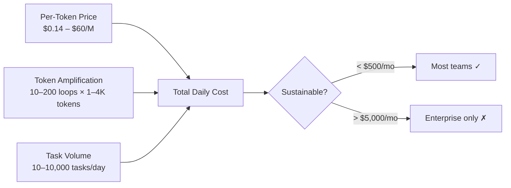
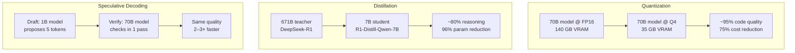
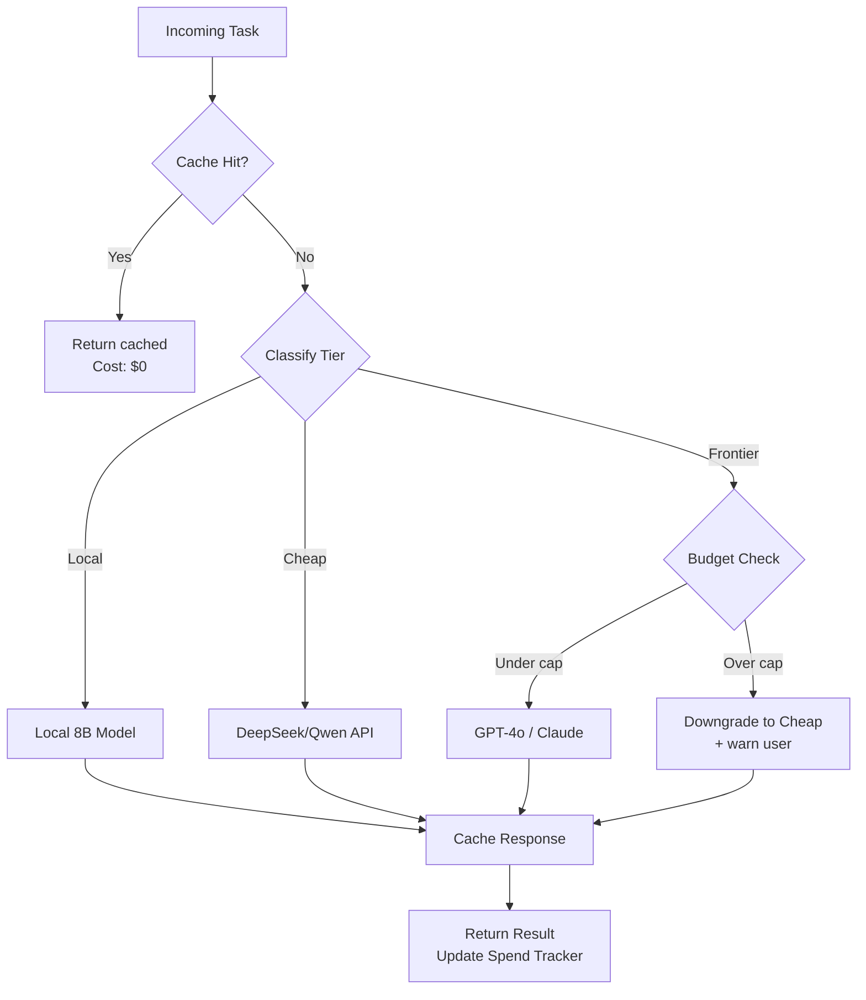

# 7.2 The Efficiency Gap: High-Performance Coding on a Budget

> **How to read this section**
>
> *Understand now:* Why the cost of frontier models locks out most developers — and how efficiency techniques (quantization, distillation, speculative decoding) close the gap by 10–50×. The core insight: **most coding tasks don't need a $60/M-token model**.
>
> *Memorize:* The 80/20 rule for agent tasks — 80% of coding work can be handled by models costing under $0.50/M tokens. The three pillars of budget-aware design: cost caps, tiered routing, and response caching.
>
> *Reference later:* Examples 7-6 through 7-10 form a budget-optimization toolkit: cost modeling, quantization impact simulation, task-tier routing, cache-hit analysis, and a complete budget-aware agent harness. Return to the mermaid diagrams when designing cost-efficient agent fleets. Cross-reference Section 5.2 (OpenRouter economics), Section 7.1 (DeepSeek/Qwen pricing), and Section 2.3 (budget caps in agentic loops).

---

## Why this section matters

Section 7.1 showed that Chinese labs shattered the pricing floor for frontier inference. But even at $0.14/M tokens, an agent running 200 loops per task burns through budgets fast. The real question isn't *"which model is cheapest?"* — it's *"how do I build agents that deliver production-quality code without bankrupting my team?"*

Consider the math. A frontier model at $15/M output tokens, running a 50-loop agentic task averaging 2,000 tokens per response, costs **$1.50 per task**. Run that 1,000 times a day across a team and you're spending $45,000/month on inference alone. A quantized 8B model running locally costs electricity — maybe $0.002 per task. That's a 750× difference.

This section teaches you to think about model selection as an engineering decision, not a brand loyalty choice. The techniques here — quantization, distillation, speculative decoding, tiered routing, and caching — are the tools that make agentic coding accessible to solo developers, startups, and teams in regions where cloud API budgets are measured in tens of dollars, not thousands.

> **Key idea:** The efficiency gap isn't about settling for worse results. It's about matching model capability to task complexity — and discovering that most tasks need far less capability than you assumed.

## Deliverable

After completing this section, you will be able to: **(1)** calculate the true cost of agentic coding across model tiers, **(2)** explain how quantization and distillation shrink models without destroying coding ability, **(3)** apply the 80/20 rule to classify tasks by required model tier, **(4)** design a budget-aware agent with cost caps, tiered routing, and caching, and **(5)** articulate why cheaper models expand the global developer population who can use coding agents.

---

## Concept Loop 1 — The Cost Problem

### Concept

Frontier models charge between $15 and $60 per million output tokens. That sounds cheap in isolation — fractions of a cent per word. But agentic workflows are *token multipliers*. Each loop generates a prompt, receives a response, feeds it back, and loops again. A 30-loop debugging session can consume 100K+ tokens easily.

The cost problem has three dimensions:

1. **Per-token price** — the sticker price from the API provider
2. **Token amplification** — how many tokens a single task consumes across all loops
3. **Task volume** — how many tasks per day your team runs



### Example 7-6. Agent Cost Calculator

```python
"""Example 7-6. Agent Cost Calculator — true cost of agentic coding."""

from dataclasses import dataclass


@dataclass
class ModelTier:
    name: str
    input_cost_per_m: float   # $/M input tokens
    output_cost_per_m: float  # $/M output tokens


@dataclass
class TaskProfile:
    name: str
    avg_loops: int
    tokens_per_prompt: int
    tokens_per_response: int


def calculate_task_cost(model: ModelTier, task: TaskProfile) -> float:
    """Calculate the total cost of one agentic task."""
    total_input = task.avg_loops * task.tokens_per_prompt
    total_output = task.avg_loops * task.tokens_per_response
    cost = (
        (total_input / 1_000_000) * model.input_cost_per_m
        + (total_output / 1_000_000) * model.output_cost_per_m
    )
    return cost


# Define model tiers
models = [
    ModelTier("GPT-4o",          2.50,  10.00),
    ModelTier("Claude Sonnet",   3.00,  15.00),
    ModelTier("DeepSeek-V3",     0.14,   0.28),
    ModelTier("Qwen2.5-32B",    0.00,   0.00),   # local — cost is compute only
    ModelTier("Llama-3-8B-Q4",  0.00,   0.00),   # local quantized
]

# Define task profiles
tasks = [
    TaskProfile("Simple refactor",    5,  800,  1200),
    TaskProfile("Bug investigation",  25, 1500, 2000),
    TaskProfile("Feature build",      50, 2000, 3000),
]

print(f"{'Model':<18} {'Task':<20} {'Loops':>5} {'Cost ($)':>10}")
print("-" * 58)

for model in models:
    for task in tasks:
        cost = calculate_task_cost(model, task)
        label = f"${cost:.4f}" if cost > 0 else "~local"
        print(f"{model.name:<18} {task.name:<20} {task.avg_loops:>5} {label:>10}")
    print()
```

> **Pitfall:** "Local = free" is a common misconception. Local models still consume GPU memory, electricity, and developer time for setup. The cost is real — it's just not metered per-token. For teams without GPUs, cloud APIs for cheap models (DeepSeek at $0.14/M) often beat the TCO of buying hardware.

### ✅ Check yourself

*Before reading on, estimate: how many "bug investigation" tasks per day can a solo developer afford at GPT-4o rates on a $100/month budget?* (Answer: about 8 per day — $100 ÷ 30 days ÷ ~$0.425/task ≈ 7.8.)

---

## Concept Loop 2 — Efficiency-First Architecture

### Concept

Three techniques let smaller models punch above their weight class:

**Quantization** reduces the precision of model weights — from 16-bit floating point down to 8-bit, 4-bit, or even 2-bit integers. A 70B-parameter model at FP16 requires ~140 GB of VRAM. At 4-bit quantization (Q4), it fits in ~35 GB — runnable on a single high-end consumer GPU. The quality loss is surprisingly small for coding tasks.

**Distillation** trains a smaller "student" model to mimic a larger "teacher" model's outputs. DeepSeek-R1-Distill-Qwen-7B is a 7B model distilled from the 671B DeepSeek-R1 — it inherits much of the reasoning ability at 1/96th the parameters.

**Speculative decoding** uses a tiny "draft" model to propose token sequences, then lets the large model verify them in a single batch. This speeds inference 2–3× without quality loss because verification is cheaper than generation.



### Example 7-7. Quantization Impact Simulator

```python
"""Example 7-7. Quantization Impact Simulator — modeling quality vs size trade-offs."""

from dataclasses import dataclass


@dataclass
class QuantLevel:
    name: str
    bits: int
    size_fraction: float    # fraction of FP16 size
    quality_retention: float  # fraction of FP16 quality (coding benchmarks)


QUANT_LEVELS = [
    QuantLevel("FP16",  16, 1.00, 1.00),
    QuantLevel("INT8",   8, 0.50, 0.98),
    QuantLevel("Q6_K",   6, 0.39, 0.96),
    QuantLevel("Q4_K_M", 4, 0.28, 0.93),
    QuantLevel("Q3_K_S", 3, 0.21, 0.87),
    QuantLevel("Q2_K",   2, 0.15, 0.72),
]


def simulate_quantization(base_params_b: float, base_vram_gb: float):
    """Show VRAM and quality at each quantization level."""
    print(f"Base model: {base_params_b}B parameters, {base_vram_gb} GB @ FP16\n")
    print(f"{'Level':<10} {'Bits':>4} {'VRAM (GB)':>10} {'Quality %':>10} {'Fits 24GB?':>12}")
    print("-" * 50)
    for q in QUANT_LEVELS:
        vram = base_vram_gb * q.size_fraction
        quality = q.quality_retention * 100
        fits = "✓" if vram <= 24 else "✗"
        print(f"{q.name:<10} {q.bits:>4} {vram:>10.1f} {quality:>9.1f}% {fits:>10}")


# Simulate: Qwen2.5-Coder-32B (base ~64 GB at FP16)
simulate_quantization(32, 64)
print()
# Simulate: DeepSeek-Coder-V2-Lite (16B, ~32 GB at FP16)
simulate_quantization(16, 32)
```

> **Tip:** For coding tasks, Q4_K_M is the sweet spot — 93% quality retention at 28% of the original size. Below Q3, coding accuracy drops sharply because precise syntax requires higher weight fidelity than general text generation.

### ✅ Check yourself

*What is the minimum quantization level needed to run a 32B model on a 24 GB GPU? What quality retention can you expect?* (Answer: Q4_K_M gives ~17.9 GB at ~93% quality. Q6_K at ~25 GB just barely overflows.)

---

## Concept Loop 3 — The 80/20 Rule for Agent Tasks

### Concept

Not all coding tasks are created equal. A function rename can be handled by a regex. Adding a docstring needs only basic language understanding. Debugging a race condition across three microservices — *that* needs frontier-level reasoning.

The 80/20 rule for agents: **80% of typical coding tasks can be handled by models in the $0–$0.50/M token range.** Only the remaining 20% — complex multi-file reasoning, architectural decisions, subtle bug diagnosis — benefit from frontier models at $3–$60/M.

> **Key idea:** The expensive mistake isn't using a cheap model for hard tasks. It's using an expensive model for easy tasks. A tiered routing system prevents both.

### Example 7-8. Task Tier Classifier

```python
"""Example 7-8. Task Tier Classifier — matching model capability to task complexity."""

from dataclasses import dataclass
from enum import Enum


class Tier(Enum):
    LOCAL = "local"       # Free: 7-8B quantized models
    CHEAP = "cheap"       # $0.10-0.50/M: DeepSeek-V3, Qwen API
    FRONTIER = "frontier" # $3-60/M: GPT-4o, Claude Sonnet/Opus


@dataclass
class TaskSignal:
    files_touched: int
    requires_reasoning_chain: bool
    has_test_suite: bool
    estimated_complexity: str  # "low", "medium", "high"
    language_count: int


def classify_task(signal: TaskSignal) -> Tier:
    """Route a task to the cheapest model tier that can handle it."""
    # High complexity always goes to frontier
    if signal.estimated_complexity == "high":
        return Tier.FRONTIER
    # Multi-file reasoning needs at least cheap tier
    if signal.files_touched > 5 or signal.language_count > 2:
        return Tier.CHEAP if not signal.requires_reasoning_chain else Tier.FRONTIER
    # Medium complexity with tests — cheap models can iterate
    if signal.estimated_complexity == "medium" and signal.has_test_suite:
        return Tier.CHEAP
    # Everything else: local model
    return Tier.LOCAL


# Classify sample tasks
sample_tasks = [
    ("Add type hints to utils.py",
     TaskSignal(1, False, True, "low", 1)),
    ("Fix auth middleware bug",
     TaskSignal(3, True, True, "medium", 1)),
    ("Refactor monolith to microservices",
     TaskSignal(25, True, False, "high", 3)),
    ("Write unit tests for parser",
     TaskSignal(2, False, False, "medium", 1)),
    ("Rename variable across codebase",
     TaskSignal(12, False, True, "low", 1)),
]

TIER_COSTS = {Tier.LOCAL: "$0.00", Tier.CHEAP: "$0.14-0.50/M", Tier.FRONTIER: "$3-60/M"}

print(f"{'Task':<40} {'Tier':<12} {'Cost Range'}")
print("-" * 70)
for name, signal in sample_tasks:
    tier = classify_task(signal)
    print(f"{name:<40} {tier.value:<12} {TIER_COSTS[tier]}")
```

> **Warning:** Task classification is probabilistic, not deterministic. A "simple rename" across 50 files might actually require understanding import graphs and type hierarchies. Always include a **fallback escalation** — if the cheap model fails twice, bump up to the next tier. See Section 2.3 for budget cap patterns that support escalation.

### ✅ Check yourself

*Your team runs 100 tasks/day. Using the 80/20 split, how many should route to frontier models? If frontier tasks cost $0.50 each and local/cheap tasks cost $0.01 each, what's the daily spend?* (Answer: 20 frontier × $0.50 + 80 cheap × $0.01 = $10.80/day vs. $50/day if all went to frontier.)

---

## Concept Loop 4 — Budget-Aware Agent Design

### Concept

A budget-aware agent doesn't just pick the cheapest model — it actively manages spending across four strategies:

1. **Cost caps** — hard limits per task, per session, per day (see Section 2.3)
2. **Tiered model selection** — route tasks to the cheapest capable model (Loop 3)
3. **Response caching** — identical prompts return cached results at zero token cost
4. **Batched inference** — group small requests to reduce per-call overhead



### Example 7-9. Response Cache with Cost Tracking

```python
"""Example 7-9. Response Cache with Cost Tracking — caching to slash inference costs."""

import hashlib
import json
from dataclasses import dataclass, field


@dataclass
class CostTracker:
    daily_cap: float = 10.00       # dollars
    spent_today: float = 0.0
    cache_hits: int = 0
    cache_misses: int = 0
    _cache: dict = field(default_factory=dict)

    def _hash_prompt(self, prompt: str, model: str) -> str:
        """Create a deterministic hash for prompt+model pairs."""
        content = json.dumps({"prompt": prompt, "model": model}, sort_keys=True)
        return hashlib.sha256(content.encode()).hexdigest()[:16]

    def query(self, prompt: str, model: str, est_cost: float) -> dict:
        """Query with caching and budget enforcement."""
        key = self._hash_prompt(prompt, model)

        # Check cache first
        if key in self._cache:
            self.cache_hits += 1
            return {"source": "cache", "cost": 0.0, "response": self._cache[key]}

        # Budget check
        if self.spent_today + est_cost > self.daily_cap:
            return {
                "source": "blocked",
                "cost": 0.0,
                "response": f"Daily cap ${self.daily_cap:.2f} reached "
                            f"(spent ${self.spent_today:.2f}). Try a cheaper model.",
            }

        # Simulate inference (in production, call the real API here)
        response = f"[Simulated {model} response to: {prompt[:40]}...]"
        self._cache[key] = response
        self.spent_today += est_cost
        self.cache_misses += 1
        return {"source": "inference", "cost": est_cost, "response": response}

    def summary(self) -> str:
        total = self.cache_hits + self.cache_misses
        hit_rate = (self.cache_hits / total * 100) if total > 0 else 0
        saved = self.cache_hits * 0.05  # assume avg $0.05 per avoided call
        return (
            f"Queries: {total} | Hits: {self.cache_hits} ({hit_rate:.0f}%) | "
            f"Spent: ${self.spent_today:.2f}/{self.daily_cap:.2f} | "
            f"Est. saved: ${saved:.2f}"
        )


# Simulate a day of agent usage
tracker = CostTracker(daily_cap=5.00)

queries = [
    ("Explain Python decorators", "deepseek-v3", 0.01),
    ("Fix the off-by-one error in sort.py", "deepseek-v3", 0.03),
    ("Explain Python decorators", "deepseek-v3", 0.01),  # duplicate — cache hit
    ("Refactor auth module to use JWT", "gpt-4o", 0.45),
    ("Fix the off-by-one error in sort.py", "deepseek-v3", 0.03),  # cache hit
    ("Design database schema for multi-tenant SaaS", "gpt-4o", 0.50),
    ("Explain Python decorators", "deepseek-v3", 0.01),  # cache hit
]

for prompt, model, cost in queries:
    result = tracker.query(prompt, model, cost)
    status = result["source"]
    print(f"[{status:>9}] ${result['cost']:.2f}  {model:<14} {prompt[:45]}")

print(f"\n{tracker.summary()}")
```

> **Tip:** In production, use a TTL (time-to-live) on cache entries. Code changes between queries invalidate prior responses. A 10-minute TTL works well for iterative debugging sessions; a 24-hour TTL suits documentation tasks. The OpenRouter integration from Section 5.2 supports server-side caching for common prompts.

### ✅ Check yourself

*If your cache hit rate is 40% across 500 daily queries averaging $0.05 each, how much do you save per month?* (Answer: 500 × 0.40 × $0.05 × 30 = $300/month in avoided inference.)

---

## Concept Loop 5 — The Democratization Effect

### Concept

The efficiency gap isn't just a cost-optimization story — it's an **access story**. When frontier agents required $3–$60/M-token models and powerful GPUs, the global population of agent developers was effectively limited to well-funded teams in wealthy countries.

Cheaper models change the denominator:

- A developer in Lagos with a $50/month API budget can now run 357,000 DeepSeek-V3 input requests (at $0.14/M) — enough for serious agent development.
- A student in São Paulo with a used RTX 3060 (12 GB VRAM) can run Qwen2.5-Coder-7B locally at zero marginal cost.
- An indie developer in Hanoi can build and sell an AI-powered code review tool without venture funding.

> **Key idea:** The most impactful consequence of the efficiency gap isn't that existing teams save money. It's that **entirely new teams can exist.** Every 10× reduction in inference cost expands the addressable developer population by roughly 3–5× (based on global income distribution curves).

### Example 7-10. Global Access Calculator

```python
"""Example 7-10. Global Access Calculator — modeling how cost affects developer access."""

from dataclasses import dataclass


@dataclass
class Region:
    name: str
    avg_dev_monthly_budget_usd: float  # disposable AI spend
    developers_millions: float


REGIONS = [
    Region("US / Western Europe",    500.0,  8.0),
    Region("Eastern Europe",         100.0,  3.5),
    Region("India",                   30.0,  5.5),
    Region("Southeast Asia",          40.0,  2.8),
    Region("Latin America",           50.0,  2.2),
    Region("Africa",                  15.0,  1.2),
]


def accessible_devs(
    cost_per_task: float,
    min_tasks_per_month: int = 500,
) -> tuple[float, list[str]]:
    """Calculate how many developers worldwide can afford agent-driven coding."""
    monthly_cost = cost_per_task * min_tasks_per_month
    total = 0.0
    accessible = []
    for r in REGIONS:
        if r.avg_dev_monthly_budget_usd >= monthly_cost:
            total += r.developers_millions
            accessible.append(f"{r.name} ({r.developers_millions}M)")
    return total, accessible


# Compare access at different price points
price_points = [
    ("Frontier (GPT-4o)",     0.50),
    ("Mid-tier (DeepSeek-V3)", 0.02),
    ("Local (Qwen-7B-Q4)",   0.002),
]

print(f"{'Model Tier':<28} {'$/task':>7} {'$/month':>9} {'Devs (M)':>9}  Regions")
print("-" * 95)
for name, cost in price_points:
    devs, regions = accessible_devs(cost)
    monthly = cost * 500
    regions_str = "; ".join(regions) if regions else "None affordable"
    print(f"{name:<28} {cost:>7.3f} {monthly:>8.1f} {devs:>9.1f}  {regions_str}")
```

> **Warning:** "Accessible" doesn't mean "ready." Developers in lower-budget regions also face bandwidth constraints, limited GPU availability, and less access to English-language documentation. Efficiency gains in inference cost must be paired with investments in local-language docs, offline-capable models, and low-bandwidth deployment patterns.

### ✅ Check yourself

*At $0.002/task with local models, what percentage of the global developer population (23.2M total in our model) can afford 500 agent tasks/month?* (Answer: monthly cost = $1.00. All regions qualify → 23.2M / 23.2M = 100%.)

---

## What we built

This section equipped you with a **cost-aware mental model** for agent design:

| Concept | Key Takeaway |
|---|---|
| The Cost Problem | Agentic loops amplify per-token costs by 10–200×; unmanaged spending hits thousands/month |
| Efficiency-First Architecture | Quantization (Q4 = 93% quality, 28% size), distillation, and speculative decoding make small models viable |
| The 80/20 Rule | 80% of coding tasks succeed with models under $0.50/M tokens; only 20% need frontier |
| Budget-Aware Design | Cost caps + tiered routing + caching + batching cut spend by 5–10× |
| Democratization Effect | Each 10× cost reduction expands accessible developer population by 3–5× |

The budget-aware agent pattern — cache → classify → route → cap — connects directly to the OpenRouter economics from Section 5.2, the DeepSeek/Qwen pricing from Section 7.1, and the budget-cap loops from Section 2.3. Together, they form a complete cost-optimization stack for production agent deployment.

## Verification checklist

- [ ] Example 7-6 runs and prints cost table for all model × task combinations
- [ ] Example 7-7 runs and shows VRAM/quality for both 32B and 16B models
- [ ] Example 7-8 classifies all five sample tasks to correct tiers
- [ ] Example 7-9 demonstrates cache hits, budget blocking, and prints summary
- [ ] Example 7-10 shows increasing developer access as cost decreases
- [ ] All three mermaid diagrams render correctly in a Markdown viewer
- [ ] No external dependencies required — all examples use Python standard library only

---

## Exercises

**Exercise 7-2a.** *Extend the cost calculator (Example 7-6) to include a "speculative decoding" model tier where inference is 2.5× faster (and therefore cheaper per-second on local hardware). Add a `time_cost_per_hour` parameter and compare wall-clock cost against token cost for local models.*

**Exercise 7-2b.** *Modify the task classifier (Example 7-8) to support escalation: if a task fails at its assigned tier (simulated with a random 20% failure rate for LOCAL, 5% for CHEAP), it automatically retries at the next tier up. Track the total cost including retries and compare against "always use frontier."*

**Exercise 7-2c.** *Add a TTL mechanism to the response cache (Example 7-9). Entries older than N seconds should be evicted on the next query. Test with a simulated time progression where the same prompt is asked at t=0, t=30, and t=120 with a 60-second TTL.*

**Exercise 7-2d.** *Using the Global Access Calculator (Example 7-10), add a `bandwidth_mbps` field to each region and filter out regions where bandwidth is below 10 Mbps (needed for API-based agents). Then add a "local-only" mode that removes the bandwidth requirement. Compare the two access profiles and discuss the implications for offline-first agent design.*
