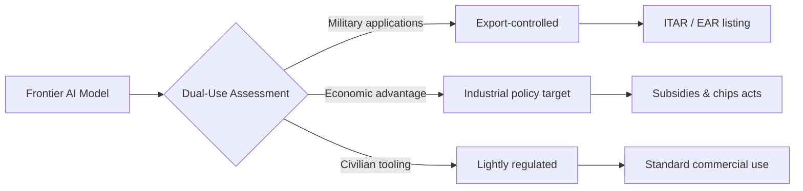
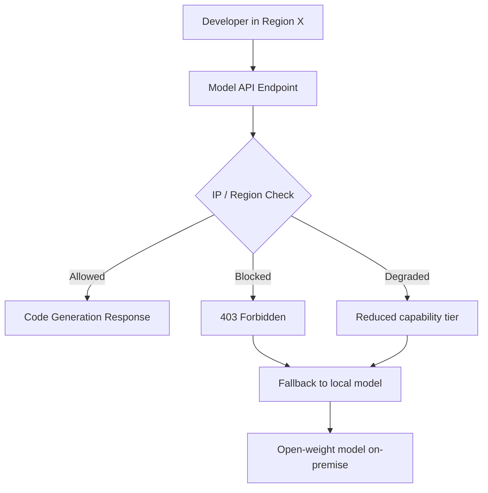
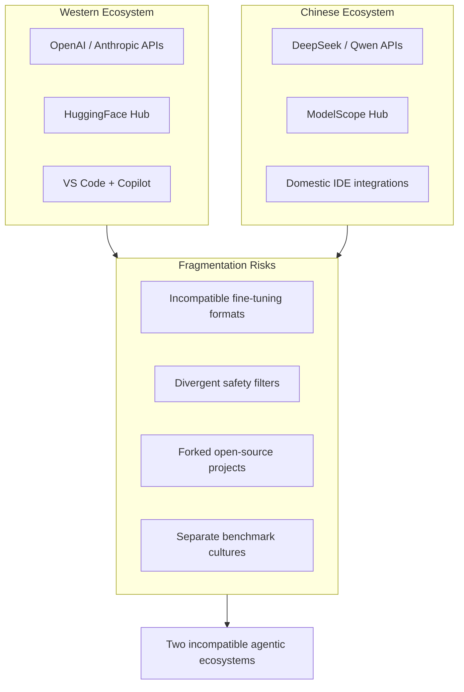

# 7.3 The Geopolitics of Code Generation

> **How to read this section.**
> This chapter maps the political landscape shaping AI code generation — from export controls to data sovereignty to ecosystem fragmentation. Each concept loop pairs a geopolitical force with concrete Python code that simulates, detects, or mitigates the developer-level impact. Run every example in `./src`; the verification checklist at the end confirms your understanding. Cross-reference §7.1 for Chinese model capabilities, §7.2 for efficiency considerations, §5.2 for harness architecture, and §6.1 for open-source dynamics.

---

## Why This Matters

AI code generation is no longer just a productivity story. Governments now treat large language models — especially coding-capable ones — as **dual-use technology**. Export controls restrict chip shipments, API access rules redraw the map of who can build what, and diverging regulatory frameworks threaten to split the global developer ecosystem into incompatible blocs. Developers building agentic harnesses must understand these forces or risk shipping products that cannot cross borders, rely on models that vanish overnight, or train on data that violates emerging sovereignty laws.

---

## Deliverable

By the end of this section you will have:

1. A `GeopoliticalRiskAssessor` class that scores model-supply-chain risk across jurisdictions.
2. A `DataSovereigntyChecker` that validates training-data provenance against regional rules.
3. A `FragmentationSimulator` that models ecosystem divergence scenarios.
4. A practical `ComplianceManifest` generator for agentic deployments.
5. A resilience strategy for building agents that survive geopolitical shocks.

---

## Concept Loop 1 — Code Generation as Strategic Asset

**Concept.** Governments increasingly classify AI coding models alongside weapons systems and encryption software. The reasoning: a model that can generate exploit code, optimise military logistics, or design autonomous systems is a **strategic asset**. The US, EU, and China have each published frameworks that treat frontier AI as a matter of national security.



> **Callout — The CHIPS Act effect.**
> The US CHIPS and Science Act (2022) allocated $52 billion to domestic semiconductor manufacturing. Its export-control companion rules restrict sale of advanced GPUs (A100, H100) to certain countries. This directly limits who can *train* coding models — and therefore who controls the agentic future.

**Example 7-11 — Strategic Asset Classifier.**

```python
"""Example 7-11: Classify a model's strategic risk level."""

from dataclasses import dataclass, field
from enum import Enum
from typing import list


class RiskTier(Enum):
    LOW = "low"
    MEDIUM = "medium"
    HIGH = "high"
    CRITICAL = "critical"


@dataclass
class ModelProfile:
    name: str
    parameter_count_b: float          # billions
    code_generation: bool = False
    cyber_capability: bool = False
    origin_country: str = "US"
    open_weights: bool = False
    training_compute_flops: float = 0.0  # in 1e23


@dataclass
class GeopoliticalRiskAssessor:
    """Score model-supply-chain risk across jurisdictions."""
    export_control_threshold_b: float = 70.0
    compute_threshold: float = 1e24

    def assess(self, profile: ModelProfile) -> dict:
        risks: list[str] = []
        tier = RiskTier.LOW

        # Parameter-count gate (mirrors US EO 14110 thresholds)
        if profile.parameter_count_b >= self.export_control_threshold_b:
            risks.append("exceeds_parameter_threshold")
            tier = RiskTier.MEDIUM

        # Compute gate
        if profile.training_compute_flops >= self.compute_threshold:
            risks.append("exceeds_compute_threshold")
            tier = RiskTier.HIGH

        # Capability flags
        if profile.code_generation and profile.cyber_capability:
            risks.append("dual_use_cyber")
            tier = RiskTier.CRITICAL

        # Origin jurisdiction interaction
        restricted_origins = {"CN", "RU", "IR"}
        if profile.origin_country in restricted_origins:
            risks.append("restricted_origin_jurisdiction")
            if tier.value != RiskTier.CRITICAL.value:
                tier = RiskTier.HIGH

        return {
            "model": profile.name,
            "tier": tier.value,
            "risk_flags": risks,
            "open_weights": profile.open_weights,
            "recommendation": self._recommend(tier, profile.open_weights),
        }

    @staticmethod
    def _recommend(tier: RiskTier, open_weights: bool) -> str:
        if tier == RiskTier.CRITICAL:
            return "Legal review required before deployment or distribution."
        if tier == RiskTier.HIGH:
            return "Restricted distribution; monitor export-control updates."
        if tier == RiskTier.MEDIUM and open_weights:
            return "Open-weights model near threshold — track regulatory changes."
        return "Standard commercial use; periodic compliance check."


# ---------- quick smoke test ----------
if __name__ == "__main__":
    assessor = GeopoliticalRiskAssessor()

    models = [
        ModelProfile("SmallCoder-7B", 7.0, code_generation=True),
        ModelProfile("FrontierCode-200B", 200.0, code_generation=True,
                     cyber_capability=True, training_compute_flops=2e24),
        ModelProfile("DeepSeek-V3", 671.0, code_generation=True,
                     origin_country="CN", open_weights=True,
                     training_compute_flops=5e23),
    ]

    for m in models:
        result = assessor.assess(m)
        print(f"{result['model']:25s} → tier={result['tier']:8s}  "
              f"flags={result['risk_flags']}")
        print(f"  ↳ {result['recommendation']}\n")
```

**Check yourself.** What happens if a model has `cyber_capability=True` but `code_generation=False`? Modify the assessor to handle capability combinations as a matrix rather than a simple conjunction.

---

## Concept Loop 2 — Export Controls and Model Access

**Concept.** Export controls now extend beyond chips to **model weights, APIs, and even fine-tuning services**. The US Entity List restricts transactions with specific foreign organisations. The EU AI Act introduces its own classification scheme. China's Interim Measures for Generative AI require government approval before public-facing model deployment.

The practical impact: an agentic harness that calls `model_provider.generate()` may find that endpoint **geo-fenced** — returning 403 errors based on the caller's IP or cloud region.



> **Callout — The API curtain.**
> In 2024, several US-based API providers began geo-fencing advanced coding endpoints. Developers in restricted jurisdictions found that their agentic pipelines broke silently — the API returned *valid JSON* with downgraded output rather than an explicit error. Defensive coding is essential.

**Example 7-12 — Export-Control-Aware Model Router.**

```python
"""Example 7-12: Route model calls based on jurisdiction constraints."""

from dataclasses import dataclass, field
from typing import Optional


@dataclass
class JurisdictionPolicy:
    region: str
    allowed_models: list[str] = field(default_factory=list)
    blocked_models: list[str] = field(default_factory=list)
    max_parameter_tier: Optional[str] = None   # "small", "medium", "large"


@dataclass
class ExportControlRouter:
    """Route model requests respecting geo-fence rules."""
    policies: list[JurisdictionPolicy] = field(default_factory=list)
    fallback_model: str = "local-codellama-7b"

    def add_policy(self, policy: JurisdictionPolicy) -> None:
        self.policies.append(policy)

    def route(self, requested_model: str, caller_region: str) -> dict:
        policy = self._find_policy(caller_region)
        if policy is None:
            return self._result(requested_model, "allowed", "no_policy_defined")

        if requested_model in policy.blocked_models:
            return self._result(
                self.fallback_model, "blocked_fallback",
                f"{requested_model} blocked in {caller_region}"
            )

        if policy.allowed_models and requested_model not in policy.allowed_models:
            return self._result(
                self.fallback_model, "not_in_allowlist",
                f"{requested_model} not explicitly allowed in {caller_region}"
            )

        return self._result(requested_model, "allowed", "policy_check_passed")

    def _find_policy(self, region: str) -> Optional[JurisdictionPolicy]:
        for p in self.policies:
            if p.region == region:
                return p
        return None

    @staticmethod
    def _result(model: str, status: str, reason: str) -> dict:
        return {"routed_model": model, "status": status, "reason": reason}


# ---------- smoke test ----------
if __name__ == "__main__":
    router = ExportControlRouter()
    router.add_policy(JurisdictionPolicy(
        region="CN",
        blocked_models=["gpt-4o", "claude-sonnet-4"],
        allowed_models=["deepseek-v3", "qwen-coder", "local-codellama-7b"],
    ))
    router.add_policy(JurisdictionPolicy(
        region="EU",
        blocked_models=[],
        allowed_models=["gpt-4o", "claude-sonnet-4", "deepseek-v3"],
    ))

    test_cases = [
        ("gpt-4o", "US"),
        ("gpt-4o", "CN"),
        ("claude-sonnet-4", "EU"),
        ("deepseek-v3", "CN"),
        ("unknown-model", "EU"),
    ]

    for model, region in test_cases:
        result = router.route(model, region)
        print(f"  {model:25s} from {region} → "
              f"{result['routed_model']:25s} [{result['status']}]")
```

**Check yourself.** How would you extend the router to handle *degraded* access — where the API returns valid but lower-quality output? Consider adding a quality-verification step after each routed call.

---

## Concept Loop 3 — Data Sovereignty and Training Data

**Concept.** Data sovereignty laws dictate *where* data can be stored and *how* it can cross borders. For AI coding models, the critical questions are:

- Who owns the **code** that trained the model?
- Can training data collected in the EU be processed on US servers?
- If a model memorises proprietary code, does inference in another jurisdiction constitute a data *export*?

The EU's GDPR, China's PIPL, and sector-specific rules (e.g., ITAR for defence code) create a patchwork that agentic harness builders must navigate.

> **Callout — The training-data audit trail.**
> Several open-source coding models have faced legal challenges over training data provenance. The StarCoder project pioneered an opt-out mechanism for developers who did not want their code used for training. Expect such mechanisms to become legally mandated in multiple jurisdictions by 2026.

**Example 7-13 — Data Sovereignty Checker.**

```python
"""Example 7-13: Validate training-data provenance against regional rules."""

from dataclasses import dataclass, field
from datetime import datetime


@dataclass
class DataSource:
    name: str
    origin_region: str             # ISO 3166-1 alpha-2
    licence: str                   # e.g. "MIT", "Apache-2.0", "proprietary"
    contains_pii: bool = False
    opt_out_mechanism: bool = False
    collection_date: str = ""      # ISO date


@dataclass
class RegionalRule:
    region: str
    requires_opt_out: bool = False
    allows_cross_border: bool = True
    pii_training_allowed: bool = False
    approved_licences: list[str] = field(default_factory=list)


@dataclass
class DataSovereigntyChecker:
    """Validate data sources against jurisdiction-specific rules."""
    rules: list[RegionalRule] = field(default_factory=list)

    def add_rule(self, rule: RegionalRule) -> None:
        self.rules.append(rule)

    def check(self, source: DataSource, deployment_region: str) -> dict:
        violations: list[str] = []
        warnings: list[str] = []

        src_rule = self._find_rule(source.origin_region)
        dep_rule = self._find_rule(deployment_region)

        # Cross-border check
        if src_rule and not src_rule.allows_cross_border:
            if source.origin_region != deployment_region:
                violations.append(
                    f"Cross-border transfer from {source.origin_region} "
                    f"to {deployment_region} not permitted"
                )

        # Opt-out mechanism
        if src_rule and src_rule.requires_opt_out and not source.opt_out_mechanism:
            violations.append(
                f"Region {source.origin_region} requires opt-out mechanism"
            )

        # PII in training data
        if source.contains_pii:
            if dep_rule and not dep_rule.pii_training_allowed:
                violations.append(
                    f"PII training not allowed in {deployment_region}"
                )

        # Licence compatibility
        if dep_rule and dep_rule.approved_licences:
            if source.licence not in dep_rule.approved_licences:
                warnings.append(
                    f"Licence '{source.licence}' not in approved list "
                    f"for {deployment_region}"
                )

        compliant = len(violations) == 0
        return {
            "source": source.name,
            "compliant": compliant,
            "violations": violations,
            "warnings": warnings,
        }

    def _find_rule(self, region: str) -> RegionalRule | None:
        for r in self.rules:
            if r.region == region:
                return r
        return None


# ---------- smoke test ----------
if __name__ == "__main__":
    checker = DataSovereigntyChecker()
    checker.add_rule(RegionalRule(
        region="EU", requires_opt_out=True,
        allows_cross_border=False, pii_training_allowed=False,
        approved_licences=["MIT", "Apache-2.0", "BSD-3-Clause"],
    ))
    checker.add_rule(RegionalRule(
        region="US", requires_opt_out=False,
        allows_cross_border=True, pii_training_allowed=False,
        approved_licences=["MIT", "Apache-2.0"],
    ))
    checker.add_rule(RegionalRule(
        region="CN", requires_opt_out=False,
        allows_cross_border=False, pii_training_allowed=False,
    ))

    sources = [
        DataSource("GitHub-Public-2024", "US", "MIT", False, True),
        DataSource("EU-Enterprise-Repos", "EU", "proprietary", True, False),
        DataSource("CN-CodePlatform", "CN", "Apache-2.0", False, True),
    ]

    for src in sources:
        for deploy_region in ["US", "EU", "CN"]:
            result = checker.check(src, deploy_region)
            status = "✅" if result["compliant"] else "❌"
            print(f"  {status} {src.name:25s} → {deploy_region}: "
                  f"violations={result['violations']}, "
                  f"warnings={result['warnings']}")
        print()
```

**Check yourself.** Add a `collection_date` validation that flags sources collected before a jurisdiction's data-protection law took effect (e.g., GDPR enforcement: 2018-05-25). How does temporal compliance change your audit trail?

---

## Concept Loop 4 — The Fragmentation Risk

**Concept.** The greatest long-term risk is **ecosystem fragmentation** — a world where US/EU developers and Chinese developers operate in incompatible toolchains, with forked open-source projects and divergent API standards. This is not hypothetical: China's domestic model ecosystem already operates behind a regulatory boundary that shapes model behaviour (content filtering, political alignment) in ways incompatible with Western expectations.



> **Callout — The open-source bridge.**
> Open-source models like DeepSeek-V3 and Qwen-Coder serve as bridges between ecosystems — available on both HuggingFace and ModelScope, runnable in any jurisdiction. However, divergent fine-tuning (safety filters, censorship layers) means the *same base weights* may behave very differently depending on where and how they are deployed. See §7.1 for capability analysis of these models.

**Example 7-14 — Fragmentation Simulator.**

```python
"""Example 7-14: Simulate ecosystem divergence scenarios."""

from dataclasses import dataclass, field
import json


@dataclass
class EcosystemBloc:
    name: str
    primary_models: list[str] = field(default_factory=list)
    api_standard: str = "openai-compatible"
    model_hub: str = "huggingface"
    safety_framework: str = "voluntary"
    open_source_policy: str = "permissive"


@dataclass
class FragmentationSimulator:
    """Model ecosystem divergence across geopolitical blocs."""
    blocs: list[EcosystemBloc] = field(default_factory=list)

    def add_bloc(self, bloc: EcosystemBloc) -> None:
        self.blocs.append(bloc)

    def compute_compatibility(self, bloc_a: str, bloc_b: str) -> dict:
        a = self._find(bloc_a)
        b = self._find(bloc_b)
        if not a or not b:
            return {"error": "Bloc not found"}

        scores = {}

        # API compatibility
        scores["api_compatible"] = a.api_standard == b.api_standard

        # Model hub interoperability
        scores["hub_shared"] = a.model_hub == b.model_hub

        # Safety framework alignment
        scores["safety_aligned"] = a.safety_framework == b.safety_framework

        # Open-source policy alignment
        scores["oss_aligned"] = a.open_source_policy == b.open_source_policy

        # Shared models
        shared = set(a.primary_models) & set(b.primary_models)
        scores["shared_models"] = sorted(shared)
        scores["shared_model_count"] = len(shared)

        # Overall fragmentation score (0 = fully fragmented, 1 = unified)
        binary_fields = [
            scores["api_compatible"], scores["hub_shared"],
            scores["safety_aligned"], scores["oss_aligned"],
        ]
        unity = sum(binary_fields) / len(binary_fields)
        model_overlap = (
            len(shared) / max(len(a.primary_models), len(b.primary_models))
            if a.primary_models or b.primary_models else 0
        )
        scores["unity_score"] = round((unity * 0.6) + (model_overlap * 0.4), 2)
        scores["fragmentation_risk"] = (
            "low" if scores["unity_score"] > 0.7
            else "medium" if scores["unity_score"] > 0.4
            else "high"
        )

        return {"blocs": [bloc_a, bloc_b], **scores}

    def scenario_report(self) -> list[dict]:
        results = []
        names = [b.name for b in self.blocs]
        for i, a in enumerate(names):
            for b in names[i + 1:]:
                results.append(self.compute_compatibility(a, b))
        return results

    def _find(self, name: str) -> EcosystemBloc | None:
        for b in self.blocs:
            if b.name == name:
                return b
        return None


# ---------- smoke test ----------
if __name__ == "__main__":
    sim = FragmentationSimulator()

    sim.add_bloc(EcosystemBloc(
        name="US/West",
        primary_models=["gpt-4o", "claude-sonnet", "llama-3", "deepseek-v3"],
        api_standard="openai-compatible",
        model_hub="huggingface",
        safety_framework="voluntary-NIST",
        open_source_policy="permissive",
    ))
    sim.add_bloc(EcosystemBloc(
        name="EU",
        primary_models=["gpt-4o", "claude-sonnet", "mistral-large", "llama-3"],
        api_standard="openai-compatible",
        model_hub="huggingface",
        safety_framework="eu-ai-act-mandatory",
        open_source_policy="permissive-with-conditions",
    ))
    sim.add_bloc(EcosystemBloc(
        name="China",
        primary_models=["deepseek-v3", "qwen-coder", "glm-4", "yi-large"],
        api_standard="openai-compatible",
        model_hub="modelscope",
        safety_framework="cac-mandatory",
        open_source_policy="state-guided",
    ))

    for result in sim.scenario_report():
        blocs = " ↔ ".join(result["blocs"])
        print(f"  {blocs:20s}  unity={result['unity_score']:.2f}  "
              f"risk={result['fragmentation_risk']:6s}  "
              f"shared_models={result['shared_models']}")
```

**Check yourself.** What happens to the unity score if China adopts a non-OpenAI-compatible API standard? Change the `api_standard` for the China bloc and observe the impact. How would an agentic harness maintain cross-bloc compatibility?

---

## Concept Loop 5 — Navigating as a Developer

**Concept.** Individual developers and teams building agentic harnesses need practical strategies for a geopolitically uncertain world. The core principles are: **multi-model resilience**, **compliance-by-design**, and **transparent provenance**. As discussed in §5.2 (harness architecture) and §6.1 (open-source dynamics), modularity is the best defence against supply-chain shocks.

> **Callout — The 72-hour rule.**
> Assume that any cloud-hosted model API could become unavailable in your region within 72 hours due to regulatory action. Design your harness accordingly: local fallbacks, cached model artifacts, and provider-agnostic abstractions are not optional — they are survival features.

**Example 7-15 — Compliance Manifest Generator.**

```python
"""Example 7-15: Generate a compliance manifest for agentic deployments."""

from dataclasses import dataclass, field
from datetime import datetime, timezone
import json


@dataclass
class ModelDependency:
    model_id: str
    provider: str
    origin_jurisdiction: str
    licence: str
    is_local: bool = False
    fallback_model: str = ""


@dataclass
class ComplianceManifest:
    """Generate and validate deployment compliance manifests."""
    project_name: str
    deployment_region: str
    models: list[ModelDependency] = field(default_factory=list)
    data_sources: list[str] = field(default_factory=list)
    generated_at: str = ""

    def add_model(self, dep: ModelDependency) -> None:
        self.models.append(dep)

    def generate(self) -> dict:
        self.generated_at = datetime.now(timezone.utc).isoformat()

        manifest = {
            "manifest_version": "1.0",
            "project": self.project_name,
            "deployment_region": self.deployment_region,
            "generated_at": self.generated_at,
            "models": [],
            "compliance_checks": [],
            "resilience_score": 0.0,
        }

        local_count = 0
        has_fallback = 0

        for m in self.models:
            entry = {
                "model_id": m.model_id,
                "provider": m.provider,
                "origin": m.origin_jurisdiction,
                "licence": m.licence,
                "is_local": m.is_local,
                "fallback": m.fallback_model or "none",
            }
            manifest["models"].append(entry)

            if m.is_local:
                local_count += 1
            if m.fallback_model:
                has_fallback += 1

        # Compliance checks
        checks = []
        if local_count == 0:
            checks.append({
                "check": "local_model_available",
                "status": "FAIL",
                "detail": "No local model configured — single point of failure.",
            })
        else:
            checks.append({
                "check": "local_model_available",
                "status": "PASS",
                "detail": f"{local_count} local model(s) configured.",
            })

        if has_fallback < len(self.models):
            checks.append({
                "check": "fallback_coverage",
                "status": "WARN",
                "detail": (f"{len(self.models) - has_fallback} model(s) "
                           f"lack a fallback."),
            })
        else:
            checks.append({
                "check": "fallback_coverage",
                "status": "PASS",
                "detail": "All models have fallbacks.",
            })

        # Cross-border check
        cross_border = [
            m for m in self.models
            if m.origin_jurisdiction != self.deployment_region
            and not m.is_local
        ]
        if cross_border:
            checks.append({
                "check": "cross_border_dependency",
                "status": "WARN",
                "detail": (f"{len(cross_border)} model(s) depend on "
                           f"cross-border API calls."),
            })
        else:
            checks.append({
                "check": "cross_border_dependency",
                "status": "PASS",
                "detail": "No cross-border API dependencies.",
            })

        manifest["compliance_checks"] = checks

        # Resilience score
        total = len(self.models) if self.models else 1
        resilience = (
            (local_count / total) * 0.4
            + (has_fallback / total) * 0.4
            + (1.0 if local_count > 0 else 0.0) * 0.2
        )
        manifest["resilience_score"] = round(resilience, 2)

        return manifest


# ---------- smoke test ----------
if __name__ == "__main__":
    cm = ComplianceManifest(
        project_name="my-agentic-harness",
        deployment_region="EU",
    )

    cm.add_model(ModelDependency(
        "claude-sonnet", "Anthropic", "US", "proprietary",
        is_local=False, fallback_model="local-codellama-7b",
    ))
    cm.add_model(ModelDependency(
        "deepseek-v3", "DeepSeek", "CN", "MIT",
        is_local=False, fallback_model="local-codellama-7b",
    ))
    cm.add_model(ModelDependency(
        "local-codellama-7b", "Meta", "US", "Llama-Community",
        is_local=True, fallback_model="",
    ))

    manifest = cm.generate()
    print(json.dumps(manifest, indent=2))
```

**Check yourself.** Add a `data_sources` validation step that cross-references each data source against the `DataSovereigntyChecker` from Example 7-13. How would you wire these two classes together in a CI/CD pipeline that blocks non-compliant deployments?

---

## What We Built

| Artifact | Purpose | Key insight |
|---|---|---|
| `GeopoliticalRiskAssessor` | Score model supply-chain risk | Parameter count and compute thresholds mirror real regulatory triggers |
| `ExportControlRouter` | Jurisdiction-aware model routing | Silent geo-fencing is more dangerous than explicit blocks |
| `DataSovereigntyChecker` | Training-data provenance audit | Cross-border data flows are the hidden compliance landmine |
| `FragmentationSimulator` | Ecosystem divergence modelling | Open-source bridges reduce fragmentation but don't eliminate it |
| `ComplianceManifest` | Deployment compliance snapshot | Resilience requires local fallbacks and fallback coverage |

Together, these five components form a **geopolitical compliance layer** that sits beneath the agentic harness architecture described in §5.2. They do not replace legal counsel — but they give engineering teams a structured framework for identifying and mitigating jurisdiction-specific risks before they become production incidents.

---

## Verification Checklist

- [ ] `GeopoliticalRiskAssessor` correctly classifies models into four risk tiers
- [ ] `ExportControlRouter` falls back to a local model when the requested model is blocked
- [ ] `DataSovereigntyChecker` flags cross-border violations for EU-origin data deployed outside the EU
- [ ] `FragmentationSimulator` produces lower unity scores when API standards diverge
- [ ] `ComplianceManifest` generates a valid JSON manifest with compliance checks and a resilience score
- [ ] All five examples run as self-contained Python scripts with zero external dependencies

---

## Exercises

1. **Entity-List Watcher.** Extend `ExportControlRouter` with a `watch_list` of specific organisations (not just regions). Route decisions should check both the caller's region *and* their organisation ID against the watch list. Test with at least three organisations across two jurisdictions.

2. **Temporal Compliance.** Add a `regulation_effective_date` field to `RegionalRule` in the `DataSovereigntyChecker`. Implement logic that only enforces rules for data collected *after* the regulation took effect. Verify with GDPR (2018-05-25) and China's PIPL (2021-11-01).

3. **Resilience Stress Test.** Using the `ComplianceManifest`, write a function that simulates removing each cloud-hosted model one at a time and recalculates the resilience score. Identify the single point of failure — the model whose removal causes the largest score drop.

4. **Cross-Bloc Agent.** Build a minimal agentic harness (under 100 lines) that uses the `FragmentationSimulator` to select which model to call based on the deployment region. The harness should prefer shared models (those available in both the caller's bloc and the target bloc) and fall back to local inference when no shared model exists. Integrate the `ExportControlRouter` for final routing decisions.
