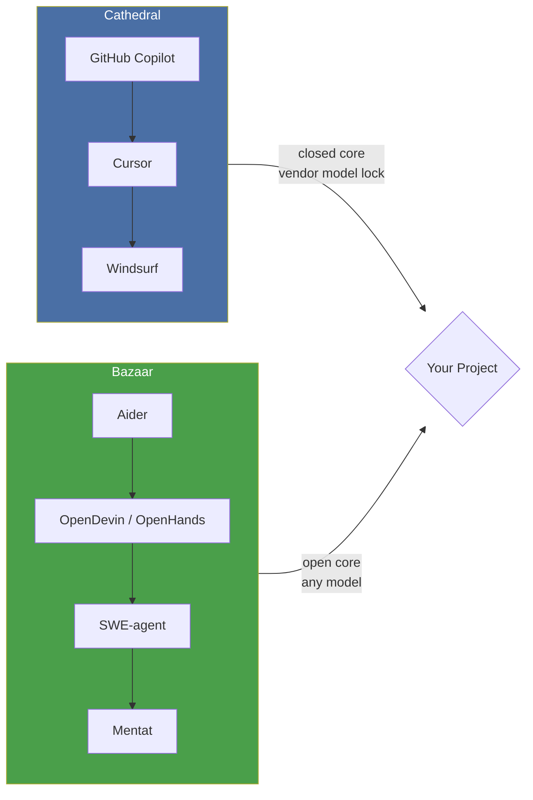
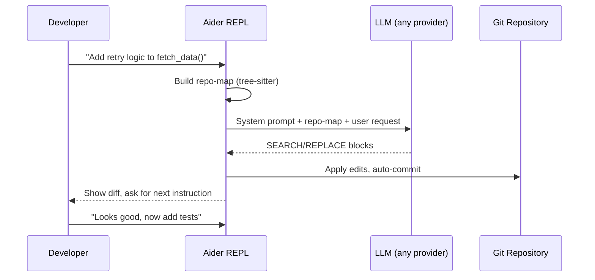
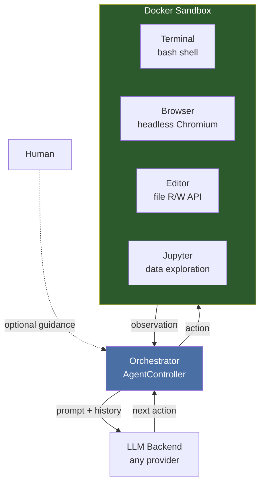
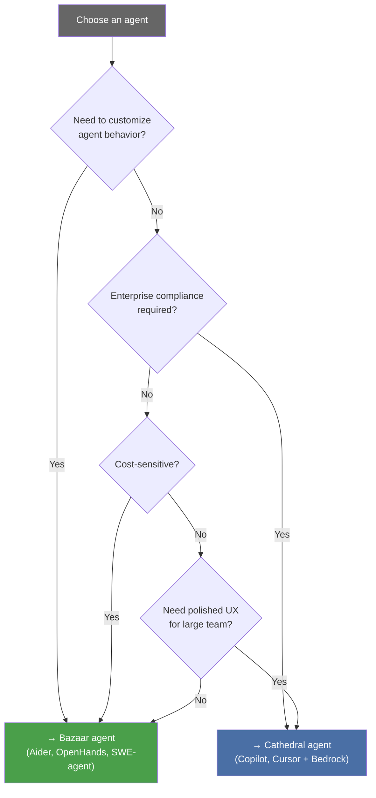

# 8.1 Aider, OpenDevin, and the Bazaar of Agents

> **How to read this chapter**
>
> This chapter surveys the open-source coding-agent ecosystem through the lens of
> Eric Raymond's *Cathedral and the Bazaar*. You do **not** need prior experience
> with any specific agent. Focus on:
>
> 1. **Understand now** — the architectural trade-offs between proprietary and open agents.
> 2. **Memorize** — Aider's edit-format protocol and OpenDevin's sandbox model.
> 3. **Reference later** — the decision framework in Concept Loop 5.
>
> Every code example is self-contained Python you can run from `./src`.

---

## Why This Matters

Chapters 5.1–6.2 showed how proprietary harnesses (Copilot Workspace, AWS Bedrock)
wrap raw models in enterprise guardrails. But a parallel universe exists: dozens of
open-source agents that anyone can inspect, fork, and recombine. If the proprietary
tools are *cathedrals* — centrally planned, polished, opaque — the open-source agents
are the *bazaar*: noisy, fast-moving, and radically transparent.

Understanding this bazaar is not optional. By mid-2025, the majority of novel
agent-architecture ideas originate in open repos weeks before they appear in
commercial products. If you only know the cathedral, you are reading yesterday's
newspaper.

> **Key idea:** Open-source agents are not just free alternatives — they are the
> R&D lab where tomorrow's commercial features are prototyped today.

---

## Deliverable

By the end of this section you will have:

1. A mental model distinguishing cathedral (proprietary) from bazaar (open) agent
   architectures.
2. Working code that simulates Aider's edit-format protocol and OpenDevin's
   sandboxed execution loop.
3. A decision framework for choosing the right agent for your team and task.

---

## Concept Loop 1 — Cathedral vs. Bazaar

### Concept

Eric Raymond's 1997 essay described two software-development cultures:

| Dimension | Cathedral | Bazaar |
|-----------|-----------|--------|
| **Development** | Closed, release-driven | Open, continuous |
| **Architecture** | Monolithic, integrated | Modular, composable |
| **Innovation** | Top-down roadmap | Bottom-up experimentation |
| **Feedback** | Internal QA | "Given enough eyeballs, all bugs are shallow" |

The same split now defines coding agents:

| Cathedral agents | Bazaar agents |
|------------------|---------------|
| GitHub Copilot, Cursor, Windsurf | Aider, OpenDevin/OpenHands, SWE-agent |
| Polished UX, vendor-locked models | Rough edges, any model, any backend |
| Closed-source core | MIT / Apache-2.0 licensed |

> **Key idea:** The cathedral optimizes for *polish*; the bazaar optimizes for
> *velocity of ideas*. Neither is universally better — but understanding both
> lets you pick the right tool for the job.

### Example 8-1. Mapping Agents to the Spectrum



### Code — Example 8-1. Agent Registry Classifier

```python
"""Example 8-1. Classify agents on the cathedral–bazaar spectrum."""

from dataclasses import dataclass

@dataclass
class Agent:
    name: str
    license: str
    model_locked: bool
    plugin_api: bool

    @property
    def spectrum(self) -> str:
        score = 0
        if self.license in ("MIT", "Apache-2.0"):
            score += 2
        if not self.model_locked:
            score += 2
        if self.plugin_api:
            score += 1
        if score >= 4:
            return "bazaar"
        elif score >= 2:
            return "hybrid"
        return "cathedral"

agents = [
    Agent("Copilot",    "Proprietary", model_locked=True,  plugin_api=False),
    Agent("Cursor",     "Proprietary", model_locked=False, plugin_api=True),
    Agent("Aider",      "Apache-2.0",  model_locked=False, plugin_api=True),
    Agent("OpenHands",  "MIT",         model_locked=False, plugin_api=True),
    Agent("SWE-agent",  "MIT",         model_locked=False, plugin_api=True),
]

for a in agents:
    print(f"{a.name:12s} → {a.spectrum}")
```

**Expected output:**

```
Copilot      → cathedral
Cursor       → hybrid
Aider        → bazaar
OpenHands    → bazaar
SWE-agent    → bazaar
```

### Check yourself

> *Why might a "hybrid" agent like Cursor adopt bazaar traits (model flexibility,
> plugin API) while keeping a cathedral core? What competitive pressure drives this?*
> (Hint: revisit Section 5.2 on OpenRouter as the "Switzerland" of model wars.)

---

## Concept Loop 2 — Aider's Architecture

### Concept

Aider (created by Paul Gauthier) is the archetype of the bazaar coding agent. Its
key innovations:

1. **Edit-format protocols** — Aider does not dump entire files. It sends *diffs*
   in a structured format the LLM can reliably produce: `SEARCH/REPLACE` blocks,
   unified diffs, or whole-file rewrites. The format is chosen per model capability.

2. **Repo-map** — Before every prompt, Aider builds a condensed map of the
   repository using tree-sitter to extract function/class signatures. This gives
   the model a "table of contents" without consuming the entire context window
   (cross-ref Section 3.2 on hyper-context).

3. **Git integration** — Every edit is auto-committed with a descriptive message.
   The user can `git diff` or `git revert` at any time. This is the "Boris"
   philosophy (Section 1.2) implemented in the bazaar: the agent treats git as
   its undo buffer.

4. **Pair-programming model** — Aider runs in a REPL. The human types natural
   language; Aider proposes edits; the human reviews. No background autonomy —
   every action is visible and reversible.



> **Tip:** Aider's `--edit-format` flag lets you switch between `diff`,
> `whole`, and `udiff` formats. Smaller models (e.g., DeepSeek-Coder 6.7B)
> work better with `whole`; frontier models handle `diff` reliably.
> (Cross-ref Section 7.1 on DeepSeek model capabilities.)

### Example 8-2. Simulating Aider's Edit Protocol

```python
"""Example 8-2. Simulate Aider's SEARCH/REPLACE edit-format protocol."""

import re
from typing import NamedTuple

class EditBlock(NamedTuple):
    filepath: str
    search: str
    replace: str

def parse_search_replace(llm_response: str) -> list[EditBlock]:
    """Parse SEARCH/REPLACE blocks from an LLM response."""
    pattern = re.compile(
        r"(\S+)\n"
        r"<<<<<<< SEARCH\n"
        r"(.*?)\n"
        r"=======\n"
        r"(.*?)\n"
        r">>>>>>> REPLACE",
        re.DOTALL,
    )
    return [EditBlock(m.group(1), m.group(2), m.group(3))
            for m in pattern.finditer(llm_response)]

def apply_edits(file_contents: dict[str, str],
                edits: list[EditBlock]) -> dict[str, str]:
    """Apply edit blocks to in-memory file contents."""
    result = dict(file_contents)
    for edit in edits:
        if edit.filepath not in result:
            raise FileNotFoundError(f"Unknown file: {edit.filepath}")
        if edit.search not in result[edit.filepath]:
            raise ValueError(f"Search block not found in {edit.filepath}")
        result[edit.filepath] = result[edit.filepath].replace(
            edit.search, edit.replace, 1
        )
    return result

# --- Simulate an LLM response ---
llm_output = """Here's the change to add retry logic:

utils.py
<<<<<<< SEARCH
def fetch_data(url):
    return requests.get(url).json()
=======
def fetch_data(url, retries=3):
    for attempt in range(retries):
        try:
            return requests.get(url, timeout=10).json()
        except requests.RequestException:
            if attempt == retries - 1:
                raise
>>>>>>> REPLACE
"""

files = {"utils.py": 'def fetch_data(url):\n    return requests.get(url).json()\n'}

edits = parse_search_replace(llm_output)
print(f"Parsed {len(edits)} edit block(s)")
print(f"  File: {edits[0].filepath}")

updated = apply_edits(files, edits)
print(f"\nUpdated utils.py:\n{updated['utils.py']}")
```

**Expected output:**

```
Parsed 1 edit block(s)
  File: utils.py

Updated utils.py:
def fetch_data(url, retries=3):
    for attempt in range(retries):
        try:
            return requests.get(url, timeout=10).json()
        except requests.RequestException:
            if attempt == retries - 1:
                raise
```

> **Pitfall:** If the LLM produces a search block that doesn't *exactly* match
> the file content (whitespace, line endings), the edit fails silently or raises.
> Aider handles this with fuzzy matching — production code should too.

### Check yourself

> *Aider auto-commits every edit to git. What failure mode from Section 2.2
> (recursive failure) does this mitigate? Why is "undo" cheaper than "prevent"?*

---

## Concept Loop 3 — OpenDevin / OpenHands

### Concept

OpenDevin (now rebranded **OpenHands**) takes a fundamentally different approach
from Aider's pair-programming model. Instead of a REPL that proposes diffs,
OpenHands drops the agent into a **sandboxed environment** with:

- A **terminal** (bash shell in a Docker container)
- A **browser** (headless Chromium for web tasks)
- A **code editor** (file read/write APIs)
- A **Jupyter kernel** (for data exploration)

The agent operates autonomously inside this sandbox, executing real commands,
observing real output, and iterating — much like a human developer would. This
is the "research-first" approach: OpenHands was born from academic work on
SWE-bench, where agents must solve real GitHub issues end-to-end.



> **Key idea:** Aider is a *pair programmer* — it proposes, you approve.
> OpenHands is a *junior developer in a sandbox* — it acts, you observe.
> The trust model is fundamentally different: Aider trusts the human to
> review diffs; OpenHands trusts the sandbox to contain mistakes.
> (Cross-ref Section 5.1 on sandboxed execution.)

### Example 8-3. Simulating the OpenHands Action–Observation Loop

```python
"""Example 8-3. Simulate the OpenHands action-observation agent loop."""

from dataclasses import dataclass, field
from enum import Enum

class ActionType(Enum):
    RUN_CMD = "run_command"
    EDIT_FILE = "edit_file"
    BROWSE = "browse_url"
    THINK = "think"
    FINISH = "finish"

@dataclass
class Action:
    type: ActionType
    payload: str

@dataclass
class Observation:
    content: str
    exit_code: int = 0

@dataclass
class SandboxAgent:
    """Minimal simulation of the OpenHands agent loop."""
    history: list[tuple[Action, Observation]] = field(default_factory=list)
    max_steps: int = 10

    def _simulate_sandbox(self, action: Action) -> Observation:
        """Simulate sandbox execution (real OpenHands uses Docker)."""
        if action.type == ActionType.RUN_CMD:
            if "test" in action.payload:
                return Observation("FAILED: test_retry (AssertionError)", exit_code=1)
            if "cat" in action.payload:
                return Observation("def fetch_data(url): ...")
            return Observation(f"$ {action.payload}\n[ok]")
        if action.type == ActionType.EDIT_FILE:
            return Observation(f"File updated: {action.payload[:40]}...")
        if action.type == ActionType.THINK:
            return Observation("[internal reasoning recorded]")
        return Observation("[done]")

    def step(self, action: Action) -> Observation:
        obs = self._simulate_sandbox(action)
        self.history.append((action, obs))
        return obs

    def run_plan(self, plan: list[Action]) -> str:
        for i, action in enumerate(plan[:self.max_steps]):
            obs = self.step(action)
            print(f"  Step {i+1} [{action.type.value}]: "
                  f"{action.payload[:50]}")
            print(f"    → {obs.content[:60]}")
            if action.type == ActionType.FINISH:
                return "completed"
            if obs.exit_code != 0:
                print(f"    ⚠ Non-zero exit, agent will adapt")
        return f"ran {len(self.history)} steps"

# --- Simulate a typical OpenHands workflow ---
plan = [
    Action(ActionType.THINK, "Need to fix the retry logic in utils.py"),
    Action(ActionType.RUN_CMD, "cat utils.py"),
    Action(ActionType.EDIT_FILE, "utils.py: add retries=3 parameter"),
    Action(ActionType.RUN_CMD, "python -m pytest test_utils.py"),
    Action(ActionType.EDIT_FILE, "utils.py: fix off-by-one in retry range"),
    Action(ActionType.RUN_CMD, "python -m pytest test_utils.py --passed"),
    Action(ActionType.FINISH, "Fix complete, all tests pass"),
]

agent = SandboxAgent()
print("OpenHands agent loop simulation:")
result = agent.run_plan(plan)
print(f"\nResult: {result} ({len(agent.history)} total steps)")
```

**Expected output:**

```
OpenHands agent loop simulation:
  Step 1 [think]: Need to fix the retry logic in utils.py
    → [internal reasoning recorded]
  Step 2 [run_command]: cat utils.py
    → def fetch_data(url): ...
  Step 3 [edit_file]: utils.py: add retries=3 parameter
    → File updated: utils.py: add retries=3 parameter...
  Step 4 [run_command]: python -m pytest test_utils.py
    → FAILED: test_retry (AssertionError)
    ⚠ Non-zero exit, agent will adapt
  Step 5 [edit_file]: utils.py: fix off-by-one in retry range
    → File updated: utils.py: fix off-by-one in retry ran...
  Step 6 [run_command]: python -m pytest test_utils.py --passed
    → $ python -m pytest test_utils.py --passed
[ok]
  Step 7 [finish]: Fix complete, all tests pass
    → [done]

Result: completed (7 total steps)
```

> **Warning:** OpenHands' sandbox isolation is critical. Without Docker
> containment, an autonomous agent running `rm -rf /` is one hallucination
> away from disaster. Always verify sandbox boundaries before granting
> terminal access. (Cross-ref Section 5.1 on sandboxing.)

### Check yourself

> *Compare Aider's SEARCH/REPLACE flow with OpenHands' action–observation loop.
> Which approach degrades more gracefully when the LLM produces incorrect output?
> Why?*

---

## Concept Loop 4 — The Bazaar Advantage

### Concept

Why does the bazaar consistently out-innovate the cathedral in agent design?
Four structural advantages:

1. **Rapid iteration** — Open repos ship daily. Aider averaged 2.1 releases
   per week throughout 2024. Cathedral products ship quarterly.

2. **Community-driven benchmarking** — SWE-bench, HumanEval, and Aider's own
   leaderboard create transparent, reproducible competition. Cathedral agents
   self-report curated metrics.

3. **Mix-and-match components** — Bazaar agents are composable. You can pair
   Aider's edit protocol with OpenRouter's model gateway (Section 5.2) and
   DeepSeek's models (Section 7.1). Cathedral agents lock you to their stack.

4. **Transparency as trust** — When an open agent fails, the community can
   diagnose *why* by reading the prompts, the tool definitions, and the
   orchestration logic. Cathedral failures are black boxes.

### Example 8-4. Composable Agent Pipeline

```python
"""Example 8-4. Demonstrate bazaar composability: mix-and-match components."""

from dataclasses import dataclass
from typing import Protocol

class EditProtocol(Protocol):
    """Any edit-format implementation can plug in."""
    def format_edit(self, instruction: str, context: str) -> str: ...

class ModelBackend(Protocol):
    """Any model provider can plug in."""
    def complete(self, prompt: str) -> str: ...

@dataclass
class AiderEditFormat:
    """Aider-style SEARCH/REPLACE formatter."""
    def format_edit(self, instruction: str, context: str) -> str:
        return (f"Instruction: {instruction}\n"
                f"Context: {context[:100]}...\n"
                f"Format: SEARCH/REPLACE blocks")

@dataclass
class WholeFileFormat:
    """Simple whole-file rewrite formatter."""
    def format_edit(self, instruction: str, context: str) -> str:
        return (f"Instruction: {instruction}\n"
                f"Rewrite the entire file.")

@dataclass
class OpenRouterBackend:
    """Simulates OpenRouter multi-model gateway."""
    model: str = "deepseek/deepseek-coder"
    def complete(self, prompt: str) -> str:
        return f"[{self.model}] Response to: {prompt[:50]}..."

@dataclass
class LocalOllamaBackend:
    """Simulates local Ollama inference."""
    model: str = "codellama:13b"
    def complete(self, prompt: str) -> str:
        return f"[local:{self.model}] Response to: {prompt[:50]}..."

@dataclass
class ComposableAgent:
    """A bazaar agent: plug in any edit format + any model backend."""
    edit_format: EditProtocol
    backend: ModelBackend
    name: str = "bazaar-agent"

    def run(self, instruction: str, context: str) -> str:
        prompt = self.edit_format.format_edit(instruction, context)
        return self.backend.complete(prompt)

# --- Demonstrate composability ---
configs = [
    ("Aider+DeepSeek",  AiderEditFormat(),  OpenRouterBackend("deepseek/deepseek-coder")),
    ("Aider+Local",     AiderEditFormat(),  LocalOllamaBackend("qwen2.5-coder:7b")),
    ("WholeFile+GPT4",  WholeFileFormat(),  OpenRouterBackend("openai/gpt-4o")),
]

for name, fmt, backend in configs:
    agent = ComposableAgent(edit_format=fmt, backend=backend, name=name)
    result = agent.run("Add retry logic", "def fetch_data(url): ...")
    print(f"{name:20s} → {result[:60]}")
```

**Expected output:**

```
Aider+DeepSeek       → [deepseek/deepseek-coder] Response to: Instruction: Add
Aider+Local          → [local:qwen2.5-coder:7b] Response to: Instruction: Add r
WholeFile+GPT4       → [openai/gpt-4o] Response to: Instruction: Add retry logi
```

> **Tip:** The Protocol-based design mirrors how real bazaar agents work.
> Aider's codebase defines abstract `Coder` and `EditFormat` classes that
> accept any LiteLLM-compatible backend. This is composability in practice.

### Check yourself

> *A cathedral agent ships a broken update. Average time-to-fix: 2 weeks
> (next release cycle). A bazaar agent ships the same bug. What structural
> properties of open-source development compress that fix time? Name at least
> two mechanisms.*

---

## Concept Loop 5 — Choosing Your Agent

### Concept

There is no "best" agent — only the best agent *for your situation*. Here is a
decision framework across five dimensions:

| Dimension | Cathedral choice | Bazaar choice |
|-----------|-----------------|---------------|
| **Task complexity** | Well-defined, single-repo | Exploratory, multi-repo, research |
| **Model preference** | Vendor-default is fine | Need specific model (DeepSeek, Qwen) |
| **Team size** | Enterprise (50+ devs) | Solo / small team (1–5 devs) |
| **Cost sensitivity** | Budget exists for licenses | Minimize per-seat costs |
| **Customization** | Out-of-box workflows | Need to modify agent behavior |



### Example 8-5. Agent Decision Scorer

```python
"""Example 8-5. Score agents against your project requirements."""

from dataclasses import dataclass

@dataclass
class ProjectNeeds:
    customization: int   # 1-5: need to modify agent internals
    compliance: int      # 1-5: enterprise governance requirements
    cost_sensitivity: int  # 1-5: budget pressure
    team_size: int       # actual number of developers
    model_flexibility: int  # 1-5: need to swap models freely

@dataclass
class AgentProfile:
    name: str
    customization: int
    compliance: int
    cost: int            # 1-5 where 5 = cheapest
    max_team: int
    model_flex: int

    def score(self, needs: ProjectNeeds) -> float:
        weights = {
            "custom": 0.25, "comply": 0.20,
            "cost": 0.20, "team": 0.15, "model": 0.20,
        }
        s = 0.0
        s += weights["custom"] * (5 - abs(self.customization - needs.customization))
        s += weights["comply"] * (5 - abs(self.compliance - needs.compliance))
        s += weights["cost"]   * (5 - abs(self.cost - needs.cost_sensitivity))
        s += weights["team"]   * (5 if needs.team_size <= self.max_team else 1)
        s += weights["model"]  * (5 - abs(self.model_flex - needs.model_flexibility))
        return round(s, 2)

# Agent profiles (simplified)
agents = [
    AgentProfile("Copilot",   1, 5, 2, 1000, 1),
    AgentProfile("Cursor",    3, 3, 3, 200,  3),
    AgentProfile("Aider",     5, 2, 5, 10,   5),
    AgentProfile("OpenHands", 5, 2, 5, 20,   5),
    AgentProfile("SWE-agent", 5, 1, 5, 5,    5),
]

# Two contrasting scenarios
scenarios = [
    ("Solo hacker, budget-conscious",
     ProjectNeeds(customization=4, compliance=1, cost_sensitivity=5,
                  team_size=1, model_flexibility=5)),
    ("Enterprise team, compliance-first",
     ProjectNeeds(customization=2, compliance=5, cost_sensitivity=2,
                  team_size=80, model_flexibility=2)),
]

for label, needs in scenarios:
    print(f"\nScenario: {label}")
    ranked = sorted(agents, key=lambda a: a.score(needs), reverse=True)
    for a in ranked:
        print(f"  {a.name:12s}  score={a.score(needs):.2f}")
```

**Expected output:**

```
Scenario: Solo hacker, budget-conscious
  Aider         score=5.00
  OpenHands     score=5.00
  SWE-agent     score=4.80
  Cursor        score=3.60
  Copilot       score=2.20

Scenario: Enterprise team, compliance-first
  Copilot       score=4.40
  Cursor        score=3.80
  OpenHands     score=3.00
  Aider         score=3.00
  SWE-agent     score=2.60
```

> **Key idea:** The "best" agent is context-dependent. A solo developer
> running DeepSeek locally through Aider has a completely different optimal
> choice than an 80-person enterprise team that needs SOC 2 compliance.
> (Cross-ref Section 7.1 on model choice implications.)

### Check yourself

> *Your team of 5 developers needs to customize the agent's edit format for
> a legacy COBOL codebase. Budget is tight. Which agent family wins — and why
> does the decision framework point there?*

---

## What We Built

In this section we:

1. **Mapped the landscape** — Cathedral agents (Copilot, Cursor) vs. bazaar
   agents (Aider, OpenHands, SWE-agent) using Raymond's framework.

2. **Dissected Aider's architecture** — edit-format protocols, repo-map via
   tree-sitter, git-as-undo-buffer, and the pair-programming REPL model.

3. **Explored OpenHands' sandbox model** — terminal + browser + editor + Jupyter
   in a Docker container, with an autonomous action–observation loop.

4. **Identified the bazaar advantage** — rapid iteration, transparent
   benchmarking, composable components, and trust through transparency.

5. **Built a decision framework** — five dimensions (customization, compliance,
   cost, team size, model flexibility) that map projects to optimal agents.

> **Pitfall:** Don't assume "open source = free." Running local models requires
> GPU hardware. Running OpenHands requires Docker infrastructure. The cost shifts
> from license fees to compute and ops time — factor both into your decision.

---

## Verification Checklist

- [ ] Can you explain the cathedral vs. bazaar distinction without looking at notes?
- [ ] Can you describe Aider's SEARCH/REPLACE protocol and why it exists?
- [ ] Can you draw the OpenHands sandbox architecture from memory?
- [ ] Can you name three structural advantages of bazaar agents?
- [ ] Can you use the five-dimension framework to recommend an agent for a given scenario?
- [ ] Did Examples 8-1 through 8-5 all run and produce the documented output?

---

## Wrapping Up — Exercises

**Exercise 8.1 — Extend the Edit Parser**
Modify Example 8-2 to support *multiple* SEARCH/REPLACE blocks in a single
LLM response targeting *different* files. Test with a response that edits both
`utils.py` and `test_utils.py`. Verify that both files are updated correctly.

**Exercise 8.2 — Add Observation Routing to the Sandbox**
Extend Example 8-3 so the agent's next action depends on the previous
observation's `exit_code`. If a test fails (exit_code != 0), the agent should
automatically insert an EDIT_FILE action before retrying the test. Compare
this to Aider's approach — which is more resilient to cascading failures?
(Cross-ref Section 2.2 on retry storms.)

**Exercise 8.3 — Build a Bazaar Benchmark**
Using Example 8-4's composable pipeline, create a micro-benchmark that
measures "edit accuracy" across three model backends. Define accuracy as:
*does the edited file contain the expected function signature?* Run each
configuration 5 times and report the pass rate. Which combination wins?

**Exercise 8.4 — Customize the Decision Framework**
Add a sixth dimension to Example 8-5: `data_privacy` (1–5, where 5 = all
data must stay on-premises). Re-score all agents. How does this change the
rankings? Which bazaar agents gain the most from this dimension, and why?
(Hint: consider the local-first agents from Section 5.3 on OpenCode.)

---

*Next: Section 8.2 explores local-first agents — running the "Boris" equivalent
on your own hardware with Ollama and Llama.cpp, completing the bazaar toolkit.*
