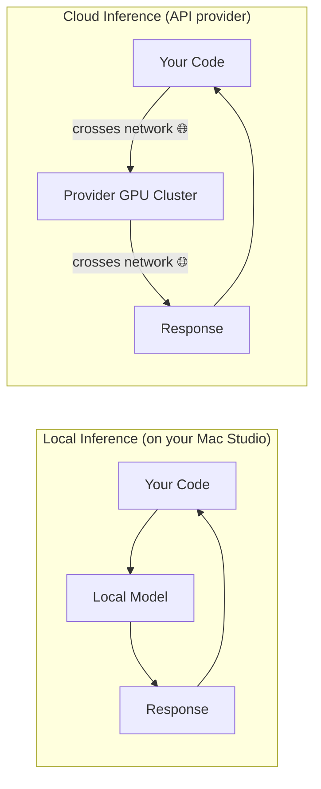
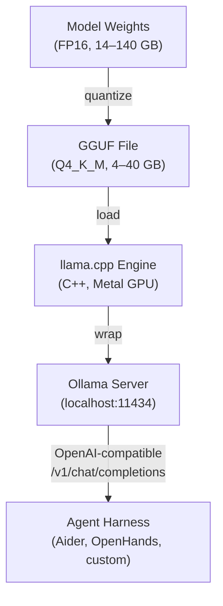
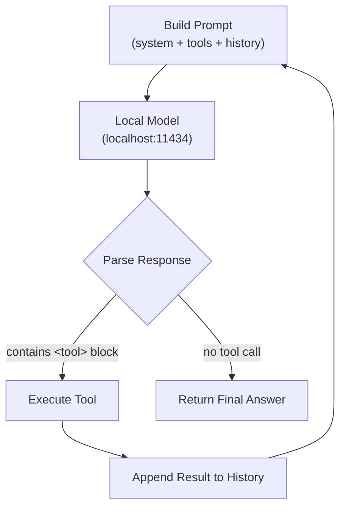

# 8.2 Local-First: Running Boris on a Mac Studio

> **How to read this chapter**
>
> This chapter runs bazaar agents from Section 8.1 on your own hardware — no
> cloud, no API keys. (1) **Understand now** — why local matters.
> (2) **Memorize** — hardware sizing and the endpoint-swap pattern.
> (3) **Reference later** — the local-vs-cloud router. Every example is
> self-contained Python you can run from `./src`.

## Why This Matters

Section 8.1 introduced the bazaar — open-source agents you can inspect, fork, and recombine. But your code still leaves your machine. Every prompt sent to a cloud API transits someone else's GPU cluster. For Boris (Section 1.2) on a defense contract, that is a non-starter.

The fix: Aider, OpenHands, and SWE-agent can point at a *local* endpoint instead of `api.openai.com`. Ollama serves models on `localhost:11434` with the same API shape. Swap the URL, keep the workflow.

> **Key idea:** Local-first is not anti-cloud. It is a *privacy boundary* you
> control, with a cloud escape hatch for tasks that exceed local capability.

## Deliverable

By the end you will have: (1) a local-vs-cloud framework, (2) a simulated inference stack, (3) a hardware-sizing calculator, (4) a local agent harness from Section 5.1, and (5) a task-routing function.

## Concept Loop 1 — Why Local Matters

Four forces push developers toward local inference:

**Privacy.** Trade secrets and classified material cannot safely transit third-party APIs. Air-gapped environments have no outbound network at all.
**Latency.** Cloud adds 200–800 ms overhead. Apple Silicon with a quantized model drops first-token latency below 100 ms — "thinking with the machine" instead of waiting.
**Cost.** Marginal cost is electricity (~$0.001/hr on a Mac Studio) vs. $2.50–$3.00 per million tokens in the cloud. High-volume agentic loops pay for hardware in weeks.
**Offline.** Airplanes, restricted networks, disaster recovery — local works without internet.

> **Tip:** A local fallback means your agent harness degrades gracefully when
> the API is unreachable — a UPS for your coding workflow.

| Dimension | Local | Cloud |
|-----------|-------|-------|
| **Privacy** | Code never leaves machine | Code transits third-party servers |
| **Latency (first token)** | < 100 ms (Apple Silicon) | 200–800 ms (network + queue) |
| **Marginal cost/token** | ≈ $0 (electricity) | $0.50–$15 per 1M tokens |
| **Offline capable** | Yes | No |



> **Key idea:** The decision is not about capability — it is about *control*.
> Local controls privacy, cost, and availability. Cloud controls model ceiling.

**Example 8-6. Local vs. Cloud Trade-off Scorer**

```python
"""Example 8-6. Score whether a task should run locally or in the cloud."""

from dataclasses import dataclass

@dataclass
class TaskProfile:
    name: str
    contains_sensitive_data: bool
    requires_frontier_reasoning: bool
    expected_tokens: int          # approximate total tokens
    network_available: bool

def recommend(task: TaskProfile) -> str:
    """Return 'local', 'cloud', or 'hybrid' with reasoning."""
    score_local = 0
    reasons = []
    if task.contains_sensitive_data:
        score_local += 3
        reasons.append("sensitive data stays on-device")
    if not task.network_available:
        score_local += 5
        reasons.append("no network — local is only option")
    if task.expected_tokens > 500_000:
        score_local += 2
        reasons.append(f"{task.expected_tokens:,} tokens cheaper locally")
    if task.requires_frontier_reasoning:
        score_local -= 3
        reasons.append("frontier model needed — cloud advantage")

    if score_local >= 4:
        return f"LOCAL  ({', '.join(reasons)})"
    elif score_local <= -1:
        return f"CLOUD  ({', '.join(reasons)})"
    return f"HYBRID ({', '.join(reasons)})"

tasks = [
    TaskProfile("HIPAA patient pipeline", True, False, 800_000, True),
    TaskProfile("Novel algorithm design", False, True, 50_000, True),
    TaskProfile("Airplane refactor",      False, False, 200_000, False),
    TaskProfile("Classified code review",  True, False, 100_000, False),
]

for t in tasks:
    print(f"{t.name:30s} → {recommend(t)}")
```

**Expected output:**
```         → LOCAL  (sensitive data stays on-device, 800,000 tokens cheaper locally)
Novel algorithm design         → CLOUD  (frontier model needed — cloud advantage)
Airplane refactor              → LOCAL  (no network — local is only option)
Classified code review         → LOCAL  (sensitive data stays on-device, no network — local is only option)
```

> **Check yourself:** *Boris works on a classified project in an air-gapped lab.
> Which two table dimensions make the decision trivial?*
> (Hint: privacy and offline — both collapse the decision space.)

## Concept Loop 2 — The Local Inference Stack

Running a model locally requires a four-layer stack:

1. **Model weights** — Raw parameters in FP16/BF16. A 7B model is ~14 GB; a 70B is ~140 GB.
2. **Quantization** — GGUF format: Q4_K_M (~4.5 bits), Q5_K_M (~5.5), Q8_0 (~8). A 70B at Q4_K_M fits in ~40 GB.
3. **Inference engine** — llama.cpp (C++, Metal GPU), wrapped by Ollama with Docker-like UX.
4. **HTTP API** — OpenAI-compatible `/v1/chat/completions` on localhost. Your agent talks HTTP/JSON.

> **Key idea:** Ollama is the "Docker for LLMs" — `ollama pull`, `ollama run`,
> `ollama serve` mirror Docker commands. Know Docker, know the mental model.



> **Tip:** You do not need to quantize yourself. `ollama pull qwen2.5-coder:7b-instruct-q4_K_M`
> downloads a pre-quantized, ready-to-serve file in under a minute.

**Example 8-7. Simulated Local Inference Server and Client**

```python
"""Example 8-7. Simulate an Ollama-compatible local API server and client."""

import json
import threading
from http.server import HTTPServer, BaseHTTPRequestHandler
from urllib.request import urlopen, Request

# --- Simulated Ollama-compatible server ---
class LocalModelHandler(BaseHTTPRequestHandler):
    """Handles /v1/chat/completions like Ollama does."""
    def do_POST(self):
        length = int(self.headers.get("Content-Length", 0))
        body = json.loads(self.rfile.read(length))
        model = body.get("model", "unknown")
        messages = body.get("messages", [])
        user_msg = messages[-1]["content"] if messages else ""
        # Simulate model response
        reply = {
            "choices": [{"message": {
                "role": "assistant",
                "content": f"[{model}] Processed: {user_msg[:40]}"
            }}]
        }
        self.send_response(200)
        self.send_header("Content-Type", "application/json")
        self.end_headers()
        self.wfile.write(json.dumps(reply).encode())

    def log_message(self, format, *args):
        pass  # Silence request logs

# --- Client that talks to the local endpoint ---
def chat_local(prompt: str, model: str = "qwen2.5-coder:7b",
               base_url: str = "http://127.0.0.1:9817") -> str:
    payload = json.dumps({
        "model": model,
        "messages": [{"role": "user", "content": prompt}],
    }).encode()
    req = Request(f"{base_url}/v1/chat/completions",
                  data=payload,
                  headers={"Content-Type": "application/json"})
    with urlopen(req) as resp:
        data = json.loads(resp.read())
    return data["choices"][0]["message"]["content"]

# --- Run server in background, make requests, shut down ---
server = HTTPServer(("127.0.0.1", 9817), LocalModelHandler)
thread = threading.Thread(target=server.serve_forever, daemon=True)
thread.start()

for prompt in ["Fix the null check in auth.py", "Add unit tests for parser"]:
    result = chat_local(prompt)
    print(result)

server.shutdown()
print("Server stopped — all data stayed on localhost.")
```

**Expected output:**
```
[qwen2.5-coder:7b] Processed: Fix the null check in auth.py
[qwen2.5-coder:7b] Processed: Add unit tests for parser
Server stopped — all data stayed on localhost.
```

> **Check yourself:** *What single line change points this client at OpenAI's cloud API?*
> (Hint: the `base_url` parameter — the JSON schema is the same.)

## Concept Loop 3 — Hardware Reality Check

Loading a model that exceeds RAM triggers swap, dropping generation from 30 tok/s to 0.5 — unusable.

**Unified memory advantage.** Apple Silicon shares one pool across CPU/GPU/Neural Engine. A Mac Studio M2 Ultra (192 GB) loads a 70B Q4_K_M (~40 GB) easily; on Linux you need a $10K+ A100.
**Memory bandwidth is the bottleneck.** Each token reads the full model: tok/s ≈ bandwidth ÷ model_size. M2 Ultra (800 GB/s) + 40 GB → ~20 tok/s; M1 (68 GB/s) + 4 GB → ~17 tok/s.

> **Warning:** If your model does not fit in RAM, do not try. Swap-based
> inference is 50–100× slower. A fast 7B beats a swapping 70B every time.

| Hardware | Unified Memory | Bandwidth (GB/s) | Max Model (Q4_K_M) | Est. tok/s (Q4) |
|----------|---------------|-------------------|---------------------|-----------------|
| M1 MacBook Air | 16 GB | 68 | 7B (~4 GB) | ~17 |
| M2 Pro Mac Mini | 32 GB | 200 | 13B (~8 GB) | ~25 |
| M3 Max MacBook Pro | 96 GB | 400 | 70B (~40 GB) | ~10 |
| M4 Ultra Mac Studio | 192 GB | 819 | 70B + context headroom | ~20 |

> **Tip:** Reserve 8–12 GB for the OS. A 96 GB machine effectively has ~84 GB for models.

**Example 8-8. Hardware Sizing Calculator**

```python
"""Example 8-8. Estimate tokens/sec for a given hardware + model combo."""

from dataclasses import dataclass

@dataclass
class Hardware:
    name: str
    memory_gb: float
    bandwidth_gb_s: float
    reserved_gb: float = 10.0  # OS + apps

    @property
    def available_gb(self) -> float:
        return self.memory_gb - self.reserved_gb

@dataclass
class Model:
    name: str
    params_b: float      # billions of parameters
    bits: float           # quantization bits (e.g., 4.5 for Q4_K_M)

    @property
    def size_gb(self) -> float:
        return round(self.params_b * self.bits / 8, 1)

def estimate(hw: Hardware, model: Model) -> str:
    fits = model.size_gb <= hw.available_gb
    if not fits:
        return (f"  {hw.name:25s} + {model.name:20s} → "
                f"DOES NOT FIT ({model.size_gb} GB > {hw.available_gb} GB avail)")
    tok_s = hw.bandwidth_gb_s / model.size_gb
    return (f"  {hw.name:25s} + {model.name:20s} → "
            f"{model.size_gb:5.1f} GB, ~{tok_s:.0f} tok/s ✓")

machines = [
    Hardware("M1 MacBook Air",     16,  68),
    Hardware("M2 Pro Mac Mini",    32,  200),
    Hardware("M3 Max MacBook Pro", 96,  400),
    Hardware("M4 Ultra Mac Studio", 192, 819),
]
models = [
    Model("Qwen2.5-Coder 7B Q4",  7,  4.5),
    Model("DeepSeek-Coder 33B Q4", 33, 4.5),
    Model("Llama-3 70B Q4",        70, 4.5),
]

print("Hardware Sizing Report")
print("=" * 72)
for m in models:
    print(f"\n{m.name} ({m.size_gb} GB at {m.bits}-bit):")
    for hw in machines:
        print(estimate(hw, m))
```

**Expected output:**
```
Hardware Sizing Report
========================================================================

Qwen2.5-Coder 7B Q4 (3.9 GB at 4.5-bit):
  M1 MacBook Air            + Qwen2.5-Coder 7B Q4     →   3.9 GB, ~17 tok/s ✓
  M2 Pro Mac Mini           + Qwen2.5-Coder 7B Q4     →   3.9 GB, ~51 tok/s ✓
  M3 Max MacBook Pro        + Qwen2.5-Coder 7B Q4     →   3.9 GB, ~103 tok/s ✓
  M4 Ultra Mac Studio       + Qwen2.5-Coder 7B Q4     →   3.9 GB, ~210 tok/s ✓

DeepSeek-Coder 33B Q4 (18.6 GB at 4.5-bit):
  M1 MacBook Air            + DeepSeek-Coder 33B Q4   →   DOES NOT FIT (18.6 GB > 6.0 GB avail)
  M2 Pro Mac Mini           + DeepSeek-Coder 33B Q4   →  18.6 GB, ~11 tok/s ✓
  M3 Max MacBook Pro        + DeepSeek-Coder 33B Q4   →  18.6 GB, ~22 tok/s ✓
  M4 Ultra Mac Studio       + DeepSeek-Coder 33B Q4   →  18.6 GB, ~44 tok/s ✓

Llama-3 70B Q4 (39.4 GB at 4.5-bit):
  M1 MacBook Air            + Llama-3 70B Q4           →   DOES NOT FIT (39.4 GB > 6.0 GB avail)
  M2 Pro Mac Mini           + Llama-3 70B Q4           →   DOES NOT FIT (39.4 GB > 22.0 GB avail)
  M3 Max MacBook Pro        + Llama-3 70B Q4           →  39.4 GB, ~10 tok/s ✓
  M4 Ultra Mac Studio       + Llama-3 70B Q4           →  39.4 GB, ~21 tok/s ✓
```

> **Check yourself:** *Why does memory bandwidth — not FLOPs — determine token
> generation speed? What changes during prefill?*
> (Hint: generation reads all weights per token; prefill processes many tokens in parallel.)

## Concept Loop 4 — Wiring a Local Agent

**The agent harness from Section 5.1 does not care where the model lives.** Swap `api.openai.com` for `localhost:11434` — the tool-calling loop works identically.
The catch: local models often lack native function-calling. The workaround is *prompt-based tool calling* — describe tools in the system prompt, parse text for `<tool>` blocks. Same pattern Aider uses (Section 8.1).

> **Key idea:** Prompt-based tool calling works with *any* instruction-following
> model — no server-side support required. (Cross-ref Section 5.1.)



> **Warning:** Local models are more prone to formatting errors. Always validate
> parsed tool calls before execution — malformed JSON should trigger a retry,
> not a crash. (Cross-ref Section 2.2 on graceful degradation.)

**Example 8-9. Minimal Local Agent with Tool Calling**

```python
"""Example 8-9. A local agent harness with prompt-based tool calling."""

import json
import re
from dataclasses import dataclass, field

@dataclass
class Tool:
    name: str
    description: str
    handler: object  # callable

@dataclass
class LocalAgent:
    tools: dict = field(default_factory=dict)
    history: list = field(default_factory=list)

    def register(self, name: str, description: str, handler):
        self.tools[name] = Tool(name, description, handler)

    def _build_prompt(self, user_msg: str) -> str:
        tool_desc = "\n".join(
            f"- {t.name}: {t.description}" for t in self.tools.values()
        )
        return (
            f"You have these tools:\n{tool_desc}\n"
            f"To call a tool, respond with: <tool>{'{'}\"name\": ..., "
            f"\"args\": ...{'}'}</tool>\n"
            f"Otherwise, respond with plain text.\n\n"
            f"User: {user_msg}"
        )

    def _simulate_model(self, prompt: str) -> str:
        """Simulate a local model that calls tools when appropriate."""
        user_part = prompt.split("User: ")[-1].lower()
        if "list files" in user_part and "tool result" not in user_part:
            return '<tool>{"name": "list_files", "args": {"dir": "."}}</tool>'
        if "count lines" in user_part and "tool result" not in user_part:
            return '<tool>{"name": "count_lines", "args": {"file": "main.py"}}</tool>'
        return "I'll help with that — no tool needed."

    def _parse_tool_call(self, response: str):
        match = re.search(r"<tool>(.*?)</tool>", response, re.DOTALL)
        if match:
            return json.loads(match.group(1))
        return None

    def run(self, user_msg: str, max_steps: int = 3) -> str:
        self.history.append({"role": "user", "content": user_msg})
        for step in range(max_steps):
            prompt = self._build_prompt(user_msg)
            response = self._simulate_model(prompt)
            tool_call = self._parse_tool_call(response)
            if tool_call is None:
                return response
            tool = self.tools.get(tool_call["name"])
            if not tool:
                return f"Error: unknown tool {tool_call['name']}"
            result = tool.handler(**tool_call["args"])
            print(f"  Step {step+1}: called {tool_call['name']} → {result}")
            user_msg = f"Tool result: {result}. Now answer the original question."
        return "Max steps reached."

# --- Register tools and run ---
agent = LocalAgent()
agent.register("list_files", "List files in a directory",
               lambda dir=".": "main.py, utils.py, test_main.py")
agent.register("count_lines", "Count lines in a file",
               lambda file="": f"{file}: 142 lines")

print("Query 1: 'List files in the project'")
print(f"  Answer: {agent.run('List files in the project')}\n")

print("Query 2: 'Count lines in main.py'")
print(f"  Answer: {agent.run('Count lines in main.py')}\n")

print("Query 3: 'What is Python?'")
print(f"  Answer: {agent.run('What is Python?')}")
```

**Expected output:**
```
Query 1: 'List files in the project'
  Step 1: called list_files → main.py, utils.py, test_main.py
  Answer: I'll help with that — no tool needed.

Query 2: 'Count lines in main.py'
  Step 1: called count_lines → main.py: 142 lines
  Answer: I'll help with that — no tool needed.

Query 3: 'What is Python?'
  Answer: I'll help with that — no tool needed.
```

> **Pitfall:** In production, replace `_simulate_model` with an HTTP call to
> Ollama (like Example 8-7's `chat_local`). The rest stays identical — that
> is the endpoint-swap pattern.
> **Check yourself:** *What advantage does prompt-based tool calling have over
> API-level function calling when targeting a local 7B model?*
> (Hint: most local models lack built-in function-calling support.)

## Concept Loop 5 — When to Stay Local vs. When to Call Home

The pragmatic answer is *hybrid*: local for most tasks, cloud when the task exceeds local capability. Three heuristics:

1. **Complexity.** Completions, refactors, and tests work with 7B–33B local models. Novel algorithms and cross-repo reasoning need frontier 400B+ cloud models.
2. **Token budget.** 100K+ tokens exceed local 8K–32K windows; cloud models offer 128K–200K.
3. **Privacy.** Sensitive data stays local regardless of complexity. Use cloud only for non-sensitive subtasks.

> **Key idea:** The best setup is a *router* that picks the right backend per
> task — like OpenRouter (Section 5.2), with localhost as a first-class
> destination. (Cross-ref Section 7.1 on local-friendly models.)

At $2.50/M tokens a cloud session costs $5–$20; locally, pennies. Route bulk work locally.

> **Tip:** Start rule: if the prompt fits in 8K tokens and needs no frontier
> reasoning, route locally. Refine as you collect data.

**Example 8-10. Local-First Router with Cloud Fallback**

```python
"""Example 8-10. Route tasks to local or cloud based on complexity scoring."""

from dataclasses import dataclass
from enum import Enum

class Route(Enum):
    LOCAL = "local"
    CLOUD = "cloud"

@dataclass
class Task:
    description: str
    estimated_tokens: int
    complexity: int          # 1-5 scale
    contains_pii: bool

@dataclass
class RouterConfig:
    local_context_limit: int = 8192
    complexity_threshold: int = 4    # route to cloud if >= this
    local_model: str = "qwen2.5-coder:7b"
    cloud_model: str = "gpt-4o"

def route_task(task: Task, config: RouterConfig) -> tuple:
    """Decide local vs cloud. Returns (route, model, reasons)."""
    reasons = []
    # Privacy override: sensitive data always stays local
    if task.contains_pii:
        reasons.append("PII detected — forcing local")
        return (Route.LOCAL, config.local_model, reasons)
    # Complexity check
    if task.complexity >= config.complexity_threshold:
        reasons.append(f"complexity {task.complexity}/5 exceeds threshold")
        return (Route.CLOUD, config.cloud_model, reasons)
    # Context window check
    if task.estimated_tokens > config.local_context_limit:
        reasons.append(f"{task.estimated_tokens:,} tokens > local limit")
        return (Route.CLOUD, config.cloud_model, reasons)
    reasons.append("within local capability")
    return (Route.LOCAL, config.local_model, reasons)

# --- Boris's task queue on the Mac Studio ---
config = RouterConfig()
tasks = [
    Task("Fix null check in auth.py",      500,   2, False),
    Task("Refactor patient records module", 3000,  3, True),
    Task("Design novel caching algorithm",  12000, 5, False),
    Task("Generate unit tests for utils",   2000,  2, False),
    Task("Analyze 50-file dependency graph", 45000, 3, False),
]

print("Boris's Task Router — Mac Studio")
print("=" * 60)
for t in tasks:
    route, model, reasons = route_task(t, config)
    icon = "🏠" if route == Route.LOCAL else "☁️"
    print(f"{icon} {t.description:40s} → {model}")
    print(f"   Reason: {'; '.join(reasons)}")
```

**Expected output:**
```
Boris's Task Router — Mac Studio
============================================================
🏠 Fix null check in auth.py                 → qwen2.5-coder:7b
   Reason: within local capability
🏠 Refactor patient records module            → qwen2.5-coder:7b
   Reason: PII detected — forcing local
☁️ Design novel caching algorithm             → gpt-4o
   Reason: complexity 5/5 exceeds threshold
🏠 Generate unit tests for utils              → qwen2.5-coder:7b
   Reason: within local capability
☁️ Analyze 50-file dependency graph           → gpt-4o
   Reason: 45,000 tokens > local limit
```

> **Pitfall:** Do not hard-code the heuristic. Track which tasks succeed/fail on
> each backend and adjust thresholds monthly. A model upgrade (e.g., Qwen3) can
> shift the complexity boundary significantly.
> **Check yourself:** *Boris upgrades from 7B to 33B. How should the router's
> `complexity_threshold` and `local_context_limit` change — and why?*
> (Hint: larger models handle harder tasks and often support wider context windows.)

## What We Built

1. **Local-first case** — privacy, latency, cost, and offline as the four pillars.
2. **Inference stack** — weights → GGUF quantization → llama.cpp/Ollama → OpenAI-compatible HTTP API.
3. **Hardware sizing** — memory-bandwidth calculator to predict tok/s and prevent swap-death.
4. **Local agent** — endpoint-swap pattern plus prompt-based tool calling against localhost.
5. **Router** — local-first, cloud-fallback function considering complexity, tokens, and privacy.

> **Pitfall:** Local inference is not "set and forget." Models improve monthly,
> quantization evolves, and Apple ships new silicon annually. Revisit your
> hardware-model fit quarterly.

## Verification Checklist

- [ ] List four reasons for local inference over cloud.
- [ ] Draw the four-layer inference stack from memory.
- [ ] Calculate model fit using the bandwidth rule.
- [ ] Explain the endpoint-swap pattern for localhost.
- [ ] Compare prompt-based vs. API-level tool calling.
- [ ] Describe local-first, cloud-fallback routing.
- [ ] Confirm Examples 8-6–8-10 produce documented output.

## Wrapping Up — Exercises

**Exercise 8.5 — Quantization Comparison:** Extend Example 8-8 to compare Q4_K_M, Q5_K_M, and Q8_0 for a 33B model across all four hardware configs. At which level does it first fit on the M2 Pro? (Cross-ref Section 7.1.)
**Exercise 8.6 — Retry Logic:** Modify Example 8-9 so `_parse_tool_call` retries (up to 2×) on `JSONDecodeError` by appending a "format as valid JSON" instruction. Compare to Aider's error recovery (Section 8.1).
**Exercise 8.7 — Confidence Routing:** Extend Example 8-10 with a `confidence_score` (0.0–1.0). Re-route to cloud if < 0.6. Test with five tasks. (Cross-ref Section 5.2.)
**Exercise 8.8 — Full Boris Stack:** Combine all five examples into a `BorisStation` dataclass. Add a `diagnose()` health check. Run for two hardware configs.

*Next: Section 8.3 — the geopolitics of local inference: export controls, model
licensing, and why "running it yourself" carries legal dimensions Boris must navigate.*
