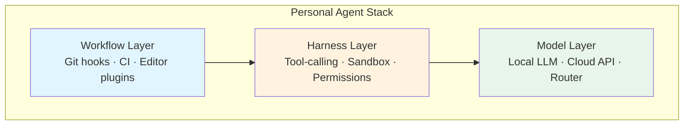
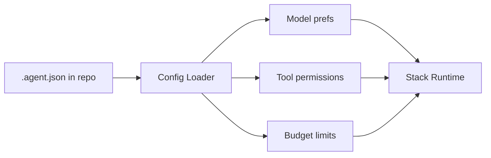
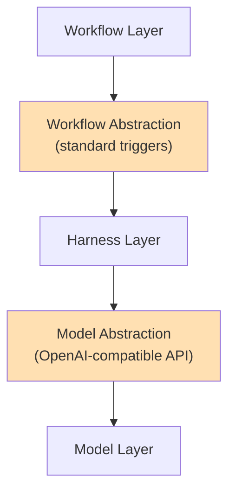

# 8.3 The Rise of the Personal Agent Stack

> **How to read this section**
>
> This section closes Part IV by giving you a blueprint for assembling your own
> agent toolkit — a personal stack of model, harness, and workflow layers that
> fits *your* projects, threat model, and budget. Focus on:
>
> 1. **Understand now** — the personal stack concept and three-layer architecture
> 2. **Memorize** — the configuration-as-code pattern and daily workflow templates
> 3. **Reference later** — the future-proofing checklist
>
> Every code example is self-contained Python you can run from `./src`.

---

## Why This Matters

Section 8.1 mapped the bazaar of open-source agents — Aider, OpenHands,
SWE-agent — and showed that no single tool wins every task. Section 8.2 proved
that local-first inference lets you run those agents on your own hardware,
swapping endpoints without changing a line of application code. The natural
next step is *curation*: picking the model that fits your latency budget, the
harness that matches your trust model, and the workflows that accelerate your
daily rhythm. This is the dotfiles moment for the AI era — the point where
every developer assembles a personal configuration that is as unique and
portable as their `.vimrc` or `.zshrc`. The Unix philosophy from Section 1.1
told us to build small, composable tools. A personal agent stack applies that
same philosophy to the AI layer.

> **Key idea:** Your personal agent stack is the `.dotfiles` of the AI era —
> a curated, portable, composable configuration of model, harness, and workflow
> that travels with you across projects and machines.

---

## Deliverable

By the end of this section you will have:

1. A mental model of the **personal stack concept** and why composability beats monoliths
2. A **three-layer architecture** diagram separating model, harness, and workflow concerns
3. A **configuration-as-code** pattern for agent preferences, permissions, and budgets
4. A **daily workflow template** that routes tasks to the right agent at the right time
5. A **future-proofing checklist** for avoiding lock-in and keeping your stack portable

---

## Concept Loop 1 — The Personal Stack Concept

### Concept

Every developer already curates a personal toolkit: shell, editor, linter, Git
aliases, CI templates. The arrival of coding agents adds a new dimension — but
the principle is identical. You do not adopt a monolithic "AI IDE" and accept
every default. You *compose* a stack from interchangeable parts, just as the
Unix philosophy (Section 1.1) composes `grep | sort | uniq` into pipelines
that no single program could replicate.

The bazaar of agents catalogued in Section 8.1 gives you the raw ingredients.
Local-first inference from Section 8.2 gives you the deployment freedom. The
personal stack is where those ingredients meet your judgment.

| Dimension          | Monolithic Agent Suite          | Personal Agent Stack               |
|--------------------|---------------------------------|------------------------------------|
| Model choice       | Vendor-locked (one provider)    | Swap any model via endpoint config |
| Tool permissions   | All-or-nothing                  | Per-tool allow/deny list           |
| Workflow triggers  | Built-in only                   | Git hooks, CI, editor plugins      |
| Budget control     | Monthly subscription            | Per-task token budgets             |
| Portability        | Tied to one IDE/platform        | Travels as config files            |
| Upgrade path       | Wait for vendor release         | Swap one layer, keep the rest      |

> **Key idea:** Composability over monoliths — a personal stack lets you
> upgrade one layer without rebuilding the others.

**Example 8-11. Personal Agent Stack Inventory**

```python
"""Example 8-11. Model a personal agent stack and score compatibility."""

from dataclasses import dataclass, field
from typing import List

@dataclass
class StackLayer:
    name: str
    kind: str          # "model", "harness", or "workflow"
    open_source: bool
    supports_swap: bool  # can be replaced without changing other layers

@dataclass
class PersonalStack:
    owner: str
    layers: List[StackLayer] = field(default_factory=list)

    def compatibility_score(self) -> int:
        """0-100 score: higher means more composable and portable."""
        if not self.layers:
            return 0
        score = 0
        for layer in self.layers:
            if layer.open_source:
                score += 15
            if layer.supports_swap:
                score += 20
        # Bonus if all three kinds are covered
        kinds = {l.kind for l in self.layers}
        if kinds == {"model", "harness", "workflow"}:
            score += 5
        return min(score, 100)

    def report(self) -> str:
        lines = [f"Stack for {self.owner}", "=" * 40]
        for layer in self.layers:
            swap = "swappable" if layer.supports_swap else "locked"
            oss = "open-source" if layer.open_source else "proprietary"
            lines.append(f"  [{layer.kind:8s}] {layer.name:20s} ({oss}, {swap})")
        lines.append(f"  Compatibility score: {self.compatibility_score()}/100")
        return "\n".join(lines)

# Build two example stacks
alice = PersonalStack("Alice", [
    StackLayer("Qwen-3 (local)",    "model",    open_source=True,  supports_swap=True),
    StackLayer("Aider",             "harness",  open_source=True,  supports_swap=True),
    StackLayer("Git-hooks + CI",    "workflow",  open_source=True,  supports_swap=True),
])
bob = PersonalStack("Bob", [
    StackLayer("GPT-4o (cloud)",    "model",    open_source=False, supports_swap=True),
    StackLayer("Copilot Workspace", "harness",  open_source=False, supports_swap=False),
    StackLayer("VS Code built-in",  "workflow",  open_source=False, supports_swap=False),
])

print(alice.report())
print()
print(bob.report())
```

**Expected output:**

```
Stack for Alice
========================================
  [model   ] Qwen-3 (local)       (open-source, swappable)
  [harness ] Aider                (open-source, swappable)
  [workflow] Git-hooks + CI       (open-source, swappable)
  Compatibility score: 100/100

Stack for Bob
========================================
  [model   ] GPT-4o (cloud)       (proprietary, swappable)
  [harness ] Copilot Workspace    (proprietary, locked)
  [workflow] VS Code built-in     (proprietary, locked)
  Compatibility score: 25/100
```

> **Check yourself:** *If Alice swaps her model layer from Qwen-3 to DeepSeek-R1
> without touching her harness or workflow, what does that tell you about the
> value of the `supports_swap` property?*
> (Hint: the swap is invisible to the rest of the stack — that is composability.)

---

## Concept Loop 2 — The Three Layers

### Concept

Every personal agent stack decomposes into three layers, each with a distinct
responsibility:

1. **Model layer** — the LLM itself, local (Section 8.2) or cloud-hosted.
   Determines reasoning quality, latency, and cost ceiling.
2. **Harness layer** — the tool-calling and sandboxed-execution shell around the
   model. Controls what the agent *can do*: file writes, shell commands, network
   access (Section 5.1).
3. **Workflow layer** — the integration surface: Git hooks, CI pipelines, editor
   plugins, Slack bots. Determines *when* and *where* the agent activates.

Separation of concerns is the load-bearing principle. When the model layer
upgrades from Qwen-2.5 to Qwen-3, the harness and workflow layers are
untouched. When you switch harnesses from Aider to OpenHands (Section 8.1),
the model and workflow layers remain stable. Section 5.2's OpenRouter routing
already demonstrated this at the model level; the three-layer stack extends
the idea to the full agent experience.



> **Key idea:** Separation of concerns — each layer can be upgraded, swapped,
> or debugged independently without cascading changes.

**Example 8-12. Three-Layer Stack Validator**

```python
"""Example 8-12. Validate that a three-layer stack is properly connected."""

from dataclasses import dataclass
from typing import Optional

@dataclass
class ModelLayer:
    name: str
    api_compatible: bool   # speaks a standard chat-completion API

@dataclass
class HarnessLayer:
    name: str
    expects_api: bool      # needs a chat-completion API from model
    exposes_tools: bool    # provides tool interface to workflow

@dataclass
class WorkflowLayer:
    name: str
    needs_tools: bool      # requires tool interface from harness

@dataclass
class StackConfig:
    model: ModelLayer
    harness: HarnessLayer
    workflow: WorkflowLayer

    def validate(self) -> list:
        """Return list of connection errors; empty means valid."""
        errors = []
        if self.harness.expects_api and not self.model.api_compatible:
            errors.append(
                f"BREAK: {self.harness.name} expects API but "
                f"{self.model.name} is not API-compatible"
            )
        if self.workflow.needs_tools and not self.harness.exposes_tools:
            errors.append(
                f"BREAK: {self.workflow.name} needs tools but "
                f"{self.harness.name} exposes no tool interface"
            )
        if not errors:
            errors.append("OK: all layers properly connected")
        return errors

# Valid stack
good = StackConfig(
    model=ModelLayer("DeepSeek-R1 (local)", api_compatible=True),
    harness=HarnessLayer("Aider", expects_api=True, exposes_tools=True),
    workflow=WorkflowLayer("Git pre-commit hook", needs_tools=True),
)
# Broken stack — model has no standard API
broken = StackConfig(
    model=ModelLayer("CustomFinetune-v1", api_compatible=False),
    harness=HarnessLayer("OpenHands", expects_api=True, exposes_tools=True),
    workflow=WorkflowLayer("CI pipeline", needs_tools=True),
)

for label, stack in [("Good stack", good), ("Broken stack", broken)]:
    result = stack.validate()
    for msg in result:
        print(f"  [{label}] {msg}")
```

**Expected output:**

```
  [Good stack] OK: all layers properly connected
  [Broken stack] BREAK: OpenHands expects API but CustomFinetune-v1 is not API-compatible
```

> **Check yourself:** *If you remove the harness layer entirely and connect the
> workflow directly to the model, what two capabilities do you lose?*
> (Hint: tool-calling orchestration and sandboxed execution — Section 5.1.)

---

## Concept Loop 3 — Configuration as Code

### Concept

Your personal stack should be declarative — a config file you check into your
dotfiles repo, not a series of manual GUI toggles. Think `.agent.json`
alongside `.editorconfig` and `.prettierrc`. The config captures three things:
model preferences (which endpoint, which parameters), tool permissions (which
shell commands the agent may invoke), and budget limits (max tokens per task,
max spend per day).



> **Warning:** Never commit API keys or secrets into `.agent.json`. Use
> environment variables or a secrets manager. The config file stores
> *preferences*, not credentials.

**Example 8-13. Agent Config Loader**

```python
"""Example 8-13. Parse and validate an agent config (JSON, stdlib only)."""

import json
from dataclasses import dataclass, field
from typing import List, Dict

SAMPLE_CONFIG = """
{
    "model": {
        "provider": "local",
        "endpoint": "http://localhost:11434/v1",
        "model_name": "qwen3:8b",
        "max_context_tokens": 32000
    },
    "tools": {
        "allowed": ["read_file", "write_file", "run_tests"],
        "denied": ["rm_rf", "curl_external", "install_package"]
    },
    "budget": {
        "max_tokens_per_task": 50000,
        "max_tasks_per_day": 40,
        "warn_at_percent": 80
    }
}
"""

@dataclass
class AgentConfig:
    provider: str
    endpoint: str
    model_name: str
    max_context: int
    allowed_tools: List[str]
    denied_tools: List[str]
    max_tokens_per_task: int
    max_tasks_per_day: int
    warn_at_percent: int

    def validate(self) -> List[str]:
        issues = []
        overlap = set(self.allowed_tools) & set(self.denied_tools)
        if overlap:
            issues.append(f"Tool conflict: {overlap} in both allow and deny")
        if self.max_tokens_per_task > self.max_context:
            issues.append("Task token limit exceeds model context window")
        if self.warn_at_percent >= 100:
            issues.append("Warning threshold must be below 100%")
        if not issues:
            issues.append("Config valid — no issues found")
        return issues

    def check_tool(self, tool: str) -> str:
        if tool in self.denied_tools:
            return "DENIED"
        if tool in self.allowed_tools:
            return "ALLOWED"
        return "UNLISTED (default deny)"

def load_config(raw: str) -> AgentConfig:
    data = json.loads(raw)
    return AgentConfig(
        provider=data["model"]["provider"],
        endpoint=data["model"]["endpoint"],
        model_name=data["model"]["model_name"],
        max_context=data["model"]["max_context_tokens"],
        allowed_tools=data["tools"]["allowed"],
        denied_tools=data["tools"]["denied"],
        max_tokens_per_task=data["budget"]["max_tokens_per_task"],
        max_tasks_per_day=data["budget"]["max_tasks_per_day"],
        warn_at_percent=data["budget"]["warn_at_percent"],
    )

cfg = load_config(SAMPLE_CONFIG)
print("Validation:", cfg.validate())
print()
for tool in ["read_file", "rm_rf", "deploy_prod"]:
    print(f"  Tool '{tool}': {cfg.check_tool(tool)}")
```

**Expected output:**

```
Validation: ['Config valid — no issues found']

  Tool 'read_file': ALLOWED
  Tool 'rm_rf': DENIED
  Tool 'deploy_prod': UNLISTED (default deny)
```

> **Check yourself:** *You want to add `run_lint` as an allowed tool. Which
> section of the JSON config do you edit, and what must you verify has no
> overlap with the denied list?*
> (Hint: add to `tools.allowed` and ensure it is not also in `tools.denied`.)

---

## Concept Loop 4 — The Daily Workflow

### Concept

A personal agent stack is only useful if it activates at the right moments. The
daily workflow maps common developer tasks to agent assistance, routing each
task through the appropriate layer. The key insight: start with *one* automated
workflow, prove its value, and expand from there.

| Time of Day | Task                        | Agent Role              | Layer Activated       |
|-------------|-----------------------------|-------------------------|-----------------------|
| 08:00       | Morning triage (issues)     | Summarize & prioritize  | Model + Workflow      |
| 09:30       | Feature implementation      | Code generation         | Model + Harness       |
| 11:00       | PR review                   | Diff analysis           | Model + Harness       |
| 14:00       | Test writing                | Test-gen companion      | All three layers      |
| 16:00       | Documentation update        | Doc-gen from code       | Model + Workflow      |
| 17:00       | End-of-day commit summary   | Changelog draft         | Model + Workflow      |

> **Tip:** Start with the lowest-risk workflow — morning triage or commit
> summaries — and expand to code generation only after you trust the sandbox
> boundaries from your harness layer.

**Example 8-14. Daily Workflow Scheduler**

```python
"""Example 8-14. Simulate a developer's daily agent-assisted workflow."""

from dataclasses import dataclass, field
from typing import List

@dataclass
class AgentTask:
    time: str
    name: str
    tokens_estimate: int
    layers: List[str]   # which layers activate

@dataclass
class DailySchedule:
    developer: str
    token_budget: int
    tasks: List[AgentTask] = field(default_factory=list)

    def run(self) -> None:
        spent = 0
        print(f"Daily schedule for {self.developer}")
        print(f"Token budget: {self.token_budget:,}")
        print("-" * 55)
        for task in self.tasks:
            spent += task.tokens_estimate
            over = " ⚠ OVER BUDGET" if spent > self.token_budget else ""
            layers_str = " + ".join(task.layers)
            print(
                f"  {task.time}  {task.name:28s} "
                f"{task.tokens_estimate:>6,} tok  [{layers_str}]{over}"
            )
        print("-" * 55)
        remaining = self.token_budget - spent
        status = "under" if remaining >= 0 else "OVER"
        print(f"  Total: {spent:,} / {self.token_budget:,} ({status} by {abs(remaining):,})")

schedule = DailySchedule("Priya", token_budget=200_000, tasks=[
    AgentTask("08:00", "Morning triage",          12_000, ["model", "workflow"]),
    AgentTask("09:30", "Feature: auth module",    45_000, ["model", "harness"]),
    AgentTask("11:00", "PR review (#342)",        30_000, ["model", "harness"]),
    AgentTask("14:00", "Write integration tests",  55_000, ["model", "harness", "workflow"]),
    AgentTask("16:00", "Update API docs",          25_000, ["model", "workflow"]),
    AgentTask("17:00", "Commit summary",            8_000, ["model", "workflow"]),
])

schedule.run()
```

**Expected output:**

```
Daily schedule for Priya
Token budget: 200,000
-------------------------------------------------------
  08:00  Morning triage                12,000 tok  [model + workflow]
  09:30  Feature: auth module          45,000 tok  [model + harness]
  11:00  PR review (#342)              30,000 tok  [model + harness]
  14:00  Write integration tests       55,000 tok  [model + harness + workflow]
  16:00  Update API docs               25,000 tok  [model + workflow]
  17:00  Commit summary                 8,000 tok  [model + workflow]
-------------------------------------------------------
  Total: 175,000 / 200,000 (under by 25,000)
```

> **Check yourself:** *If Priya could only automate one workflow to start, which
> row in the table gives the best ratio of time saved to risk?*
> (Hint: morning triage and commit summaries are read-only — low risk, high value.)

---

## Concept Loop 5 — Future-Proofing Your Stack

### Concept

The fastest way to accumulate technical debt in the AI era is to hard-code
provider-specific APIs, proprietary tool formats, or model-locked prompts.
Future-proofing means inserting an abstraction layer between each pair of stack
layers so that any component can be swapped without rewriting its neighbors.
Section 5.2 demonstrated this with OpenRouter acting as a model-agnostic
routing layer; the same principle applies to harnesses and workflows.



> **Key idea:** Abstraction layers are the insurance policy of your stack —
> they cost a small amount of indirection today but save a full rewrite
> when you swap providers tomorrow.

> **Warning:** Vendor lock-in often sneaks in through proprietary tool-calling
> formats. If your harness requires a provider-specific function-calling schema,
> you are locked to that provider's ecosystem. Prefer the OpenAI-compatible
> format as a *lingua franca* (Section 5.2).

**Example 8-15. Stack Migration Planner**

```python
"""Example 8-15. Analyze a stack for lock-in risk and suggest migrations."""

from dataclasses import dataclass
from typing import List, Tuple

@dataclass
class Component:
    name: str
    layer: str
    uses_standard_api: bool
    has_abstraction: bool
    vendor_specific_features: int   # count of proprietary hooks

def lock_in_score(c: Component) -> int:
    """0 (fully portable) to 10 (fully locked)."""
    score = 0
    if not c.uses_standard_api:
        score += 4
    if not c.has_abstraction:
        score += 3
    score += min(c.vendor_specific_features, 3)  # cap at 3
    return min(score, 10)

def migration_advice(c: Component) -> str:
    score = lock_in_score(c)
    if score <= 2:
        return "Portable — no action needed"
    if score <= 5:
        return "Moderate risk — add abstraction layer"
    return "High risk — plan migration to open standard"

@dataclass
class MigrationReport:
    components: List[Component]

    def analyze(self) -> None:
        print("Stack Migration Report")
        print("=" * 60)
        total = 0
        for c in self.components:
            score = lock_in_score(c)
            total += score
            advice = migration_advice(c)
            print(
                f"  [{c.layer:8s}] {c.name:22s} "
                f"lock-in: {score:>2}/10  → {advice}"
            )
        avg = total / len(self.components) if self.components else 0
        print("=" * 60)
        grade = "A" if avg <= 2 else "B" if avg <= 4 else "C" if avg <= 6 else "F"
        print(f"  Portability grade: {grade} (avg lock-in {avg:.1f}/10)")

report = MigrationReport([
    Component("Qwen-3 via Ollama",   "model",    True,  True,  0),
    Component("Aider",               "harness",  True,  True,  1),
    Component("Custom Git hooks",    "workflow",  True,  False, 1),
    Component("Proprietary Plugin",  "workflow",  False, False, 3),
])
report.analyze()
```

**Expected output:**

```
Stack Migration Report
============================================================
  [model   ] Qwen-3 via Ollama        lock-in:  0/10  → Portable — no action needed
  [harness ] Aider                     lock-in:  1/10  → Portable — no action needed
  [workflow] Custom Git hooks          lock-in:  4/10  → Moderate risk — add abstraction layer
  [workflow] Proprietary Plugin        lock-in: 10/10  → High risk — plan migration to open standard
============================================================
  Portability grade: B (avg lock-in 3.8/10)
```

> **Check yourself:** *What single change to the "Proprietary Plugin" component
> would cut its lock-in score the most?*
> (Hint: adopting a standard API drops the score by 4 points — the biggest lever.)

---

## What We Built

1. **Personal Stack Concept** — composability over monoliths, treating agent configuration like dotfiles (Example 8-11)
2. **Three-Layer Architecture** — model, harness, and workflow as independent, swappable concerns (Example 8-12)
3. **Configuration as Code** — declarative `.agent.json` with model prefs, tool permissions, and budget limits (Example 8-13)
4. **Daily Workflow Template** — a time-mapped schedule routing developer tasks to the right agent layer (Example 8-14)
5. **Future-Proofing Checklist** — lock-in scoring and migration planning to keep your stack portable (Example 8-15)

> **Pitfall:** Don't over-engineer your stack on day one. Start with a model
> and a single harness. Add the workflow layer only after you trust the
> harness's sandbox boundaries. Configuration-as-code can wait until you have
> two machines to synchronize. Premature abstraction is as dangerous in agent
> stacks as it is in application code.

---

## Verification Checklist

- [ ] Can you explain why composability beats a monolithic agent suite?
- [ ] Can you draw the three-layer architecture from memory and name each layer's responsibility?
- [ ] Can you write an `.agent.json` config with model, tool, and budget sections?
- [ ] Did Examples 8-11 through 8-15 run and produce the expected output?
- [ ] Can you score a component's lock-in risk using the rubric from Example 8-15?
- [ ] Can you name three signs that your stack is drifting toward vendor lock-in?
- [ ] Have you identified the single lowest-risk workflow to automate first?

---

## Wrapping Up — Exercises

**Exercise 8.9 — Stack Comparison Dashboard:** Extend Example 8-11 to compare three or more developer personas (e.g., open-source contributor, enterprise developer, data scientist). Add a `flexibility_report()` method that identifies which persona can adapt fastest when a model provider shuts down. (Cross-ref Section 8.1 on the bazaar of agents.)

**Exercise 8.10 — Config Inheritance:** Extend Example 8-13 so that a project-level `.agent.json` can override a global `~/.agent.json`. Implement a `merge_configs()` function where project settings win on conflict but global defaults fill gaps. Add a `diff_configs()` that shows what changed. (Cross-ref Section 5.3 on OpenCode's configuration.)

**Exercise 8.11 — Budget Forecaster:** Extend Example 8-14 with a five-day work-week simulation. Track cumulative token spend, identify the day most likely to exceed budget, and suggest which task to defer. Add a `rebalance()` method that shifts token-heavy tasks to lighter days. (Cross-ref Section 7.2 on the efficiency gap.)

**Exercise 8.12 — Full Integration: My First Agent Stack:** Combine Examples 8-11 through 8-15 into a single `PersonalAgentStack` class that loads config from JSON (Example 8-13), validates layer connections (Example 8-12), schedules a day of work (Example 8-14), and generates a migration report (Example 8-15). Run the full pipeline for two developer personas and compare portability grades. (Cross-ref Sections 5.1, 5.2, 8.1, 8.2.)

---

## Wrapping Up Part IV

Part IV — *Global Shifting and Open Frontiers* — opened with a tremor that the Western AI establishment preferred to dismiss as noise: DeepSeek-R1 and Qwen-2.5-Coder arriving at frontier-class performance for a fraction of the training cost (Section 7.1). What looked like an anomaly hardened into a pattern in Section 7.2, where the efficiency gap revealed that reasoning quality per dollar had become the metric that actually matters — and that smaller, distilled models were closing the distance to their trillion-parameter elders at an alarming pace. Section 7.3 widened the aperture further, charting how export controls, data-sovereignty laws, and open-weight licensing created a geopolitical chessboard on which code-generation capability is both weapon and commodity. The ground truth was uncomfortable: the assumption that the best agents would always run on the most expensive American infrastructure was no longer safe.

Chapters 8.1 through 8.3 translated that macro disruption into a developer's personal reality. The bazaar of agents (Section 8.1) catalogued the open-source insurgency — Aider, OpenHands, SWE-agent — proving that no cathedral vendor can outpace a community iterating in the open. Local-first inference (Section 8.2) demonstrated that the same bazaar agents run on laptop hardware when paired with quantized open-weight models, reclaiming privacy, latency control, and offline capability in one move. And this section — the personal agent stack — gave you the blueprint for assembling those ingredients into a composable, portable, future-proof toolkit that is as individual as your Git aliases and as durable as your shell config. Part V — *The Acceleralpho Horizon* — now asks what happens when the agents stop waiting for instructions: self-healing codebases that patch their own regressions, synthetic seniors that review pull requests with the judgment of a staff engineer, and the recursive frontier where agents write the agents that write the code. The personal stack you just assembled is the chassis; Part V shows you what the engine looks like when it starts driving itself.
