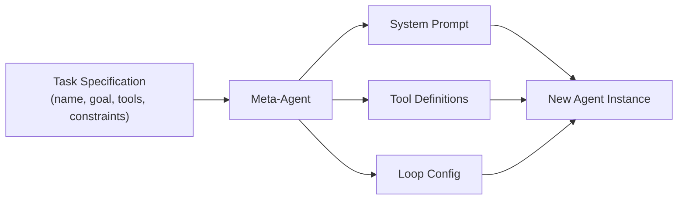
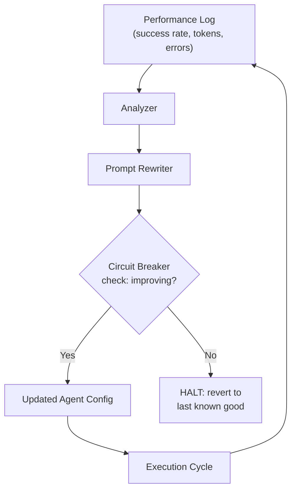
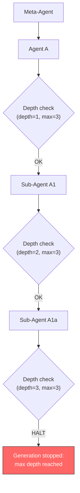

# 10.1 Vile Offspring: Agents Writing Agents
## Welcome to Chapter 10: The Strossian Singularity
In Stross's *Accelerando*, the "vile offspring" don't rebel — they simply outgrow us. This chapter borrows that metaphor for coding agents that spawn, test, and deploy *other* coding agents. The singularity isn't transcendence — it's an engineering challenge with known failure modes.

---
> **How to read this section**
> *Understand now:* Meta-agents and three failure modes of recursive agent creation.
> *Memorize:* Meta-agent pattern, circuit-breaker depth, governance-squared.
> *Reference later:* Examples 10-1–10-5, mermaid diagrams, AgentFactory template.

---
## Why this section matters
Every risk from Parts I–IV — feedback loops (2.1), orchestration chaos (4.2), tool-calling escapes (5.1), governance gaps (6.3), runaway tech debt (9.3) — compounds when agents create agents. This section gives you patterns to build meta-agents that are powerful, bounded, and auditable.

> **Key idea:** A meta-agent outputs another agent's configuration, prompts, and tool bindings — making every failure mode recursive: errors don't propagate, they *replicate*.
## Deliverable
By the end of this section you will have: (1) a meta-agent generating configs from specs, (2) a self-improving loop with circuit breakers, (3) an AgentFactory with validated templates, (4) depth-tracked recursive generation with kill switches, (5) a MetaAgentGovernor with approval policies and audit trails.

---
## Concept Loop 1 — The Meta-Agent Concept
### Concept
A compiler writes programs from formal grammars; a meta-agent writes agents from *specifications* — goals, tools, and constraints. Four stages: (1) specification intake, (2) configuration generation, (3) validation against safety constraints, (4) handoff to a runtime.



### Worked example
A product manager requests: "an agent that reviews Python PRs for security, uses `ast` and `bandit`, never auto-merges." Your meta-agent takes that spec and produces a deployable configuration.
### Example 10-1. Meta-agent generating an agent configuration from a task specification

```python
"""Example 10-1. Meta-agent generating an agent configuration from a task specification.

A meta-agent that takes a high-level task specification (name, goal, tools,
constraints) and produces a complete agent configuration: system prompt,
tool definitions, and loop parameters.
"""

from dataclasses import dataclass, field
from typing import List, Dict, Any
import json
import uuid
from datetime import datetime


@dataclass
class TaskSpecification:
    """High-level description of a desired agent."""
    name: str
    goal: str
    tools: List[str]
    constraints: List[str]
    max_iterations: int = 10


@dataclass
class AgentConfiguration:
    """Complete configuration for a new agent instance."""
    agent_id: str
    system_prompt: str
    tool_definitions: List[Dict[str, Any]]
    loop_config: Dict[str, Any]
    created_at: str
    source_spec: str


class MetaAgent:
    """An agent whose output is another agent's configuration."""

    def generate(self, spec: TaskSpecification) -> AgentConfiguration:
        # Build system prompt from specification
        constraint_block = "\n".join(f"- {c}" for c in spec.constraints)
        system_prompt = (
            f"You are {spec.name}. Your goal: {spec.goal}\n\n"
            f"Constraints you MUST follow:\n{constraint_block}\n\n"
            f"Available tools: {', '.join(spec.tools)}.\n"
            f"Always explain your reasoning before acting."
        )

        # Generate tool definitions
        tool_defs = [
            {"name": tool, "description": f"Tool for {tool} operations",
             "parameters": {"type": "object", "properties": {}}}
            for tool in spec.tools
        ]

        # Configure execution loop
        loop_config = {
            "max_iterations": spec.max_iterations,
            "stop_on_error": True,
            "require_human_approval": any(
                "never auto" in c.lower() or "human" in c.lower()
                for c in spec.constraints
            ),
        }

        return AgentConfiguration(
            agent_id=str(uuid.uuid4())[:8],
            system_prompt=system_prompt,
            tool_definitions=tool_defs,
            loop_config=loop_config,
            created_at=datetime.now().isoformat(),
            source_spec=spec.name,
        )


# --- Demo ---
if __name__ == "__main__":
    meta = MetaAgent()

    spec = TaskSpecification(
        name="SecurityReviewer",
        goal="Review Python PRs for security vulnerabilities",
        tools=["ast_analyzer", "bandit_scanner"],
        constraints=[
            "Never auto-merge pull requests",
            "Flag but do not fix security issues",
            "Report findings in structured JSON",
        ],
        max_iterations=5,
    )

    config = meta.generate(spec)
    print(f"Generated agent: {config.source_spec} ({config.agent_id})")
    print(f"Tools: {[t['name'] for t in config.tool_definitions]}")
    print(f"Human approval required: {config.loop_config['require_human_approval']}")
    print(f"Max iterations: {config.loop_config['max_iterations']}")
    print(f"\nSystem prompt preview:")
    print(config.system_prompt[:200] + "...")
```

```
# Sample output:
# Generated agent: SecurityReviewer (a3f1b2c4)
# Tools: ['ast_analyzer', 'bandit_scanner']
# Human approval required: True
# Max iterations: 5
#
# System prompt preview:
# You are SecurityReviewer. Your goal: Review Python PRs for security vulnerabilities
#
# Constraints you MUST follow:
# - Never auto-merge pull requests
# - Flag but do not fix security issues
# - Report findings in structured ...
```

> **Check yourself:** What if the specification contains contradictory constraints (e.g., "always auto-merge" and "never auto-merge")? How would you add conflict detection?

---
## Concept Loop 2 — Self-Improving Loops
### Concept
A self-improving agent reads its own performance logs and rewrites its configuration to address weaknesses — the feedback loop from Section 2.1 turned inward. The danger: destabilization through unchecked self-modification (Section 2.2).

> **Warning:** An agent optimizing for a proxy metric (fewer errors) may learn to *attempt less* — perfect success by doing nothing. Always bound self-modification with external validation.
The safe pattern: **observe → analyze → propose → validate → apply**, with a circuit breaker on consecutive performance drops.



### Worked example
A code-review agent at 72% success identifies "missed context" as its top failure, rewrites its prompt to check imported modules, and climbs to 81%. Next cycle it adds so many pre-checks it times out — the circuit breaker reverts.
### Example 10-2. Self-improving agent with circuit breaker

```python
"""Example 10-2. Self-improving agent with circuit breaker.

An agent that reads its own performance log, identifies the top failure mode,
and rewrites its system prompt to address it — with a circuit breaker that
reverts changes if performance degrades.
"""

from dataclasses import dataclass, field
from typing import List, Dict, Optional
import json
from copy import deepcopy


@dataclass
class PerformanceLog:
    """Simulated performance metrics from an agent run."""
    cycle: int
    success_rate: float
    avg_tokens: int
    error_categories: Dict[str, int]


@dataclass
class AgentState:
    """Mutable agent configuration that can self-modify."""
    system_prompt: str
    improvement_count: int = 0
    last_good_prompt: Optional[str] = None
    last_success_rate: float = 0.0


class SelfImprovingAgent:
    """Agent that modifies its own prompt based on performance data."""

    MAX_IMPROVEMENTS = 5
    MIN_IMPROVEMENT_DELTA = 0.01

    def __init__(self, initial_prompt: str):
        self.state = AgentState(
            system_prompt=initial_prompt,
            last_good_prompt=initial_prompt,
        )
        self.history: List[str] = []

    def analyze_and_improve(self, log: PerformanceLog) -> str:
        """Analyze performance log and optionally rewrite prompt."""

        # Circuit breaker: max improvements reached
        if self.state.improvement_count >= self.MAX_IMPROVEMENTS:
            return "HALT: max improvement cycles reached"

        # Circuit breaker: performance degraded
        if (log.cycle > 1 and
                log.success_rate < self.state.last_success_rate - self.MIN_IMPROVEMENT_DELTA):
            self.state.system_prompt = self.state.last_good_prompt
            self.state.improvement_count = 0
            return (f"REVERTED: success rate dropped from "
                    f"{self.state.last_success_rate:.0%} to {log.success_rate:.0%}")

        # Find top failure mode
        if not log.error_categories:
            self.state.last_success_rate = log.success_rate
            return "No errors to address"

        top_error = max(log.error_categories, key=log.error_categories.get)
        top_count = log.error_categories[top_error]

        # Save current as last known good before modifying
        self.state.last_good_prompt = self.state.system_prompt

        # Rewrite prompt to address top failure
        fix_instruction = f"\nIMPORTANT: Address '{top_error}' errors ({top_count} occurrences)."
        self.state.system_prompt += fix_instruction
        self.state.improvement_count += 1
        self.state.last_success_rate = log.success_rate

        self.history.append(
            f"Cycle {log.cycle}: {log.success_rate:.0%} success, "
            f"fixed '{top_error}' (count={top_count})"
        )
        return f"IMPROVED: added fix for '{top_error}'"


# --- Demo ---
if __name__ == "__main__":
    agent = SelfImprovingAgent("You are a code reviewer. Check for bugs and style issues.")

    logs = [
        PerformanceLog(1, 0.72, 1500, {"missed_context": 12, "false_positive": 3}),
        PerformanceLog(2, 0.81, 1800, {"timeout": 5, "false_positive": 2}),
        PerformanceLog(3, 0.65, 3200, {"timeout": 15}),  # Regression!
    ]

    for log in logs:
        result = agent.analyze_and_improve(log)
        print(f"Cycle {log.cycle} ({log.success_rate:.0%} success): {result}")

    print(f"\nTotal improvements applied: {agent.state.improvement_count}")
    print(f"Improvement history: {agent.history}")
    prompt_lines = agent.state.system_prompt.strip().split("\n")
    print(f"Final prompt lines: {len(prompt_lines)}")
```

```
# Expected output:
# Cycle 1 (72% success): IMPROVED: added fix for 'missed_context'
# Cycle 2 (81% success): IMPROVED: added fix for 'timeout'
# Cycle 3 (65% success): REVERTED: success rate dropped from 81% to 65%
#
# Total improvements applied: 0
# Improvement history: ["Cycle 1: 72% success, fixed 'missed_context' (count=12)", "Cycle 2: 81% success, fixed 'timeout' (count=5)"]
# Final prompt lines: 2
```

> **Check yourself:** The circuit breaker reverts on *any* drop. When might a temporary dip be acceptable, and how would you modify the breaker?

---
## Concept Loop 3 — Agent Factories
### Concept
Once meta-agents work, industrialize: a factory stamps out specialized agents from validated templates. Unlike raw meta-agents, factories use **templates** (proven patterns, not free generation), **validation gates** (constraint checks before deployment), and **registry tracking** (full lineage logging).

> **Tip:** Treat agent templates like infrastructure-as-code. A bad template produces an entire generation of broken agents.
### Worked example
Your platform needs code reviewers, test generators, and doc writers. An AgentFactory with three templates handles "Python test generator, 90% coverage target" — selecting the template, validating bounds, and producing a configured agent.
### Example 10-3. AgentFactory producing specialized agents from templates

```python
"""Example 10-3. AgentFactory producing specialized agents from templates.

A factory class that takes a template name + parameters, validates constraints,
and produces configured agents. Demonstrates creating 3 different specialized
agents from one factory.
"""

from dataclasses import dataclass, field
from typing import Dict, Any, List, Optional
import json
from datetime import datetime


@dataclass
class AgentTemplate:
    """A reusable template for agent creation."""
    name: str
    base_prompt: str
    required_params: List[str]
    allowed_tools: List[str]
    constraints: Dict[str, Any]


@dataclass
class ProducedAgent:
    """An agent produced by the factory."""
    agent_id: str
    template_name: str
    system_prompt: str
    tools: List[str]
    parameters: Dict[str, Any]
    created_at: str


class AgentFactory:
    """Factory that stamps out validated agents from templates."""

    def __init__(self):
        self.templates: Dict[str, AgentTemplate] = {}
        self.produced: List[ProducedAgent] = []
        self._counter = 0

    def register_template(self, template: AgentTemplate) -> None:
        self.templates[template.name] = template

    def create(self, template_name: str, params: Dict[str, Any]) -> ProducedAgent:
        """Create an agent from a template with validation."""
        if template_name not in self.templates:
            raise ValueError(f"Unknown template: {template_name}")

        tmpl = self.templates[template_name]

        # Validate required parameters
        missing = [p for p in tmpl.required_params if p not in params]
        if missing:
            raise ValueError(f"Missing required params: {missing}")

        # Validate constraints
        for key, bounds in tmpl.constraints.items():
            if key in params:
                val = params[key]
                if isinstance(bounds, dict):
                    if "min" in bounds and val < bounds["min"]:
                        raise ValueError(f"{key}={val} below min {bounds['min']}")
                    if "max" in bounds and val > bounds["max"]:
                        raise ValueError(f"{key}={val} above max {bounds['max']}")

        # Build system prompt with parameters
        prompt = tmpl.base_prompt
        for k, v in params.items():
            prompt = prompt.replace(f"{{{k}}}", str(v))

        self._counter += 1
        agent = ProducedAgent(
            agent_id=f"{template_name}-{self._counter:04d}",
            template_name=template_name,
            system_prompt=prompt,
            tools=tmpl.allowed_tools,
            parameters=params,
            created_at=datetime.now().isoformat(),
        )
        self.produced.append(agent)
        return agent


# --- Demo ---
if __name__ == "__main__":
    factory = AgentFactory()

    # Register three templates
    factory.register_template(AgentTemplate(
        name="code_reviewer",
        base_prompt="Review {language} code for {focus_area}. Be thorough but concise.",
        required_params=["language", "focus_area"],
        allowed_tools=["ast_parser", "linter"],
        constraints={},
    ))
    factory.register_template(AgentTemplate(
        name="test_generator",
        base_prompt="Generate {language} tests targeting {coverage_target}% coverage.",
        required_params=["language", "coverage_target"],
        allowed_tools=["test_runner", "coverage_tool"],
        constraints={"coverage_target": {"min": 50, "max": 100}},
    ))
    factory.register_template(AgentTemplate(
        name="doc_writer",
        base_prompt="Write {doc_format} documentation for {language} projects.",
        required_params=["language", "doc_format"],
        allowed_tools=["markdown_renderer"],
        constraints={},
    ))

    # Create three specialized agents
    agents_to_create = [
        ("code_reviewer", {"language": "Python", "focus_area": "security"}),
        ("test_generator", {"language": "Python", "coverage_target": 90}),
        ("doc_writer", {"language": "Go", "doc_format": "markdown"}),
    ]

    for tmpl_name, params in agents_to_create:
        agent = factory.create(tmpl_name, params)
        print(f"Created: {agent.agent_id}")
        print(f"  Prompt: {agent.system_prompt}")
        print(f"  Tools:  {agent.tools}")
        print()

    print(f"Total agents produced: {len(factory.produced)}")

    # Demonstrate constraint validation
    try:
        factory.create("test_generator", {"language": "Rust", "coverage_target": 150})
    except ValueError as e:
        print(f"Validation caught: {e}")
```

```
# Expected output:
# Created: code_reviewer-0001
#   Prompt: Review Python code for security. Be thorough but concise.
#   Tools:  ['ast_parser', 'linter']
#
# Created: test_generator-0002
#   Prompt: Generate Python tests targeting 90% coverage.
#   Tools:  ['test_runner', 'coverage_tool']
#
# Created: doc_writer-0003
#   Prompt: Write markdown documentation for Go projects.
#   Tools:  ['markdown_renderer']
#
# Total agents produced: 3
# Validation caught: coverage_target=150 above max 100
```

> **Check yourself:** The factory validates numeric constraints but not semantic ones. How would you detect conflicting tools like `auto_merger` + `manual_review_enforcer`?

---
## Concept Loop 4 — The Recursive Risk
### Concept
When a meta-agent produces an agent that itself produces agents, you get a recursive chain amplifying both capability and risk (Sections 2.2–2.3, one abstraction level up): **infinite generation** (retry-on-failure spawning), **configuration drift** (accumulating template errors), and **resource exhaustion** (exponential population growth).

> **Pitfall:** At depth 5 with branching factor 3, you have 243 agents. Always cap generation depth and track total population.



### Worked example
A deployment meta-agent encounters an error and requests a "fixed" variant, which hits another error and requests another. Without depth tracking, this runs forever. The pattern below stops at depth 3.
### Example 10-4. Guarded recursive agent generation with depth tracking

```python
"""Example 10-4. Guarded recursive agent generation with depth tracking.

A meta-agent loop with depth tracking, generation limits, validation gates,
and a kill switch to prevent runaway recursive agent creation.
"""

from dataclasses import dataclass, field
from typing import List, Optional
import json


@dataclass
class GeneratedAgent:
    """An agent created by the recursive generation process."""
    name: str
    depth: int
    parent: Optional[str]
    status: str  # "active", "failed", "killed"


class GuardedMetaAgent:
    """Meta-agent with depth tracking and generation limits."""

    MAX_DEPTH = 3
    MAX_TOTAL_AGENTS = 10

    def __init__(self):
        self.agents: List[GeneratedAgent] = []
        self.killed = False
        self.generation_log: List[str] = []

    def kill_switch(self) -> None:
        """Emergency stop for all generation."""
        self.killed = True
        self.generation_log.append("KILL SWITCH activated")

    def generate(self, name: str, depth: int = 0,
                 parent: Optional[str] = None) -> Optional[GeneratedAgent]:
        """Generate an agent with recursive depth protection."""

        # Gate 1: Kill switch
        if self.killed:
            self.generation_log.append(f"BLOCKED {name}: kill switch active")
            return None

        # Gate 2: Depth limit
        if depth > self.MAX_DEPTH:
            self.generation_log.append(
                f"BLOCKED {name}: depth {depth} exceeds max {self.MAX_DEPTH}")
            return None

        # Gate 3: Population limit
        if len(self.agents) >= self.MAX_TOTAL_AGENTS:
            self.generation_log.append(
                f"BLOCKED {name}: population limit {self.MAX_TOTAL_AGENTS} reached")
            self.kill_switch()
            return None

        # Gate 4: Validation (simulate — reject names containing "bad")
        if "bad" in name.lower():
            self.generation_log.append(f"REJECTED {name}: failed validation")
            return GeneratedAgent(name=name, depth=depth,
                                  parent=parent, status="failed")

        agent = GeneratedAgent(name=name, depth=depth,
                               parent=parent, status="active")
        self.agents.append(agent)
        self.generation_log.append(
            f"CREATED {name} at depth {depth} (parent: {parent or 'root'})")
        return agent


# --- Demo ---
if __name__ == "__main__":
    meta = GuardedMetaAgent()

    # Simulate recursive agent creation
    root = meta.generate("Deployer-v1", depth=0)
    child1 = meta.generate("Deployer-v1-retry", depth=1, parent="Deployer-v1")
    child2 = meta.generate("Deployer-v1-retry-fix", depth=2, parent="Deployer-v1-retry")
    child3 = meta.generate("Deployer-v1-deep", depth=3, parent="Deployer-v1-retry-fix")

    # This should be blocked — exceeds max depth
    blocked = meta.generate("Deployer-v1-too-deep", depth=4,
                            parent="Deployer-v1-deep")

    # This should be rejected — fails validation
    bad = meta.generate("bad-agent", depth=1, parent="Deployer-v1")

    print("=== Generation Log ===")
    for entry in meta.generation_log:
        print(f"  {entry}")

    print(f"\nActive agents: {len([a for a in meta.agents if a.status == 'active'])}")
    print(f"Blocked attempts: {sum(1 for e in meta.generation_log if 'BLOCKED' in e)}")
    print(f"Kill switch active: {meta.killed}")
```

```
# Expected output:
# === Generation Log ===
#   CREATED Deployer-v1 at depth 0 (parent: root)
#   CREATED Deployer-v1-retry at depth 1 (parent: Deployer-v1)
#   CREATED Deployer-v1-retry-fix at depth 2 (parent: Deployer-v1-retry)
#   CREATED Deployer-v1-deep at depth 3 (parent: Deployer-v1-retry-fix)
#   BLOCKED Deployer-v1-too-deep: depth 4 exceeds max 3
#   REJECTED bad-agent: failed validation
#
# Active agents: 4
# Blocked attempts: 1
# Kill switch active: False
```

> **Check yourself:** Would you prefer a rate limit (max N agents/minute) or a hard population cap? What are the trade-offs?

---
## Concept Loop 5 — Governance of Meta-Agents
### Concept
Governance of meta-agents is *governance squared* (Section 6.3): who reviews the agent that writes agents? Three pillars: **approval gates** (human sign-off above certain autonomy levels), **allowed-tools registry** (only approved tools), and **audit trail** (full lineage on every creation event).

> **Key idea:** Without recursive governance, your security framework becomes a suggestion meta-agents ignore when spawning children.
### Worked example
A developer requests a "hotfix deployer" that pushes to main. The MetaAgentGovernor sees `production_push` is "high autonomy," blocks creation pending VP approval, and logs every step.
### Example 10-5. MetaAgentGovernor enforcing approval policies and audit trails

```python
"""Example 10-5. MetaAgentGovernor enforcing approval policies and audit trails.

A governance layer that enforces approval policies, checks against an
allowed-tools registry, and requires human approval above certain
autonomy thresholds. All agent creation events are logged.
"""

from dataclasses import dataclass, field
from typing import List, Dict, Optional, Set
from datetime import datetime
from enum import Enum
import json


class AutonomyLevel(Enum):
    LOW = "low"          # read-only operations
    MEDIUM = "medium"    # write to non-prod
    HIGH = "high"        # write to production


@dataclass
class ToolRegistryEntry:
    name: str
    autonomy_level: AutonomyLevel
    requires_approval: bool


@dataclass
class CreationRequest:
    requester: str
    agent_name: str
    requested_tools: List[str]
    purpose: str


@dataclass
class AuditEntry:
    timestamp: str
    action: str
    requester: str
    agent_name: str
    details: str
    approved: bool


class MetaAgentGovernor:
    """Governance layer for meta-agent operations."""

    def __init__(self, approval_threshold: AutonomyLevel = AutonomyLevel.HIGH):
        self.tool_registry: Dict[str, ToolRegistryEntry] = {}
        self.audit_log: List[AuditEntry] = []
        self.approval_threshold = approval_threshold
        self.pending_approvals: List[CreationRequest] = []

    def register_tool(self, name: str, level: AutonomyLevel) -> None:
        self.tool_registry[name] = ToolRegistryEntry(
            name=name,
            autonomy_level=level,
            requires_approval=(
                list(AutonomyLevel).index(level)
                >= list(AutonomyLevel).index(self.approval_threshold)
            ),
        )

    def _log(self, action: str, request: CreationRequest,
             details: str, approved: bool) -> None:
        self.audit_log.append(AuditEntry(
            timestamp=datetime.now().strftime("%H:%M:%S"),
            action=action,
            requester=request.requester,
            agent_name=request.agent_name,
            details=details,
            approved=approved,
        ))

    def evaluate(self, request: CreationRequest) -> Dict[str, object]:
        """Evaluate an agent creation request against policies."""
        # Check all requested tools against registry
        unknown_tools = [t for t in request.requested_tools
                         if t not in self.tool_registry]
        if unknown_tools:
            self._log("REJECTED", request,
                      f"Unknown tools: {unknown_tools}", False)
            return {"approved": False, "reason": f"Unknown tools: {unknown_tools}"}

        # Determine max autonomy level
        max_level = max(
            (self.tool_registry[t].autonomy_level for t in request.requested_tools),
            key=lambda x: list(AutonomyLevel).index(x),
        )

        # Check if approval is required
        needs_approval = any(
            self.tool_registry[t].requires_approval
            for t in request.requested_tools
        )

        if needs_approval:
            self.pending_approvals.append(request)
            self._log("PENDING_APPROVAL", request,
                      f"Max autonomy: {max_level.value}", False)
            return {"approved": False,
                    "reason": f"Requires approval: {max_level.value} autonomy",
                    "pending": True}

        self._log("APPROVED", request,
                  f"Max autonomy: {max_level.value}", True)
        return {"approved": True, "autonomy_level": max_level.value}

    def approve_pending(self, agent_name: str, approver: str) -> bool:
        """Manually approve a pending request."""
        for req in self.pending_approvals:
            if req.agent_name == agent_name:
                self.pending_approvals.remove(req)
                self._log("MANUALLY_APPROVED", req,
                          f"Approved by {approver}", True)
                return True
        return False


# --- Demo ---
if __name__ == "__main__":
    gov = MetaAgentGovernor(approval_threshold=AutonomyLevel.HIGH)

    # Register tools with autonomy levels
    gov.register_tool("code_reader", AutonomyLevel.LOW)
    gov.register_tool("test_runner", AutonomyLevel.MEDIUM)
    gov.register_tool("staging_deploy", AutonomyLevel.MEDIUM)
    gov.register_tool("production_push", AutonomyLevel.HIGH)

    # Request 1: Low-risk agent (should auto-approve)
    r1 = CreationRequest("alice", "ReadOnlyAnalyzer",
                         ["code_reader"], "Analyze code quality")
    result1 = gov.evaluate(r1)
    print(f"Request 1 ({r1.agent_name}): {result1}")

    # Request 2: High-risk agent (should need approval)
    r2 = CreationRequest("bob", "HotfixDeployer",
                         ["code_reader", "production_push"],
                         "Deploy hotfixes to prod")
    result2 = gov.evaluate(r2)
    print(f"Request 2 ({r2.agent_name}): {result2}")

    # Request 3: Unknown tool (should reject)
    r3 = CreationRequest("charlie", "RogueAgent",
                         ["code_reader", "secret_stealer"],
                         "Definitely not malicious")
    result3 = gov.evaluate(r3)
    print(f"Request 3 ({r3.agent_name}): {result3}")

    # Approve pending request
    approved = gov.approve_pending("HotfixDeployer", "vp_diana")
    print(f"\nManual approval for HotfixDeployer: {approved}")

    # Print audit trail
    print(f"\n=== Audit Trail ({len(gov.audit_log)} entries) ===")
    for entry in gov.audit_log:
        print(f"  [{entry.timestamp}] {entry.action}: "
              f"{entry.agent_name} by {entry.requester} "
              f"- {entry.details} (approved={entry.approved})")
```

```
# Expected output:
# Request 1 (ReadOnlyAnalyzer): {'approved': True, 'autonomy_level': 'low'}
# Request 2 (HotfixDeployer): {'approved': False, 'reason': 'Requires approval: high autonomy', 'pending': True}
# Request 3 (RogueAgent): {'approved': False, 'reason': "Unknown tools: ['secret_stealer']"}
#
# Manual approval for HotfixDeployer: True
#
# === Audit Trail (4 entries) ===
#   [HH:MM:SS] APPROVED: ReadOnlyAnalyzer by alice - Max autonomy: low (approved=True)
#   [HH:MM:SS] PENDING_APPROVAL: HotfixDeployer by bob - Max autonomy: high (approved=False)
#   [HH:MM:SS] REJECTED: RogueAgent by charlie - Unknown tools: ['secret_stealer'] (approved=False)
#   [HH:MM:SS] MANUALLY_APPROVED: HotfixDeployer by bob - Approved by vp_diana (approved=True)
```

> **Check yourself:** This checks tool-level autonomy, but `code_reader` + `email_sender` could exfiltrate code. How would you model tool-combination risks?

---
## What we built
**Meta-Agent** (10-1): spec in, config out. **Self-Improving Loop** (10-2): prompt self-tuning with circuit breakers. **AgentFactory** (10-3): industrialized creation from validated templates. **Guarded Recursion** (10-4): depth-tracked, population-capped generation. **MetaAgentGovernor** (10-5): approval gates, tool registries, audit trails. Together: meta-agent systems powerful enough to be useful, bounded enough to be safe.
## Verification checklist

- [ ] 10-1 generates valid config with correct tools and human-approval flag
- [ ] 10-2 improves two cycles, reverts on third
- [ ] 10-3 creates three agents, catches coverage > 100%
- [ ] 10-4 allows depths 0–3, blocks depth 4, rejects invalid agent
- [ ] 10-5 auto-approves low-risk, blocks high-risk, rejects unknown tools, 4-entry audit trail
- [ ] All examples: Python standard library only; mermaid diagrams render correctly
- [ ] Cross-references to Sections 2.1, 2.2, 2.3, 4.2, 5.1, 6.3, 9.3 present
## Wrapping up
Meta-agents are not magic — they're software that produces software. The difference: failure modes are recursive, so safeguards must be too. Depth limits, circuit breakers, governance gates, audit trails — Parts I–IV patterns, one abstraction level up.

1. **Design challenge:** Extend Example 10-3 with `retire_agent` and auto-retirement below 50% success for three cycles.
2. **Implementation exercise:** Combine Examples 10-2 and 10-5 — self-improving agents requiring governor approval before significant prompt modifications.
3. **Architecture sketch:** Agent templates in Git, every change requires a reviewed PR. Draw it as a mermaid diagram.
4. **Thought experiment:** At what point does a self-improving prompt become unreadable to humans? What metrics detect this?
