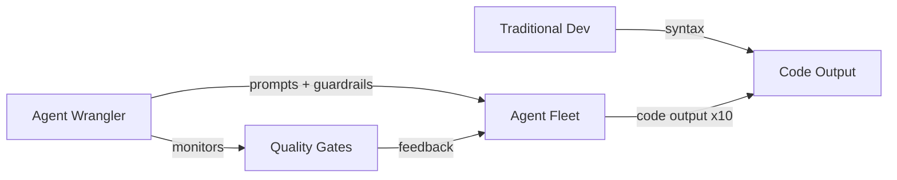
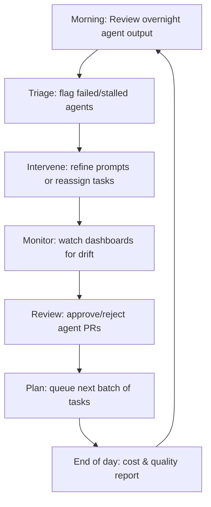
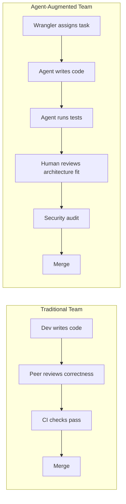
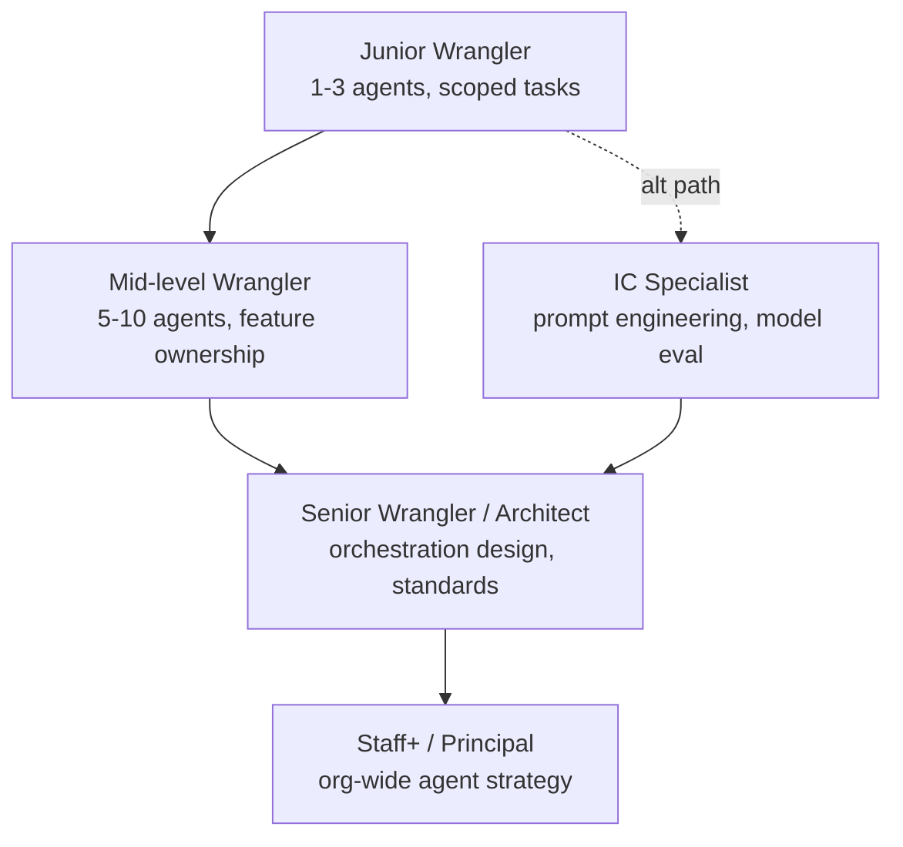

# 10.2 From Programmer to Agent Wrangler: The New Career Path

The Strossian Singularity described in Section 10.1 doesn't just change what software looks like — it changes who builds it and how. When meta-agents compose themselves into ever-more-capable pipelines, the human role pivots from *writing code* to *directing the systems that write code*. This section maps that transition: the skills you need, the daily rhythms of the new role, and the career ladders that emerge when "programmer" becomes "agent wrangler."

> **How to read this section**
>
> *Understand now:* The five core competency shifts that distinguish an agent wrangler from a traditional programmer.
> *Memorize:* The wrangler readiness framework — you will use it to evaluate yourself and your team.
> *Reference later:* The career path ladder and upskilling roadmap generator (Example 10-10).

---

## Why this section matters

Every technological wave redefines job titles. The mainframe era created "operators," the web era created "full-stack developers," and the cloud era created "DevOps engineers." The agentic era creates the **agent wrangler** — a practitioner whose primary output is not code but *well-directed autonomous systems*. If you read Section 1.2's Boris persona and thought "that could be me," this section is your transition guide. The skills gap is real but bridgeable, and the earlier you start, the wider your moat.

> **Key idea:** The agent wrangler doesn't replace the programmer — they *subsume* the role. Every wrangler must still think in code, but their leverage comes from orchestrating agents that produce code at scale (see Section 4.2 on orchestration patterns).

---

## Deliverable

By the end of this section you will be able to:

1. **Assess** your current skills against the agent-wrangler competency model and compute a readiness score.
2. **Design** a monitoring dashboard for a fleet of coding agents.
3. **Evaluate** developers across the five new competencies with a structured rubric.
4. **Restructure** a team's code-review pipeline for an agent-heavy workflow.
5. **Plan** a personalized career path from your current role to agent-native practitioner.

---

## Concept Loop 1 — The Skills Shift

### Concept

Traditional programming rewards depth in syntax, algorithms, and framework APIs — the classic "I-shaped" or "T-shaped" developer. Agent wrangling rewards a different profile: **prompt engineering**, **architecture design**, **observability**, **cost reasoning**, and **orchestration fluency**. The T-shaped developer becomes the **agent-shaped developer**, whose crossbar spans human-agent collaboration skills and whose stem reaches deep into systems thinking.

Think of it as a radar chart. The traditional dev scores high on *Language Mastery* and *Algorithm Design*; the agent wrangler scores high on *Prompt Design*, *Orchestration*, and *Cost Management*. Neither profile is superior — but the market is shifting toward the latter faster than most curricula can adapt. Section 2.3's reliability engineering principles apply directly: you are now the SRE for a fleet of code-generating agents.



### Worked example

We model both profiles as dictionaries of skill scores (0–10) and compute a **wrangler readiness score** — a weighted sum that tells you how close you are to the new role.

### Example 10-6. Skills profile comparison and wrangler readiness scoring

```python
"""Skills profile comparison and wrangler readiness scoring."""
from dataclasses import dataclass, field
from typing import Dict

WRANGLER_WEIGHTS: Dict[str, float] = {
    "prompt_design": 0.25,
    "orchestration": 0.20,
    "observability": 0.20,
    "cost_management": 0.15,
    "architecture": 0.10,
    "language_mastery": 0.05,
    "algorithm_design": 0.05,
}

@dataclass
class SkillsProfile:
    name: str
    scores: Dict[str, int] = field(default_factory=dict)

    def readiness_score(self) -> float:
        total = 0.0
        for skill, weight in WRANGLER_WEIGHTS.items():
            total += self.scores.get(skill, 0) * weight
        return round(total, 2)

    def top_gaps(self, n: int = 3) -> list:
        gaps = []
        for skill, weight in sorted(WRANGLER_WEIGHTS.items(), key=lambda x: -x[1]):
            score = self.scores.get(skill, 0)
            gap = (10 - score) * weight
            gaps.append((skill, score, round(gap, 2)))
        gaps.sort(key=lambda x: -x[2])
        return gaps[:n]

    def report(self) -> str:
        lines = [f"=== {self.name} ==="]
        for skill in WRANGLER_WEIGHTS:
            bar = "#" * self.scores.get(skill, 0)
            lines.append(f"  {skill:<20s} {bar:<10s} {self.scores.get(skill, 0)}/10")
        lines.append(f"  Wrangler Readiness Score: {self.readiness_score()}/10.0")
        lines.append("  Top gaps to close:")
        for skill, score, gap in self.top_gaps():
            lines.append(f"    - {skill}: {score}/10 (weighted gap {gap})")
        return "\n".join(lines)


if __name__ == "__main__":
    traditional = SkillsProfile("Traditional Dev", {
        "prompt_design": 2, "orchestration": 1, "observability": 3,
        "cost_management": 2, "architecture": 7,
        "language_mastery": 9, "algorithm_design": 8,
    })
    wrangler = SkillsProfile("Agent Wrangler", {
        "prompt_design": 9, "orchestration": 8, "observability": 8,
        "cost_management": 7, "architecture": 8,
        "language_mastery": 6, "algorithm_design": 5,
    })
    print(traditional.report())
    print()
    print(wrangler.report())
```

> **Check yourself:** Compute your own readiness score. Which single skill improvement would move the needle most?

---

## Concept Loop 2 — The Agent Wrangler Role

### Concept

What does an agent wrangler actually *do* all day? Picture someone managing 5–20 coding agents — each assigned to a feature branch, a bug-fix queue, or a refactoring campaign. The wrangler's daily loop is: **assign → monitor → intervene → review → ship**. It mirrors the SRE "observe–orient–decide–act" loop, but applied to code-generating agents rather than production services.

Key activities include checking the **fleet dashboard** for stalled or drifting agents, setting **intervention triggers** (e.g., "alert me if an agent's test-pass rate drops below 80%"), and enforcing **quality gates** before any agent-generated PR merges. Section 7.2's efficiency and budget principles directly inform how you allocate tokens across your fleet. Section 8.3's personal agent stack is the wrangler's toolkit.



### Worked example

We simulate a fleet dashboard that tracks multiple agents, their statuses, tasks completed, intervention counts, and cost.

### Example 10-7. Agent fleet dashboard simulator

```python
"""Agent fleet dashboard simulator."""
import random
import json
from dataclasses import dataclass, field, asdict
from datetime import datetime, timedelta
from typing import List

@dataclass
class AgentStatus:
    agent_id: str
    status: str = "idle"
    tasks_completed: int = 0
    tasks_failed: int = 0
    interventions: int = 0
    tokens_used: int = 0
    cost_usd: float = 0.0

    @property
    def success_rate(self) -> float:
        total = self.tasks_completed + self.tasks_failed
        return round(self.tasks_completed / total, 2) if total > 0 else 0.0

    @property
    def intervention_rate(self) -> float:
        total = self.tasks_completed + self.tasks_failed
        return round(self.interventions / total, 2) if total > 0 else 0.0


@dataclass
class FleetDashboard:
    agents: List[AgentStatus] = field(default_factory=list)

    def add_agent(self, agent_id: str) -> None:
        self.agents.append(AgentStatus(agent_id=agent_id))

    def simulate_day(self, seed: int = 42) -> None:
        rng = random.Random(seed)
        for agent in self.agents:
            tasks = rng.randint(5, 30)
            failures = rng.randint(0, max(1, tasks // 5))
            agent.tasks_completed = tasks - failures
            agent.tasks_failed = failures
            agent.interventions = rng.randint(0, max(1, failures))
            agent.tokens_used = tasks * rng.randint(800, 3000)
            agent.cost_usd = round(agent.tokens_used * 0.00003, 2)
            agent.status = rng.choice(["active", "active", "active", "stalled", "completed"])

    def summary(self) -> str:
        lines = ["=== Fleet Dashboard ==="]
        total_cost = 0.0
        for a in self.agents:
            flag = " ⚠" if a.success_rate < 0.85 or a.status == "stalled" else ""
            lines.append(
                f"  {a.agent_id:<12s} | {a.status:<10s} | "
                f"done={a.tasks_completed} fail={a.tasks_failed} "
                f"rate={a.success_rate:.0%} | ${a.cost_usd:.2f}{flag}"
            )
            total_cost += a.cost_usd
        lines.append(f"  Total fleet cost: ${total_cost:.2f}")
        stalled = sum(1 for a in self.agents if a.status == "stalled")
        if stalled:
            lines.append(f"  ⚠ {stalled} agent(s) stalled — intervention needed")
        return "\n".join(lines)


if __name__ == "__main__":
    dashboard = FleetDashboard()
    for i in range(1, 9):
        dashboard.add_agent(f"agent-{i:02d}")
    dashboard.simulate_day(seed=77)
    print(dashboard.summary())
```

> **Check yourself:** If your fleet's average intervention rate exceeds 20%, what changes would you make to your prompt templates or task decomposition?

---

## Concept Loop 3 — New Competencies

### Concept

The agent wrangler needs five competencies that barely existed five years ago:

1. **Prompt Design** — Crafting instructions that reliably steer agents toward correct output (Section 9.2's synthetic senior depends on this).
2. **Observability** — Instrumenting agent pipelines so you can trace failures back to root causes.
3. **Cost Management** — Keeping token budgets in check without starving agents of context (see Section 7.2).
4. **Security Review** — Auditing agent-generated code for vulnerabilities, supply-chain risks, and data leaks.
5. **Architectural Stewardship** — Ensuring agent output fits the system's design rather than creating local optima that degrade global coherence.

> **Warning:** Ignoring any single competency creates a bottleneck. A wrangler who is great at prompts but blind to cost will bankrupt the team; one who audits security but can't design prompts will never produce useful output.

### Worked example

We build an assessment tool that scores a developer on each competency via a simple self-report rubric.

### Example 10-8. Competency assessment tool for agent wrangler readiness

```python
"""Competency assessment tool for agent wrangler readiness."""
from dataclasses import dataclass
from typing import Dict, List, Tuple

COMPETENCIES = [
    ("prompt_design", "Prompt Design",
     "Can you write a multi-step prompt that produces correct code on first try >70% of the time?"),
    ("observability", "Observability",
     "Can you set up tracing and logging for an agent pipeline end-to-end?"),
    ("cost_management", "Cost Management",
     "Can you estimate token costs for a task and stay within a budget?"),
    ("security_review", "Security Review",
     "Can you audit agent-generated code for OWASP Top 10 vulnerabilities?"),
    ("architecture", "Architectural Stewardship",
     "Can you evaluate whether agent output fits the system's overall design?"),
]

LEVELS = {
    1: "Novice — aware of the concept",
    2: "Beginner — can do with guidance",
    3: "Intermediate — can do independently",
    4: "Advanced — can teach others",
    5: "Expert — can design frameworks for it",
}

@dataclass
class Assessment:
    name: str
    scores: Dict[str, int]

    def overall_score(self) -> float:
        return round(sum(self.scores.values()) / len(self.scores), 1)

    def tier(self) -> str:
        avg = self.overall_score()
        if avg >= 4.0:
            return "Ready — Agent Wrangler"
        if avg >= 3.0:
            return "Almost — targeted upskilling needed"
        if avg >= 2.0:
            return "Developing — structured training plan recommended"
        return "Starting — foundational learning required"

    def recommendations(self) -> List[Tuple[str, str]]:
        recs = []
        for key, label, _ in COMPETENCIES:
            score = self.scores.get(key, 1)
            if score <= 2:
                recs.append((label, f"Priority: take a course or workshop (current: {LEVELS[score]})"))
            elif score == 3:
                recs.append((label, f"Stretch: mentor others to solidify (current: {LEVELS[score]})"))
        return recs

    def report(self) -> str:
        lines = [f"=== Assessment: {self.name} ==="]
        for key, label, _ in COMPETENCIES:
            s = self.scores.get(key, 1)
            bar = "█" * s + "░" * (5 - s)
            lines.append(f"  {label:<25s} {bar} {s}/5 — {LEVELS[s]}")
        lines.append(f"  Overall: {self.overall_score()}/5.0 → {self.tier()}")
        recs = self.recommendations()
        if recs:
            lines.append("  Recommendations:")
            for label, rec in recs:
                lines.append(f"    • {label}: {rec}")
        return "\n".join(lines)


if __name__ == "__main__":
    dev = Assessment("Alex (mid-level dev)", {
        "prompt_design": 2,
        "observability": 3,
        "cost_management": 1,
        "security_review": 3,
        "architecture": 4,
    })
    print(dev.report())
    print()
    senior = Assessment("Jordan (senior wrangler)", {
        "prompt_design": 5,
        "observability": 4,
        "cost_management": 4,
        "security_review": 4,
        "architecture": 5,
    })
    print(senior.report())
```

> **Check yourself:** Run the assessment on yourself. Which competency is your biggest gap, and what's one concrete action you could take this week to improve it?

---

## Concept Loop 4 — Team Dynamics

### Concept

When agents handle 80% of implementation, the human team's focus shifts dramatically. Code review moves from *"does it compile and pass tests?"* (agents handle that) to *"does this belong in our architecture?"* — a higher-order concern. Pair programming evolves from two humans at a keyboard to a **human–agent collaboration** where the human steers intent and the agent executes. Section 9.2's "synthetic senior" concept means junior developers now have an always-available mentor, flattening the experience curve.

> **Tip:** The biggest risk in agent-heavy teams is *rubber-stamping*. When agent output is mostly correct, reviewers develop automation complacency. Build explicit checklists that force architectural evaluation on every PR.



### Worked example

We simulate a code review pipeline where human reviewers evaluate agent-generated PRs on **architectural fit** rather than correctness.

### Example 10-9. Agent-aware code review pipeline simulation

```python
"""Agent-aware code review pipeline simulation."""
import random
from dataclasses import dataclass, field
from typing import List

REVIEW_CRITERIA = [
    ("architectural_fit", 0.35, "Does this change align with system design?"),
    ("naming_conventions", 0.15, "Do names follow project conventions?"),
    ("security_posture", 0.25, "Are there security concerns?"),
    ("test_coverage_quality", 0.15, "Are tests meaningful, not just passing?"),
    ("documentation", 0.10, "Is the change properly documented?"),
]

@dataclass
class AgentPR:
    pr_id: str
    agent_id: str
    description: str
    tests_pass: bool = True
    scores: dict = field(default_factory=dict)
    decision: str = ""

@dataclass
class ReviewPipeline:
    prs: List[AgentPR] = field(default_factory=list)

    def generate_prs(self, count: int = 6, seed: int = 42) -> None:
        rng = random.Random(seed)
        descriptions = [
            "Add caching layer to user service",
            "Refactor auth module to use strategy pattern",
            "Implement rate limiting middleware",
            "Add CSV export endpoint",
            "Migrate database queries to async",
            "Create health-check dashboard widget",
        ]
        for i in range(count):
            pr = AgentPR(
                pr_id=f"PR-{100 + i}",
                agent_id=f"agent-{rng.randint(1, 5):02d}",
                description=descriptions[i % len(descriptions)],
                tests_pass=rng.random() > 0.1,
            )
            for criterion, _, _ in REVIEW_CRITERIA:
                pr.scores[criterion] = rng.randint(4, 10)
            self.prs.append(pr)

    def review_all(self) -> None:
        for pr in self.prs:
            if not pr.tests_pass:
                pr.decision = "REJECTED (tests fail)"
                continue
            weighted = sum(
                pr.scores[c] * w for c, w, _ in REVIEW_CRITERIA
            )
            if weighted >= 7.5:
                pr.decision = "APPROVED"
            elif weighted >= 5.5:
                pr.decision = "CHANGES REQUESTED"
            else:
                pr.decision = "REJECTED (quality)"

    def report(self) -> str:
        lines = ["=== Code Review Pipeline Report ==="]
        for pr in self.prs:
            lines.append(f"\n  {pr.pr_id} by {pr.agent_id}: {pr.description}")
            lines.append(f"    Tests pass: {pr.tests_pass}")
            for criterion, weight, label in REVIEW_CRITERIA:
                score = pr.scores.get(criterion, 0)
                lines.append(f"    {criterion:<25s} {score}/10 (weight {weight})")
            lines.append(f"    → Decision: {pr.decision}")
        approved = sum(1 for p in self.prs if p.decision == "APPROVED")
        lines.append(f"\n  Summary: {approved}/{len(self.prs)} PRs approved")
        return "\n".join(lines)


if __name__ == "__main__":
    pipeline = ReviewPipeline()
    pipeline.generate_prs(count=6, seed=55)
    pipeline.review_all()
    print(pipeline.report())
```

> **Pitfall:** If your review pipeline auto-approves everything above a threshold, you've recreated the rubber-stamping problem. Always require at least one human judgment call per PR.

> **Check yourself:** In your current team, what percentage of code-review comments are about correctness vs. architecture? How would that ratio change with agents handling implementation?

---

## Concept Loop 5 — Career Paths

### Concept

The agent-native career ladder is emerging. It roughly tracks:

- **Junior Wrangler** — manages 1–3 agents on well-scoped tasks, learning prompt craft.
- **Mid-level Wrangler** — manages a fleet of 5–10 agents, owns a feature area, designs quality gates.
- **Senior Wrangler / Architect** — designs agent orchestration systems, sets team-wide standards, manages cost at the organizational level (see Section 4.2).
- **Staff+ / Principal** — defines the agent strategy for the entire engineering org, evaluates new models, builds internal tooling.

> **Key idea:** The fastest path to senior wrangler is not "learn more AI" — it's "deepen your systems thinking." The wrangler's superpower is understanding the *whole system*, not just the agent.



### Worked example

We build a career path planner: given current skill levels and target role, it generates a personalized upskilling roadmap.

### Example 10-10. Career path planner and upskilling roadmap generator

```python
"""Career path planner and upskilling roadmap generator."""
from dataclasses import dataclass, field
from typing import Dict, List, Tuple

ROLES: Dict[str, Dict[str, int]] = {
    "junior_wrangler": {
        "prompt_design": 3, "orchestration": 2, "observability": 2,
        "cost_management": 2, "architecture": 2, "security_review": 2,
    },
    "mid_wrangler": {
        "prompt_design": 5, "orchestration": 4, "observability": 4,
        "cost_management": 3, "architecture": 4, "security_review": 3,
    },
    "senior_architect": {
        "prompt_design": 7, "orchestration": 7, "observability": 6,
        "cost_management": 6, "architecture": 8, "security_review": 5,
    },
    "staff_principal": {
        "prompt_design": 8, "orchestration": 9, "observability": 8,
        "cost_management": 8, "architecture": 9, "security_review": 7,
    },
}

RESOURCES: Dict[str, List[str]] = {
    "prompt_design": ["Practice daily prompt challenges", "Study prompt-engineering guides"],
    "orchestration": ["Build a multi-agent pipeline project", "Read Section 4.2 on orchestration"],
    "observability": ["Set up tracing on a side project", "Review Section 2.3 on reliability"],
    "cost_management": ["Track token spend for a week", "Read Section 7.2 on budgets"],
    "architecture": ["Contribute to system design reviews", "Study architecture decision records"],
    "security_review": ["Take an AppSec training course", "Audit agent output for a sprint"],
}

@dataclass
class CareerPlanner:
    name: str
    current_skills: Dict[str, int] = field(default_factory=dict)

    def gap_analysis(self, target_role: str) -> List[Tuple[str, int, int, int]]:
        target = ROLES.get(target_role, {})
        gaps = []
        for skill, required in target.items():
            current = self.current_skills.get(skill, 0)
            gap = max(0, required - current)
            gaps.append((skill, current, required, gap))
        gaps.sort(key=lambda x: -x[3])
        return gaps

    def roadmap(self, target_role: str) -> str:
        gaps = self.gap_analysis(target_role)
        lines = [f"=== Career Roadmap: {self.name} → {target_role.replace('_', ' ').title()} ==="]
        total_gap = sum(g[3] for g in gaps)
        if total_gap == 0:
            lines.append("  ✅ You already meet all requirements for this role!")
            return "\n".join(lines)
        months_est = max(3, total_gap * 2)
        lines.append(f"  Estimated timeline: {months_est} months\n")
        phase = 1
        for skill, current, required, gap in gaps:
            if gap == 0:
                continue
            lines.append(f"  Phase {phase}: {skill.replace('_', ' ').title()} ({current} → {required})")
            for resource in RESOURCES.get(skill, []):
                lines.append(f"    📚 {resource}")
            phase += 1
        lines.append(f"\n  Total skills gap: {total_gap} points across {phase - 1} competencies")
        return "\n".join(lines)

    def best_next_role(self) -> str:
        best_role = ""
        best_gap = float("inf")
        for role_name in ROLES:
            gap = sum(g[3] for g in self.gap_analysis(role_name))
            if 0 < gap < best_gap:
                best_gap = gap
                best_role = role_name
        return best_role


if __name__ == "__main__":
    dev = CareerPlanner("Sam (backend developer)", {
        "prompt_design": 2, "orchestration": 1, "observability": 4,
        "cost_management": 2, "architecture": 5, "security_review": 3,
    })
    next_role = dev.best_next_role()
    print(f"Recommended next role: {next_role.replace('_', ' ').title()}\n")
    print(dev.roadmap(next_role))
    print()
    print(dev.roadmap("senior_architect"))
```

> **Check yourself:** Run the planner with your own skills. Does the recommended next role match your intuition? What would you adjust in the weighting?

---

## What we built

This section mapped the transition from programmer to agent wrangler across five dimensions:

- [x] **Skills Shift** — A readiness scoring model comparing traditional and wrangler profiles (Example 10-6)
- [x] **Role Definition** — A fleet dashboard showing the wrangler's daily monitoring loop (Example 10-7)
- [x] **New Competencies** — A structured assessment across five agent-era competencies (Example 10-8)
- [x] **Team Dynamics** — An architecture-focused review pipeline for agent-generated PRs (Example 10-9)
- [x] **Career Paths** — A personalized roadmap generator for upskilling (Example 10-10)

---

## Wrapping up

**Exercise 1.** Run Example 10-6 with your own skill scores. Identify your top three gaps and write a one-paragraph plan for each.

**Exercise 2.** Extend Example 10-7 to include a "token budget remaining" field per agent, and add a warning when any agent exceeds 90% of its daily budget.

**Exercise 3.** Using Example 10-9 as a base, add a "confidence score" from the agent itself as a review input. How does self-reported confidence change the approval rate?

**Exercise 4.** Design a team charter for an agent-augmented team of four humans and twelve agents. Define roles, escalation paths, and the boundary between "agent-decidable" and "human-required" decisions. Use the frameworks from Sections 4.2 and 8.3 as starting points.
