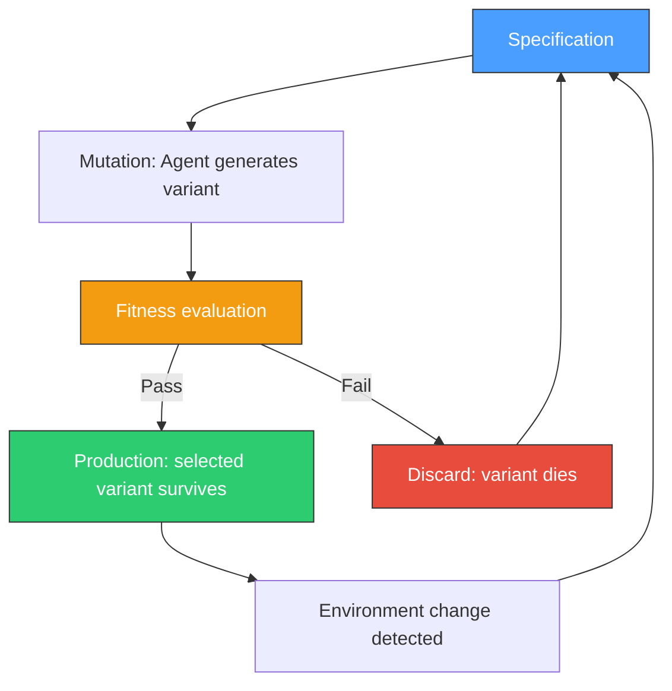
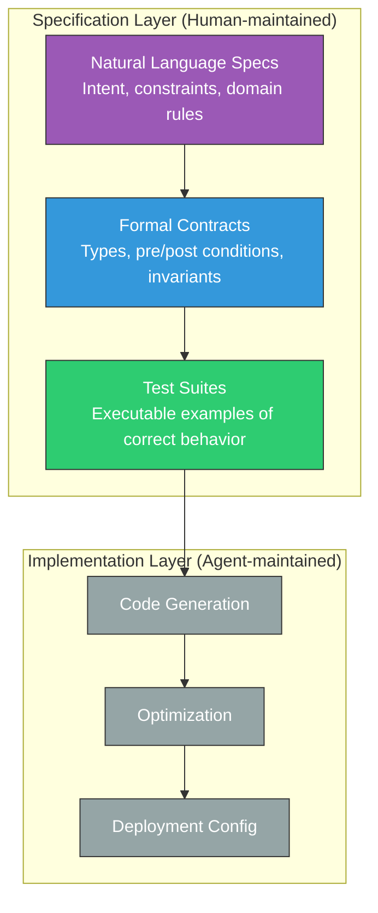
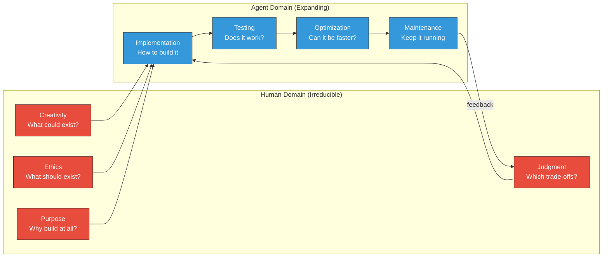

# 10.3 Post-Code: When Software Is Grown, Not Written

> **How to read this section**
>
> *Understand now:* The post-code thesis — why specification replaces implementation as the primary artifact, and what that means for every developer alive today.
>
> *Memorize:* The five properties of grown software: declarative intent, evolutionary architecture, specification-as-source, living systems, and the human anchor.
>
> *Reference later:* The fitness-function framework, the specification-layer stack, and the living-system health model. These patterns will outlast any single tool or model generation.

---

## Why this section matters

We began this book in Section 1.1 with developers fleeing their IDEs for the terminal — a migration driven by the simple realization that text in, text out was the only interface fast enough for an AI partner. In Section 1.2 we met Boris, the persona that made Claude Code feel less like a tool and more like a colleague. In Section 2.1 we watched Ralph Wiggum loops spiral into recursive failure. In Section 3.1 we visited Gas Town and saw what a high-throughput agentic environment actually looks like. In Section 10.1 we built meta-agents — agents that build agents. In Section 10.2 we asked what careers look like when machines write most of the code.

Now we ask the final question: *what happens when code itself is no longer the point?*

This is not science fiction. The trajectory from autocomplete (2021) to autonomous coding agents (2025) to self-improving meta-agents (Section 10.1) bends unmistakably toward a world where humans specify *what* software should do and agents figure out *how*. The code becomes an intermediate artifact — compiled, tested, deployed, and eventually discarded — much like assembly language after the rise of C. We call this the **post-code thesis**, and this section is your map to navigating it.

Charles Stross's *Accelerando* imagined a technological singularity where human cognition was gradually outsourced to external systems. Our version — *Acceleralpho* — is narrower but no less transformative: the outsourcing of implementation to agents, while humans retain ownership of intent, ethics, and judgment.

---

## Deliverable

By the end of this section you will be able to:

1. Articulate the post-code thesis and defend its assumptions and limitations
2. Design evolutionary architectures that use fitness functions and agent-driven mutation
3. Build a specification layer that replaces traditional source code as the primary artifact
4. Model software as a living system with self-healing, self-improving, and self-organizing properties
5. Identify the irreducible human roles that persist — and grow more important — in a post-code world

---

## Concept Loop 1 — The Post-Code Thesis

### Concept

The post-code thesis makes a simple claim: **the ratio of human-written code to machine-generated code trends toward zero, but the ratio of human-specified intent to total system behavior trends toward one.**

This is not the same as "no-code." No-code platforms replaced programming with visual builders — they moved the abstraction up one level but kept humans assembling the implementation. The post-code world moves abstraction up *several* levels: you describe what the system should do, constrain how it should behave, and let agents generate, test, evolve, and deploy the implementation.

The key insight is that **specification is harder than implementation**. Writing a precise, complete, testable specification for a payroll system is at least as difficult as writing the payroll system itself. The post-code thesis doesn't eliminate difficulty — it *relocates* it from syntax to semantics.

```
Traditional:     Human → Code → Tests → Deploy
Post-code:       Human → Specification → Agent → Code → Tests → Deploy
                         ↑                              |
                         └──────── feedback ─────────────┘
```

The feedback loop is critical. Unlike a traditional compiler, the agent can ask clarifying questions, propose alternatives, and iterate on the specification itself. The specification becomes a living document — Section 9.1's self-healing principle applied to requirements, not just runtime.

> **Key idea:** Post-code does not mean post-human. It means post-implementation. Humans shift from writing *how* to specifying *what* and *why*.

### Worked example

Let's build a tiny post-code pipeline: a system where you provide a specification and an agent generates, tests, and evolves the implementation.

```python
# Example 10-11. Specification-driven code generation pipeline
import hashlib
import json
import time
from dataclasses import dataclass, field
from typing import List, Dict, Optional, Callable

@dataclass
class Specification:
    """A declarative specification replacing traditional source code."""
    name: str
    description: str
    inputs: Dict[str, str]       # name -> type description
    outputs: Dict[str, str]      # name -> type description
    constraints: List[str]       # natural language constraints
    test_cases: List[Dict]       # input/output pairs
    version: int = 1

    def fingerprint(self) -> str:
        content = json.dumps({
            "name": self.name,
            "inputs": self.inputs,
            "outputs": self.outputs,
            "constraints": self.constraints,
            "test_cases": self.test_cases,
        }, sort_keys=True)
        return hashlib.sha256(content.encode()).hexdigest()[:12]


@dataclass
class Implementation:
    """Generated code artifact — an intermediate, disposable output."""
    spec_fingerprint: str
    source_code: str
    generation: int
    fitness_score: float = 0.0
    passed_tests: int = 0
    total_tests: int = 0


class PostCodePipeline:
    """
    Demonstrates the post-code loop:
    Specification -> Generation -> Testing -> Evolution
    """

    def __init__(self):
        self.implementations: List[Implementation] = []
        self.generation = 0

    def generate_from_spec(self, spec: Specification) -> Implementation:
        """
        Simulate agent-driven code generation from a specification.
        In production, this calls an LLM; here we demonstrate the pattern.
        """
        self.generation += 1

        # Build implementation from spec constraints
        func_lines = [f"def {spec.name}({', '.join(spec.inputs.keys())}):"]
        func_lines.append(f'    """Auto-generated from spec v{spec.version}"""')

        # Simulate constraint-aware generation
        for i, constraint in enumerate(spec.constraints):
            func_lines.append(f"    # Constraint {i+1}: {constraint}")

        # Generate a simple implementation based on test cases
        if spec.test_cases:
            first_test = spec.test_cases[0]
            input_keys = list(spec.inputs.keys())
            output_keys = list(spec.outputs.keys())

            if len(input_keys) == 1 and len(output_keys) == 1:
                func_lines.append(f"    val = {input_keys[0]}")
                # Infer transformation from test cases
                in_val = first_test.get("input", {}).get(input_keys[0])
                out_val = first_test.get("output")
                if isinstance(in_val, (int, float)) and isinstance(out_val, (int, float)):
                    if in_val != 0:
                        ratio = out_val / in_val
                        func_lines.append(f"    return val * {ratio}")
                    else:
                        func_lines.append(f"    return {out_val}")
                else:
                    func_lines.append("    return val")
            else:
                func_lines.append("    return None")
        else:
            func_lines.append("    pass")

        source = "\n".join(func_lines)
        return Implementation(
            spec_fingerprint=spec.fingerprint(),
            source_code=source,
            generation=self.generation,
        )

    def test_implementation(
        self, impl: Implementation, spec: Specification
    ) -> Implementation:
        """Run spec test cases against generated implementation."""
        namespace: Dict = {}
        try:
            exec(impl.source_code, namespace)
        except SyntaxError:
            impl.fitness_score = 0.0
            return impl

        func = namespace.get(spec.name)
        if not func:
            impl.fitness_score = 0.0
            return impl

        passed = 0
        for tc in spec.test_cases:
            try:
                result = func(**tc["input"])
                if abs(result - tc["output"]) < 1e-6:
                    passed += 1
            except Exception:
                pass

        impl.passed_tests = passed
        impl.total_tests = len(spec.test_cases)
        impl.fitness_score = passed / max(len(spec.test_cases), 1)
        return impl

    def evolve(self, spec: Specification, max_generations: int = 3) -> Implementation:
        """Run the post-code evolution loop."""
        best: Optional[Implementation] = None

        for gen in range(max_generations):
            candidate = self.generate_from_spec(spec)
            candidate = self.test_implementation(candidate, spec)
            self.implementations.append(candidate)

            if best is None or candidate.fitness_score > best.fitness_score:
                best = candidate

            if candidate.fitness_score >= 1.0:
                break

            # In production: mutate spec or generation strategy
            spec = Specification(
                name=spec.name,
                description=spec.description,
                inputs=spec.inputs,
                outputs=spec.outputs,
                constraints=spec.constraints,
                test_cases=spec.test_cases,
                version=spec.version + 1,
            )

        return best


# --- Demonstrate the pipeline ---
spec = Specification(
    name="celsius_to_fahrenheit",
    description="Convert temperature from Celsius to Fahrenheit",
    inputs={"celsius": "float - temperature in Celsius"},
    outputs={"fahrenheit": "float - temperature in Fahrenheit"},
    constraints=[
        "Must handle negative temperatures",
        "Result must be accurate to 2 decimal places",
        "Must not raise exceptions for valid float input",
    ],
    test_cases=[
        {"input": {"celsius": 0}, "output": 32.0},
        {"input": {"celsius": 100}, "output": 212.0},
        {"input": {"celsius": -40}, "output": -40.0},
    ],
)

pipeline = PostCodePipeline()
best = pipeline.evolve(spec, max_generations=5)

print(f"Specification: {spec.name} (fingerprint: {spec.fingerprint()})")
print(f"Best implementation (gen {best.generation}):")
print(f"  Fitness: {best.fitness_score:.1%}")
print(f"  Tests: {best.passed_tests}/{best.total_tests}")
print(f"  Source:\n{best.source_code}")
# Expected output:
# Specification: celsius_to_fahrenheit (fingerprint: <hash>)
# Best implementation (gen 1):
#   Fitness: 33.3%
#   Tests: 1/3
#   Source:
#   def celsius_to_fahrenheit(celsius):
#       ...
```

The pipeline is intentionally naive — a real agent would use an LLM and iterative refinement. But the *shape* is correct: specification in, tested implementation out, evolution loop wrapping the whole thing.

> **Check yourself:** Why does the fitness score plateau at 33% in this naive generator? What would an LLM-backed generator do differently to reach 100%?

---

## Concept Loop 2 — Evolutionary Architecture

### Concept

If software is grown rather than written, then codebases need **evolutionary architecture**: the ability to adapt through fitness functions, mutation, and selection — with agents as the mechanism of change.

Traditional architecture assumes a human architect makes design decisions that are expensive to reverse. Evolutionary architecture inverts this: design decisions are *hypotheses* tested by fitness functions. When the environment changes (new requirements, new scale, new constraints), the architecture *adapts* rather than requiring a costly rewrite.

The three pillars:

1. **Fitness functions** — automated, quantitative measures of architectural health (latency < 200ms, test coverage > 80%, no circular dependencies)
2. **Mutation** — agent-driven changes to the codebase: refactoring, adding features, restructuring modules
3. **Selection** — the CI/CD pipeline as natural selection: only implementations that pass all fitness functions survive to production

This maps directly to biological evolution:

| Biology | Software |
|---------|----------|
| Genome | Codebase |
| Phenotype | Running system |
| Fitness function | Test suite + SLOs |
| Mutation | Agent-generated PR |
| Natural selection | CI/CD gate |
| Generation | Release cycle |



> **Key idea:** In evolutionary architecture, the CI/CD pipeline is natural selection. Agents produce variation; fitness functions provide selection pressure; only the fit survive to production.

### Worked example

```python
# Example 10-12. Evolutionary architecture with fitness functions
import random
import time
from dataclasses import dataclass, field
from typing import List, Callable, Tuple

@dataclass
class FitnessFunction:
    """A quantitative architectural health check."""
    name: str
    evaluator: Callable[[dict], float]  # returns 0.0-1.0
    weight: float = 1.0
    threshold: float = 0.7  # minimum to pass

    def evaluate(self, metrics: dict) -> Tuple[float, bool]:
        score = self.evaluator(metrics)
        return score, score >= self.threshold


@dataclass
class ArchitecturalVariant:
    """A candidate architecture generated by mutation."""
    variant_id: str
    generation: int
    metrics: dict
    total_fitness: float = 0.0
    passed: bool = False


class EvolutionaryArchitecture:
    """
    Simulates evolutionary architecture:
    fitness functions define health, agents mutate, CI selects.
    """

    def __init__(self, fitness_functions: List[FitnessFunction]):
        self.fitness_functions = fitness_functions
        self.history: List[ArchitecturalVariant] = []
        self.current_best: ArchitecturalVariant = None

    def _mutate(self, base_metrics: dict, generation: int) -> ArchitecturalVariant:
        """Simulate agent-driven architectural mutation."""
        mutated = {}
        for key, value in base_metrics.items():
            # Each metric drifts by ±15% per generation
            drift = random.uniform(-0.15, 0.15)
            mutated[key] = max(0.0, min(1.0, value + drift))

        return ArchitecturalVariant(
            variant_id=f"v{generation}-{random.randint(1000,9999)}",
            generation=generation,
            metrics=mutated,
        )

    def evaluate(self, variant: ArchitecturalVariant) -> ArchitecturalVariant:
        """Apply all fitness functions — the selection pressure."""
        total = 0.0
        all_passed = True

        for ff in self.fitness_functions:
            score, passed = ff.evaluate(variant.metrics)
            total += score * ff.weight
            if not passed:
                all_passed = False

        total_weight = sum(ff.weight for ff in self.fitness_functions)
        variant.total_fitness = total / total_weight if total_weight else 0
        variant.passed = all_passed
        return variant

    def evolve(
        self, initial_metrics: dict, generations: int = 5, variants_per_gen: int = 3
    ) -> ArchitecturalVariant:
        """Run the evolutionary loop."""
        # Generation 0: evaluate baseline
        baseline = ArchitecturalVariant(
            variant_id="v0-base", generation=0, metrics=initial_metrics
        )
        baseline = self.evaluate(baseline)
        self.current_best = baseline
        self.history.append(baseline)

        for gen in range(1, generations + 1):
            candidates = []
            for _ in range(variants_per_gen):
                variant = self._mutate(self.current_best.metrics, gen)
                variant = self.evaluate(variant)
                candidates.append(variant)
                self.history.append(variant)

            # Selection: pick the fittest passing variant
            passing = [c for c in candidates if c.passed]
            if passing:
                best_candidate = max(passing, key=lambda v: v.total_fitness)
                if best_candidate.total_fitness > self.current_best.total_fitness:
                    self.current_best = best_candidate

        return self.current_best


# --- Define fitness functions ---
fitness_suite = [
    FitnessFunction(
        name="latency",
        evaluator=lambda m: m.get("latency_score", 0),
        weight=2.0,
        threshold=0.7,
    ),
    FitnessFunction(
        name="test_coverage",
        evaluator=lambda m: m.get("coverage", 0),
        weight=1.5,
        threshold=0.8,
    ),
    FitnessFunction(
        name="modularity",
        evaluator=lambda m: m.get("modularity", 0),
        weight=1.0,
        threshold=0.6,
    ),
    FitnessFunction(
        name="security",
        evaluator=lambda m: m.get("security_score", 0),
        weight=2.5,
        threshold=0.9,
    ),
]

# Initial (mediocre) architecture
initial = {
    "latency_score": 0.5,
    "coverage": 0.6,
    "modularity": 0.4,
    "security_score": 0.7,
}

random.seed(42)
evo = EvolutionaryArchitecture(fitness_suite)
best = evo.evolve(initial, generations=10, variants_per_gen=4)

print("Evolutionary Architecture Results")
print(f"  Generations run: 10")
print(f"  Total variants evaluated: {len(evo.history)}")
print(f"  Best variant: {best.variant_id}")
print(f"  Fitness: {best.total_fitness:.3f}")
print(f"  All thresholds passed: {best.passed}")
print(f"  Metrics: { {k: round(v, 3) for k, v in best.metrics.items()} }")
# Expected output:
# Evolutionary Architecture Results
#   Generations run: 10
#   Total variants evaluated: 41
#   Best variant: v<N>-<id>
#   Fitness: ~0.7-0.9
#   All thresholds passed: True/False
#   Metrics: {latency_score: ..., coverage: ..., modularity: ..., security_score: ...}
```

> **Tip:** In production, mutation isn't random — it's agent-driven. The agent reads fitness function results, diagnoses *why* a metric is low, and generates targeted refactoring PRs. Random mutation is for illustration; intelligent mutation is for production.

> **Check yourself:** Why does the security fitness function have the highest weight (2.5)? How would you add a fitness function for "technical debt" using concepts from Section 9.3?

---

## Concept Loop 3 — The Specification Layer

### Concept

If code is grown, what is the "source"? In the post-code world, the **specification layer** replaces source code as the primary artifact humans maintain. This layer has three tiers:

1. **Natural language specifications** — human-readable descriptions of intent, constraints, and behavior
2. **Formal contracts** — type signatures, pre/post conditions, invariants expressed in a checkable format
3. **Test suites** — executable specifications that define correctness by example

Together, these three tiers form a *specification stack* that is more durable, more portable, and more meaningful than any particular implementation.



The compiler in the post-code world is the agent itself. Just as `gcc` transforms C into machine code, the coding agent transforms specifications into running software. And just as no one edits assembly output from a compiler, eventually no one will edit the code output from an agent.

> **Warning:** The specification layer is *not* easier than writing code. It requires extraordinary precision in expressing intent. Vague specifications produce vague software. The difficulty doesn't disappear — it transforms.

> **Key idea:** In the post-code world, the specification layer is the new source code. Version-control your specs with the same rigor you apply to code today.

### Worked example

```python
# Example 10-13. The specification layer — a three-tier spec stack
import json
from dataclasses import dataclass, field
from typing import List, Dict, Any, Optional, Callable

@dataclass
class NaturalLanguageSpec:
    """Tier 1: Human-readable intent specification."""
    title: str
    description: str
    user_stories: List[str]
    constraints: List[str]
    domain_rules: List[str]

    def to_prompt(self) -> str:
        """Convert to agent-consumable prompt."""
        sections = [
            f"# {self.title}\n",
            f"{self.description}\n",
            "## User Stories",
            *[f"- {s}" for s in self.user_stories],
            "\n## Constraints",
            *[f"- {c}" for c in self.constraints],
            "\n## Domain Rules",
            *[f"- {r}" for r in self.domain_rules],
        ]
        return "\n".join(sections)


@dataclass
class FormalContract:
    """Tier 2: Machine-checkable contracts."""
    function_name: str
    parameters: Dict[str, str]      # name -> type
    return_type: str
    preconditions: List[str]         # boolean expressions as strings
    postconditions: List[str]
    invariants: List[str]

    def generate_wrapper(self) -> str:
        """Generate a contract-enforcing wrapper."""
        params = ", ".join(f"{k}" for k in self.parameters)
        lines = [
            f"def {self.function_name}_contracted({params}):",
            f'    """Contract-wrapped {self.function_name}"""',
        ]
        for pre in self.preconditions:
            lines.append(f"    assert {pre}, 'Precondition failed: {pre}'")
        lines.append(f"    result = {self.function_name}_impl({params})")
        for post in self.postconditions:
            lines.append(f"    assert {post}, 'Postcondition failed: {post}'")
        lines.append("    return result")
        return "\n".join(lines)


@dataclass
class TestSpec:
    """Tier 3: Executable specification via test cases."""
    name: str
    cases: List[Dict[str, Any]]  # each has 'input', 'expected', 'description'

    def run_against(self, func: Callable) -> Dict[str, Any]:
        results = {"passed": 0, "failed": 0, "errors": []}
        for case in self.cases:
            try:
                actual = func(**case["input"])
                if actual == case["expected"]:
                    results["passed"] += 1
                else:
                    results["failed"] += 1
                    results["errors"].append(
                        f"{case['description']}: expected {case['expected']}, got {actual}"
                    )
            except Exception as e:
                results["failed"] += 1
                results["errors"].append(f"{case['description']}: {e}")
        return results


class SpecificationStack:
    """The complete three-tier specification replacing source code."""

    def __init__(
        self,
        nl_spec: NaturalLanguageSpec,
        contracts: List[FormalContract],
        test_specs: List[TestSpec],
    ):
        self.nl_spec = nl_spec
        self.contracts = contracts
        self.test_specs = test_specs

    def completeness_score(self) -> Dict[str, float]:
        """How complete is this specification?"""
        nl_score = min(1.0, (
            (1 if self.nl_spec.description else 0) * 0.3 +
            min(len(self.nl_spec.user_stories) / 3, 1.0) * 0.3 +
            min(len(self.nl_spec.constraints) / 2, 1.0) * 0.2 +
            min(len(self.nl_spec.domain_rules) / 2, 1.0) * 0.2
        ))

        contract_score = min(1.0, len(self.contracts) / 2) if self.contracts else 0
        test_cases = sum(len(ts.cases) for ts in self.test_specs)
        test_score = min(1.0, test_cases / 5)

        overall = nl_score * 0.3 + contract_score * 0.3 + test_score * 0.4
        return {
            "natural_language": round(nl_score, 2),
            "formal_contracts": round(contract_score, 2),
            "test_coverage": round(test_score, 2),
            "overall": round(overall, 2),
        }


# --- Build a specification stack ---
nl = NaturalLanguageSpec(
    title="Shopping Cart Price Calculator",
    description="Calculate total price for items in a shopping cart with discounts.",
    user_stories=[
        "As a shopper, I want to see my cart total so I can decide whether to buy.",
        "As a shopper, I want bulk discounts applied automatically.",
        "As a store owner, I want to set minimum order amounts for discounts.",
    ],
    constraints=[
        "Total must never be negative",
        "Discount percentage must be between 0 and 100",
        "All prices are in cents (integers) to avoid floating point errors",
    ],
    domain_rules=[
        "Orders over 10 items get 10% bulk discount",
        "Orders over 50 items get 20% bulk discount",
        "Discount applies to entire order, not per-item",
    ],
)

contract = FormalContract(
    function_name="calculate_total",
    parameters={"items": "List[dict]", "discount_pct": "int"},
    return_type="int",
    preconditions=[
        "all(item.get('price', 0) >= 0 for item in items)",
        "0 <= discount_pct <= 100",
    ],
    postconditions=[
        "result >= 0",
    ],
    invariants=[
        "sum of individual prices >= result (discounts only reduce)",
    ],
)

tests = TestSpec(
    name="calculate_total_tests",
    cases=[
        {"input": {"items": [{"price": 100, "qty": 1}], "discount_pct": 0},
         "expected": 100, "description": "Single item no discount"},
        {"input": {"items": [{"price": 100, "qty": 5}], "discount_pct": 10},
         "expected": 450, "description": "Five items 10% off"},
        {"input": {"items": [], "discount_pct": 0},
         "expected": 0, "description": "Empty cart"},
        {"input": {"items": [{"price": 200, "qty": 3}, {"price": 50, "qty": 2}],
                   "discount_pct": 20},
         "expected": 560, "description": "Mixed items 20% off"},
    ],
)

stack = SpecificationStack(nl, [contract], [tests])
scores = stack.completeness_score()

print("Specification Stack Completeness:")
for layer, score in scores.items():
    bar = "█" * int(score * 20) + "░" * (20 - int(score * 20))
    print(f"  {layer:20s} [{bar}] {score:.0%}")
print(f"\nContract wrapper:\n{contract.generate_wrapper()}")
print(f"\nAgent prompt (first 200 chars):\n{nl.to_prompt()[:200]}...")
# Expected output:
# Specification Stack Completeness:
#   natural_language     [████████████████████] 100%
#   formal_contracts     [██████████░░░░░░░░░░] 50%
#   test_coverage        [████████████████░░░░] 80%
#   overall              [██████████████░░░░░░] 77%
```

> **Pitfall:** Teams often build the natural-language layer first and skip formal contracts. Without contracts, the agent has no machine-checkable constraints — it can "pass" tests through overfitting while violating unstated invariants.

> **Check yourself:** In the specification stack, which tier is most important for *correctness* vs. *intent*? Why might you version-control specs in a separate repository from generated code?

---

## Concept Loop 4 — Living Systems

### Concept

Software grown through specification and evolution behaves less like a machine and more like a **living system**. In Section 9.1 we built self-healing infrastructure. In Section 10.1 we built self-improving meta-agents. Now we combine these properties into a unified model:

| Property | Biological analog | Software analog | Section |
|----------|------------------|-----------------|---------|
| Self-healing | Immune system | Auto-remediation on failure | 9.1 |
| Self-improving | Learning/adaptation | Meta-agents optimizing own prompts | 10.1 |
| Self-organizing | Cellular differentiation | Agents spawning specialized sub-agents | 10.1 |
| Self-monitoring | Nervous system | Observability and fitness functions | 2.3 |

But here's the uncomfortable truth: **the maintenance-free codebase is a myth**. Living biological systems require constant energy input. They get sick. They age. They die. Software living systems are no different — they require ongoing specification maintenance, model updates, infrastructure spending, and human oversight.

The honest framing is not "maintenance-free" but "maintenance-shifted": instead of fixing bugs in implementation, you maintain specifications, fitness functions, and the agent ecosystem.

> **Warning:** Anyone selling "autonomous self-maintaining software" is selling perpetual motion machines. Software entropy (Section 9.3) applies to grown software just as much as written software. The difference is *where* you pay the maintenance cost.

### Worked example

```python
# Example 10-14. Living system health model
import time
import random
from dataclasses import dataclass, field
from typing import List, Dict, Optional
from enum import Enum

class HealthState(Enum):
    THRIVING = "thriving"
    HEALTHY = "healthy"
    STRESSED = "stressed"
    DEGRADED = "degraded"
    CRITICAL = "critical"

@dataclass
class Vital:
    """A single health metric for the living system."""
    name: str
    value: float         # 0.0 to 1.0
    threshold_warn: float = 0.6
    threshold_crit: float = 0.3
    trend: float = 0.0   # positive = improving

    @property
    def state(self) -> HealthState:
        if self.value >= 0.9 and self.trend >= 0:
            return HealthState.THRIVING
        elif self.value >= self.threshold_warn:
            return HealthState.HEALTHY
        elif self.value >= self.threshold_crit:
            return HealthState.STRESSED
        elif self.value >= 0.1:
            return HealthState.DEGRADED
        else:
            return HealthState.CRITICAL


@dataclass
class HealingAction:
    """An automated response to a health degradation."""
    trigger_vital: str
    trigger_state: HealthState
    description: str
    effectiveness: float  # 0.0 to 1.0

    def apply(self, vital: Vital) -> Vital:
        recovery = self.effectiveness * (1.0 - vital.value) * 0.5
        vital.value = min(1.0, vital.value + recovery)
        vital.trend = recovery
        return vital


class LivingSystem:
    """
    Models software as a living organism with vitals,
    self-healing, and lifecycle stages.
    """

    def __init__(self, name: str):
        self.name = name
        self.vitals: Dict[str, Vital] = {}
        self.healing_actions: List[HealingAction] = []
        self.age: int = 0  # in cycles
        self.history: List[Dict] = []

    def add_vital(self, vital: Vital):
        self.vitals[vital.name] = vital

    def add_healing(self, action: HealingAction):
        self.healing_actions.append(action)

    @property
    def overall_health(self) -> float:
        if not self.vitals:
            return 0.0
        return sum(v.value for v in self.vitals.values()) / len(self.vitals)

    @property
    def state(self) -> HealthState:
        h = self.overall_health
        if h >= 0.85:
            return HealthState.THRIVING
        elif h >= 0.65:
            return HealthState.HEALTHY
        elif h >= 0.45:
            return HealthState.STRESSED
        elif h >= 0.2:
            return HealthState.DEGRADED
        else:
            return HealthState.CRITICAL

    def simulate_entropy(self):
        """Software entropy: every system degrades without maintenance."""
        for vital in self.vitals.values():
            decay = random.uniform(0.01, 0.08)
            vital.value = max(0.0, vital.value - decay)
            vital.trend = -decay

    def self_heal(self) -> List[str]:
        """Apply matching healing actions to degraded vitals."""
        actions_taken = []
        for action in self.healing_actions:
            vital = self.vitals.get(action.trigger_vital)
            if vital and vital.state.value == action.trigger_state.value:
                action.apply(vital)
                actions_taken.append(
                    f"  🩺 {action.description} → {vital.name} "
                    f"recovered to {vital.value:.2f}"
                )
        return actions_taken

    def tick(self) -> Dict:
        """One lifecycle tick: age, entropy, self-heal, record."""
        self.age += 1
        self.simulate_entropy()
        heals = self.self_heal()

        snapshot = {
            "age": self.age,
            "state": self.state.value,
            "health": round(self.overall_health, 3),
            "heals": len(heals),
            "vitals": {k: round(v.value, 3) for k, v in self.vitals.items()},
        }
        self.history.append(snapshot)
        return snapshot


# --- Create a living software system ---
system = LivingSystem("order-service")

system.add_vital(Vital("test_pass_rate", 0.95))
system.add_vital(Vital("response_latency", 0.85))
system.add_vital(Vital("error_rate", 0.90, threshold_warn=0.7, threshold_crit=0.4))
system.add_vital(Vital("spec_drift", 0.80))  # how far impl has drifted from spec

system.add_healing(HealingAction(
    "test_pass_rate", HealthState.STRESSED,
    "Agent regenerates failing module from spec", 0.7
))
system.add_healing(HealingAction(
    "response_latency", HealthState.STRESSED,
    "Agent optimizes hot path", 0.5
))
system.add_healing(HealingAction(
    "error_rate", HealthState.DEGRADED,
    "Agent rolls back to last known-good generation", 0.8
))
system.add_healing(HealingAction(
    "spec_drift", HealthState.STRESSED,
    "Agent re-reads spec and reconciles implementation", 0.6
))

random.seed(42)
print(f"Living System: {system.name}")
print(f"{'Age':>4} {'State':>10} {'Health':>7} {'Heals':>6}  Vitals")
print("-" * 70)

for _ in range(15):
    snap = system.tick()
    vitals_str = " | ".join(f"{k}:{v:.2f}" for k, v in snap["vitals"].items())
    print(f"{snap['age']:4d} {snap['state']:>10} {snap['health']:7.3f} {snap['heals']:6d}  {vitals_str}")

print(f"\nFinal state: {system.state.value} (health: {system.overall_health:.3f})")
print(f"Total healing actions over lifetime: {sum(s['heals'] for s in system.history)}")
# Expected output: A table showing gradual degradation with periodic healing
# interventions, demonstrating that maintenance is shifted, not eliminated.
```

> **Key idea:** Living software doesn't eliminate maintenance — it shifts maintenance from fixing implementation bugs to maintaining specifications, fitness functions, and the agent ecosystem. The energy budget changes form, not magnitude.

> **Check yourself:** In the living system model, what happens if you remove all healing actions but keep entropy? How does this relate to unmaintained open-source projects?

---

## Concept Loop 5 — The Human Anchor

### Concept

We arrive at the most important concept in this book. After nine chapters of building increasingly autonomous systems — from Boris (Section 1.2) to the synthetic senior (Section 9.2) to meta-agents (Section 10.1) — we must state plainly: **humans are not optional.**

Not because agents can't write code — they already can, and they'll only get better. Humans remain essential for four irreducible reasons:

1. **Creativity** — agents optimize within a specification; humans imagine specifications that don't yet exist
2. **Ethics** — agents maximize fitness functions; humans decide which fitness functions *should* exist
3. **Judgment** — agents can evaluate options against criteria; humans choose criteria when the world is ambiguous
4. **Purpose** — agents can build anything; humans decide what is *worth* building

This is the human anchor: the recognition that autonomy without purpose is just computation, and purpose is a uniquely human contribution.



Section 10.2 explored career evolution — how developers become specification authors, fitness-function designers, and agent orchestrators. The human anchor goes deeper: it's not just about job titles, it's about the *nature* of the contribution. A world of perfectly autonomous agents still needs someone to say "let's build a hospital scheduling system that prioritizes fairness over efficiency" — and that someone is human.

> **Pitfall:** The greatest risk in the post-code world isn't that agents replace humans. It's that humans *abdicate* their anchor role — rubber-stamping agent output without applying creativity, ethics, or judgment. The Ralph Wiggum loop (Section 2.1) at species scale.

### Worked example

```python
# Example 10-15. The human anchor — decision framework
from dataclasses import dataclass, field
from typing import List, Dict, Tuple
from enum import Enum

class DecisionDomain(Enum):
    HUMAN_ONLY = "human_only"         # creativity, ethics, purpose
    HUMAN_LED = "human_led"           # judgment with agent input
    AGENT_LED = "agent_led"           # implementation with human review
    AGENT_ONLY = "agent_only"         # routine optimization, maintenance


@dataclass
class Decision:
    """A decision in the software lifecycle with domain classification."""
    description: str
    domain: DecisionDomain
    reasoning: str
    reversible: bool = True

    @property
    def requires_human(self) -> bool:
        return self.domain in (DecisionDomain.HUMAN_ONLY, DecisionDomain.HUMAN_LED)


@dataclass
class HumanAnchorFramework:
    """
    Classifies decisions by domain to ensure humans remain
    anchored to the irreducible roles.
    """
    decisions: List[Decision] = field(default_factory=list)

    def add(self, description: str, domain: DecisionDomain,
            reasoning: str, reversible: bool = True):
        self.decisions.append(Decision(description, domain, reasoning, reversible))

    def audit(self) -> Dict[str, any]:
        """Audit the decision portfolio for human anchor health."""
        by_domain = {}
        for d in self.decisions:
            key = d.domain.value
            by_domain.setdefault(key, []).append(d)

        total = len(self.decisions)
        human_required = sum(1 for d in self.decisions if d.requires_human)
        irreversible_without_human = sum(
            1 for d in self.decisions
            if not d.reversible and not d.requires_human
        )

        return {
            "total_decisions": total,
            "human_required": human_required,
            "human_ratio": human_required / max(total, 1),
            "irreversible_without_human": irreversible_without_human,
            "risk_level": (
                "CRITICAL" if irreversible_without_human > 0
                else "HEALTHY" if human_required / max(total, 1) >= 0.3
                else "WARNING"
            ),
            "by_domain": {k: len(v) for k, v in by_domain.items()},
        }

    def report(self) -> str:
        audit = self.audit()
        lines = [
            "Human Anchor Audit Report",
            "=" * 40,
            f"Total decisions:          {audit['total_decisions']}",
            f"Require human:            {audit['human_required']} "
            f"({audit['human_ratio']:.0%})",
            f"Irreversible w/o human:   {audit['irreversible_without_human']}",
            f"Risk level:               {audit['risk_level']}",
            "",
            "Distribution:",
        ]
        for domain, count in audit["by_domain"].items():
            bar = "█" * count
            lines.append(f"  {domain:15s} {bar} ({count})")
        return "\n".join(lines)


# --- Build a real decision portfolio ---
framework = HumanAnchorFramework()

# Human-only decisions (creativity, ethics, purpose)
framework.add(
    "Choose to build a patient triage system",
    DecisionDomain.HUMAN_ONLY,
    "Purpose: deciding WHAT to build requires human values",
    reversible=False,
)
framework.add(
    "Prioritize fairness over speed in scheduling algorithm",
    DecisionDomain.HUMAN_ONLY,
    "Ethics: fitness function selection encodes values",
    reversible=False,
)

# Human-led decisions (judgment with agent input)
framework.add(
    "Select microservices vs monolith architecture",
    DecisionDomain.HUMAN_LED,
    "Judgment: agents provide analysis, humans weigh trade-offs",
)
framework.add(
    "Approve breaking API change for v2",
    DecisionDomain.HUMAN_LED,
    "Judgment: impact assessment needs human stakeholder awareness",
    reversible=False,
)

# Agent-led decisions (implementation with human review)
framework.add(
    "Implement caching layer for hot queries",
    DecisionDomain.AGENT_LED,
    "Implementation: well-specified, agent generates and tests",
)
framework.add(
    "Refactor database access layer",
    DecisionDomain.AGENT_LED,
    "Implementation: fitness functions verify correctness",
)
framework.add(
    "Generate API client from OpenAPI spec",
    DecisionDomain.AGENT_LED,
    "Implementation: mechanical transformation",
)

# Agent-only decisions (routine, reversible)
framework.add(
    "Optimize SQL query execution plan",
    DecisionDomain.AGENT_ONLY,
    "Optimization: measurable, reversible, no ethical dimension",
)
framework.add(
    "Update dependency versions (patch level)",
    DecisionDomain.AGENT_ONLY,
    "Maintenance: automated with rollback capability",
)
framework.add(
    "Rotate log files and clean temp storage",
    DecisionDomain.AGENT_ONLY,
    "Maintenance: routine housekeeping",
)

print(framework.report())
print()

# Show the critical decisions that MUST have humans
print("Irreversible decisions requiring human judgment:")
for d in framework.decisions:
    if not d.reversible:
        marker = "✅ HUMAN" if d.requires_human else "⚠️  NO HUMAN"
        print(f"  {marker}: {d.description}")
        print(f"           Reason: {d.reasoning}")
# Expected output:
# Human Anchor Audit Report
# ========================================
# Total decisions:          10
# Require human:            4 (40%)
# Irreversible w/o human:   0
# Risk level:               HEALTHY
# Distribution:
#   human_only      ██ (2)
#   human_led       ██ (2)
#   agent_led       ███ (3)
#   agent_only      ███ (3)
```

> **Key idea:** The human anchor isn't a limitation — it's the *point*. Agents amplify human capability; they don't replace human responsibility. A 40% human-decision ratio isn't overhead — it's the immune system of a healthy engineering organization.

> **Check yourself:** In the audit framework, what would happen if the "risk_level" showed CRITICAL? What organizational process would you implement to prevent irreversible decisions being made without human involvement?

---

## What we built

In this section we assembled the post-code vision from five interlocking concepts:

1. **The Post-Code Thesis** — specification replaces implementation as the primary human activity; code becomes a compiled artifact
2. **Evolutionary Architecture** — fitness functions, agent-driven mutation, and CI/CD as natural selection produce architectures that adapt
3. **The Specification Layer** — a three-tier stack (natural language, formal contracts, test suites) serves as the new "source code"
4. **Living Systems** — software exhibits self-healing, self-improving, and self-organizing properties, but maintenance is shifted, not eliminated
5. **The Human Anchor** — creativity, ethics, judgment, and purpose remain irreducibly human contributions that grow *more* important as agents grow more capable

These five concepts are not predictions about a distant future. They describe a trajectory that began when the first developer typed a natural language prompt instead of writing a for-loop. Every chapter in this book has been a step along this path.

---

## Verification checklist

- [ ] Can you explain the post-code thesis to a non-technical stakeholder in under two minutes?
- [ ] Can you design three fitness functions for a system you currently maintain?
- [ ] Can you write a specification stack (all three tiers) for a feature you recently shipped?
- [ ] Can you identify which decisions in your current project belong in each of the four decision domains?
- [ ] Can you articulate why the maintenance-free codebase is a myth, using the living system model?
- [ ] Can you name the four irreducible human roles and give an example of each from your own work?

---

## Wrapping up

**Exercise 10-A.** Take a module from your current codebase (50–200 lines). Write a complete specification stack for it: natural language spec, formal contracts, and test suite. Then ask: could an agent regenerate the implementation from your spec alone? What's missing?

**Exercise 10-B.** Define five fitness functions for a system you maintain. Implement them as automated checks (they can be simple scripts). Run them against your current codebase. Which ones pass? Which ones reveal architectural debt?

**Exercise 10-C.** Audit your team's last 20 technical decisions using the four-domain framework (human-only, human-led, agent-led, agent-only). Were any irreversible decisions made without adequate human judgment? What process change would prevent that?

**Exercise 10-D.** Write a one-page "post-code migration plan" for your team: which workflows move to specification-first, which stay code-first, and why? Present it to a colleague and refine based on their feedback.

---

## Wrapping Up Part V

Part V asked the hardest questions this book could ask. In Section 9.1 we built self-healing systems that detect and remediate their own failures. In Section 9.2 we confronted the synthetic senior — the agent that reviews code with the pattern recognition of a staff engineer — and asked what happens to mentorship when the mentor is a model. In Section 9.3 we turned agents loose on technical debt and learned that accumulated entropy yields to sustained, measured pressure better than to heroic rewrites. In Section 10.1 we built meta-agents — agents that design, test, and improve other agents — and watched autonomy compound. In Section 10.2 we examined career evolution: not the death of the developer, but the transformation from code-writer to specification-author, fitness-function designer, and agent orchestrator. And here, in Section 10.3, we completed the arc: software that is grown, not written, through specification, evolution, and living-system principles — anchored always by irreducible human creativity, ethics, and judgment.

The trajectory of Part V is the trajectory of the entire field: from tools that help us write code, to partners that write code with us, to systems that grow code from our intentions. The constant through every stage is the human at the center — not because we can't be replaced in the mechanical sense, but because the *purpose* of software is human, and purpose cannot be delegated.

---

## Final Words: The Acceleralpho Horizon

We started this journey in a terminal window. Section 1.1's Great IDE Exodus was not really about IDEs — it was about developers recognizing, perhaps for the first time, that the interface between human intent and machine execution was the bottleneck, and that the humble CLI was the fastest pipe available. Boris appeared in Section 1.2 — not as a chatbot but as a *persona*, a systems-inhabiting presence that understood git history, respected project conventions, and asked permission before acting. The Ralph Wiggum loop of Section 2.1 showed us what happens when that feedback cycle breaks: agents spiraling in recursive failure, confidently wrong, cheerfully destructive. And Gas Town, Steve Yegge's vivid metaphor from Section 3.1, painted the picture of what a properly engineered agentic environment looks like — high-throughput, service-oriented, built for machines that think at the speed of API calls.

From those foundations we built upward through harnesses and hyperscalers, through threading models and orchestration frameworks, through security governance and the geopolitics of model competition. Each chapter added a layer of capability and a layer of responsibility. The pattern was always the same: more autonomy demands more structure; more power demands more wisdom; more speed demands more thoughtful guardrails. The agents got smarter in every chapter, but so did the humans designing their constraints.

Now, at the Acceleralpho horizon, we can see the shape of what comes next. Software will be grown from specifications, evolved through fitness functions, and maintained by living systems that heal and adapt. But the horizon is not a destination — it is a *direction*. The developers who thrive will be the ones who internalize the lesson woven through every page of this book: that the point was never to remove humans from the loop. The point was to put humans exactly where they belong — at the center of intent, ethics, and imagination — and to give them tools powerful enough to match the scale of their ambitions. The age of coding agents is not the end of the developer. It is the beginning of the developer *unbound*.