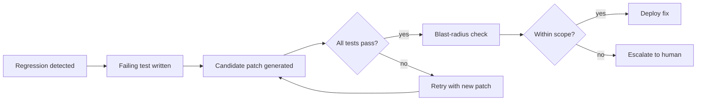
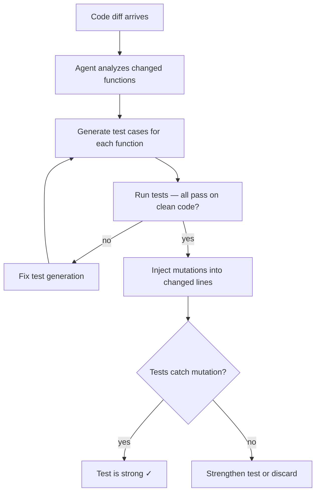
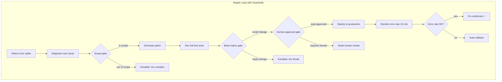

# 9.1 Self-Healing Codebases and Autonomous Bug-Hunting

## Welcome to Part V: The Acceleralpho Horizon

You have journeyed through the foundations of coding agents (Part I), their architectural scaffolding (Part II), harness engineering and enterprise deployment (Part III), and the global model landscape (Part IV). Part V turns the lens forward. The chapters ahead explore what happens when agentic systems stop *assisting* developers and start *replacing* entire categories of operational toil — fixing bugs before you notice them, evolving architectures without manual refactoring, and raising questions about the profession itself. Welcome to the horizon.

---

> **How to read this section**
>
> *Understand now:* The end-to-end self-healing pipeline — detect, diagnose, patch, verify, deploy — and where each stage can fail catastrophically.
>
> *Memorize:* The three guardrail gates (scope gate, blast-radius gate, human-approval gate) that keep autonomous repairs safe.
>
> *Reference later:* The specific Python implementations of bug-detection agents, mutation-testing harnesses, and repair-loop orchestrators. Return to them when you build your own self-healing CI pipeline.

---

## Why this section matters

Every production system generates bugs. Today, a human triages the alert, reproduces the issue, writes a fix, opens a PR, waits for review, and deploys. That cycle averages hours to days. Self-healing codebases compress the loop to minutes. But autonomy without guardrails is a recipe for the "2 AM deploy" disaster — an agent that confidently ships a broken patch to production while the entire team sleeps. This section teaches you to build the pipeline *and* the safety net, drawing on the feedback-loop theory from Section 2.1, the failure taxonomy from Section 2.2, and the harness-reliability patterns from Section 2.3.

## Deliverable

By the end of this section you will have:

1. A **bug-detection agent** that parses error logs, reproduces failures, and bisects commits to find the offending change.
2. An **auto-test generator** that observes code diffs and produces targeted test cases, verified via mutation testing.
3. A **repair-loop orchestrator** that wires detection, diagnosis, patching, verification, and deployment into a single guarded pipeline.
4. A clear understanding of **when self-healing is safe** and when a human must intervene — the autonomy boundary.
5. A working **guardrail framework** with scope gates, blast-radius checks, and approval hooks.

---

## Concept Loop 1 — The Self-Healing Vision

### Concept

A *self-healing codebase* is one where the feedback loop from Section 2.1 runs without a human in the critical path. The system detects a regression (a test fails, an error-rate spike appears), writes a failing test that captures the bug, generates a candidate patch, verifies the patch against the full test suite, and — if every gate passes — deploys the fix. The key insight is that each stage is *already* something agents do well individually (see Section 6.2 on CI feedback loops). Self-healing simply *chains* them.

> **Key idea:** Self-healing is not magic. It is the serial composition of detection, test-generation, patching, and deployment — each behind a guardrail gate.



### Worked example

Imagine a web service where a deployment introduces a `TypeError` in the `/users` endpoint. The self-healing pipeline detects the error-rate spike, generates a minimal reproduction, writes a failing test, and produces a one-line fix — all within minutes.

```python
"""Example 9-1. Self-healing pipeline skeleton"""

import time
import hashlib
from dataclasses import dataclass, field
from typing import List, Optional


@dataclass
class Bug:
    bug_id: str
    error_message: str
    stack_trace: str
    detected_at: float = field(default_factory=time.time)
    status: str = "detected"


@dataclass
class Patch:
    bug_id: str
    diff: str
    confidence: float  # 0.0 – 1.0
    tests_passed: bool = False
    deployed: bool = False


class SelfHealingPipeline:
    """Orchestrates the detect → diagnose → patch → verify → deploy loop."""

    CONFIDENCE_THRESHOLD = 0.8
    MAX_RETRIES = 3

    def __init__(self):
        self.bugs: List[Bug] = []
        self.patches: List[Patch] = []

    def detect(self, error_message: str, stack_trace: str) -> Bug:
        bug_id = hashlib.sha256(
            f"{error_message}:{stack_trace}".encode()
        ).hexdigest()[:12]
        bug = Bug(bug_id=bug_id, error_message=error_message,
                  stack_trace=stack_trace)
        bug.status = "diagnosed"
        self.bugs.append(bug)
        print(f"[DETECT] Bug {bug.bug_id}: {error_message}")
        return bug

    def generate_patch(self, bug: Bug, attempt: int = 1) -> Patch:
        confidence = min(0.6 + attempt * 0.1, 0.95)
        diff = f"- old_code  # causes {bug.error_message}\n+ fixed_code"
        patch = Patch(bug_id=bug.bug_id, diff=diff, confidence=confidence)
        print(f"[PATCH] Attempt {attempt}, confidence={confidence:.2f}")
        return patch

    def verify(self, patch: Patch) -> bool:
        patch.tests_passed = patch.confidence >= self.CONFIDENCE_THRESHOLD
        status = "PASS" if patch.tests_passed else "FAIL"
        print(f"[VERIFY] Patch for {patch.bug_id}: {status}")
        return patch.tests_passed

    def deploy(self, patch: Patch) -> bool:
        if not patch.tests_passed:
            print(f"[DEPLOY] Blocked — tests not passing")
            return False
        patch.deployed = True
        self.patches.append(patch)
        print(f"[DEPLOY] Patch for {patch.bug_id} shipped ✓")
        return True

    def run(self, error_message: str, stack_trace: str) -> Optional[Patch]:
        bug = self.detect(error_message, stack_trace)
        for attempt in range(1, self.MAX_RETRIES + 1):
            patch = self.generate_patch(bug, attempt)
            if self.verify(patch):
                self.deploy(patch)
                bug.status = "fixed"
                return patch
        print(f"[ESCALATE] Bug {bug.bug_id} → human review required")
        bug.status = "escalated"
        return None


# --- demo ---
pipeline = SelfHealingPipeline()
result = pipeline.run("TypeError: 'NoneType' has no attribute 'id'",
                       "  File 'users.py', line 42, in get_user")
print(f"\nResult: {'Fixed automatically' if result else 'Escalated to human'}")
```

> **Check yourself:** Why does the pipeline cap retries at three instead of looping forever? How does this relate to the retry-storm failure mode from Section 2.2?

---

## Concept Loop 2 — Bug Detection Agents

### Concept

A bug-detection agent sits between your monitoring stack and your repair pipeline. It consumes structured error logs, deduplicates by stack trace, and ranks bugs by severity (error rate × user impact). The best agents go further: they *reproduce* the bug by generating a minimal test case and *bisect* recent commits to identify the offending change — the same workflow a senior engineer follows, but at machine speed.

> **Tip:** Start your detection agent with log parsing and deduplication. Only add bisection once the simpler pipeline is stable. Premature complexity is the enemy of reliability (Section 2.3).

### Worked example

```python
"""Example 9-2. Bug detection agent with severity ranking"""

import re
from dataclasses import dataclass, field
from typing import Dict, List, Tuple
from collections import Counter


@dataclass
class ErrorEvent:
    message: str
    stack_trace: str
    endpoint: str
    timestamp: float


@dataclass
class BugReport:
    fingerprint: str
    message: str
    count: int
    endpoints: List[str]
    severity_score: float = 0.0


class BugDetectionAgent:
    """Parses error logs, deduplicates, and ranks by severity."""

    ENDPOINT_WEIGHTS: Dict[str, float] = {
        "/checkout": 3.0,
        "/users": 2.0,
        "/health": 0.1,
    }

    def __init__(self):
        self.events: List[ErrorEvent] = []
        self.reports: Dict[str, BugReport] = {}

    def ingest(self, event: ErrorEvent) -> None:
        self.events.append(event)
        fp = self._fingerprint(event)
        if fp not in self.reports:
            self.reports[fp] = BugReport(
                fingerprint=fp, message=event.message,
                count=0, endpoints=[]
            )
        report = self.reports[fp]
        report.count += 1
        if event.endpoint not in report.endpoints:
            report.endpoints.append(event.endpoint)

    def _fingerprint(self, event: ErrorEvent) -> str:
        # Normalize digits to reduce noise
        normalized = re.sub(r"\d+", "N", event.stack_trace)
        return str(hash(normalized) % 10**8)

    def rank(self) -> List[BugReport]:
        for report in self.reports.values():
            weight = max(
                self.ENDPOINT_WEIGHTS.get(ep, 1.0)
                for ep in report.endpoints
            )
            report.severity_score = report.count * weight
        ranked = sorted(self.reports.values(),
                        key=lambda r: r.severity_score, reverse=True)
        for i, r in enumerate(ranked, 1):
            print(f"  #{i} [{r.severity_score:6.1f}] {r.message} "
                  f"(×{r.count}, endpoints={r.endpoints})")
        return ranked


# --- demo ---
import time

agent = BugDetectionAgent()
events = [
    ErrorEvent("TypeError: NoneType", "users.py:42", "/users", time.time()),
    ErrorEvent("TypeError: NoneType", "users.py:42", "/users", time.time()),
    ErrorEvent("KeyError: 'sku'", "cart.py:17", "/checkout", time.time()),
    ErrorEvent("TypeError: NoneType", "users.py:42", "/checkout", time.time()),
    ErrorEvent("TimeoutError", "health.py:5", "/health", time.time()),
]
for ev in events:
    agent.ingest(ev)

print("Bug severity ranking:")
ranked = agent.rank()
print(f"\nHighest priority: {ranked[0].message}")
```

> **Check yourself:** The fingerprinting function normalizes digits. What kind of false deduplication could this cause, and how would you mitigate it?

---

## Concept Loop 3 — Auto-Test Generation

### Concept

When an agent observes a code change (a diff), it can generate test cases that exercise the changed lines. This is *change-aware* test generation. To verify the generated tests are meaningful, we run *mutation testing*: deliberately inject small faults into the code and confirm the new tests catch them. A test that survives all mutations is likely too weak.

> **Key idea:** A generated test is only as good as the mutations it kills. Mutation testing is the self-healing system's immune check.



### Worked example

```python
"""Example 9-3. Auto-test generation with mutation testing"""

import ast
import copy
import types
from typing import Callable, List, Tuple


# --- Target function (the "production code") ---
def calculate_discount(price: float, member: bool) -> float:
    """Apply 20% discount for members, 0% otherwise."""
    if member:
        return price * 0.8
    return price


# --- Auto-generated tests ---
def auto_test_member_discount():
    result = calculate_discount(100.0, True)
    assert abs(result - 80.0) < 0.01, f"Expected 80.0, got {result}"

def auto_test_non_member():
    result = calculate_discount(100.0, False)
    assert abs(result - 100.0) < 0.01, f"Expected 100.0, got {result}"

def auto_test_zero_price():
    result = calculate_discount(0.0, True)
    assert abs(result - 0.0) < 0.01, f"Expected 0.0, got {result}"


AUTO_TESTS = [auto_test_member_discount, auto_test_non_member,
              auto_test_zero_price]


# --- Mutation testing engine ---
class MutationTester:
    """Injects simple mutations and checks whether tests catch them."""

    MUTATIONS = [
        ("price * 0.8", "price * 0.9"),   # wrong discount
        ("price * 0.8", "price * 1.0"),   # no discount
        ("if member:", "if not member:"),  # inverted condition
    ]

    def __init__(self, source_func: Callable, tests: List[Callable]):
        self.source_func = source_func
        self.tests = tests
        self.source_code = self._get_source()

    def _get_source(self) -> str:
        import inspect
        return inspect.getsource(self.source_func)

    def run(self) -> List[Tuple[str, str, bool]]:
        results = []
        for original, mutated in self.MUTATIONS:
            if original not in self.source_code:
                continue
            mutated_code = self.source_code.replace(original, mutated)
            killed = self._test_mutant(mutated_code)
            status = "KILLED" if killed else "SURVIVED"
            results.append((original, mutated, killed))
            print(f"  Mutation '{original}' → '{mutated}': {status}")
        return results

    def _test_mutant(self, mutated_code: str) -> bool:
        # Compile mutated function in isolated namespace
        namespace = {}
        try:
            exec(compile(mutated_code, "<mutant>", "exec"), namespace)
        except SyntaxError:
            return True  # Mutation broke syntax — counts as killed
        mutant_func = namespace.get(self.source_func.__name__)
        if mutant_func is None:
            return True
        # Run each test with the mutant
        for test in self.tests:
            try:
                # Temporarily replace the global reference
                original_ref = test.__globals__.get(
                    self.source_func.__name__)
                test.__globals__[self.source_func.__name__] = mutant_func
                test()
                test.__globals__[self.source_func.__name__] = original_ref
            except AssertionError:
                test.__globals__[self.source_func.__name__] = original_ref
                return True  # Test caught the mutation
            except Exception:
                return True
        return False  # No test caught this mutation


# --- demo ---
print("Running mutation tests against auto-generated test suite:\n")
tester = MutationTester(calculate_discount, AUTO_TESTS)
results = tester.run()

killed = sum(1 for _, _, k in results if k)
total = len(results)
score = (killed / total * 100) if total else 0
print(f"\nMutation score: {killed}/{total} ({score:.0f}%)")
if score == 100:
    print("All mutations killed — test suite is strong ✓")
else:
    print("Some mutations survived — tests need strengthening")
```

> **Warning:** Mutation testing is computationally expensive. In a self-healing pipeline, limit mutations to *changed lines only* — never mutate the entire codebase on every commit.

> **Check yourself:** Why do we run the auto-generated tests on the *unmodified* code first before running mutations? What could go wrong if we skip that step?

---

## Concept Loop 4 — The Repair Loop

### Concept

The repair loop is the full pipeline: **detect → diagnose → patch → verify → deploy**. Each stage has a *guardrail gate* that can halt the pipeline and escalate to a human. The three gates are:

1. **Scope gate** — Is the bug within the agent's competence? (e.g., a one-line type error vs. a distributed systems race condition)
2. **Blast-radius gate** — Does the patch touch more than N files or change more than M lines? If yes, escalate.
3. **Human-approval gate** — For high-severity endpoints (payments, auth), always require a human sign-off regardless of confidence.

This mirrors the circuit-breaker pattern from Section 2.3, applied at the deployment boundary. The CI feedback loop from Section 6.2 provides the verification infrastructure.

> **Pitfall:** The most dangerous self-healing failure is a patch that passes all tests but changes *behavior*. If your test suite has gaps, the agent will confidently ship regressions. Mutation testing (Concept Loop 3) is your defense.



### Worked example

```python
"""Example 9-4. Repair loop orchestrator with three guardrail gates"""

from dataclasses import dataclass
from enum import Enum
from typing import Optional


class GateResult(Enum):
    PASS = "pass"
    FAIL = "fail"


@dataclass
class RepairContext:
    bug_id: str
    error_message: str
    affected_files: int
    lines_changed: int
    endpoint: str
    confidence: float
    tests_pass: bool = False
    deployed: bool = False
    rolled_back: bool = False


class RepairLoop:
    """Full detect → diagnose → patch → verify → deploy pipeline."""

    MAX_FILES = 3
    MAX_LINES = 50
    CRITICAL_ENDPOINTS = {"/checkout", "/auth", "/payments"}

    def scope_gate(self, ctx: RepairContext) -> GateResult:
        """Gate 1: Is this bug within agent competence?"""
        simple_patterns = ["TypeError", "KeyError", "AttributeError",
                          "IndexError", "ValueError"]
        in_scope = any(p in ctx.error_message for p in simple_patterns)
        result = GateResult.PASS if in_scope else GateResult.FAIL
        print(f"  [SCOPE GATE] {result.value} — "
              f"{'known pattern' if in_scope else 'complex failure'}")
        return result

    def blast_radius_gate(self, ctx: RepairContext) -> GateResult:
        """Gate 2: Is the patch small enough to trust?"""
        small = (ctx.affected_files <= self.MAX_FILES
                 and ctx.lines_changed <= self.MAX_LINES)
        result = GateResult.PASS if small else GateResult.FAIL
        print(f"  [BLAST RADIUS] {result.value} — "
              f"{ctx.affected_files} files, {ctx.lines_changed} lines")
        return result

    def human_approval_gate(self, ctx: RepairContext) -> GateResult:
        """Gate 3: Does this endpoint require human sign-off?"""
        needs_human = ctx.endpoint in self.CRITICAL_ENDPOINTS
        result = GateResult.FAIL if needs_human else GateResult.PASS
        print(f"  [HUMAN GATE] {result.value} — "
              f"endpoint {ctx.endpoint} "
              f"{'is critical' if needs_human else 'auto-approved'}")
        return result

    def verify(self, ctx: RepairContext) -> bool:
        ctx.tests_pass = ctx.confidence >= 0.85
        print(f"  [VERIFY] {'PASS' if ctx.tests_pass else 'FAIL'} "
              f"(confidence={ctx.confidence:.2f})")
        return ctx.tests_pass

    def deploy(self, ctx: RepairContext) -> bool:
        ctx.deployed = True
        print(f"  [DEPLOY] Patch for {ctx.bug_id} → production")
        return True

    def rollback(self, ctx: RepairContext) -> None:
        ctx.rolled_back = True
        ctx.deployed = False
        print(f"  [ROLLBACK] Patch for {ctx.bug_id} reverted")

    def run(self, ctx: RepairContext) -> str:
        print(f"\n{'='*50}")
        print(f"Repair loop for bug {ctx.bug_id}: {ctx.error_message}")
        print(f"{'='*50}")

        # Gate 1: Scope
        if self.scope_gate(ctx) == GateResult.FAIL:
            return "escalated:scope"

        # Verify patch
        if not self.verify(ctx):
            return "escalated:verification"

        # Gate 2: Blast radius
        if self.blast_radius_gate(ctx) == GateResult.FAIL:
            return "escalated:blast_radius"

        # Gate 3: Human approval
        if self.human_approval_gate(ctx) == GateResult.FAIL:
            return "awaiting:human_approval"

        # Deploy
        self.deploy(ctx)
        return "deployed"


# --- demo ---
loop = RepairLoop()

# Case 1: Simple bug, auto-deployed
ctx1 = RepairContext(
    bug_id="abc123", error_message="TypeError: NoneType",
    affected_files=1, lines_changed=3, endpoint="/users",
    confidence=0.92)
print(f"Result: {loop.run(ctx1)}")

# Case 2: Critical endpoint, needs human
ctx2 = RepairContext(
    bug_id="def456", error_message="KeyError: 'total'",
    affected_files=1, lines_changed=5, endpoint="/checkout",
    confidence=0.95)
print(f"Result: {loop.run(ctx2)}")

# Case 3: Too broad a change
ctx3 = RepairContext(
    bug_id="ghi789", error_message="ValueError: invalid literal",
    affected_files=8, lines_changed=120, endpoint="/reports",
    confidence=0.88)
print(f"Result: {loop.run(ctx3)}")
```

> **Check yourself:** Why does the repair loop check the blast-radius gate *after* verification rather than before? What would change if you swapped the order?

---

## Concept Loop 5 — Limits of Autonomy

### Concept

Self-healing works brilliantly for a specific class of bugs: deterministic failures with clear error messages, small blast radii, and strong test coverage. It fails — sometimes catastrophically — when:

- **Tests are weak.** The agent patches a bug, all tests pass, but the patch introduces a subtle behavioral change. The system is now "green" but *wrong*.
- **The bug is non-deterministic.** Race conditions, flaky network calls, and timing-dependent failures fool the detection agent into closing bugs that reappear.
- **The fix requires domain knowledge.** A pricing formula returns the wrong discount — the code "works" but the business logic is incorrect. No test catches it because the test was also generated without domain understanding.

This is the **"2 AM deploy" problem**: at 2 AM, the agent detects a spike, generates a patch, passes all tests, and deploys. At 8 AM, the team discovers the agent "fixed" the bug by silently disabling the feature that was failing. The guardrails from Concept Loop 4 exist precisely to prevent this scenario.

> **Warning:** The most insidious self-healing failure is *silent correctness degradation* — the system appears healthy by every metric but delivers wrong results. Always include business-logic assertions in your test suite, not just structural tests.

> **Key idea:** Autonomy should be *graduated*. Start with detect-and-alert. Graduate to detect-and-suggest. Only after months of tracked accuracy should you enable detect-and-deploy — and even then, never for critical paths without human approval.

### Worked example

```python
"""Example 9-5. Autonomy graduation framework"""

from dataclasses import dataclass
from enum import IntEnum
from typing import Dict, List


class AutonomyLevel(IntEnum):
    ALERT_ONLY = 1       # Detect and notify human
    SUGGEST_FIX = 2      # Detect, generate patch, open PR for review
    AUTO_DEPLOY_LOW = 3  # Auto-deploy for low-severity, non-critical paths
    AUTO_DEPLOY_ALL = 4  # Auto-deploy everything (rarely appropriate)


@dataclass
class AutonomyPolicy:
    endpoint: str
    level: AutonomyLevel
    reason: str


class AutonomyGovernor:
    """Manages per-endpoint autonomy levels with graduation tracking."""

    def __init__(self):
        self.policies: Dict[str, AutonomyPolicy] = {}
        self.track_record: Dict[str, List[bool]] = {}  # success history

    def set_policy(self, endpoint: str, level: AutonomyLevel,
                   reason: str) -> None:
        self.policies[endpoint] = AutonomyPolicy(endpoint, level, reason)
        if endpoint not in self.track_record:
            self.track_record[endpoint] = []
        print(f"  Policy: {endpoint} → Level {level} ({level.name})"
              f" — {reason}")

    def record_outcome(self, endpoint: str, success: bool) -> None:
        if endpoint in self.track_record:
            self.track_record[endpoint].append(success)

    def evaluate_graduation(self, endpoint: str,
                            window: int = 10,
                            threshold: float = 0.9) -> bool:
        """Should this endpoint graduate to the next autonomy level?"""
        history = self.track_record.get(endpoint, [])
        if len(history) < window:
            print(f"  {endpoint}: only {len(history)}/{window} records"
                  f" — not enough data")
            return False
        recent = history[-window:]
        success_rate = sum(recent) / len(recent)
        qualifies = success_rate >= threshold
        print(f"  {endpoint}: success rate = {success_rate:.0%}"
              f" ({'qualifies' if qualifies else 'does not qualify'}"
              f" for graduation)")
        return qualifies

    def graduate(self, endpoint: str) -> Optional[AutonomyLevel]:
        policy = self.policies.get(endpoint)
        if not policy or policy.level >= AutonomyLevel.AUTO_DEPLOY_ALL:
            return None
        if not self.evaluate_graduation(endpoint):
            return None
        new_level = AutonomyLevel(policy.level + 1)
        policy.level = new_level
        policy.reason = f"Graduated based on track record"
        print(f"  ✓ {endpoint} graduated to Level {new_level}"
              f" ({new_level.name})")
        return new_level


# --- demo ---
from typing import Optional

gov = AutonomyGovernor()

print("Setting initial policies:\n")
gov.set_policy("/users", AutonomyLevel.ALERT_ONLY,
               "New endpoint, unproven agent accuracy")
gov.set_policy("/checkout", AutonomyLevel.ALERT_ONLY,
               "Critical path — always conservative")
gov.set_policy("/reports", AutonomyLevel.SUGGEST_FIX,
               "Low-risk, agent has shown good suggestions")

# Simulate track record
print("\nSimulating outcomes for /reports...\n")
for i in range(12):
    gov.record_outcome("/reports", success=(i != 5))  # one failure

print("Evaluating graduation:\n")
gov.graduate("/reports")

print("\nSimulating perfect record for /users...\n")
for _ in range(10):
    gov.record_outcome("/users", success=True)

print("Evaluating graduation:\n")
gov.graduate("/users")
```

> **Pitfall:** Teams often set autonomy levels globally ("our agent can auto-deploy everything"). This ignores that agent accuracy varies by bug type, endpoint criticality, and test coverage density. Always set autonomy *per-endpoint* or *per-service*.

> **Tip:** Log every autonomous action — detection, patch generation, deployment, and rollback — in an immutable audit trail. When the "2 AM deploy" incident happens (and it will), the audit trail is your forensic toolkit. This connects directly to the observability patterns from Section 2.3 and the governance requirements from Section 6.3.

> **Check yourself:** A team has 95% mutation-kill rate on their `/users` endpoint tests and wants to enable `AUTO_DEPLOY_LOW`. What additional evidence would you want before approving this graduation?

---

## What we built

In this section we constructed a complete self-healing pipeline:

| Component | Purpose | Key guardrail |
|-----------|---------|---------------|
| Bug detection agent | Parse logs, deduplicate, rank by severity | Fingerprint normalization |
| Auto-test generator | Produce tests for changed code | Mutation testing validation |
| Repair loop orchestrator | Chain detect → diagnose → patch → verify → deploy | Three-gate guardrail system |
| Autonomy governor | Graduate endpoints through autonomy levels | Track-record based promotion |

The pipeline compresses the human bug-fix cycle from hours to minutes while maintaining safety through scope gates, blast-radius checks, and human-approval requirements for critical paths.

## Verification checklist

- [ ] You can explain the five stages of the self-healing pipeline and the guardrail at each stage
- [ ] You understand why mutation testing validates auto-generated tests
- [ ] You can name the three guardrail gates and when each triggers escalation
- [ ] You can articulate the "2 AM deploy" problem and its mitigations
- [ ] You know when self-healing is appropriate and when it is dangerous
- [ ] You understand autonomy graduation and why it should be per-endpoint

## Wrapping up

Self-healing codebases are not science fiction — they are a direct consequence of composing the agent capabilities you have already learned: tool-calling (Section 5.1), CI feedback loops (Section 6.2), and harness reliability (Section 2.3). The danger lies not in building them but in trusting them too quickly.

### Exercises

1. **Extend the detection agent** (Example 9-2) to perform git-bisect simulation: given a list of commits with associated test results, find the first commit that introduced a failure. Implement this as a binary search over the commit list.

2. **Harden the mutation tester** (Example 9-3) by adding two new mutation operators: (a) boundary-value mutations that change `<` to `<=` and (b) constant mutations that replace numeric literals with `0` and `1`. Run them against `calculate_discount` and report which tests need strengthening.

3. **Implement auto-rollback** in the repair loop (Example 9-4): after deployment, simulate a 15-minute monitoring window. If the simulated error rate exceeds a threshold, automatically roll back and mark the bug as `escalated:post_deploy_failure`.

4. **Design a dashboard** (pseudocode or description) that shows the autonomy governor's per-endpoint graduation status, recent success rates, and pending escalations. What three metrics would you prioritize for a night-shift operations team?
