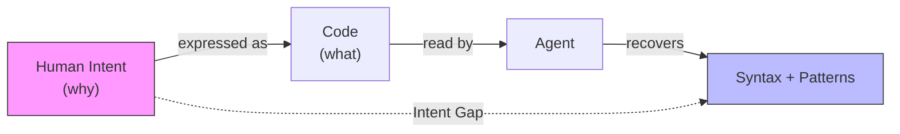
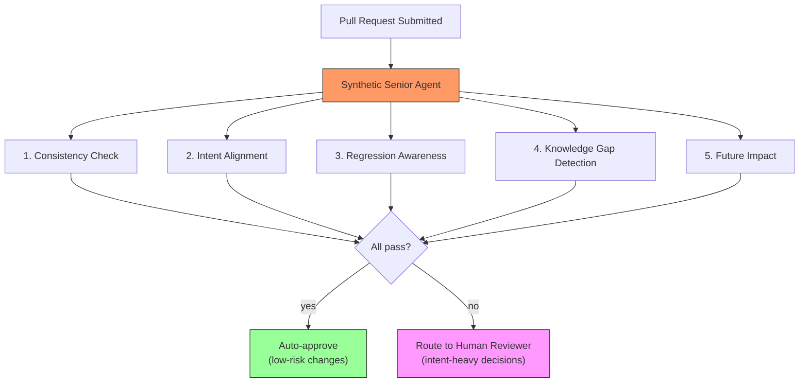
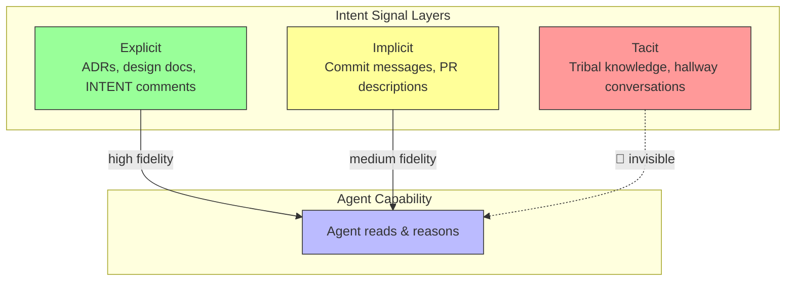

# 9.2 The Synthetic Senior: Managing Intent vs. Managing Code

> **How to read this section**
>
> *Understand now:* The difference between generating syntactically correct code and understanding *why* that code exists. Grasp why intent is the hardest signal for an agent to capture.
>
> *Memorize:* The Intent Gap model, the three layers of intent signals (explicit, implicit, tacit), and the five checks a Synthetic Senior must perform.
>
> *Reference later:* The intent-preserving refactoring patterns, the context-signal taxonomy, and the verification code examples.

---

## Why this section matters

In Section 9.1 we explored self-healing codebases—agents that detect failures and patch them autonomously. But patching a bug is not the same as understanding *why* the code was written that way in the first place. A senior engineer who reviews your pull request doesn't just check syntax; they ask "does this change preserve the original architectural intent?" They read commit messages, cross-reference ADRs, and interrogate design decisions that live nowhere in the code itself. The question at the heart of this section is stark: **can an agent do that, or is it forever trapped in high-speed pattern matching?** This matters because every organisation adopting coding agents will eventually discover that generating code is cheap—understanding intent is expensive. If we cannot teach agents to reason about intent, we build systems that accelerate in the wrong direction (see Section 2.1, the Ralph Wiggum Loop). The Synthetic Senior concept is our attempt to bridge that gap.

## Deliverable

By the end of this section you will be able to:

1. Define the Intent Gap and explain why pattern matching alone cannot close it.
2. Build a minimal Synthetic Senior review pipeline in Python that checks code against stated intent.
3. Classify intent signals into explicit, implicit, and tacit categories—and know which ones agents can read today.
4. Implement intent-preserving refactoring guards that detect when a transformation breaks purpose.
5. Articulate the irreducible role of the human in intent-heavy architectural decisions.

---

## Concept Loop 1 — The Intent Gap

### Concept

Code tells you *what*. Intent tells you *why*. Consider a function that retries an HTTP request three times with exponential backoff. The code says "retry three times." The intent might be "we negotiated an SLA with the payments provider that tolerates up to 12 seconds of downtime, and three retries with backoff covers that window." No amount of static analysis will recover that SLA from the source code alone.

We call this the **Intent Gap**: the distance between what a codebase expresses syntactically and the human reasoning that shaped its design.



> **Key idea:** The Intent Gap is not a bug in current models—it is a structural property of code itself. Code is a lossy compression of human reasoning. Every variable name, every architectural boundary, every "TODO: revisit" comment is a faint echo of a decision made by a person who is no longer in the room.

Agents today operate primarily on the *what* side of this diagram. They excel at pattern matching: "I've seen retry logic before, here's the best version." But the senior engineer asks: "Why three retries? Why not five? Why exponential backoff instead of linear?" Those questions require context that lives outside the codebase—in Slack threads, design documents, and the memories of the team (see Section 3.2 on hyper-context).

### Worked example

Let's build a simple intent gap detector. Given a function and a stated intent, we check whether the code's observable behaviour is consistent with the intent description.

```python
# Example 9-6. Measuring the Intent Gap with keyword extraction

import re
from collections import Counter


def extract_intent_keywords(intent_description: str) -> set:
    """Pull meaningful terms from a human-written intent statement."""
    stop_words = {
        "the", "a", "an", "is", "are", "was", "were", "be", "been",
        "to", "of", "in", "for", "on", "with", "at", "by", "from",
        "that", "this", "it", "and", "or", "but", "not", "we", "our",
    }
    words = re.findall(r"[a-z_][a-z0-9_]*", intent_description.lower())
    return {w for w in words if w not in stop_words and len(w) > 2}


def extract_code_signals(source_code: str) -> set:
    """Pull identifiers and string literals from source code."""
    identifiers = set(re.findall(r"[a-z_][a-z0-9_]*", source_code.lower()))
    string_lits = set(re.findall(r"['\"]([^'\"]+)['\"]", source_code.lower()))
    tokens = identifiers.copy()
    for lit in string_lits:
        tokens.update(re.findall(r"[a-z_][a-z0-9_]*", lit))
    return {t for t in tokens if len(t) > 2}


def measure_intent_gap(intent: str, code: str) -> dict:
    """Return overlap metrics between stated intent and code signals."""
    intent_kw = extract_intent_keywords(intent)
    code_kw = extract_code_signals(code)
    overlap = intent_kw & code_kw
    gap = intent_kw - code_kw
    coverage = len(overlap) / max(len(intent_kw), 1)
    return {
        "intent_keywords": sorted(intent_kw),
        "code_keywords_sample": sorted(list(code_kw)[:20]),
        "overlap": sorted(overlap),
        "gap": sorted(gap),
        "coverage": round(coverage, 2),
    }


# --- Demo ---
intent = (
    "Retry payments API calls up to 3 times with exponential backoff "
    "to satisfy the 12-second SLA negotiated with Stripe."
)

code = """
def call_payments_api(url, payload, max_retries=3):
    import time
    for attempt in range(max_retries):
        response = make_request(url, payload)
        if response.status == 200:
            return response
        time.sleep(2 ** attempt)
    raise TimeoutError("Payments API unavailable")
"""

result = measure_intent_gap(intent, code)
print("Coverage:", result["coverage"])
print("Gap (intent terms missing from code):", result["gap"])
# Expected output:
# Coverage: ~0.5
# Gap: ['12', 'exponential', 'negotiated', 'satisfy', 'second', 'sla', 'stripe']
```

Notice that critical business terms—*SLA*, *Stripe*, *negotiated*, *12-second*—are entirely absent from the code. The agent can reproduce the retry pattern perfectly, but the *reason* for that pattern is invisible.

> **Check yourself:** Pick a function from your own codebase. Write a one-sentence intent statement for it. How many of the intent keywords appear in the source code? What does the gap tell you?

---

## Concept Loop 2 — The Synthetic Senior

### Concept

A senior engineer reviewing a pull request performs at least five checks that go beyond syntax:

1. **Consistency check** — Does this change match our existing patterns?
2. **Intent alignment** — Does this change serve the stated goal?
3. **Regression awareness** — Could this break something we've fixed before?
4. **Knowledge gap detection** — Is the author missing context they should have?
5. **Future impact** — Will this make the next change harder?

The **Synthetic Senior** is an agent configured to perform these five checks systematically. It is not a replacement for a human senior—it is an augmentation layer that catches the 60–70% of review comments that are pattern-matchable, freeing the human to focus on the 30–40% that require genuine architectural judgement.

> **Key idea:** The Synthetic Senior is not about replacing human reviewers. It is about compressing the feedback loop so that human attention is spent on intent-heavy decisions, not style nits and pattern violations. Think of it as Boris (Section 1.2) inhabiting the reviewer role rather than the author role.



### Worked example

Here is a minimal Synthetic Senior that checks a code change against a project's stated conventions and intent.

```python
# Example 9-7. A minimal Synthetic Senior review engine

import re
from dataclasses import dataclass, field


@dataclass
class ReviewFinding:
    check: str
    severity: str  # "info", "warning", "error"
    message: str


@dataclass
class ProjectContext:
    """Simulates the knowledge a senior engineer carries."""
    naming_convention: str = "snake_case"
    max_function_lines: int = 40
    required_docstrings: bool = True
    known_intents: dict = field(default_factory=dict)
    past_bugs: list = field(default_factory=list)


def check_consistency(code: str, ctx: ProjectContext) -> list:
    """Check 1: Does the code follow project conventions?"""
    findings = []
    # Check naming convention
    camel_case = re.findall(r"\bdef ([a-z]+[A-Z][a-zA-Z]*)\b", code)
    if camel_case and ctx.naming_convention == "snake_case":
        for name in camel_case:
            findings.append(ReviewFinding(
                check="consistency",
                severity="warning",
                message=f"Function '{name}' uses camelCase; project uses snake_case.",
            ))
    # Check function length
    functions = re.split(r"\ndef ", code)
    for fn in functions[1:]:
        lines = fn.split("\n")
        name = lines[0].split("(")[0]
        if len(lines) > ctx.max_function_lines:
            findings.append(ReviewFinding(
                check="consistency",
                severity="warning",
                message=f"Function '{name}' is {len(lines)} lines (max {ctx.max_function_lines}).",
            ))
    return findings


def check_intent_alignment(code: str, stated_intent: str, ctx: ProjectContext) -> list:
    """Check 2: Does the change serve the stated goal?"""
    findings = []
    intent_lower = stated_intent.lower()
    # Simple heuristic: if intent says "read-only" but code writes...
    if "read-only" in intent_lower or "query" in intent_lower:
        write_signals = re.findall(
            r"\b(insert|update|delete|write|put|post|remove|drop)\b",
            code.lower(),
        )
        if write_signals:
            findings.append(ReviewFinding(
                check="intent_alignment",
                severity="error",
                message=(
                    f"Intent says '{stated_intent}' but code contains "
                    f"write operations: {write_signals}"
                ),
            ))
    return findings


def check_regression_risk(code: str, ctx: ProjectContext) -> list:
    """Check 3: Does this touch areas with known past bugs?"""
    findings = []
    for bug in ctx.past_bugs:
        if bug["pattern"] in code:
            findings.append(ReviewFinding(
                check="regression",
                severity="error",
                message=f"Code touches area of past bug: {bug['description']}",
            ))
    return findings


def synthetic_senior_review(code: str, intent: str, ctx: ProjectContext) -> list:
    """Run all checks and return findings."""
    findings = []
    findings.extend(check_consistency(code, ctx))
    findings.extend(check_intent_alignment(code, intent, ctx))
    findings.extend(check_regression_risk(code, ctx))
    return findings


# --- Demo ---
ctx = ProjectContext(
    known_intents={"payments": "handle retries for SLA compliance"},
    past_bugs=[
        {"pattern": "except Exception", "description": "Bare except hid payment failures (BUG-1234)"}
    ],
)

new_code = """
def fetchUserBalance(user_id):
    try:
        result = db.query("SELECT balance FROM accounts WHERE id = ?", user_id)
        return result
    except Exception:
        return None
"""

intent = "Read-only query to display user balance on dashboard"
findings = synthetic_senior_review(new_code, intent, ctx)
for f in findings:
    print(f"[{f.severity.upper()}] ({f.check}) {f.message}")
# Expected output:
# [WARNING] (consistency) Function 'fetchUserBalance' uses camelCase; project uses snake_case.
# [ERROR] (regression) Code touches area of past bug: Bare except hid payment failures (BUG-1234)
```

> **Tip:** In production, the `ProjectContext` would be populated from ADRs, linter configs, and a bug database. The Synthetic Senior becomes more powerful as you feed it richer context—exactly the hyper-context principle from Section 3.2.

> **Check yourself:** Add a fourth check—`check_docstring_presence`—that flags functions missing docstrings when `ctx.required_docstrings` is True. How would you weight this finding compared to a regression risk?

---

## Concept Loop 3 — Context as Intent Signal

### Concept

Intent doesn't vanish—it migrates. When a developer makes a decision, traces of that intent scatter across multiple artifacts:

| Signal Type | Examples | Agent Readability |
|---|---|---|
| **Explicit** | ADRs, design docs, inline `# INTENT:` comments | High — structured text |
| **Implicit** | Commit messages, PR descriptions, code review threads | Medium — noisy but parseable |
| **Tacit** | Hallway conversations, tribal knowledge, "everyone knows" rules | Low — not captured digitally |

The key insight: agents can only work with signals that are **written down and accessible**. This creates a virtuous cycle—teams that document intent well get better agent performance. Teams that rely on tacit knowledge find agents perpetually confused (see Section 4.2 on orchestration context).



> **Warning:** System prompts are the most powerful explicit intent signal available today. A poorly written system prompt is like giving a senior engineer a job description that says "write code." Invest in your system prompts the way you'd invest in onboarding documentation—because that is exactly what they are (see Section 1.2, Boris persona configuration).

### Worked example

Let's build an intent signal extractor that scores how well a codebase communicates intent to an agent.

```python
# Example 9-8. Extracting and scoring intent signals from code artifacts

import re
from dataclasses import dataclass


@dataclass
class IntentSignal:
    source: str      # "comment", "docstring", "commit_msg", "adr"
    signal_type: str  # "explicit", "implicit", "tacit"
    content: str
    strength: float   # 0.0 to 1.0


def extract_signals_from_source(code: str) -> list:
    """Extract intent signals embedded in source code."""
    signals = []

    # Explicit: INTENT comments
    intent_comments = re.findall(r"#\s*INTENT:\s*(.+)", code)
    for comment in intent_comments:
        signals.append(IntentSignal(
            source="comment",
            signal_type="explicit",
            content=comment.strip(),
            strength=0.9,
        ))

    # Explicit: docstrings (first line often states purpose)
    docstrings = re.findall(r'"""(.+?)"""', code, re.DOTALL)
    for doc in docstrings:
        first_line = doc.strip().split("\n")[0]
        signals.append(IntentSignal(
            source="docstring",
            signal_type="explicit",
            content=first_line,
            strength=0.7,
        ))

    # Implicit: TODO/FIXME/HACK comments carry hidden intent
    todo_comments = re.findall(r"#\s*(TODO|FIXME|HACK):\s*(.+)", code)
    for tag, comment in todo_comments:
        signals.append(IntentSignal(
            source="comment",
            signal_type="implicit",
            content=f"[{tag}] {comment.strip()}",
            strength=0.4,
        ))

    # Implicit: variable names that encode business meaning
    biz_vars = re.findall(r"\b(sla_\w+|max_retries|timeout_\w+|rate_limit\w*)\b", code)
    for var in set(biz_vars):
        signals.append(IntentSignal(
            source="naming",
            signal_type="implicit",
            content=f"Business-meaningful name: {var}",
            strength=0.3,
        ))

    return signals


def compute_intent_score(signals: list) -> dict:
    """Aggregate intent signals into an overall readability score."""
    if not signals:
        return {"score": 0.0, "grade": "F", "recommendation": "No intent signals found."}

    total_strength = sum(s.strength for s in signals)
    max_possible = len(signals) * 1.0
    score = round(total_strength / max_possible, 2)

    explicit_count = sum(1 for s in signals if s.signal_type == "explicit")
    implicit_count = sum(1 for s in signals if s.signal_type == "implicit")

    if score >= 0.7:
        grade = "A"
    elif score >= 0.5:
        grade = "B"
    elif score >= 0.3:
        grade = "C"
    else:
        grade = "D"

    return {
        "score": score,
        "grade": grade,
        "explicit_signals": explicit_count,
        "implicit_signals": implicit_count,
        "recommendation": (
            "Add INTENT comments to critical functions"
            if explicit_count < 2
            else "Intent coverage is adequate"
        ),
    }


# --- Demo ---
sample_code = '''
# INTENT: Rate-limit outbound API calls to respect Stripe's 100 req/s limit
def call_stripe(endpoint, payload, rate_limit_per_sec=100):
    """Send a request to Stripe with rate limiting."""
    import time
    # TODO: Replace with token bucket algorithm for burst handling
    sla_max_wait = 12  # seconds
    time.sleep(1 / rate_limit_per_sec)
    return make_request(endpoint, payload)
'''

signals = extract_signals_from_source(sample_code)
for s in signals:
    print(f"  [{s.signal_type:>8}] ({s.source:>10}) strength={s.strength:.1f}  {s.content}")

score = compute_intent_score(signals)
print(f"\nIntent Score: {score['score']} (Grade: {score['grade']})")
print(f"Recommendation: {score['recommendation']}")
# Expected:
# Intent Score: ~0.58 (Grade: B)
```

> **Pitfall:** Don't confuse *more comments* with *more intent*. A codebase full of `# increment counter` comments has high comment density but zero intent signal. The Synthetic Senior needs *why* comments, not *what* comments.

> **Check yourself:** Take three files from your project. Run the intent signal extractor mentally. Which files would an agent struggle with most? What's the cheapest change you could make to improve their intent score?

---

## Concept Loop 4 — Intent-Preserving Refactoring

### Concept

Refactoring is the acid test for intent understanding. A human developer who refactors `calculate_shipping_cost()` from a flat rate to a zone-based model knows they must preserve the *intent*—"charge the customer fairly based on distance"—even as every line of code changes. An agent performing the same refactoring might produce correct zone-based logic but accidentally drop the free-shipping threshold that was a business requirement.

**Intent-preserving refactoring** means: the observable purpose of the code is unchanged, even if the implementation is completely rewritten. We can build guards for this.

> **Key idea:** An intent-preserving refactoring guard works like a property-based test, but instead of testing *behaviour* it tests *purpose*. If the before-and-after code diverge on intent keywords, something important may have been lost.

### Worked example

```python
# Example 9-9. Intent-preservation guard for refactoring

import re
import ast
import textwrap


def extract_function_signatures(code: str) -> dict:
    """Extract function names, params, and docstrings."""
    try:
        tree = ast.parse(textwrap.dedent(code))
    except SyntaxError:
        return {}
    functions = {}
    for node in ast.walk(tree):
        if isinstance(node, (ast.FunctionDef, ast.AsyncFunctionDef)):
            doc = ast.get_docstring(node) or ""
            params = [arg.arg for arg in node.args.args]
            functions[node.name] = {
                "params": params,
                "docstring": doc,
                "line_count": node.end_lineno - node.lineno + 1,
            }
    return functions


def check_intent_preservation(before_code: str, after_code: str) -> list:
    """Compare before/after code to detect intent-breaking changes."""
    issues = []
    before_fns = extract_function_signatures(before_code)
    after_fns = extract_function_signatures(after_code)

    # Check 1: Were any functions removed?
    removed = set(before_fns.keys()) - set(after_fns.keys())
    for fn_name in removed:
        issues.append(f"REMOVED: Function '{fn_name}' was deleted during refactoring.")

    # Check 2: Did parameter semantics change?
    for fn_name in before_fns:
        if fn_name in after_fns:
            before_params = set(before_fns[fn_name]["params"])
            after_params = set(after_fns[fn_name]["params"])
            lost_params = before_params - after_params
            if lost_params:
                issues.append(
                    f"PARAM CHANGE: '{fn_name}' lost parameters: {lost_params}. "
                    f"Was this intentional?"
                )

    # Check 3: Did docstrings (intent carriers) survive?
    for fn_name in before_fns:
        if fn_name in after_fns:
            before_doc = before_fns[fn_name]["docstring"]
            after_doc = after_fns[fn_name]["docstring"]
            if before_doc and not after_doc:
                issues.append(
                    f"DOCSTRING LOST: '{fn_name}' had a docstring that was removed."
                )

    # Check 4: Were INTENT comments preserved?
    before_intents = set(re.findall(r"#\s*INTENT:\s*(.+)", before_code))
    after_intents = set(re.findall(r"#\s*INTENT:\s*(.+)", after_code))
    lost_intents = before_intents - after_intents
    for intent in lost_intents:
        issues.append(f"INTENT LOST: Comment '# INTENT: {intent}' was removed.")

    return issues


# --- Demo ---
before = '''
# INTENT: Free shipping for orders over $50 to boost conversion
def calculate_shipping(order_total, distance_km):
    """Calculate shipping cost with free-shipping threshold."""
    if order_total >= 50:
        return 0.0
    return distance_km * 0.05
'''

after = '''
def calculate_shipping(order_total):
    """Calculate shipping cost using zone-based pricing."""
    zones = {50: 5.99, 100: 8.99, 500: 12.99}
    for threshold, cost in sorted(zones.items()):
        if order_total <= threshold:
            return cost
    return 15.99
'''

issues = check_intent_preservation(before, after)
for issue in issues:
    print(f"  ⚠ {issue}")
# Expected output:
#   ⚠ PARAM CHANGE: 'calculate_shipping' lost parameters: {'distance_km'}. Was this intentional?
#   ⚠ INTENT LOST: Comment '# INTENT: Free shipping for orders over $50 to boost conversion' was removed.
```

The guard catches two critical issues: the `distance_km` parameter vanished (which might break callers), and the business intent about free shipping was silently dropped. A pure syntax-level refactoring tool would miss both.

> **Warning:** Intent-preservation guards produce *warnings*, not *errors*. Sometimes removing an intent is the whole point of the refactoring. The guard's job is to make intent changes *visible*, not to prevent them.

> **Check yourself:** Extend the guard to check whether the free-shipping threshold (`order_total >= 50`) survived the refactoring. What regex or AST pattern would you use?

---

## Concept Loop 5 — The Human Bottleneck

### Concept

After building Synthetic Seniors, intent extractors, and preservation guards, we arrive at an uncomfortable truth: **intent ultimately lives in human minds**. No amount of tooling eliminates the need for a human to say "yes, this is what we meant."

This is not a limitation to overcome—it is a feature to embrace. The human-in-the-loop exists precisely *because* some decisions cannot be reduced to pattern matching:

- **Trade-off decisions** — "We chose consistency over performance here." An agent cannot know your team's priorities without being told.
- **Political context** — "We use this vendor's API because of a partnership, not because it's the best option." No commit message captures this.
- **Evolving intent** — "We *used to* want X, but after last quarter's incident, we now want Y." The codebase still says X.

> **Pitfall:** The most dangerous failure mode of a Synthetic Senior is **false confidence**—when the agent approves a change because all its checks pass, but the intent has shifted in a way that no artifact captures. This is why Section 9.1's self-healing systems still need human circuit-breakers.

The optimal architecture is not "agent replaces human" but "agent handles the mechanical, human handles the meaningful":

```python
# Example 9-10. Routing decisions by intent complexity

from dataclasses import dataclass
from enum import Enum


class ReviewRoute(Enum):
    AUTO_APPROVE = "auto_approve"
    AGENT_REVIEW = "agent_review"
    HUMAN_REQUIRED = "human_required"


@dataclass
class ChangeRequest:
    files_changed: list
    intent_description: str
    touches_public_api: bool
    touches_billing: bool
    has_adr_reference: bool
    line_count: int


def route_review(change: ChangeRequest) -> ReviewRoute:
    """Decide who should review this change.

    The routing logic encodes an important principle:
    the higher the intent density, the more human attention required.
    """
    # High-intent changes always need humans
    if change.touches_billing:
        return ReviewRoute.HUMAN_REQUIRED

    if change.touches_public_api and not change.has_adr_reference:
        return ReviewRoute.HUMAN_REQUIRED

    # Medium-intent: agent can review with human spot-check
    if change.touches_public_api and change.has_adr_reference:
        return ReviewRoute.AGENT_REVIEW

    # Low-intent: style fixes, dependency bumps, documentation
    if change.line_count < 20 and not change.touches_public_api:
        return ReviewRoute.AUTO_APPROVE

    return ReviewRoute.AGENT_REVIEW


# --- Demo ---
changes = [
    ChangeRequest(
        files_changed=["README.md"],
        intent_description="Fix typo in installation instructions",
        touches_public_api=False,
        touches_billing=False,
        has_adr_reference=False,
        line_count=3,
    ),
    ChangeRequest(
        files_changed=["src/billing/charge.py"],
        intent_description="Update Stripe API version for PCI compliance",
        touches_public_api=False,
        touches_billing=True,
        has_adr_reference=True,
        line_count=45,
    ),
    ChangeRequest(
        files_changed=["src/api/users.py"],
        intent_description="Add pagination to user list endpoint per ADR-042",
        touches_public_api=True,
        touches_billing=False,
        has_adr_reference=True,
        line_count=120,
    ),
]

for c in changes:
    route = route_review(c)
    print(f"  {route.value:<16} | {c.intent_description}")
# Expected output:
#   auto_approve     | Fix typo in installation instructions
#   human_required   | Update Stripe API version for PCI compliance
#   agent_review     | Add pagination to user list endpoint per ADR-042
```

> **Key idea:** The human bottleneck is not a problem to solve—it is a design constraint to respect. The best agent architectures make the bottleneck *narrower* (fewer decisions requiring human input) and *faster* (better-prepared context when humans do engage). This is the essence of the orchestration patterns from Section 4.2.

> **Check yourself:** Look at your team's last 20 pull requests. What percentage would you trust a Synthetic Senior to auto-approve? What criteria separate the "safe" PRs from the "needs a human" PRs?

---

## What we built

In this section we constructed a layered understanding of how agents relate to code intent:

1. **The Intent Gap** — a model for understanding why code generation ≠ code understanding. Agents pattern-match on *what*; humans reason about *why*.
2. **The Synthetic Senior** — a review agent architecture that performs five checks beyond syntax: consistency, intent alignment, regression awareness, knowledge gaps, and future impact.
3. **Intent Signal Taxonomy** — a classification of explicit, implicit, and tacit intent signals, with an extractor that scores how agent-readable your codebase is.
4. **Intent-Preserving Refactoring Guards** — tools that detect when a refactoring silently drops business intent, parameter semantics, or purpose documentation.
5. **Review Routing by Intent Complexity** — a decision framework that sends low-intent changes to agents and high-intent changes to humans, optimising both speed and safety.

### Verification checklist

- [ ] You can explain the Intent Gap to a colleague in one sentence.
- [ ] You can run Example 9-6 and interpret the coverage score for your own code.
- [ ] You can list the five checks a Synthetic Senior performs.
- [ ] You can classify an intent signal as explicit, implicit, or tacit.
- [ ] You can describe when a refactoring guard should *warn* vs. when it should *block*.
- [ ] You can articulate why some review decisions are irreducibly human.

---

## Wrapping up

The Synthetic Senior is not a finished product—it is a direction. Today's agents are sophisticated pattern matchers that can catch naming violations, detect regression-prone code areas, and flag obvious intent mismatches. But they cannot yet sit in a design review and say "this architecture won't scale for the use case we discussed last Tuesday." That gap is narrowing, driven by longer context windows (Section 3.2), richer tool use (Section 4.2), and better grounding in project artifacts. The question is not *whether* agents will understand intent, but *how much intent we'll need to make explicit* before they can.

### Exercises

1. **Build a full Synthetic Senior pipeline.** Combine Examples 9-7, 9-8, and 9-9 into a single review tool that takes a git diff, extracts intent signals from the changed files, checks for intent preservation, and produces a structured review report. Test it against three real PRs from your project.

2. **Intent documentation sprint.** Pick five critical functions in your codebase that have no docstrings or intent comments. Add `# INTENT:` comments that capture the *why*. Then run the intent signal extractor from Example 9-8 before and after. Measure the improvement in intent score.

3. **Route your review queue.** Apply the routing logic from Example 9-10 to your team's last month of pull requests. Calculate what percentage could have been auto-approved or agent-reviewed. Estimate the time savings in human reviewer hours.

4. **The Tacit Knowledge Audit.** Interview three senior engineers on your team. Ask each: "What's one thing everyone on the team knows but nobody has written down?" Document these as ADRs or `# INTENT:` comments. Discuss how this changes the agent's ability to review code in those areas.
