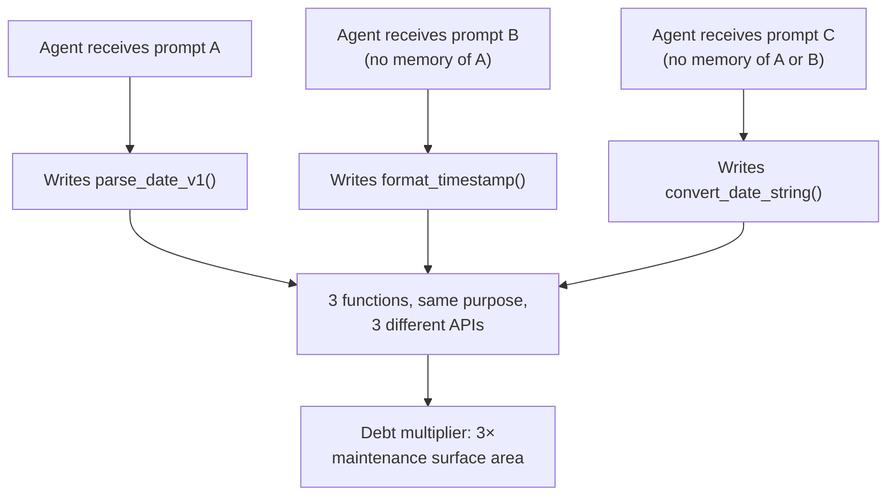
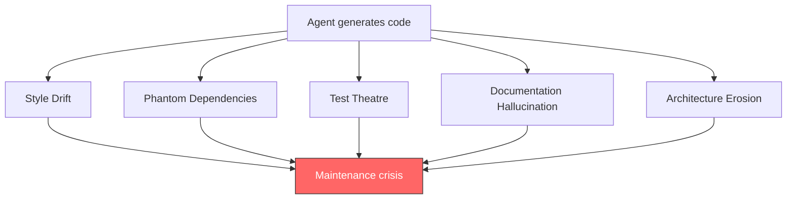
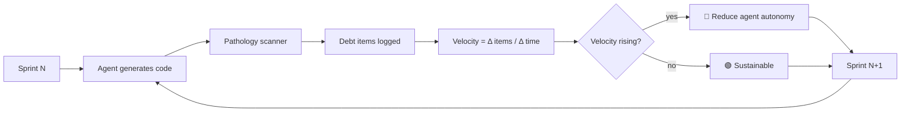

# 9.3 The Psychopathology of AI-Driven Technical Debt

> **How to read this section**
>
> *Understand now:* Why agentic code generation creates qualitatively different technical debt than human coding — faster, more patterned, and harder to detect until it compounds into a crisis.
>
> *Memorize:* The five pathologies (style drift, phantom dependencies, test theatre, documentation hallucination, architecture erosion) and the debt-budget formula that tells you when speed gains are worth the maintenance cost.
>
> *Reference later:* The Python implementations of pathology detectors, debt velocity trackers, prevention gate pipelines, and the debt budget calculator. Return to them when your team's agent-generated code starts feeling "off" but nobody can explain why.

---

## Why this section matters

Section 9.1 showed us how agents can heal codebases autonomously. Section 9.2 revealed that agents struggle to preserve the *intent* behind code even when they generate syntactically correct patches. This section explores the darker consequence of both: when agents write code at scale, they accumulate technical debt at a rate no human team has ever experienced. The debt is not the familiar kind — spaghetti code from a rushed sprint. It is *systematic*, *patterned*, and *invisible to the metrics we traditionally use*. A codebase can pass every lint check, every test, every code review, and still be rotting from the inside because the agent solved the same problem seventeen different ways across seventeen files.

This matters because the economics of agentic coding are seductive. Generating code is nearly free; maintaining it is not. The Ralph Wiggum loop from Section 2.1 applies here with full force: an agent that generates debt faster than humans can repay it is an agent accelerating in the wrong direction. The recursive failure patterns from Section 2.2 compound the problem — each layer of inconsistent agent output makes the next generation of agent output worse. And the reliability engineering principles from Section 2.3 give us the framework to fight back.

## Deliverable

By the end of this section you will be able to:

1. Quantify the **debt multiplier** — how much faster agents accumulate technical debt compared to human developers.
2. Identify the **five pathologies** specific to AI-generated code and build detectors for each.
3. Build a **debt velocity tracker** that measures debt accumulation rate across sprints.
4. Implement a **prevention gate pipeline** that catches agent-specific debt before it merges.
5. Calculate a **debt budget** that models the break-even point between agent speed gains and accumulated maintenance cost.

---

## Concept Loop 1 — The Debt Multiplier

### Concept

Human developers write technical debt at a roughly linear rate: one shortcut per time-pressure decision. Agents write debt at 10–100× that rate — not because they are worse programmers, but because they are *faster* ones with *no memory between sessions*. An agent asked to write a date-parsing utility on Monday does not remember that it wrote a different one on Friday. Every prompt is a blank slate, producing **copy-paste at industrial scale**: dozens of functions solving the same problem in slightly different, mutually incompatible ways.

> **Key idea:** The debt multiplier is not about code quality per line. Line-for-line, agent code may be *better* than human code. The multiplier comes from *inconsistency at scale* — the same problem solved differently across files, with no shared abstraction.



> **Warning:** The debt multiplier is invisible to standard metrics. Lines of code, cyclomatic complexity, and test coverage all look fine. You need *semantic deduplication analysis* to detect it.

### Worked example

We simulate an agent generating multiple functions for the same task and calculate the debt multiplier.

```python
"""Example 9-11. Debt multiplier calculator for agent-generated code"""

from dataclasses import dataclass
from collections import defaultdict


@dataclass
class GeneratedFunction:
    name: str
    purpose: str          # semantic description of what it does
    file_path: str
    line_count: int


def calculate_debt_multiplier(functions: list) -> dict:
    """Measure the debt multiplier from duplicate purposes."""
    groups = defaultdict(list)
    for fn in functions:
        groups[fn.purpose].append(fn)

    dupes = {p: [f.name for f in fns] for p, fns in groups.items() if len(fns) > 1}
    wasted = sum(
        sum(f.line_count for f in sorted(fns, key=lambda f: f.line_count)[1:])
        for fns in groups.values() if len(fns) > 1
    )
    multiplier = round(len(functions) / len(groups), 2) if groups else 0.0

    return {"total": len(functions), "unique": len(groups),
            "multiplier": multiplier, "wasted_lines": wasted, "dupes": dupes}


# --- Demo ---
functions = [
    GeneratedFunction("parse_date", "parse date string", "src/utils.py", 12),
    GeneratedFunction("format_timestamp", "parse date string", "src/api/helpers.py", 18),
    GeneratedFunction("convert_date_str", "parse date string", "src/reports/dates.py", 15),
    GeneratedFunction("validate_email", "validate email format", "src/auth/checks.py", 8),
    GeneratedFunction("check_email_valid", "validate email format", "src/api/validators.py", 11),
    GeneratedFunction("sanitize_input", "sanitize user input", "src/security/clean.py", 20),
    GeneratedFunction("clean_user_input", "sanitize user input", "src/api/middleware.py", 25),
    GeneratedFunction("compute_tax", "calculate sales tax", "src/billing/tax.py", 30),
]

report = calculate_debt_multiplier(functions)
print(f"Total functions: {report['total']},  Unique purposes: {report['unique']}")
print(f"Debt multiplier: {report['multiplier']}×,  Wasted lines: {report['wasted_lines']}")
for purpose, names in report["dupes"].items():
    print(f"  '{purpose}' → {names}")
# Expected output:
# Total functions: 8,  Unique purposes: 4
# Debt multiplier: 2.0×,  Wasted lines: 64
# 'parse date string' → ['parse_date', 'format_timestamp', 'convert_date_str']
# 'validate email format' → ['validate_email', 'check_email_valid']
# 'sanitize user input' → ['sanitize_input', 'clean_user_input']
```

> **Check yourself:** How many utility functions in your codebase do roughly the same thing? Now imagine an agent quadrupling that count over six months.

---

## Concept Loop 2 — The Five Pathologies

### Concept

Not all AI-generated debt looks the same. Five distinct pathologies emerge from observing agent output across production codebases:

**(a) Style Drift** — Inconsistent naming conventions, formatting, and idioms across sessions. One file uses `snake_case` with type hints; the next uses `camelCase` without.

**(b) Phantom Dependencies** — Agents import libraries from training data even when the standard library suffices. Your `requirements.txt` balloons with packages used once each, some introducing security vulnerabilities (see Section 6.3).

**(c) Test Theatre** — Tests that achieve high coverage but test nothing meaningful: `assert True`, trivial happy-path checks, mocked-to-uselessness stubs.

**(d) Documentation Hallucination** — Docstrings describing parameters the function doesn't have, return types it doesn't return, or behaviors it doesn't exhibit.

**(e) Architecture Erosion** — The agent bypasses module boundaries to "make it work now." Service A imports internals from Service B. The dependency graph becomes a hairball.



> **Tip:** Rank pathologies by impact in your codebase and tackle the top two first. Style drift and test theatre are usually the highest-ROI targets.

### Worked example

We build detectors that scan code strings for each pathology.

```python
"""Example 9-12. Five-pathology detector for AI-generated code"""

import re, ast, textwrap
from dataclasses import dataclass


@dataclass
class PathologyReport:
    pathology: str
    severity: str
    evidence: str


def detect_style_drift(code_samples: list) -> list:
    """Detect inconsistent naming conventions across samples."""
    styles = set()
    for code in code_samples:
        if re.findall(r"\bdef [a-z]+_[a-z]+", code): styles.add("snake_case")
        if re.findall(r"\bdef [a-z]+[A-Z][a-z]+", code): styles.add("camelCase")
    if len(styles) > 1:
        return [PathologyReport("Style Drift", "medium", f"Mixed: {styles}")]
    return []


def detect_test_theatre(test_code: str) -> list:
    """Detect tests with trivial assertions."""
    trivial = [(r"assert\s+True", "bare assert True"),
               (r"assert\s+1\s*==\s*1", "tautological assertion")]
    reports = []
    for pattern, desc in trivial:
        n = len(re.findall(pattern, test_code, re.MULTILINE))
        if n:
            reports.append(PathologyReport("Test Theatre", "high", f"{n}× {desc}"))
    return reports


def detect_doc_hallucination(code: str) -> list:
    """Detect docstrings referencing non-existent parameters."""
    reports = []
    try:
        tree = ast.parse(textwrap.dedent(code))
    except SyntaxError:
        return reports
    for node in ast.walk(tree):
        if isinstance(node, ast.FunctionDef):
            doc = ast.get_docstring(node) or ""
            actual = {a.arg for a in node.args.args} - {"self", "cls"}
            documented = set(re.findall(r":param\s+(\w+)", doc))
            phantom = documented - actual
            if phantom:
                reports.append(PathologyReport(
                    "Doc Hallucination", "medium",
                    f"{node.name}() references phantom params: {phantom}"))
    return reports


def detect_architecture_erosion(import_map: dict) -> list:
    """Detect cross-boundary imports violating module structure."""
    forbidden = {"api": {"billing._internal"}, "billing": {"api._handlers"}}
    reports = []
    for module, imports in import_map.items():
        layer = module.split(".")[0]
        for imp in imports:
            for rule in forbidden.get(layer, set()):
                if imp.startswith(rule):
                    reports.append(PathologyReport(
                        "Architecture Erosion", "high",
                        f"'{module}' imports '{imp}' — crosses boundary"))
    return reports


# --- Demo ---
all_reports = []
all_reports += detect_style_drift([
    "def get_user_name(uid): pass", "def getUserAge(uid): pass"])
all_reports += detect_test_theatre("def test_it():\n    assert True\n    assert 1 == 1\n")
all_reports += detect_doc_hallucination('''
def send_email(recipient, subject):
    """:param recipient: addr\n    :param attachment: file"""
    pass
''')
all_reports += detect_architecture_erosion({
    "api.users": ["billing._internal.ledger"],
    "billing.charge": ["api._handlers.webhook"]})

for r in all_reports:
    print(f"  [{r.severity:>6}] {r.pathology:<24} {r.evidence}")
# Expected output:
#   [medium] Style Drift              Mixed: {'snake_case', 'camelCase'}
#   [  high] Test Theatre             1× bare assert True
#   [  high] Test Theatre             1× tautological assertion
#   [medium] Doc Hallucination        send_email() references phantom params: {'attachment'}
#   [  high] Architecture Erosion     'api.users' imports 'billing._internal.ledger' — crosses boundary
#   [  high] Architecture Erosion     'billing.charge' imports 'api._handlers.webhook' — crosses boundary
```

> **Pitfall:** Documentation hallucination is the sneakiest pathology because humans *also* skim docstrings and assume they are correct. An agent that writes convincing-but-wrong docs creates a trap for future agents that read those docs as ground truth — a recursive failure per Section 2.2.

> **Check yourself:** Which of the five pathologies is most dangerous in *your* codebase? Which would an agent notice if asked to review the code?

---

## Concept Loop 3 — Detection and Measurement

### Concept

You cannot manage what you cannot measure. Traditional debt metrics — complexity, duplication percentage, TODO count — were designed for human coding patterns. AI-generated debt requires new metrics:

- **Debt velocity** — How many debt items accumulate per sprint? Is the rate accelerating?
- **Pathology distribution** — Which of the five pathologies dominate?
- **Agent attribution** — Can you distinguish agent-authored from human-authored code?
- **Debt half-life** — How long does a debt item survive before someone fixes it?

> **Key idea:** Debt velocity — the rate of debt accumulation per sprint — is the single most important metric for AI-assisted teams. If velocity is increasing, your agents are outrunning your ability to maintain the code they write.



### Worked example

We build a debt velocity tracker that measures accumulation across simulated sprints.

```python
"""Example 9-13. Debt velocity tracker across sprints"""

from dataclasses import dataclass, field
from typing import List


@dataclass
class SprintSnapshot:
    sprint: int
    new_items: int
    resolved: int
    total_open: int
    velocity: float       # net new debt
    acceleration: float   # change in velocity


class DebtVelocityTracker:
    def __init__(self):
        self.open_debt = 0
        self.snapshots: List[SprintSnapshot] = []

    def record_sprint(self, sprint: int, new: int, resolved: int):
        self.open_debt += new - resolved
        velocity = new - resolved
        prev_vel = self.snapshots[-1].velocity if self.snapshots else 0.0
        snap = SprintSnapshot(sprint, new, resolved, self.open_debt,
                              velocity, velocity - prev_vel)
        self.snapshots.append(snap)
        return snap


# --- Demo ---
tracker = DebtVelocityTracker()
sprint_data = [
    (1, 5, 1), (2, 12, 2), (3, 13, 3), (4, 19, 2), (5, 18, 4), (6, 20, 3),
]

print(f"{'Sprint':>6} {'New':>5} {'Fixed':>6} {'Open':>6} {'Vel':>6} {'Accel':>7}")
print("-" * 42)
for sprint, new, resolved in sprint_data:
    s = tracker.record_sprint(sprint, new, resolved)
    flag = "🔴" if s.acceleration > 0 else "🟢"
    print(f"{s.sprint:>6} {s.new_items:>5} {s.resolved:>6} "
          f"{s.total_open:>6} {s.velocity:>+6.0f} {s.acceleration:>+7.0f} {flag}")
# Expected output:
# Sprint   New  Fixed   Open    Vel   Accel
# ------------------------------------------
#      1     5      1      4     +4      +4 🔴
#      2    12      2     14    +10      +6 🔴
#      3    13      3     24    +10      +0 🟢
#      4    19      2     41    +17      +7 🔴
#      5    18      4     55    +14      -3 🟢
#      6    20      3     72    +17      +3 🔴
```

> **Warning:** Positive velocity means debt is growing every sprint. Positive *acceleration* means it is growing *faster*. If both are positive for three consecutive sprints, your codebase is on an unsustainable trajectory.

> **Check yourself:** At sprint 6, 20 new items arrived and 3 were fixed. How many sprints until open debt exceeds 100? What would you change?

---

## Concept Loop 4 — Prevention Patterns

### Concept

Detection tells you where the debt is. Prevention stops it from arriving. Four prevention patterns matter most for agent-generated code:

1. **Style enforcement** — A *style fingerprint* that rejects code deviating from project patterns. Agents drift because they have no memory; the gate *is* the memory.
2. **Architectural fitness functions** — Automated checks validating module boundaries and dependency directions. Catches architecture erosion before it reaches `main`.
3. **Meaningful test coverage gates** — Beyond line coverage: non-trivial assertions, error-path exercise, mutation testing confirmation.
4. **Agent output heuristics** — Checks for agent tells: unnecessary imports, too-generic docstrings, training-data patterns.

> **Key idea:** Prevention gates for agent code must target *systematic* failure modes — patterns an agent produces repeatedly — rather than the *idiosyncratic* mistakes humans make.

> **Tip:** Run prevention gates *before* human review. The reviewer then sees only code that passed agent-specific checks and can focus on intent and architecture (Section 9.2).

### Worked example

We implement a prevention gate pipeline checking style, dependencies, architecture, and test quality.

```python
"""Example 9-14. Prevention gate pipeline for agent-generated code"""

import re
from dataclasses import dataclass
from enum import Enum


class Verdict(Enum):
    PASS = "PASS"; WARN = "WARN"; BLOCK = "BLOCK"


@dataclass
class GateResult:
    gate: str
    verdict: Verdict
    details: str


ALLOWED_IMPORTS = {"os", "sys", "re", "json", "math", "time", "datetime",
                   "collections", "functools", "typing", "pathlib", "dataclasses",
                   "enum", "ast", "logging", "unittest", "io", "hashlib"}

BOUNDARY_RULES = {"api": ["models", "services"],
                  "services": ["models", "repositories"],
                  "repositories": ["models"]}


def gate_style(code: str) -> GateResult:
    camel = re.findall(r"def ([a-z]+[A-Z][a-zA-Z]+)\(", code)
    if camel:
        return GateResult("Style", Verdict.BLOCK, f"camelCase found: {camel}")
    return GateResult("Style", Verdict.PASS, "All snake_case")


def gate_deps(code: str) -> GateResult:
    imports = re.findall(r"^(?:import|from)\s+([\w.]+)", code, re.MULTILINE)
    bad = {i.split(".")[0] for i in imports} - ALLOWED_IMPORTS
    if bad:
        return GateResult("Dependencies", Verdict.WARN, f"Unapproved: {bad}")
    return GateResult("Dependencies", Verdict.PASS, "All approved")


def gate_arch(module_path: str, imports: list) -> GateResult:
    layer = module_path.split("/")[0]
    allowed = BOUNDARY_RULES.get(layer)
    if allowed is None:
        return GateResult("Architecture", Verdict.PASS, "No rules for layer")
    violations = [i for i in imports if i.split(".")[0] not in allowed and i.split(".")[0] != layer]
    if violations:
        return GateResult("Architecture", Verdict.BLOCK, f"Violations: {violations}")
    return GateResult("Architecture", Verdict.PASS, "Boundaries respected")


def gate_tests(test_code: str) -> GateResult:
    total = len(re.findall(r"\bassert", test_code))
    trivial = sum(len(re.findall(p, test_code))
                  for p in [r"assert\s+True", r"assert\s+1\s*==\s*1"])
    if total == 0:
        return GateResult("Test Quality", Verdict.BLOCK, "No assertions")
    ratio = trivial / total
    if ratio > 0.3:
        return GateResult("Test Quality", Verdict.BLOCK,
                          f"{trivial}/{total} trivial ({ratio:.0%})")
    return GateResult("Test Quality", Verdict.PASS, f"{total} assertions, OK")


# --- Demo ---
code = "import requests\ndef getUserProfile(uid): pass\ndef get_settings(uid): pass"
tests = "def test_it():\n    assert True\n    assert x == 1\n    assert y > 0\n"

results = [gate_style(code), gate_deps(code),
           gate_arch("api/users.py", ["models.user", "billing.internal"]),
           gate_tests(tests)]

can_merge = all(r.verdict != Verdict.BLOCK for r in results)
print(f"Can merge: {'✅' if can_merge else '❌'}")
for r in results:
    icon = {"PASS": "✅", "WARN": "⚠️", "BLOCK": "❌"}[r.verdict.value]
    print(f"  {icon} {r.gate:<18} {r.details}")
# Expected output:
# Can merge: ❌
#   ❌ Style              camelCase found: ['getUserProfile']
#   ⚠️ Dependencies       Unapproved: {'requests'}
#   ❌ Architecture       Violations: ['billing.internal']
#   ❌ Test Quality       1/4 trivial (25%)
```

> **Pitfall:** Do not make gates so strict that agents cannot produce *any* passing code. Start with `WARN` thresholds and tighten to `BLOCK` as your team calibrates.

> **Check yourself:** If you added this pipeline to your CI today, what percentage of recent agent-generated PRs would pass?

---

## Concept Loop 5 — The Debt Budget

### Concept

Here is the uncomfortable truth: **some AI-generated debt is worth taking on**. An agent that writes code 5× faster but introduces 2× the debt is still a net win — *if* you budget for maintenance. The debt budget formalizes three decisions:

1. **Debt ceiling** — Maximum tolerable open items per sprint.
2. **Repayment cadence** — How often to schedule debt repayment sprints.
3. **Intervention threshold** — When to reduce agent autonomy.

The formula: `Net value = (Speed gain × Dev cost) − (Debt items × Repair cost)`. When net value crosses zero, you have hit the **break-even point** — accumulated debt erases the speed advantage.

> **Key idea:** A debt budget treats technical debt like financial debt. You borrow speed now and pay maintenance later. The interest rate is the debt multiplier from Concept Loop 1. If you never make payments, you go bankrupt.

> **Warning:** Teams that adopt agents without a debt budget typically hit break-even within 6–12 months. By then, repayment requires a multi-sprint effort that erases the speed advantage retroactively.

### Worked example

We build a debt budget calculator that models speed gains versus maintenance costs over time.

```python
"""Example 9-15. Debt budget calculator — speed vs. maintenance trade-off"""

from dataclasses import dataclass


@dataclass
class BudgetConfig:
    sprints: int
    dev_hourly_cost: float
    hours_per_sprint: float
    speed_multiplier: float       # e.g., 3.0 means 3× faster
    debt_per_sprint: float        # new debt items agent creates
    hours_to_fix_item: float      # average repair cost
    repay_every: int              # repayment sprint cadence
    debt_ceiling: int


def run_budget(cfg: BudgetConfig) -> list:
    results, open_debt, cum_value, cum_cost = [], 0.0, 0.0, 0.0

    for sprint in range(1, cfg.sprints + 1):
        is_repay = (sprint % cfg.repay_every == 0)
        if is_repay:
            fixed = min(open_debt, cfg.hours_per_sprint / cfg.hours_to_fix_item)
            open_debt -= fixed
            repair = fixed * cfg.hours_to_fix_item * cfg.dev_hourly_cost
            cum_cost += repair
            sprint_val = 0
        else:
            gain = cfg.hours_per_sprint * (1 - 1 / cfg.speed_multiplier)
            sprint_val = gain * cfg.dev_hourly_cost
            open_debt += cfg.debt_per_sprint

        cum_value += sprint_val
        carrying = open_debt * 0.5 * cfg.dev_hourly_cost
        adj_net = (cum_value - cum_cost) - carrying

        results.append({"sprint": sprint, "repay": is_repay,
                        "debt": round(open_debt, 1), "adj_net": round(adj_net, 2),
                        "over_ceiling": open_debt > cfg.debt_ceiling})
    return results


# --- Demo ---
cfg = BudgetConfig(sprints=12, dev_hourly_cost=75.0, hours_per_sprint=80,
                   speed_multiplier=3.0, debt_per_sprint=8,
                   hours_to_fix_item=2.0, repay_every=4, debt_ceiling=40)

results = run_budget(cfg)
print(f"{'Sprint':>6} {'Type':<7} {'Debt':>6} {'AdjNet':>10} {'Status'}")
print("-" * 42)
for r in results:
    t = "REPAY" if r["repay"] else "BUILD"
    s = "🔴 OVER" if r["over_ceiling"] else "🟢 OK"
    print(f"{r['sprint']:>6} {t:<7} {r['debt']:>6} {r['adj_net']:>10.2f} {s}")

breakeven = next((r["sprint"] for r in results if r["adj_net"] < 0 and r["sprint"] > 1), None)
if breakeven:
    print(f"\n⚠️  Break-even crossed at sprint {breakeven}.")
else:
    print(f"\n✅ Net value positive across all {cfg.sprints} sprints.")
```

> **Tip:** Adjust `repay_every` and `debt_per_sprint` to find your sustainable ratio. Most teams find one repayment sprint per 3–4 build sprints keeps debt manageable.

> **Check yourself:** Plug your team's real hourly cost and sprint velocity into the calculator. What is your projected break-even point?

---

## What we built

In this section we constructed a complete framework for understanding, detecting, preventing, and budgeting the technical debt that agentic code generation produces:

| Component | Purpose | Example |
|---|---|---|
| Debt multiplier calculator | Quantify duplication rate from stateless agent sessions | Example 9-11 |
| Five-pathology detector | Identify style drift, phantom deps, test theatre, doc hallucination, architecture erosion | Example 9-12 |
| Debt velocity tracker | Measure accumulation rate with acceleration alerts | Example 9-13 |
| Prevention gate pipeline | Catch agent-specific debt before merge | Example 9-14 |
| Debt budget calculator | Model speed-vs-maintenance trade-off and find break-even | Example 9-15 |

### Verification checklist

- [ ] You can explain the debt multiplier to a non-technical stakeholder in one sentence.
- [ ] You can name all five pathologies and give an example of each.
- [ ] You can run Example 9-12 against your team's agent-generated code and interpret results.
- [ ] You can calculate debt velocity for your last three sprints using Example 9-13.
- [ ] You can describe the difference between a `WARN` gate and a `BLOCK` gate.
- [ ] You can compute a debt budget using real hourly costs and sprint data.
- [ ] You can identify when your team has crossed break-even and articulate intervention options.

---

## Wrapping up

AI-generated technical debt is not a hypothetical future problem — it is happening now, in every codebase where agents write code at scale. The five pathologies are already present in your code; the debt multiplier is already compounding. The difference between teams that thrive with agents and teams that drown in maintenance is whether they *measure, prevent, and budget* for the debt those agents create. Use the instruments in this section early and often, and never let the speed advantage fool you into ignoring the maintenance invoice.

### Exercises

1. **Pathology audit.** Run the five-pathology detector (Example 9-12) against ten files — five human-written and five agent-generated. Compare the pathology distribution. Which pathologies are unique to agent output?

2. **Debt velocity dashboard.** Extend Example 9-13 to read from your issue tracker. Plot velocity and acceleration over 6 sprints and present the chart to your team lead.

3. **Prevention gate integration.** Add Example 9-14 to your CI as a non-blocking check. Collect data for two weeks, then decide which gates to promote to blocking.

4. **Debt budget negotiation.** Use Example 9-15 with real numbers to calculate break-even. Present results to your engineering manager and negotiate a repayment sprint cadence.

---

## Wrapping Up Chapter 9

Chapter 9 has taken you through the frontier of agentic software engineering — where agents stop being tools and start being *participants* in the codebase lifecycle.

In **Section 9.1**, we built self-healing pipelines guarded by scope, blast-radius, and human-approval gates. The lesson: autonomy without guardrails is a disaster; autonomy *with* guardrails is a superpower.

In **Section 9.2**, we confronted the Intent Gap — the chasm between what code says and why it was written. The Synthetic Senior showed that reviewing code requires understanding *purpose*, not just *patterns*.

In **Section 9.3**, we faced the debt side of the ledger. Agents that write 10× faster accumulate debt 10× faster, in five pathologies that traditional metrics miss. We built detectors, prevention gates, and budget calculators to keep it sustainable.

The thread connecting all three sections is **feedback loops** — the same concept from Section 2.1. Self-healing is a feedback loop from production to code. Intent preservation is a feedback loop from human reasoning to agent output. Debt management is a feedback loop from maintenance cost to agent autonomy. Master these loops and you master the agentic future.

Chapter 10 picks up where this leaves off, exploring what happens when these feedback loops operate not within a single team but across entire organisations — the emergence of **agentic software ecosystems** where agents collaborate, compete, and co-evolve with the humans who built them.
