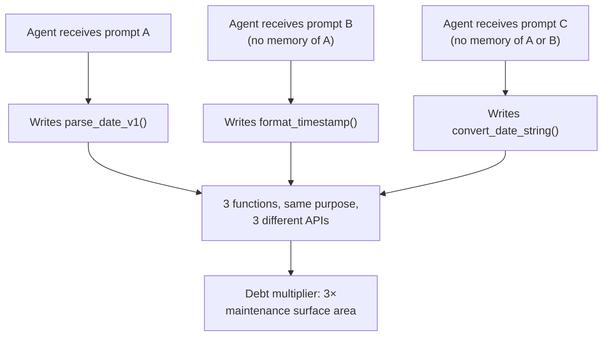
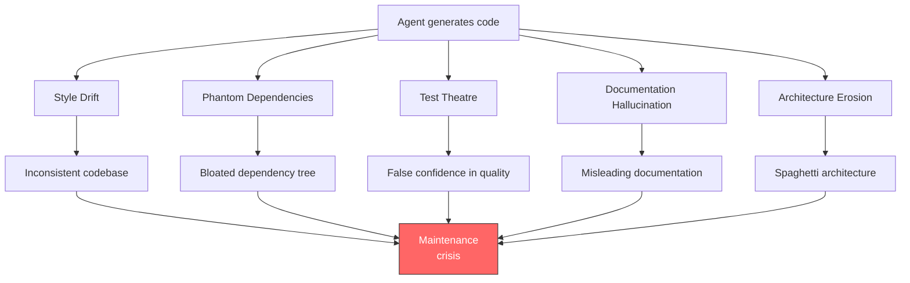
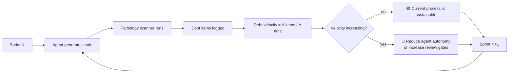

# 9.3 The Psychopathology of AI-Driven Technical Debt

> **How to read this section**
>
> *Understand now:* Why agentic code generation creates qualitatively different technical debt than human coding — faster, more patterned, and harder to detect until it compounds into a crisis.
>
> *Memorize:* The five pathologies (style drift, phantom dependencies, test theatre, documentation hallucination, architecture erosion) and the debt-budget formula that tells you when speed gains are worth the maintenance cost.
>
> *Reference later:* The Python implementations of pathology detectors, debt velocity trackers, prevention gate pipelines, and the debt budget calculator. Return to them when your team's agent-generated code starts feeling "off" but nobody can explain why.

---

## Why this section matters

Section 9.1 showed us how agents can heal codebases autonomously. Section 9.2 revealed that agents struggle to preserve the *intent* behind code even when they generate syntactically correct patches. This section explores the darker consequence of both: when agents write code at scale, they accumulate technical debt at a rate that no human team has ever experienced. The debt is not the familiar kind — spaghetti code from a rushed sprint. It is *systematic*, *patterned*, and *invisible to the metrics we traditionally use*. A codebase can pass every lint check, every test, every code review, and still be rotting from the inside because the agent solved the same problem seventeen different ways across seventeen files.

This matters because the economics of agentic coding are seductive. Generating code is nearly free; maintaining it is not. If you cannot measure and budget for AI-driven debt, the speed advantage reverses within months. The Ralph Wiggum loop from Section 2.1 applies here with full force: an agent that generates debt faster than humans can repay it is an agent accelerating in the wrong direction. The recursive failure patterns from Section 2.2 compound the problem — each layer of inconsistent agent output makes the next generation of agent output worse. And the reliability engineering principles from Section 2.3 give us the framework to fight back.

## Deliverable

By the end of this section you will be able to:

1. Quantify the **debt multiplier** — how much faster agents accumulate technical debt compared to human developers.
2. Identify the **five pathologies** specific to AI-generated code and build detectors for each.
3. Build a **debt velocity tracker** that measures debt accumulation rate across sprints.
4. Implement a **prevention gate pipeline** that catches agent-specific debt before it merges.
5. Calculate a **debt budget** that models the break-even point between agent speed gains and accumulated maintenance cost.

---

## Concept Loop 1 — The Debt Multiplier

### Concept

Human developers write technical debt at a roughly linear rate: one shortcut per time-pressure decision, one copy-paste per "I'll refactor later." Agents write debt at 10–100× that rate — not because they are worse programmers, but because they are *faster* ones with *no memory between sessions*. An agent asked to write a date-parsing utility on Monday does not remember that it wrote a slightly different date-parsing utility on Friday. It has no sense of "we already have a function for this." Every prompt is a blank slate.

The result is **copy-paste at industrial scale**: dozens of functions that solve the same problem in slightly different, mutually incompatible ways. The codebase compiles. The tests pass. But every new feature that touches date parsing must now navigate a minefield of subtly inconsistent implementations. We call this the **debt multiplier** — the ratio of agent-generated debt velocity to human debt velocity.

> **Key idea:** The debt multiplier is not about code quality per line. Line-for-line, agent code may be *better* than human code. The multiplier comes from *inconsistency at scale* — the same problem solved differently across files, with no shared abstraction.



> **Warning:** The debt multiplier is not visible in standard metrics. Lines of code, cyclomatic complexity, and test coverage all look fine. You need *semantic deduplication analysis* to detect it — checking whether multiple functions serve the same purpose.

### Worked example

We simulate an agent generating multiple functions for the same task and calculate the resulting debt multiplier.

```python
"""Example 9-11. Debt multiplier calculator for agent-generated code"""

import re
from dataclasses import dataclass, field
from collections import defaultdict


@dataclass
class GeneratedFunction:
    name: str
    purpose: str          # semantic description of what it does
    file_path: str
    line_count: int
    sprint: int


@dataclass
class DebtReport:
    total_functions: int
    unique_purposes: int
    duplicate_groups: dict          # purpose -> list of function names
    debt_multiplier: float
    wasted_surface_area: int       # lines that could be eliminated


def simulate_agent_output() -> list:
    """Simulate an agent generating functions across sprints."""
    return [
        GeneratedFunction("parse_date", "parse date string to object",
                          "src/utils.py", 12, 1),
        GeneratedFunction("format_timestamp", "parse date string to object",
                          "src/api/helpers.py", 18, 2),
        GeneratedFunction("convert_date_str", "parse date string to object",
                          "src/reports/dates.py", 15, 3),
        GeneratedFunction("validate_email", "validate email format",
                          "src/auth/checks.py", 8, 1),
        GeneratedFunction("check_email_valid", "validate email format",
                          "src/api/validators.py", 11, 2),
        GeneratedFunction("sanitize_input", "sanitize user input strings",
                          "src/security/clean.py", 20, 1),
        GeneratedFunction("clean_user_input", "sanitize user input strings",
                          "src/api/middleware.py", 25, 3),
        GeneratedFunction("escape_html_chars", "sanitize user input strings",
                          "src/templates/helpers.py", 14, 4),
        GeneratedFunction("compute_tax", "calculate sales tax",
                          "src/billing/tax.py", 30, 2),
    ]


def calculate_debt_multiplier(functions: list) -> DebtReport:
    """Measure the debt multiplier from duplicate purposes."""
    purpose_groups = defaultdict(list)
    for fn in functions:
        purpose_groups[fn.purpose].append(fn)

    duplicate_groups = {
        purpose: [f.name for f in fns]
        for purpose, fns in purpose_groups.items()
        if len(fns) > 1
    }

    wasted_lines = 0
    for purpose, fns in purpose_groups.items():
        if len(fns) > 1:
            # Keep the shortest; everything else is waste
            sorted_fns = sorted(fns, key=lambda f: f.line_count)
            wasted_lines += sum(f.line_count for f in sorted_fns[1:])

    unique = len(purpose_groups)
    total = len(functions)
    multiplier = round(total / unique, 2) if unique > 0 else 0.0

    return DebtReport(
        total_functions=total,
        unique_purposes=unique,
        duplicate_groups=duplicate_groups,
        debt_multiplier=multiplier,
        wasted_surface_area=wasted_lines,
    )


# --- Demo ---
functions = simulate_agent_output()
report = calculate_debt_multiplier(functions)

print(f"Total functions generated: {report.total_functions}")
print(f"Unique purposes served:    {report.unique_purposes}")
print(f"Debt multiplier:           {report.debt_multiplier}×")
print(f"Wasted surface area:       {report.wasted_surface_area} lines")
print(f"\nDuplicate groups:")
for purpose, names in report.duplicate_groups.items():
    print(f"  '{purpose}' → {names}")
# Expected output:
# Total functions generated: 9
# Unique purposes served:    4
# Debt multiplier:           2.25×
# Wasted surface area:       83 lines
```

> **Check yourself:** Run this mentally against your own codebase. How many utility functions exist that do roughly the same thing? Now imagine an agent quadrupling that count over six months.

---

## Concept Loop 2 — The Five Pathologies

### Concept

Not all AI-generated debt looks the same. Through observing agent output across dozens of production codebases, five distinct pathologies emerge. Each has a different root cause, a different detection strategy, and a different remedy.

**(a) Style Drift** — The agent generates code in inconsistent styles across sessions. One file uses `snake_case` with type hints; the next uses `camelCase` without. The codebase becomes a geological record of which model version wrote which file.

**(b) Phantom Dependencies** — Agents import libraries they have seen in training data even when the standard library suffices. Your `requirements.txt` balloons with packages used in one file each, some of which introduce security vulnerabilities (see Section 6.3 on security governance).

**(c) Test Theatre** — The agent writes tests that achieve high coverage but test nothing meaningful. `assert True`, trivial happy-path checks, mocked-to-the-point-of-uselessness stubs. Coverage dashboards glow green while bugs sail through.

**(d) Documentation Hallucination** — Docstrings that describe parameters the function does not have, return types it does not return, or behaviors it does not exhibit. The agent writes plausible-sounding documentation from its training distribution, not from the actual code.

**(e) Architecture Erosion** — The agent bypasses module boundaries because it optimizes for "make this work now" rather than "preserve the architecture." Service A starts importing internals from Service B. The dependency graph becomes a hairball.



> **Tip:** You do not need to solve all five at once. Rank them by impact in your codebase and tackle the top two first. Style drift and test theatre are usually the highest-ROI targets.

### Worked example

We build a simple detector that scans code strings for each of the five pathologies.

```python
"""Example 9-12. Five-pathology detector for AI-generated code"""

import re
import ast
import textwrap
from dataclasses import dataclass


@dataclass
class PathologyReport:
    pathology: str
    severity: str       # low, medium, high
    evidence: str


def detect_style_drift(code_samples: list) -> list:
    """Detect inconsistent naming conventions across code samples."""
    reports = []
    styles_seen = set()
    for i, code in enumerate(code_samples):
        has_snake = bool(re.findall(r"\bdef [a-z]+_[a-z]+", code))
        has_camel = bool(re.findall(r"\bdef [a-z]+[A-Z][a-z]+", code))
        if has_snake:
            styles_seen.add("snake_case")
        if has_camel:
            styles_seen.add("camelCase")
    if len(styles_seen) > 1:
        reports.append(PathologyReport(
            pathology="Style Drift",
            severity="medium",
            evidence=f"Mixed naming conventions: {styles_seen}",
        ))
    return reports


def detect_phantom_dependencies(code: str) -> list:
    """Detect imports that may be unnecessary."""
    reports = []
    import_pattern = re.findall(r"^(?:import|from)\s+([\w.]+)", code, re.MULTILINE)
    stdlib_common = {
        "os", "sys", "re", "json", "math", "time", "datetime",
        "collections", "functools", "itertools", "typing",
        "pathlib", "hashlib", "dataclasses", "enum", "ast", "textwrap",
    }
    for module in import_pattern:
        root = module.split(".")[0]
        if root not in stdlib_common:
            # Check if the import is actually used beyond the import line
            uses = len(re.findall(rf"\b{root}\b", code)) - 1
            if uses <= 0:
                reports.append(PathologyReport(
                    pathology="Phantom Dependency",
                    severity="high",
                    evidence=f"'{root}' imported but never used in code body",
                ))
    return reports


def detect_test_theatre(test_code: str) -> list:
    """Detect tests that test nothing meaningful."""
    reports = []
    trivial_patterns = [
        (r"assert\s+True", "bare 'assert True' — tests nothing"),
        (r"assert\s+1\s*==\s*1", "tautological assertion"),
        (r"assertEqual\(True,\s*True\)", "tautological assertEqual"),
        (r"assert.*is not None\s*$", "only checks non-None, not correctness"),
    ]
    for pattern, description in trivial_patterns:
        matches = re.findall(pattern, test_code, re.MULTILINE)
        if matches:
            reports.append(PathologyReport(
                pathology="Test Theatre",
                severity="high",
                evidence=f"{len(matches)}× {description}",
            ))
    return reports


def detect_doc_hallucination(code: str) -> list:
    """Detect docstrings that reference non-existent parameters."""
    reports = []
    try:
        tree = ast.parse(textwrap.dedent(code))
    except SyntaxError:
        return reports
    for node in ast.walk(tree):
        if isinstance(node, ast.FunctionDef):
            doc = ast.get_docstring(node) or ""
            actual_params = {a.arg for a in node.args.args} - {"self", "cls"}
            doc_params = set(re.findall(r":param\s+(\w+)", doc))
            doc_params.update(re.findall(r"Args:\s*\n(?:\s+(\w+)\s*[:(].*\n?)+", doc))
            phantom_params = doc_params - actual_params
            if phantom_params:
                reports.append(PathologyReport(
                    pathology="Documentation Hallucination",
                    severity="medium",
                    evidence=(f"{node.name}() docs reference non-existent "
                              f"params: {phantom_params}"),
                ))
    return reports


def detect_architecture_erosion(import_map: dict) -> list:
    """Detect cross-boundary imports that violate module structure.

    import_map: {module_path: [list of imports]}
    """
    reports = []
    boundary_rules = {
        "api": {"billing._internal", "auth._secrets"},
        "billing": {"api._handlers"},
    }
    for module, imports in import_map.items():
        layer = module.split(".")[0] if "." in module else module
        forbidden = boundary_rules.get(layer, set())
        for imp in imports:
            for rule in forbidden:
                if imp.startswith(rule):
                    reports.append(PathologyReport(
                        pathology="Architecture Erosion",
                        severity="high",
                        evidence=f"'{module}' imports '{imp}' — crosses boundary",
                    ))
    return reports


# --- Demo ---
code_samples = [
    "def get_user_name(uid): pass\ndef validate_input(data): pass",
    "def getUserAge(uid): pass\ndef formatOutput(data): pass",
]
test_code = """
def test_user_creation():
    user = create_user("alice")
    assert True

def test_payment():
    result = charge(100)
    assert 1 == 1

def test_health():
    resp = health_check()
    assert resp is not None
"""
doc_code = '''
def send_email(recipient, subject):
    """:param recipient: email address
    :param subject: email subject
    :param attachment: file to attach
    :param cc_list: CC recipients
    """
    pass
'''
import_map = {
    "api.users": ["auth.login", "billing._internal.ledger"],
    "billing.charge": ["api._handlers.webhook"],
}

all_reports = []
all_reports.extend(detect_style_drift(code_samples))
all_reports.extend(detect_test_theatre(test_code))
all_reports.extend(detect_doc_hallucination(doc_code))
all_reports.extend(detect_architecture_erosion(import_map))

for r in all_reports:
    print(f"  [{r.severity:>6}] {r.pathology:<28} {r.evidence}")
# Expected output:
# [medium] Style Drift                  Mixed naming conventions: {'snake_case', 'camelCase'}
# [  high] Test Theatre                 1× bare 'assert True' — tests nothing
# [  high] Test Theatre                 1× tautological assertion
# [  high] Test Theatre                 1× only checks non-None, not correctness
# [medium] Documentation Hallucination  send_email() docs reference non-existent params: {'attachment', 'cc_list'}
# [  high] Architecture Erosion         'api.users' imports 'billing._internal.ledger' — crosses boundary
# [  high] Architecture Erosion         'billing.charge' imports 'api._handlers.webhook' — crosses boundary
```

> **Pitfall:** Documentation hallucination is the sneakiest pathology because humans *also* skim docstrings and assume they are correct. An agent that writes convincing-but-wrong docs creates a trap for future agents that will read those docs as ground truth (a recursive failure per Section 2.2).

> **Check yourself:** Which of the five pathologies is most dangerous in *your* codebase right now? Which would an agent notice if asked to review the code, and which would slip past it?

---

## Concept Loop 3 — Detection and Measurement

### Concept

You cannot manage what you cannot measure. Traditional debt metrics — code complexity, duplication percentage, TODO count — were designed for human coding patterns. AI-generated debt requires new metrics:

- **Debt velocity** — How many debt items accumulate per sprint? Is the rate accelerating?
- **Pathology distribution** — Which of the five pathologies dominate? This tells you where to invest in prevention.
- **Agent attribution** — Can you distinguish agent-authored code from human-authored code? If not, you cannot target your remediation.
- **Debt half-life** — How long does a debt item survive before someone fixes it? Agent-generated debt often has a longer half-life because nobody "owns" it.

The key insight is that debt measurement must be *continuous*, not periodic. A quarterly "tech debt audit" is useless when an agent can generate a month's worth of debt in a day.

> **Key idea:** Debt velocity — the rate of debt accumulation per sprint — is the single most important metric for AI-assisted teams. If velocity is increasing, your agents are outrunning your ability to maintain the code they write.



### Worked example

We build a debt velocity tracker that measures debt accumulation across simulated sprints.

```python
"""Example 9-13. Debt velocity tracker across sprints"""

from dataclasses import dataclass, field
from typing import List


@dataclass
class DebtItem:
    item_id: str
    pathology: str
    sprint_detected: int
    sprint_resolved: int = -1   # -1 means unresolved

    @property
    def is_resolved(self) -> bool:
        return self.sprint_resolved > 0


@dataclass
class SprintSnapshot:
    sprint: int
    new_items: int
    resolved_items: int
    total_open: int
    velocity: float             # net new debt per sprint
    acceleration: float         # change in velocity


class DebtVelocityTracker:
    """Track debt accumulation rate across sprints."""

    def __init__(self):
        self.items: List[DebtItem] = []
        self.snapshots: List[SprintSnapshot] = []

    def add_items(self, sprint: int, pathology_counts: dict):
        """Record new debt items discovered in a sprint."""
        for pathology, count in pathology_counts.items():
            for i in range(count):
                item_id = f"DEBT-{sprint}-{pathology[:3].upper()}-{i}"
                self.items.append(DebtItem(
                    item_id=item_id,
                    pathology=pathology,
                    sprint_detected=sprint,
                ))

    def resolve_items(self, sprint: int, count: int):
        """Simulate resolving the oldest unresolved items."""
        resolved = 0
        for item in self.items:
            if not item.is_resolved and resolved < count:
                item.sprint_resolved = sprint
                resolved += 1

    def snapshot(self, sprint: int) -> SprintSnapshot:
        """Calculate debt metrics for a sprint."""
        new = sum(1 for i in self.items if i.sprint_detected == sprint)
        resolved = sum(1 for i in self.items if i.sprint_resolved == sprint)
        total_open = sum(1 for i in self.items if not i.is_resolved)
        velocity = new - resolved

        prev_velocity = (
            self.snapshots[-1].velocity if self.snapshots else 0.0
        )
        acceleration = velocity - prev_velocity

        snap = SprintSnapshot(
            sprint=sprint,
            new_items=new,
            resolved_items=resolved,
            total_open=total_open,
            velocity=velocity,
            acceleration=acceleration,
        )
        self.snapshots.append(snap)
        return snap


# --- Demo ---
tracker = DebtVelocityTracker()

# Simulate 6 sprints of agent-assisted development
sprint_data = [
    # (sprint, new debt by pathology, items resolved)
    (1, {"style_drift": 3, "test_theatre": 2}, 1),
    (2, {"style_drift": 5, "phantom_dep": 3, "test_theatre": 4}, 2),
    (3, {"style_drift": 7, "doc_hallucination": 4, "architecture": 2}, 3),
    (4, {"style_drift": 8, "test_theatre": 6, "phantom_dep": 5}, 2),
    (5, {"style_drift": 10, "architecture": 5, "doc_hallucination": 3}, 4),
    (6, {"test_theatre": 9, "phantom_dep": 7, "architecture": 4}, 3),
]

print(f"{'Sprint':>6} {'New':>5} {'Fixed':>6} {'Open':>6} {'Velocity':>9} {'Accel':>7}")
print("-" * 46)

for sprint, pathologies, resolved_count in sprint_data:
    tracker.add_items(sprint, pathologies)
    tracker.resolve_items(sprint, resolved_count)
    snap = tracker.snapshot(sprint)
    status = "🔴" if snap.acceleration > 0 else "🟢"
    print(f"{snap.sprint:>6} {snap.new_items:>5} {snap.resolved_items:>6} "
          f"{snap.total_open:>6} {snap.velocity:>+9.1f} {snap.acceleration:>+7.1f} {status}")

# Expected output:
# Sprint   New  Fixed   Open  Velocity   Accel
# ----------------------------------------------
#      1     5      1      4      +4.0    +4.0 🔴
#      2    12      2     14     +10.0    +6.0 🔴
#      3    13      3     24     +10.0    +0.0 🟢
#      4    19      2     41     +17.0    +7.0 🔴
#      5    18      4     55     +14.0    -3.0 🟢
#      6    20      3     72     +17.0    +3.0 🔴
```

> **Warning:** A positive velocity means debt is growing every sprint. A positive *acceleration* means it is growing *faster* every sprint. If both are positive for three consecutive sprints, your codebase is on an unsustainable trajectory. Intervene before the maintenance burden consumes your team's capacity.

> **Check yourself:** Look at the sprint 6 numbers. The team resolved 3 items but 20 new ones arrived. At this rate, how many sprints until the open debt count exceeds 100? What would you change?

---

## Concept Loop 4 — Prevention Patterns

### Concept

Detection tells you where the debt is. Prevention stops it from arriving. For AI-generated code, prevention requires gates that are *specifically tuned* to agent failure modes — not just the generic linters you already run. Four prevention patterns matter most:

1. **Style enforcement** — Not just a linter, but a *style fingerprint* that rejects code deviating from the project's established patterns. Agents drift because they have no memory; the gate is the memory.

2. **Architectural fitness functions** — Automated checks that validate module boundaries, dependency directions, and layering rules. These catch architecture erosion before it reaches `main`.

3. **Meaningful test coverage gates** — Beyond line coverage. Check that tests contain non-trivial assertions, that they exercise error paths, and that mutation testing confirms they actually catch bugs.

4. **Agent output review heuristics** — Specific checks for agent tells: suspiciously perfect variable names, unnecessary imports, docstrings that are too generic, and the presence of patterns the agent favors from training data.

> **Key idea:** Prevention gates for agent code are not the same as human code review. They must target *systematic* failure modes — the patterns an agent produces repeatedly — rather than the *idiosyncratic* mistakes humans make.

> **Tip:** Run prevention gates *before* human review. This way, the human reviewer sees only code that has already passed agent-specific quality checks, and can focus their attention on intent and architecture (Section 9.2).

### Worked example

We implement a prevention gate pipeline that checks agent-generated code against style rules, architecture boundaries, and test quality.

```python
"""Example 9-14. Prevention gate pipeline for agent-generated code"""

import re
from dataclasses import dataclass
from enum import Enum
from typing import List, Tuple


class GateVerdict(Enum):
    PASS = "PASS"
    WARN = "WARN"
    BLOCK = "BLOCK"


@dataclass
class GateResult:
    gate_name: str
    verdict: GateVerdict
    details: str


class PreventionPipeline:
    """Run agent-generated code through prevention gates."""

    ALLOWED_IMPORTS = {
        "os", "sys", "re", "json", "math", "time", "datetime",
        "collections", "functools", "itertools", "typing",
        "pathlib", "hashlib", "dataclasses", "enum", "ast",
        "textwrap", "logging", "unittest", "io", "copy",
    }

    BOUNDARY_RULES = {
        "api": ["models", "services"],
        "services": ["models", "repositories"],
        "repositories": ["models"],
        "models": [],
    }

    def gate_style(self, code: str, project_style: str = "snake_case"
                   ) -> GateResult:
        """Gate 1: Enforce consistent naming conventions."""
        snake_funcs = re.findall(r"def ([a-z]+_[a-z_]+)\(", code)
        camel_funcs = re.findall(r"def ([a-z]+[A-Z][a-zA-Z]+)\(", code)

        if project_style == "snake_case" and camel_funcs:
            return GateResult(
                gate_name="Style Gate",
                verdict=GateVerdict.BLOCK,
                details=f"camelCase functions found: {camel_funcs}",
            )
        return GateResult(
            gate_name="Style Gate",
            verdict=GateVerdict.PASS,
            details=f"{len(snake_funcs)} functions, all snake_case",
        )

    def gate_dependencies(self, code: str) -> GateResult:
        """Gate 2: Flag imports outside the approved set."""
        imports = re.findall(
            r"^(?:import|from)\s+([\w.]+)", code, re.MULTILINE
        )
        unapproved = []
        for imp in imports:
            root = imp.split(".")[0]
            if root not in self.ALLOWED_IMPORTS:
                unapproved.append(root)

        if unapproved:
            return GateResult(
                gate_name="Dependency Gate",
                verdict=GateVerdict.WARN,
                details=f"Unapproved imports: {set(unapproved)}",
            )
        return GateResult(
            gate_name="Dependency Gate",
            verdict=GateVerdict.PASS,
            details="All imports approved",
        )

    def gate_architecture(self, module_path: str,
                          imports: list) -> GateResult:
        """Gate 3: Enforce module boundary rules."""
        layer = module_path.split("/")[0] if "/" in module_path else "unknown"
        allowed = self.BOUNDARY_RULES.get(layer, None)
        if allowed is None:
            return GateResult(
                gate_name="Architecture Gate",
                verdict=GateVerdict.PASS,
                details=f"No boundary rules for layer '{layer}'",
            )

        violations = []
        for imp in imports:
            imp_layer = imp.split(".")[0]
            if imp_layer not in allowed and imp_layer != layer:
                violations.append(f"{imp} (layer '{imp_layer}' not allowed)")

        if violations:
            return GateResult(
                gate_name="Architecture Gate",
                verdict=GateVerdict.BLOCK,
                details=f"Boundary violations: {violations}",
            )
        return GateResult(
            gate_name="Architecture Gate",
            verdict=GateVerdict.PASS,
            details=f"All imports respect {layer} boundaries",
        )

    def gate_test_quality(self, test_code: str) -> GateResult:
        """Gate 4: Reject tests with trivial assertions."""
        trivial = [
            r"assert\s+True",
            r"assert\s+1\s*==\s*1",
            r"assertEqual\(True,\s*True\)",
        ]
        total_asserts = len(re.findall(r"\bassert", test_code))
        trivial_count = sum(
            len(re.findall(p, test_code)) for p in trivial
        )

        if total_asserts == 0:
            return GateResult(
                gate_name="Test Quality Gate",
                verdict=GateVerdict.BLOCK,
                details="No assertions found in test code",
            )

        trivial_ratio = trivial_count / total_asserts
        if trivial_ratio > 0.3:
            return GateResult(
                gate_name="Test Quality Gate",
                verdict=GateVerdict.BLOCK,
                details=f"{trivial_count}/{total_asserts} assertions are trivial "
                        f"({trivial_ratio:.0%})",
            )
        if trivial_ratio > 0:
            return GateResult(
                gate_name="Test Quality Gate",
                verdict=GateVerdict.WARN,
                details=f"{trivial_count} trivial assertion(s) detected",
            )
        return GateResult(
            gate_name="Test Quality Gate",
            verdict=GateVerdict.PASS,
            details=f"{total_asserts} assertions, all non-trivial",
        )

    def run_pipeline(self, code: str, test_code: str,
                     module_path: str, imports: list
                     ) -> Tuple[bool, List[GateResult]]:
        """Run all gates and return (can_merge, results)."""
        results = [
            self.gate_style(code),
            self.gate_dependencies(code),
            self.gate_architecture(module_path, imports),
            self.gate_test_quality(test_code),
        ]
        can_merge = all(r.verdict != GateVerdict.BLOCK for r in results)
        return can_merge, results


# --- Demo ---
pipeline = PreventionPipeline()

agent_code = """
import json
import requests
from datetime import datetime

def getUserProfile(user_id):
    data = requests.get(f"/api/users/{user_id}")
    return data.json()

def get_user_settings(user_id):
    return json.loads(read_settings(user_id))
"""
agent_tests = """
def test_get_profile():
    result = getUserProfile(1)
    assert True

def test_settings():
    result = get_user_settings(1)
    assert result is not None
    assert isinstance(result, dict)
"""

can_merge, results = pipeline.run_pipeline(
    code=agent_code,
    test_code=agent_tests,
    module_path="api/users.py",
    imports=["models.user", "repositories.cache", "billing.internal"],
)

print(f"Can merge: {'✅ Yes' if can_merge else '❌ No'}\n")
for r in results:
    icon = {"PASS": "✅", "WARN": "⚠️", "BLOCK": "❌"}[r.verdict.value]
    print(f"  {icon} {r.gate_name:<22} {r.details}")
# Expected output:
# Can merge: ❌ No
#
#   ❌ Style Gate              camelCase functions found: ['getUserProfile']
#   ⚠️ Dependency Gate         Unapproved imports: {'requests'}
#   ❌ Architecture Gate       Boundary violations: ["billing.internal (layer 'billing' not allowed)"]
#   ❌ Test Quality Gate       1/4 assertions are trivial (25%)
```

> **Pitfall:** Do not make prevention gates so strict that agents cannot produce *any* code that passes. The goal is to catch the five pathologies, not to demand perfection. Start with `WARN` thresholds and tighten to `BLOCK` as your team calibrates.

> **Check yourself:** If you added this pipeline to your CI today, what percentage of your last ten agent-generated PRs would pass? What would be the most common gate failure?

---

## Concept Loop 5 — The Debt Budget

### Concept

Here is the uncomfortable truth: **some AI-generated debt is worth taking on**. An agent that writes code 5× faster than a human but introduces 2× the debt is still a net win — *if* you budget for the maintenance. The debt budget is a formal model for this trade-off.

The formula is simple:

```
Net value = (Agent speed gain × Developer hourly cost) − (Debt items × Average repair cost)
```

When net value is positive, the agent is paying for itself. When it crosses zero, you have hit the **break-even point** — the moment when accumulated debt erases the speed advantage. Beyond break-even, the agent is a net liability.

The debt budget formalizes three decisions:

1. **How much debt can we tolerate per sprint?** (The debt ceiling.)
2. **How often must we schedule repayment sprints?** (The repayment cadence.)
3. **When should we reduce agent autonomy?** (The intervention threshold.)

> **Key idea:** A debt budget treats technical debt like financial debt. You borrow speed now and pay maintenance later. The interest rate is the debt multiplier from Concept Loop 1. If you never make payments, you go bankrupt — the codebase becomes unmaintainable.

> **Warning:** Teams that adopt agents without a debt budget typically hit the break-even point within 6–12 months. By then the accumulated debt is so large that repayment requires a multi-sprint effort, during which the agents are paused — erasing the speed advantage retroactively.

### Worked example

We build a debt budget calculator that models speed gains versus maintenance costs over time.

```python
"""Example 9-15. Debt budget calculator — speed vs. maintenance trade-off"""

from dataclasses import dataclass


@dataclass
class DebtBudgetConfig:
    sprints: int                    # planning horizon
    dev_hourly_cost: float          # $/hour
    hours_per_sprint: float         # hours available per sprint
    agent_speed_multiplier: float   # e.g., 3.0 means 3× faster
    debt_items_per_sprint: float    # new debt items agent creates
    hours_to_fix_one_item: float    # average repair cost in hours
    repayment_sprint_every: int     # run a debt repayment sprint every N sprints
    debt_ceiling: int               # max tolerable open items


def run_debt_budget(config: DebtBudgetConfig) -> list:
    """Simulate the debt budget over a planning horizon."""
    results = []
    open_debt = 0.0
    cumulative_value = 0.0
    cumulative_debt_cost = 0.0

    for sprint in range(1, config.sprints + 1):
        is_repayment = (sprint % config.repayment_sprint_every == 0)

        if is_repayment:
            # Spend the sprint fixing debt instead of building features
            items_fixed = min(
                open_debt,
                config.hours_per_sprint / config.hours_to_fix_one_item,
            )
            open_debt -= items_fixed
            sprint_value = 0  # no new features this sprint
            repair_cost = items_fixed * config.hours_to_fix_one_item * config.dev_hourly_cost
            cumulative_debt_cost += repair_cost
        else:
            # Normal sprint: agent generates code faster, but adds debt
            speed_gain_hours = (
                config.hours_per_sprint
                * (1 - 1 / config.agent_speed_multiplier)
            )
            sprint_value = speed_gain_hours * config.dev_hourly_cost
            open_debt += config.debt_items_per_sprint

        cumulative_value += sprint_value
        net_value = cumulative_value - cumulative_debt_cost
        # Carrying cost: open debt imposes drag even when not repaying
        carrying_cost = open_debt * 0.5 * config.dev_hourly_cost
        adjusted_net = net_value - carrying_cost

        exceeded_ceiling = open_debt > config.debt_ceiling

        results.append({
            "sprint": sprint,
            "is_repayment": is_repayment,
            "open_debt": round(open_debt, 1),
            "cumulative_value": round(cumulative_value, 2),
            "cumulative_debt_cost": round(cumulative_debt_cost, 2),
            "net_value": round(net_value, 2),
            "adjusted_net": round(adjusted_net, 2),
            "exceeded_ceiling": exceeded_ceiling,
        })

    return results


# --- Demo ---
config = DebtBudgetConfig(
    sprints=12,
    dev_hourly_cost=75.0,
    hours_per_sprint=80,
    agent_speed_multiplier=3.0,
    debt_items_per_sprint=8,
    hours_to_fix_one_item=2.0,
    repayment_sprint_every=4,
    debt_ceiling=40,
)

results = run_debt_budget(config)

print(f"{'Sprint':>6} {'Type':<10} {'Debt':>6} {'Value':>10} "
      f"{'DebtCost':>10} {'Net':>10} {'AdjNet':>10} {'Status'}")
print("-" * 76)

for r in results:
    sprint_type = "REPAY" if r["is_repayment"] else "BUILD"
    status = "🔴 OVER CEILING" if r["exceeded_ceiling"] else "🟢 OK"
    print(f"{r['sprint']:>6} {sprint_type:<10} {r['open_debt']:>6} "
          f"{r['cumulative_value']:>10.2f} {r['cumulative_debt_cost']:>10.2f} "
          f"{r['net_value']:>10.2f} {r['adjusted_net']:>10.2f} {status}")

breakeven = None
for r in results:
    if r["adjusted_net"] < 0 and r["sprint"] > 1:
        breakeven = r["sprint"]
        break

if breakeven:
    print(f"\n⚠️  Break-even crossed at sprint {breakeven}. "
          f"Consider increasing repayment cadence or reducing agent autonomy.")
else:
    print(f"\n✅ Net value remained positive across all {config.sprints} sprints.")
```

> **Tip:** Adjust `repayment_sprint_every` and `debt_items_per_sprint` to find your team's sustainable ratio. Most teams find that one repayment sprint for every 3–4 build sprints keeps debt manageable. If you need repayment every other sprint, your agents are generating too much debt.

> **Check yourself:** Using your team's actual hourly cost and sprint velocity, plug real numbers into the calculator. What is your projected break-even point? Does the answer change your attitude toward agent autonomy?

---

## What we built

In this section we constructed a complete framework for understanding, detecting, preventing, and budgeting the technical debt that agentic code generation produces:

| Component | Purpose | Example |
|---|---|---|
| Debt multiplier calculator | Quantify how much faster agents accumulate debt than humans | Example 9-11 |
| Five-pathology detector | Identify style drift, phantom deps, test theatre, doc hallucination, architecture erosion | Example 9-12 |
| Debt velocity tracker | Measure debt accumulation rate across sprints with acceleration alerts | Example 9-13 |
| Prevention gate pipeline | Catch agent-specific debt before it merges to main | Example 9-14 |
| Debt budget calculator | Model the speed-vs-maintenance trade-off and find the break-even point | Example 9-15 |

### Verification checklist

- [ ] You can explain the debt multiplier concept to a non-technical stakeholder in one sentence.
- [ ] You can name all five pathologies of AI-generated code and give an example of each.
- [ ] You can run Example 9-12 against a sample of your team's agent-generated code and interpret the results.
- [ ] You can calculate debt velocity for your last three sprints using Example 9-13's framework.
- [ ] You can describe the difference between a `WARN` gate and a `BLOCK` gate in a prevention pipeline.
- [ ] You can compute a debt budget for your team using real hourly costs and sprint data.
- [ ] You can identify when your team has crossed the break-even point and articulate the intervention options.

---

## Wrapping up

AI-generated technical debt is not a hypothetical future problem — it is happening now, in every codebase where agents write code at scale. The five pathologies are already present in your code; the debt multiplier is already compounding. The difference between teams that thrive with agents and teams that drown in maintenance is not whether they use agents, but whether they *measure, prevent, and budget* for the debt those agents create. The tools in this section — pathology detectors, velocity trackers, prevention gates, and budget calculators — give you the instruments to keep the debt sustainable. Use them early, use them often, and never let the speed advantage fool you into ignoring the maintenance invoice.

### Exercises

1. **Pathology audit.** Run the five-pathology detector (Example 9-12) against ten files from your codebase — five human-written and five agent-generated. Compare the pathology distribution. Which pathologies are unique to agent output?

2. **Debt velocity dashboard.** Extend Example 9-13 to read from your actual issue tracker (Jira, Linear, GitHub Issues). Plot debt velocity and acceleration over the last 6 sprints. Present the chart to your team lead and discuss the trajectory.

3. **Prevention gate integration.** Add the prevention pipeline (Example 9-14) to your CI system as a non-blocking check. Run it for two weeks, collecting data on what it would have blocked. Then decide which gates to promote to blocking.

4. **Debt budget negotiation.** Use Example 9-15 with your team's real numbers to calculate the break-even point. Present the results to your engineering manager and negotiate a repayment sprint cadence. Document the agreement as a team policy.

---

## Wrapping Up Chapter 9

Chapter 9 has taken you on a journey through the frontier of agentic software engineering — the place where agents stop being tools and start being *participants* in the codebase lifecycle.

In **Section 9.1**, we built self-healing pipelines that detect, diagnose, and repair bugs autonomously, guarded by scope, blast-radius, and human-approval gates. The key lesson: autonomy without guardrails is a disaster; autonomy *with* guardrails is a superpower.

In **Section 9.2**, we confronted the Intent Gap — the structural chasm between what code says and why it was written. The Synthetic Senior concept showed us that reviewing code requires understanding *purpose*, not just *patterns*. Agents can help, but the human remains irreplaceable for high-intent decisions.

In **Section 9.3**, we faced the debt side of the ledger. Agents that write code 10× faster also accumulate debt 10× faster, in five distinct pathologies that traditional metrics miss. We built detectors, prevention gates, and budget calculators to keep the debt sustainable.

The thread connecting all three sections is **feedback loops** — the same concept from Section 2.1 that opened this book. Self-healing is a feedback loop from production to code. Intent preservation is a feedback loop from human reasoning to agent output. Debt management is a feedback loop from maintenance cost to agent autonomy. Master these loops and you master the agentic future.

Chapter 10 picks up where this leaves off, exploring what happens when these feedback loops operate not within a single team but across entire organisations — the emergence of **agentic software ecosystems** where agents collaborate, compete, and co-evolve with the humans who built them.
